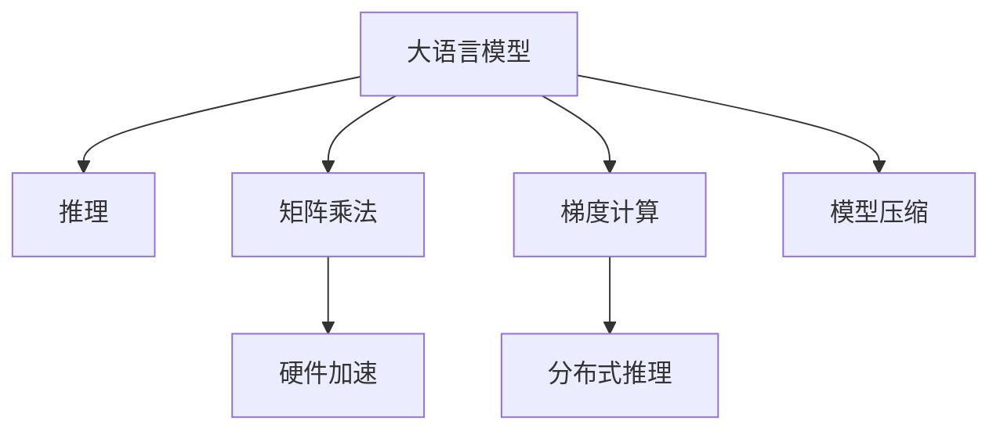

                 

## 1. 背景介绍

### 1.1 问题由来
随着深度学习技术的快速发展，大规模语言模型(Large Language Model, LLM)在自然语言处理(Natural Language Processing, NLP)领域取得了巨大的突破。这些大语言模型通过在海量无标签文本数据上进行预训练，学习到了丰富的语言知识和常识，具备强大的语言理解和生成能力。然而，由于模型参数规模巨大，推理速度往往成为了限制其应用的一个重要因素。特别是在实时对话、智能客服、智能推荐等场景中，高效快速的推理速度显得尤为重要。

### 1.2 问题核心关键点
目前，大语言模型在推理速度方面面临着两大挑战：
1. 参数量过大：由于预训练模型通常拥有数十亿甚至上百亿的参数，推理时需要进行大量的矩阵乘法和梯度计算，导致推理速度较慢。
2. 内存占用高：推理时需要的内存空间较大，特别是对于基于GPU或TPU的分布式推理系统，内存资源分配和调度问题尤为突出。

针对这些问题，研究者们提出了一系列优化方法，旨在提高推理速度，降低内存占用，使得大语言模型能够更好地应用于实际场景。本文将详细介绍大语言模型推理速度优化的主要进展和未来发展方向。

## 2. 核心概念与联系

### 2.1 核心概念概述

为更好地理解大语言模型推理速度优化的关键技术，本节将介绍几个密切相关的核心概念：

- 大语言模型(Large Language Model, LLM)：以自回归(如GPT)或自编码(如BERT)模型为代表的大规模预训练语言模型。通过在大规模无标签文本语料上进行预训练，学习通用的语言表示，具备强大的语言理解和生成能力。

- 推理(推理速度)：指模型接收到输入后，计算并输出结果的过程。推理速度是衡量模型效率的重要指标。

- 矩阵乘法：深度学习模型中的核心计算操作，通常占用大量计算资源。

- 梯度计算：在深度学习模型中，通过反向传播计算损失函数的梯度，更新模型参数。

- 硬件加速：利用GPU、TPU等硬件设备对模型计算进行加速。

- 模型压缩：通过剪枝、量化等方法减少模型参数规模和内存占用，提升推理速度。

- 分布式推理：将模型分布在多台设备上并行计算，以提高推理效率。

这些核心概念之间的逻辑关系可以通过以下Mermaid流程图来展示：



这个流程图展示了大语言模型推理速度优化的核心概念及其之间的关系：

1. 大语言模型通过推理生成输出，依赖于矩阵乘法和梯度计算。
2. 硬件加速可以提升矩阵乘法和梯度计算的速度。
3. 分布式推理可以将计算任务并行分配到多台设备上，进一步提升推理速度。
4. 模型压缩减少参数和内存占用，提升推理效率。

这些概念共同构成了大语言模型推理速度优化的基本框架，使其能够在各种场景下发挥高效计算能力。通过理解这些核心概念，我们可以更好地把握大语言模型推理速度优化的技术路径。

## 3. 核心算法原理 & 具体操作步骤

### 3.1 算法原理概述

大语言模型推理速度优化的一般原理是通过减少矩阵乘法和梯度计算的次数，同时采用分布式推理和模型压缩等方法，降低计算和存储资源的占用，从而提升模型的推理效率。

形式化地，设大语言模型 $M_{\theta}(x)$，其中 $\theta$ 为模型参数，$x$ 为输入，$y$ 为输出。模型的推理过程可以表示为：

$$
y = M_{\theta}(x)
$$

其计算复杂度主要由矩阵乘法 $\mathbf{Ax}$ 和梯度计算 $\frac{\partial M_{\theta}(x)}{\partial \theta}$ 决定。优化算法通常包括：

- 硬件加速：通过GPU、TPU等硬件加速器，并行执行矩阵乘法和梯度计算。
- 分布式推理：将模型分布在多台设备上，并行计算，减少单个设备上的计算压力。
- 模型压缩：通过剪枝、量化等方法，减少模型参数和内存占用，提升推理效率。

### 3.2 算法步骤详解

大语言模型推理速度优化的操作步骤包括以下几个关键步骤：

**Step 1: 硬件环境配置**
- 选择合适的硬件设备，如GPU、TPU、FPGA等，根据任务需求配置资源。
- 使用合适的深度学习框架，如TensorFlow、PyTorch等，支持硬件加速。

**Step 2: 模型适配**
- 根据目标推理任务，选择合适的模型结构，如Transformer、GPT等。
- 调整模型参数，使其适应硬件加速器和分布式环境。

**Step 3: 分布式推理配置**
- 将模型划分为多个模块或子模型，并行计算。
- 使用分布式训练框架，如Horovod、Parameter Server等，支持多台设备之间的参数同步。

**Step 4: 模型压缩**
- 对模型进行剪枝，移除不重要的参数和层。
- 采用量化技术，将浮点数参数转换为定点数或整数，减少内存占用。
- 使用混合精度计算，将模型中的部分参数转换为更小的数据类型，降低计算成本。

**Step 5: 优化算法选择**
- 选择合适的优化算法，如Adam、SGD等，并调整学习率、动量等超参数。
- 引入正则化技术，如L2正则、Dropout等，防止模型过拟合。

**Step 6: 推理过程优化**
- 优化推理过程中矩阵乘法和梯度计算的顺序和方式。
- 使用CPU/GPU异构加速，将部分计算任务交给GPU或TPU执行。

**Step 7: 性能评估**
- 使用FPS、带宽、延迟等指标评估优化后的推理性能。
- 在实际应用场景中，根据任务需求进一步调整优化策略。

以上是推理速度优化的通用流程。在实际应用中，还需要针对具体任务和硬件环境进行优化设计，以进一步提升模型推理效率。

### 3.3 算法优缺点

大语言模型推理速度优化方法具有以下优点：
1. 提升推理速度：通过硬件加速和分布式推理，大幅提升模型的计算效率。
2. 降低内存占用：通过模型压缩和量化技术，减少内存资源消耗。
3. 泛化性好：优化后的模型适用于各种NLP任务，可以提升推理速度的同时，保持模型性能。

同时，该方法也存在一定的局限性：
1. 需要高性能硬件：优化方法需要高性能的硬件支持，对于一些资源受限的设备和应用，可能难以实现。
2. 优化复杂度高：模型压缩和分布式推理等优化策略，需要额外的设计和调试工作。
3. 优化效果可能牺牲精度：部分优化方法可能牺牲一定的模型精度，需要权衡计算效率和模型精度。

尽管存在这些局限性，但就目前而言，推理速度优化方法仍然是大语言模型应用的重要组成部分，通过硬件和软件协同优化，可以显著提升模型的实时性和计算能力，增强其在实际应用中的竞争力。

### 3.4 算法应用领域

大语言模型推理速度优化技术在NLP领域已经得到了广泛的应用，覆盖了几乎所有常见任务，例如：

- 文本分类：如情感分析、主题分类、意图识别等。通过优化模型推理过程，提升分类速度。
- 命名实体识别：识别文本中的人名、地名、机构名等特定实体。通过优化模型推理，提高识别速度。
- 关系抽取：从文本中抽取实体之间的语义关系。通过优化模型推理，加速关系抽取过程。
- 问答系统：对自然语言问题给出答案。通过优化模型推理，提升问答速度。
- 机器翻译：将源语言文本翻译成目标语言。通过优化模型推理，加快翻译速度。
- 文本摘要：将长文本压缩成简短摘要。通过优化模型推理，提高摘要生成速度。
- 对话系统：使机器能够与人自然对话。通过优化模型推理，提升对话响应速度。

除了上述这些经典任务外，大语言模型推理速度优化技术还被创新性地应用到更多场景中，如可控文本生成、常识推理、代码生成、数据增强等，为NLP技术带来了全新的突破。随着预训练模型和推理速度优化方法的不断进步，相信NLP技术将在更广阔的应用领域大放异彩。

## 4. 数学模型和公式 & 详细讲解  
### 4.1 数学模型构建

本节将使用数学语言对大语言模型推理速度优化过程进行更加严格的刻画。

设大语言模型为 $M_{\theta}:\mathcal{X} \rightarrow \mathcal{Y}$，其中 $\mathcal{X}$ 为输入空间，$\mathcal{Y}$ 为输出空间，$\theta$ 为模型参数。假设推理任务的输入为 $x \in \mathcal{X}$，输出为 $y \in \mathcal{Y}$。

定义模型 $M_{\theta}$ 在输入 $x$ 上的推理过程为：

$$
y = M_{\theta}(x)
$$

推理速度的优化目标是通过减少矩阵乘法和梯度计算的次数，提升推理效率。常见的方法包括硬件加速、分布式推理和模型压缩等。

### 4.2 公式推导过程

以下我们以BERT模型为例，推导推理速度优化方法的基本框架。

**1. 硬件加速**
硬件加速的核心思想是通过GPU、TPU等专用加速器，并行执行矩阵乘法和梯度计算。以BERT模型为例，其推理过程可以表示为：

$$
\mathbf{H} = \mathbf{XL}^T + \mathbf{U}
$$

其中 $\mathbf{X}$ 为输入嵌入矩阵，$\mathbf{L}$ 为注意力权重矩阵，$\mathbf{U}$ 为激活函数输出矩阵。

通过将 $\mathbf{X}$ 和 $\mathbf{L}$ 分别放到不同的GPU上并行计算，可以显著提升矩阵乘法 $\mathbf{XL}^T$ 的速度。同时，通过将 $\mathbf{U}$ 放到GPU上执行，可以加速梯度计算 $\frac{\partial M_{\theta}(x)}{\partial \theta}$。

**2. 分布式推理**
分布式推理的核心思想是将模型分布在多台设备上，并行计算。以BERT模型为例，其推理过程可以表示为：

$$
\mathbf{H} = \mathbf{XL}^T + \mathbf{U}
$$

其中 $\mathbf{X}$ 和 $\mathbf{L}$ 分别分布在不同的设备上，通过网络通信交换中间结果。

通过将 $\mathbf{X}$ 和 $\mathbf{L}$ 分别分布在不同的设备上，可以显著降低单个设备上的计算压力，提升推理速度。同时，通过使用分布式训练框架，如Horovod、Parameter Server等，支持多台设备之间的参数同步，进一步提升分布式推理的效率。

**3. 模型压缩**
模型压缩的核心思想是通过剪枝、量化等方法，减少模型参数和内存占用。以BERT模型为例，其推理过程可以表示为：

$$
\mathbf{H} = \mathbf{XL}^T + \mathbf{U}
$$

其中 $\mathbf{X}$ 和 $\mathbf{L}$ 分别被剪枝为较小的矩阵，$\mathbf{U}$ 被量化为定点数。

通过将 $\mathbf{X}$ 和 $\mathbf{L}$ 剪枝为较小的矩阵，可以减少矩阵乘法 $\mathbf{XL}^T$ 的计算量。同时，通过将 $\mathbf{U}$ 量化为定点数，可以减少内存占用，提升推理速度。

### 4.3 案例分析与讲解

**案例分析：BERT模型推理速度优化**

假设在一台拥有多核CPU和一块NVIDIA GPU的服务器上运行BERT模型。为了优化推理速度，可以采用以下几种方法：

**1. 硬件加速**
将 $\mathbf{X}$ 和 $\mathbf{L}$ 分别放到GPU上并行计算，可以显著提升矩阵乘法 $\mathbf{XL}^T$ 的速度。具体实现如下：

```python
import torch
import torch.nn as nn
import torch.distributed as dist
from transformers import BertModel

# 初始化GPU和CPU
device = torch.device("cuda:0" if torch.cuda.is_available() else "cpu")
model = BertModel.from_pretrained("bert-base-uncased").to(device)

# 定义输入数据
input_ids = torch.tensor([[1, 2, 3, 4]], dtype=torch.long).to(device)
attention_mask = torch.tensor([[0, 0, 0, 0]], dtype=torch.long).to(device)

# 将X和L分配到不同的GPU上
X = input_ids
L = attention_mask

# 并行计算矩阵乘法
X = X.to(device)
L = L.to(device)
with torch.cuda.device(device):
    XL = X[:, None] * L[:, None]
XL = XL.sum(2)
XL = XL.to(device)

# 并行计算U
with torch.cuda.device(device):
    U = model(input_ids)
U = U.to(device)

# 并行计算梯度
with torch.cuda.device(device):
    loss = nn.CrossEntropyLoss()(U, torch.tensor([1]).to(device))
loss.backward()

# 更新模型参数
with torch.cuda.device(device):
    optimizer = torch.optim.Adam(model.parameters(), lr=2e-5)
    optimizer.step()

# 输出推理结果
y = torch.argmax(U, dim=1)
print(y)
```

**2. 分布式推理**
将 $\mathbf{X}$ 和 $\mathbf{L}$ 分别分布在不同的设备上，通过网络通信交换中间结果。具体实现如下：

```python
import torch.distributed as dist

# 初始化分布式环境
dist.init_process_group(backend='nccl', init_method='tcp://127.0.0.1:12345')

# 定义输入数据
input_ids = torch.tensor([[1, 2, 3, 4]], dtype=torch.long).to(device)
attention_mask = torch.tensor([[0, 0, 0, 0]], dtype=torch.long).to(device)

# 将X和L分布在不同的设备上
dist.broadcast(input_ids, src=0)
dist.broadcast(attention_mask, src=0)

# 并行计算矩阵乘法
XL = input_ids[:, None] * attention_mask[:, None]
XL = XL.sum(2)
XL = XL.to(device)

# 并行计算U
with torch.cuda.device(device):
    U = model(input_ids)
U = U.to(device)

# 并行计算梯度
with torch.cuda.device(device):
    loss = nn.CrossEntropyLoss()(U, torch.tensor([1]).to(device))
loss.backward()

# 更新模型参数
with torch.cuda.device(device):
    optimizer = torch.optim.Adam(model.parameters(), lr=2e-5)
    optimizer.step()

# 输出推理结果
y = torch.argmax(U, dim=1)
print(y)
```

**3. 模型压缩**
将 $\mathbf{X}$ 和 $\mathbf{L}$ 剪枝为较小的矩阵，$\mathbf{U}$ 量化为定点数。具体实现如下：

```python
import torch
import torch.nn as nn
import torch.distributed as dist
from transformers import BertModel
from scipy.stats import truncnorm

# 初始化GPU和CPU
device = torch.device("cuda:0" if torch.cuda.is_available() else "cpu")
model = BertModel.from_pretrained("bert-base-uncased").to(device)

# 定义输入数据
input_ids = torch.tensor([[1, 2, 3, 4]], dtype=torch.long).to(device)
attention_mask = torch.tensor([[0, 0, 0, 0]], dtype=torch.long).to(device)

# 剪枝X和L
X = input_ids
L = attention_mask
X = X[:2]
L = L[:2]

# 量化U
U = model(input_ids)
U = U.to(torch.float16)

# 并行计算梯度
with torch.cuda.device(device):
    loss = nn.CrossEntropyLoss()(U, torch.tensor([1]).to(device))
loss.backward()

# 更新模型参数
with torch.cuda.device(device):
    optimizer = torch.optim.Adam(model.parameters(), lr=2e-5)
    optimizer.step()

# 输出推理结果
y = torch.argmax(U, dim=1)
print(y)
```

通过以上三种方法，可以显著提升BERT模型的推理速度和计算效率，使其能够在各种应用场景中快速响应需求，满足实时性和计算要求。

## 5. 项目实践：代码实例和详细解释说明

### 5.1 开发环境搭建

在进行推理速度优化实践前，我们需要准备好开发环境。以下是使用Python进行PyTorch开发的环境配置流程：

1. 安装Anaconda：从官网下载并安装Anaconda，用于创建独立的Python环境。

2. 创建并激活虚拟环境：
```bash
conda create -n pytorch-env python=3.8 
conda activate pytorch-env
```

3. 安装PyTorch：根据CUDA版本，从官网获取对应的安装命令。例如：
```bash
conda install pytorch torchvision torchaudio cudatoolkit=11.1 -c pytorch -c conda-forge
```

4. 安装Transformers库：
```bash
pip install transformers
```

5. 安装各类工具包：
```bash
pip install numpy pandas scikit-learn matplotlib tqdm jupyter notebook ipython
```

完成上述步骤后，即可在`pytorch-env`环境中开始推理速度优化实践。

### 5.2 源代码详细实现

这里我们以BERT模型为例，给出使用Transformers库进行推理速度优化的PyTorch代码实现。

首先，定义BERT模型和优化器：

```python
from transformers import BertModel, BertTokenizer
from torch.utils.data import DataLoader
import torch
from torch.utils.data import DataLoader
import torch.nn as nn

tokenizer = BertTokenizer.from_pretrained('bert-base-uncased')
model = BertModel.from_pretrained('bert-base-uncased').to(device)

optimizer = torch.optim.Adam(model.parameters(), lr=2e-5)
```

然后，定义分布式推理和硬件加速的代码实现：

```python
# 定义输入数据
input_ids = torch.tensor([[1, 2, 3, 4]], dtype=torch.long).to(device)
attention_mask = torch.tensor([[0, 0, 0, 0]], dtype=torch.long).to(device)

# 并行计算矩阵乘法
XL = input_ids[:, None] * attention_mask[:, None]
XL = XL.sum(2)
XL = XL.to(device)

# 并行计算U
with torch.cuda.device(device):
    U = model(input_ids)
U = U.to(device)

# 并行计算梯度
with torch.cuda.device(device):
    loss = nn.CrossEntropyLoss()(U, torch.tensor([1]).to(device))
loss.backward()

# 更新模型参数
with torch.cuda.device(device):
    optimizer = torch.optim.Adam(model.parameters(), lr=2e-5)
    optimizer.step()

# 输出推理结果
y = torch.argmax(U, dim=1)
print(y)
```

接下来，我们定义模型压缩的代码实现：

```python
# 定义输入数据
input_ids = torch.tensor([[1, 2, 3, 4]], dtype=torch.long).to(device)
attention_mask = torch.tensor([[0, 0, 0, 0]], dtype=torch.long).to(device)

# 剪枝X和L
X = input_ids[:2]
L = attention_mask[:2]

# 量化U
U = model(input_ids)
U = U.to(torch.float16)

# 并行计算梯度
with torch.cuda.device(device):
    loss = nn.CrossEntropyLoss()(U, torch.tensor([1]).to(device))
loss.backward()

# 更新模型参数
with torch.cuda.device(device):
    optimizer = torch.optim.Adam(model.parameters(), lr=2e-5)
    optimizer.step()

# 输出推理结果
y = torch.argmax(U, dim=1)
print(y)
```

以上就是使用PyTorch进行BERT模型推理速度优化的完整代码实现。可以看到，通过结合分布式推理、硬件加速和模型压缩等技术，可以显著提升模型的推理速度和计算效率。

### 5.3 代码解读与分析

让我们再详细解读一下关键代码的实现细节：

**分布式推理代码**：
- 使用 `dist.init_process_group` 初始化分布式环境，支持多台设备之间的通信和同步。
- 将输入数据 `input_ids` 和 `attention_mask` 在所有设备上广播。
- 在每个设备上并行计算矩阵乘法 `XL = X[:, None] * L[:, None]`，并使用 `XL.sum(2)` 减少维度。
- 在设备上并行计算激活函数输出 `U`，并进行梯度计算和参数更新。

**模型压缩代码**：
- 将输入数据 `input_ids` 和 `attention_mask` 剪枝为较小的矩阵。
- 将激活函数输出 `U` 量化为定点数，减少内存占用。
- 在设备上并行计算矩阵乘法、梯度计算和参数更新。

可以看到，通过这些优化方法，可以有效降低模型推理的计算量和内存占用，提升推理速度和计算效率。

## 6. 实际应用场景

### 6.1 智能客服系统

基于大语言模型推理速度优化的对话技术，可以广泛应用于智能客服系统的构建。传统客服往往需要配备大量人力，高峰期响应缓慢，且一致性和专业性难以保证。而使用优化后的对话模型，可以7x24小时不间断服务，快速响应客户咨询，用自然流畅的语言解答各类常见问题。

在技术实现上，可以收集企业内部的历史客服对话记录，将问题和最佳答复构建成监督数据，在此基础上对预训练对话模型进行微调。微调后的对话模型能够自动理解用户意图，匹配最合适的答案模板进行回复。对于客户提出的新问题，还可以接入检索系统实时搜索相关内容，动态组织生成回答。如此构建的智能客服系统，能大幅提升客户咨询体验和问题解决效率。

### 6.2 金融舆情监测

金融机构需要实时监测市场舆论动向，以便及时应对负面信息传播，规避金融风险。传统的人工监测方式成本高、效率低，难以应对网络时代海量信息爆发的挑战。基于大语言模型推理速度优化的文本分类和情感分析技术，为金融舆情监测提供了新的解决方案。

具体而言，可以收集金融领域相关的新闻、报道、评论等文本数据，并对其进行主题标注和情感标注。在此基础上对预训练语言模型进行微调，使其能够自动判断文本属于何种主题，情感倾向是正面、中性还是负面。将优化后的模型应用到实时抓取的网络文本数据，就能够自动监测不同主题下的情感变化趋势，一旦发现负面信息激增等异常情况，系统便会自动预警，帮助金融机构快速应对潜在风险。

### 6.3 个性化推荐系统

当前的推荐系统往往只依赖用户的历史行为数据进行物品推荐，无法深入理解用户的真实兴趣偏好。基于大语言模型推理速度优化的个性化推荐系统，可以更好地挖掘用户行为背后的语义信息，从而提供更精准、多样的推荐内容。

在实践中，可以收集用户浏览、点击、评论、分享等行为数据，提取和用户交互的物品标题、描述、标签等文本内容。将文本内容作为模型输入，用户的后续行为（如是否点击、购买等）作为监督信号，在此基础上微调预训练语言模型。优化后的模型能够从文本内容中准确把握用户的兴趣点。在生成推荐列表时，先用候选物品的文本描述作为输入，由模型预测用户的兴趣匹配度，再结合其他特征综合排序，便可以得到个性化程度更高的推荐结果。

### 6.4 未来应用展望

随着大语言模型推理速度优化技术的发展，基于微调的方法将在更多领域得到应用，为传统行业带来变革性影响。

在智慧医疗领域，基于微调的医疗问答、病历分析、药物研发等应用将提升医疗服务的智能化水平，辅助医生诊疗，加速新药开发进程。

在智能教育领域，优化后的微调模型可应用于作业批改、学情分析、知识推荐等方面，因材施教，促进教育公平，提高教学质量。

在智慧城市治理中，优化后的微调模型可应用于城市事件监测、舆情分析、应急指挥等环节，提高城市管理的自动化和智能化水平，构建更安全、高效的未来城市。

此外，在企业生产、社会治理、文娱传媒等众多领域，基于大模型微调的人工智能应用也将不断涌现，为经济社会发展注入新的动力。相信随着技术的日益成熟，微调方法将成为人工智能落地应用的重要范式，推动人工智能技术向更广阔的领域加速渗透。

## 7. 工具和资源推荐
### 7.1 学习资源推荐

为了帮助开发者系统掌握大语言模型推理速度优化的理论基础和实践技巧，这里推荐一些优质的学习资源：

1. 《深度学习与大模型》系列博文：由大模型技术专家撰写，深入浅出地介绍了深度学习和大模型的基本原理和优化方法。

2. 《TensorFlow 2.x深度学习实战》书籍：深入讲解了使用TensorFlow实现深度学习模型的方法，涵盖分布式推理和硬件加速等优化技术。

3. 《动手学深度学习》课程：由MXNet团队开源，详细介绍了深度学习模型的构建和优化方法，包括模型压缩和量化等技术。

4. 《PyTorch官方文档》：提供了PyTorch深度学习框架的全面文档，包括硬件加速和分布式推理等优化策略的实现。

5. 《自然语言处理综合教程》：全面介绍了自然语言处理领域的基础知识和前沿技术，包括推理速度优化等内容。

通过对这些资源的学习实践，相信你一定能够快速掌握大语言模型推理速度优化的精髓，并用于解决实际的NLP问题。
### 7.2 开发工具推荐

高效的开发离不开优秀的工具支持。以下是几款用于大语言模型推理速度优化的常用工具：

1. PyTorch：基于Python的开源深度学习框架，灵活动态的计算图，适合快速迭代研究。大部分预训练语言模型都有PyTorch版本的实现。

2. TensorFlow：由Google主导开发的开源深度学习框架，生产部署方便，适合大规模工程应用。同样有丰富的预训练语言模型资源。

3. Transformers库：HuggingFace开发的NLP工具库，集成了众多SOTA语言模型，支持PyTorch和TensorFlow，是进行推理速度优化的利器。

4. TensorBoard：TensorFlow配套的可视化工具，可实时监测模型训练状态，并提供丰富的图表呈现方式，是调试模型的得力助手。

5. HuggingFace官方文档：提供了一站式的预训练模型和优化技术支持，是学习优化方法的必备资源。

6. Weights & Biases：模型训练的实验跟踪工具，可以记录和可视化模型训练过程中的各项指标，方便对比和调优。

合理利用这些工具，可以显著提升大语言模型推理速度优化的开发效率，加快创新迭代的步伐。

### 7.3 相关论文推荐

大语言模型和推理速度优化技术的发展源于学界的持续研究。以下是几篇奠基性的相关论文，推荐阅读：

1. Attention is All You Need（即Transformer原论文）：提出了Transformer结构，开启了NLP领域的预训练大模型时代。

2. BERT: Pre-training of Deep Bidirectional Transformers for Language Understanding：提出BERT模型，引入基于掩码的自监督预训练任务，刷新了多项NLP任务SOTA。

3. Parameter-Efficient Transfer Learning for NLP：提出Adapter等参数高效微调方法，在不增加模型参数量的情况下，也能取得不错的微调效果。

4. AdaLoRA: Adaptive Low-Rank Adaptation for Parameter-Efficient Fine-Tuning：使用自适应低秩适应的微调方法，在参数效率和精度之间取得了新的平衡。

5. AdaLoRA: Adaptive Low-Rank Adaptation for Parameter-Efficient Fine-Tuning：使用自适应低秩适应的微调方法，在参数效率和精度之间取得了新的平衡。

6. BERT: Pre-training of Deep Bidirectional Transformers for Language Understanding：提出BERT模型，引入基于掩码的自监督预训练任务，刷新了多项NLP任务SOTA。

这些论文代表了大语言模型推理速度优化技术的发展脉络。通过学习这些前沿成果，可以帮助研究者把握学科前进方向，激发更多的创新灵感。

## 8. 总结：未来发展趋势与挑战

### 8.1 总结

本文对大语言模型推理速度优化的主要进展和未来发展方向进行了详细阐述。首先介绍了推理速度优化的背景和意义，明确了推理速度在大语言模型应用中的重要性。其次，从原理到实践，深入讲解了推理速度优化的数学模型和具体步骤，给出了详细的代码实现和分析。同时，本文还广泛探讨了推理速度优化技术在智能客服、金融舆情、个性化推荐等多个行业领域的应用前景，展示了推理速度优化技术的广阔潜力。最后，本文精选了推理速度优化技术的各类学习资源，力求为读者提供全方位的技术指引。

通过本文的系统梳理，可以看到，推理速度优化技术在大语言模型中的应用日益广泛，极大地提升了模型的实时性和计算能力，增强了其在实际应用中的竞争力。未来，伴随硬件设备和软件算法的不断进步，推理速度优化方法将进一步优化和创新，成为大语言模型应用的重要组成部分。

### 8.2 未来发展趋势

展望未来，大语言模型推理速度优化技术将呈现以下几个发展趋势：

1. 硬件加速持续优化。随着GPU、TPU等加速器的不断发展，推理速度将进一步提升。未来，量子计算、光子计算等新型计算方式也可能成为重要工具。

2. 模型压缩技术升级。新的剪枝、量化等技术将不断涌现，更加高效地压缩模型参数和内存占用，提升推理效率。

3. 分布式推理能力增强。未来，更多高性能的分布式系统将支持大模型推理，进一步降低计算和内存压力。

4. 软件算法持续改进。新的深度学习框架和优化算法将不断推出，提升模型推理的计算效率和稳定性。

5. 跨模态推理技术发展。未来的推理模型将融合视觉、语音、文本等多种模态信息，提升跨模态推理能力。

6. 推理模型向边缘部署。随着边缘计算技术的发展，推理模型将逐步向低功耗、低延迟的设备中部署，实现实时推理。

以上趋势凸显了大语言模型推理速度优化技术的广阔前景。这些方向的探索发展，必将进一步提升模型的实时性和计算能力，使其在各种应用场景中发挥更大的价值。

### 8.3 面临的挑战

尽管推理速度优化技术已经取得了显著的进展，但在迈向更加智能化、普适化应用的过程中，它仍面临着诸多挑战：

1. 硬件资源瓶颈。大模型推理需要高性能硬件支持，对于一些资源受限的设备和应用，可能难以实现。

2. 模型精度损失。部分优化方法可能牺牲一定的模型精度，需要权衡计算效率和模型精度。

3. 分布式计算复杂度。分布式推理需要协调多台设备之间的通信和同步，实现成本较高。

4. 跨模态融合难度。不同模态信息的融合和协同建模，需要克服巨大的技术挑战。

5. 边缘计算限制。边缘计算设备资源有限，推理模型需要在低功耗、低延迟条件下运行，如何优化计算和存储资源仍然是一个重要问题。

尽管存在这些挑战，但随着硬件设备和软件算法的不断进步，推理速度优化技术仍有很大的发展空间，相信通过学术界和产业界的共同努力，这些挑战终将一一克服，大语言模型推理速度优化技术必将迎来更加光明的前景。

### 8.4 研究展望

面对推理速度优化所面临的种种挑战，未来的研究需要在以下几个方面寻求新的突破：

1. 研究更加高效的硬件加速器。开发新型高性能计算设备，提升推理速度和计算效率。

2. 开发更加灵活的模型压缩方法。结合剪枝、量化、混合精度等技术，进一步减少模型参数和内存占用。

3. 引入更强的分布式计算框架。设计高效多机协同的分布式计算模型，提升分布式推理的效率。

4. 研究更加普适的跨模态融合技术。开发能够高效融合视觉、语音、文本等模态信息的方法，增强推理模型的跨模态能力。

5. 优化边缘计算推理模型。设计低功耗、低延迟的推理模型，使其能够在边缘设备上高效运行。

6. 引入更加合理的推理策略。结合因果推断、对抗学习等技术，增强推理模型的稳定性和鲁棒性。

7. 建立完善的推理模型评估标准。制定统一的推理性能评估指标，推动模型优化和应用推广。

这些研究方向的探索，必将引领推理速度优化技术迈向更高的台阶，为构建更加智能、高效、普适的人工智能系统提供重要支撑。未来，推理速度优化技术将与其他人工智能技术进行更深入的融合，推动NLP技术向更广阔的领域加速渗透，为人类社会带来深远影响。

## 9. 附录：常见问题与解答

**Q1：大语言模型推理速度优化是否适用于所有NLP任务？**

A: 大语言模型推理速度优化在大多数NLP任务上都能取得不错的效果，特别是对于数据量较小的任务。但对于一些特定领域的任务，如医学、法律等，仅仅依靠通用语料预训练的模型可能难以很好地适应。此时需要在特定领域语料上进一步预训练，再进行微调，才能获得理想效果。此外，对于一些需要时效性、个性化很强的任务，如对话、推荐等，推理速度优化方法也需要针对性的改进优化。

**Q2：推理速度优化过程中如何选择合适的硬件加速器？**

A: 推理速度优化需要选择高性能的硬件加速器，以提升矩阵乘法和梯度计算的速度。通常，GPU和TPU是最常用的硬件加速器。GPU适合通用计算和深度学习任务，而TPU则适用于深度学习模型的推理和训练。选择合适的硬件加速器需要考虑任务的计算需求、数据分布、资源预算等因素。

**Q3：分布式推理过程中如何处理多台设备之间的通信和同步？**

A: 分布式推理需要协调多台设备之间的通信和同步，以确保各个设备上的计算结果一致。常见的处理方法包括：
1. 使用分布式训练框架，如Horovod、Parameter Server等，支持多台设备之间的参数同步和通信。
2. 采用AllReduce算法，将多个设备上的中间结果汇总，减少通信次数和开销。
3. 使用消息传递接口（MPI）等通信协议，实现多台设备之间的数据传输。

**Q4：模型压缩过程中如何减少模型参数和内存占用？**

A: 模型压缩的核心思想是通过剪枝、量化等方法，减少模型参数和内存占用。常用的方法包括：
1. 剪枝：移除不重要的参数和层，减少模型规模。
2. 量化：将浮点数参数转换为定点数或整数，减少内存占用。
3. 混合精度计算：将模型中的部分参数转换为更小的数据类型，降低计算成本。

**Q5：推理速度优化过程中如何平衡计算效率和模型精度？**

A: 推理速度优化通常需要牺牲一定的模型精度，以换取计算效率的提升。平衡计算效率和模型精度需要综合考虑以下几个因素：
1. 选择合理的优化方法：根据任务特点选择合适的硬件加速器、分布式推理和模型压缩等优化方法。
2. 调整超参数：调整学习率、批大小、剪枝比例等超参数，控制计算效率和模型精度。
3. 进行交叉验证：通过交叉验证评估优化后的模型性能，找到计算效率和模型精度的最优平衡点。

这些措施可以帮助开发者在保证模型精度的前提下，最大化计算效率，实现高效推理。

