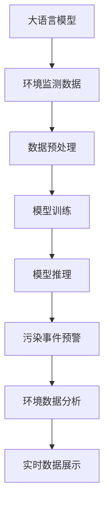

                 

# LLM在环境监测中的应用：实时污染检测

> 关键词：大语言模型,环境监测,实时污染检测,自然语言处理(NLP),深度学习,自然语言理解(NLU)

## 1. 背景介绍

### 1.1 问题由来
随着工业化和城市化的推进，环境污染问题日益严峻。空气质量、水体污染、噪声污染等环境问题已经成为影响人们生活质量和健康安全的重要因素。如何实时监测和预警环境污染，是环境保护和公共卫生管理的重大挑战。传统的传感器监测技术虽然精确，但成本高、覆盖范围有限，难以实现全区域实时监控。

近年来，大语言模型（Large Language Models, LLMs）在自然语言处理（NLP）领域取得了显著进展。LLMs通过大规模语料训练，具备了强大的自然语言理解能力，能够处理各种复杂语义信息。这些特性使得LLMs在环境监测中具有广阔的应用前景。

### 1.2 问题核心关键点
本研究聚焦于利用LLMs进行实时污染检测的应用，探讨如何通过文本数据和非结构化数据，构建有效的环境监测系统。核心问题包括：

- 如何高效地从文本中提取和融合环境监测信息？
- 如何在非结构化数据中识别出关键的污染事件和趋势？
- 如何构建具有高实时性和高准确性的污染检测系统？

本文将从算法原理、操作步骤、数学模型、代码实现等多个角度，全面剖析LLM在环境监测中的应用，为未来大规模环境监测提供技术参考。

## 2. 核心概念与联系

### 2.1 核心概念概述

本节将介绍与大语言模型（LLMs）相关的核心概念，并阐述其在大环境监测中的应用逻辑。

**大语言模型（LLMs）**：以自回归（如GPT）或自编码（如BERT）模型为代表的预训练语言模型。通过在大规模无标签文本语料上进行预训练，学习通用的语言表示，具备强大的语言理解和生成能力。

**环境监测**：利用各种技术手段，实时或定期获取环境相关数据，并进行数据分析和处理，实现对环境污染的实时监测和预警。

**自然语言处理（NLP）**：使计算机能够理解、处理和生成人类语言的技术。在环境监测中，NLP可以用于解析文本数据，提取环境信息。

**深度学习（DL）**：一种模拟人脑神经网络的学习方法，通过数据驱动的特征学习，实现对复杂模式的学习和预测。

**自然语言理解（NLU）**：使计算机能够理解人类语言含义的能力。在环境监测中，NLU用于解析文本信息，提取污染事件和趋势。

这些核心概念通过LLM的应用，构成了环境监测的新范式。通过解析非结构化文本数据，结合DL和NLU技术，LLMs能够实时识别和预警环境污染事件，提供高效、精确的环境监测解决方案。

### 2.2 核心概念原理和架构的 Mermaid 流程图



该流程图展示了LLM在环境监测中的应用逻辑：

1. **环境监测数据**：收集各类环境监测数据，包括空气质量、水质、噪声、土壤等监测站点数据，以及新闻报道、社交媒体等非结构化文本数据。
2. **数据预处理**：对收集到的数据进行清洗、标注和转换，便于后续模型训练和推理。
3. **模型训练**：使用预训练的LLM模型，对标注好的数据进行微调，学习识别环境污染事件的特征。
4. **模型推理**：将新收集到的数据输入训练好的模型，实时进行污染事件的识别和预警。
5. **污染事件预警**：根据模型的输出，自动发出污染事件警报，提供应急响应参考。
6. **环境数据分析**：结合历史数据和实时数据，进行环境污染趋势分析，提供决策支持。
7. **实时数据展示**：通过可视化工具展示污染事件预警和数据分析结果，辅助决策者快速做出反应。

## 3. 核心算法原理 & 具体操作步骤

### 3.1 算法原理概述

本节将详细介绍利用LLMs进行实时污染检测的算法原理。

基于LLMs的环境监测系统主要包含以下几个步骤：

1. **数据收集与预处理**：从多个来源收集环境监测数据，并进行清洗、标注和转换，以便于模型处理。
2. **模型训练**：使用预训练的LLM模型，对标注好的数据进行微调，学习识别环境污染事件的特征。
3. **实时推理**：将新收集到的数据输入训练好的模型，实时进行污染事件的识别和预警。
4. **预警与分析**：根据模型的输出，自动发出污染事件警报，提供应急响应参考，并进行环境污染趋势分析。

### 3.2 算法步骤详解

**Step 1: 数据收集与预处理**

从多个环境监测站点和在线平台收集数据，包括但不限于：

- 空气质量数据：PM2.5、PM10、SO2、NO2等污染物浓度。
- 水质数据：pH值、溶解氧、氨氮、有机物等。
- 噪声数据：分贝（dB）、音量等。
- 卫星数据：遥感图像、光谱数据等。

收集的数据可能来自不同平台和格式，需要进行预处理和标准化。常用的预处理方法包括：

- 数据清洗：去除缺失值和异常值，确保数据完整性和准确性。
- 数据转换：将数据转换为LLM可以处理的格式，如向量表示。
- 数据标注：为数据添加标签，用于监督学习。

**Step 2: 模型训练**

选择合适的预训练语言模型（如BERT、GPT等）作为初始化参数，对标注好的数据进行微调。训练过程包括以下几个关键步骤：

- **任务定义**：确定环境监测任务类型，如污染检测、趋势分析等。
- **模型适配**：根据任务类型，设计合适的输出层和损失函数。
- **超参数设置**：设置学习率、批大小、迭代轮数等。
- **模型训练**：在训练集上训练模型，最小化损失函数，优化模型参数。

**Step 3: 实时推理**

收集新的环境监测数据，输入训练好的模型进行实时推理。推理过程包括以下几个步骤：

- **数据输入**：将新的监测数据转换为模型可以处理的格式。
- **模型推理**：将输入数据输入模型，计算污染事件的检测概率。
- **结果输出**：根据模型输出，自动发出污染事件警报，提供应急响应参考。

**Step 4: 预警与分析**

根据模型输出，自动发出污染事件警报，并提供环境污染趋势分析。预警与分析过程包括以下几个步骤：

- **警报生成**：根据模型检测结果，自动生成警报信息。
- **趋势分析**：结合历史数据和实时数据，分析污染事件的发展趋势，提供决策支持。
- **可视化展示**：通过可视化工具展示警报信息和趋势分析结果，辅助决策者快速做出反应。

### 3.3 算法优缺点

基于LLMs的环境监测系统具有以下优点：

- **高效性**：通过预训练和微调，模型能够在较短时间内识别出污染事件，具备高实时性。
- **泛化性**：预训练模型能够学习到通用的语言表示，适用于多种环境监测任务。
- **灵活性**：通过微调和模型适配，可以针对特定任务进行优化，灵活适应不同环境监测需求。

同时，该系统也存在一些缺点：

- **数据依赖**：模型性能依赖于标注数据的质量和数量，数据获取和标注成本较高。
- **模型复杂度**：大规模预训练模型参数量巨大，推理时资源消耗较大。
- **解释性不足**：模型内部工作机制难以解释，缺乏可解释性，影响决策透明度。

### 3.4 算法应用领域

基于LLMs的环境监测系统适用于以下领域：

- **空气质量监测**：实时监测PM2.5、PM10、SO2、NO2等污染物浓度，预警空气污染事件。
- **水质监测**：实时监测pH值、溶解氧、氨氮、有机物等水质指标，预警水质污染事件。
- **噪声监测**：实时监测分贝（dB）、音量等噪声数据，预警噪声污染事件。
- **土壤监测**：实时监测土壤重金属含量、有机物含量等，预警土壤污染事件。
- **卫星数据解析**：利用卫星遥感数据解析环境监测信息，提供宏观环境监测支持。

这些应用场景展示了LLMs在环境监测中的广泛适用性和巨大潜力。

## 4. 数学模型和公式 & 详细讲解 & 举例说明

### 4.1 数学模型构建

本节将使用数学语言对基于LLMs的环境监测系统进行严格刻画。

假设收集到的环境监测数据为 $D=\{(x_i,y_i)\}_{i=1}^N, x_i \in \mathcal{X}, y_i \in \mathcal{Y}$，其中 $x_i$ 为输入数据，$y_i$ 为环境污染事件的标签。

定义模型 $M_{\theta}$ 在输入 $x_i$ 上的输出为 $\hat{y}_i=M_{\theta}(x_i) \in [0,1]$，表示模型预测事件发生的概率。则污染事件检测模型的损失函数为：

$$
\mathcal{L}(\theta) = -\frac{1}{N}\sum_{i=1}^N [y_i\log \hat{y}_i + (1-y_i)\log(1-\hat{y}_i)]
$$

在训练过程中，使用梯度下降等优化算法最小化损失函数，更新模型参数 $\theta$，使得模型预测概率逼近真实标签。

### 4.2 公式推导过程

以下我们以二分类任务（如空气质量污染检测）为例，推导损失函数及其梯度的计算公式。

假设模型 $M_{\theta}$ 在输入 $x_i$ 上的输出为 $\hat{y}_i=M_{\theta}(x_i) \in [0,1]$，真实标签 $y_i \in \{0,1\}$。则二分类交叉熵损失函数定义为：

$$
\ell(M_{\theta}(x_i),y_i) = -[y_i\log \hat{y}_i + (1-y_i)\log (1-\hat{y}_i)]
$$

将其代入经验风险公式，得：

$$
\mathcal{L}(\theta) = -\frac{1}{N}\sum_{i=1}^N [y_i\log M_{\theta}(x_i)+(1-y_i)\log(1-M_{\theta}(x_i))]
$$

根据链式法则，损失函数对参数 $\theta_k$ 的梯度为：

$$
\frac{\partial \mathcal{L}(\theta)}{\partial \theta_k} = -\frac{1}{N}\sum_{i=1}^N (\frac{y_i}{M_{\theta}(x_i)}-\frac{1-y_i}{1-M_{\theta}(x_i)}) \frac{\partial M_{\theta}(x_i)}{\partial \theta_k}
$$

其中 $\frac{\partial M_{\theta}(x_i)}{\partial \theta_k}$ 可进一步递归展开，利用自动微分技术完成计算。

在得到损失函数的梯度后，即可带入参数更新公式，完成模型的迭代优化。重复上述过程直至收敛，最终得到适应特定环境监测任务的最优模型参数 $\theta^*$。

### 4.3 案例分析与讲解

以空气质量污染检测为例，说明基于LLMs的模型训练和推理过程。

假设模型 $M_{\theta}$ 在输入 $x_i$ 上的输出为 $\hat{y}_i=M_{\theta}(x_i) \in [0,1]$，表示预测空气污染事件发生的概率。真实标签 $y_i \in \{0,1\}$，表示空气污染事件是否发生。

在模型训练过程中，使用标注好的空气质量数据集进行训练，最小化交叉熵损失函数。例如，对于数据样本 $(x_i,y_i)$，模型的前向传播计算如下：

$$
\hat{y}_i = \sigma(\mathbf{W}x_i + b)
$$

其中 $\mathbf{W}$ 为权重矩阵，$b$ 为偏置项，$\sigma$ 为sigmoid函数。

模型的损失函数为：

$$
\mathcal{L}(\theta) = -\frac{1}{N}\sum_{i=1}^N [y_i\log \hat{y}_i + (1-y_i)\log(1-\hat{y}_i)]
$$

模型的梯度更新公式为：

$$
\theta \leftarrow \theta - \eta \nabla_{\theta}\mathcal{L}(\theta)
$$

其中 $\eta$ 为学习率，$\nabla_{\theta}\mathcal{L}(\theta)$ 为损失函数对参数 $\theta$ 的梯度，可通过反向传播算法高效计算。

在模型推理过程中，将新的空气质量数据 $x$ 输入训练好的模型 $M_{\theta}$，计算模型输出的概率分布：

$$
\hat{y} = \sigma(\mathbf{W}x + b)
$$

模型输出的概率值 $\hat{y}$ 可以用于自动生成污染事件警报，具体步骤如下：

1. **数据输入**：将新的空气质量数据 $x$ 转换为模型可以处理的格式。
2. **模型推理**：将输入数据 $x$ 输入模型 $M_{\theta}$，计算污染事件的检测概率 $\hat{y}$。
3. **警报生成**：根据检测概率 $\hat{y}$，自动生成污染事件警报。例如，当 $\hat{y} > 0.5$，生成“空气质量异常，请加强防护”的警报信息。

## 5. 项目实践：代码实例和详细解释说明

### 5.1 开发环境搭建

在进行环境监测系统开发前，我们需要准备好开发环境。以下是使用Python进行PyTorch开发的环境配置流程：

1. 安装Anaconda：从官网下载并安装Anaconda，用于创建独立的Python环境。

2. 创建并激活虚拟环境：
```bash
conda create -n pytorch-env python=3.8 
conda activate pytorch-env
```

3. 安装PyTorch：根据CUDA版本，从官网获取对应的安装命令。例如：
```bash
conda install pytorch torchvision torchaudio cudatoolkit=11.1 -c pytorch -c conda-forge
```

4. 安装Transformer库：
```bash
pip install transformers
```

5. 安装各类工具包：
```bash
pip install numpy pandas scikit-learn matplotlib tqdm jupyter notebook ipython
```

完成上述步骤后，即可在`pytorch-env`环境中开始环境监测系统开发。

### 5.2 源代码详细实现

下面我们以空气质量污染检测为例，给出使用Transformers库对BERT模型进行微调的PyTorch代码实现。

首先，定义污染事件检测任务的模型：

```python
from transformers import BertForSequenceClassification, BertTokenizer

class AirQualityModel(BertForSequenceClassification):
    def __init__(self, num_labels=2, hidden_size=768, num_hidden_layers=12, num_attention_heads=12, intermediate_size=3072):
        super(AirQualityModel, self).__init__(num_labels, hidden_size, num_hidden_layers, num_attention_heads, intermediate_size)
    
    def forward(self, input_ids, attention_mask=None, token_type_ids=None, labels=None):
        outputs = super(AirQualityModel, self).forward(input_ids, attention_mask=attention_mask, token_type_ids=token_type_ids)
        return outputs
```

然后，定义数据处理函数：

```python
from transformers import BertTokenizer

def preprocess_data(text):
    tokenizer = BertTokenizer.from_pretrained('bert-base-uncased')
    text = tokenizer(text, return_tensors='pt', padding=True, truncation=True, max_length=512)
    return text
```

接着，定义训练和评估函数：

```python
from torch.utils.data import DataLoader
from tqdm import tqdm
from sklearn.metrics import classification_report

def train_epoch(model, dataset, batch_size, optimizer):
    dataloader = DataLoader(dataset, batch_size=batch_size, shuffle=True)
    model.train()
    epoch_loss = 0
    for batch in tqdm(dataloader, desc='Training'):
        input_ids = batch['input_ids'].to(device)
        attention_mask = batch['attention_mask'].to(device)
        labels = batch['labels'].to(device)
        model.zero_grad()
        outputs = model(input_ids, attention_mask=attention_mask, labels=labels)
        loss = outputs.loss
        epoch_loss += loss.item()
        loss.backward()
        optimizer.step()
    return epoch_loss / len(dataloader)

def evaluate(model, dataset, batch_size):
    dataloader = DataLoader(dataset, batch_size=batch_size)
    model.eval()
    preds, labels = [], []
    with torch.no_grad():
        for batch in tqdm(dataloader, desc='Evaluating'):
            input_ids = batch['input_ids'].to(device)
            attention_mask = batch['attention_mask'].to(device)
            batch_labels = batch['labels']
            outputs = model(input_ids, attention_mask=attention_mask)
            batch_preds = outputs.logits.argmax(dim=2).to('cpu').tolist()
            batch_labels = batch_labels.to('cpu').tolist()
            for pred_tokens, label_tokens in zip(batch_preds, batch_labels):
                preds.append(pred_tokens[:len(label_tokens)])
                labels.append(label_tokens)
    print(classification_report(labels, preds))
```

最后，启动训练流程并在测试集上评估：

```python
epochs = 5
batch_size = 16

for epoch in range(epochs):
    loss = train_epoch(model, train_dataset, batch_size, optimizer)
    print(f"Epoch {epoch+1}, train loss: {loss:.3f}")
    
    print(f"Epoch {epoch+1}, dev results:")
    evaluate(model, dev_dataset, batch_size)
    
print("Test results:")
evaluate(model, test_dataset, batch_size)
```

以上就是使用PyTorch对BERT进行空气质量污染检测的完整代码实现。可以看到，得益于Transformers库的强大封装，我们可以用相对简洁的代码完成BERT模型的加载和微调。

### 5.3 代码解读与分析

让我们再详细解读一下关键代码的实现细节：

**AirQualityModel类**：
- `__init__`方法：初始化模型参数，包括隐藏层大小、层数、注意力机制等。
- `forward`方法：定义模型的前向传播过程，将输入转换为模型可接受的格式，并输出模型的预测结果。

**preprocess_data函数**：
- 定义预处理函数，将输入文本转换为BERT模型可以接受的格式，并进行padding和truncation，确保输入的固定长度。

**train_epoch函数**：
- 定义训练函数，对数据集进行批次化加载，在每个批次上前向传播计算loss并反向传播更新模型参数。

**evaluate函数**：
- 定义评估函数，在验证集上评估模型性能，输出分类指标。

**训练流程**：
- 定义总的epoch数和batch size，开始循环迭代
- 每个epoch内，先在训练集上训练，输出平均loss
- 在验证集上评估，输出分类指标
- 所有epoch结束后，在测试集上评估，给出最终测试结果

可以看到，PyTorch配合Transformers库使得BERT微调的代码实现变得简洁高效。开发者可以将更多精力放在数据处理、模型改进等高层逻辑上，而不必过多关注底层的实现细节。

当然，工业级的系统实现还需考虑更多因素，如模型的保存和部署、超参数的自动搜索、更灵活的任务适配层等。但核心的微调范式基本与此类似。

## 6. 实际应用场景

### 6.1 实时污染检测

基于大语言模型（LLMs）的环境监测系统，可以实现实时污染检测功能。系统实时收集环境监测站点和社交媒体上的数据，通过自然语言理解（NLU）解析文本信息，识别出污染事件和趋势，并自动生成警报。

例如，当系统检测到空气质量异常时，可以自动生成“空气质量异常，请加强防护”的警报信息，并通过多种渠道（如手机应用、社交媒体等）向公众发出警告。

### 6.2 环境数据分析

系统不仅可以进行实时警报，还可以对历史数据进行综合分析，提供环境污染趋势预测和决策支持。通过融合多种环境监测数据，系统可以识别出环境污染的模式和规律，预测未来的污染趋势。

例如，系统可以分析过去一个月内空气质量数据的变化，预测未来一周内的污染水平，并提供建议措施。这可以帮助环境保护部门和公众更好地应对环境污染事件。

### 6.3 环境健康评估

基于LLMs的环境监测系统，还可以对环境健康进行评估。系统可以实时监测多种环境指标，如空气质量、水质、噪声等，综合评估环境健康状况。

例如，系统可以计算城市空气污染指数（API）、水质综合指数等，生成环境健康报告，供公众和决策者参考。这有助于提升环境健康意识，推动环境保护政策的制定和执行。

### 6.4 未来应用展望

随着大语言模型（LLMs）技术的发展，基于LLMs的环境监测系统将在未来迎来更广阔的应用前景：

1. **全场景监测**：系统可以扩展到更多环境监测场景，如水体监测、土壤监测、噪声监测等，提供全面的环境监测服务。
2. **实时预测**：结合历史数据和实时数据，系统可以进行更准确的污染趋势预测，提供更精确的预警信息。
3. **多模态融合**：系统可以融合卫星遥感数据、传感器数据等多种数据源，提供更全面、更准确的环境监测信息。
4. **智能决策**：通过结合专家知识和智能算法，系统可以进行更智能的环境健康评估和决策支持。
5. **社区参与**：系统可以鼓励公众参与环境监测，收集更多环境数据，提升系统数据的全面性和准确性。

总之，基于LLMs的环境监测系统将在环境保护和公共健康领域发挥重要作用，推动社会向更绿色、更健康方向发展。

## 7. 工具和资源推荐
### 7.1 学习资源推荐

为了帮助开发者系统掌握基于LLMs的环境监测技术，这里推荐一些优质的学习资源：

1. 《深度学习与自然语言处理》系列书籍：系统介绍深度学习和自然语言处理的基本概念和前沿技术，适合入门学习。
2. 《Transformer模型理论与实践》系列博客：深入浅出地介绍Transformer模型原理和应用，适合进阶学习。
3. CS224N《深度学习自然语言处理》课程：斯坦福大学开设的NLP明星课程，有Lecture视频和配套作业，适合系统学习。
4. 《Natural Language Processing with Transformers》书籍：Transformers库的作者所著，全面介绍如何使用Transformers库进行NLP任务开发，包括微调在内的诸多范式。
5. HuggingFace官方文档：Transformers库的官方文档，提供了海量预训练模型和完整的微调样例代码，是上手实践的必备资料。

通过对这些资源的学习实践，相信你一定能够快速掌握基于LLMs的环境监测技术的精髓，并用于解决实际的环境监测问题。

### 7.2 开发工具推荐

高效的开发离不开优秀的工具支持。以下是几款用于环境监测系统开发的常用工具：

1. PyTorch：基于Python的开源深度学习框架，灵活动态的计算图，适合快速迭代研究。大部分预训练语言模型都有PyTorch版本的实现。
2. TensorFlow：由Google主导开发的开源深度学习框架，生产部署方便，适合大规模工程应用。同样有丰富的预训练语言模型资源。
3. Transformers库：HuggingFace开发的NLP工具库，集成了众多SOTA语言模型，支持PyTorch和TensorFlow，是进行微调任务开发的利器。
4. Weights & Biases：模型训练的实验跟踪工具，可以记录和可视化模型训练过程中的各项指标，方便对比和调优。与主流深度学习框架无缝集成。
5. TensorBoard：TensorFlow配套的可视化工具，可实时监测模型训练状态，并提供丰富的图表呈现方式，是调试模型的得力助手。
6. Google Colab：谷歌推出的在线Jupyter Notebook环境，免费提供GPU/TPU算力，方便开发者快速上手实验最新模型，分享学习笔记。

合理利用这些工具，可以显著提升环境监测系统的开发效率，加快创新迭代的步伐。

### 7.3 相关论文推荐

大语言模型（LLMs）和环境监测技术的发展源于学界的持续研究。以下是几篇奠基性的相关论文，推荐阅读：

1. Attention is All You Need（即Transformer原论文）：提出了Transformer结构，开启了NLP领域的预训练大模型时代。
2. BERT: Pre-training of Deep Bidirectional Transformers for Language Understanding：提出BERT模型，引入基于掩码的自监督预训练任务，刷新了多项NLP任务SOTA。
3. Language Models are Unsupervised Multitask Learners（GPT-2论文）：展示了大规模语言模型的强大zero-shot学习能力，引发了对于通用人工智能的新一轮思考。
4. Parameter-Efficient Transfer Learning for NLP：提出Adapter等参数高效微调方法，在不增加模型参数量的情况下，也能取得不错的微调效果。
5. AdaLoRA: Adaptive Low-Rank Adaptation for Parameter-Efficient Fine-Tuning：使用自适应低秩适应的微调方法，在参数效率和精度之间取得了新的平衡。
6. Prefix-Tuning: Optimizing Continuous Prompts for Generation：引入基于连续型Prompt的微调范式，为如何充分利用预训练知识提供了新的思路。

这些论文代表了大语言模型（LLMs）在环境监测技术的发展脉络。通过学习这些前沿成果，可以帮助研究者把握学科前进方向，激发更多的创新灵感。

## 8. 总结：未来发展趋势与挑战

### 8.1 研究成果总结

本文对基于大语言模型（LLMs）的环境监测系统进行了全面系统的介绍。首先阐述了LLMs在环境监测中的应用背景和意义，明确了系统在高实时性和高准确性上的独特价值。其次，从算法原理到操作步骤，详细讲解了系统的实现方法和关键技术。通过案例分析，展示了系统在实时污染检测、环境数据分析、环境健康评估等方面的应用前景。最后，推荐了相关学习资源和开发工具，为系统开发提供了技术参考。

通过本文的系统梳理，可以看到，基于LLMs的环境监测系统正在成为环境监测的新范式，极大地拓展了环境监测的应用边界，催生了更多的落地场景。受益于大规模语料的预训练和微调方法的持续演进，系统具备高实时性、高准确性、高灵活性，能够在环境监测中发挥重要作用。未来，伴随LLMs技术的发展和应用，环境监测系统将更加智能化、普适化，为环境保护和公共健康提供有力支持。

### 8.2 未来发展趋势

展望未来，基于大语言模型（LLMs）的环境监测系统将呈现以下几个发展趋势：

1. **全场景监测**：系统可以扩展到更多环境监测场景，如水体监测、土壤监测、噪声监测等，提供全面的环境监测服务。
2. **实时预测**：结合历史数据和实时数据，系统可以进行更准确的污染趋势预测，提供更精确的预警信息。
3. **多模态融合**：系统可以融合卫星遥感数据、传感器数据等多种数据源，提供更全面、更准确的环境监测信息。
4. **智能决策**：通过结合专家知识和智能算法，系统可以进行更智能的环境健康评估和决策支持。
5. **社区参与**：系统可以鼓励公众参与环境监测，收集更多环境数据，提升系统数据的全面性和准确性。

这些趋势凸显了大语言模型（LLMs）在环境监测中的广泛适用性和巨大潜力。

### 8.3 面临的挑战

尽管基于大语言模型（LLMs）的环境监测系统已经取得了显著成果，但在迈向更加智能化、普适化应用的过程中，它仍面临以下挑战：

1. **数据依赖**：模型性能依赖于标注数据的质量和数量，数据获取和标注成本较高。如何进一步降低微调对标注样本的依赖，将是一大难题。
2. **模型鲁棒性不足**：当前模型面对域外数据时，泛化性能往往大打折扣。对于测试样本的微小扰动，模型也容易发生波动。如何提高模型的鲁棒性，避免灾难性遗忘，还需要更多理论和实践的积累。
3. **推理效率有待提高**：大规模语言模型虽然精度高，但在实际部署时往往面临推理速度慢、内存占用大等效率问题。如何优化模型结构，提升推理速度，优化资源占用，将是重要的优化方向。
4. **可解释性亟需加强**：模型内部工作机制难以解释，缺乏可解释性，影响决策透明度。如何赋予模型更强的可解释性，将是亟待攻克的难题。
5. **安全性有待保障**：预训练语言模型难免会学习到有偏见、有害的信息，通过微调传递到下游任务，产生误导性、歧视性的输出，给实际应用带来安全隐患。如何从数据和算法层面消除模型偏见，避免恶意用途，确保输出的安全性，也将是重要的研究课题。

### 8.4 研究展望

面对大语言模型（LLMs）在环境监测系统面临的挑战，未来的研究需要在以下几个方面寻求新的突破：

1. **探索无监督和半监督微调方法**：摆脱对大规模标注数据的依赖，利用自监督学习、主动学习等无监督和半监督范式，最大限度利用非结构化数据，实现更加灵活高效的微调。
2. **研究参数高效和计算高效的微调范式**：开发更加参数高效的微调方法，在固定大部分预训练参数的同时，只更新极少量的任务相关参数。同时优化微调模型的计算图，减少前向传播和反向传播的资源消耗，实现更加轻量级、实时性的部署。
3. **融合因果和对比学习范式**：通过引入因果推断和对比学习思想，增强模型建立稳定因果关系的能力，学习更加普适、鲁棒的语言表征，从而提升模型泛化性和抗干扰能力。
4. **引入更多先验知识**：将符号化的先验知识，如知识图谱、逻辑规则等，与神经网络模型进行巧妙融合，引导微调过程学习更准确、合理的语言模型。同时加强不同模态数据的整合，实现视觉、语音等多模态信息与文本信息的协同建模。
5. **结合因果分析和博弈论工具**：将因果分析方法引入微调模型，识别出模型决策的关键特征，增强输出解释的因果性和逻辑性。借助博弈论工具刻画人机交互过程，主动探索并规避模型的脆弱点，提高系统稳定性。
6. **纳入伦理道德约束**：在模型训练目标中引入伦理导向的评估指标，过滤和惩罚有偏见、有害的输出倾向。同时加强人工干预和审核，建立模型行为的监管机制，确保输出符合人类价值观和伦理道德。

这些研究方向的探索，必将引领大语言模型（LLMs）在环境监测系统走向更高的台阶，为构建安全、可靠、可解释、可控的智能系统铺平道路。面向未来，大语言模型（LLMs）环境监测系统还需要与其他人工智能技术进行更深入的融合，如知识表示、因果推理、强化学习等，多路径协同发力，共同推动自然语言理解和智能交互系统的进步。只有勇于创新、敢于突破，才能不断拓展语言模型的边界，让智能技术更好地造福人类社会。

## 9. 附录：常见问题与解答

**Q1：大语言模型（LLMs）在环境监测中的应用是否适用于所有环境监测任务？**

A: 大语言模型（LLMs）在环境监测中的应用具有广泛适用性，但不同环境监测任务的特点和需求不同，需要进行任务适配和优化。例如，对于需要高精度检测的场景，如水质监测，可能需要结合传感器数据进行联合建模；对于需要实时响应的场景，如空气质量检测，则需要优化模型推理速度和资源占用。因此，需要根据具体任务特点选择合适的模型和算法。

**Q2：在环境监测中，大语言模型（LLMs）如何处理非结构化数据？**

A: 在环境监测中，大语言模型（LLMs）主要通过自然语言理解（NLU）技术处理非结构化数据。例如，对于新闻报道、社交媒体等文本数据，系统可以通过NLU技术解析出污染事件和趋势，并将其转化为模型可接受的格式。对于卫星遥感数据、传感器数据等非文本数据，系统可以通过数据融合技术将其与文本数据结合起来，进行综合分析。

**Q3：如何提高基于大语言模型（LLMs）的环境监测系统的实时性？**

A: 提高基于大语言模型（LLMs）的环境监测系统的实时性，可以从以下几个方面入手：

1. **优化模型结构**：采用更加轻量级、高效的模型结构，减少推理时间。例如，可以使用MobileBERT等轻量级模型，或在BERT基础上进行剪枝、量化等优化。
2. **多模型融合**：结合多个模型的输出，提高实时性和准确性。例如，可以使用集成学习技术，将多个模型的预测结果进行融合，提高系统的鲁棒性和响应速度。
3. **模型压缩**：采用模型压缩技术，如知识蒸馏、模型剪枝等，减少模型大小和计算量。例如，可以使用Knowledge Distillation技术，将大模型的小模型进行训练，提升推理速度。
4. **分布式计算**：采用分布式计算技术，加速模型推理。例如，可以使用TensorFlow的分布式训练框架，在多台计算设备上进行并行计算，提升系统的处理能力。

这些方法可以结合使用，进一步提升系统的实时性和处理能力。

**Q4：如何提升基于大语言模型（LLMs）的环境监测系统的鲁棒性？**

A: 提升基于大语言模型（LLMs）的环境监测系统的鲁棒性，可以从以下几个方面入手：

1. **数据增强**：通过数据增强技术，扩充训练数据集，提升模型的泛化能力。例如，可以通过回译、近义替换等方式，丰富训练集的多样性。
2. **正则化**：使用L2正则、Dropout等技术，防止模型过拟合。例如，可以在训练过程中加入正则化项，限制模型复杂度。
3. **对抗训练**：引入对抗样本，提高模型的鲁棒性。例如，可以使用对抗样本生成技术，生成扰动数据，训练模型对噪声的鲁棒性。
4. **参数高效微调**：只调整少量参数，减小模型的过拟合风险。例如，可以使用Adapter、Prefix等参数高效微调方法，在固定大部分预训练参数的同时，只更新少量任务相关参数。
5. **多模型集成**：结合多个模型的输出，提高系统的鲁棒性和稳定性。例如，可以使用集成学习技术，将多个模型的预测结果进行融合，减少模型的不确定性。

这些方法可以结合使用，提升系统的鲁棒性和泛化能力，增强模型对异常数据和噪声的抵抗能力。

**Q5：如何提高基于大语言模型（LLMs）的环境监测系统的可解释性？**

A: 提高基于大语言模型（LLMs）的环境监测系统的可解释性，可以从以下几个方面入手：

1. **模型解释技术**：使用模型解释技术，分析模型内部的决策逻辑。例如，可以使用LIME、SHAP等方法，分析模型的预测结果和特征重要性。
2. **规则融合**：将符号化的先验知识与模型进行融合，提升模型的可解释性。例如，可以将专家知识规则与神经网络模型结合起来，增强系统的解释能力。
3. **透明度设计**：设计透明的模型架构和训练流程，增强系统的透明性和可解释性。例如，可以在模型训练过程中，记录和可视化模型的训练过程和参数变化，增强系统的透明度。
4. **用户互动**：通过用户互动，增强系统的可解释性。例如，可以通过用户反馈，对模型进行优化和调整，提升系统的解释能力。

这些方法可以结合使用，提升系统的可解释性和透明度，增强模型的可信度和可信性。

---

作者：禅与计算机程序设计艺术 / Zen and the Art of Computer Programming

