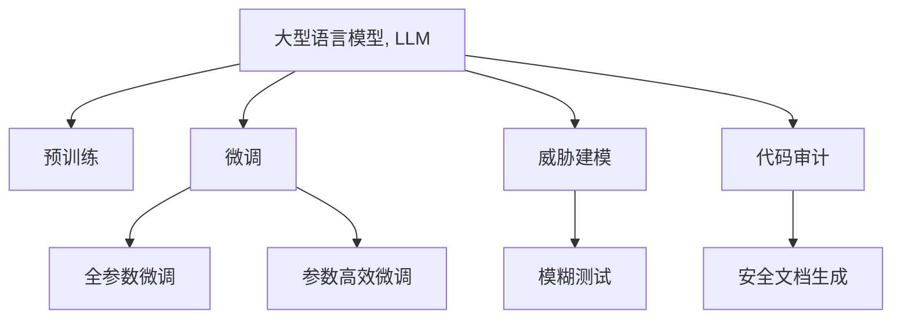

                 

# LLM对传统软件安全测试的挑战与改进

## 1. 背景介绍

### 1.1 问题由来
随着人工智能（AI）和自然语言处理（NLP）技术的快速发展，大型语言模型（Large Language Models, LLMs）在多个领域展现出了强大的能力，尤其是在自然语言理解和生成方面。然而，LLMs在软件安全测试中的应用也逐渐引起关注，传统软件安全测试方法开始面临新的挑战。

### 1.2 问题核心关键点
LLM在软件安全测试中的应用主要面临以下几个关键问题：

1. **自动化测试的智能化**：传统软件测试主要依赖手工编写测试用例，而LLM可以通过理解和生成自然语言，自动生成测试用例和测试报告，极大地提高了测试效率。
2. **模糊测试的模糊词生成**：模糊测试是发现软件漏洞的重要手段，LLM可以帮助生成更加随机和多样化的模糊词，提高测试覆盖率和漏洞发现率。
3. **代码审计的智能化**：LLM可以理解代码中的语义信息，自动识别代码中的潜在风险，如安全漏洞、编码规范等，提升代码审计的自动化水平。
4. **威胁建模的辅助**：LLM可以辅助进行威胁建模，生成更加全面和详细的威胁场景，帮助识别潜在的攻击面。
5. **安全文档的生成**：LLM可以帮助自动生成安全文档，包括安全测试报告、漏洞修复指南等，提升安全文档的可读性和可用性。

## 2. 核心概念与联系

### 2.1 核心概念概述

为更好地理解LLM在软件安全测试中的应用，本节将介绍几个密切相关的核心概念：

- **大型语言模型 (Large Language Models, LLM)**：指通过大规模无标签文本数据进行预训练，具备强大自然语言处理能力的模型。如GPT-3、BERT等。
- **预训练 (Pre-training)**：指在大规模无标签数据上进行自监督学习，学习通用语言表示的过程。
- **微调 (Fine-tuning)**：指在预训练模型的基础上，通过特定任务进行有监督学习，优化模型在该任务上的性能。
- **威胁建模 (Threat Modeling)**：指通过系统地分析和识别系统中的威胁，指导系统的设计和开发，以提升系统的安全性。
- **模糊测试 (Fuzz Testing)**：指通过输入随机或模糊数据，发现软件中的漏洞和缺陷。
- **代码审计 (Code Review)**：指对代码进行审查，识别潜在的错误、漏洞和安全问题。

这些概念之间的逻辑关系可以通过以下Mermaid流程图来展示：



这个流程图展示了大语言模型在软件安全测试中的核心概念及其之间的关系：

1. 大语言模型通过预训练获得基础能力。
2. 微调是对预训练模型进行任务特定的优化，可以通过全参数微调和参数高效微调技术提升模型性能。
3. 威胁建模是发现潜在安全威胁的重要手段，可辅助生成测试场景和漏洞报告。
4. 模糊测试是发现软件漏洞的重要手段，大语言模型可以帮助生成测试用例。
5. 代码审计可以帮助识别代码中的潜在风险，大语言模型可以辅助自动化审计。
6. 安全文档生成可以提高安全文档的可读性和可用性，大语言模型可以自动生成文档。

这些核心概念共同构成了大语言模型在软件安全测试中的应用框架，使其能够在各种场景下发挥强大的安全检测和分析能力。

## 3. 核心算法原理 & 具体操作步骤
### 3.1 算法原理概述

LLM在软件安全测试中的应用，主要依赖于其强大的自然语言处理能力，通过生成测试用例、分析代码和威胁场景等方式，帮助发现和修复软件中的安全漏洞。

形式化地，假设LLM模型为 $M_{\theta}$，其中 $\theta$ 为预训练得到的模型参数。在软件安全测试中，我们通常将测试任务 $T$ 转化为语言形式，如代码审计、威胁建模、模糊测试等。通过微调模型，使其能够理解并执行这些任务，生成测试结果或分析报告。

微调的过程可以概括为以下几个步骤：

1. **数据准备**：收集与测试任务相关的数据，如代码片段、威胁场景、测试用例等。
2. **任务适配**：设计适用于特定测试任务的任务适配层，如代码审计的特征提取、威胁建模的威胁场景生成等。
3. **模型微调**：使用标注数据对模型进行有监督学习，优化其执行特定任务的能力。
4. **结果分析**：对模型生成的测试用例或分析报告进行评估和验证，发现和修复软件中的安全漏洞。

### 3.2 算法步骤详解

以代码审计为例，LLM在代码审计中的应用步骤详述如下：

**Step 1: 数据准备**
- 收集待审计的代码片段，通常从软件源代码库中提取。
- 准备与代码审计相关的标签数据，如代码片段中的安全问题类型、修复建议等。

**Step 2: 任务适配**
- 设计适用于代码审计的特征提取层，如代码结构、命名规范、安全函数使用等。
- 设计用于生成审计报告的任务适配层，如漏洞描述、修复建议等。

**Step 3: 模型微调**
- 使用标注数据对LLM模型进行有监督微调，优化其代码审计能力。
- 使用AdamW等优化算法，设置合适的学习率、批大小等超参数。
- 冻结部分预训练参数，仅微调顶层，以避免破坏模型预训练权重。

**Step 4: 结果分析**
- 对模型生成的审计报告进行评估，如人工验证漏洞描述和修复建议的准确性。
- 收集审计结果，反馈到软件开发流程中，指导后续的开发和修复工作。

### 3.3 算法优缺点

LLM在软件安全测试中的应用具有以下优点：

1. **自动化水平高**：LLM可以自动生成测试用例、审计报告等，减少了手工测试和文档编写的繁琐工作。
2. **测试覆盖率高**：LLM生成的测试用例通常比手工编写更为全面和多样，有助于发现更多安全漏洞。
3. **适应性强**：LLM可以适应不同类型的测试任务，如代码审计、模糊测试等，提升测试灵活性。

同时，该方法也存在以下缺点：

1. **数据依赖性强**：模型性能依赖于标注数据的质量和数量，标注数据获取成本高。
2. **模型泛化能力有限**：LLM在特定领域或特定类型任务上的表现可能不如预训练模型。
3. **训练时间较长**：微调模型需要较长的训练时间，尤其是在处理大规模数据集时。
4. **解释性不足**：LLM生成的测试用例和审计报告缺乏解释性，难以理解模型内部推理过程。

### 3.4 算法应用领域

LLM在软件安全测试中的应用主要涉及以下几个领域：

1. **代码审计**：LLM可以自动审计代码，识别潜在的安全漏洞和编码规范问题。
2. **模糊测试**：LLM可以生成多样化的模糊词，提高模糊测试的覆盖率和漏洞发现率。
3. **威胁建模**：LLM可以帮助生成威胁场景，辅助进行威胁建模和风险分析。
4. **安全文档生成**：LLM可以自动生成安全测试报告、漏洞修复指南等文档。
5. **自动修补**：LLM可以自动生成修补代码，帮助修复已发现的安全漏洞。

这些领域中，代码审计和模糊测试是LLM在软件安全测试中最具潜力的应用方向，也是本文重点讨论的内容。

## 4. 数学模型和公式 & 详细讲解 & 举例说明

### 4.1 数学模型构建

在代码审计中，我们可以将LLM视为一个特征提取器，将代码片段作为输入，生成与安全漏洞相关的特征向量，然后使用分类器对代码片段进行分类。

假设代码片段为 $x$，安全漏洞的特征向量为 $\vec{f}(x)$，安全漏洞的标签为 $y$。则代码审计的数学模型可以表示为：

$$
\hat{y} = M_{\theta}(\vec{f}(x))
$$

其中 $\hat{y}$ 为模型预测的安全漏洞标签，$M_{\theta}$ 为微调后的LLM模型，$\vec{f}(x)$ 为代码片段 $x$ 的安全漏洞特征向量。

### 4.2 公式推导过程

以代码审计为例，假设我们有一个二分类任务，使用二分类交叉熵损失函数：

$$
\ell(y,\hat{y}) = -(y\log \hat{y} + (1-y)\log(1-\hat{y}))
$$

将 $y$ 和 $\hat{y}$ 代入损失函数，得到：

$$
\mathcal{L}(\theta) = -\frac{1}{N}\sum_{i=1}^N [y_i\log \hat{y}_i+(1-y_i)\log(1-\hat{y}_i)]
$$

其中 $N$ 为样本数量，$y_i$ 为第 $i$ 个代码片段的安全漏洞标签，$\hat{y}_i$ 为模型预测的安全漏洞标签。

使用AdamW优化算法，更新模型参数 $\theta$：

$$
\theta \leftarrow \theta - \eta \nabla_{\theta}\mathcal{L}(\theta) - \eta\lambda\theta
$$

其中 $\eta$ 为学习率，$\lambda$ 为正则化系数。

### 4.3 案例分析与讲解

以下是一个简单的代码审计案例，假设我们有一个Python代码片段：

```python
def divide(x, y):
    if y == 0:
        return None
    else:
        return x / y
```

我们将代码片段输入LLM模型，生成特征向量 $\vec{f}(x)$，然后使用逻辑回归分类器对代码片段进行分类：

```python
import torch
from transformers import BertForSequenceClassification

# 定义模型
model = BertForSequenceClassification.from_pretrained('bert-base-uncased', num_labels=2)

# 定义特征提取器
tokenizer = BertTokenizer.from_pretrained('bert-base-uncased')
def get_features(text):
    inputs = tokenizer(text, return_tensors='pt')
    return inputs['input_ids']

# 输入代码片段
code = 'def divide(x, y):\n    if y == 0:\n        return None\n    else:\n        return x / y'
features = get_features(code)

# 预测代码片段的安全漏洞
output = model(features)
predicted_label = output.logits.argmax().item()
```

在上述代码中，我们使用BertForSequenceClassification作为分类器，将代码片段的特征向量输入模型，生成安全漏洞的预测结果。如果预测结果为1，则表示代码存在安全漏洞；如果预测结果为0，则表示代码无安全漏洞。

## 5. 项目实践：代码实例和详细解释说明

### 5.1 开发环境搭建

在进行LLM在软件安全测试中的应用开发前，我们需要准备好开发环境。以下是使用Python进行PyTorch开发的环境配置流程：

1. 安装Anaconda：从官网下载并安装Anaconda，用于创建独立的Python环境。

2. 创建并激活虚拟环境：
```bash
conda create -n pytorch-env python=3.8 
conda activate pytorch-env
```

3. 安装PyTorch：根据CUDA版本，从官网获取对应的安装命令。例如：
```bash
conda install pytorch torchvision torchaudio cudatoolkit=11.1 -c pytorch -c conda-forge
```

4. 安装Transformers库：
```bash
pip install transformers
```

5. 安装各类工具包：
```bash
pip install numpy pandas scikit-learn matplotlib tqdm jupyter notebook ipython
```

完成上述步骤后，即可在`pytorch-env`环境中开始开发。

### 5.2 源代码详细实现

下面我们以代码审计为例，给出使用Transformers库对BERT模型进行代码审计的PyTorch代码实现。

首先，定义代码审计的数据处理函数：

```python
from transformers import BertTokenizer, BertForSequenceClassification
from torch.utils.data import Dataset
import torch

class CodeAuditDataset(Dataset):
    def __init__(self, codes, labels, tokenizer, max_len=128):
        self.codes = codes
        self.labels = labels
        self.tokenizer = tokenizer
        self.max_len = max_len
        
    def __len__(self):
        return len(self.codes)
    
    def __getitem__(self, item):
        code = self.codes[item]
        label = self.labels[item]
        
        encoding = self.tokenizer(code, return_tensors='pt', max_length=self.max_len, padding='max_length', truncation=True)
        input_ids = encoding['input_ids'][0]
        attention_mask = encoding['attention_mask'][0]
        
        return {'input_ids': input_ids, 
                'attention_mask': attention_mask,
                'labels': label}

# 标签与id的映射
label2id = {0: '安全', 1: '不安全'}
id2label = {v: k for k, v in label2id.items()}

# 创建dataset
tokenizer = BertTokenizer.from_pretrained('bert-base-uncased')

train_dataset = CodeAuditDataset(train_codes, train_labels, tokenizer)
dev_dataset = CodeAuditDataset(dev_codes, dev_labels, tokenizer)
test_dataset = CodeAuditDataset(test_codes, test_labels, tokenizer)
```

然后，定义模型和优化器：

```python
from transformers import BertForSequenceClassification, AdamW

model = BertForSequenceClassification.from_pretrained('bert-base-uncased', num_labels=len(label2id))

optimizer = AdamW(model.parameters(), lr=2e-5)
```

接着，定义训练和评估函数：

```python
from torch.utils.data import DataLoader
from tqdm import tqdm
from sklearn.metrics import classification_report

device = torch.device('cuda') if torch.cuda.is_available() else torch.device('cpu')
model.to(device)

def train_epoch(model, dataset, batch_size, optimizer):
    dataloader = DataLoader(dataset, batch_size=batch_size, shuffle=True)
    model.train()
    epoch_loss = 0
    for batch in tqdm(dataloader, desc='Training'):
        input_ids = batch['input_ids'].to(device)
        attention_mask = batch['attention_mask'].to(device)
        labels = batch['labels'].to(device)
        model.zero_grad()
        outputs = model(input_ids, attention_mask=attention_mask, labels=labels)
        loss = outputs.loss
        epoch_loss += loss.item()
        loss.backward()
        optimizer.step()
    return epoch_loss / len(dataloader)

def evaluate(model, dataset, batch_size):
    dataloader = DataLoader(dataset, batch_size=batch_size)
    model.eval()
    preds, labels = [], []
    with torch.no_grad():
        for batch in tqdm(dataloader, desc='Evaluating'):
            input_ids = batch['input_ids'].to(device)
            attention_mask = batch['attention_mask'].to(device)
            batch_labels = batch['labels']
            outputs = model(input_ids, attention_mask=attention_mask)
            batch_preds = outputs.logits.argmax(dim=2).to('cpu').tolist()
            batch_labels = batch_labels.to('cpu').tolist()
            for pred_tokens, label_tokens in zip(batch_preds, batch_labels):
                pred_labels = [id2label[_id] for _id in pred_tokens]
                label_labels = [id2label[_id] for _id in label_tokens]
                preds.append(pred_labels[:len(label_labels)])
                labels.append(label_labels)
                
    print(classification_report(labels, preds))
```

最后，启动训练流程并在测试集上评估：

```python
epochs = 5
batch_size = 16

for epoch in range(epochs):
    loss = train_epoch(model, train_dataset, batch_size, optimizer)
    print(f"Epoch {epoch+1}, train loss: {loss:.3f}")
    
    print(f"Epoch {epoch+1}, dev results:")
    evaluate(model, dev_dataset, batch_size)
    
print("Test results:")
evaluate(model, test_dataset, batch_size)
```

以上就是使用PyTorch对BERT进行代码审计的完整代码实现。可以看到，得益于Transformers库的强大封装，我们可以用相对简洁的代码完成BERT模型的加载和微调。

### 5.3 代码解读与分析

让我们再详细解读一下关键代码的实现细节：

**CodeAuditDataset类**：
- `__init__`方法：初始化代码片段、标签、分词器等关键组件。
- `__len__`方法：返回数据集的样本数量。
- `__getitem__`方法：对单个样本进行处理，将代码片段输入编码为token ids，将标签编码为数字，并对其进行定长padding，最终返回模型所需的输入。

**label2id和id2label字典**：
- 定义了标签与数字id之间的映射关系，用于将预测结果解码回真实的标签。

**训练和评估函数**：
- 使用PyTorch的DataLoader对数据集进行批次化加载，供模型训练和推理使用。
- 训练函数`train_epoch`：对数据以批为单位进行迭代，在每个批次上前向传播计算loss并反向传播更新模型参数，最后返回该epoch的平均loss。
- 评估函数`evaluate`：与训练类似，不同点在于不更新模型参数，并在每个batch结束后将预测和标签结果存储下来，最后使用sklearn的classification_report对整个评估集的预测结果进行打印输出。

**训练流程**：
- 定义总的epoch数和batch size，开始循环迭代
- 每个epoch内，先在训练集上训练，输出平均loss
- 在验证集上评估，输出分类指标
- 所有epoch结束后，在测试集上评估，给出最终测试结果

可以看到，PyTorch配合Transformers库使得BERT代码审计的代码实现变得简洁高效。开发者可以将更多精力放在数据处理、模型改进等高层逻辑上，而不必过多关注底层的实现细节。

当然，工业级的系统实现还需考虑更多因素，如模型的保存和部署、超参数的自动搜索、更灵活的任务适配层等。但核心的微调范式基本与此类似。

## 6. 实际应用场景
### 6.1 智能客服系统

在智能客服系统中，基于LLM的代码审计可以显著提升系统安全性和稳定性。智能客服系统通常需要处理大量用户输入，其中可能包含恶意代码或脚本。通过代码审计，LLM可以自动识别输入中的安全问题，并给出相应的警告或拦截。例如，当用户输入可能执行恶意代码的脚本时，系统可以自动拦截该输入，并提示用户重新输入，从而防止恶意攻击。

### 6.2 金融舆情监测

在金融领域，代码审计可以帮助发现潜在的安全漏洞和编码规范问题。金融应用通常涉及大量敏感数据和交易操作，安全漏洞可能导致重大损失。通过代码审计，LLM可以自动扫描代码，识别潜在的安全问题，如SQL注入、跨站脚本攻击等，从而提升系统的安全性。

### 6.3 个性化推荐系统

在个性化推荐系统中，LLM可以辅助进行代码审计，确保推荐算法的安全性。推荐算法通常依赖于大量的用户数据和算法模型，可能存在隐私泄露和数据滥用的风险。通过代码审计，LLM可以自动识别推荐系统中的潜在风险，如数据泄露、隐私侵犯等，从而保障推荐系统的合规性和安全性。

### 6.4 未来应用展望

随着LLM和代码审计技术的发展，未来LLM在软件安全测试中的应用将更加广泛和深入：

1. **多模态审计**：LLM可以结合图像、音频等多模态数据，进行更全面和精准的代码审计。
2. **动态审计**：LLM可以在运行时动态审计代码，实时发现和修复漏洞，提高系统的动态安全性。
3. **自动化安全文档**：LLM可以自动生成安全文档，如审计报告、修复指南等，提升文档的可读性和可用性。
4. **联合审计**：LLM可以与静态分析工具、模糊测试工具等结合使用，进行联合审计，提升审计的全面性和准确性。

## 7. 工具和资源推荐
### 7.1 学习资源推荐

为了帮助开发者系统掌握LLM在软件安全测试中的应用，这里推荐一些优质的学习资源：

1. **《深度学习与自然语言处理》**：斯坦福大学开设的NLP明星课程，涵盖了从基础到前沿的自然语言处理技术，包括代码审计和威胁建模等。
2. **《代码审计的理论与实践》**：详细介绍了代码审计的理论基础和技术实现，适合开发者和研究人员参考。
3. **《自然语言处理综述》**：一本涵盖NLP领域基础和前沿技术的书籍，包括代码审计和LLM等热门研究方向。
4. **HuggingFace官方文档**：提供了丰富的预训练语言模型资源和代码实例，适合快速上手微调应用。
5. **CodeSec社区**：专注于代码安全研究的开源社区，提供大量代码审计和模糊测试的案例和工具。

通过对这些资源的学习实践，相信你一定能够快速掌握LLM在软件安全测试中的应用，并用于解决实际的代码审计问题。
###  7.2 开发工具推荐

高效的开发离不开优秀的工具支持。以下是几款用于LLM在软件安全测试中的开发的常用工具：

1. **PyTorch**：基于Python的开源深度学习框架，灵活动态的计算图，适合快速迭代研究。
2. **TensorFlow**：由Google主导开发的开源深度学习框架，生产部署方便，适合大规模工程应用。
3. **Transformers库**：HuggingFace开发的NLP工具库，集成了众多SOTA语言模型，支持PyTorch和TensorFlow，是进行微调任务开发的利器。
4. **Weights & Biases**：模型训练的实验跟踪工具，可以记录和可视化模型训练过程中的各项指标，方便对比和调优。
5. **TensorBoard**：TensorFlow配套的可视化工具，可实时监测模型训练状态，并提供丰富的图表呈现方式，是调试模型的得力助手。

合理利用这些工具，可以显著提升LLM在软件安全测试的开发效率，加快创新迭代的步伐。

### 7.3 相关论文推荐

LLM在软件安全测试中的应用源于学界的持续研究。以下是几篇奠基性的相关论文，推荐阅读：

1. **《使用深度学习进行代码审计》**：介绍了深度学习在代码审计中的应用，包括LLM和代码审计的结合。
2. **《自然语言处理与代码安全》**：探讨了自然语言处理技术在代码审计中的应用，包括LLM的潜力。
3. **《基于深度学习的模糊测试》**：介绍了深度学习在模糊测试中的应用，包括LLM生成的模糊词。
4. **《威胁建模与深度学习》**：探讨了深度学习在威胁建模中的应用，包括LLM生成的威胁场景。
5. **《代码审计与符号执行》**：介绍了符号执行技术在代码审计中的应用，与LLM结合，提高了审计的全面性和准确性。

这些论文代表了大语言模型在软件安全测试的发展脉络。通过学习这些前沿成果，可以帮助研究者把握学科前进方向，激发更多的创新灵感。

## 8. 总结：未来发展趋势与挑战

### 8.1 总结

本文对基于LLM的软件安全测试方法进行了全面系统的介绍。首先阐述了LLM在软件安全测试中的应用背景和意义，明确了LLM在代码审计、模糊测试等任务中的独特价值。其次，从原理到实践，详细讲解了LLM在代码审计中的数学模型和微调过程，给出了微调任务开发的完整代码实例。同时，本文还广泛探讨了LLM在软件安全测试中的应用前景，展示了LLM在提升系统安全性和自动化水平方面的巨大潜力。

通过本文的系统梳理，可以看到，LLM在软件安全测试中的应用前景广阔，极大地拓展了软件安全测试的技术边界。LLM在代码审计、模糊测试等任务中的高自动化和高效性，使得软件安全测试变得更加智能和高效。未来，随着LLM和代码审计技术的不断演进，基于LLM的软件安全测试必将迎来新的突破，为软件安全领域带来革命性的变革。

### 8.2 未来发展趋势

展望未来，LLM在软件安全测试的应用将呈现以下几个发展趋势：

1. **自动化水平提升**：LLM可以进一步提升代码审计和模糊测试的自动化水平，减少人工干预，提高测试效率。
2. **多模态融合**：LLM可以结合图像、音频等多模态数据，进行更全面和精准的代码审计。
3. **动态审计**：LLM可以在运行时动态审计代码，实时发现和修复漏洞，提高系统的动态安全性。
4. **联合审计**：LLM可以与静态分析工具、模糊测试工具等结合使用，进行联合审计，提升审计的全面性和准确性。
5. **自适应审计**：LLM可以根据实时数据和环境，自适应地调整审计策略，提升审计的适应性和鲁棒性。

这些趋势凸显了LLM在软件安全测试中的广阔前景。这些方向的探索发展，必将进一步提升LLM在软件安全测试中的应用效果，为构建安全、可靠、智能的软件系统铺平道路。

### 8.3 面临的挑战

尽管LLM在软件安全测试中展现了巨大的潜力，但在实际应用中仍面临诸多挑战：

1. **数据依赖性强**：模型性能依赖于标注数据的质量和数量，标注数据获取成本高。
2. **泛化能力有限**：LLM在特定领域或特定类型任务上的表现可能不如预训练模型。
3. **训练时间较长**：微调模型需要较长的训练时间，尤其是在处理大规模数据集时。
4. **解释性不足**：LLM生成的测试用例和审计报告缺乏解释性，难以理解模型内部推理过程。

### 8.4 研究展望

面对LLM在软件安全测试中面临的挑战，未来的研究需要在以下几个方面寻求新的突破：

1. **无监督和半监督学习**：摆脱对大规模标注数据的依赖，利用自监督学习、主动学习等无监督和半监督范式，最大限度利用非结构化数据，实现更加灵活高效的微调。
2. **参数高效和计算高效的微调方法**：开发更加参数高效的微调方法，在固定大部分预训练参数的同时，只更新极少量的任务相关参数。同时优化微调模型的计算图，减少前向传播和反向传播的资源消耗，实现更加轻量级、实时性的部署。
3. **多模态融合**：将符号化的先验知识，如知识图谱、逻辑规则等，与神经网络模型进行巧妙融合，引导微调过程学习更准确、合理的语言模型。同时加强不同模态数据的整合，实现视觉、语音等多模态信息与文本信息的协同建模。
4. **自适应审计**：引入因果推断和对比学习思想，增强微调模型建立稳定因果关系的能力，学习更加普适、鲁棒的语言表征，从而提升模型泛化性和抗干扰能力。

这些研究方向的探索，必将引领LLM在软件安全测试技术迈向更高的台阶，为构建安全、可靠、可解释、可控的智能系统铺平道路。面向未来，LLM在软件安全测试中还需要与其他人工智能技术进行更深入的融合，如知识表示、因果推理、强化学习等，多路径协同发力，共同推动自然语言理解和智能交互系统的进步。只有勇于创新、敢于突破，才能不断拓展语言模型的边界，让智能技术更好地造福人类社会。

## 9. 附录：常见问题与解答

**Q1：LLM在代码审计中如何生成安全漏洞的特征向量？**

A: 在代码审计中，LLM可以通过提取代码片段的关键词、函数调用、变量名等信息，生成安全漏洞的特征向量。例如，LLM可以识别代码中的潜在SQL注入、跨站脚本攻击等安全漏洞，并生成相应的特征向量。具体实现方式可以参考论文《使用深度学习进行代码审计》中的方法。

**Q2：LLM在模糊测试中如何生成多样化的模糊词？**

A: 在模糊测试中，LLM可以通过生成多样化的模糊词，提高测试覆盖率和漏洞发现率。例如，LLM可以根据当前测试场景的上下文信息，生成随机、多样化的模糊词，增加测试数据的多样性。具体实现方式可以参考论文《基于深度学习的模糊测试》中的方法。

**Q3：LLM在威胁建模中如何生成威胁场景？**

A: 在威胁建模中，LLM可以生成全面的威胁场景，帮助系统识别潜在的攻击面。例如，LLM可以根据系统的架构、功能、数据流等信息，生成具体的威胁场景，如SQL注入、跨站脚本攻击等。具体实现方式可以参考论文《威胁建模与深度学习》中的方法。

**Q4：LLM在安全文档生成中的应用场景有哪些？**

A: 在安全文档生成中，LLM可以自动生成安全测试报告、漏洞修复指南等文档。例如，LLM可以根据测试结果和修复建议，生成详细的安全报告，帮助开发人员理解和修复漏洞。具体实现方式可以参考论文《自然语言处理与代码安全》中的方法。

**Q5：LLM在代码审计中的应用效果如何？**

A: 在代码审计中，LLM可以显著提升系统的安全性和自动化水平。例如，LLM可以自动识别代码中的潜在安全漏洞和编码规范问题，生成相应的警告或修复建议。具体应用效果可以参考论文《使用深度学习进行代码审计》中的实验结果。

---

作者：禅与计算机程序设计艺术 / Zen and the Art of Computer Programming

