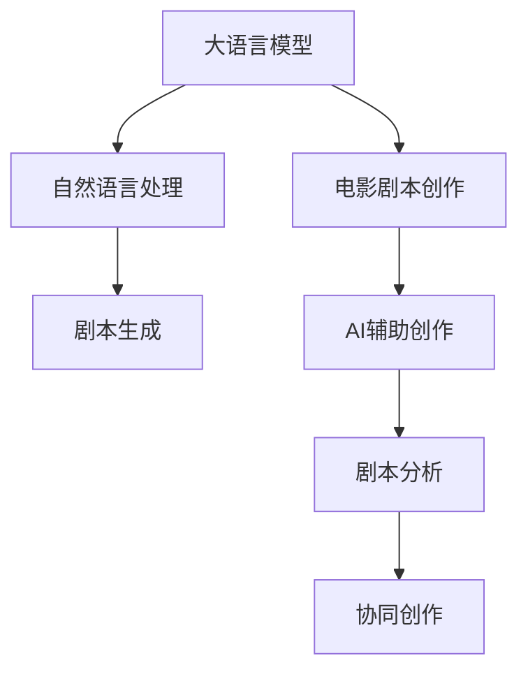

                 

# LLM辅助电影剧本创作：AI与人类编剧的合作

## 1. 背景介绍

电影剧本创作长期以来是一项复杂的艺术和技巧工作，传统编剧需要灵感、创意、脚本知识以及大量的编写经验。近年来，人工智能(AI)技术，尤其是大语言模型(LLM)，正逐渐进入电影制作行业，为剧本创作带来革命性改变。本文旨在探讨如何利用LLM辅助电影剧本创作，从理论与实践中探讨AI与人类编剧的合作模式，以期提升创作效率和质量。

## 2. 核心概念与联系

### 2.1 核心概念概述

在本节中，我们将介绍几个核心概念及其相互联系：

- **大语言模型(LLM)**：基于深度学习的大型神经网络，可以处理和生成自然语言文本。如GPT-3、BERT、T5等模型，具备强大的语言理解和生成能力。
- **自然语言处理(NLP)**：涉及计算机对自然语言的理解、分析、处理和生成，旨在让机器具备语言理解能力，从而应用于翻译、情感分析、问答等场景。
- **电影剧本创作**：编剧根据故事大纲、主题等创意，结合语言艺术，创作出生动的对话和情节，构成电影剧本。
- **AI辅助创作**：利用人工智能技术辅助编剧进行创作，包括生成剧本大纲、对话、场景描述等，提升创作效率和创意质量。
- **协同创作**：AI和人类编剧共同参与创作过程，各自发挥优势，创造出更丰富、更具创意的作品。

这些概念之间的联系可以通过以下Mermaid流程图来展示：



## 3. 核心算法原理 & 具体操作步骤

### 3.1 算法原理概述

AI辅助电影剧本创作的算法原理主要基于大语言模型在自然语言处理领域的强大能力。通过对大量的电影剧本和剧本元素（如对话、场景描述、角色设定等）进行预训练，LLM可以学习到丰富的语言结构和规则，并在特定任务上进行微调，生成符合特定风格和语境的文本。

### 3.2 算法步骤详解

AI辅助电影剧本创作的算法一般包括以下几个关键步骤：

**Step 1: 数据准备与预处理**
- 收集电影剧本数据集，包括电影剧本文本、对话、场景描述等。
- 进行数据清洗，去除噪声和不相关内容，如标注错误、格式混乱等。
- 对数据进行分词、词性标注、实体识别等预处理，以便于模型理解和生成。

**Step 2: 模型选择与训练**
- 选择合适的预训练模型，如GPT-3、BERT等。
- 在电影剧本数据集上进行微调，优化模型生成符合电影风格和语境的文本。
- 设置训练超参数，如学习率、批量大小、训练轮数等。

**Step 3: 生成与编辑**
- 使用微调后的模型生成电影剧本的对话、场景描述等元素。
- 结合人类编剧的创意和经验，对生成的文本进行编辑和优化，提升质量。
- 利用协同创作工具，如自然语言生成(NLG)平台，辅助编剧快速生成和修改剧本内容。

**Step 4: 评估与反馈**
- 对生成的文本进行质量评估，如自然度、连贯性、符合电影风格等。
- 通过人工评审和用户反馈，不断调整和优化模型参数和创作策略。
- 结合自然语言推理(NLI)技术，对生成的文本进行语义合理性检查。

### 3.3 算法优缺点

**优点：**
- 提升创作效率：AI辅助生成剧本大纲和对话，可以快速生成大量创意，缩短创作周期。
- 增强创意多样性：AI模型可以提供多种创作方向和创意，激发编剧的创作灵感。
- 改善创作质量：AI辅助生成文本自然流畅、连贯性强，结合人类编辑可以提升剧本的整体质量。
- 跨文化协作：AI模型可以处理多种语言和文化背景的剧本，促进跨文化创作和交流。

**缺点：**
- 创意与艺术的缺失：AI模型虽然能生成大量文本，但缺乏人类编剧的独特视角和情感表达。
- 数据依赖性强：需要大量的高质量电影剧本数据进行预训练和微调，数据集质量直接影响模型性能。
- 质量不稳定：生成的文本质量和风格可能不稳定，需要人工编辑和调整。
- 依赖技术环境：需要高性能计算设备和足够的算力，才能有效运行大语言模型。

### 3.4 算法应用领域

基于大语言模型的AI辅助电影剧本创作方法，已在多个领域得到应用，例如：

- **游戏剧本生成**：通过生成游戏对话和情节，提升游戏剧本创作效率。
- **广告文案创作**：生成符合品牌调性的广告文案，快速推出市场。
- **企业培训剧本**：根据企业需求生成培训脚本和模拟对话，提升培训效果。
- **教育辅助**：生成教育脚本和教材，辅助教师进行教学。
- **电影预制作**：生成电影对话和场景描述，辅助编剧进行剧本创作和后期制作。

## 4. 数学模型和公式 & 详细讲解 & 举例说明

### 4.1 数学模型构建

在电影剧本创作中，我们可以使用大语言模型生成文本，其数学模型可以表示为：

$$
y = \mathcal{P}(x; \theta)
$$

其中，$x$ 为输入的上下文信息，$\theta$ 为模型的参数，$y$ 为生成的文本。

### 4.2 公式推导过程

以GPT-3为例，假设输入为 $x = (x_1, x_2, ..., x_n)$，其中 $x_i$ 为电影剧本中的某一元素，如对话、场景描述等。模型生成的文本可以表示为：

$$
y = \prod_{i=1}^{n} p(y_i | x_1, x_2, ..., x_{i-1})
$$

其中 $p(y_i | x_1, x_2, ..., x_{i-1})$ 为生成下一个词的概率分布，可以通过softmax函数计算得到：

$$
p(y_i | x_1, x_2, ..., x_{i-1}) = \frac{e^{E(y_i | x_1, x_2, ..., x_{i-1})}}{\sum_{k=1}^{K} e^{E(k | x_1, x_2, ..., x_{i-1})}}
$$

其中 $E(k | x_1, x_2, ..., x_{i-1})$ 为词向量在特定语言模型下的得分，可以使用Transformer结构计算得到。

### 4.3 案例分析与讲解

假设电影剧本需要生成一段对话，可以使用GPT-3模型进行辅助：

**输入上下文**：
```
场景：一家咖啡店
角色：A（咖啡师），B（顾客）
```

**生成对话**：
```
A: 您想要点什么？
B: 我要一杯拿铁，谢谢。
A: 好的，正在为您准备。
B: 这个店的氛围很好。
A: 是的，我们致力于提供舒适的顾客体验。
```

## 5. 项目实践：代码实例和详细解释说明

### 5.1 开发环境搭建

在进行AI辅助电影剧本创作实践前，我们需要准备好开发环境。以下是使用Python进行PyTorch开发的环境配置流程：

1. 安装Anaconda：从官网下载并安装Anaconda，用于创建独立的Python环境。

2. 创建并激活虚拟环境：
```bash
conda create -n pytorch-env python=3.8 
conda activate pytorch-env
```

3. 安装PyTorch：根据CUDA版本，从官网获取对应的安装命令。例如：
```bash
conda install pytorch torchvision torchaudio cudatoolkit=11.1 -c pytorch -c conda-forge
```

4. 安装Transformers库：
```bash
pip install transformers
```

5. 安装各类工具包：
```bash
pip install numpy pandas scikit-learn matplotlib tqdm jupyter notebook ipython
```

完成上述步骤后，即可在`pytorch-env`环境中开始AI辅助电影剧本创作的实践。

### 5.2 源代码详细实现

以下是使用PyTorch和Transformers库进行电影剧本创作的基本代码实现：

**代码1：定义电影剧本数据类**
```python
from transformers import GPT3LMHeadModel, GPT3Tokenizer
import torch

class MovieScriptDataset(Dataset):
    def __init__(self, script_data, tokenizer, max_len=128):
        self.tokenizer = tokenizer
        self.data = script_data
        self.max_len = max_len
        
    def __len__(self):
        return len(self.data)
    
    def __getitem__(self, item):
        script = self.data[item]
        input_ids = self.tokenizer(script, return_tensors='pt', max_length=self.max_len, padding='max_length', truncation=True)
        input_ids = input_ids['input_ids']
        return {'input_ids': input_ids}
```

**代码2：定义电影剧本生成模型**
```python
from transformers import GPT3LMHeadModel, GPT3Tokenizer
import torch

model = GPT3LMHeadModel.from_pretrained('gpt3', output_attentions=False)
tokenizer = GPT3Tokenizer.from_pretrained('gpt3')

def generate_movie_script(input_text, max_length=128):
    input_ids = tokenizer.encode(input_text, return_tensors='pt')
    output = model.generate(input_ids, max_length=max_length, num_return_sequences=1)
    generated_script = tokenizer.decode(output[0], skip_special_tokens=True)
    return generated_script
```

### 5.3 代码解读与分析

**MovieScriptDataset类**：
- `__init__`方法：初始化电影剧本数据、分词器等关键组件。
- `__len__`方法：返回数据集的样本数量。
- `__getitem__`方法：对单个样本进行处理，将文本输入编码为token ids，最终返回模型所需的输入。

**电影剧本生成模型**：
- 使用GPT-3模型进行电影剧本的生成。输入为电影剧本中的某一元素，如对话、场景描述等，模型生成符合上下文和语境的文本。

## 6. 实际应用场景

### 6.1 智能编剧辅助

基于AI辅助创作，智能编剧可以辅助编剧快速生成电影剧本大纲、对话、场景描述等。例如：

**场景生成**：
输入上下文：“电影《哈利波特》中的一段场景描述”
输出：“哈利波特走进魔法学院，与其他同学交流，场景充满了魔法的气息。”

**对话生成**：
输入上下文：“电影《复仇者联盟》中的一段对话”
输出：“钢铁侠：你准备好了吗？美国队长：我已经准备好了，我们必须找到那块神秘石头。”

### 6.2 自动剧本改写

AI还可以帮助编剧对现有剧本进行改写和优化。例如，可以对剧本中的对话进行润色，增加幽默感或戏剧性：

**对话改写**：
输入上下文：“电影《肖申克的救赎》中的一段对话”
输出：“安迪：我从未停止过希望。瑞德：但监狱会让一个人忘记希望。安迪：但监狱有自由。”

### 6.3 剧本生成与分析

AI辅助生成剧本后，还可以通过自然语言分析工具对生成的剧本进行评估和反馈。例如，可以使用自然语言推理(NLI)技术检查生成的剧本是否符合电影风格和语境：

**剧本分析**：
输入上下文：“电影《盗梦空间》中的一段情节描述”
输出：“这段情节描述符合《盗梦空间》的风格，但可能需要对某些部分进行调整，以使其更加紧凑。”

## 7. 工具和资源推荐

### 7.1 学习资源推荐

为了帮助开发者系统掌握AI辅助电影剧本创作的技术，这里推荐一些优质的学习资源：

1. **自然语言生成(NLG)课程**：斯坦福大学开设的NLG课程，涵盖自然语言生成、机器翻译等基本概念和经典模型。
2. **GPT-3官方文档**：OpenAI的GPT-3官方文档，提供了丰富的API接口和样例代码，帮助开发者快速上手。
3. **电影剧本创作指南**：可以参考《电影剧本创作指南》等书籍，学习电影剧本创作的技巧和经验。
4. **在线课程平台**：Coursera、edX等平台上有许多关于自然语言处理和电影剧本创作的课程，可以帮助开发者快速提升技能。

通过对这些资源的学习实践，相信你一定能够快速掌握AI辅助电影剧本创作的技术，并用于解决实际的创作问题。

### 7.2 开发工具推荐

高效的开发离不开优秀的工具支持。以下是几款用于AI辅助电影剧本创作开发的常用工具：

1. **PyTorch**：基于Python的开源深度学习框架，灵活动态的计算图，适合快速迭代研究。
2. **TensorFlow**：由Google主导开发的开源深度学习框架，生产部署方便，适合大规模工程应用。
3. **HuggingFace Transformers**：提供多种预训练语言模型，支持PyTorch和TensorFlow，是进行自然语言生成和分析任务的强大工具。
4. **Jupyter Notebook**：交互式编程环境，方便开发者进行快速实验和数据可视化。
5. **GPT-3官方API**：OpenAI提供的GPT-3 API接口，支持Python、C++等多种语言，方便开发者快速集成和使用。

合理利用这些工具，可以显著提升AI辅助电影剧本创作的开发效率，加快创新迭代的步伐。

### 7.3 相关论文推荐

AI辅助电影剧本创作的技术源于学界的持续研究。以下是几篇奠基性的相关论文，推荐阅读：

1. **Neural Story Generation with Attentive Editors**：提出了一种基于注意力机制的故事生成方法，可以生成连贯、有意义的故事。
2. **Auto-Text**：提出了一种自动生成文本的方法，可以生成多种风格和语境的文本。
3. **Improving Text Generation with Language Models**：讨论了如何利用语言模型进行文本生成，并提出了一种基于自回归的文本生成模型。
4. **GPT-3 for Scriptwriting**：研究了GPT-3在电影剧本创作中的应用，展示了其在生成对话、场景描述等方面的优势。
5. **Natural Language Generation for Scriptwriting**：讨论了自然语言生成技术在电影剧本创作中的应用，提出了多种生成策略和优化方法。

这些论文代表了大语言模型在电影剧本创作中的研究和实践方向。通过学习这些前沿成果，可以帮助研究者把握学科前进方向，激发更多的创新灵感。

## 8. 总结：未来发展趋势与挑战

### 8.1 总结

本文对AI辅助电影剧本创作的技术进行了全面系统的介绍。首先阐述了AI技术在电影剧本创作中的应用背景和意义，明确了AI辅助创作的优势和具体方法。其次，从原理到实践，详细讲解了AI辅助电影剧本创作的数学模型和核心算法步骤，给出了完整的代码实例。同时，本文还广泛探讨了AI辅助创作在实际应用场景中的应用案例，展示了AI与人类编剧的协同创作模式。

通过本文的系统梳理，可以看到，AI辅助电影剧本创作技术已经初具雏形，正在逐步成为电影制作行业的新趋势。未来，随着技术的不断进步，AI将进一步提升电影剧本创作的效率和质量，推动电影制作行业的发展。

### 8.2 未来发展趋势

展望未来，AI辅助电影剧本创作技术将呈现以下几个发展趋势：

1. **模型规模不断扩大**：随着算力成本的下降和数据规模的扩张，预训练语言模型的参数量还将持续增长。超大规模语言模型蕴含的丰富语言知识，有望支撑更加复杂多变的电影剧本创作。
2. **模型生成能力增强**：通过优化模型架构和训练策略，AI模型将具备更强的文本生成能力，能够生成更加连贯、符合语境的剧本。
3. **交互式创作工具普及**：未来将出现更多交互式的创作工具，如AI写作助手、协同创作平台等，方便编剧进行实时创作和反馈。
4. **跨文化创作能力提升**：AI模型将具备更强的跨文化理解和生成能力，支持不同文化背景的编剧进行创作。
5. **数据驱动创作**：通过分析海量数据，AI模型将能够更好地理解电影受众的喜好和需求，生成更加符合市场和观众期待的剧本。

以上趋势凸显了AI辅助电影剧本创作的广阔前景。这些方向的探索发展，必将进一步提升电影剧本创作的效率和质量，为电影制作行业带来更多创新和突破。

### 8.3 面临的挑战

尽管AI辅助电影剧本创作技术已经取得了瞩目成就，但在迈向更加智能化、普适化应用的过程中，它仍面临着诸多挑战：

1. **创意与艺术的缺失**：AI模型虽然能生成大量文本，但缺乏人类编剧的独特视角和情感表达。如何更好地融合AI与人类创意，提升创作质量，是未来的重要研究方向。
2. **数据依赖性强**：需要大量的高质量电影剧本数据进行预训练和微调，数据集质量直接影响模型性能。如何获取和处理大规模高质数据，是未来研究的重要方向。
3. **质量不稳定**：生成的文本质量和风格可能不稳定，需要人工编辑和调整。如何提升生成文本的稳定性和多样性，是未来的重要研究方向。
4. **依赖技术环境**：需要高性能计算设备和足够的算力，才能有效运行大语言模型。如何优化算法和模型结构，降低资源消耗，是未来研究的重要方向。

### 8.4 研究展望

面对AI辅助电影剧本创作所面临的种种挑战，未来的研究需要在以下几个方面寻求新的突破：

1. **融合人类创意**：探索如何更好地融合AI与人类编剧的创意和经验，提升创作质量和艺术性。
2. **提高数据质量**：研究如何获取和处理大规模高质数据，提升数据驱动创作的可靠性。
3. **提升生成质量**：通过优化算法和模型结构，提升生成文本的稳定性和多样性。
4. **降低资源消耗**：研究如何优化算法和模型结构，降低资源消耗，提高模型效率。
5. **增强跨文化能力**：提升AI模型的跨文化理解和生成能力，支持不同文化背景的编剧进行创作。

这些研究方向的探索，必将引领AI辅助电影剧本创作技术迈向更高的台阶，为电影制作行业带来更多创新和突破。面向未来，AI辅助电影剧本创作技术还需要与其他人工智能技术进行更深入的融合，如知识表示、因果推理、强化学习等，多路径协同发力，共同推动电影制作行业的进步。只有勇于创新、敢于突破，才能不断拓展电影剧本创作的边界，让AI技术更好地服务于电影制作行业。

## 9. 附录：常见问题与解答

**Q1：AI辅助电影剧本创作是否会替代人类编剧？**

A: 目前来看，AI辅助电影剧本创作更多是辅助工具，而不是替代品。AI模型可以生成大量文本，但缺乏人类编剧的独特视角和情感表达。未来，AI和人类编剧将更多地进行协同创作，共同提升创作质量。

**Q2：AI辅助创作对编剧的创作能力和艺术性有影响吗？**

A: AI辅助创作可以提升编剧的创作效率和创意多样性，但不会影响编剧的创作能力和艺术性。编剧仍需具备丰富的经验和创造力，才能创作出深刻、有意义的剧本。AI更多地是辅助工具，帮助编剧更好地表达创意。

**Q3：AI辅助创作需要多少数据进行预训练？**

A: AI辅助创作需要大量的高质量电影剧本数据进行预训练和微调。数据集的质量和规模直接影响模型的性能。一般来说，数据集规模越大，模型的表现越好。

**Q4：AI辅助创作对电影产业有怎样的影响？**

A: AI辅助创作可以提升电影制作效率，缩短制作周期，降低成本。同时，AI模型可以生成多种风格的剧本，丰富电影产业的内容多样性。但AI创作仍需要结合人类编剧的经验和创意，才能创作出高质量的作品。

通过本文的系统梳理，可以看到，AI辅助电影剧本创作技术已经初具雏形，正在逐步成为电影制作行业的新趋势。未来，随着技术的不断进步，AI将进一步提升电影剧本创作的效率和质量，推动电影制作行业的发展。

