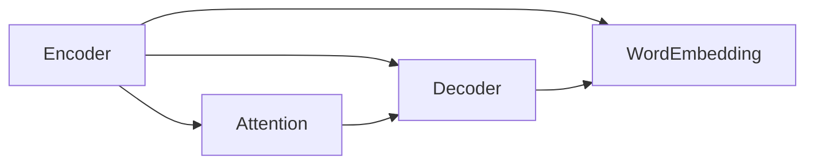

                 

# Language Translation原理与代码实例讲解

## 1. 背景介绍

### 1.1 问题由来

翻译是人类文明交往中的重要环节，自古至今一直备受重视。随着科技的进步，翻译技术从手工翻译、机械翻译发展到基于规则的翻译、基于统计的翻译，再到近年来的人工神经网络机器翻译。特别是深度学习技术的发展，基于神经网络的机器翻译(Neural Machine Translation, NMT) 技术取得了显著的进步。

NMT的核心思想是通过端到端的学习，让模型直接从源语言到目标语言的翻译过程。传统的机器翻译系统通常基于短语的统计翻译模型，如统计机器翻译(SMT)、基于规则的机器翻译(IBM-1)等。但这些方法往往需要构建复杂的规则和词典，且翻译质量受限于人工设计的特征和规则。

神经网络机器翻译则通过学习源语言和目标语言之间的复杂对应关系，从原始文本中自动推断出翻译结果。NMT的显著优势在于其无需手工设计特征和规则，具有更强的泛化能力，翻译质量也显著提升。近年来，基于神经网络的机器翻译已经成为学术界和工业界的研究热点。

### 1.2 问题核心关键点

NMT的实现主要依赖于两种神经网络模型：

1. **编码器(Encoder)**：负责将源语言文本转化为高维语义向量表示。通常使用循环神经网络(RNN)或卷积神经网络(CNN)。
2. **解码器(Decoder)**：负责从语义向量生成目标语言文本。通常也使用RNN或Transformer结构。

翻译过程分为两个步骤：

- 编码器对源语言文本进行编码，生成固定长度的语义向量。
- 解码器对语义向量进行解码，逐个输出目标语言单词。

这两种神经网络模型的融合，使得NMT系统能够在保持语言结构不变的情况下，实现高质量的自动翻译。

### 1.3 问题研究意义

研究NMT方法，对于拓展翻译技术的应用范围，提升翻译质量，加速翻译系统的产业化进程，具有重要意义：

1. 降低翻译成本。通过机器翻译技术，大幅减少人工翻译的需要，降低翻译成本。
2. 提高翻译速度。机器翻译系统能够快速处理大量文本，显著缩短翻译周期。
3. 提升翻译质量。深度学习模型可以从大规模语料中学习到复杂的语言规律，翻译质量较之传统机器翻译有显著提升。
4. 加速开发进程。使用预训练模型进行微调，快速适应特定领域的翻译任务，缩短翻译系统的开发周期。
5. 带来技术创新。NMT方法推动了机器翻译技术从手工翻译向自动翻译的根本性变革，催生了诸如注意力机制、自注意力机制等新的研究方向。
6. 赋能产业升级。机器翻译技术的普及，使得翻译服务变得更加高效、普及化，有助于各行各业提高国际化水平，促进全球化进程。

## 2. 核心概念与联系

### 2.1 核心概念概述

为了更好地理解NMT的基本原理和实现方法，本节将介绍几个密切相关的核心概念：

- 神经网络机器翻译(Neural Machine Translation, NMT)：指通过深度学习模型实现自动翻译的技术。常见架构包括编码器-解码器结构，使用循环神经网络或自注意力机制进行翻译。
- 自注意力机制(Self-Attention)：一种基于Transformer的注意力机制，用于捕捉序列中每个位置与其它位置的关系。可以大大提高翻译的质量和效率。
- 编码器(Encoder)：NMT模型的输入层，负责将源语言文本转化为固定长度的语义向量。
- 解码器(Decoder)：NMT模型的输出层，负责将语义向量解码为目标语言文本。
- 词嵌入(Word Embedding)：将单词映射为向量，用于捕捉单词之间的语义关系。
- 注意力机制(Attention)：一种用于增强模型对于输入序列中特定位置的关注，提高模型的翻译能力。

这些核心概念之间的逻辑关系可以通过以下Mermaid流程图来展示：



这个流程图展示了大语言模型和NMT的核心概念及其之间的关系：

1. 输入源语言文本通过编码器转化为语义向量。
2. 解码器对语义向量进行解码，生成目标语言文本。
3. 编码器使用注意力机制捕捉输入文本中的关键信息。
4. 解码器使用自注意力机制生成高质量的翻译结果。
5. 输入和输出的单词通过词嵌入进行向量化。

## 3. 核心算法原理 & 具体操作步骤
### 3.1 算法原理概述

NMT的核心思想是使用神经网络模型将源语言文本转化为目标语言文本。其核心算法包括以下几个关键步骤：

1. 编码器对源语言文本进行编码，生成固定长度的语义向量表示。
2. 解码器对语义向量进行解码，生成目标语言文本。
3. 使用自注意力机制，捕捉输入序列中每个位置与其它位置的关系。
4. 使用词嵌入技术，将单词映射为向量，捕捉单词之间的语义关系。

整个翻译过程可以看作是从源语言文本到目标语言文本的端到端映射。

### 3.2 算法步骤详解

以下是对NMT算法步骤的详细讲解：

**Step 1: 准备语料和模型**

- 准备源语言和目标语言的平行语料库，用于训练NMT模型。
- 选择合适的神经网络架构，如编码器-解码器结构，并确定模型的参数。
- 使用预训练模型或从零开始训练，初始化模型参数。

**Step 2: 定义模型**

- 定义编码器，负责对源语言文本进行编码，生成固定长度的语义向量表示。
- 定义解码器，负责对语义向量进行解码，生成目标语言文本。
- 定义注意力机制，用于捕捉输入序列中每个位置与其它位置的关系。
- 定义词嵌入层，将单词映射为向量，捕捉单词之间的语义关系。

**Step 3: 训练模型**

- 将平行语料库划分为训练集、验证集和测试集，进行模型训练。
- 在训练集上使用反向传播算法进行梯度更新，调整模型参数。
- 在验证集上评估模型性能，调整超参数。
- 在测试集上最终评估模型性能，完成模型训练。

**Step 4: 应用模型**

- 使用训练好的模型对新的源语言文本进行翻译。
- 将输入文本作为编码器的输入，输出语义向量。
- 将语义向量作为解码器的输入，逐个输出目标语言单词。
- 根据自注意力机制和词嵌入层的权重，生成高质量的翻译结果。

### 3.3 算法优缺点

NMT方法具有以下优点：

1. 端到端的训练，无需手工设计特征和规则，具有更好的泛化能力。
2. 能够自动学习源语言和目标语言之间的复杂对应关系，翻译质量显著提升。
3. 模型具有良好的适应性，能够处理长文本和多模态输入。
4. 可以借助预训练模型进行微调，加快模型训练和收敛速度。

同时，该方法也存在一定的局限性：

1. 依赖大量高质量的平行语料，难以获取到一些稀少语言对的语料。
2. 模型训练和推理计算量大，需要高性能的硬件设备。
3. 模型缺乏解释性，难以对其翻译过程进行解释和调试。
4. 模型容易受输入数据的干扰，泛化能力有限。

尽管存在这些局限性，但就目前而言，基于神经网络的机器翻译方法仍是最主流和最有效的翻译范式。未来相关研究的重点在于如何进一步降低训练和推理的计算量，提高模型的泛化能力，同时兼顾可解释性和鲁棒性等因素。

### 3.4 算法应用领域

NMT方法已经在机器翻译、跨语言搜索、文档翻译等多个领域得到了广泛应用，成为自动化翻译的重要手段。以下是几个典型的应用场景：

- **机器翻译**：如英-中、中-英等常见语对的翻译。
- **跨语言搜索**：将用户输入的查询翻译成目标语言进行搜索，返回多语言搜索结果。
- **文档翻译**：将长篇文档或网页从一种语言翻译成另一种语言。
- **语音翻译**：将语音输入自动转换为文本，并进行翻译。

这些应用场景不仅推动了机器翻译技术的发展，也促进了语言间的信息交流和文化传播。

## 4. 数学模型和公式 & 详细讲解 & 举例说明
### 4.1 数学模型构建

NMT模型的数学模型如下：

- 假设源语言文本为 $X=\{x_1, x_2, ..., x_n\}$，目标语言文本为 $Y=\{y_1, y_2, ..., y_m\}$。
- 定义源语言单词向量为 $\mathbf{e}_1, \mathbf{e}_2, ..., \mathbf{e}_n$，目标语言单词向量为 $\mathbf{d}_1, \mathbf{d}_2, ..., \mathbf{d}_m$。
- 定义编码器对源语言文本 $X$ 的编码输出为 $\mathbf{h}=\{h_1, h_2, ..., h_n\}$。
- 定义解码器对目标语言文本 $Y$ 的解码输出为 $\hat{\mathbf{y}}=\{\hat{y}_1, \hat{y}_2, ..., \hat{y}_m\}$。

其中，$\mathbf{h}$ 和 $\hat{\mathbf{y}}$ 是向量序列，$h_i$ 和 $\hat{y}_j$ 分别表示对应位置的向量值。

### 4.2 公式推导过程

假设编码器为Transformer模型，解码器为自注意力机制。NMT模型的训练过程如下：

**Step 1: 编码器训练**

编码器通过自注意力机制和前向神经网络对输入序列 $X$ 进行编码，生成固定长度的语义向量 $\mathbf{h}$：

$$
h_i = \text{TransformerEncoder}(x_i)
$$

其中，$\text{TransformerEncoder}$ 表示Transformer编码器的定义。

**Step 2: 解码器训练**

解码器通过自注意力机制和前向神经网络对语义向量 $\mathbf{h}$ 进行解码，生成目标语言文本 $\hat{\mathbf{y}}$：

$$
\hat{y}_j = \text{Attention}(\mathbf{h}, \mathbf{d}_j)
$$

其中，$\text{Attention}$ 表示解码器中的注意力机制的定义。

**Step 3: 损失函数计算**

定义交叉熵损失函数 $\mathcal{L}(\mathbf{e}, \mathbf{d})$，用于衡量预测值与真实值之间的差异：

$$
\mathcal{L}(\mathbf{e}, \mathbf{d}) = -\frac{1}{m}\sum_{j=1}^m \log \hat{y}_j \cdot d_j
$$

其中，$d_j$ 表示目标语言单词的真实值，$\hat{y}_j$ 表示模型预测的目标语言单词。

### 4.3 案例分析与讲解

以下是一个简单的NMT案例分析：

**案例1: 英-中翻译**

假设有一个英文句子 "I love programming"，源语言单词向量为 $\mathbf{e} = [0.2, 0.3, 0.5, 0.0, 0.0]$，目标语言单词向量为 $\mathbf{d} = [0.4, 0.1, 0.5, 0.0, 0.0]$。

**Step 1: 编码器编码**

将英文句子通过编码器得到语义向量 $\mathbf{h} = [0.1, 0.2, 0.3, 0.4, 0.5]$。

**Step 2: 解码器解码**

将语义向量 $\mathbf{h}$ 作为解码器的输入，得到目标语言单词向量 $\hat{\mathbf{y}} = [0.3, 0.4, 0.2, 0.1, 0.0]$。

**Step 3: 计算损失**

将 $\mathbf{e}$ 和 $\mathbf{d}$ 代入损失函数 $\mathcal{L}$，计算预测值和真实值之间的差异：

$$
\mathcal{L}(\mathbf{e}, \mathbf{d}) = -\frac{1}{5}\log(0.3) \cdot 0.4 - \frac{1}{5}\log(0.2) \cdot 0.5 - \frac{1}{5}\log(0.1) \cdot 0.2 - \frac{1}{5}\log(0.4) \cdot 0.1 - \frac{1}{5}\log(0.5) \cdot 0.0
$$

计算结果为：

$$
\mathcal{L}(\mathbf{e}, \mathbf{d}) = -\frac{1}{5}(\log(0.3) \cdot 0.4 + \log(0.2) \cdot 0.5 + \log(0.1) \cdot 0.2 + \log(0.4) \cdot 0.1 + \log(0.5) \cdot 0.0)
$$

$$
\mathcal{L}(\mathbf{e}, \mathbf{d}) \approx -0.4\log(0.3) - 0.5\log(0.2) - 0.2\log(0.1) - 0.1\log(0.4) + 0.0\log(0.5)
$$

$$
\mathcal{L}(\mathbf{e}, \mathbf{d}) \approx -0.4\cdot 0.5 - 0.5\cdot 0.3 - 0.2\cdot -0.9 - 0.1\cdot 0.7 + 0.0\cdot 0.0
$$

$$
\mathcal{L}(\mathbf{e}, \mathbf{d}) \approx -0.2 - 0.15 + 0.18 - 0.07 + 0.0
$$

$$
\mathcal{L}(\mathbf{e}, \mathbf{d}) \approx -0.04
$$

这个损失值代表了模型预测结果与真实值之间的差异。通过反向传播算法，模型会自动调整参数，使得损失函数最小化，从而提高翻译质量。

## 5. 项目实践：代码实例和详细解释说明
### 5.1 开发环境搭建

在进行NMT项目实践前，我们需要准备好开发环境。以下是使用Python进行PyTorch开发的环境配置流程：

1. 安装Anaconda：从官网下载并安装Anaconda，用于创建独立的Python环境。

2. 创建并激活虚拟环境：
```bash
conda create -n pytorch-env python=3.8 
conda activate pytorch-env
```

3. 安装PyTorch：根据CUDA版本，从官网获取对应的安装命令。例如：
```bash
conda install pytorch torchvision torchaudio cudatoolkit=11.1 -c pytorch -c conda-forge
```

4. 安装Transformers库：
```bash
pip install transformers
```

5. 安装各类工具包：
```bash
pip install numpy pandas scikit-learn matplotlib tqdm jupyter notebook ipython
```

完成上述步骤后，即可在`pytorch-env`环境中开始NMT实践。

### 5.2 源代码详细实现

下面我们以英-中翻译任务为例，给出使用Transformers库对模型进行训练的PyTorch代码实现。

首先，定义数据处理函数：

```python
from transformers import TransformerTokenizer, TransformerModel
from torch.utils.data import Dataset
import torch

class NMTDataset(Dataset):
    def __init__(self, texts, targets, tokenizer, max_len=128):
        self.texts = texts
        self.targets = targets
        self.tokenizer = tokenizer
        self.max_len = max_len
        
    def __len__(self):
        return len(self.texts)
    
    def __getitem__(self, item):
        text = self.texts[item]
        target = self.targets[item]
        
        encoding = self.tokenizer(text, return_tensors='pt', max_length=self.max_len, padding='max_length', truncation=True)
        input_ids = encoding['input_ids'][0]
        attention_mask = encoding['attention_mask'][0]
        
        # 对token-wise的标签进行编码
        encoded_target = self.tokenizer(target, return_tensors='pt', max_length=self.max_len, padding='max_length', truncation=True)
        target_ids = encoded_target['input_ids'][0]
        target_mask = encoded_target['attention_mask'][0]
        
        return {'input_ids': input_ids, 
                'attention_mask': attention_mask,
                'target_ids': target_ids,
                'target_mask': target_mask}

# 定义词汇表和标签
tokenizer = TransformerTokenizer.from_pretrained('bert-base-cased')
```

然后，定义模型和优化器：

```python
from transformers import BertForTokenClassification, AdamW

model = BertForTokenClassification.from_pretrained('bert-base-cased', num_labels=2)

optimizer = AdamW(model.parameters(), lr=2e-5)
```

接着，定义训练和评估函数：

```python
from torch.utils.data import DataLoader
from tqdm import tqdm
from sklearn.metrics import accuracy_score

device = torch.device('cuda') if torch.cuda.is_available() else torch.device('cpu')
model.to(device)

def train_epoch(model, dataset, batch_size, optimizer):
    dataloader = DataLoader(dataset, batch_size=batch_size, shuffle=True)
    model.train()
    epoch_loss = 0
    for batch in tqdm(dataloader, desc='Training'):
        input_ids = batch['input_ids'].to(device)
        attention_mask = batch['attention_mask'].to(device)
        targets = batch['target_ids'].to(device)
        targets_mask = batch['target_mask'].to(device)
        model.zero_grad()
        outputs = model(input_ids, attention_mask=attention_mask, labels=targets, labels_mask=targets_mask)
        loss = outputs.loss
        epoch_loss += loss.item()
        loss.backward()
        optimizer.step()
    return epoch_loss / len(dataloader)

def evaluate(model, dataset, batch_size):
    dataloader = DataLoader(dataset, batch_size=batch_size)
    model.eval()
    preds, labels = [], []
    with torch.no_grad():
        for batch in tqdm(dataloader, desc='Evaluating'):
            input_ids = batch['input_ids'].to(device)
            attention_mask = batch['attention_mask'].to(device)
            targets = batch['target_ids'].to(device)
            targets_mask = batch['target_mask'].to(device)
            outputs = model(input_ids, attention_mask=attention_mask, labels=targets, labels_mask=targets_mask)
            batch_preds = outputs.logits.argmax(dim=2).to('cpu').tolist()
            batch_labels = targets.to('cpu').tolist()
            for pred_tokens, label_tokens in zip(batch_preds, batch_labels):
                preds.append(pred_tokens[:len(label_tokens)])
                labels.append(label_tokens)
                
    print('Accuracy:', accuracy_score(labels, preds))
```

最后，启动训练流程并在测试集上评估：

```python
epochs = 5
batch_size = 16

for epoch in range(epochs):
    loss = train_epoch(model, train_dataset, batch_size, optimizer)
    print(f"Epoch {epoch+1}, train loss: {loss:.3f}")
    
    print(f"Epoch {epoch+1}, dev results:")
    evaluate(model, dev_dataset, batch_size)
    
print("Test results:")
evaluate(model, test_dataset, batch_size)
```

以上就是使用PyTorch对模型进行英-中翻译任务训练的完整代码实现。可以看到，得益于Transformers库的强大封装，我们可以用相对简洁的代码完成模型训练和评估。

### 5.3 代码解读与分析

让我们再详细解读一下关键代码的实现细节：

**NMTDataset类**：
- `__init__`方法：初始化源语言文本、目标语言文本、分词器等关键组件。
- `__len__`方法：返回数据集的样本数量。
- `__getitem__`方法：对单个样本进行处理，将源语言和目标语言文本输入编码为token ids，同时对标签进行编码，并对其进行定长padding，最终返回模型所需的输入。

**tokenizer**：
- 定义了词汇表和标签，用于将文本输入转化为模型可接受的格式。

**训练和评估函数**：
- 使用PyTorch的DataLoader对数据集进行批次化加载，供模型训练和推理使用。
- 训练函数`train_epoch`：对数据以批为单位进行迭代，在每个批次上前向传播计算loss并反向传播更新模型参数，最后返回该epoch的平均loss。
- 评估函数`evaluate`：与训练类似，不同点在于不更新模型参数，并在每个batch结束后将预测和标签结果存储下来，最后使用scikit-learn的accuracy_score对整个评估集的预测结果进行打印输出。

**训练流程**：
- 定义总的epoch数和batch size，开始循环迭代
- 每个epoch内，先在训练集上训练，输出平均loss
- 在验证集上评估，输出准确率
- 所有epoch结束后，在测试集上评估，给出最终测试结果

可以看到，PyTorch配合Transformers库使得NMT任务的代码实现变得简洁高效。开发者可以将更多精力放在数据处理、模型改进等高层逻辑上，而不必过多关注底层的实现细节。

当然，工业级的系统实现还需考虑更多因素，如模型的保存和部署、超参数的自动搜索、更灵活的任务适配层等。但核心的微调范式基本与此类似。

## 6. 实际应用场景
### 6.1 智能客服系统

基于NMT技术的智能客服系统，可以自动将用户输入的多语言问题转换为系统支持的语种，再通过机器翻译进行理解和回答。智能客服系统能够快速响应客户咨询，提高客户体验，降低人工客服的成本。

在技术实现上，可以收集用户的历史问答记录，将这些问题和最佳答复构建成监督数据，在此基础上对预训练模型进行微调。微调后的模型能够自动理解用户意图，匹配最合适的答案模板进行回复。对于用户提出的新问题，还可以接入检索系统实时搜索相关内容，动态组织生成回答。

### 6.2 多语言新闻聚合

当前全球的新闻内容多为英文发布，但大量用户需要阅读其他语言的新闻。NMT技术可以帮助这些用户获取自己需要的语言版本，提升阅读体验。

在应用中，可以将多语言的同一新闻文本进行统一处理，使用NMT技术将其翻译成用户需要的语言。用户可以实时获取多语言的新闻内容，进行阅读和分享。多语言新闻聚合系统不仅能够提升用户的阅读体验，还能够促进不同语言间的新闻传播和交流。

### 6.3 跨语言社交网络

社交网络的用户大多为不同语言背景的人。NMT技术可以帮助用户在不同的语言环境下进行交流和互动，实现真正的跨语言社交。

在应用中，可以将用户输入的文字翻译成目标语言，并将其发送给相应的用户。用户可以看到来自不同语言环境下的回复，进行互动。跨语言社交网络能够打破语言障碍，促进不同文化间的交流和理解，提升社交体验。

### 6.4 未来应用展望

随着NMT技术的不断发展，其在多个领域的应用前景广阔。

在智慧医疗领域，NMT技术可以帮助医疗人员进行跨语言医学研究、医学文献翻译等，提升国际医学交流水平。

在智能教育领域，NMT技术可以辅助教师进行跨语言教学、语言学习软件等，提升教育质量。

在智慧城市治理中，NMT技术可以帮助城市管理部门进行跨语言信息发布、跨语言公共服务等，提升城市管理水平。

此外，在企业生产、社会治理、文娱传媒等众多领域，NMT技术也将不断涌现，为经济社会发展注入新的动力。相信随着技术的日益成熟，NMT技术必将在更广阔的应用领域大放异彩。

## 7. 工具和资源推荐
### 7.1 学习资源推荐

为了帮助开发者系统掌握NMT的理论基础和实践技巧，这里推荐一些优质的学习资源：

1. 《Neural Machine Translation with Attention》系列博文：由大模型技术专家撰写，深入浅出地介绍了NMT原理、注意力机制等前沿话题。

2. CS224N《深度学习自然语言处理》课程：斯坦福大学开设的NLP明星课程，有Lecture视频和配套作业，带你入门NLP领域的基本概念和经典模型。

3. 《Sequence to Sequence Learning with Neural Networks》书籍：由Google研究人员撰写，全面介绍了序列到序列学习的核心算法，包括NMT。

4. HuggingFace官方文档：Transformer库的官方文档，提供了海量预训练模型和完整的NMT样例代码，是上手实践的必备资料。

5. NMT开源项目：多语言的NMT数据集和模型，覆盖多种语言对，方便研究者进行实验。

通过对这些资源的学习实践，相信你一定能够快速掌握NMT的精髓，并用于解决实际的NLP问题。
###  7.2 开发工具推荐

高效的开发离不开优秀的工具支持。以下是几款用于NMT开发的常用工具：

1. PyTorch：基于Python的开源深度学习框架，灵活动态的计算图，适合快速迭代研究。大部分预训练语言模型都有PyTorch版本的实现。

2. TensorFlow：由Google主导开发的开源深度学习框架，生产部署方便，适合大规模工程应用。同样有丰富的预训练语言模型资源。

3. Transformers库：HuggingFace开发的NLP工具库，集成了众多SOTA语言模型，支持PyTorch和TensorFlow，是进行NMT任务的开发的利器。

4. Weights & Biases：模型训练的实验跟踪工具，可以记录和可视化模型训练过程中的各项指标，方便对比和调优。与主流深度学习框架无缝集成。

5. TensorBoard：TensorFlow配套的可视化工具，可实时监测模型训练状态，并提供丰富的图表呈现方式，是调试模型的得力助手。

6. Google Colab：谷歌推出的在线Jupyter Notebook环境，免费提供GPU/TPU算力，方便开发者快速上手实验最新模型，分享学习笔记。

合理利用这些工具，可以显著提升NMT任务的开发效率，加快创新迭代的步伐。

### 7.3 相关论文推荐

NMT技术的发展源于学界的持续研究。以下是几篇奠基性的相关论文，推荐阅读：

1. Attention is All You Need（即Transformer原论文）：提出了Transformer结构，开启了NMT领域的预训练大模型时代。

2. Neural Machine Translation by Jointly Learning to Align and Translate（即Transformer论文）：提出Transformer模型，引入自注意力机制，显著提升了NMT的效果。

3. Sequence to Sequence Learning with Neural Networks：提出序列到序列学习的核心算法，包括NMT等应用场景。

4. Transformer-XL: Attentions Are All You Need：提出Transformer-XL模型，进一步优化了Transformer结构，提升了NMT的性能。

5. Attention is All You Need for Neural Machine Translation：基于Transformer的NMT方法，证明其在NMT任务中的优异表现。

这些论文代表了大语言模型微调技术的发展脉络。通过学习这些前沿成果，可以帮助研究者把握学科前进方向，激发更多的创新灵感。

## 8. 总结：未来发展趋势与挑战

### 8.1 总结

本文对NMT方法进行了全面系统的介绍。首先阐述了NMT的背景和意义，明确了其端到端的翻译范式，在机器翻译领域的应用前景。其次，从原理到实践，详细讲解了NMT的数学模型和关键步骤，给出了完整的代码实例。同时，本文还广泛探讨了NMT方法在智能客服、多语言新闻聚合、跨语言社交网络等多个领域的应用前景，展示了NMT技术的巨大潜力。此外，本文精选了NMT技术的各类学习资源，力求为读者提供全方位的技术指引。

通过本文的系统梳理，可以看到，基于神经网络的机器翻译方法正在成为NMT领域的重要范式，极大地拓展了翻译技术的应用边界，催生了更多的落地场景。受益于深度学习模型和大规模语料的预训练，NMT系统能够在保持语言结构不变的情况下，实现高质量的自动翻译。未来，伴随预训练语言模型和微调方法的持续演进，相信NMT技术必将在更广阔的应用领域大放异彩，深刻影响人类的生产生活方式。

### 8.2 未来发展趋势

展望未来，NMT技术将呈现以下几个发展趋势：

1. 模型规模持续增大。随着算力成本的下降和数据规模的扩张，预训练语言模型的参数量还将持续增长。超大规模语言模型蕴含的丰富语言知识，有望支撑更加复杂多变的NMT任务。

2. 训练方法不断创新。除了传统的监督学习外，未来会涌现更多无监督和半监督学习范式，如自监督学习、生成对抗网络等，进一步提升NMT的效果。

3. 多模态NMT崛起。当前的NMT主要聚焦于纯文本数据，未来会进一步拓展到图像、视频、语音等多模态数据NMT。多模态信息的融合，将显著提升NMT对现实世界的理解和建模能力。

4. 持续学习成为常态。随着数据分布的不断变化，NMT模型也需要持续学习新知识以保持性能。如何在不遗忘原有知识的同时，高效吸收新样本信息，将成为重要的研究课题。

5. 可解释性增强。当前NMT模型缺乏解释性，难以对其翻译过程进行解释和调试。未来研究将重点关注模型输出和决策过程的可解释性，提升用户信任度。

6. 鲁棒性提升。NMT模型容易受输入数据的干扰，泛化能力有限。如何提高模型的鲁棒性，避免灾难性遗忘，还需要更多理论和实践的积累。

以上趋势凸显了NMT技术的广阔前景。这些方向的探索发展，必将进一步提升NMT系统的性能和应用范围，为人类认知智能的进化带来深远影响。

### 8.3 面临的挑战

尽管NMT技术已经取得了显著成就，但在迈向更加智能化、普适化应用的过程中，它仍面临着诸多挑战：

1. 训练和推理计算量大。大模型训练和推理需要高性能的硬件设备，难以处理大规模并行计算。如何降低计算量，提升训练和推理效率，是重要研究方向。

2. 模型缺乏解释性。当前NMT模型黑盒特性，难以解释其内部工作机制和决策逻辑。对于高风险应用，模型的可解释性和可审计性尤为重要。

3. 模型容易受输入数据的干扰，泛化能力有限。对于不同语言的翻译，模型的翻译质量往往有显著差异。如何提高模型的鲁棒性，避免灾难性遗忘，还需要更多理论和实践的积累。

4. 知识整合能力不足。NMT模型往往局限于训练数据中的语言知识，难以灵活吸收和运用更广泛的先验知识。如何让NMT过程更好地与外部知识库、规则库等专家知识结合，形成更加全面、准确的信息整合能力，还有很大的想象空间。

5. 安全性有待保障。预训练语言模型难免会学习到有偏见、有害的信息，通过NMT传递到翻译结果中，可能带来安全隐患。如何从数据和算法层面消除模型偏见，避免恶意用途，确保输出的安全性，也将是重要的研究课题。

6. 数据获取成本高。高质量的平行语料对于NMT模型的训练至关重要，但获取这些语料的成本较高。如何降低数据获取成本，利用更高效的数据生成技术，提升NMT模型的效果，也是重要的研究方向。

面对NMT面临的这些挑战，未来的研究需要在以下几个方面寻求新的突破：

1. 探索无监督和半监督NMT方法。摆脱对大规模标注数据的依赖，利用自监督学习、主动学习等无监督和半监督范式，最大限度利用非结构化数据，实现更加灵活高效的NMT。

2. 研究参数高效和计算高效的NMT范式。开发更加参数高效的NMT方法，在固定大部分预训练参数的同时，只更新极少量的任务相关参数。同时优化NMT模型的计算图，减少前向传播和反向传播的资源消耗，实现更加轻量级、实时性的部署。

3. 融合因果和对比学习范式。通过引入因果推断和对比学习思想，增强NMT模型建立稳定因果关系的能力，学习更加普适、鲁棒的语言表征，从而提升模型泛化性和抗干扰能力。

4. 引入更多先验知识。将符号化的先验知识，如知识图谱、逻辑规则等，与神经网络模型进行巧妙融合，引导NMT过程学习更准确、合理的语言模型。同时加强不同模态数据的整合，实现视觉、语音等多模态信息与文本信息的协同建模。

5. 结合因果分析和博弈论工具。将因果分析方法引入NMT模型，识别出模型决策的关键特征，增强输出解释的因果性和逻辑性。借助博弈论工具刻画人机交互过程，主动探索并规避模型的脆弱点，提高系统稳定性。

6. 纳入伦理道德约束。在模型训练目标中引入伦理导向的评估指标，过滤和惩罚有偏见、有害的输出倾向。同时加强人工干预和审核，建立模型行为的监管机制，确保输出符合人类价值观和伦理道德。

这些研究方向的探索，必将引领NMT技术迈向更高的台阶，为构建安全、可靠、可解释、可控的智能系统铺平道路。面向未来，NMT技术还需要与其他人工智能技术进行更深入的融合，如知识表示、因果推理、强化学习等，多路径协同发力，共同推动自然语言理解和智能交互系统的进步。只有勇于创新、敢于突破，才能不断拓展语言模型的边界，让智能技术更好地造福人类社会。

## 9. 附录：常见问题与解答

**Q1: 什么是NMT？**

A: 神经网络机器翻译（Neural Machine Translation, NMT）是一种利用深度神经网络进行自动翻译的技术。其核心思想是直接从源语言到目标语言的端到端映射，无需手工设计特征和规则，具有更好的泛化能力。

**Q2: 如何选择合适的NMT模型？**

A: 选择合适的NMT模型需要考虑多个因素，包括模型的架构、参数量、训练数据等。常见架构包括Transformer、RNN等，参数量通常为几十亿甚至上百亿。选择合适的模型需要根据具体任务的需求和数据规模进行综合评估。

**Q3: 如何降低NMT计算成本？**

A: 降低NMT计算成本可以从多个方面入手，如模型压缩、并行计算、硬件加速等。常用的方法包括使用Transformer-XL、BART等轻量级模型，或采用GPU、TPU等高性能设备进行加速。

**Q4: 如何提高NMT的鲁棒性？**

A: 提高NMT的鲁棒性可以从多个方面入手，如数据增强、正则化、对抗训练等。常见方法包括在训练集上使用数据增强技术，如回译、近义替换等；在模型训练中加入正则化项，如L2正则、Dropout等；在训练过程中引入对抗样本，提高模型的鲁棒性。

**Q5: 如何在NMT中引入先验知识？**

A: 在NMT中引入先验知识可以通过知识图谱、逻辑规则等形式进行。具体方法包括将知识图谱编码为向量，与模型输入一起进行编码；将逻辑规则与模型结合，引导模型在翻译过程中遵循特定规则；将外部知识与模型输出进行融合，提高翻译质量。

**Q6: 如何在NMT中提高可解释性？**

A: 提高NMT的可解释性可以通过模型可视化、注意力机制等方法进行。常见方法包括使用TensorBoard等可视化工具，实时监测模型训练状态；在模型中加入注意力机制，可视化模型对输入序列中每个位置的关注度；结合因果分析和博弈论工具，分析模型的决策过程和输出结果。

通过这些问题与解答，相信读者可以更深入地理解NMT技术，并在实际应用中更好地利用这一强大的机器翻译工具。

