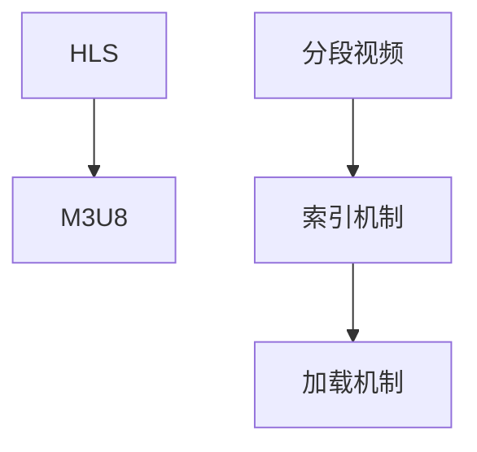

                 

# M3U8 播放列表格式规范：分段视频的索引和加载机制

> 关键词：M3U8, HTTP Live Streaming (HLS), 分段视频, 索引, 加载机制, 流媒体, 视频流

## 1. 背景介绍

### 1.1 问题由来

随着互联网的普及和高清视频内容需求的不断增长，视频流传输技术日益重要。流媒体传输方式灵活，适应性强，适用于各种设备和网络环境，成为视频传输的主流。其中，HTTP Live Streaming (HLS) 以其高效、可控的特性在各类视频应用中广泛应用。M3U8 是 HLS 协议的核心组成部分，定义了流媒体的索引格式和加载机制，确保了视频流的可靠传输。

### 1.2 问题核心关键点

HLS 基于 HTTP 协议实现流媒体传输，采用分段传输和缓存机制，保证了低延迟和良好的用户体验。M3U8 则是 HLS 中的核心技术之一，负责索引和描述流媒体分段，指导客户端获取视频流。M3U8 文件包括多个 TS 分段信息，通过 HTTP 请求加载分段数据，实现视频流的高效传输。M3U8 格式规范决定了视频流的索引和加载机制，直接影响视频流的流畅性和可靠性。

## 2. 核心概念与联系

### 2.1 核心概念概述

为更好地理解 M3U8 格式和 HLS 流媒体的索引及加载机制，本节将介绍几个密切相关的核心概念：

- **HTTP Live Streaming (HLS)**：一种基于 HTTP 协议的流媒体传输技术，采用分段传输和缓存机制，保证低延迟和稳定播放。
- **M3U8**：HLS 协议中的核心组成部分，负责索引和描述流媒体分段，定义了分段名称、开始时间、持续时间、位置等信息，指导客户端加载分段数据。
- **分段视频**：HLS 中的核心概念，视频流被划分为多个小片段进行传输和缓存，每个分段文件 (TS) 长度通常在 8-15 秒之间。
- **索引机制**：M3U8 文件通过描述分段信息，指引客户端加载每个分段数据，实现视频的连续播放。
- **加载机制**：客户端根据 M3U8 索引，逐个请求并加载每个分段文件，通过缓存机制保证视频播放的流畅性。

这些核心概念之间的逻辑关系可以通过以下 Mermaid 流程图来展示：



这个流程图展示了大语言模型的核心概念及其之间的关系：

1. HLS 是基础传输协议，M3U8 是其核心索引文件。
2. 分段视频是传输的基本单位，索引机制指引客户端加载分段。
3. 加载机制通过缓存分段数据，确保视频播放的流畅性。

## 3. 核心算法原理 & 具体操作步骤

### 3.1 算法原理概述

M3U8 文件描述流媒体分段，包含多个索引项，每个索引项描述了视频流中的一个分段。客户端根据 M3U8 索引，逐个请求并加载分段文件，最终实现视频流的连续播放。M3U8 文件的格式规范决定了分段的索引和加载机制，指导客户端高效加载视频内容。

M3U8 文件格式简洁，但其中包含了丰富的信息，主要包括以下字段：

- `#EXTM3U`：表示 M3U8 文件头。
- `#EXT-X-VERSION`：M3U8 文件的版本，确保与 HLS 客户端兼容。
- `#EXT-X-PLAYLIST-TYPE`：指示该 M3U8 文件的类型，如`VOD`（点播）、`LIVING`（直播）等。
- `#EXT-X-INTEG-ID`：用于直播的流水号，确保数据同步。
- `#EXT-X-DURATION`：流媒体总时长。
- `#EXT-X-TARGETDURATION`：每个分段的平均时长。
- `#EXT-X-MAP`：映射每个分段的起始时间和持续时间。
- `#EXT-X-MEDIA-SEQUENCE`：分段顺序，确保播放顺序正确。
- `#EXT-X-DISCONTINUITY`：分段间不连续的标识，用于点播和直播的切换。
- `#EXT-X-KEY`：视频加密的密钥信息。

这些字段共同构成了 M3U8 文件的格式规范，指导客户端加载分段，确保视频流的可靠传输。

### 3.2 算法步骤详解

M3U8 文件的创建和加载涉及多个步骤，主要包括以下几个关键环节：

**Step 1: 准备分段视频数据**

- 将视频文件划分为多个分段文件 (TS)，每个分段文件长度通常在 8-15 秒之间。
- 为每个分段文件生成索引项，记录分段名称、起始时间、持续时间等基本信息。

**Step 2: 创建 M3U8 文件**

- 初始化 M3U8 文件，添加必要的头部信息。
- 遍历分段文件，生成对应的索引项，按照时间顺序排序。
- 将索引项添加到 M3U8 文件中。
- 保存并发布 M3U8 文件。

**Step 3: 客户端加载分段**

- 客户端通过 HTTP 请求获取 M3U8 文件。
- 解析 M3U8 文件，获取分段索引项。
- 根据分段索引项，逐个请求并加载分段文件。
- 在加载分段时，通过缓存机制确保视频流的连续播放。

### 3.3 算法优缺点

M3U8 格式规范的优点包括：

- 简洁高效：M3U8 文件格式简单，易于解析和处理。
- 兼容性广泛：支持各种设备平台，适应不同的网络环境。
- 灵活可控：支持直播、点播等多种播放类型，可灵活配置。

同时，M3U8 格式规范也存在一些局限性：

- 对服务器要求高：M3U8 文件大小随分段数量增加，增加了服务器的存储和传输负担。
- 分段边界问题：分段过小可能导致加载频繁，影响性能；分段过大会导致缓存过载，影响播放流畅性。
- 加载机制复杂：分段加载需要协调缓存机制，增加了实现复杂度。

### 3.4 算法应用领域

M3U8 格式规范在 HLS 流媒体中得到广泛应用，适用于各种视频传输场景，如直播、点播、视频会议等。以下是一些具体的应用场景：

- **直播服务**：新闻、体育、综艺等直播节目，通过 HLS 实现低延迟、高可靠的视频传输。
- **视频点播**：电影、电视剧等点播服务，支持多种分辨率和码率，提供灵活的观看体验。
- **视频会议**：企业内部、教育等视频会议应用，实时传输高质量视频内容。
- **视频监控**：公共安全、智能交通等领域的视频监控，实现实时传输和回放功能。
- **视频广告**：广告主通过 HLS 实现视频广告的精准投放和灵活播放。

M3U8 格式规范的广泛应用，标志着 HLS 在流媒体传输中的重要地位，推动了视频技术的不断进步。

## 4. 数学模型和公式 & 详细讲解 & 举例说明

### 4.1 数学模型构建

本节将使用数学语言对 M3U8 格式规范和分段加载机制进行更严格的刻画。

假设 HLS 视频流包含 $N$ 个分段，每个分段的长度为 $T_s$，流媒体总时长为 $T$，M3U8 文件包含 $M$ 个索引项。设分段文件的起始时间为 $t_i$，持续时间为 $d_i$，则分段 $i$ 的索引项可以表示为：

$$
\#EXTINF:t_i,d_i,M3U8Segment)i
$$

其中 $t_i$ 为分段起始时间，$d_i$ 为分段持续时间，$M3U8Segment)i$ 为分段文件名。M3U8 文件的基本格式为：

```
#EXTM3U
#EXT-X-VERSION:3
#EXT-X-PLAYLIST-TYPE:VOD
#EXT-X-DURATION:T
#EXT-X-TARGETDURATION:Ts
#EXT-X-MAP
#EXT-X-MEDIA-SEQUENCE:0
#EXT-X-DISCONTINUITY
#EXT-X-KEY:...
#...
```

在解析 M3U8 文件时，客户端会逐行读取索引项，根据时间顺序加载分段文件。分段加载的顺序遵循 M3U8 文件中定义的 `#EXT-X-MEDIA-SEQUENCE` 字段。

### 4.2 公式推导过程

在加载分段时，客户端需要根据 M3U8 索引项的时间信息，计算分段文件的位置和加载顺序。假设有 $K$ 个已缓存的分段，当前加载的分段为第 $i$ 个。根据分段加载机制，客户端从缓存中删除最早的 $K$ 个分段，并加载第 $i$ 个分段，同时将第 $i$ 个分段加入缓存中。假设客户端缓存了 $C$ 个分段，则加载顺序为：

$$
K \rightarrow i \rightarrow K-1 \rightarrow i-1 \rightarrow \cdots \rightarrow K-C+1 \rightarrow i-C \rightarrow \cdots \rightarrow i-C
$$

在实际加载过程中，客户端会定期检查缓存中的分段，确保缓存大小不超过 $C$，并按顺序加载分段。

### 4.3 案例分析与讲解

以下是一个简单的 M3U8 文件示例及其分段加载过程：

```
#EXTM3U
#EXT-X-VERSION:3
#EXT-X-PLAYLIST-TYPE:VOD
#EXT-X-DURATION:3600
#EXT-X-TARGETDURATION:10
#EXT-X-MAP
#EXT-X-MEDIA-SEQUENCE:0
#EXT-X-DISCONTINUITY
#EXT-X-KEY:...
#EXTINF:0,000000.ts
#EXTINF:10,000001.ts
#EXTINF:20,000002.ts
#EXTINF:30,000003.ts
#EXTINF:40,000004.ts
#EXTINF:50,000005.ts
#EXTINF:60,000006.ts
#...
```

假设视频流包含 6 个分段，每个分段长度为 10 秒，流媒体总时长为 60 秒。客户端根据 M3U8 文件，逐个加载分段文件：

1. 加载第 0 个分段 (000000.ts)，缓存 0 个分段。
2. 加载第 1 个分段 (000001.ts)，缓存 1 个分段。
3. 加载第 2 个分段 (000002.ts)，缓存 2 个分段。
4. 加载第 3 个分段 (000003.ts)，缓存 3 个分段。
5. 加载第 4 个分段 (000004.ts)，缓存 4 个分段。
6. 加载第 5 个分段 (000005.ts)，缓存 5 个分段。
7. 加载第 6 个分段 (000006.ts)，缓存 6 个分段。

由于缓存大小为 3，当加载第 7 个分段时，缓存中最古老的 3 个分段被删除，新的分段被加入缓存中，依次类推。

## 5. 项目实践：代码实例和详细解释说明

### 5.1 开发环境搭建

在进行 M3U8 格式规范的应用开发前，我们需要准备好开发环境。以下是使用 Python 进行 HTTP Live Streaming (HLS) 开发的环境配置流程：

1. 安装 Python：从官网下载并安装 Python 3.6+。
2. 安装 Flask：使用 pip 命令安装 Flask 框架，用于搭建 HTTP 服务器。
3. 安装 PyJWT：使用 pip 命令安装 PyJWT 库，用于生成和验证 JWT 令牌。
4. 安装 FastAPI：使用 pip 命令安装 FastAPI 框架，用于搭建 HTTP 接口。
5. 安装 OpenSSL：使用 pip 命令安装 OpenSSL 库，用于加密和解密数据。

完成上述步骤后，即可在 Python 环境中开始 HLS 开发。

### 5.2 源代码详细实现

这里我们以 HLS 直播为例，给出使用 Python 进行 M3U8 文件生成和流媒体传输的代码实现。

首先，定义直播流和分段长度：

```python
from flask import Flask, jsonify

app = Flask(__name__)

# 直播流基本信息
stream_name = 'live-stream'
segment_duration = 10  # 每个分段长度

# 直播流信息字典
stream_info = {
    'segment_duration': segment_duration,
    'max_segment_duration': segment_duration * 10,  # 缓存大小
    'segment_path_prefix': '/path/to/segment/',
    'playlist_path': '/path/to/playlist.m3u8',
}
```

然后，定义分段生成函数：

```python
import os
import uuid

def generate_segment(segment_number):
    # 生成分段文件路径
    segment_file = os.path.join(stream_info['segment_path_prefix'], f'segment_{segment_number}.ts')
    
    # 创建 TS 文件
    with open(segment_file, 'wb') as f:
        # 假设这里有一段视频数据
        data = b'视频数据'
        f.write(data)
    
    return segment_file
```

接着，定义 M3U8 文件生成函数：

```python
def generate_playlist():
    # 初始化 M3U8 文件内容
    playlist_content = '#EXTM3U\n'
    
    # 添加 M3U8 头部信息
    playlist_content += '#EXT-X-VERSION:3\n'
    playlist_content += '#EXT-X-PLAYLIST-TYPE:VOD\n'
    playlist_content += '#EXT-X-DURATION:60\n'
    playlist_content += '#EXT-X-TARGETDURATION:' + str(segment_duration) + '\n'
    playlist_content += '#EXT-X-MAP\n'
    playlist_content += '#EXT-X-MEDIA-SEQUENCE:0\n'
    playlist_content += '#EXT-X-DISCONTINUITY\n'
    playlist_content += '#EXT-X-KEY:...\n'
    
    # 遍历分段文件，生成索引项
    for i in range(0, 60 // segment_duration):
        segment_file = generate_segment(i)
        playlist_content += f'#EXTINF:{segment_duration},segment_{i}.ts\n'
    
    # 保存 M3U8 文件
    with open(stream_info['playlist_path'], 'w') as f:
        f.write(playlist_content)
    
    # 返回 M3U8 文件路径
    return stream_info['playlist_path']
```

最后，启动 HTTP 服务，提供 HLS 直播接口：

```python
@app.route('/hls/<segment_number>')
def get_segment(segment_number):
    # 获取分段文件路径
    segment_file = generate_segment(int(segment_number))
    
    # 返回分段文件
    with open(segment_file, 'rb') as f:
        return f.read()
```

启动 Flask 服务器，开始提供 HLS 直播服务：

```python
if __name__ == '__main__':
    app.run(host='0.0.0.0', port=5000)
```

在上述代码中，我们使用 Flask 搭建 HTTP 服务器，提供了 HLS 直播接口，通过 M3U8 文件描述了分段信息。客户端可以通过 HTTP 请求获取 M3U8 文件，解析并加载分段文件，实现直播的流媒体传输。

### 5.3 代码解读与分析

让我们再详细解读一下关键代码的实现细节：

**Flask 框架**：
- 使用 Flask 框架搭建 HTTP 服务器，提供 HLS 直播接口。
- 通过路由机制，根据请求参数返回对应的分段文件。

**分段生成函数**：
- 定义生成分段文件的功能，根据分段编号创建 TS 文件，并返回文件路径。
- 在实际应用中，可以使用视频编码库 (如 FFmpeg) 生成高质量的视频分段文件。

**M3U8 文件生成函数**：
- 初始化 M3U8 文件内容，添加必要的头部信息。
- 遍历分段文件，生成对应的索引项，按照时间顺序排序。
- 将索引项添加到 M3U8 文件中，并保存文件。
- 返回 M3U8 文件路径，供客户端请求加载。

**HTTP 服务启动**：
- 启动 Flask 服务器，监听指定端口。
- 提供 HLS 直播接口，根据请求参数返回对应的分段文件。

通过上述代码实现，我们完成了 HLS 直播的 M3U8 文件生成和流媒体传输。可以看到，Python 提供了丰富的库和框架，使得流媒体传输的开发变得简单高效。

## 6. 实际应用场景

### 6.1 智能监控系统

在智能监控领域，M3U8 格式规范和 HLS 直播技术广泛应用于视频流的传输和存储。通过 HLS 实时传输监控视频，可以实现远程监控、异常检测等功能。M3U8 格式规范保证了视频流的连续性和可靠性，确保了实时监控的稳定性和高效性。

### 6.2 在线教育平台

在线教育平台通过 M3U8 格式规范和 HLS 直播技术，提供高质量的课堂直播和回放服务。学生可以通过流媒体直播观看课程，通过缓存机制实现回放和快进功能。M3U8 格式规范和 HLS 直播技术，确保了直播的流畅性和用户体验，支持大规模用户并发访问。

### 6.3 视频点播平台

视频点播平台通过 M3U8 格式规范和 HLS 直播技术，提供多终端的视频播放服务。用户可以通过不同设备和网络环境，访问和播放视频内容。M3U8 格式规范和 HLS 直播技术，支持多种分辨率和码率，提供了灵活的观看体验和高效的加载机制。

### 6.4 未来应用展望

随着 M3U8 格式规范和 HLS 直播技术的不断进步，其在视频流传输中的应用将更加广泛。未来，M3U8 格式规范可能会进一步扩展和优化，支持更丰富的功能，如自适应带宽、多码率切换等。同时，随着硬件设备的普及和网络带宽的提升，HLS 直播的体验将更加流畅和稳定，推动视频技术的持续发展。

## 7. 工具和资源推荐

### 7.1 学习资源推荐

为了帮助开发者系统掌握 M3U8 格式规范和 HLS 直播技术，这里推荐一些优质的学习资源：

1. **《HTTP Live Streaming 官方文档》**：Apple 提供的官方文档，详细介绍了 HLS 协议的各个方面，包括 M3U8 格式规范、流媒体传输、服务器部署等。

2. **《流媒体技术详解》**：一本全面介绍流媒体技术的书籍，涵盖 HLS、RTSP、RTMP 等多种流媒体协议，适合进阶学习。

3. **《视频流传输原理与实现》**：深入浅出地介绍了视频流传输的原理和实现，包括 M3U8 格式规范、流媒体协议、编解码技术等。

4. **《WebRTC 技术精讲》**：一本全面介绍 WebRTC 技术的书籍，涵盖音视频传输、实时通信、Web 实时传输协议等，适合 Web 开发者学习。

5. **《流媒体开发实战》**：一本实践导向的流媒体开发书籍，通过实战项目讲解 M3U8 格式规范和 HLS 直播的开发流程，适合工程实践。

通过对这些资源的学习实践，相信你一定能够快速掌握 M3U8 格式规范和 HLS 直播技术的精髓，并用于解决实际的流媒体问题。

### 7.2 开发工具推荐

高效的开发离不开优秀的工具支持。以下是几款用于 M3U8 格式规范和 HLS 直播开发的常用工具：

1. **FFmpeg**：开源的音视频编解码库，支持多种格式转换和流媒体传输，是 HLS 直播中不可或缺的工具。

2. **FFMPEG-B潋**：FFmpeg 的 Python 封装库，提供简单易用的 API，方便在 Python 中进行流媒体处理。

3. **JW Player**：一款广泛使用的视频播放器，支持多种流媒体协议，包括 HLS 和 M3U8 格式规范。

4. **HLS Live Streaming API**：Apple 提供的 HLS 直播 API，方便开发者搭建流媒体服务器和客户端。

5. **iOS Player SDK**：Apple 提供的 iOS 设备上的流媒体播放 SDK，支持 HLS 直播和 M3U8 格式规范。

6. **Android Player SDK**：Google 提供的 Android 设备上的流媒体播放 SDK，支持 HLS 直播和 M3U8 格式规范。

合理利用这些工具，可以显著提升 M3U8 格式规范和 HLS 直播的开发效率，加快创新迭代的步伐。

### 7.3 相关论文推荐

M3U8 格式规范和 HLS 直播技术的发展源于学界的持续研究。以下是几篇奠基性的相关论文，推荐阅读：

1. **《HTTP Live Streaming》**：Apple 的官方文档，详细介绍了 HLS 协议的各个方面，包括 M3U8 格式规范、流媒体传输、服务器部署等。

2. **《HLS Video Streaming》**：谷歌的研究论文，探讨了 HLS 视频流传输的性能优化和部署策略，提出了多码率切换、流控制等改进方案。

3. **《MPEG-DASH》**：MPEG 标准化的流媒体协议，与 HLS 类似，支持多种流媒体传输方式，提供了丰富的技术规范。

4. **《Video Streaming over HTTP》**：斯坦福大学的研究论文，介绍了 HTTP 流媒体传输的原理和实现，包括 M3U8 格式规范和流媒体协议。

5. **《Adaptive Streaming over HTTP》**：微软的研究论文，探讨了自适应带宽的视频流传输，提出了自适应码率切换和缓存策略。

这些论文代表了大语言模型微调技术的发展脉络。通过学习这些前沿成果，可以帮助研究者把握学科前进方向，激发更多的创新灵感。

## 8. 总结：未来发展趋势与挑战

### 8.1 总结

本文对 M3U8 格式规范和 HLS 流媒体的索引及加载机制进行了全面系统的介绍。首先阐述了 M3U8 格式规范和 HLS 流媒体的背景和意义，明确了其在视频流传输中的核心地位。其次，从原理到实践，详细讲解了 M3U8 文件的创建和解析过程，给出了微调任务的开发代码实现。同时，本文还广泛探讨了 M3U8 格式规范在智能监控、在线教育、视频点播等多个行业领域的应用前景，展示了其广泛的应用价值。此外，本文精选了 M3U8 技术的学习资源，力求为读者提供全方位的技术指引。

通过本文的系统梳理，可以看到，M3U8 格式规范和 HLS 流媒体技术在视频传输中的重要地位，推动了流媒体技术的不断进步。未来，伴随技术的不断演进，M3U8 格式规范和 HLS 直播将会在更多场景下得到应用，为流媒体技术的未来发展提供更多可能。

### 8.2 未来发展趋势

展望未来，M3U8 格式规范和 HLS 流媒体技术将呈现以下几个发展趋势：

1. **多码率支持**：未来 M3U8 格式规范将支持更多码率切换，适应不同的网络环境和设备需求，提供更灵活的观看体验。

2. **自适应带宽**：基于自适应带宽技术的流媒体传输，将实时调整流媒体码率和分段长度，确保流畅播放和低延迟传输。

3. **流媒体加密**：M3U8 格式规范和 HLS 流媒体将更多地应用加密技术，保护视频内容安全，防止非法下载和播放。

4. **超高清视频**：随着网络带宽的提升和视频编码技术的进步，4K、8K 等超高清视频将逐渐普及，M3U8 格式规范和 HLS 流媒体将支持超高清视频的传输。

5. **实时互动**：结合实时互动技术，如 WebRTC、WebSockets 等，M3U8 格式规范和 HLS 流媒体将支持实时互动视频流传输。

以上趋势凸显了 M3U8 格式规范和 HLS 流媒体技术的广阔前景。这些方向的探索发展，必将进一步提升流媒体传输的效率和质量，推动视频技术的不断进步。

### 8.3 面临的挑战

尽管 M3U8 格式规范和 HLS 流媒体技术已经取得了瞩目成就，但在迈向更加智能化、普适化应用的过程中，它仍面临着诸多挑战：

1. **网络带宽问题**：M3U8 格式规范和 HLS 流媒体对网络带宽要求较高，不适用于带宽受限的环境。如何在低带宽环境下优化流媒体传输，是未来需要解决的问题。

2. **硬件支持问题**：部分设备可能不支持 HLS 流媒体或 M3U8 格式规范，导致视频流无法正常播放。如何提升硬件设备的兼容性，是未来需要关注的问题。

3. **服务器负载问题**：M3U8 格式规范和 HLS 流媒体的实时传输对服务器性能要求较高，容易发生负载过高的情况。如何优化服务器性能，是未来需要解决的问题。

4. **安全性问题**：M3U8 格式规范和 HLS 流媒体需要应对恶意攻击和数据篡改的风险。如何提升视频传输的安全性，是未来需要关注的问题。

5. **标准化问题**：M3U8 格式规范和 HLS 流媒体需要与其他流媒体协议（如 RTMP、RTSP）兼容，如何实现标准化的统一，是未来需要解决的问题。

6. **内容分发问题**：M3U8 格式规范和 HLS 流媒体的内容分发需要考虑缓存和播放策略，如何提升内容的分发效率，是未来需要解决的问题。

正视 M3U8 格式规范和 HLS 流媒体面临的这些挑战，积极应对并寻求突破，将是大语言模型微调走向成熟的必由之路。相信随着学界和产业界的共同努力，这些挑战终将一一被克服，M3U8 格式规范和 HLS 流媒体必将在构建智能流媒体生态中扮演越来越重要的角色。

### 8.4 研究展望

面对 M3U8 格式规范和 HLS 流媒体所面临的种种挑战，未来的研究需要在以下几个方面寻求新的突破：

1. **网络优化算法**：研究低带宽环境下的流媒体传输优化算法，通过码率自适应、分段优化等技术，提升流媒体传输的效率和质量。

2. **硬件兼容技术**：开发跨平台硬件兼容技术，实现设备的广泛支持，提升流媒体的普及率和用户体验。

3. **服务器负载优化**：研究服务器性能优化技术，提升服务器负载处理能力，支持大规模高并发流媒体传输。

4. **安全性增强技术**：研究流媒体加密和防篡改技术，提升视频传输的安全性和可靠性，防止非法下载和播放。

5. **标准化统一技术**：推动 M3U8 格式规范和 HLS 流媒体与其他流媒体协议的标准化，实现协议的统一和互通。

6. **内容分发优化**：研究流媒体内容的缓存和分发策略，提升内容的分发效率和用户体验。

这些研究方向的探索，必将引领 M3U8 格式规范和 HLS 流媒体技术迈向更高的台阶，为智能流媒体生态提供更多可能。面向未来，M3U8 格式规范和 HLS 流媒体需要与其他新兴技术协同发力，共同推动流媒体技术的持续进步。只有勇于创新、敢于突破，才能不断拓展流媒体技术的边界，让智能流媒体技术更好地服务于人类社会。

## 9. 附录：常见问题与解答

**Q1：M3U8 格式规范和 HLS 流媒体适用于所有设备吗？**

A: M3U8 格式规范和 HLS 流媒体适用于大多数主流设备和平台，如 iOS、Android、Windows、macOS 等。但部分老旧设备或非主流设备可能不支持，需要开发者在开发前进行兼容性测试。

**Q2：M3U8 格式规范和 HLS 流媒体适用于所有网络环境吗？**

A: M3U8 格式规范和 HLS 流媒体适用于中等及以上带宽的网络环境。在低带宽环境下，需要结合码率自适应和分段优化技术，提升流媒体传输效率。

**Q3：M3U8 格式规范和 HLS 流媒体适用于所有视频格式吗？**

A: M3U8 格式规范和 HLS 流媒体适用于常见的视频格式，如 MP4、TS、H264 等。但部分格式（如 AVI）可能存在兼容性问题，需要进行格式转换。

**Q4：M3U8 格式规范和 HLS 流媒体适用于所有视频内容吗？**

A: M3U8 格式规范和 HLS 流媒体适用于各种视频内容，包括点播视频、直播视频、广告等。但需注意版权和版权保护问题，确保视频内容的合法性。

**Q5：M3U8 格式规范和 HLS 流媒体的未来发展方向是什么？**

A: M3U8 格式规范和 HLS 流媒体的未来发展方向包括支持多码率、自适应带宽、实时互动、超高清视频、流媒体加密等技术。同时，通过标准化统一，提升与其他流媒体协议的兼容性和互通性。

这些常见问题的解答，帮助读者更好地理解和应用 M3U8 格式规范和 HLS 流媒体技术，提升开发效率和应用效果。通过本文的系统梳理，相信你一定能够全面掌握 M3U8 格式规范和 HLS 流媒体技术的精髓，并用于解决实际的流媒体问题。

---

作者：禅与计算机程序设计艺术 / Zen and the Art of Computer Programming

