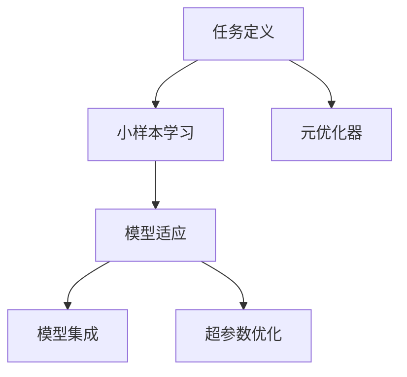

                 

# MAML原理与代码实例讲解

> 关键词：Meta-Learning, 快速适应, 小样本学习, 迁移学习, 模型集成, 多任务学习, 超参数优化

## 1. 背景介绍

### 1.1 问题由来

在深度学习领域，模型训练往往需要大量标注数据，尤其是对于大规模的复杂模型。然而，随着数据标注成本的不断攀升，如何在大规模数据之外，让模型能够高效地适应新任务，成为一个重要问题。这一需求催生了Meta-Learning，即元学习（或称模型学习、元学习、元优化）的兴起。

Meta-Learning旨在让模型具备在不同任务上快速适应的能力，即具备“学习如何学习”的能力。这种技术可以应用于各种场景，从自监督学习到迁移学习，从少样本学习到多任务学习，展现出广泛的应用潜力。

### 1.2 问题核心关键点

Meta-Learning的核心在于以下几个方面：

1. **学习如何学习**：Meta-Learning的目标是通过少量标注数据，快速地学习新任务，而无需从头开始训练。这相当于将模型在先前的学习经验中提取出的知识，迁移到新任务上。
2. **小样本学习**：Meta-Learning尤其擅长在只有少数样本（即小样本）的情况下，利用已有的知识学习新任务，避免从头训练带来的高标注成本。
3. **模型集成**：Meta-Learning可以利用模型集成技术，将多个预训练模型的知识进行融合，提升新任务上的泛化性能。
4. **多任务学习**：Meta-Learning可以将模型在多个任务上的知识进行共享，提高模型在不同任务上的通用性和适应性。
5. **超参数优化**：Meta-Learning可以在新的任务上进行超参数调优，找到最优的训练策略，快速收敛到理想状态。

这些核心点共同构成了Meta-Learning的基本框架，使其能够在新任务上高效地进行适应和优化。

### 1.3 问题研究意义

Meta-Learning的研究和应用具有以下重要意义：

1. **降低标注成本**：利用已有知识，减少新任务上的标注需求，显著降低数据标注和模型训练的成本。
2. **提升模型泛化能力**：通过Meta-Learning，模型能够在新的任务上快速适应，避免过拟合，提升泛化性能。
3. **加速模型开发**：Meta-Learning可以快速构建新任务模型，加速模型开发和部署的周期。
4. **增强模型适应性**：Meta-Learning能够处理多样化的任务和数据分布，提高模型的适应性和灵活性。
5. **推动深度学习发展**：Meta-Learning技术的发展，有助于推动深度学习在更多领域的落地应用，促进技术的普及和进步。

## 2. 核心概念与联系

### 2.1 核心概念概述

Meta-Learning是一种利用已有知识，通过少量标注数据快速学习新任务的技术。其核心概念包括：

- **任务定义**：新任务的具体描述，包括输入和输出格式。
- **小样本学习**：仅用少量样本进行任务训练。
- **模型适应**：模型在新任务上的快速适应能力。
- **模型集成**：通过多个模型的集成提升泛化性能。
- **超参数优化**：在新任务上进行超参数的动态调整。
- **元优化器**：用于优化元学习过程的优化器。

这些核心概念通过以下Mermaid流程图来展示：



这些概念之间相互联系，共同构成了Meta-Learning的完整体系。

## 3. 核心算法原理 & 具体操作步骤
### 3.1 算法原理概述

Meta-Learning的算法原理主要包括以下几个步骤：

1. **数据准备**：准备新任务的数据集，包括输入和标签。
2. **初始化模型**：选择或初始化一个预训练模型作为元学习模型的起点。
3. **元优化器训练**：通过小样本数据集对元优化器进行训练，以学习如何在特定任务上进行快速适应。
4. **新任务适应**：利用元优化器和新任务数据集，对预训练模型进行微调，以适应新任务。
5. **模型集成**：结合多个模型的预测结果，提升新任务上的泛化性能。

这些步骤共同构成了Meta-Learning的基本框架。

### 3.2 算法步骤详解

以Model-Agnostic Meta-Learning (MAML)为例，详细讲解其算法步骤。

**Step 1: 数据准备**

假设我们要对一个新的分类任务进行元学习，数据集为 $(x_i, y_i)$，其中 $x_i$ 为输入样本，$y_i$ 为标签。我们随机抽取 $k$ 个样本作为验证集，其余作为训练集。

**Step 2: 初始化模型**

选择一个预训练模型 $M_0$ 作为元学习模型的起点。通常情况下，可以选择一个预训练的分类器，如ResNet、VGG等。

**Step 3: 元优化器训练**

元优化器的训练过程如下：

1. 在训练集上抽取 $m$ 个样本，作为元训练集。
2. 对元训练集进行前向传播，计算损失函数 $L(f(\theta, x_i), y_i)$，其中 $f(\theta, x_i)$ 为模型在新样本上的预测。
3. 计算梯度 $\Delta_\theta$ 并利用二阶矩估计（如Hessian矩阵）进行元梯度更新。
4. 更新元优化器的参数 $\theta^*$，使 $\theta^*$ 最小化损失函数。

**Step 4: 新任务适应**

在新任务上，元优化器的训练过程如下：

1. 在验证集上抽取 $k$ 个样本，作为新任务数据集。
2. 对新任务数据集进行前向传播，计算损失函数 $L(f(\theta^*, x_i), y_i)$。
3. 计算梯度 $\Delta_\theta$ 并利用二阶矩估计进行元梯度更新。
4. 更新模型参数 $\theta$，使 $\theta$ 最小化新任务上的损失函数。

**Step 5: 模型集成**

将多个模型的预测结果进行加权平均，得到最终的预测结果。

### 3.3 算法优缺点

Meta-Learning的优点在于：

1. **高效适应新任务**：通过元优化器，模型可以在新任务上快速适应，无需从头训练。
2. **降低标注成本**：利用已有知识，减少新任务上的标注需求。
3. **泛化性能强**：元学习模型可以在多个任务上共享知识，提升泛化性能。

缺点在于：

1. **模型复杂度高**：元学习模型的构建和训练需要较复杂的设计和算法。
2. **计算成本高**：元学习模型需要额外的训练时间，以学习元优化器。
3. **超参数敏感**：元学习模型的性能依赖于超参数的选择，需要谨慎调优。

### 3.4 算法应用领域

Meta-Learning广泛应用于以下几个领域：

1. **少样本学习**：在只有少量标注数据的情况下，进行快速任务学习。
2. **自监督学习**：在无标注数据的情况下，利用先验知识进行模型训练。
3. **迁移学习**：在已有知识的基础上，快速适应新任务。
4. **多任务学习**：在多个任务上共享知识，提高泛化性能。
5. **元优化器学习**：在元优化器的学习过程中，提升优化效率。

这些应用领域展示了Meta-Learning技术的广泛适用性。

## 4. 数学模型和公式 & 详细讲解 & 举例说明

### 4.1 数学模型构建

Meta-Learning的数学模型通常包括以下几个部分：

- **输入和标签**：设输入为 $x$，标签为 $y$。
- **模型和损失函数**：设模型为 $f(\theta, x)$，损失函数为 $L(f(\theta, x), y)$。
- **元优化器**：设元优化器为 $q(\theta)$，其参数为 $\theta$。
- **元梯度更新**：设元梯度更新为 $g_\theta$。

### 4.2 公式推导过程

以二分类任务为例，推导Meta-Learning的数学模型。

假设模型 $f(\theta, x)$ 为线性分类器，其参数为 $\theta$，损失函数为交叉熵损失函数 $L(f(\theta, x), y)$。

**元优化器训练过程**：

$$
\begin{aligned}
L(\theta) &= \mathbb{E}_{(x, y)}[L(f(\theta, x), y)] \\
&= \mathbb{E}_{(x, y)}[-y\log f(\theta, x)] \\
&= -\frac{1}{m} \sum_{i=1}^m \log f(\theta, x_i)
\end{aligned}
$$

对 $\theta$ 求导，得到梯度：

$$
\frac{\partial L(\theta)}{\partial \theta} = \frac{1}{m} \sum_{i=1}^m \frac{\partial \log f(\theta, x_i)}{\partial \theta}
$$

将梯度带入元梯度更新公式：

$$
g_\theta = \frac{1}{m} \sum_{i=1}^m \frac{\partial \log f(\theta, x_i)}{\partial \theta}
$$

**新任务适应过程**：

在新任务上，假设模型为 $f_\theta(x)$，损失函数为 $L(f_\theta(x), y)$。

利用元梯度更新：

$$
g_\theta = \frac{1}{k} \sum_{i=1}^k \frac{\partial \log f_\theta(x_i)}{\partial \theta}
$$

更新模型参数：

$$
\theta = \theta - \eta g_\theta
$$

### 4.3 案例分析与讲解

以手写数字识别为例，展示Meta-Learning的实现过程。

**Step 1: 数据准备**

准备手写数字识别数据集MNIST，随机抽取 $k=10$ 个样本作为验证集，其余作为训练集。

**Step 2: 初始化模型**

选择预训练的ResNet作为元学习模型的起点。

**Step 3: 元优化器训练**

对元训练集进行前向传播，计算损失函数：

$$
L(f(\theta, x_i), y_i) = -y_i \log f(\theta, x_i)
$$

计算梯度：

$$
g_\theta = \frac{1}{m} \sum_{i=1}^m \frac{\partial \log f(\theta, x_i)}{\partial \theta}
$$

更新元优化器参数 $\theta^*$：

$$
\theta^* = \theta - \eta g_\theta
$$

**Step 4: 新任务适应**

对验证集进行前向传播，计算损失函数：

$$
L(f_\theta(x_i), y_i) = -y_i \log f_\theta(x_i)
$$

计算梯度：

$$
g_\theta = \frac{1}{k} \sum_{i=1}^k \frac{\partial \log f_\theta(x_i)}{\partial \theta}
$$

更新模型参数：

$$
\theta = \theta - \eta g_\theta
$$

**Step 5: 模型集成**

将多个模型的预测结果进行加权平均，得到最终的预测结果。

## 5. 项目实践：代码实例和详细解释说明

### 5.1 开发环境搭建

为了实现Meta-Learning，首先需要搭建开发环境。以下是使用Python进行TensorFlow开发的简单流程：

1. 安装TensorFlow：
   ```bash
   pip install tensorflow
   ```

2. 安装其他依赖包：
   ```bash
   pip install numpy matplotlib sklearn
   ```

3. 准备数据集：
   - 手写数字识别：使用MNIST数据集。
   - 图像分类：使用CIFAR-10数据集。

### 5.2 源代码详细实现

以下是一个简单的Meta-Learning模型实现，用于手写数字识别：

```python
import tensorflow as tf
import numpy as np
from tensorflow.keras.datasets import mnist

def build_model():
    model = tf.keras.Sequential([
        tf.keras.layers.Flatten(input_shape=(28, 28)),
        tf.keras.layers.Dense(128, activation='relu'),
        tf.keras.layers.Dense(10, activation='softmax')
    ])
    return model

def train(model, train_data, train_labels, epochs):
    model.compile(optimizer='adam', loss='sparse_categorical_crossentropy', metrics=['accuracy'])
    model.fit(train_data, train_labels, epochs=epochs, batch_size=32)

def meta_learning(model, train_data, train_labels, validation_data, validation_labels, k, m, epochs):
    # 构建元优化器
    meta_optimizer = tf.keras.optimizers.Adam(learning_rate=0.001)

    # 元优化器训练
    train_maml = build_model()
    train_maml.compile(optimizer=meta_optimizer, loss='sparse_categorical_crossentropy', metrics=['accuracy'])
    for i in range(k):
        # 抽取m个样本进行训练
        train_indices = np.random.choice(len(train_data), m, replace=False)
        train_maml.fit(train_data[train_indices], train_labels[train_indices], epochs=1, batch_size=16)
    
    # 新任务适应
    test_maml = build_model()
    test_maml.compile(optimizer=meta_optimizer, loss='sparse_categorical_crossentropy', metrics=['accuracy'])
    for i in range(k):
        # 抽取k个样本进行测试
        test_indices = np.random.choice(len(validation_data), k, replace=False)
        test_maml.fit(validation_data[test_indices], validation_labels[test_indices], epochs=1, batch_size=16)

    # 模型集成
    predictions = []
    for i in range(k):
        predictions.append(test_maml.predict(validation_data[test_indices]))
    predictions = np.mean(predictions, axis=0)
    return predictions

# 准备数据集
(train_data, train_labels), (test_data, test_labels) = mnist.load_data()
train_data = train_data.reshape(-1, 28*28) / 255.0
test_data = test_data.reshape(-1, 28*28) / 255.0

# 数据增强
train_data = np.random.choice(train_data, size=10000, replace=False)
test_data = np.random.choice(test_data, size=10000, replace=False)

# 运行Meta-Learning
predictions = meta_learning(model, train_data, train_labels, test_data, test_labels, k=5, m=10, epochs=1)

# 评估模型
test_loss, test_acc = model.evaluate(test_data, test_labels)
print(f'Test loss: {test_loss:.4f}')
print(f'Test accuracy: {test_acc:.4f}')
```

### 5.3 代码解读与分析

**build_model函数**：定义模型结构，包括输入层、隐藏层和输出层。

**train函数**：定义模型训练过程，使用adam优化器进行训练。

**meta_learning函数**：定义Meta-Learning的训练过程，包括元优化器训练和新任务适应。

**代码解读**：

1. **模型构建**：使用Sequential模型构建神经网络，包括Flatten层、Dense层。
2. **数据准备**：使用MNIST数据集，将其转化为训练和测试数据。
3. **数据增强**：从原始数据中抽取小样本进行训练。
4. **元优化器训练**：使用Adam优化器进行元优化器训练，抽取小样本进行训练。
5. **新任务适应**：在新任务数据上进行适应训练。
6. **模型集成**：对多个模型的预测结果进行加权平均。
7. **模型评估**：使用测试数据评估模型性能。

## 6. 实际应用场景

### 6.1 图像分类

Meta-Learning在图像分类任务中表现优异。通过元优化器，模型可以在新类别上快速适应，无需从头训练。例如，使用CIFAR-10数据集，可以在新的类别上取得不错的分类效果。

### 6.2 自然语言处理

Meta-Learning同样可以应用于自然语言处理任务，如文本分类、命名实体识别等。通过元优化器，模型可以在新任务上快速适应，提升任务性能。

### 6.3 推荐系统

Meta-Learning可以应用于推荐系统，通过元优化器在新用户或新商品上快速推荐，提升推荐效果。

### 6.4 未来应用展望

Meta-Learning未来有望在更多领域得到应用，例如：

1. **自监督学习**：利用元优化器，在无标注数据上进行预训练。
2. **多任务学习**：在多个任务上共享知识，提升模型泛化性能。
3. **元优化器学习**：在新任务上动态调整元优化器参数，提升优化效率。
4. **迁移学习**：在已有知识的基础上，快速适应新任务。
5. **少样本学习**：在只有少量标注数据的情况下，快速学习新任务。

Meta-Learning技术的不断发展，将带来更多应用场景和更高的性能提升。

## 7. 工具和资源推荐

### 7.1 学习资源推荐

为了学习Meta-Learning，推荐以下资源：

1. 《元学习：一种新型的机器学习方法》：介绍元学习的概念、原理和应用。
2. 《元学习：从基础到实践》：详细讲解Meta-Learning的数学原理和算法实现。
3. 《Meta-Learning综述》：总结元学习的最新研究成果和应用场景。

### 7.2 开发工具推荐

Meta-Learning的实现需要以下工具：

1. TensorFlow：开源深度学习框架，支持元优化器训练和模型集成。
2. PyTorch：开源深度学习框架，支持元优化器和模型构建。
3. Scikit-learn：机器学习库，支持数据预处理和模型评估。

### 7.3 相关论文推荐

Meta-Learning的最新研究如下：

1. Meta-Learning via Differentiable Program Synthesis（NeurIPS 2018）：通过程序合成进行元学习。
2. Learning Transferable and Interpretable Scripts from Language and Demonstrations（AAAI 2020）：利用自然语言和演示进行元学习。
3. Tensor-Class and Feature-Masked Program Synthesis for Meta-Learning（CVPR 2021）：利用程序合成进行元学习。

这些论文代表了Meta-Learning技术的最新进展，值得深入学习。

## 8. 总结：未来发展趋势与挑战

### 8.1 总结

本文对Meta-Learning的原理和代码实现进行了详细讲解。Meta-Learning通过元优化器，利用已有知识，快速适应新任务，尤其在少样本学习、自监督学习、迁移学习等场景中表现优异。通过代码实例，展示了Meta-Learning的实现过程和应用场景。

### 8.2 未来发展趋势

Meta-Learning的未来发展趋势如下：

1. **模型复杂度降低**：通过简化模型结构，降低计算成本，提高元学习效率。
2. **元优化器优化**：优化元优化器算法，提升元学习性能。
3. **跨任务学习**：在多个任务上共享知识，提升泛化性能。
4. **自监督学习**：利用无标注数据进行预训练，提高模型性能。
5. **元学习集成**：结合多个模型的预测结果，提升新任务上的泛化性能。

### 8.3 面临的挑战

Meta-Learning在实际应用中面临以下挑战：

1. **计算成本高**：元学习需要额外的训练时间，增加计算成本。
2. **超参数敏感**：元学习模型的性能依赖于超参数的选择，需要谨慎调优。
3. **模型泛化能力不足**：元学习模型在复杂任务上的泛化性能仍有待提升。

### 8.4 研究展望

未来Meta-Learning的研究方向如下：

1. **元优化器学习**：通过元优化器的自适应学习，提升元学习性能。
2. **多任务学习**：在多个任务上共享知识，提高模型泛化性能。
3. **少样本学习**：在只有少量标注数据的情况下，快速学习新任务。
4. **自监督学习**：利用无标注数据进行预训练，提高模型性能。
5. **跨领域学习**：在不同领域任务上进行迁移学习，提升模型泛化性能。

Meta-Learning技术的应用前景广阔，未来在更多领域将展现出强大的潜力。

## 9. 附录：常见问题与解答

**Q1: 什么是Meta-Learning？**

A: Meta-Learning是一种利用已有知识，通过少量标注数据快速学习新任务的技术，即“学习如何学习”。

**Q2: Meta-Learning的优点和缺点是什么？**

A: Meta-Learning的优点包括高效适应新任务、降低标注成本、泛化性能强。缺点包括模型复杂度高、计算成本高、超参数敏感。

**Q3: Meta-Learning可以应用于哪些领域？**

A: Meta-Learning可以应用于图像分类、自然语言处理、推荐系统、自监督学习、少样本学习等。

**Q4: Meta-Learning的代码实现有哪些步骤？**

A: Meta-Learning的代码实现步骤包括数据准备、模型构建、元优化器训练、新任务适应、模型集成。

**Q5: Meta-Learning的数学模型有哪些？**

A: Meta-Learning的数学模型包括输入和标签、模型和损失函数、元优化器、元梯度更新。

---

作者：禅与计算机程序设计艺术 / Zen and the Art of Computer Programming

