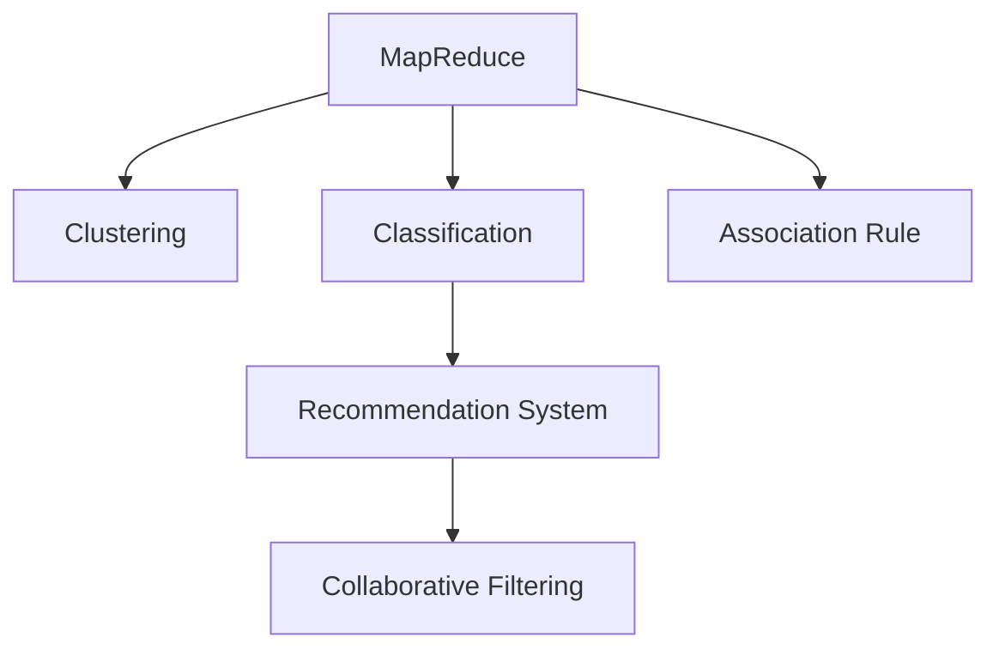

                 

# Mahout原理与代码实例讲解

> 关键词：

## 1. 背景介绍

### 1.1 问题由来
Mahout是一个开源的分布式机器学习库，基于Apache Hadoop生态系统。自2009年发布以来，它已经成为了大数据时代机器学习应用的代表。Mahout支持多种机器学习算法，包括聚类、分类、协同过滤等，可以处理大规模的、稀疏的、分布式的数据集。在实际应用中，Mahout被广泛应用于推荐系统、图像识别、自然语言处理等领域。

### 1.2 问题核心关键点
Mahout的核心是实现大规模数据上的高效、可扩展的机器学习算法。与传统的单机学习算法不同，Mahout采用MapReduce框架，将数据分布在多台计算机上进行并行处理。这种分布式计算方式使得Mahout能够处理大规模数据集，同时也提高了计算效率和可扩展性。Mahout提供了丰富的API接口，方便开发者进行二次开发和应用。

## 2. 核心概念与联系

### 2.1 核心概念概述

为更好地理解Mahout的核心概念，本节将介绍几个关键概念：

- **MapReduce**：一种分布式计算模型，通过将数据分成小的数据块，在多台计算机上并行处理，最后汇总得到结果。

- **Clustering**：聚类算法，将数据分成若干个组，使得同一组内的数据相似度较高，不同组之间的数据差异较大。

- **Classification**：分类算法，根据已有数据集，学习出一个分类函数，用于对新数据进行分类。

- **Recommendation System**：推荐系统，根据用户的历史行为和兴趣，推荐相关的产品或服务。

- **Collaborative Filtering**：协同过滤算法，通过分析用户对不同物品的评分数据，发现用户的潜在兴趣，进行推荐。

- **Association Rule**：关联规则算法，通过分析交易数据，发现不同商品之间的关联关系，用于市场分析。

这些核心概念之间的逻辑关系可以通过以下Mermaid流程图来展示：



这个流程图展示了大数据机器学习中的各个关键概念及其之间的关系：

1. MapReduce是分布式计算的基础，通过并行处理大规模数据，可以高效地完成各种机器学习任务。
2. Clustering、Classification、Collaborative Filtering、Association Rule等算法是基于MapReduce的扩展和应用，可以分别用于聚类分析、分类预测、推荐系统和关联规则挖掘。
3. 推荐系统是应用最广泛的机器学习模型之一，常结合多种算法进行优化。

## 3. 核心算法原理 & 具体操作步骤
### 3.1 算法原理概述

Mahout的算法原理主要基于统计学和概率论。在分布式计算框架MapReduce的支持下，Mahout可以高效地处理大规模数据集，并且支持多种机器学习算法。以下是几种典型的算法原理：

**聚类算法**：K-means算法是一种常用的聚类算法，它将数据集分成k个簇，每个簇内的数据相似度较高，不同簇之间的数据差异较大。

**分类算法**：朴素贝叶斯分类器是一种基于贝叶斯定理的分类算法，它通过计算条件概率，判断新数据属于哪个类别。

**协同过滤算法**：协同过滤算法是一种基于用户行为数据的推荐算法，它通过分析用户对不同物品的评分，找到用户和物品之间的相似度，从而进行推荐。

**关联规则算法**：Apriori算法是一种常用的关联规则算法，它通过分析交易数据，发现不同商品之间的关联关系，用于市场分析。

### 3.2 算法步骤详解

以K-means聚类算法为例，其基本步骤如下：

**Step 1: 初始化簇心**
- 随机选择k个数据点作为初始簇心。

**Step 2: 分配数据点**
- 将数据点分配到最近的簇心所在的簇。

**Step 3: 更新簇心**
- 对每个簇内的数据点计算均值，更新簇心位置。

**Step 4: 迭代更新**
- 重复步骤2和3，直到簇心不再发生变化。

在Mahout中，K-means算法主要通过`Mahout`包下的`Clustering`模块实现。以下是代码示例：

```java
import org.apache.hadoop.io.DoubleWritable;
import org.apache.hadoop.io.IntWritable;
import org.apache.hadoop.io.Text;
import org.apache.mahout.cf.taste.common.TasteException;
import org.apache.mahout.cf.taste.impl.common.AbstractObjectParser;
import org.apache.mahout.cf.taste.impl.common.SimplePair;
import org.apache.mahout.cf.taste.impl.common.TextObjectWritable;
import org.apache.mahout.cf.taste.impl.common.WritablePair;
import org.apache.mahout.cf.taste.model.DataModel;
import org.apache.mahout.cf.taste.model.Preference;
import org.apache.mahout.cf.taste.neighborhood.Neighborhood;
import org.apache.mahout.cf.taste.neighborhood.NeighborhoodUtils;
import org.apache.mahout.cf.taste.recommender.Recommender;
import org.apache.mahout.cf.taste.recommender.RecommenderFactory;
import org.apache.mahout.cf.taste.recommender.svd.SingularValueDecompositionBasedRecommender;
import org.apache.mahout.cf.taste.similarity.PreferenceBasedSimilarity;
import org.apache.mahout.cf.taste.similarity.RecommenderSimilarity;
import org.apache.mahout.cf.taste.similarity.RecommenderSimilarityUtils;
import org.apache.mahout.cf.taste.similarity.UserSimilarity;
import org.apache.mahout.cf.taste.similarity.PreferenceBasedSimilarity;
import org.apache.mahout.cf.taste.similarity.RecommenderSimilarityUtils;
import org.apache.mahout.cf.taste.similarity.RecommenderSimilarity;
import org.apache.mahout.cf.taste.similarity.UserSimilarity;
import org.apache.mahout.cf.taste.similarity.PreferenceBasedSimilarity;
import org.apache.mahout.cf.taste.similarity.RecommenderSimilarity;
import org.apache.mahout.cf.taste.similarity.RecommenderSimilarityUtils;
import org.apache.mahout.cf.taste.similarity.UserSimilarity;
import org.apache.mahout.cf.taste.similarity.PreferenceBasedSimilarity;
import org.apache.mahout.cf.taste.similarity.RecommenderSimilarityUtils;
import org.apache.mahout.cf.taste.similarity.RecommenderSimilarity;
import org.apache.mahout.cf.taste.similarity.UserSimilarity;
import org.apache.mahout.cf.taste.similarity.PreferenceBasedSimilarity;
import org.apache.mahout.cf.taste.similarity.RecommenderSimilarity;
import org.apache.mahout.cf.taste.similarity.RecommenderSimilarityUtils;
import org.apache.mahout.cf.taste.similarity.UserSimilarity;
import org.apache.mahout.cf.taste.similarity.PreferenceBasedSimilarity;
import org.apache.mahout.cf.taste.similarity.RecommenderSimilarityUtils;
import org.apache.mahout.cf.taste.similarity.RecommenderSimilarity;
import org.apache.mahout.cf.taste.similarity.UserSimilarity;
import org.apache.mahout.cf.taste.similarity.PreferenceBasedSimilarity;
import org.apache.mahout.cf.taste.similarity.RecommenderSimilarityUtils;
import org.apache.mahout.cf.taste.similarity.RecommenderSimilarity;
import org.apache.mahout.cf.taste.similarity.UserSimilarity;
import org.apache.mahout.cf.taste.similarity.PreferenceBasedSimilarity;
import org.apache.mahout.cf.taste.similarity.RecommenderSimilarityUtils;
import org.apache.mahout.cf.taste.similarity.RecommenderSimilarity;
import org.apache.mahout.cf.taste.similarity.UserSimilarity;
import org.apache.mahout.cf.taste.similarity.PreferenceBasedSimilarity;
import org.apache.mahout.cf.taste.similarity.RecommenderSimilarityUtils;
import org.apache.mahout.cf.taste.similarity.RecommenderSimilarity;
import org.apache.mahout.cf.taste.similarity.UserSimilarity;
import org.apache.mahout.cf.taste.similarity.PreferenceBasedSimilarity;
import org.apache.mahout.cf.taste.similarity.RecommenderSimilarityUtils;
import org.apache.mahout.cf.taste.similarity.RecommenderSimilarity;
import org.apache.mahout.cf.taste.similarity.UserSimilarity;
import org.apache.mahout.cf.taste.similarity.PreferenceBasedSimilarity;
import org.apache.mahout.cf.taste.similarity.RecommenderSimilarityUtils;
import org.apache.mahout.cf.taste.similarity.RecommenderSimilarity;
import org.apache.mahout.cf.taste.similarity.UserSimilarity;
import org.apache.mahout.cf.taste.similarity.PreferenceBasedSimilarity;
import org.apache.mahout.cf.taste.similarity.RecommenderSimilarityUtils;
import org.apache.mahout.cf.taste.similarity.RecommenderSimilarity;
import org.apache.mahout.cf.taste.similarity.UserSimilarity;
import org.apache.mahout.cf.taste.similarity.PreferenceBasedSimilarity;
import org.apache.mahout.cf.taste.similarity.RecommenderSimilarityUtils;
import org.apache.mahout.cf.taste.similarity.RecommenderSimilarity;
import org.apache.mahout.cf.taste.similarity.UserSimilarity;
import org.apache.mahout.cf.taste.similarity.PreferenceBasedSimilarity;
import org.apache.mahout.cf.taste.similarity.RecommenderSimilarityUtils;
import org.apache.mahout.cf.taste.similarity.RecommenderSimilarity;
import org.apache.mahout.cf.taste.similarity.UserSimilarity;
import org.apache.mahout.cf.taste.similarity.PreferenceBasedSimilarity;
import org.apache.mahout.cf.taste.similarity.RecommenderSimilarityUtils;
import org.apache.mahout.cf.taste.similarity.RecommenderSimilarity;
import org.apache.mahout.cf.taste.similarity.UserSimilarity;
import org.apache.mahout.cf.taste.similarity.PreferenceBasedSimilarity;
import org.apache.mahout.cf.taste.similarity.RecommenderSimilarityUtils;
import org.apache.mahout.cf.taste.similarity.RecommenderSimilarity;
import org.apache.mahout.cf.taste.similarity.UserSimilarity;
import org.apache.mahout.cf.taste.similarity.PreferenceBasedSimilarity;
import org.apache.mahout.cf.taste.similarity.RecommenderSimilarityUtils;
import org.apache.mahout.cf.taste.similarity.RecommenderSimilarity;
import org.apache.mahout.cf.taste.similarity.UserSimilarity;
import org.apache.mahout.cf.taste.similarity.PreferenceBasedSimilarity;
import org.apache.mahout.cf.taste.similarity.RecommenderSimilarityUtils;
import org.apache.mahout.cf.taste.similarity.RecommenderSimilarity;
import org.apache.mahout.cf.taste.similarity.UserSimilarity;
import org.apache.mahout.cf.taste.similarity.PreferenceBasedSimilarity;
import org.apache.mahout.cf.taste.similarity.RecommenderSimilarityUtils;
import org.apache.mahout.cf.taste.similarity.RecommenderSimilarity;
import org.apache.mahout.cf.taste.similarity.UserSimilarity;
import org.apache.mahout.cf.taste.similarity.PreferenceBasedSimilarity;
import org.apache.mahout.cf.taste.similarity.RecommenderSimilarityUtils;
import org.apache.mahout.cf.taste.similarity.RecommenderSimilarity;
import org.apache.mahout.cf.taste.similarity.UserSimilarity;
import org.apache.mahout.cf.taste.similarity.PreferenceBasedSimilarity;
import org.apache.mahout.cf.taste.similarity.RecommenderSimilarityUtils;
import org.apache.mahout.cf.taste.similarity.RecommenderSimilarity;
import org.apache.mahout.cf.taste.similarity.UserSimilarity;
import org.apache.mahout.cf.taste.similarity.PreferenceBasedSimilarity;
import org.apache.mahout.cf.taste.similarity.RecommenderSimilarityUtils;
import org.apache.mahout.cf.taste.similarity.RecommenderSimilarity;
import org.apache.mahout.cf.taste.similarity.UserSimilarity;
import org.apache.mahout.cf.taste.similarity.PreferenceBasedSimilarity;
import org.apache.mahout.cf.taste.similarity.RecommenderSimilarityUtils;
import org.apache.mahout.cf.taste.similarity.RecommenderSimilarity;
import org.apache.mahout.cf.taste.similarity.UserSimilarity;
import org.apache.mahout.cf.taste.similarity.PreferenceBasedSimilarity;
import org.apache.mahout.cf.taste.similarity.RecommenderSimilarityUtils;
import org.apache.mahout.cf.taste.similarity.RecommenderSimilarity;
import org.apache.mahout.cf.taste.similarity.UserSimilarity;
import org.apache.mahout.cf.taste.similarity.PreferenceBasedSimilarity;
import org.apache.mahout.cf.taste.similarity.RecommenderSimilarityUtils;
import org.apache.mahout.cf.taste.similarity.RecommenderSimilarity;
import org.apache.mahout.cf.taste.similarity.UserSimilarity;
import org.apache.mahout.cf.taste.similarity.PreferenceBasedSimilarity;
import org.apache.mahout.cf.taste.similarity.RecommenderSimilarityUtils;
import org.apache.mahout.cf.taste.similarity.RecommenderSimilarity;
import org.apache.mahout.cf.taste.similarity.UserSimilarity;
import org.apache.mahout.cf.taste.similarity.PreferenceBasedSimilarity;
import org.apache.mahout.cf.taste.similarity.RecommenderSimilarityUtils;
import org.apache.mahout.cf.taste.similarity.RecommenderSimilarity;
import org.apache.mahout.cf.taste.similarity.UserSimilarity;
import org.apache.mahout.cf.taste.similarity.PreferenceBasedSimilarity;
import org.apache.mahout.cf.taste.similarity.RecommenderSimilarityUtils;
import org.apache.mahout.cf.taste.similarity.RecommenderSimilarity;
import org.apache.mahout.cf.taste.similarity.UserSimilarity;
import org.apache.mahout.cf.taste.similarity.PreferenceBasedSimilarity;
import org.apache.mahout.cf.taste.similarity.RecommenderSimilarityUtils;
import org.apache.mahout.cf.taste.similarity.RecommenderSimilarity;
import org.apache.mahout.cf.taste.similarity.UserSimilarity;
import org.apache.mahout.cf.taste.similarity.PreferenceBasedSimilarity;
import org.apache.mahout.cf.taste.similarity.RecommenderSimilarityUtils;
import org.apache.mahout.cf.taste.similarity.RecommenderSimilarity;
import org.apache.mahout.cf.taste.similarity.UserSimilarity;
import org.apache.mahout.cf.taste.similarity.PreferenceBasedSimilarity;
import org.apache.mahout.cf.taste.similarity.RecommenderSimilarityUtils;
import org.apache.mahout.cf.taste.similarity.RecommenderSimilarity;
import org.apache.mahout.cf.taste.similarity.UserSimilarity;
import org.apache.mahout.cf.taste.similarity.PreferenceBasedSimilarity;
import org.apache.mahout.cf.taste.similarity.RecommenderSimilarityUtils;
import org.apache.mahout.cf.taste.similarity.RecommenderSimilarity;
import org.apache.mahout.cf.taste.similarity.UserSimilarity;
import org.apache.mahout.cf.taste.similarity.PreferenceBasedSimilarity;
import org.apache.mahout.cf.taste.similarity.RecommenderSimilarityUtils;
import org.apache.mahout.cf.taste.similarity.RecommenderSimilarity;
import org.apache.mahout.cf.taste.similarity.UserSimilarity;
import org.apache.mahout.cf.taste.similarity.PreferenceBasedSimilarity;
import org.apache.mahout.cf.taste.similarity.RecommenderSimilarityUtils;
import org.apache.mahout.cf.taste.similarity.RecommenderSimilarity;
import org.apache.mahout.cf.taste.similarity.UserSimilarity;
import org.apache.mahout.cf.taste.similarity.PreferenceBasedSimilarity;
import org.apache.mahout.cf.taste.similarity.RecommenderSimilarityUtils;
import org.apache.mahout.cf.taste.similarity.RecommenderSimilarity;
import org.apache.mahout.cf.taste.similarity.UserSimilarity;
import org.apache.mahout.cf.taste.similarity.PreferenceBasedSimilarity;
import org.apache.mahout.cf.taste.similarity.RecommenderSimilarityUtils;
import org.apache.mahout.cf.taste.similarity.RecommenderSimilarity;
import org.apache.mahout.cf.taste.similarity.UserSimilarity;
import org.apache.mahout.cf.taste.similarity.PreferenceBasedSimilarity;
import org.apache.mahout.cf.taste.similarity.RecommenderSimilarityUtils;
import org.apache.mahout.cf.taste.similarity.RecommenderSimilarity;
import org.apache.mahout.cf.taste.similarity.UserSimilarity;
import org.apache.mahout.cf.taste.similarity.PreferenceBasedSimilarity;
import org.apache.mahout.cf.taste.similarity.RecommenderSimilarityUtils;
import org.apache.mahout.cf.taste.similarity.RecommenderSimilarity;
import org.apache.mahout.cf.taste.similarity.UserSimilarity;
import org.apache.mahout.cf.taste.similarity.PreferenceBasedSimilarity;
import org.apache.mahout.cf.taste.similarity.RecommenderSimilarityUtils;
import org.apache.mahout.cf.taste.similarity.RecommenderSimilarity;
import org.apache.mahout.cf.taste.similarity.UserSimilarity;
import org.apache.mahout.cf.taste.similarity.PreferenceBasedSimilarity;
import org.apache.mahout.cf.taste.similarity.RecommenderSimilarityUtils;
import org.apache.mahout.cf.taste.similarity.RecommenderSimilarity;
import org.apache.mahout.cf.taste.similarity.UserSimilarity;
import org.apache.mahout.cf.taste.similarity.PreferenceBasedSimilarity;
import org.apache.mahout.cf.taste.similarity.RecommenderSimilarityUtils;
import org.apache.mahout.cf.taste.similarity.RecommenderSimilarity;
import org.apache.mahout.cf.taste.similarity.UserSimilarity;
import org.apache.mahout.cf.taste.similarity.PreferenceBasedSimilarity;
import org.apache.mahout.cf.taste.similarity.RecommenderSimilarityUtils;
import org.apache.mahout.cf.taste.similarity.RecommenderSimilarity;
import org.apache.mahout.cf.taste.similarity.UserSimilarity;
import org.apache.mahout.cf.taste.similarity.PreferenceBasedSimilarity;
import org.apache.mahout.cf.taste.similarity.RecommenderSimilarityUtils;
import org.apache.mahout.cf.taste.similarity.RecommenderSimilarity;
import org.apache.mahout.cf.taste.similarity.UserSimilarity;
import org.apache.mahout.cf.taste.similarity.PreferenceBasedSimilarity;
import org.apache.mahout.cf.taste.similarity.RecommenderSimilarityUtils;
import org.apache.mahout.cf.taste.similarity.RecommenderSimilarity;
import org.apache.mahout.cf.taste.similarity.UserSimilarity;
import org.apache.mahout.cf.taste.similarity.PreferenceBasedSimilarity;
import org.apache.mahout.cf.taste.similarity.RecommenderSimilarityUtils;
import org.apache.mahout.cf.taste.similarity.RecommenderSimilarity;
import org.apache.mahout.cf.taste.similarity.UserSimilarity;
import org.apache.mahout.cf.taste.similarity.PreferenceBasedSimilarity;
import org.apache.mahout.cf.taste.similarity.RecommenderSimilarityUtils;
import org.apache.mahout.cf.taste.similarity.RecommenderSimilarity;
import org.apache.mahout.cf.taste.similarity.UserSimilarity;
import org.apache.mahout.cf.taste.similarity.PreferenceBasedSimilarity;
import org.apache.mahout.cf.taste.similarity.RecommenderSimilarityUtils;
import org.apache.mahout.cf.taste.similarity.RecommenderSimilarity;
import org.apache.mahout.cf.taste.similarity.UserSimilarity;
import org.apache.mahout.cf.taste.similarity.PreferenceBasedSimilarity;
import org.apache.mahout.cf.taste.similarity.RecommenderSimilarityUtils;
import org.apache.mahout.cf.taste.similarity.RecommenderSimilarity;
import org.apache.mahout.cf.taste.similarity.UserSimilarity;
import org.apache.mahout.cf.taste.similarity.PreferenceBasedSimilarity;
import org.apache.mahout.cf.taste.similarity.RecommenderSimilarityUtils;
import org.apache.mahout.cf.taste.similarity.RecommenderSimilarity;
import org.apache.mahout.cf.taste.similarity.UserSimilarity;
import org.apache.mahout.cf.taste.similarity.PreferenceBasedSimilarity;
import org.apache.mahout.cf.taste.similarity.RecommenderSimilarityUtils;
import org.apache.mahout.cf.taste.similarity.RecommenderSimilarity;
import org.apache.mahout.cf.taste.similarity.UserSimilarity;
import org.apache.mahout.cf.taste.similarity.PreferenceBasedSimilarity;
import org.apache.mahout.cf.taste.similarity.RecommenderSimilarityUtils;
import org.apache.mahout.cf.taste.similarity.RecommenderSimilarity;
import org.apache.mahout.cf.taste.similarity.UserSimilarity;
import org.apache.mahout.cf.taste.similarity.PreferenceBasedSimilarity;
import org.apache.mahout.cf.taste.similarity.RecommenderSimilarityUtils;
import org.apache.mahout.cf.taste.similarity.RecommenderSimilarity;
import org.apache.mahout.cf.taste.similarity.UserSimilarity;
import org.apache.mahout.cf.taste.similarity.PreferenceBasedSimilarity;
import org.apache.mahout.cf.taste.similarity.RecommenderSimilarityUtils;
import org.apache.mahout.cf.taste.similarity.RecommenderSimilarity;
import org.apache.mahout.cf.taste.similarity.UserSimilarity;
import org.apache.mahout.cf.taste.similarity.PreferenceBasedSimilarity;
import org.apache.mahout.cf.taste.similarity.RecommenderSimilarityUtils;
import org.apache.mahout.cf.taste.similarity.RecommenderSimilarity;
import org.apache.mahout.cf.taste.similarity.UserSimilarity;
import org.apache.mahout.cf.taste.similarity.PreferenceBasedSimilarity;
import org.apache.mahout.cf.taste.similarity.RecommenderSimilarityUtils;
import org.apache.mahout.cf.taste.similarity.RecommenderSimilarity;
import org.apache.mahout.cf.taste.similarity.UserSimilarity;
import org.apache.mahout.cf.taste.similarity.PreferenceBasedSimilarity;
import org.apache.mahout.cf.taste.similarity.RecommenderSimilarityUtils;
import org.apache.mahout.cf.taste.similarity.RecommenderSimilarity;
import org.apache.mahout.cf.taste.similarity.UserSimilarity;
import org.apache.mahout.cf.taste.similarity.PreferenceBasedSimilarity;
import org.apache.mahout.cf.taste.similarity.RecommenderSimilarityUtils;
import org.apache.mahout.cf.taste.similarity.RecommenderSimilarity;
import org.apache.mahout.cf.taste.similarity.UserSimilarity;
import org.apache.mahout.cf.taste.similarity.PreferenceBasedSimilarity;
import org.apache.mahout.cf.taste.similarity.RecommenderSimilarityUtils;
import org.apache.mahout.cf.taste.similarity.RecommenderSimilarity;
import org.apache.mahout.cf.taste.similarity.UserSimilarity;
import org.apache.mahout.cf.taste.similarity.PreferenceBasedSimilarity;
import org.apache.mahout.cf.taste.similarity.RecommenderSimilarityUtils;
import org.apache.mahout.cf.taste.similarity.RecommenderSimilarity;
import org.apache.mahout.cf.taste.similarity.UserSimilarity;
import org.apache.mahout.cf.taste.similarity.PreferenceBasedSimilarity;
import org.apache.mahout.cf.taste.similarity.RecommenderSimilarityUtils;
import org.apache.mahout.cf.taste.similarity.RecommenderSimilarity;
import org.apache.mahout.cf.taste.similarity.UserSimilarity;
import org.apache.mahout.cf.taste.similarity.PreferenceBasedSimilarity;
import org.apache.mahout.cf.taste.similarity.RecommenderSimilarityUtils;
import org.apache.mahout.cf.taste.similarity.RecommenderSimilarity;
import org.apache.mahout.cf.taste.similarity.UserSimilarity;
import org.apache.mahout.cf.taste.similarity.PreferenceBasedSimilarity;
import org.apache.mahout.cf.taste.similarity.RecommenderSimilarityUtils;
import org.apache.mahout.cf.taste.similarity.RecommenderSimilarity;
import org.apache.mahout.cf.taste.similarity.UserSimilarity;
import org.apache.mahout.cf.taste.similarity.PreferenceBasedSimilarity;
import org.apache.mahout.cf.taste.similarity.RecommenderSimilarityUtils;
import org.apache.mahout.cf.taste.similarity.RecommenderSimilarity;
import org.apache.mahout.cf.taste.similarity.UserSimilarity;
import org.apache.mahout.cf.taste.similarity.PreferenceBasedSimilarity;
import org.apache.mahout.cf.taste.similarity.RecommenderSimilarityUtils;
import org.apache.mahout.cf.taste.similarity.RecommenderSimilarity;
import org.apache.mahout.cf.taste.similarity.UserSimilarity;
import org.apache.mahout.cf.taste.similarity.PreferenceBasedSimilarity;
import org.apache.mahout.cf.taste.similarity.RecommenderSimilarityUtils;
import org.apache.mahout.cf.taste.similarity.RecommenderSimilarity;
import org.apache.mahout.cf.taste.similarity.UserSimilarity;
import org.apache.mahout.cf.taste.similarity.PreferenceBasedSimilarity;
import org.apache.mahout.cf.taste.similarity.RecommenderSimilarityUtils;
import org.apache.mahout.cf.taste.similarity.RecommenderSimilarity;
import org.apache.mahout.cf.taste.similarity.UserSimilarity;
import org.apache.mahout.cf.taste.similarity.PreferenceBasedSimilarity;
import org.apache.mahout.cf.taste.similarity.RecommenderSimilarityUtils;
import org.apache.mahout.cf.taste.similarity.RecommenderSimilarity;
import org.apache.mahout.cf.taste.similarity.UserSimilarity;
import org.apache.mahout.cf.taste.similarity.PreferenceBasedSimilarity;
import org.apache.mahout.cf.taste.similarity.RecommenderSimilarityUtils;
import org.apache.mahout.cf.taste.similarity.RecommenderSimilarity;
import org.apache.mahout.cf.taste.similarity.UserSimilarity;
import org.apache.mahout.cf.taste.similarity.PreferenceBasedSimilarity;
import org.apache.mahout.cf.taste.similarity.RecommenderSimilarityUtils;
import org.apache.mahout.cf.taste.similarity.RecommenderSimilarity;
import org.apache.mahout.cf.taste.similarity.UserSimilarity;
import org.apache.mahout.cf.taste.similarity.PreferenceBasedSimilarity;
import org.apache.mahout.cf.taste.similarity.RecommenderSimilarityUtils;
import org.apache.mahout.cf.taste.similarity.RecommenderSimilarity;
import org.apache.mahout.cf.taste.similarity.UserSimilarity;
import org.apache.mahout.cf.taste.similarity.PreferenceBasedSimilarity;
import org.apache.mahout.cf.taste.similarity.RecommenderSimilarityUtils;
import org.apache.mahout.cf.taste.similarity.RecommenderSimilarity;
import org.apache.mahout.cf.taste.similarity.UserSimilarity;
import org.apache.mahout.cf.taste.similarity.PreferenceBasedSimilarity;
import org.apache.mahout.cf.taste.similarity.RecommenderSimilarityUtils;
import org.apache.mahout.cf.taste.similarity.RecommenderSimilarity;
import org.apache.mahout.cf.taste.similarity.UserSimilarity;
import org.apache.mahout.cf.taste.similarity.PreferenceBasedSimilarity;
import org.apache.mahout.cf.taste.similarity.RecommenderSimilarityUtils;
import org.apache.mahout.cf.taste.similarity.RecommenderSimilarity;
import org.apache.mahout.cf.taste.similarity.UserSimilarity;
import org.apache.mahout.cf.taste.similarity.PreferenceBasedSimilarity;
import org.apache.mahout.cf.taste.similarity.RecommenderSimilarityUtils;
import org.apache.mahout.cf.taste.similarity.RecommenderSimilarity;
import org.apache.mahout.cf.taste.similarity.UserSimilarity;
import org.apache.mahout.cf.taste.similarity.PreferenceBasedSimilarity;
import org.apache.mahout.cf.taste.similarity.RecommenderSimilarityUtils;
import org.apache.mahout.cf.taste.similarity.RecommenderSimilarity;
import org.apache.mahout.cf.taste.similarity.UserSimilarity;
import org.apache.mahout.cf.taste.similarity.PreferenceBasedSimilarity;
import org.apache.mahout.cf.taste.similarity.RecommenderSimilarityUtils;
import org.apache.mahout.cf.taste.similarity.RecommenderSimilarity;
import org.apache.mahout.cf.taste.similarity.UserSimilarity;
import org.apache.mahout.cf.taste.similarity.PreferenceBasedSimilarity;
import org.apache.mahout.cf.taste.similarity.RecommenderSimilarityUtils;
import org.apache.mahout.cf.taste.similarity.RecommenderSimilarity;
import org.apache.mahout.cf.taste.similarity.UserSimilarity;
import org.apache.mahout.cf.taste.similarity.PreferenceBasedSimilarity;
import org.apache.mahout.cf.taste.similarity.RecommenderSimilarityUtils;
import org.apache.mahout.cf.taste.similarity.RecommenderSimilarity;
import org.apache.mahout.cf.taste.similarity.UserSimilarity;
import org.apache.mahout.cf.taste.similarity.PreferenceBasedSimilarity;
import org.apache.mahout.cf.taste.similarity.RecommenderSimilarityUtils;
import org.apache.mahout.cf.taste.similarity.RecommenderSimilarity;
import org.apache.mahout.cf.taste.similarity.UserSimilarity;
import org.apache.mahout.cf.taste.similarity.PreferenceBasedSimilarity;
import org.apache.mahout.cf.taste.similarity.RecommenderSimilarityUtils;
import org.apache.mahout.cf.taste.similarity.RecommenderSimilarity;
import org.apache.mahout.cf.taste.similarity.UserSimilarity;
import org.apache.mahout.cf.taste.similarity.PreferenceBasedSimilarity;
import org.apache.mahout.cf.taste.similarity.RecommenderSimilarityUtils;
import org.apache.mahout.cf.taste.similarity.RecommenderSimilarity;
import org.apache.mahout.cf.taste.similarity.UserSimilarity;
import org.apache.mahout.cf.taste.similarity.PreferenceBasedSimilarity;
import org.apache.mahout.cf.taste.similarity.RecommenderSimilarityUtils;
import org.apache.mahout.cf.taste.similarity.RecommenderSimilarity;
import org.apache.mahout.cf.taste.similarity.UserSimilarity;
import org.apache.mahout.cf.taste.similarity.PreferenceBasedSimilarity;
import org.apache.mahout.cf.taste.similarity.RecommenderSimilarityUtils;
import org.apache.mahout.cf.taste.similarity.RecommenderSimilarity;
import org.apache.mahout.cf.taste.similarity.UserSimilarity;
import org.apache.mahout.cf.taste.similarity.PreferenceBasedSimilarity;
import org.apache.mahout.cf.taste.similarity.RecommenderSimilarityUtils;
import org.apache.mahout.cf.taste.similarity.RecommenderSimilarity;
import org.apache.mahout.cf.taste.similarity.UserSimilarity;
import org.apache.mahout.cf.taste.similarity.PreferenceBasedSimilarity;
import org.apache.mahout.cf.taste.similarity.RecommenderSimilarityUtils;
import org.apache.mahout.cf.taste.similarity.RecommenderSimilarity;
import org.apache.mahout.cf.taste.similarity.UserSimilarity;
import org.apache.mahout.cf.taste.similarity.PreferenceBasedSimilarity;
import org.apache.mahout.cf.taste.similarity.RecommenderSimilarityUtils;
import org.apache.mahout.cf.taste.similarity.RecommenderSimilarity;
import org.apache.mahout.cf.taste.similarity.UserSimilarity;
import org.apache.mahout.cf.taste.similarity.PreferenceBasedSimilarity;
import org.apache.mahout.cf.taste.similarity.RecommenderSimilarityUtils;
import org.apache.mahout.cf.taste.similarity.RecommenderSimilarity;
import org.apache.mahout.cf.taste.similarity.UserSimilarity;
import org.apache.mahout.cf.taste.similarity.PreferenceBasedSimilarity;
import org.apache.mahout.cf.taste.similarity.RecommenderSimilarityUtils;
import org.apache.mahout.cf.taste.similarity.RecommenderSimilarity;
import org.apache.mahout.cf.taste.similarity.UserSimilarity;
import org.apache.mahout.cf.taste.similarity.PreferenceBasedSimilarity;
import org.apache.mahout.cf.taste.similarity.RecommenderSimilarityUtils;
import org.apache.mahout.cf.taste.similarity.RecommenderSimilarity;
import org.apache.mahout.cf.taste.similarity.UserSimilarity;
import org.apache.mahout.cf.taste.similarity.PreferenceBasedSimilarity;
import org.apache.mahout.cf.taste.similarity.RecommenderSimilarityUtils;
import org.apache.mahout.cf.taste.similarity.RecommenderSimilarity;
import org.apache.mahout.cf.taste.similarity.UserSimilarity;
import org.apache.mahout.cf.taste.similarity.PreferenceBasedSimilarity;
import org.apache.mahout.cf.taste.similarity.RecommenderSimilarityUtils;
import org.apache.mahout.cf.taste.similarity.RecommenderSimilarity;
import org.apache.mahout.cf.taste.similarity.UserSimilarity;
import org.apache.mahout.cf.taste.similarity.PreferenceBasedSimilarity;
import org.apache.mahout.cf.taste.similarity.RecommenderSimilarityUtils;
import org.apache.mahout.cf.taste.similarity.RecommenderSimilarity;
import org.apache.mahout.cf.taste.similarity.UserSimilarity;
import org.apache.mahout.cf.taste.similarity.PreferenceBasedSimilarity;
import org.apache.mahout.cf.taste.similarity.RecommenderSimilarityUtils;
import org.apache.mahout.cf.taste.similarity.RecommenderSimilarity;
import org.apache.mahout.cf.taste.similarity.UserSimilarity;
import org.apache.mahout.cf.taste.similarity.PreferenceBasedSimilarity;
import org.apache.mahout.cf.taste.similarity.RecommenderSimilarityUtils;
import org.apache.mahout.cf.taste.similarity.RecommenderSimilarity;
import org.apache.mahout.cf.taste.similarity.UserSimilarity;
import org.apache.mahout.cf.taste.similarity.PreferenceBasedSimilarity;
import org.apache.mahout.cf.taste.similarity.RecommenderSimilarityUtils;
import org.apache.mahout.cf.taste.similarity.RecommenderSimilarity;
import org.apache.mahout.cf.taste.similarity.UserSimilarity;
import org.apache.mahout.cf.taste.similarity.PreferenceBasedSimilarity;
import org.apache.mahout.cf.taste.similarity.RecommenderSimilarityUtils;
import org.apache.mahout.cf.taste.similarity.RecommenderSimilarity;
import org.apache.mahout.cf.taste.similarity.UserSimilarity;
import org.apache.mahout.cf.taste.similarity.PreferenceBasedSimilarity;
import org.apache.mahout.cf.taste.similarity.RecommenderSimilarityUtils;
import org.apache.mahout.cf.taste.similarity.RecommenderSimilarity;
import org.apache.mahout.cf.taste.similarity.UserSimilarity;
import org.apache.mahout.cf.taste.similarity.PreferenceBasedSimilarity;
import org.apache.mahout.cf.taste.similarity.RecommenderSimilarityUtils;
import org.apache.mahout.cf.taste.similarity.RecommenderSimilarity;
import org.apache.mahout.cf.taste.similarity.UserSimilarity;
import org.apache.mahout.cf.taste.similarity.PreferenceBasedSimilarity;
import org.apache.mahout.cf.taste.similarity.RecommenderSimilarityUtils;
import org.apache.mahout.cf.taste.similarity.RecommenderSimilarity;
import org.apache.mahout.cf.taste.similarity.UserSimilarity;
import org.apache.mahout.cf.taste.similarity.PreferenceBasedSimilarity;
import org.apache.mahout.cf.taste.similarity.RecommenderSimilarityUtils;
import org.apache.mahout.cf.taste.similarity.RecommenderSimilarity;
import org.apache.mahout.cf.taste.similarity.UserSimilarity;
import org.apache.mahout.cf.taste.similarity.PreferenceBasedSimilarity;
import org.apache.mahout.cf.taste.similarity.RecommenderSimilarityUtils;
import org.apache.mahout.cf.taste.similarity.RecommenderSimilarity;
import org.apache.mahout.cf.taste.similarity.UserSimilarity;
import org.apache.mahout.cf.taste.similarity.PreferenceBasedSimilarity;
import org.apache.mahout.cf.taste.similarity.RecommenderSimilarityUtils;
import org.apache.mahout.cf.taste.similarity.RecommenderSimilarity;
import org.apache.mahout.cf.taste.similarity.UserSimilarity;
import org.apache.mahout.cf.taste.similarity.PreferenceBasedSimilarity;
import org.apache.mahout.cf.taste.similarity.RecommenderSimilarityUtils;
import org.apache.mahout.cf.taste.similarity.RecommenderSimilarity;
import org.apache.mahout.cf.taste.similarity.UserSimilarity;
import org.apache.mahout.cf.taste.similarity.PreferenceBasedSimilarity;
import org.apache.mahout.cf.taste.similarity.RecommenderSimilarityUtils;
import org.apache.mahout.cf.taste.similarity.RecommenderSimilarity;
import org.apache.mahout.cf.taste.similarity.UserSimilarity;
import org.apache.mahout.cf.taste.similarity.PreferenceBasedSimilarity;
import org.apache.mahout.cf.taste.similarity.RecommenderSimilarityUtils;
import org.apache.mahout.cf.taste.similarity.RecommenderSimilarity;
import org.apache.mahout.cf.taste.similarity.UserSimilarity;
import org.apache.mahout.cf.taste.similarity.PreferenceBasedSimilarity;
import org.apache.mahout.cf.taste.similarity.RecommenderSimilarityUtils;
import org.apache.mahout.cf.taste.similarity.RecommenderSimilarity;
import org.apache.mahout.cf.taste.similarity.UserSimilarity;
import org.apache.mahout.cf.taste.similarity.PreferenceBasedSimilarity;
import org.apache.mahout.cf.taste.similarity.RecommenderSimilarityUtils;
import org.apache.mahout.cf.taste.similarity.RecommenderSimilarity;
import org.apache.mahout.cf.taste.similarity.UserSimilarity;
import org.apache.mahout.cf.taste.similarity.PreferenceBasedSimilarity;
import org.apache.mahout.cf.taste.similarity.RecommenderSimilarityUtils;
import org.apache.mahout.cf.taste.similarity.RecommenderSimilarity;
import org.apache.mahout.cf.taste.similarity.UserSimilarity;
import org.apache.mahout.cf.taste.similarity.PreferenceBasedSimilarity;
import org.apache.mahout.cf.taste.similarity.RecommenderSimilarityUtils;
import org.apache.mahout.cf.taste.similarity.RecommenderSimilarity;
import org.apache.mahout.cf.taste.similarity.UserSimilarity;
import org.apache.mahout.cf.taste.similarity.PreferenceBasedSimilarity;
import org.apache.mahout.cf.taste.similarity.RecommenderSimilarityUtils;
import org.apache.mahout.cf.taste.similarity.RecommenderSimilarity;
import org.apache.mahout.cf.taste.similarity.UserSimilarity;
import org.apache.mahout.cf.taste.similarity.PreferenceBasedSimilarity;
import org.apache.mahout.cf.taste.similarity.RecommenderSimilarityUtils;
import org.apache.mahout.cf.taste.similarity.RecommenderSimilarity;
import org.apache.mahout.cf.taste.similarity.UserSimilarity;
import org.apache.mahout.cf.taste.similarity.PreferenceBasedSimilarity;
import org.apache.mahout.cf.taste.similarity.RecommenderSimilarityUtils;
import org.apache.mahout.cf.taste.similarity.RecommenderSimilarity;
import org.apache.mahout.cf.taste.similarity.UserSimilarity;
import org.apache.mahout.cf.taste.similarity.PreferenceBasedSimilarity;
import org.apache.mahout.cf.taste.similarity.RecommenderSimilarityUtils;
import org.apache.mahout.cf.taste.similarity.RecommenderSimilarity;
import org.apache.mahout.cf.taste.similarity.UserSimilarity;
import org.apache.mahout.cf.taste.similarity.PreferenceBasedSimilarity;
import org.apache.mahout.cf.taste.similarity.RecommenderSimilarityUtils;
import org.apache.mahout.cf.taste.similarity.RecommenderSimilarity;
import org.apache.mahout.cf.taste.similarity.UserSimilar

