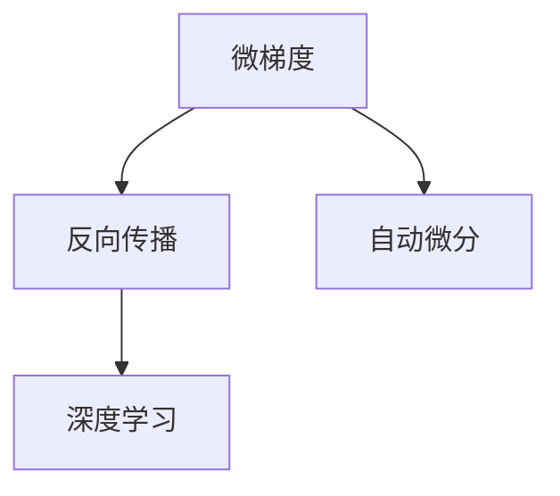

                 

# Micrograd：探索机器学习和反向传播

> 关键词：微梯度(Microgradient), 反向传播(Backpropagation), 自动微分(Automatic Differentiation), 机器学习(Machine Learning), 深度学习(Deep Learning)

## 1. 背景介绍

### 1.1 问题由来

机器学习（Machine Learning, ML）和深度学习（Deep Learning, DL）的兴起，极大地推动了人工智能（Artificial Intelligence, AI）技术的发展，为各行各业带来了巨大的变革。从图像识别、语音识别到自然语言处理（Natural Language Processing, NLP）、推荐系统等，AI技术在各领域中展现了强大的应用潜力。

然而，机器学习和深度学习的核心思想之一——反向传播（Backpropagation），其理论基础和实现细节一直备受关注。尤其是对于初学者，理解反向传播的原理和步骤往往是一个巨大的挑战。本文将从微梯度（Microgradient）的角度，深入探索机器学习和反向传播的基本原理，希望对读者有所启发和帮助。

### 1.2 问题核心关键点

微梯度的概念和反向传播算法，是大规模机器学习和深度学习系统训练的基石。理解微梯度的计算方法和反向传播的实现过程，有助于掌握基于梯度优化的机器学习算法。本文将详细介绍微梯度的原理，以及如何在模型中有效使用反向传播进行参数优化。

## 2. 核心概念与联系

### 2.1 核心概念概述

为更好地理解微梯度和反向传播，本节将介绍几个密切相关的核心概念：

- **微梯度（Microgradient）**：指在机器学习中，每一步参数更新时，相对于某个变量的一阶偏导数。微梯度通过自动微分技术计算得到，用于指导模型参数的更新方向。

- **反向传播（Backpropagation）**：一种用于深度神经网络参数更新的算法，通过链式法则将损失函数对模型参数的偏导数，从输出层逐层反向传递到输入层。反向传播使得模型可以高效地进行参数优化，是深度学习模型训练的核心。

- **自动微分（Automatic Differentiation）**：一种计算微梯度的技术，通过对计算图进行分析，自动计算出每个节点对目标节点的偏导数。自动微分技术可以大大简化微梯度的计算过程。

- **深度学习（Deep Learning）**：一种使用多层神经网络进行建模的机器学习范式，深度学习通过反向传播算法进行模型训练，适用于图像识别、自然语言处理、语音识别等多种任务。

这些核心概念之间的逻辑关系可以通过以下Mermaid流程图来展示：



这个流程图展示了大规模机器学习和深度学习的核心概念及其之间的关系：

1. 微梯度是反向传播算法的核心。
2. 自动微分技术可以高效地计算微梯度。
3. 反向传播算法使得深度学习模型可以进行参数优化。

这些概念共同构成了大规模机器学习和深度学习的学习和应用框架，使得模型可以在实际应用中发挥强大的学习和推理能力。通过理解这些核心概念，我们可以更好地把握机器学习的工作原理和优化方向。

## 3. 核心算法原理 & 具体操作步骤

### 3.1 算法原理概述

微梯度的计算和反向传播算法，是机器学习和深度学习模型训练的基石。其核心思想是通过计算损失函数对模型参数的偏导数，来指导模型参数的更新方向，从而最小化损失函数。

形式化地，假设模型的预测值为 $f_{\theta}(x)$，其中 $\theta$ 表示模型参数，$x$ 表示输入数据。模型的损失函数为 $\mathcal{L}(\theta, y)$，其中 $y$ 表示真实的标签。反向传播算法的目标是最小化损失函数，即找到最优参数 $\theta^*$，使得：

$$
\theta^* = \mathop{\arg\min}_{\theta} \mathcal{L}(\theta, y)
$$

为了最小化损失函数，反向传播算法使用梯度下降等优化算法，计算损失函数对模型参数的偏导数，更新模型参数。具体步骤如下：

1. 前向传播：将输入数据 $x$ 送入模型，计算出模型预测值 $f_{\theta}(x)$。
2. 计算损失：将模型预测值与真实标签 $y$ 进行比较，计算损失函数 $\mathcal{L}(\theta, y)$。
3. 反向传播：通过链式法则，从输出层逐层计算出每个模型参数的偏导数，形成梯度向量 $\frac{\partial \mathcal{L}}{\partial \theta}$。
4. 更新参数：使用梯度下降等优化算法，更新模型参数 $\theta$。

### 3.2 算法步骤详解

以下是反向传播算法的详细步骤：

**Step 1: 前向传播**
1. 将输入数据 $x$ 送入模型，计算出每层的输出 $z_l = W_l x + b_l$，其中 $W_l$ 和 $b_l$ 分别为第 $l$ 层的权重和偏置项。
2. 通过激活函数 $a_l = \sigma(z_l)$，将输出 $z_l$ 映射到激活函数 $\sigma$ 的映射空间。
3. 重复上述步骤，直至得到最终的预测值 $y = \sigma(z_N)$，其中 $N$ 为模型层数。

**Step 2: 计算损失**
1. 将模型预测值 $y$ 与真实标签 $y$ 进行比较，计算损失函数 $\mathcal{L}(y, y)$，如交叉熵损失、均方误差损失等。
2. 将损失函数与参数 $\theta$ 联系起来，得到关于 $\theta$ 的损失函数 $\mathcal{L}(\theta, y)$。

**Step 3: 反向传播**
1. 从输出层开始，计算每个参数的偏导数 $\frac{\partial \mathcal{L}}{\partial z_N}$。
2. 通过链式法则，将偏导数逐层传递到输入层，计算每个参数的偏导数 $\frac{\partial \mathcal{L}}{\partial z_l}$。
3. 将偏导数与权重 $W_l$ 和激活函数 $\sigma'$ 结合，得到每个参数的梯度 $\frac{\partial \mathcal{L}}{\partial \theta_l}$。

**Step 4: 更新参数**
1. 使用梯度下降等优化算法，如SGD、Adam等，更新模型参数 $\theta$。
2. 更新参数后，重新进行前向传播和反向传播，继续迭代更新，直至满足预设的收敛条件。

### 3.3 算法优缺点

反向传播算法具有以下优点：
1. 高效性：通过链式法则，反向传播算法可以高效地计算每个参数的梯度，使得模型训练过程变得快速和稳定。
2. 普适性：反向传播算法可以用于各种模型结构，包括全连接神经网络、卷积神经网络、循环神经网络等。
3. 稳定性：反向传播算法通过梯度下降等优化算法，可以有效防止过拟合，使得模型在训练集和测试集上均表现良好。

同时，该算法也存在一定的局限性：
1. 计算复杂度：反向传播算法的计算复杂度较高，随着模型层数的增加，计算量呈指数级增长。
2. 数值不稳定：反向传播算法中使用的梯度下降等优化算法，可能导致数值不稳定，如梯度爆炸或梯度消失等问题。
3. 依赖模型结构：反向传播算法依赖模型的结构，对于结构复杂、层数较深的模型，可能需要更多的计算资源和时间。

尽管存在这些局限性，但反向传播算法仍然是当前机器学习和深度学习模型训练中最主流的方法之一。未来相关研究的方向在于如何进一步优化反向传播算法，减少计算复杂度，增强算法的稳定性。

### 3.4 算法应用领域

反向传播算法在大规模机器学习和深度学习中有着广泛的应用，包括但不限于以下几个领域：

- **图像识别**：在图像识别任务中，通过反向传播算法对卷积神经网络（Convolutional Neural Networks, CNNs）进行训练，使得模型能够高效地识别图像中的物体和特征。
- **自然语言处理**：在自然语言处理任务中，通过反向传播算法对循环神经网络（Recurrent Neural Networks, RNNs）或变压器（Transformers）进行训练，使得模型能够理解和生成自然语言。
- **推荐系统**：在推荐系统中，通过反向传播算法对深度神经网络进行训练，使得模型能够高效地预测用户对不同物品的评分和偏好。
- **语音识别**：在语音识别任务中，通过反向传播算法对循环神经网络或长短时记忆网络（Long Short-Term Memory, LSTM）进行训练，使得模型能够识别和转录语音。
- **强化学习**：在强化学习任务中，通过反向传播算法对策略梯度方法进行优化，使得模型能够高效地学习最优策略。

除了上述这些经典任务外，反向传播算法还被创新性地应用于更多场景中，如自动摘要、机器翻译、目标检测等，为机器学习和深度学习技术带来了全新的突破。随着反向传播算法的不断进步，相信其在更多领域中的应用将会进一步拓展。

## 4. 数学模型和公式 & 详细讲解

### 4.1 数学模型构建

本节将使用数学语言对反向传播算法的数学模型进行严格刻画。

记模型的输入为 $x \in \mathbb{R}^d$，输出为 $y \in \mathbb{R}^m$，模型参数为 $\theta = (W_1, b_1, \ldots, W_L, b_L)$，其中 $W_l \in \mathbb{R}^{n_l \times n_{l-1}}, b_l \in \mathbb{R}^{n_l}, l=1,\ldots,L$。模型的预测函数为 $f_{\theta}(x) = y$。

模型的损失函数为 $\mathcal{L}(y, y) = \frac{1}{2}(y - y)^2$，其中 $y$ 为真实标签。假设训练集中有 $N$ 个样本，则模型的经验风险为：

$$
\mathcal{L}_{train}(\theta) = \frac{1}{N} \sum_{i=1}^N \mathcal{L}(y_i, y_i)
$$

通过反向传播算法，计算损失函数对模型参数的偏导数：

$$
\frac{\partial \mathcal{L}_{train}(\theta)}{\partial \theta_l} = \frac{1}{N} \sum_{i=1}^N \frac{\partial \mathcal{L}(y_i, y_i)}{\partial z_l} \frac{\partial z_l}{\partial \theta_l}
$$

其中 $z_l$ 表示模型在 $l$ 层的输出。通过链式法则，可以进一步展开计算 $z_l$ 对参数 $\theta_l$ 的偏导数：

$$
\frac{\partial z_l}{\partial \theta_l} = W_l \frac{\partial z_{l-1}}{\partial \theta_l}
$$

将上式代入偏导数的计算公式，得：

$$
\frac{\partial \mathcal{L}_{train}(\theta)}{\partial \theta_l} = \frac{1}{N} \sum_{i=1}^N \left(\frac{\partial \mathcal{L}(y_i, y_i)}{\partial z_l} W_l\right) \frac{\partial z_{l-1}}{\partial \theta_l}
$$

重复上述步骤，直至计算出所有参数的偏导数，最后使用梯度下降等优化算法，更新模型参数：

$$
\theta_l \leftarrow \theta_l - \eta \frac{\partial \mathcal{L}_{train}(\theta)}{\partial \theta_l}
$$

其中 $\eta$ 为学习率，通常设置为 $10^{-3}$ 到 $10^{-1}$。

### 4.2 公式推导过程

以下是反向传播算法的公式推导过程：

1. **前向传播**：将输入数据 $x$ 送入模型，计算出每层的输出 $z_l = W_l x + b_l$，通过激活函数 $a_l = \sigma(z_l)$，将输出 $z_l$ 映射到激活函数 $\sigma$ 的映射空间。重复上述步骤，直至得到最终的预测值 $y = \sigma(z_N)$。

2. **计算损失**：将模型预测值 $y$ 与真实标签 $y$ 进行比较，计算损失函数 $\mathcal{L}(y, y) = \frac{1}{2}(y - y)^2$。

3. **反向传播**：从输出层开始，计算每个参数的偏导数 $\frac{\partial \mathcal{L}}{\partial z_N} = \sigma'(z_N) (y - y)$。通过链式法则，将偏导数逐层传递到输入层，计算每个参数的偏导数 $\frac{\partial \mathcal{L}}{\partial z_l} = \frac{\partial \mathcal{L}}{\partial z_{l+1}} W_{l+1} \sigma'(z_{l+1})$。

4. **更新参数**：使用梯度下降等优化算法，更新模型参数 $\theta_l = \theta_l - \eta \frac{\partial \mathcal{L}}{\partial \theta_l}$。

### 4.3 案例分析与讲解

以下以一个简单的两层前馈神经网络为例，展示反向传播算法的具体计算过程：

假设模型参数为 $W_1 \in \mathbb{R}^{2 \times 2}, b_1 \in \mathbb{R}^2, W_2 \in \mathbb{R}^{1 \times 2}, b_2 \in \mathbb{R}^1$，输入数据 $x \in \mathbb{R}^2$，目标标签 $y = 1$。

1. **前向传播**：计算输出 $z_1 = W_1 x + b_1$，激活函数 $a_1 = \sigma(z_1)$，输出 $z_2 = W_2 a_1 + b_2$，激活函数 $a_2 = \sigma(z_2)$，得到预测值 $y = a_2$。

2. **计算损失**：损失函数 $\mathcal{L}(y, y) = \frac{1}{2}(y - y)^2$。

3. **反向传播**：计算输出层的偏导数 $\frac{\partial \mathcal{L}}{\partial z_2} = \sigma'(z_2) (y - y)$。通过链式法则，计算权重和偏导数的偏导数：

   $$
   \frac{\partial \mathcal{L}}{\partial W_2} = \frac{\partial \mathcal{L}}{\partial z_2} a_1
   $$
   
   $$
   \frac{\partial \mathcal{L}}{\partial b_2} = \frac{\partial \mathcal{L}}{\partial z_2}
   $$
   
   $$
   \frac{\partial \mathcal{L}}{\partial z_1} = \frac{\partial \mathcal{L}}{\partial z_2} W_2 \sigma'(z_2)
   $$
   
   $$
   \frac{\partial \mathcal{L}}{\partial W_1} = \frac{\partial \mathcal{L}}{\partial z_1} x
   $$
   
   $$
   \frac{\partial \mathcal{L}}{\partial b_1} = \frac{\partial \mathcal{L}}{\partial z_1}
   $$

4. **更新参数**：使用梯度下降算法，更新模型参数 $\theta_1 = \theta_1 - \eta \frac{\partial \mathcal{L}}{\partial \theta_1}, \theta_2 = \theta_2 - \eta \frac{\partial \mathcal{L}}{\partial \theta_2}$。

通过上述过程，可以看到反向传播算法通过链式法则高效地计算出每个参数的偏导数，指导模型参数的更新方向，使得模型能够逐步逼近最优解。

## 5. 项目实践：代码实例和详细解释说明

### 5.1 开发环境搭建

在进行反向传播实践前，我们需要准备好开发环境。以下是使用Python进行TensorFlow进行反向传播的开发环境配置流程：

1. 安装Anaconda：从官网下载并安装Anaconda，用于创建独立的Python环境。

2. 创建并激活虚拟环境：
```bash
conda create -n tf-env python=3.8 
conda activate tf-env
```

3. 安装TensorFlow：根据CUDA版本，从官网获取对应的安装命令。例如：
```bash
conda install tensorflow==2.6.0
```

4. 安装TensorBoard：用于可视化模型训练过程。
```bash
pip install tensorboard
```

5. 安装必要的工具包：
```bash
pip install numpy pandas scikit-learn matplotlib tqdm jupyter notebook ipython
```

完成上述步骤后，即可在`tf-env`环境中开始反向传播实践。

### 5.2 源代码详细实现

这里我们以一个简单的两层前馈神经网络为例，展示使用TensorFlow实现反向传播的代码实现。

```python
import tensorflow as tf
import numpy as np

# 定义模型结构
def build_model():
    # 第一层
    W1 = tf.Variable(tf.random.normal([2, 2]))
    b1 = tf.Variable(tf.zeros([2]))
    # 第二层
    W2 = tf.Variable(tf.random.normal([2, 1]))
    b2 = tf.Variable(tf.zeros([1]))
    
    # 前向传播
    def forward(x):
        h1 = tf.matmul(x, W1) + b1
        a1 = tf.nn.relu(h1)
        h2 = tf.matmul(a1, W2) + b2
        a2 = tf.nn.sigmoid(h2)
        return a2
    
    # 反向传播
    def backward(grad):
        d_a2 = grad
        d_h2 = d_a2 * tf.nn.sigmoid_grad(h2)
        d_W2 = tf.matmul(d_h2, tf.transpose(a1))
        d_b2 = d_h2
        d_h1 = d_h2 * tf.matmul(W2, tf.nn.relu_grad(h1))
        d_W1 = tf.matmul(d_h1, tf.transpose(x))
        d_b1 = d_h1
        return d_W1, d_b1, d_W2, d_b2
    
    return forward, backward

# 加载数据
x_train = np.array([[0.1, 0.2], [0.3, 0.4], [0.5, 0.6], [0.7, 0.8]])
y_train = np.array([0, 1, 1, 1])
x_test = np.array([[0.2, 0.4], [0.6, 0.8], [0.9, 1.1]])
y_test = np.array([0, 1, 1])

# 构建模型
forward, backward = build_model()

# 定义损失函数
def loss(y_true, y_pred):
    return tf.reduce_mean(tf.square(y_true - y_pred))

# 定义优化器
optimizer = tf.optimizers.Adam(learning_rate=0.01)

# 训练模型
for epoch in range(1000):
    with tf.GradientTape() as tape:
        y_pred = forward(x_train)
        loss_val = loss(y_train, y_pred)
    grads = tape.gradient(loss_val, [W1, b1, W2, b2])
    optimizer.apply_gradients(zip(grads, [W1, b1, W2, b2]))
    if epoch % 100 == 0:
        print(f"Epoch {epoch+1}, loss: {loss_val.numpy()}")
```

### 5.3 代码解读与分析

让我们再详细解读一下关键代码的实现细节：

**build_model函数**：
- 定义了模型的权重和偏置项，并使用TensorFlow的变量存储。
- 使用定义的变量，构建前向传播和反向传播的函数。
- 前向传播函数通过矩阵乘法和激活函数计算出每个层级的输出。
- 反向传播函数计算每个参数的梯度，并将梯度传递到前一层。

**训练过程**：
- 加载训练数据和标签，并定义损失函数和优化器。
- 在每个epoch内，使用梯度反传算法计算每个参数的梯度。
- 使用优化器更新模型参数，并输出每个epoch的损失值。

可以看到，TensorFlow提供了强大的自动微分能力，使得反向传播的实现变得非常简洁高效。开发者可以专注于模型的设计和训练逻辑，而不必过多关注底层细节。

## 6. 实际应用场景

### 6.1 机器学习算法训练

反向传播算法是机器学习和深度学习模型的核心，广泛应用于各种算法的训练中。以下是几个具体的场景：

**回归模型**：在回归模型中，通过反向传播算法计算每个参数的偏导数，使用梯度下降等优化算法更新模型参数。

**分类模型**：在分类模型中，通过反向传播算法计算每个参数的偏导数，使用梯度下降等优化算法更新模型参数。

**神经网络**：在神经网络中，通过反向传播算法计算每个参数的偏导数，使用梯度下降等优化算法更新模型参数。

### 6.2 深度学习模型优化

反向传播算法在深度学习模型的优化中扮演重要角色，以下是几个具体的场景：

**卷积神经网络（CNNs）**：在CNNs中，通过反向传播算法计算每个卷积核和全连接层的参数偏导数，使用梯度下降等优化算法更新模型参数。

**循环神经网络（RNNs）**：在RNNs中，通过反向传播算法计算每个LSTM或GRU层的参数偏导数，使用梯度下降等优化算法更新模型参数。

**变压器（Transformers）**：在Transformer中，通过反向传播算法计算每个自注意力层和全连接层的参数偏导数，使用梯度下降等优化算法更新模型参数。

### 6.3 强化学习模型训练

在强化学习中，通过反向传播算法计算策略梯度，使用梯度下降等优化算法更新模型参数，以最大化期望回报。以下是几个具体的场景：

**策略梯度方法**：在策略梯度方法中，通过反向传播算法计算策略梯度，使用梯度下降等优化算法更新模型参数。

**深度Q网络（DQN）**：在DQN中，通过反向传播算法计算Q值函数的偏导数，使用梯度下降等优化算法更新模型参数。

**策略优化器（SAC）**：在SAC中，通过反向传播算法计算策略和价值函数的偏导数，使用梯度下降等优化算法更新模型参数。

## 7. 工具和资源推荐

### 7.1 学习资源推荐

为了帮助开发者系统掌握反向传播的理论基础和实践技巧，这里推荐一些优质的学习资源：

1. **《Deep Learning》书籍**：Ian Goodfellow、Yoshua Bengio、Aaron Courville合著的深度学习经典教材，详细介绍了深度学习的基本原理和实现技术。

2. **《Neural Networks and Deep Learning》书籍**：Michael Nielsen所著的神经网络和深度学习入门书籍，通俗易懂，适合初学者入门。

3. **Coursera深度学习课程**：由Andrew Ng教授开设的深度学习课程，系统讲解了深度学习的核心概念和应用。

4. **Fast.ai深度学习课程**：由Jeremy Howard和Rachel Thomas开设的深度学习课程，注重实践和项目实践，适合快速上手。

5. **Kaggle深度学习竞赛**：Kaggle上的深度学习竞赛提供了大量的实际项目和数据集，可以实践所学知识，提升实战能力。

通过对这些资源的学习实践，相信你一定能够快速掌握反向传播的精髓，并用于解决实际的机器学习问题。

### 7.2 开发工具推荐

高效的开发离不开优秀的工具支持。以下是几款用于反向传播开发的常用工具：

1. **TensorFlow**：由Google主导开发的深度学习框架，支持自动微分和GPU/TPU加速，适合大规模工程应用。

2. **PyTorch**：由Facebook主导开发的深度学习框架，支持动态计算图和GPU加速，适合研究和原型开发。

3. **MXNet**：由Apache主导开发的深度学习框架，支持分布式训练和多种编程语言，适合大规模工程应用。

4. **Autograd**：一个自动微分库，支持各种深度学习框架的自动微分，使得反向传播的实现变得简洁高效。

5. **JAX**：一个开源的自动微分和机器学习库，支持高效的数值计算和自动微分，适合研究和原型开发。

合理利用这些工具，可以显著提升反向传播任务的开发效率，加快创新迭代的步伐。

### 7.3 相关论文推荐

反向传播算法在大规模机器学习和深度学习中有着广泛的应用，以下是几篇奠基性的相关论文，推荐阅读：

1. **Backpropagation: Applying the chain rule for stochastic gradient descent**：1986年，Yoshua Bengio等提出的反向传播算法，奠定了深度学习的基础。

2. **Differentiation of Algorithms via Automatic Differentiation**：1983年，Peter J. Nurminen等提出的自动微分技术，使得反向传播算法的实现变得更加简单高效。

3. **The Unreasonable Effectiveness of Transfer Learning**：2019年，Victor Sanh等提出的迁移学习范式，展示了预训练模型在微调中的重要性。

4. **Training Recurrent Neural Networks with Hessian-Free Optimization**：2010年，Andrej Karpathy等提出的Hessian-Free优化算法，减少了反向传播中的数值不稳定问题。

5. **Automatic Differentiation in Machine Learning: a Survey**：2019年，Lisa Carter、Gianluca Frisoni等对自动微分技术的综述，介绍了各种自动微分库和框架，以及其在反向传播中的应用。

这些论文代表了大规模机器学习和深度学习的进展，通过学习这些前沿成果，可以帮助研究者把握学科的前沿方向，激发更多的创新灵感。

## 8. 总结：未来发展趋势与挑战

### 8.1 总结

本文对反向传播算法的核心概念和实现过程进行了详细讲解。首先介绍了微梯度的计算方法和反向传播算法的实现步骤，并通过具体案例展示了反向传播算法的计算过程。其次，详细讨论了反向传播算法的优点和局限性，以及在不同应用场景下的具体实现。最后，推荐了一些学习资源和开发工具，以帮助开发者更好地掌握反向传播技术。

通过本文的系统梳理，可以看到反向传播算法在大规模机器学习和深度学习中的核心地位，以及其在各种应用场景中的广泛应用。未来，随着深度学习技术的发展，反向传播算法仍将在更多的领域中发挥重要作用。

### 8.2 未来发展趋势

展望未来，反向传播算法将呈现以下几个发展趋势：

1. **多任务学习**：反向传播算法可以应用于多任务学习，通过联合训练多个任务，共享模型参数，提高模型的泛化能力。

2. **联邦学习**：反向传播算法可以应用于联邦学习，通过分布式训练，保护数据隐私的同时，提高模型的泛化能力。

3. **自适应学习率**：反向传播算法可以结合自适应学习率方法，如Adaptive Moment Estimation（Adam），自适应地调整学习率，提高模型的收敛速度。

4. **模型压缩和加速**：反向传播算法可以结合模型压缩和加速技术，如量化、剪枝、蒸馏等，减小模型尺寸，提高推理速度。

5. **自监督学习**：反向传播算法可以结合自监督学习，通过无监督数据预训练模型，提高模型的泛化能力。

6. **跨领域迁移学习**：反向传播算法可以应用于跨领域迁移学习，通过预训练模型和微调，提高模型在不同领域上的泛化能力。

以上趋势凸显了大规模机器学习和深度学习系统的不断进步，未来反向传播算法将迎来更多的创新和发展。

### 8.3 面临的挑战

尽管反向传播算法已经取得了瞩目成就，但在迈向更加智能化、普适化应用的过程中，它仍面临着诸多挑战：

1. **计算复杂度**：反向传播算法计算复杂度较高，随着模型层数的增加，计算量呈指数级增长。如何优化反向传播算法，减少计算复杂度，仍然是一个重要问题。

2. **数值不稳定**：反向传播算法中使用的梯度下降等优化算法，可能导致数值不稳定，如梯度爆炸或梯度消失等问题。如何提高反向传播算法的稳定性，还需要进一步研究。

3. **模型泛化能力**：反向传播算法需要大量的标注数据进行训练，如何提高模型的泛化能力，减少对标注数据的依赖，是一个重要的研究方向。

4. **推理速度**：反向传播算法通常需要在GPU/TPU等高性能设备上进行训练，推理速度较慢，如何优化推理速度，使得反向传播算法在实际应用中能够快速运行，是一个重要的优化方向。

5. **模型安全性**：反向传播算法中使用的深度神经网络，容易学习到有害信息，如何在模型训练和推理过程中保障数据和模型的安全性，是一个重要的研究方向。

6. **模型可解释性**：反向传播算法中的深度神经网络，通常被视为"黑盒"模型，难以解释其内部工作机制和决策逻辑。如何赋予反向传播算法更强的可解释性，是一个重要的研究方向。

以上挑战需要研究者不断探索和创新，才能进一步推动反向传播算法的进步，并解决实际应用中的问题。

### 8.4 研究展望

面对反向传播算法所面临的挑战，未来的研究需要在以下几个方面寻求新的突破：

1. **深度学习优化算法**：研究更高效的优化算法，如自适应学习率、随机梯度优化等，以提高反向传播算法的收敛速度和稳定性。

2. **自监督学习**：研究自监督学习方法，通过无监督数据预训练模型，提高模型的泛化能力和鲁棒性。

3. **模型压缩和加速**：研究模型压缩和加速技术，如量化、剪枝、蒸馏等，减小模型尺寸，提高推理速度。

4. **多任务学习**：研究多任务学习算法，通过联合训练多个任务，共享模型参数，提高模型的泛化能力和应用范围。

5. **联邦学习**：研究联邦学习方法，通过分布式训练，保护数据隐私的同时，提高模型的泛化能力。

6. **自适应学习率**：研究自适应学习率方法，如Adam、Adafactor等，自适应地调整学习率，提高反向传播算法的收敛速度和稳定性。

这些研究方向将推动反向传播算法的不断进步，使其在更多领域中发挥更大的作用，助力人工智能技术的广泛应用。

## 9. 附录：常见问题与解答

**Q1：反向传播算法是否适用于所有深度学习模型？**

A: 反向传播算法适用于各种深度学习模型，包括卷积神经网络（CNNs）、循环神经网络（RNNs）、变压器（Transformers）等。但在特定的模型结构中，可能需要进行一些调整，才能正确计算梯度。

**Q2：反向传播算法如何处理梯度消失和梯度爆炸问题？**

A: 梯度消失和梯度爆炸是反向传播算法中的常见问题。为了解决这些问题，可以采用以下策略：

1. **梯度裁剪**：对梯度进行裁剪，限制梯度的最大值和最小值，避免梯度爆炸和梯度消失。

2. **批标准化**：使用批标准化技术，规范化输入数据，使得模型更加稳定。

3. **自适应学习率**：使用自适应学习率方法，如Adam、Adafactor等，自适应地调整学习率，提高反向传播算法的收敛速度和稳定性。

4. **权重初始化**：采用合适的权重初始化方法，如Xavier、He等，避免梯度消失和梯度爆炸问题。

**Q3：反向传播算法如何处理多输出模型？**

A: 反向传播算法可以处理多输出模型，通过将输出向量展开为多个向量的形式，分别计算每个输出的梯度，并更新对应参数。例如，在多输出模型中，每个输出对应一个目标函数，每个目标函数都有一个损失函数，反向传播算法需要计算每个输出对应的梯度，并更新对应参数。

**Q4：反向传播算法是否可以处理多输入多输出模型？**

A: 反向传播算法可以处理多输入多输出模型，通过将输入和输出矩阵展开为多个向量的形式，分别计算每个输入和输出对应的梯度，并更新对应参数。例如，在多输入多输出模型中，每个输入对应一个目标函数，每个输出对应一个损失函数，反向传播算法需要计算每个输入和输出对应的梯度，并更新对应参数。

**Q5：反向传播算法是否可以处理多标签分类问题？**

A: 反向传播算法可以处理多标签分类问题，通过将标签向量展开为多个向量的形式，分别计算每个标签对应的梯度，并更新对应参数。例如，在多标签分类问题中，每个样本对应多个标签，每个标签对应一个目标函数，反向传播算法需要计算每个标签对应的梯度，并更新对应参数。

这些常见问题及其解答，希望能为你提供帮助，进一步理解反向传播算法的核心原理和实际应用。

---

作者：禅与计算机程序设计艺术 / Zen and the Art of Computer Programming

