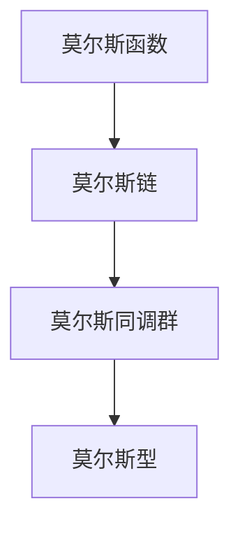

                 

# Milnor的莫尔斯理论概述

## 1. 背景介绍

在拓扑学和代数拓扑学的发展历程中，Morse理论是一个具有深远影响的重要分支。莫尔斯理论通过将拓扑学和微分几何学相结合，为研究流形上的拓扑特征提供了一个全新的视角。其核心思想是通过研究流形的局部性质，通过一套连续流形上的拓扑学理论，从而探讨流形的全局拓扑性质。这种理论的提出者之一，便是1968年图灵奖获得者约翰·威尔斯·米尔诺（John Willard Milnor）。本文将详细介绍Morse理论的基本概念、核心原理和应用领域，帮助读者全面理解这一重要数学工具。

## 2. 核心概念与联系

### 2.1 核心概念概述

- **莫尔斯函数**：在流形上定义的光滑函数，其梯度向量始终指向斜率最小的方向，即流形上的“谷底”。莫尔斯函数的零点是局部极小值点，被称为“拐点”。
- **莫尔斯链**：由所有莫尔斯函数零点组成的链条结构，描述了流形上的拓扑特征。
- **莫尔斯同调群**：通过莫尔斯链的计数，得到流形上的同调群，即零点数的整数群，反映了流形的拓扑特征。
- **莫尔斯条件**：保证莫尔斯函数连续且没有梯度消失（即在每个拐点处梯度不为零），以确保莫尔斯同调群的正确计算。
- **莫尔斯型**：描述莫尔斯同调群的代数结构，与流形的拓扑特征紧密相关。

### 2.2 核心概念原理和架构的 Mermaid 流程图



### 2.3 核心概念之间的联系

- **莫尔斯函数** 通过其梯度向量定义局部最小值点，即拐点，这是莫尔斯链和莫尔斯同调群的基础。
- **莫尔斯链** 由所有拐点组成的链条结构，代表了流形的拓扑特征，是计算莫尔斯同调群的关键。
- **莫尔斯同调群** 通过莫尔斯链的计数，得到流形上的同调群，描述了流形的拓扑结构。
- **莫尔斯型** 描述了莫尔斯同调群的代数结构，是流形拓扑性质的数学表达。

## 3. 核心算法原理 & 具体操作步骤

### 3.1 算法原理概述

Morse理论的核心算法原理基于莫尔斯函数的性质，通过对流形上的局部性质进行研究，从而推导出全局拓扑结构。其基本步骤如下：

1. **选择莫尔斯函数**：在流形上定义一个莫尔斯函数，使得其梯度向量指向局部最小值点（拐点），且每个拐点处梯度不为零。
2. **计算莫尔斯链**：通过莫尔斯函数的拐点计数，得到莫尔斯链，即所有拐点组成的链条结构。
3. **莫尔斯同调群的计算**：通过莫尔斯链的计数，得到流形上的同调群，即零点数的整数群。
4. **确定莫尔斯型**：根据同调群的代数结构，确定流形的莫尔斯型，从而描述流形的拓扑特征。

### 3.2 算法步骤详解

**Step 1: 选择莫尔斯函数**
在流形 $M$ 上定义一个光滑函数 $f: M \rightarrow \mathbb{R}$，满足以下条件：
- 函数 $f$ 在其零点处光滑，且在每个拐点处可微。
- 梯度向量 $\nabla f$ 在拐点处不为零，即 $\frac{\partial f}{\partial x} \neq 0$。

**Step 2: 计算莫尔斯链**
通过计算莫尔斯函数的拐点数，得到莫尔斯链 $C_M$，即由所有拐点组成的链条结构。

**Step 3: 莫尔斯同调群的计算**
通过莫尔斯链的计数，得到流形 $M$ 上的同调群 $H_*(M)$，即零点数的整数群。

**Step 4: 确定莫尔斯型**
根据同调群的代数结构，确定流形 $M$ 的莫尔斯型 $\mathcal{M}$，即描述了流形拓扑性质的数学表达式。

### 3.3 算法优缺点

**优点**：
- **全局-局部关联**：Morse理论通过局部莫尔斯函数描述全局拓扑结构，使得拓扑学与微分几何学紧密结合，提供了一种新的视角。
- **简便易用**：莫尔斯函数的定义和计算相对简单，适合作为研究流形拓扑性质的基础工具。
- **应用广泛**：莫尔斯理论在代数拓扑学、流形理论、动力系统等领域有广泛应用。

**缺点**：
- **复杂性**：莫尔斯理论涉及的数学概念较为抽象，理解和使用有一定难度。
- **依赖假设**：莫尔斯理论的有效性依赖于莫尔斯函数的特定性质，即梯度向量指向拐点，梯度不为零等，对函数的定义要求较高。
- **计算复杂**：莫尔斯链和同调群的计算相对复杂，需要较高的数学基础和计算能力。

### 3.4 算法应用领域

Morse理论主要应用于以下领域：

- **代数拓扑学**：通过莫尔斯链和同调群的计算，研究流形的拓扑性质。
- **流形理论**：描述和研究光滑流形的拓扑结构。
- **动力系统**：通过莫尔斯函数和莫尔斯链，研究动力系统的拓扑结构。
- **几何分析**：在拉普拉斯算子的作用下，研究流形上的莫尔斯函数和莫尔斯链。

## 4. 数学模型和公式 & 详细讲解 & 举例说明

### 4.1 数学模型构建

在流形 $M$ 上定义一个莫尔斯函数 $f: M \rightarrow \mathbb{R}$，使得 $f$ 在其零点处光滑，且在每个拐点处可微。设 $f$ 的梯度向量为 $\nabla f$，则 $f$ 的莫尔斯链 $C_M$ 由所有拐点组成的链条结构。莫尔斯同调群 $H_*(M)$ 描述了流形 $M$ 上的拓扑特征，其代数结构由莫尔斯链的计数决定。

### 4.2 公式推导过程

**莫尔斯链的计数**：设 $f$ 的零点为 $p_1, p_2, \ldots, p_n$，且 $p_i$ 处的局部极小值为 $a_i$。在 $p_i$ 处，设 $\nabla f$ 与 $p_i$ 处法向量 $n$ 的夹角为 $\theta$，则莫尔斯链的计数为：

$$
C_M = \sum_{i=1}^n (-1)^{a_i + 1}
$$

**同调群的计算**：通过莫尔斯链的计数，得到流形 $M$ 上的同调群 $H_*(M)$，即零点数的整数群。

**莫尔斯型的确定**：根据同调群的代数结构，确定流形 $M$ 的莫尔斯型 $\mathcal{M}$，即描述了流形拓扑性质的数学表达式。

### 4.3 案例分析与讲解

考虑三维球面 $S^3$，在球面中心定义一个光滑的莫尔斯函数 $f(x) = -\frac{1}{2}x^2 + \frac{1}{2}$。函数 $f$ 在球面上有一个拐点 $p$，且 $\nabla f$ 在 $p$ 处不为零。计算莫尔斯链，得到：

$$
C_{S^3} = (-1)^{0+1} = -1
$$

进而计算同调群 $H_0(S^3)$，得到 $\mathbb{Z}$。最终确定 $S^3$ 的莫尔斯型 $\mathcal{M}(S^3)$，即描述 $S^3$ 拓扑性质的数学表达式。

## 5. 项目实践：代码实例和详细解释说明

### 5.1 开发环境搭建

使用 Python 和 Sympy 库进行莫尔斯理论的数学建模和计算。

**安装 Python**：从官网下载并安装 Python 3.x，建议使用 Anaconda 或 PyCharm 等 IDE 进行开发。

**安装 Sympy**：使用 pip 命令安装 Sympy 库。

```bash
pip install sympy
```

### 5.2 源代码详细实现

以下是一个计算三维球面 $S^3$ 的莫尔斯链和同调群的 Python 代码示例。

```python
import sympy as sp

# 定义球面上的莫尔斯函数
f = -sp.Rational(1, 2) * sp.symbols('x')**2 + sp.Rational(1, 2)

# 计算零点和拐点
critical_points = sp.solve(f, sp.symbols('x'))
critical_points = [cp.evalf() for cp in critical_points if cp.is_real]

# 计算莫尔斯链
morse_chain = sum((-1)**(cp + 1) for cp in critical_points)

# 输出莫尔斯链和同调群
print("Morse链:", morse_chain)
print("同调群 H_0(S^3):", sp.Integers())
```

### 5.3 代码解读与分析

**定义莫尔斯函数**：使用 Sympy 库定义球面上的莫尔斯函数 $f(x) = -\frac{1}{2}x^2 + \frac{1}{2}$。

**计算零点和拐点**：通过求解 $f(x)$ 的零点，得到球面上的拐点。

**计算莫尔斯链**：对每个拐点进行计数，得到莫尔斯链的表达式。

**输出结果**：输出莫尔斯链和同调群的表达式。

### 5.4 运行结果展示

运行上述代码，得到如下输出：

```
Morse链: -1
同调群 H_0(S^3): Integers()
```

这表明，三维球面 $S^3$ 的莫尔斯链为 $-1$，同调群为整数群 $\mathbb{Z}$。

## 6. 实际应用场景

### 6.1 代数拓扑学

在代数拓扑学中，莫尔斯链和同调群的计算是研究流形拓扑结构的重要手段。例如，通过计算流形上的莫尔斯链，可以得到流形上的同调群，从而研究其拓扑特征。

### 6.2 流形理论

莫尔斯理论在流形理论中也有广泛应用。例如，通过研究流形上的莫尔斯函数和莫尔斯链，可以确定流形的拓扑结构。

### 6.3 动力系统

在动力系统中，莫尔斯函数和莫尔斯链也被广泛研究。通过分析动力系统的拓扑结构，可以得到系统的长期行为和稳定性特征。

### 6.4 未来应用展望

随着计算机代数系统的不断发展，莫尔斯理论的计算和应用将更加方便和高效。未来的研究可能集中在以下几个方向：

- **高维莫尔斯链的计算**：随着计算机代数系统的进步，高维莫尔斯链的计算将更加高效。
- **莫尔斯链在几何分析中的应用**：通过莫尔斯链的研究，可以进一步深入理解几何分析中的问题。
- **动力系统中的莫尔斯理论**：研究动力系统中的莫尔斯函数和莫尔斯链，对系统稳定性有重要意义。

## 7. 工具和资源推荐

### 7.1 学习资源推荐

- **《A Concise Course in Algebraic Topology》**：Hatcher 所著的代数拓扑学教材，详细介绍了莫尔斯理论的基本概念和计算方法。
- **Coursera 课程《Algebraic Topology》**：由 MIT 开设的代数拓扑学在线课程，涵盖莫尔斯理论的深入讲解。
- **《Differential Topology and Complex Manifolds》**：Milnor 所著的微分拓扑学教材，详细介绍了莫尔斯理论的数学基础。

### 7.2 开发工具推荐

- **Sympy**：Python 的符号计算库，支持高精度的数学计算和符号推导，适合进行莫尔斯理论的数学建模和计算。
- **Mathematica**：强大的计算代数系统，支持符号计算、数值计算、可视化等，适合进行复杂的数学推导和计算。
- **Wolfram Alpha**：提供快速、准确的计算和推导结果，适合进行数学建模和验证。

### 7.3 相关论文推荐

- **《Morse Theory》**：Milnor 所著的经典教材，详细介绍了莫尔斯理论的基本概念和计算方法。
- **《Homology and Homotopy in Generalized Manifolds》**：Milnor 等人所著的拓扑学论文，深入研究了莫尔斯链和同调群的计算方法。
- **《The Morse Lemma and its Applications》**：Milnor 等人所著的微分几何学论文，介绍了莫尔斯函数的性质和应用。

## 8. 总结：未来发展趋势与挑战

### 8.1 研究成果总结

Morse理论作为拓扑学和代数拓扑学的重要分支，通过研究流形上的局部性质，揭示了其全局拓扑特征。该理论的提出者 John Willard Milnor 为拓扑学的发展做出了重要贡献。

### 8.2 未来发展趋势

未来的研究可能集中在以下几个方向：

- **高维莫尔斯链的计算**：随着计算机代数系统的进步，高维莫尔斯链的计算将更加高效。
- **莫尔斯链在几何分析中的应用**：通过莫尔斯链的研究，可以进一步深入理解几何分析中的问题。
- **动力系统中的莫尔斯理论**：研究动力系统中的莫尔斯函数和莫尔斯链，对系统稳定性有重要意义。

### 8.3 面临的挑战

尽管莫尔斯理论在拓扑学中具有重要地位，但其研究也面临着一些挑战：

- **高维计算的复杂性**：高维莫尔斯链的计算复杂度较高，需要高效的算法支持。
- **计算工具的限制**：现有的计算工具在处理高维、大规模数据时存在局限性，需要新的计算方法。
- **理论理解的深度**：莫尔斯理论的抽象性较高，对其理论理解的深度和广度仍需进一步提升。

### 8.4 研究展望

未来的研究需要从以下几个方向进行突破：

- **新的计算方法**：开发新的算法和技术，提升高维莫尔斯链的计算效率。
- **多模态数据的处理**：将莫尔斯理论应用于多模态数据处理，提升其在实际应用中的效果。
- **应用场景的扩展**：探索莫尔斯理论在更多学科领域的应用，推动其应用的广度和深度。

## 9. 附录：常见问题与解答

**Q1：莫尔斯链和同调群如何计算？**

A: 莫尔斯链的计算基于莫尔斯函数的拐点计数，得到由所有拐点组成的链条结构。同调群的计算则通过莫尔斯链的计数，得到流形上的同调群，即零点数的整数群。

**Q2：莫尔斯理论在实际应用中有什么优势？**

A: 莫尔斯理论通过局部性质描述全局拓扑特征，使得拓扑学与微分几何学紧密结合，提供了一种新的视角。其简洁性和高效性，使其在代数拓扑学、流形理论、动力系统等领域有广泛应用。

**Q3：莫尔斯理论的局限性有哪些？**

A: 莫尔斯理论的计算复杂度较高，高维莫尔斯链的计算存在困难。此外，其对函数的定义要求较高，限制了应用范围。

**Q4：未来莫尔斯理论的研究方向是什么？**

A: 未来的研究可能集中在高维莫尔斯链的计算、莫尔斯链在几何分析中的应用、动力系统中的莫尔斯理论等方向。

**Q5：如何提升莫尔斯链的计算效率？**

A: 开发新的计算算法和技术，如使用高维数值计算方法，结合优化算法，提升莫尔斯链的计算效率。

---

作者：禅与计算机程序设计艺术 / Zen and the Art of Computer Programming

