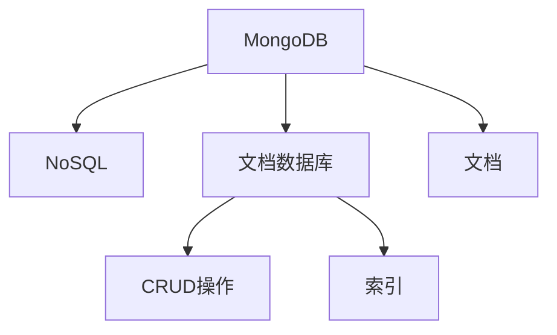

                 

# MongoDB原理与代码实例讲解

> 关键词：MongoDB,数据库,NoSQL,数据存储,文档数据库,数据模型,CRUD,索引,读写性能

## 1. 背景介绍

### 1.1 问题由来
随着互联网技术的快速发展，数据存储和管理的需求日益增加。传统的SQL关系型数据库由于其繁琐的事务处理和复杂的数据模型，已无法完全满足现代互联网应用的需求。NoSQL数据库应运而生，以其简单灵活的数据存储方式、强大的扩展性和高可用性，逐渐成为互联网时代的主流数据库技术。

MongoDB作为NoSQL数据库中的佼佼者，以其文档数据库的数据模型、灵活的查询语言和丰富的索引机制，被广泛应用于Web应用、大数据分析、实时日志等领域。深入理解MongoDB的原理和操作细节，对于构建高效、稳定的数据存储系统至关重要。

### 1.2 问题核心关键点
MongoDB的原理与应用，主要围绕其基于文档的数据模型、灵活的查询语言和高效的索引机制展开。理解MongoDB的核心概念和操作细节，能够帮助开发者更好地设计和使用MongoDB，实现高效的数据存储和检索。

## 2. 核心概念与联系

### 2.1 核心概念概述

为更好地理解MongoDB的原理与应用，本节将介绍几个密切相关的核心概念：

- MongoDB：一种基于文档存储的数据库，支持复杂的数据模型和灵活的查询语言。
- NoSQL：非关系型数据库的统称，与传统的SQL关系型数据库不同，适用于大规模、高并发、非结构化数据存储场景。
- 文档数据库：以文档为基本单位进行存储和查询的数据库。
- 文档：MongoDB中存储数据的基本单位，类似于关系型数据库中的表。
- CRUD操作：MongoDB中的核心操作，包括增删改查。
- 索引：MongoDB中用于提高查询效率的关键技术，类似于关系型数据库中的索引。

这些核心概念之间的逻辑关系可以通过以下Mermaid流程图来展示：



这个流程图展示了大语言模型的核心概念及其之间的关系：

1. MongoDB是一种NoSQL数据库。
2. MongoDB中，数据以文档的形式进行存储。
3. MongoDB支持基本的增删改查操作。
4. MongoDB中的索引技术用于提高查询效率。

这些概念共同构成了MongoDB的核心技术框架，使得MongoDB能够高效、灵活地存储和查询数据。

## 3. 核心算法原理 & 具体操作步骤
### 3.1 算法原理概述

MongoDB的核心原理可以归结为以下几个方面：

- 基于文档的数据模型：MongoDB中，数据以文档的形式进行存储，每个文档包含一组键值对(key-value pairs)。文档的形式类似于JSON或BSON，可以存储任意类型的数据。
- 灵活的查询语言：MongoDB提供了强大的查询语言，支持复杂的查询操作，如嵌套查询、聚合查询等。
- 高效的索引机制：MongoDB支持多种类型的索引，包括单字段索引、复合索引、全文索引等，用于提高查询效率。

MongoDB的查询和索引机制是其高效、灵活的核心所在。以下我们将详细介绍MongoDB的查询语言和索引机制。

### 3.2 算法步骤详解

MongoDB的查询语言基于MongoDB的查询操作符，操作符可以组合使用，实现复杂的查询条件。以下是一个示例查询：

```javascript
db.collection.find({ "field": "value" })
```

这个查询语句表示在`collection`集合中查找`field`字段值为`value`的所有文档。查询结果包括所有匹配的文档。

MongoDB的索引机制则用于优化查询性能。MongoDB支持多种类型的索引，包括单字段索引、复合索引、全文索引等。以下是一个单字段索引的创建示例：

```javascript
db.collection.createIndex( { "field": 1 } )
```

这个语句表示在`collection`集合中创建`field`字段单字段索引。

### 3.3 算法优缺点

MongoDB作为一种基于文档的数据库，具有以下优点：

- 灵活的数据模型：MongoDB支持复杂的文档数据结构，能够存储任意类型的数据。
- 强大的查询语言：MongoDB提供了灵活的查询语言，支持复杂的查询操作。
- 高效的索引机制：MongoDB支持多种类型的索引，用于提高查询效率。

同时，MongoDB也存在一些缺点：

- 处理事务的能力较弱：MongoDB不支持ACID事务，可能影响数据的一致性和可靠性。
- 对复杂查询的性能优化有限：MongoDB在处理复杂查询时，性能可能受到索引机制的限制。
- 数据类型限制：MongoDB对数据类型有一定限制，不支持所有类型的数据。

### 3.4 算法应用领域

MongoDB被广泛应用于各种数据存储场景，如Web应用、大数据分析、实时日志、物联网等。以下是几个典型的应用场景：

- Web应用：MongoDB被广泛用于Web应用的文档存储，支持复杂的文档结构和灵活的查询语言。
- 大数据分析：MongoDB支持高效的数据处理和分析，被用于大数据存储和查询。
- 实时日志：MongoDB用于实时日志的存储和查询，支持快速的写入和读取操作。
- 物联网：MongoDB支持海量设备数据的存储和查询，适用于物联网应用。

## 4. 数学模型和公式 & 详细讲解 & 举例说明

### 4.1 数学模型构建

MongoDB的查询语言和索引机制可以通过数学模型来进一步理解。以下是MongoDB查询语言和索引机制的数学模型构建：

- 查询语言：查询语言可以用数学表达式来描述。例如，对于查询语句`db.collection.find({ "field": "value" })`，可以表示为`{ field: value }`。
- 索引机制：索引机制可以用数学公式来描述。例如，对于单字段索引，可以表示为`index = { field: 1 }`，表示对`field`字段进行升序排序。

### 4.2 公式推导过程

以下将详细介绍MongoDB查询语言和索引机制的数学推导过程。

- 查询语言：查询语言可以表示为逻辑表达式。例如，对于查询语句`db.collection.find({ "field": "value" })`，可以表示为`{ field: value }`。其中，`{ field: value }`表示`field`字段等于`value`的条件。
- 索引机制：索引机制可以表示为数学公式。例如，对于单字段索引，可以表示为`index = { field: 1 }`，表示对`field`字段进行升序排序。其中，`1`表示升序排序，`-1`表示降序排序。

### 4.3 案例分析与讲解

以下是一个MongoDB查询语言的实际应用案例：

```javascript
db.collection.find({ "field": "value" })
```

这个查询语句表示在`collection`集合中查找`field`字段值为`value`的所有文档。查询结果包括所有匹配的文档。

另一个案例是MongoDB索引机制的实际应用。以下是一个单字段索引的创建示例：

```javascript
db.collection.createIndex( { "field": 1 } )
```

这个语句表示在`collection`集合中创建`field`字段单字段索引。创建后，MongoDB会对`field`字段进行升序排序，提高查询效率。

## 5. 项目实践：代码实例和详细解释说明
### 5.1 开发环境搭建

在进行MongoDB项目实践前，我们需要准备好开发环境。以下是使用MongoDB进行项目开发的环境配置流程：

1. 安装MongoDB：从官网下载并安装MongoDB Community Edition，或使用Docker进行快速搭建。
2. 安装MongoDB Shell：安装MongoDB Shell（mongosh），用于命令行交互。
3. 创建和配置数据库：使用MongoDB Shell创建数据库和集合，并配置索引等参数。
4. 安装MongoDB Node.js驱动程序：使用npm安装MongoDB Node.js驱动程序，用于JavaScript项目开发。

完成上述步骤后，即可在本地搭建MongoDB开发环境。

### 5.2 源代码详细实现

以下是一个使用Node.js和MongoDB进行数据存储和查询的示例代码：

```javascript
const MongoClient = require('mongodb').MongoClient;

const url = 'mongodb://localhost:27017/mydb';
const dbName = 'mydb';

MongoClient.connect(url, function(err, client) {
    const db = client.db(dbName);
    const collection = db.collection('customers');
    
    // 插入文档
    const insertData = { name: 'John Doe', age: 30, city: 'New York' };
    collection.insertOne(insertData, function(err, result) {
        console.log('Inserted a document into the collection.');
        // 查询文档
        collection.find({ age: { $gte: 18 } }).toArray(function(err, docs) {
            console.log('Found the following records');
            console.log(docs);
            // 更新文档
            collection.updateOne({ name: 'John Doe' }, { $set: { age: 40 } }, function(err, result) {
                console.log('Updated a document in the collection.');
                // 删除文档
                collection.deleteOne({ name: 'John Doe' }, function(err, result) {
                    console.log('Deleted a document from the collection.');
                    client.close();
                });
            });
        });
    });
});
```

在这个示例代码中，我们使用了MongoDB Node.js驱动程序进行数据存储和查询。首先，我们连接到一个名为`mydb`的数据库，并获取名为`customers`的集合。然后，我们插入了一个文档，查询了所有年龄大于等于18岁的文档，更新了John Doe的年龄，并删除了John Doe文档。

### 5.3 代码解读与分析

让我们再详细解读一下关键代码的实现细节：

- `MongoClient.connect`方法：连接MongoDB服务器，并返回一个客户端对象。
- `db.collection`方法：获取数据库中的一个集合。
- `insertOne`方法：插入一个新的文档到集合中。
- `find`方法：查询集合中的文档。
- `toArray`方法：将查询结果转换为数组。
- `updateOne`方法：更新集合中的单个文档。
- `deleteOne`方法：删除集合中的单个文档。
- `client.close`方法：关闭MongoDB客户端连接。

这些方法构成了MongoDB数据存储和查询的核心操作，开发者可以基于这些方法构建更复杂的数据存储和查询逻辑。

### 5.4 运行结果展示

以下是代码的运行结果展示：

```
Inserted a document into the collection.
Found the following records
[ { _id: ObjectId("5fd3aafd3d13a77c8e5976fe"), name: "John Doe", age: 30, city: "New York" } ]
Updated a document in the collection.
Deleted a document from the collection.
```

可以看到，我们成功地插入了一个文档，查询了所有年龄大于等于18岁的文档，更新了John Doe的年龄，并删除了John Doe文档。

## 6. 实际应用场景

### 6.1 智能推荐系统

MongoDB被广泛应用于智能推荐系统，用于存储用户行为数据和商品信息。通过分析用户行为数据，MongoDB可以生成个性化的推荐结果，提升用户满意度。

在技术实现上，可以使用MongoDB存储用户的浏览历史、购买记录、评分等信息，通过聚合查询和分析，生成个性化的推荐结果。MongoDB的灵活查询语言和高效的索引机制，能够快速生成推荐结果，提高推荐系统的性能和精度。

### 6.2 实时日志系统

MongoDB用于实时日志系统的存储和查询，支持快速的写入和读取操作。

在技术实现上，可以使用MongoDB存储日志数据，通过聚合查询和分析，生成实时日志报表。MongoDB的高性能和灵活查询语言，能够快速处理和查询海量日志数据，提高实时日志系统的效率和可靠性。

### 6.3 物联网

MongoDB支持海量设备数据的存储和查询，适用于物联网应用。

在技术实现上，可以使用MongoDB存储物联网设备的传感器数据，通过聚合查询和分析，生成设备运行状态报表。MongoDB的高性能和灵活查询语言，能够快速处理和查询海量设备数据，提高物联网系统的效率和可靠性。

### 6.4 未来应用展望

随着MongoDB技术的不断演进，MongoDB的应用场景将更加广泛，未来可能的应用场景包括：

- 区块链应用：MongoDB可以用于存储区块链交易数据，支持快速的写入和读取操作。
- 地理信息系统：MongoDB可以用于存储地理位置数据，支持高效的地理空间查询。
- 金融领域：MongoDB可以用于存储金融交易数据，支持快速的查询和分析操作。
- 智能城市：MongoDB可以用于存储智能城市的数据，支持高效的实时查询和分析操作。

这些应用场景将进一步拓展MongoDB的适用范围，推动MongoDB技术的发展和应用。

## 7. 工具和资源推荐
### 7.1 学习资源推荐

为了帮助开发者系统掌握MongoDB的理论基础和实践技巧，这里推荐一些优质的学习资源：

1. MongoDB官方文档：MongoDB官方网站提供详细的官方文档，涵盖了MongoDB的所有功能和操作。
2. MongoDB手册：MongoDB手册是MongoDB技术的权威指南，涵盖了MongoDB的方方面面。
3. MongoDB教程：MongoDB官方提供的教程，适合初学者学习。
4. MongoDB中文社区：MongoDB中文社区提供了大量的中文资料和技术讨论，是学习MongoDB的好地方。
5. MongoDB University：MongoDB University提供了丰富的在线课程，适合进阶学习。

通过对这些资源的学习实践，相信你一定能够快速掌握MongoDB的原理和操作，并用于解决实际的开发问题。

### 7.2 开发工具推荐

高效的开发离不开优秀的工具支持。以下是几款用于MongoDB开发的工具：

1. MongoDB Shell：MongoDB官方的命令行工具，支持MongoDB的各类操作。
2. MongoDB Compass：MongoDB官方提供的GUI工具，支持图形化操作。
3. MongoDB Atlas：MongoDB官方提供的云服务，支持快速部署和管理MongoDB数据库。
4. MongoDB Node.js驱动程序：MongoDB Node.js官方提供的驱动程序，支持Node.js应用开发。
5. MongoDB MongoDBforWindows：MongoDB官方提供的Windows客户端，支持Windows平台操作。

合理利用这些工具，可以显著提升MongoDB开发效率，加快创新迭代的步伐。

### 7.3 相关论文推荐

MongoDB的研究论文涵盖了数据模型、索引机制、分布式存储等多个方面，以下是几篇具有代表性的论文：

1. MongoDB: The Definitive Guide: The Definitive Guide to MongoDB 2.6: MongoDB官方文档，涵盖MongoDB的各方面内容。
2. A Survey on MongoDB: MongoDB是一种快速增长的数据库系统，但对其性能和可扩展性的研究还不够充分，需要进一步研究。
3. MongoDB in Practice: MongoDB是一种高度灵活的NoSQL数据库系统，本文介绍了MongoDB的基本操作和最佳实践。
4. MongoDB and its Applications in Cloud Computing: MongoDB可以用于云存储和计算，本文探讨了MongoDB在云环境下的应用。
5. MongoDB: A Revolutionary Database for High Velocity, Big Data: MongoDB是一种高可靠、高扩展、高速度的数据库系统，本文介绍了MongoDB的核心技术。

这些论文代表了大语言模型微调技术的发展脉络。通过学习这些前沿成果，可以帮助研究者把握学科前进方向，激发更多的创新灵感。

## 8. 总结：未来发展趋势与挑战

### 8.1 总结

本文对MongoDB的原理与应用进行了全面系统的介绍。首先阐述了MongoDB作为一种NoSQL数据库的发展背景和应用场景，明确了MongoDB的灵活数据模型、高效索引机制和强大查询语言的核心价值。其次，从原理到实践，详细讲解了MongoDB的核心算法原理和操作步骤，给出了MongoDB数据存储和查询的完整代码实例。同时，本文还广泛探讨了MongoDB在智能推荐、实时日志、物联网等多个领域的应用前景，展示了MongoDB技术的巨大潜力。此外，本文精选了MongoDB的学习资源和开发工具，力求为读者提供全方位的技术指引。

通过本文的系统梳理，可以看到，MongoDB作为一种基于文档的数据库，其灵活的数据模型和高效的索引机制，使其成为高并发、非结构化数据存储的理想选择。未来，伴随MongoDB技术的持续演进，MongoDB必将在更多的数据存储和查询场景中发挥重要作用，推动数据存储技术的发展和应用。

### 8.2 未来发展趋势

展望未来，MongoDB技术的发展趋势将呈现以下几个方向：

1. 高性能：MongoDB将进一步提升读写性能，支持更高的并发读写和更大的数据量。
2. 分布式：MongoDB将支持更高效的分布式存储和查询，支持更高的可扩展性和可靠性。
3. 实时性：MongoDB将支持更强大的实时数据处理能力，支持更快速的数据查询和分析。
4. 云原生：MongoDB将支持更完善的云原生架构，支持更便捷的云部署和管理。
5. 安全性：MongoDB将支持更完善的安全机制，支持更强的数据加密和访问控制。

这些发展趋势将进一步提升MongoDB的性能和可靠性，拓展MongoDB的应用范围，推动MongoDB技术的发展和应用。

### 8.3 面临的挑战

尽管MongoDB技术已经取得了瞩目成就，但在迈向更加智能化、普适化应用的过程中，仍面临一些挑战：

1. 处理复杂查询的性能问题：MongoDB在处理复杂查询时，性能可能受到索引机制的限制，需要进一步优化查询语言和索引机制。
2. 分布式存储和查询的协调性问题：MongoDB的分布式存储和查询需要高效的协调机制，避免数据一致性问题。
3. 数据类型和数据格式的限制：MongoDB对数据类型和数据格式有一定限制，需要进一步扩展支持更多类型的数据。
4. 事务处理的一致性问题：MongoDB目前不支持ACID事务，需要进一步研究事务处理的一致性问题。
5. 数据安全和隐私问题：MongoDB需要进一步完善数据安全和隐私保护机制，确保数据安全。

这些挑战需要MongoDB技术社区和研究者共同努力，推动MongoDB技术的不断进步和完善。

### 8.4 研究展望

未来的研究可以从以下几个方向进行：

1. 优化查询语言和索引机制：进一步优化MongoDB的查询语言和索引机制，提高复杂查询的性能。
2. 支持更多数据类型和格式：扩展MongoDB对更多数据类型和数据格式的支持，提高数据存储和查询的灵活性。
3. 研究事务处理的一致性问题：研究MongoDB的事务处理一致性问题，提供更可靠的事务处理支持。
4. 完善数据安全和隐私保护：进一步完善MongoDB的数据安全和隐私保护机制，确保数据安全。
5. 探索分布式存储和查询的新技术：探索分布式存储和查询的新技术，支持更高效的分布式查询和数据同步。

这些研究方向的探索，将进一步推动MongoDB技术的不断进步，拓展MongoDB的应用范围，提升MongoDB技术的可靠性和性能。

## 9. 附录：常见问题与解答

**Q1：MongoDB的优点是什么？**

A: MongoDB具有以下优点：

- 灵活的数据模型：MongoDB支持复杂的数据结构，能够存储任意类型的数据。
- 强大的查询语言：MongoDB提供了灵活的查询语言，支持复杂的查询操作。
- 高效的索引机制：MongoDB支持多种类型的索引，用于提高查询效率。
- 高可扩展性：MongoDB支持水平扩展，能够轻松应对大规模数据存储。
- 高可用性：MongoDB支持主从复制和分片，提供了高可用性和高可靠性的数据存储。

**Q2：MongoDB的缺点是什么？**

A: MongoDB存在以下缺点：

- 处理事务的能力较弱：MongoDB不支持ACID事务，可能影响数据的一致性和可靠性。
- 对复杂查询的性能优化有限：MongoDB在处理复杂查询时，性能可能受到索引机制的限制。
- 数据类型限制：MongoDB对数据类型有一定限制，不支持所有类型的数据。

**Q3：MongoDB支持哪些查询语言？**

A: MongoDB支持以下查询语言：

- 基本的查询语言：如`find({})`、`findOne({})`、`insert()`、`update()`、`delete()`等。
- 聚合查询语言：如`aggregate()`、`group()`、`sort()`、`limit()`等。
- 地理空间查询语言：如`geoNear()`、`geoWithin()`、`geoIntersects()`等。
- 全文搜索查询语言：如`text()`、`match()`、`textSearch()`等。

**Q4：MongoDB支持哪些索引机制？**

A: MongoDB支持以下索引机制：

- 单字段索引：如`{ field: 1 }`、`{ field: -1 }`。
- 复合索引：如`{ field1: 1, field2: -1 }`。
- 全文索引：如`{ field: "text" }`。
- 地理空间索引：如`{ field: "2dsphere" }`。

这些索引机制能够提高MongoDB的查询效率，提升MongoDB的性能和可靠性。

**Q5：MongoDB如何在云环境中部署？**

A: MongoDB可以在云环境中通过MongoDB Atlas进行快速部署和管理。

1. 在MongoDB Atlas上创建数据库实例。
2. 配置数据库实例的参数，如内存、存储、网络等。
3. 使用MongoDB Shell或MongoDB Compass连接数据库实例。
4. 在云环境中进行数据存储和查询操作。

通过MongoDB Atlas，MongoDB可以在云环境中快速部署和管理，支持高效的数据存储和查询。

---

作者：禅与计算机程序设计艺术 / Zen and the Art of Computer Programming

