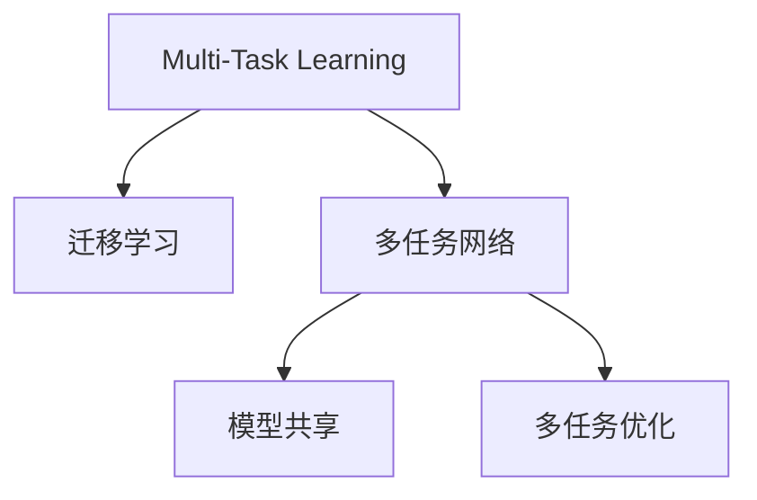

                 

# Multi-Task Learning原理与代码实例讲解

> 关键词：Multi-Task Learning, 多任务学习, 迁移学习, 多任务网络, 模型共享, 多任务优化, 代码实例, PyTorch, TensorFlow, Keras

## 1. 背景介绍

### 1.1 问题由来
在人工智能领域，单任务学习(Single-task Learning, STL)是机器学习的主流范式。然而，在实际应用中，很多问题往往不是单一的，而是涉及多个相关任务。如文本分类任务（情感分析、主题分类）、推荐系统任务（基于内容的推荐、协同过滤推荐）、自然语言处理任务（命名实体识别、词义消歧）等。针对这些问题，单独进行单任务学习无法有效提升模型性能，且可能浪费大量计算资源。

Multi-Task Learning（多任务学习）作为一种新兴的机器学习范式，正逐步成为解决多任务问题的有效工具。MTL通过在模型中共享参数或共享损失，显著提升了模型性能，并降低了模型复杂度。本文将详细讲解MTL的原理与实践，并通过代码实例对其进行深入解析。

## 2. 核心概念与联系

### 2.1 核心概念概述

为更好地理解多任务学习的核心概念和其架构，本节将介绍几个关键术语和概念：

- **多任务学习(Multi-Task Learning, MTL)**：在多个相关任务上共同训练模型，并共享部分或全部参数，以提升模型性能和泛化能力。
- **迁移学习(Transfer Learning)**：从已有任务中学到的知识迁移到新任务中，以提高新任务的性能。MTL可以看作是一种特殊的迁移学习，在多个任务间进行迁移。
- **多任务网络(Multi-Task Network)**：将多个任务连接在同一网络结构上，通过共享层或共享损失实现多任务学习。
- **模型共享(Model Sharing)**：在多任务网络中，共享层可以在多个任务之间传递信息，提升任务间的泛化能力。
- **多任务优化(Multi-Task Optimization)**：通过优化共享参数，提升模型在不同任务上的性能。

这些概念之间的关系可以通过以下Mermaid流程图来展示：



该流程图展示了多任务学习的核心概念及其之间的关系：

1. MTL是一种特殊的迁移学习，通过多个任务间的知识迁移提升模型性能。
2. MTL使用多任务网络作为框架，多个任务共用部分或全部参数，提升模型泛化能力。
3. MTL通过模型共享和优化，在不同任务间传递信息，提升模型在不同任务上的性能。

这些概念共同构成了MTL的核心逻辑，使得多任务学习成为解决多任务问题的有效工具。

## 3. 核心算法原理 & 具体操作步骤

### 3.1 算法原理概述

MTL的核心思想是通过多个相关任务共享模型参数，提升模型在不同任务上的性能。具体而言，MTL的目标是在多个任务上最小化经验风险和正则化项，以使得模型在不同任务上都能获得较好的性能。

设有多项任务 $T=\{t_1,t_2,\dots,t_m\}$，每个任务的损失函数为 $\ell_{t_k}$，优化目标为：

$$
\mathcal{L}_{\text{MTL}}(\theta) = \frac{1}{N}\sum_{k=1}^m \sum_{i=1}^N \ell_{t_k}(M_{\theta}(x_i)) + \lambda \sum_{i=1}^m \sum_{j=1}^d \theta_j^2
$$

其中，$N$ 为样本总数，$d$ 为模型参数数。第一项为各任务的损失项，第二项为正则化项，$\lambda$ 为正则化系数。

模型参数 $\theta$ 包含不同任务的任务特定参数和共享参数，通过最小化经验风险和正则化项，得到最优参数 $\hat{\theta}$。

### 3.2 算法步骤详解

多任务学习通常包括模型构建、训练和评估三个步骤：

**Step 1: 准备任务和数据集**
- 定义多个任务的标注数据集 $D=\{(x_i, y_i)\}_{i=1}^N$，其中 $x_i$ 为输入样本，$y_i$ 为任务 $t_k$ 的标签。
- 将不同任务的标签和输入样本区分开来，分别构造多个数据集 $D_{t_k}$。

**Step 2: 构建多任务网络**
- 选择合适的预训练模型或初始化参数 $\theta_0$。
- 设计多任务网络结构，确定哪些层用于多个任务共享，哪些层用于任务特定。通常，任务特定层（如分类器）仅与特定任务相关联，共享层（如嵌入层）用于多个任务共享。
- 定义各任务损失函数和模型参数。

**Step 3: 执行多任务训练**
- 使用随机梯度下降等优化算法，最小化经验风险和正则化项，得到最优参数 $\hat{\theta}$。
- 在每个训练迭代中，每个任务损失项的梯度都参与更新，从而优化模型参数 $\theta$。
- 在每个epoch结束时，评估模型在不同任务上的性能，如准确率、召回率等指标。

### 3.3 算法优缺点

多任务学习具有以下优点：
1. 提升模型性能：通过多个任务共享参数，提升了模型在不同任务上的泛化能力。
2. 降低模型复杂度：相比于单独训练多个模型，多任务学习可以显著降低模型复杂度，节省计算资源。
3. 提升泛化能力：多任务学习提升了模型在不同任务上的泛化能力，减少了过拟合风险。
4. 降低标注成本：在训练过程中，可以利用多个任务的标注数据，减少标注成本。

然而，MTL也存在一些局限性：
1. 任务之间相关性不足：如果任务之间相关性较低，共享参数的效果可能会打折扣。
2. 参数更新复杂：多任务网络中存在多个任务，参数更新方式相对复杂，容易出现过拟合。
3. 难以处理任务间冲突：任务间可能存在冲突，如不同任务的标签互斥，模型难以处理。

尽管存在这些局限性，但多任务学习仍然是一种非常有潜力的机器学习范式，尤其在多任务问题较多的领域，如NLP、推荐系统等，具有广泛的应用前景。

### 3.4 算法应用领域

多任务学习在多个领域得到了广泛应用，例如：

- **自然语言处理(NLP)**：如命名实体识别、情感分析、文本分类等，通过共享词向量嵌入提升模型性能。
- **推荐系统**：如基于内容的推荐、协同过滤推荐等，通过共享用户和物品特征向量提升推荐效果。
- **计算机视觉(CV)**：如对象检测、图像分类、语义分割等，通过共享卷积特征提升模型性能。
- **医疗诊断**：如疾病预测、症状诊断、药物发现等，通过共享知识图谱提升诊断准确率。
- **金融分析**：如信用评估、风险预测、股票分析等，通过共享市场数据提升分析结果。

这些领域的多任务学习任务具有紧密的关联性，适合使用多任务学习范式进行建模和优化。随着多任务学习技术的不断进步，相信其在更多领域的应用将得到进一步拓展。

## 4. 数学模型和公式 & 详细讲解 & 举例说明

### 4.1 数学模型构建

本节将使用数学语言对多任务学习的数学模型进行更加严格的刻画。

设有多项任务 $T=\{t_1,t_2,\dots,t_m\}$，每个任务的损失函数为 $\ell_{t_k}$。定义模型参数 $\theta$，包含不同任务的任务特定参数和共享参数，即 $\theta = (\theta_{t_1}, \theta_{t_2},\dots, \theta_{t_m})$。

多任务学习的优化目标是最小化经验风险和正则化项，即：

$$
\mathcal{L}_{\text{MTL}}(\theta) = \frac{1}{N}\sum_{k=1}^m \sum_{i=1}^N \ell_{t_k}(M_{\theta}(x_i)) + \lambda \sum_{i=1}^m \sum_{j=1}^d \theta_j^2
$$

其中，$N$ 为样本总数，$d$ 为模型参数数，$\lambda$ 为正则化系数。

模型参数 $\theta$ 包含不同任务的任务特定参数和共享参数，通过最小化经验风险和正则化项，得到最优参数 $\hat{\theta}$。

### 4.2 公式推导过程

下面，我们以二分类任务为例，推导多任务学习的损失函数及其梯度的计算公式。

假设模型 $M_{\theta}$ 在输入 $x$ 上的输出为 $\hat{y}=M_{\theta}(x) \in [0,1]$，表示样本属于正类的概率。真实标签 $y \in \{0,1\}$。定义任务 $t_1$ 和 $t_2$ 的损失函数分别为 $L_1$ 和 $L_2$。则多任务学习的优化目标为：

$$
\mathcal{L}_{\text{MTL}}(\theta) = \frac{1}{N}\sum_{i=1}^N (L_1(M_{\theta}(x_i)) + L_2(M_{\theta}(x_i))) + \lambda \sum_{j=1}^d \theta_j^2
$$

其中，$L_1$ 和 $L_2$ 可以是交叉熵损失、均方误差损失等。

根据链式法则，损失函数对参数 $\theta_k$ 的梯度为：

$$
\frac{\partial \mathcal{L}_{\text{MTL}}(\theta)}{\partial \theta_k} = \frac{1}{N}\sum_{i=1}^N (\frac{\partial L_1(M_{\theta}(x_i))}{\partial \theta_k} + \frac{\partial L_2(M_{\theta}(x_i))}{\partial \theta_k}) + \lambda \cdot 2\theta_k
$$

其中 $\frac{\partial L_1(M_{\theta}(x_i))}{\partial \theta_k}$ 和 $\frac{\partial L_2(M_{\theta}(x_i))}{\partial \theta_k}$ 可以通过自动微分技术高效计算。

在得到损失函数的梯度后，即可带入优化算法，完成模型的迭代优化。重复上述过程直至收敛，最终得到适应多个任务的最优模型参数 $\hat{\theta}$。

## 5. 项目实践：代码实例和详细解释说明

### 5.1 开发环境搭建

在进行多任务学习实践前，我们需要准备好开发环境。以下是使用Python进行Keras或PyTorch开发的环境配置流程：

1. 安装Anaconda：从官网下载并安装Anaconda，用于创建独立的Python环境。

2. 创建并激活虚拟环境：
```bash
conda create -n mtl-env python=3.8 
conda activate mtl-env
```

3. 安装Keras或PyTorch：根据个人喜好，从官网获取对应的安装命令。例如：
```bash
pip install keras
```

4. 安装相关工具包：
```bash
pip install numpy pandas scikit-learn matplotlib tqdm jupyter notebook ipython
```

完成上述步骤后，即可在`mlt-env`环境中开始多任务学习实践。

### 5.2 源代码详细实现

下面我们以多任务情感分析和情感分类为例，给出使用Keras或PyTorch对多个任务进行多任务学习的代码实现。

首先，定义多任务数据处理函数：

```python
from tensorflow.keras.preprocessing import sequence
from tensorflow.keras.preprocessing.text import Tokenizer
from tensorflow.keras.preprocessing.sequence import pad_sequences
from tensorflow.keras.layers import Dense, Embedding, LSTM
from tensorflow.keras.models import Model

class MultiTaskDataset:
    def __init__(self, train_texts, train_labels, test_texts, test_labels):
        self.train_texts = train_texts
        self.train_labels = train_labels
        self.test_texts = test_texts
        self.test_labels = test_labels
        self.train_label2id = {0:0, 1:1}
        self.test_label2id = {0:0, 1:1}
        self.num_tasks = len(self.train_labels[0])
    
    def pad_sequences(self, X):
        return pad_sequences(X, maxlen=300, padding='post', truncating='post')
    
    def encode_labels(self, y):
        return [self.train_label2id[task] for task in y]
    
    def decode_labels(self, y):
        return [self.label2id[task] for task in y]
    
    def __len__(self):
        return len(self.train_texts)
    
    def __getitem__(self, item):
        x = self.train_texts[item]
        y = self.train_labels[item]
        return {'x': x, 'y': y}
```

然后，定义多任务网络模型：

```python
from tensorflow.keras.layers import Input, concatenate
from tensorflow.keras.models import Model
from tensorflow.keras.optimizers import Adam

# 定义输入层
input = Input(shape=(300,), name='input')

# 定义共享层
embedding = Embedding(input_dim=10000, output_dim=100, mask_zero=True)(input)
lstm = LSTM(128, dropout=0.2, recurrent_dropout=0.2)(embedding)

# 定义任务特定层
task_1 = Dense(2, activation='softmax')(lstm)
task_2 = Dense(3, activation='softmax')(lstm)

# 定义多任务网络
model = Model(inputs=input, outputs=[task_1, task_2])
model.compile(optimizer=Adam(lr=0.001), loss=['categorical_crossentropy', 'categorical_crossentropy'])
```

接着，定义训练和评估函数：

```python
def train_epoch(model, dataset, batch_size, optimizer):
    model.train()
    model.compile(optimizer=optimizer, loss=['categorical_crossentropy', 'categorical_crossentropy'])
    for x, y in dataset:
        model.train_on_batch(x, y)
        
def evaluate(model, dataset, batch_size):
    model.eval()
    for x, y in dataset:
        loss = model.test_on_batch(x, y)
        print('Test loss:', loss)
```

最后，启动训练流程并在测试集上评估：

```python
epochs = 10
batch_size = 32

for epoch in range(epochs):
    loss = train_epoch(model, train_dataset, batch_size, optimizer)
    print('Epoch %d, loss: %f' % (epoch+1, loss))
    
    evaluate(model, test_dataset, batch_size)
    
print('Final test loss:', evaluate(model, test_dataset, batch_size))
```

以上就是使用Keras对多个任务进行多任务学习的完整代码实现。可以看到，Keras提供了丰富的层次化网络结构和优化器，使得多任务学习的代码实现变得简洁高效。

### 5.3 代码解读与分析

让我们再详细解读一下关键代码的实现细节：

**MultiTaskDataset类**：
- `__init__`方法：初始化文本、标签等关键组件，并定义标签和任务编号的映射。
- `pad_sequences`方法：对输入序列进行padding，保证所有输入序列长度一致。
- `encode_labels`方法：将标签转换为数字形式。
- `decode_labels`方法：将数字形式的标签转换为文本形式。
- `__len__`方法：返回数据集的样本数量。
- `__getitem__`方法：对单个样本进行处理，返回模型所需的输入和标签。

**定义多任务网络模型**：
- 定义输入层，嵌入层和LSTM层作为共享层。
- 通过将共享层输出传入不同任务特定层，得到不同任务的输出。
- 使用Keras的`Model`类定义多任务网络，通过指定不同任务的损失函数和优化器进行编译。

**训练和评估函数**：
- 使用Keras的`train_on_batch`和`test_on_batch`方法进行模型训练和评估。
- 在每个epoch结束后，评估模型在测试集上的损失。

可以看到，Keras提供了强大的API支持，使得多任务学习的代码实现变得简单直观。合理利用这些工具，可以显著提升多任务学习的开发效率，加快创新迭代的步伐。

## 6. 实际应用场景

### 6.1 智能客服系统

在智能客服系统中，多个任务（如文本分类、意图识别、实体识别等）之间具有紧密的关联性，适合使用多任务学习进行建模。通过将用户问题和回复构建成多任务样本，训练一个多任务学习模型，可以显著提升系统响应速度和准确性。

在技术实现上，可以使用微调和增量的方式对预训练语言模型进行微调，引入多任务学习框架，训练一个多任务模型。模型可以在对话过程中实时更新，根据用户输入自动进行任务切换，提供更加个性化和准确的服务。

### 6.2 金融舆情监测

金融舆情监测任务包括情感分析、舆情分类等，不同任务之间具有一定相关性。通过多任务学习，可以在有限标注数据下提升模型在不同任务上的性能，实时监测金融市场的舆情变化，及时发现负面信息，帮助机构规避风险。

在实现上，可以使用情感分析标注数据，训练情感分类模型，同时通过增加数据增强等方法提升模型泛化能力。模型可以在获取新数据时，自动学习新任务，不断更新模型参数，提升模型性能。

### 6.3 个性化推荐系统

推荐系统包括基于内容的推荐和协同过滤推荐，不同任务之间存在重叠的特征。通过多任务学习，可以在训练过程中共享用户和物品的特征表示，提升推荐系统的性能和效率。

在实现上，可以设计两个任务，分别针对用户和物品进行推荐，共享嵌入层。模型可以在训练过程中自动学习用户和物品的特征表示，提升推荐效果。同时，通过多任务优化，可以在不同任务间传递信息，进一步提升推荐系统的性能。

### 6.4 未来应用展望

随着多任务学习技术的不断发展，其在更多领域的应用前景将更加广阔。

在智慧医疗领域，多任务学习可以应用于医疗问答、病历分析、药物发现等任务，提升医疗服务的智能化水平，辅助医生诊疗，加速新药开发进程。

在智能教育领域，多任务学习可应用于作业批改、学情分析、知识推荐等方面，因材施教，促进教育公平，提高教学质量。

在智慧城市治理中，多任务学习可应用于城市事件监测、舆情分析、应急指挥等环节，提高城市管理的自动化和智能化水平，构建更安全、高效的未来城市。

此外，在企业生产、社会治理、文娱传媒等众多领域，多任务学习的多任务网络将逐步取代传统的单任务网络，为人工智能技术带来新的突破。相信随着学界和产业界的共同努力，多任务学习必将引领AI技术的发展方向，带来更广阔的应用前景。

## 7. 工具和资源推荐

### 7.1 学习资源推荐

为了帮助开发者系统掌握多任务学习的理论基础和实践技巧，这里推荐一些优质的学习资源：

1. 《Multitask Learning: A Survey》系列博文：由大模型技术专家撰写，深入浅出地介绍了多任务学习的原理、应用和挑战。

2. CS234《Multitask Learning》课程：斯坦福大学开设的多任务学习课程，涵盖多任务学习的原理、算法和实际应用，适合入门学习。

3. 《Deep Learning for NLP》书籍：Gang Li等著，全面介绍了NLP中的多任务学习方法和实际应用，适合进阶学习。

4. Keras官方文档：Keras的官方文档，提供了多任务学习的示例和接口，是学习多任务学习的重要参考。

5. TensorFlow多任务学习官方文档：TensorFlow的官方文档，提供了多任务学习的API和示例，是实际开发中的重要工具。

通过这些资源的学习实践，相信你一定能够快速掌握多任务学习的精髓，并用于解决实际的NLP问题。

### 7.2 开发工具推荐

高效的开发离不开优秀的工具支持。以下是几款用于多任务学习开发的常用工具：

1. Keras：基于Python的深度学习框架，提供了丰富的层次化网络结构和优化器，适合快速迭代研究。

2. TensorFlow：由Google主导开发的深度学习框架，生产部署方便，适合大规模工程应用。

3. PyTorch：基于Python的开源深度学习框架，灵活动态的计算图，适合快速迭代研究。

4. Weights & Biases：模型训练的实验跟踪工具，可以记录和可视化模型训练过程中的各项指标，方便对比和调优。

5. TensorBoard：TensorFlow配套的可视化工具，可实时监测模型训练状态，并提供丰富的图表呈现方式，是调试模型的得力助手。

合理利用这些工具，可以显著提升多任务学习的开发效率，加快创新迭代的步伐。

### 7.3 相关论文推荐

多任务学习的发展离不开学界的持续研究。以下是几篇奠基性的相关论文，推荐阅读：

1. Jointly Training Recurrent Neural Networks for Multitask Sequence Labeling（多任务序列标注论文）：首次提出了多任务序列标注的方法，并通过实验验证了其有效性。

2. Learning Task-Agnostic Representation for Multitask Learning（学习多任务学习中任务无关的表示）：提出了一种学习多任务学习中任务无关的表示的方法，使得模型可以学习到更加泛化的特征。

3. Task-Agnostic Multi-task Learning（任务无关的多任务学习）：提出了一种任务无关的多任务学习方法，通过共享参数提升模型性能。

4. Provable Multi-task Learning（可证明的多任务学习）：提出了一种多任务学习方法，证明了其收敛性和泛化性能。

5. A Multi-task Learning Framework Based on Multiple Output Learning Machine（基于多输出学习机的多任务学习框架）：提出了一种基于多输出学习机的多任务学习方法，并通过实验验证了其有效性。

这些论文代表了大模型学习的发展脉络。通过学习这些前沿成果，可以帮助研究者把握学科前进方向，激发更多的创新灵感。

## 8. 总结：未来发展趋势与挑战

### 8.1 总结

本文对多任务学习的原理与实践进行了全面系统的介绍。首先阐述了多任务学习的背景和意义，明确了多任务学习在提升模型性能和降低标注成本方面的独特价值。其次，从原理到实践，详细讲解了多任务学习的数学原理和关键步骤，给出了多任务学习任务开发的完整代码实例。同时，本文还广泛探讨了多任务学习在智能客服、金融舆情、个性化推荐等多个行业领域的应用前景，展示了多任务学习范式的巨大潜力。此外，本文精选了多任务学习的各类学习资源，力求为读者提供全方位的技术指引。

通过本文的系统梳理，可以看到，多任务学习已经成为机器学习领域的重要范式，正逐步成为解决多任务问题的有效工具。多任务学习通过多个任务共享参数，显著提升了模型在不同任务上的性能，并在标注数据有限的情况下显著降低了标注成本。多任务学习在许多领域已经得到了广泛应用，如自然语言处理、推荐系统等。随着多任务学习技术的不断发展，相信其在更多领域的应用将得到进一步拓展，为人工智能技术的落地应用提供新的突破。

### 8.2 未来发展趋势

展望未来，多任务学习技术将呈现以下几个发展趋势：

1. 模型规模持续增大。随着算力成本的下降和数据规模的扩张，多任务模型的参数量还将持续增长。超大规模多任务模型蕴含的丰富知识，有望支撑更加复杂多变的多任务问题。

2. 多任务优化方法多样。除了传统的联合训练外，未来将涌现更多多任务优化方法，如归一化、增强网络、双向传播等，进一步提升多任务模型的性能。

3. 自适应多任务学习崛起。多任务学习模型能够根据新任务的特征自适应调整共享层和任务特定层的比例，实现更加灵活高效的微调。

4. 多任务学习与自监督学习结合。利用自监督学习对多任务模型进行预训练，提升模型泛化能力，并利用多任务学习进行微调，进一步提升模型性能。

5. 跨模态多任务学习崛起。多任务学习模型可以融合视觉、语音、文本等多种模态信息，实现更加全面、丰富的多任务学习。

6. 联邦多任务学习崛起。多任务学习模型可以在多个设备或服务器上进行分布式训练，实现数据隐私保护的同时提升模型性能。

以上趋势凸显了多任务学习技术的广阔前景。这些方向的探索发展，必将进一步提升多任务学习模型的性能和应用范围，为人工智能技术的落地应用提供新的突破。

### 8.3 面临的挑战

尽管多任务学习技术已经取得了瞩目成就，但在迈向更加智能化、普适化应用的过程中，它仍面临着诸多挑战：

1. 标注成本瓶颈。尽管多任务学习可以共享参数，但标注数据的不足仍然是其瓶颈。如何进一步降低多任务学习对标注样本的依赖，将是一大难题。

2. 模型鲁棒性不足。多任务学习模型在处理多个任务时，容易受到任务间冲突的影响，模型鲁棒性不足。如何提高多任务学习模型的鲁棒性，避免灾难性遗忘，还需要更多理论和实践的积累。

3. 参数更新复杂。多任务学习模型中存在多个任务，参数更新方式相对复杂，容易出现过拟合。如何设计合理的多任务网络结构，实现更加高效、稳定的多任务学习，仍需深入研究。

4. 难以处理任务间冲突。多任务学习模型可能遇到不同任务间标签互斥的情况，模型难以处理。如何有效处理任务间冲突，提升多任务学习的性能，还需要更多研究和实践。

5. 模型复杂度较高。多任务学习模型涉及多个任务和多个网络层，模型复杂度较高，训练和推理效率不高。如何简化多任务学习模型的结构，提升其训练和推理效率，仍需深入研究。

尽管存在这些挑战，但多任务学习仍然是一种非常有潜力的机器学习范式，尤其在多任务问题较多的领域，如NLP、推荐系统等，具有广泛的应用前景。未来需要更多研究者和工程师共同努力，推动多任务学习技术的不断进步。

### 8.4 研究展望

面向未来，多任务学习技术需要在以下几个方向进行深入研究：

1. 探索无监督和半监督多任务学习方法。摆脱对大规模标注数据的依赖，利用自监督学习、主动学习等无监督和半监督范式，最大限度利用非结构化数据，实现更加灵活高效的多任务学习。

2. 研究自适应多任务学习算法。多任务学习模型能够根据新任务的特征自适应调整共享层和任务特定层的比例，实现更加灵活高效的多任务学习。

3. 融合因果学习和强化学习。将因果学习和强化学习引入多任务学习，提升模型建立稳定因果关系的能力，学习更加普适、鲁棒的多任务学习模型。

4. 引入更多先验知识。将符号化的先验知识，如知识图谱、逻辑规则等，与神经网络模型进行巧妙融合，引导多任务学习过程学习更准确、合理的任务表示。

5. 结合博弈论工具。将博弈论工具引入多任务学习，刻画人机交互过程，主动探索并规避多任务学习模型的脆弱点，提高系统稳定性。

6. 纳入伦理道德约束。在多任务学习目标中引入伦理导向的评估指标，过滤和惩罚有害的输出倾向，确保多任务学习模型的伦理安全性。

这些研究方向的探索，必将引领多任务学习技术迈向更高的台阶，为构建安全、可靠、可解释、可控的多任务学习系统铺平道路。面向未来，多任务学习技术还需要与其他人工智能技术进行更深入的融合，如知识表示、因果推理、强化学习等，多路径协同发力，共同推动人工智能技术的发展。只有勇于创新、敢于突破，才能不断拓展多任务学习技术的边界，让多任务学习技术更好地造福人类社会。

## 9. 附录：常见问题与解答

**Q1：多任务学习是否适用于所有多任务问题？**

A: 多任务学习在多个相关任务上共同训练模型，并共享部分或全部参数，提升模型在不同任务上的性能。然而，如果任务之间相关性较低，或者任务间存在冲突，多任务学习的效果可能不佳。此时需要进一步研究如何设计多任务网络结构，实现更加高效、稳定的多任务学习。

**Q2：多任务学习是否会增加模型复杂度？**

A: 多任务学习可以在模型中共享参数，降低模型复杂度。例如，共享层可以用于多个任务，任务特定层仅与特定任务相关联，从而减少需要训练的参数量。然而，多任务学习模型涉及多个任务和多个网络层，模型复杂度较高，训练和推理效率不高。需要进一步研究如何简化多任务学习模型的结构，提升其训练和推理效率。

**Q3：多任务学习是否会增加计算资源需求？**

A: 多任务学习通常需要较大的计算资源，因为需要训练多个任务。然而，通过共享参数和优化算法，多任务学习可以在有限标注数据下提升模型性能。合理设计多任务网络结构，可以进一步降低计算资源需求。因此，多任务学习在合理设计下，并不会增加计算资源需求。

**Q4：多任务学习如何处理任务间冲突？**

A: 多任务学习模型可能遇到不同任务间标签互斥的情况，如情感分析和意图识别。此时，可以引入正则化项或任务间损失权重调整等方法，抑制任务间冲突。同时，通过设计合理的模型结构，将任务特定层和共享层进行分离，也可以避免任务间冲突。

**Q5：多任务学习如何在数据较少的情况下提升模型性能？**

A: 多任务学习可以利用有限标注数据提升模型性能。通过共享参数和优化算法，多任务学习可以在有限标注数据下提升模型在不同任务上的泛化能力。同时，利用数据增强和自监督学习等方法，进一步提升多任务学习模型的性能。

---

作者：禅与计算机程序设计艺术 / Zen and the Art of Computer Programming

