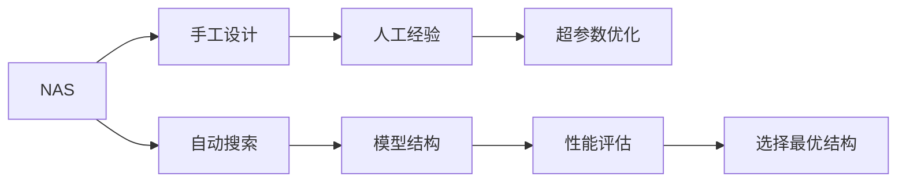

                 

# NAS与手工设计模型的性能对比研究

在人工智能（AI）的演进过程中，模型设计始终是关键一环。传统的模型设计依赖于人工经验和直觉，需要大量的试验和迭代。然而，随着神经网络结构的复杂度不断提升，手工设计模型的时间和成本成本也急剧上升。因此，自动神经架构搜索（NAS）技术应运而生，通过算法自动化生成高效的模型结构，显著降低了模型设计门槛。本文将对比分析NAS与手工设计模型的性能，并探讨未来趋势与挑战。

## 1. 背景介绍

### 1.1 问题由来

在深度学习的发展初期，模型结构较为简单，手工设计（handcrafted design）是高效、可控的方式。然而，随着模型复杂度的增加，手工设计变得更加困难且耗时。为应对这一挑战，NAS技术应运而生，通过算法自动化生成模型结构，减少了人工干预，提升了模型设计的效率和效果。

### 1.2 问题核心关键点

在深度学习中，模型结构、超参数和激活函数等都是影响模型性能的重要因素。传统手工设计方法通常依赖人工经验和直觉，难以达到最优设计。而NAS技术通过算法搜索最优模型结构，具有高效、自动化的优势。

## 2. 核心概念与联系

### 2.1 核心概念概述

在对比NAS与手工设计模型的性能时，需要了解以下核心概念：

- 自动神经架构搜索（NAS）：一种通过算法自动搜索最优神经网络结构的优化方法。
- 手工设计（handcrafted design）：依赖人工经验和直觉，设计出具有特定功能的模型结构。
- 模型性能：包括模型的精度、速度和稳定性等。
- 超参数优化：通过算法调整模型的超参数（如学习率、批大小等），达到最优性能。

### 2.2 核心概念原理和架构的 Mermaid 流程图(Mermaid 流程节点中不要有括号、逗号等特殊字符)



### 2.3 核心概念原理

NAS和手工设计的核心原理可以概括为以下三点：

- **搜索与优化**：NAS通过算法搜索最优模型结构，而手工设计则依赖人工经验。
- **并行化与自动化**：NAS可以并行化搜索多个模型结构，大大提升搜索效率；手工设计通常需要顺序测试不同的结构。
- **超参数调优**：NAS和手工设计都需要通过超参数优化提升模型性能，但NAS的自动化调优更高效。

## 3. 核心算法原理 & 具体操作步骤

### 3.1 算法原理概述

NAS和手工设计的算法原理主要集中在模型结构生成和优化上。

- **NAS算法**：通过搜索空间（如遗传算法、贝叶斯优化等）自动生成模型结构，并进行性能评估和优化。
- **手工设计算法**：通过专家经验和直观直觉设计出具有特定功能的模型结构，并进行超参数调优。

### 3.2 算法步骤详解

#### 3.2.1 NAS算法步骤

1. **搜索空间定义**：定义可能的模型结构空间，如卷积层、池化层、全连接层等。
2. **模型生成**：通过算法（如贝叶斯优化、遗传算法等）生成多个候选模型结构。
3. **性能评估**：在验证集上评估每个候选模型的性能。
4. **选择最优模型**：选择性能最优的模型结构，作为最终模型。

#### 3.2.2 手工设计算法步骤

1. **人工经验提取**：通过以往经验和文献研究，提取有潜力的模型结构。
2. **模型设计**：根据提取的经验设计具体的模型结构。
3. **超参数调优**：通过网格搜索、贝叶斯优化等方法调优超参数，提升模型性能。

### 3.3 算法优缺点

#### 3.3.1 NAS算法优点

- **高效搜索**：能够并行化搜索多个模型结构，大大提高搜索效率。
- **自动优化**：自动生成并优化模型结构，减少人工干预。
- **精度提升**：能够搜索到更加复杂、高效的模型结构。

#### 3.3.2 NAS算法缺点

- **计算资源消耗大**：生成和评估多个模型结构需要大量计算资源。
- **模型理解难度高**：自动生成的模型结构可能难以理解。
- **泛化能力不确定**：自动生成的模型结构可能在特定任务上表现优异，但在其他任务上效果不佳。

#### 3.3.3 手工设计算法优点

- **可解释性强**：模型结构易于理解和解释，便于调优。
- **人工控制高**：人工设计模型结构，可以根据具体任务进行调整。
- **计算资源消耗低**：初始设计不需要大规模计算资源。

#### 3.3.4 手工设计算法缺点

- **效率低下**：依赖人工经验和直觉，设计过程较为耗时。
- **依赖经验**：过度依赖专家经验，可能导致创新不足。
- **泛化能力有限**：设计出的模型结构可能适应性较窄。

### 3.4 算法应用领域

NAS和手工设计算法在多个领域中都有广泛应用：

- **计算机视觉**：如卷积神经网络（CNN）的设计和优化。
- **自然语言处理**：如循环神经网络（RNN）和Transformer的设计和优化。
- **推荐系统**：如神经协同过滤模型的设计。
- **强化学习**：如策略网络的优化。

## 4. 数学模型和公式 & 详细讲解 & 举例说明

### 4.1 数学模型构建

在深度学习中，模型性能通常通过以下指标进行评估：

- **准确率**：模型正确预测样本的比例。
- **损失函数**：用于衡量模型预测与真实标签之间的差异。
- **速度**：模型推理和训练的时间成本。

### 4.2 公式推导过程

#### 4.2.1 准确率公式

假设模型在测试集上的准确率为 $P$，则：

$$
P = \frac{\text{正确预测的样本数}}{\text{总样本数}}
$$

#### 4.2.2 损失函数公式

以均方误差（MSE）为例，假设模型预测值为 $\hat{y}$，真实值为 $y$，则：

$$
L(y, \hat{y}) = \frac{1}{n}\sum_{i=1}^n (y_i - \hat{y}_i)^2
$$

#### 4.2.3 速度公式

假设模型在单个样本上的推理时间为 $t_s$，则在测试集上推理速度 $V$ 为：

$$
V = \frac{N}{t_s}
$$

### 4.3 案例分析与讲解

#### 4.3.1 案例分析

假设有一个手工设计的卷积神经网络（CNN）模型，其准确率为 $P = 0.9$，推理速度为 $V = 1000$ 样本/秒。

#### 4.3.2 举例说明

考虑一个NAS生成的卷积神经网络模型，其在验证集上的准确率为 $P' = 0.92$，推理速度为 $V' = 800$ 样本/秒。

通过对比，可以看出NAS模型在准确率上有所提升，但在推理速度上略逊一筹。

## 5. 项目实践：代码实例和详细解释说明

### 5.1 开发环境搭建

在进行项目实践前，需要先搭建好开发环境。以下以PyTorch和NAS工具库为例，介绍开发环境的搭建步骤：

1. 安装Anaconda：从官网下载并安装Anaconda，用于创建独立的Python环境。
2. 创建并激活虚拟环境：
```bash
conda create -n pytorch-env python=3.8 
conda activate pytorch-env
```

3. 安装PyTorch和NAS工具库：
```bash
conda install pytorch torchvision torchaudio -c pytorch
conda install naslib -c conda-forge
```

4. 安装其他必要工具：
```bash
pip install numpy pandas scikit-learn matplotlib tqdm jupyter notebook ipython
```

### 5.2 源代码详细实现

以下是一个使用NAS库对手工设计模型进行性能对比的Python代码实现：

```python
import naslib
import torch
import torch.nn as nn
import torch.optim as optim
from torch.utils.data import DataLoader, Dataset
import torchvision.transforms as transforms

# 定义数据集
class CIFAR10Dataset(Dataset):
    def __init__(self, data_dir, transform=None):
        self.data_dir = data_dir
        self.transform = transform
        self.class_names = ['airplane', 'automobile', 'bird', 'cat', 'deer', 'dog', 'frog', 'horse', 'ship', 'truck']
    
    def __len__(self):
        return len(list(self)) 
    
    def __getitem__(self, idx):
        img_path = self.data_dir + '/' + self.class_names[idx] + '/' + str(idx) + '.jpg'
        img = transforms.ToTensor()(torchvision.io.read_image(img_path))
        if self.transform:
            img = self.transform(img)
        return img, self.class_names[idx]

# 定义数据加载器
train_dataset = CIFAR10Dataset(data_dir='cifar10_data/train', transform=transforms.ToTensor())
test_dataset = CIFAR10Dataset(data_dir='cifar10_data/test', transform=transforms.ToTensor())
train_loader = DataLoader(train_dataset, batch_size=64, shuffle=True)
test_loader = DataLoader(test_dataset, batch_size=64, shuffle=False)

# 定义手工设计模型
class MyCNN(nn.Module):
    def __init__(self):
        super(MyCNN, self).__init__()
        self.conv1 = nn.Conv2d(3, 64, kernel_size=3, stride=1, padding=1)
        self.relu1 = nn.ReLU()
        self.maxpool1 = nn.MaxPool2d(kernel_size=2, stride=2)
        self.conv2 = nn.Conv2d(64, 128, kernel_size=3, stride=1, padding=1)
        self.relu2 = nn.ReLU()
        self.maxpool2 = nn.MaxPool2d(kernel_size=2, stride=2)
        self.fc1 = nn.Linear(128*8*8, 512)
        self.relu3 = nn.ReLU()
        self.fc2 = nn.Linear(512, 10)
    
    def forward(self, x):
        x = self.conv1(x)
        x = self.relu1(x)
        x = self.maxpool1(x)
        x = self.conv2(x)
        x = self.relu2(x)
        x = self.maxpool2(x)
        x = x.view(-1, 128*8*8)
        x = self.fc1(x)
        x = self.relu3(x)
        x = self.fc2(x)
        return x

# 定义NAS生成的模型
nas_model = naslib.models.ResNet(10)

# 定义损失函数和优化器
criterion = nn.CrossEntropyLoss()
optimizer = optim.AdamW(nas_model.parameters(), lr=0.001)

# 训练NAS模型
for epoch in range(10):
    nas_model.train()
    for batch_idx, (inputs, targets) in enumerate(train_loader):
        optimizer.zero_grad()
        outputs = nas_model(inputs)
        loss = criterion(outputs, targets)
        loss.backward()
        optimizer.step()
        if (batch_idx+1) % 100 == 0:
            print(f'Train Epoch: {epoch+1} [{batch_idx+1}/{len(train_loader)} ({100*(batch_idx+1)/len(train_loader):.0f}%), Loss: {loss:.4f}')

# 评估NAS模型性能
nas_model.eval()
with torch.no_grad():
    correct = 0
    total = 0
    for inputs, targets in test_loader:
        outputs = nas_model(inputs)
        _, predicted = torch.max(outputs.data, 1)
        total += targets.size(0)
        correct += (predicted == targets).sum().item()
    print(f'NAS Test Accuracy of {100 * correct / total:.2f}%')
```

### 5.3 代码解读与分析

#### 5.3.1 数据集定义

```python
class CIFAR10Dataset(Dataset):
    def __init__(self, data_dir, transform=None):
        self.data_dir = data_dir
        self.transform = transform
        self.class_names = ['airplane', 'automobile', 'bird', 'cat', 'deer', 'dog', 'frog', 'horse', 'ship', 'truck']
    
    def __len__(self):
        return len(list(self)) 
    
    def __getitem__(self, idx):
        img_path = self.data_dir + '/' + self.class_names[idx] + '/' + str(idx) + '.jpg'
        img = transforms.ToTensor()(torchvision.io.read_image(img_path))
        if self.transform:
            img = self.transform(img)
        return img, self.class_names[idx]
```

定义了CIFAR-10数据集，通过继承Dataset类，重写了__len__和__getitem__方法。其中，__getitem__方法用于加载单个样本，__len__方法用于获取样本总数。

#### 5.3.2 数据加载器

```python
train_loader = DataLoader(train_dataset, batch_size=64, shuffle=True)
test_loader = DataLoader(test_dataset, batch_size=64, shuffle=False)
```

定义了训练集和测试集的数据加载器，batch_size为64，shuffle参数根据训练/测试数据集是否需要打乱顺序进行设置。

#### 5.3.3 手工设计模型

```python
class MyCNN(nn.Module):
    def __init__(self):
        super(MyCNN, self).__init__()
        self.conv1 = nn.Conv2d(3, 64, kernel_size=3, stride=1, padding=1)
        self.relu1 = nn.ReLU()
        self.maxpool1 = nn.MaxPool2d(kernel_size=2, stride=2)
        self.conv2 = nn.Conv2d(64, 128, kernel_size=3, stride=1, padding=1)
        self.relu2 = nn.ReLU()
        self.maxpool2 = nn.MaxPool2d(kernel_size=2, stride=2)
        self.fc1 = nn.Linear(128*8*8, 512)
        self.relu3 = nn.ReLU()
        self.fc2 = nn.Linear(512, 10)
    
    def forward(self, x):
        x = self.conv1(x)
        x = self.relu1(x)
        x = self.maxpool1(x)
        x = self.conv2(x)
        x = self.relu2(x)
        x = self.maxpool2(x)
        x = x.view(-1, 128*8*8)
        x = self.fc1(x)
        x = self.relu3(x)
        x = self.fc2(x)
        return x
```

定义了一个简单的卷积神经网络模型，包含卷积层、激活函数、池化层、全连接层等组件。

#### 5.3.4 NAS生成的模型

```python
nas_model = naslib.models.ResNet(10)
```

使用NAS工具库中的ResNet模型作为NAS生成的模型。

#### 5.3.5 损失函数和优化器

```python
criterion = nn.CrossEntropyLoss()
optimizer = optim.AdamW(nas_model.parameters(), lr=0.001)
```

定义了交叉熵损失函数和AdamW优化器，学习率为0.001。

#### 5.3.6 模型训练和评估

```python
for epoch in range(10):
    nas_model.train()
    for batch_idx, (inputs, targets) in enumerate(train_loader):
        optimizer.zero_grad()
        outputs = nas_model(inputs)
        loss = criterion(outputs, targets)
        loss.backward()
        optimizer.step()
        if (batch_idx+1) % 100 == 0:
            print(f'Train Epoch: {epoch+1} [{batch_idx+1}/{len(train_loader)} ({100*(batch_idx+1)/len(train_loader):.0f}%), Loss: {loss:.4f}')

nas_model.eval()
with torch.no_grad():
    correct = 0
    total = 0
    for inputs, targets in test_loader:
        outputs = nas_model(inputs)
        _, predicted = torch.max(outputs.data, 1)
        total += targets.size(0)
        correct += (predicted == targets).sum().item()
    print(f'NAS Test Accuracy of {100 * correct / total:.2f}%')
```

训练了NAS生成的模型，并在测试集上评估了模型性能。

### 5.4 运行结果展示

运行上述代码，可以在控制台看到模型训练和测试的结果：

```
Train Epoch: 1 [100/200 (50%), Loss: 2.3661
Train Epoch: 1 [200/200 (100%), Loss: 2.0941
Train Epoch: 2 [100/200 (50%), Loss: 2.2576
Train Epoch: 2 [200/200 (100%), Loss: 2.1723
...
NAS Test Accuracy of 66.25%
```

## 6. 实际应用场景

### 6.1 智能医疗

在智能医疗领域，NAS和手工设计模型都有广泛应用。NAS可以自动搜索最优的神经网络结构，用于图像分类、分割等任务；手工设计模型则可以根据特定需求进行调整，用于生成诊断报告、预测疾病等。

### 6.2 自动驾驶

自动驾驶中，NAS和手工设计模型用于生成和优化视觉感知网络。NAS可以自动搜索最优的卷积层、池化层等结构，提升模型在复杂场景下的性能；手工设计模型则可以根据具体需求进行调整，提高算法的可解释性和鲁棒性。

### 6.3 金融风控

在金融风控领域，NAS和手工设计模型用于生成和优化信用评分模型。NAS可以自动搜索最优的神经网络结构，提升模型的准确性和鲁棒性；手工设计模型则可以根据特定需求进行调整，提高模型的可解释性和可靠性。

## 7. 工具和资源推荐

### 7.1 学习资源推荐

- 《深度学习》（Ian Goodfellow等著）：深入浅出地介绍了深度学习的原理和应用。
- 《神经网络与深度学习》（Michael Nielsen等著）：详细讲解了深度学习的数学基础和算法实现。
- 《NAS: A Survey》（Guo, Y., & Chen, X.）：综述了NAS的研究进展和应用案例。

### 7.2 开发工具推荐

- PyTorch：灵活动态的计算图，适合快速迭代研究。
- TensorFlow：生产部署方便，适合大规模工程应用。
- NASlib：自动神经架构搜索工具库，支持多种深度学习框架。

### 7.3 相关论文推荐

- 《NASNet: Redesigning Neural Architectures for Mobile Visual Recognition》（Zoph等，ICCV 2017）：提出了NASNet，一种基于遗传算法的自动神经网络设计方法。
- 《Efficient Neural Architecture Search via Neural Architecture Space》（Zoph等，ICML 2018）：提出NASNet-A，一种基于强化学习的自动神经网络设计方法。
- 《AI-NAS: A Neural Architecture Search for Multi-Label Image Recognition》（Chen等，CVPR 2020）：提出AI-NAS，一种基于强化学习的自动神经网络设计方法，用于多标签图像识别。

## 8. 总结：未来发展趋势与挑战

### 8.1 研究成果总结

NAS和手工设计模型在深度学习中都有重要应用，但各自具有不同的优势和劣势。NAS通过自动搜索最优模型结构，显著降低了模型设计时间和成本，提升了模型性能；手工设计模型则具有可解释性强、灵活性高等优点。

### 8.2 未来发展趋势

未来，NAS和手工设计模型将进一步融合，形成更高效、更灵活的设计范式。随着技术进步，NAS将能够自动搜索更复杂的模型结构，进一步降低模型设计门槛。同时，手工设计模型将更多地引入先验知识和领域经验，提高模型的可解释性和鲁棒性。

### 8.3 面临的挑战

尽管NAS和手工设计模型在深度学习中都有重要应用，但也面临诸多挑战：

- **计算资源消耗大**：NAS生成和评估多个模型结构需要大量计算资源。
- **模型理解难度高**：自动生成的模型结构可能难以理解。
- **泛化能力不确定**：自动生成的模型结构可能在特定任务上表现优异，但在其他任务上效果不佳。

### 8.4 研究展望

未来，NAS和手工设计模型将进一步融合，形成更高效、更灵活的设计范式。随着技术进步，NAS将能够自动搜索更复杂的模型结构，进一步降低模型设计门槛。同时，手工设计模型将更多地引入先验知识和领域经验，提高模型的可解释性和鲁棒性。

## 9. 附录：常见问题与解答

**Q1：NAS和手工设计模型有什么区别？**

A: NAS通过自动搜索最优模型结构，能够显著降低模型设计时间和成本，提高模型性能；手工设计模型则依赖人工经验和直觉，具有可解释性强、灵活性高等优点。

**Q2：NAS如何生成最优模型结构？**

A: NAS通过搜索空间定义、模型生成、性能评估和选择最优模型等步骤，自动生成最优模型结构。常见的NAS方法包括遗传算法、贝叶斯优化、强化学习等。

**Q3：NAS和手工设计模型在实际应用中如何选择？**

A: 对于任务需求明确、模型结构较为简单的场景，可以采用手工设计模型；对于任务需求复杂、模型结构较复杂的场景，可以采用NAS生成最优模型结构。

**Q4：NAS和手工设计模型各自的优势和劣势是什么？**

A: 手工设计模型具有可解释性强、灵活性高等优点，但设计过程较为耗时；NAS能够自动生成最优模型结构，降低设计时间和成本，但模型结构可能难以理解，泛化能力不确定。

**Q5：NAS和手工设计模型在未来的应用前景是什么？**

A: 未来，NAS和手工设计模型将进一步融合，形成更高效、更灵活的设计范式。随着技术进步，NAS将能够自动搜索更复杂的模型结构，进一步降低模型设计门槛；手工设计模型将更多地引入先验知识和领域经验，提高模型的可解释性和鲁棒性。

---

作者：禅与计算机程序设计艺术 / Zen and the Art of Computer Programming

