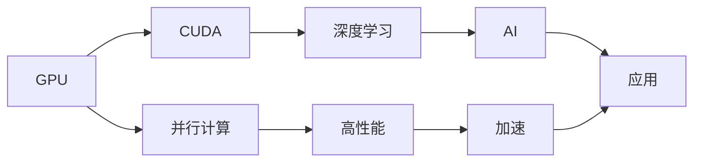

                 

# Nvidia的GPU与AI发展的关系

Nvidia的崛起，不仅改变了全球半导体产业的面貌，更成为人工智能(AI)领域的一块重要基石。GPU作为其核心产品之一，不仅是图形渲染的引擎，更成为推动AI研究和应用发展的关键动力。本文将从GPU的演变、AI算法的需求变化、AI与GPU的协同进化三个方面，阐述GPU与AI发展之间紧密的联系与相互促进的关系。

## 1. 背景介绍

### 1.1 背景概述

自1993年Nvidia成立伊始，GPU就定位于高性能图形渲染芯片。其早期产品主要用于游戏市场，但随着技术的不断进步，GPU在科学计算和图像处理等领域也找到了用武之地。随着AI技术的兴起，GPU更是以其独特的优势，成为支撑AI算法的硬件基础。

### 1.2 历史沿革

Nvidia的GPU产品线可以追溯到1993年发布的NV1芯片。在2000年，Nvidia推出了首款通用GPU产品——GeForce 256，标志着GPU市场正式从PC游戏扩展到图形计算。2002年，Nvidia发布了具有可编程着色器的GeForce FX 5800，成为第一个支持 Shader Model 2.0 的 GPU。2006年，Nvidia推出了基于统一内存架构的GeForce 7900系列，推动了GPU从固定功能向通用计算的转型。

进入21世纪，Nvidia的GPU开始广泛应用于AI领域。2012年，Nvidia推出了基于Kepler架构的Tesla系列，支持多GPU并行计算，并成功用于大规模深度学习模型的训练。2017年，Nvidia发布了支持CUDA计算框架的V100 GPU，其强大的浮点计算能力和高级优化功能，成为AI研究和应用中的核心硬件。2021年，Nvidia发布了基于Ampere架构的A100 GPU，进一步提升了性能和能效比，引领了AI领域的新一轮浪潮。

## 2. 核心概念与联系

### 2.1 核心概念概述

在GPU与AI发展的关系中，涉及到几个关键概念：

- **GPU (Graphics Processing Unit)**：用于加速图形渲染和科学计算的硬件芯片，具有高并发计算能力和低延迟的特性。
- **AI (Artificial Intelligence)**：通过机器学习、深度学习等算法，使计算机具备类似人类智能的决策和推理能力。
- **CUDA (Compute Unified Device Architecture)**：Nvidia推出的一种并行计算架构，允许GPU执行通用计算任务。
- **深度学习 (Deep Learning)**：一种基于神经网络的AI分支，广泛应用于图像识别、语音识别、自然语言处理等领域。

这些概念之间存在紧密联系：

1. GPU提供高性能的并行计算能力，使得AI算法能够高效地进行模型训练和推理。
2. CUDA架构优化了GPU对通用计算任务的执行效率，推动了深度学习等AI技术的发展。
3. AI算法对计算资源的高需求，促进了GPU市场的持续扩展和创新。

### 2.2 核心概念之间的联系

通过以下Mermaid流程图，我们可以更直观地理解GPU与AI发展之间的联系：



这个流程图展示了GPU如何通过CUDA架构提供高性能并行计算能力，加速深度学习算法的运行。最终，AI算法在GPU的支撑下，得以在各种应用场景中大展身手，推动了科技和产业的变革。

## 3. 核心算法原理 & 具体操作步骤

### 3.1 算法原理概述

GPU与AI发展的关系主要体现在以下几个方面：

- **并行计算能力**：AI算法，尤其是深度学习，需要大量的计算资源来训练模型。GPU通过大量并行的处理单元，能够在短时间内完成海量计算，极大地提高了训练效率。
- **内存带宽优化**：GPU具有极高的内存带宽，能够快速读取和处理数据。这对于深度学习中的数据密集型操作（如卷积、矩阵乘法等）尤为重要。
- **编程模型优化**：CUDA架构通过编程模型优化，使得GPU能够高效地执行复杂计算任务，这对于AI算法的设计和实现有着重要影响。

### 3.2 算法步骤详解

以下是使用Nvidia的GPU进行深度学习模型训练的详细步骤：

1. **准备环境**：在Nvidia GPU上安装CUDA和cuDNN，以及支持TensorFlow、PyTorch等框架的开发环境。
2. **数据准备**：将数据集分批次载入内存，并进行预处理。
3. **模型搭建**：在CUDA环境下搭建深度学习模型，利用TensorFlow或PyTorch等框架。
4. **训练过程**：通过并行计算，利用GPU加速模型的前向传播和反向传播，更新模型参数。
5. **模型评估**：在测试集上评估模型的性能，并调整超参数以优化模型效果。

### 3.3 算法优缺点

Nvidia GPU在AI应用中的优势包括：

- **高性能**：GPU的高并发计算能力和高内存带宽，使得深度学习模型能够在较短的时间内训练完成。
- **灵活性**：通过CUDA编程模型，GPU可以执行多种计算任务，适应各种AI算法的需求。
- **生态系统**：Nvidia提供了丰富的SDK和开发工具，如CUDA、cuDNN、TensorRT等，方便开发者进行AI开发和部署。

然而，GPU与AI发展也存在一些局限性：

- **能耗问题**：GPU的高能耗使得训练大规模模型时能耗成本较高。
- **编程复杂度**：CUDA编程需要一定的学习曲线，新手开发者可能需要一段时间的适应。
- **适用性**：对于某些特殊场景，如嵌入式设备，GPU的体积和功耗可能不适合。

### 3.4 算法应用领域

GPU与AI发展在多个领域得到了广泛应用：

- **计算机视觉**：用于图像分类、目标检测、人脸识别等任务。
- **自然语言处理**：用于文本生成、情感分析、机器翻译等任务。
- **自动驾驶**：用于环境感知、路径规划、决策系统等任务。
- **医疗诊断**：用于医学影像分析、基因组学研究、病理分析等任务。
- **金融分析**：用于市场预测、风险评估、客户行为分析等任务。

## 4. 数学模型和公式 & 详细讲解 & 举例说明

### 4.1 数学模型构建

在AI领域，深度学习模型通常使用反向传播算法进行训练。这里以一个简单的神经网络为例，构建深度学习模型的数学模型：

$$
L = \frac{1}{m} \sum_{i=1}^m \ell(y_i, f(x_i; \theta))
$$

其中，$L$ 为损失函数，$y_i$ 为实际标签，$f(x_i; \theta)$ 为模型预测值，$\ell$ 为损失函数（如交叉熵），$m$ 为样本数量。

### 4.2 公式推导过程

反向传播算法通过链式法则，计算模型参数 $\theta$ 的梯度：

$$
\frac{\partial L}{\partial \theta} = \frac{\partial L}{\partial f(x_i)} \frac{\partial f(x_i)}{\partial \theta}
$$

其中，$\frac{\partial L}{\partial f(x_i)}$ 为梯度，$\frac{\partial f(x_i)}{\partial \theta}$ 为导数。

在CUDA架构下，反向传播算法可以并行化处理，通过多个GPU并行计算，大大加速梯度的计算过程。

### 4.3 案例分析与讲解

以图像分类任务为例，分析GPU在深度学习中的应用。假设模型为卷积神经网络（CNN），输入为 $x_i$，输出为 $f(x_i)$。在GPU上，可以利用并行计算加速卷积和池化等操作，从而快速完成前向传播和反向传播，更新模型参数。

## 5. 项目实践：代码实例和详细解释说明

### 5.1 开发环境搭建

要在Nvidia GPU上运行深度学习模型，首先需要安装和配置CUDA和cuDNN，以及TensorFlow或PyTorch等框架。

1. **安装CUDA**：
   - 从Nvidia官网下载对应版本的CUDA。
   - 按照官方文档进行安装。

2. **安装cuDNN**：
   - 从Nvidia官网下载对应版本的cuDNN。
   - 按照官方文档进行安装。

3. **安装TensorFlow或PyTorch**：
   - 通过pip安装TensorFlow或PyTorch，并确保安装版本支持CUDA。
   - 使用CUDA版本的TensorFlow或PyTorch。

### 5.2 源代码详细实现

以下是使用Nvidia GPU和CUDA进行图像分类任务（如MNIST）的PyTorch代码实现：

```python
import torch
import torch.nn as nn
import torch.optim as optim
import torchvision
import torchvision.transforms as transforms

# 定义模型
class Net(nn.Module):
    def __init__(self):
        super(Net, self).__init__()
        self.conv1 = nn.Conv2d(1, 32, 3, 1)
        self.conv2 = nn.Conv2d(32, 64, 3, 1)
        self.dropout1 = nn.Dropout2d(0.25)
        self.dropout2 = nn.Dropout2d(0.5)
        self.fc1 = nn.Linear(9216, 128)
        self.fc2 = nn.Linear(128, 10)

    def forward(self, x):
        x = self.conv1(x)
        x = nn.functional.relu(x)
        x = self.conv2(x)
        x = nn.functional.relu(x)
        x = nn.functional.max_pool2d(x, 2)
        x = self.dropout1(x)
        x = torch.flatten(x, 1)
        x = self.fc1(x)
        x = nn.functional.relu(x)
        x = self.dropout2(x)
        x = self.fc2(x)
        output = nn.functional.log_softmax(x, dim=1)
        return output

# 定义数据集和数据预处理
transform = transforms.Compose(
    [transforms.ToTensor(),
     transforms.Normalize((0.5,), (0.5,))])

trainset = torchvision.datasets.MNIST(root='./data', train=True,
                                        download=True, transform=transform)
trainloader = torch.utils.data.DataLoader(trainset, batch_size=64,
                                          shuffle=True, num_workers=2)

testset = torchvision.datasets.MNIST(root='./data', train=False,
                                      download=True, transform=transform)
testloader = torch.utils.data.DataLoader(testset, batch_size=64,
                                         shuffle=False, num_workers=2)

# 定义模型、损失函数和优化器
model = Net().to('cuda')
criterion = nn.NLLLoss().to('cuda')
optimizer = optim.SGD(model.parameters(), lr=0.001, momentum=0.9)

# 训练模型
for epoch in range(10):
    running_loss = 0.0
    for i, data in enumerate(trainloader, 0):
        inputs, labels = data
        inputs = inputs.to('cuda')
        labels = labels.to('cuda')
        optimizer.zero_grad()
        output = model(inputs)
        loss = criterion(output, labels)
        loss.backward()
        optimizer.step()
        running_loss += loss.item()
        if i % 2000 == 1999:
            print('[%d, %5d] loss: %.3f' %
                  (epoch + 1, i + 1, running_loss / 2000))
            running_loss = 0.0

print('Finished Training')
```

### 5.3 代码解读与分析

该代码实现了一个简单的卷积神经网络，用于图像分类任务。使用CUDA和GPU加速训练过程。

- 模型定义：定义了一个包含两个卷积层、两个池化层、两个全连接层的简单网络。
- 数据加载：使用`torchvision`库加载MNIST数据集，并进行预处理。
- 模型训练：使用SGD优化器，在GPU上训练模型，并记录每2000个样本的平均损失。
- 结果输出：训练完成后输出训练结果。

## 6. 实际应用场景

### 6.1 医疗影像分析

在医疗影像分析领域，GPU的高性能计算能力可以加速深度学习模型的训练和推理。例如，可以使用卷积神经网络（CNN）对医疗影像进行分类和分割，识别病变区域，辅助医生进行诊断。

### 6.2 自动驾驶

自动驾驶系统需要实时处理大量传感器数据，包括摄像头、雷达、激光雷达等。通过GPU加速模型训练和推理，可以实现高效的图像识别、目标检测和路径规划，提升驾驶安全性和效率。

### 6.3 金融分析

在金融领域，GPU可以加速机器学习模型的训练，用于市场预测、风险评估、客户行为分析等任务。深度学习模型在金融数据处理上表现出强大的优势，可以有效地预测市场趋势，发现投资机会。

### 6.4 未来应用展望

未来，随着AI技术的不断发展和Nvidia GPU的持续升级，GPU与AI的结合将更加紧密，推动更多创新应用的落地：

- **量子计算**：量子计算有望解决复杂计算问题，但硬件设备昂贵且不易维护。GPU可以通过仿真量子计算，加速相关研究。
- **分子模拟**：分子模拟需要处理海量数据，GPU的高性能计算能力可以加速这一过程，推动新药物和材料的开发。
- **基因组学**：基因组数据分析需要处理大规模基因序列，GPU的高并行处理能力可以加速这一过程，提高研究效率。

## 7. 工具和资源推荐

### 7.1 学习资源推荐

1. **《深度学习》(Deep Learning) by Ian Goodfellow**：全面介绍深度学习原理和算法的经典教材。
2. **Coursera的“深度学习专项课程”**：由Andrew Ng教授主讲，覆盖深度学习基础和高级技术。
3. **Kaggle竞赛**：参加Kaggle竞赛，在实际数据集上训练和测试模型。

### 7.2 开发工具推荐

1. **TensorFlow**：由Google开源的深度学习框架，支持GPU加速计算。
2. **PyTorch**：Facebook开发的深度学习框架，易于使用且支持CUDA。
3. **CUDA**：Nvidia推出的并行计算架构，支持GPU加速计算。
4. **cuDNN**：Nvidia提供的深度学习加速库，加速卷积、池化等操作。

### 7.3 相关论文推荐

1. **《ImageNet Classification with Deep Convolutional Neural Networks》**：提出AlexNet，奠定了深度学习在图像分类中的基础。
2. **《Convolutional Neural Networks for Imagenet Classification》**：提出VGGNet，进一步提升深度学习模型在图像分类中的表现。
3. **《Google's Inception Architecture for Computer Vision》**：提出Inception模型，提高了深度学习模型在图像分类中的效率和准确率。

## 8. 总结：未来发展趋势与挑战

### 8.1 总结

Nvidia GPU与AI发展之间的关系密不可分。GPU提供了高性能的并行计算能力，加速了AI算法的训练和推理过程。CUDA架构进一步优化了GPU的性能，使得AI算法能够高效地运行。通过深度学习模型的广泛应用，GPU市场也得以持续扩展和创新。

### 8.2 未来发展趋势

未来，GPU与AI将继续深度融合，推动AI技术的发展和应用：

1. **更高效的计算架构**：新的GPU架构将提供更高的计算效率和能效比，推动AI算法的进一步优化。
2. **更广泛的应用场景**：AI算法将在更多领域得到应用，如量子计算、分子模拟、基因组学等。
3. **更丰富的生态系统**：Nvidia将推出更多针对特定AI应用的优化工具和库，推动AI技术的普及和发展。

### 8.3 面临的挑战

尽管Nvidia GPU与AI发展取得了显著进展，但仍面临一些挑战：

1. **能耗问题**：大模型和高并行计算带来高能耗，如何在性能和能效之间取得平衡是一大挑战。
2. **算法优化**：不断改进和优化深度学习算法，以适应不同的计算架构和硬件平台。
3. **编程复杂度**：CUDA编程需要较高的学习成本，如何简化编程接口，降低开发难度。

### 8.4 研究展望

未来研究将围绕以下几个方向展开：

1. **硬件优化**：优化GPU架构和计算能力，提高性能和能效。
2. **算法改进**：改进深度学习算法，适应不同的计算平台和应用场景。
3. **编程简化**：简化CUDA编程接口，降低开发难度。
4. **跨平台兼容**：实现GPU加速计算的跨平台兼容，推动AI技术的普及。

## 9. 附录：常见问题与解答

### Q1: GPU加速计算的优势是什么？

A: GPU加速计算的主要优势包括：

- **高并发能力**：GPU具有大量并行处理单元，能够在短时间内完成大量计算任务。
- **高内存带宽**：GPU具有高内存带宽，可以快速读取和处理数据，优化数据密集型操作。
- **高效编程模型**：CUDA架构优化了GPU编程，使得程序员可以高效地利用GPU进行并行计算。

### Q2: 为什么深度学习模型需要GPU加速？

A: 深度学习模型通常包含大量参数，需要进行大量的矩阵乘法和卷积运算。这些运算在GPU上可以并行化处理，显著提升计算速度。

### Q3: CUDA编程的难点是什么？

A: CUDA编程的难点主要在于：

- **复杂性**：CUDA编程涉及硬件并行计算和内存管理，需要一定的编程经验和技巧。
- **学习曲线**：CUDA的编程模型和优化策略相对复杂，需要花费一定时间学习和掌握。

### Q4: GPU在AI中的未来应用方向是什么？

A: GPU在AI中的未来应用方向包括：

- **更高效的计算架构**：未来的GPU将具备更高的计算效率和能效比，推动AI算法的进一步优化。
- **更广泛的应用场景**：AI算法将在更多领域得到应用，如量子计算、分子模拟、基因组学等。
- **更丰富的生态系统**：Nvidia将推出更多针对特定AI应用的优化工具和库，推动AI技术的普及和发展。

---

作者：禅与计算机程序设计艺术 / Zen and the Art of Computer Programming

