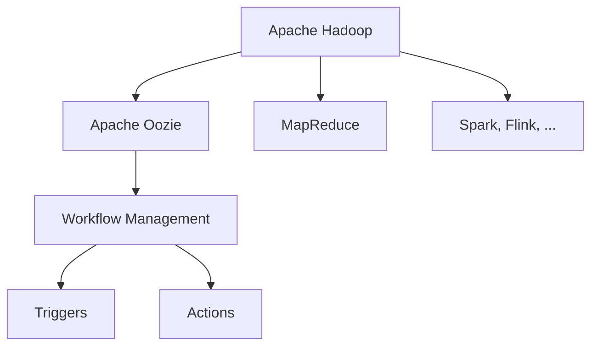

                 

# Oozie Coordinator原理与代码实例讲解

> 关键词：Apache Oozie, Apache Hadoop, Workflows, Workflow Management, Hadoop, MapReduce

## 1. 背景介绍

### 1.1 问题由来
在当今大数据时代，企业面临着海量数据的存储、处理和分析需求。Apache Hadoop作为一款开源的分布式计算框架，以其高可靠性、高扩展性、低成本等优势，广泛应用于数据密集型企业，成为大数据生态系统的核心组件。然而，在数据处理流程的协调和管理上，传统Hadoop系统仍存在诸多不便之处。

为了提高数据处理的自动化程度，减少人为干预，降低管理成本，Apache基金会于2007年启动了Oozie项目。Oozie是一款工作流管理系统，专门用于管理Apache Hadoop集群上的各种分布式计算任务。通过Oozie，用户可以构建复杂的、可重用的数据处理工作流，自动化地协调和管理Hadoop集群中的各类任务，大幅提升了数据处理的工作效率和可靠性。

### 1.2 问题核心关键点
Oozie的核心在于其工作流管理功能。工作流是由一系列任务组成的有向无环图，每个任务代表一个或多个MapReduce作业，通过定义任务之间的关系，形成一个完整的、可执行的数据处理流程。

Oozie的工作流调度器负责按照用户定义的任务关系，调度各个任务进行执行。在调度过程中，Oozie还提供了任务依赖关系管理、异常处理、监控告警等辅助功能，保障了数据处理过程的稳定性。

Oozie还支持多种数据源和目标，可以无缝连接企业内部数据仓库、外部云存储、ETL工具等，实现数据的全链路管理。

## 2. 核心概念与联系

### 2.1 核心概念概述

为更好地理解Oozie的工作流管理机制，本节将介绍几个核心概念：

- Apache Hadoop：Apache基金会开发的开源分布式计算框架，由HDFS、MapReduce等组件组成，支持海量数据的存储、处理和分析。

- Apache Oozie：Apache基金会开发的工作流管理系统，用于管理Hadoop集群中的各种分布式计算任务，通过构建复杂的工作流，实现数据处理的自动化和灵活化。

- Workflow Management：工作流管理，指对任务流程的自动化调度、监控和控制。通过定义任务的依赖关系，构建工作流，并使用调度器协调各个任务执行。

- Hadoop：虽然Hadoop是Oozie管理的主要对象，但其工作流管理系统也可应用于其他分布式计算框架，如Spark、Flink等。

- MapReduce：Hadoop的核心组件之一，一种简单的分布式计算模型，将任务分解为Map和Reduce两个阶段，支持大规模数据的并行处理。

- Triggers和Actions：Oozie提供的工作流组件，用于控制任务的执行时机和执行方式。

这些核心概念之间的逻辑关系可以通过以下Mermaid流程图来展示：



这个流程图展示了大数据生态系统中各组件之间的关系，以及Oozie在系统中的定位和功能。

## 3. 核心算法原理 & 具体操作步骤

### 3.1 算法原理概述

Oozie的工作流调度算法基于有向无环图（DAG）模型，通过构建任务之间的依赖关系，实现任务的自动化调度。其核心思想是：将数据处理任务按照依赖关系分组，每个任务组内包含多个MapReduce作业，通过调度器依次执行各个任务组，完成整个数据处理流程。

Oozie的调度器由多个组件组成，包括工作流执行器、任务调度器、任务状态监控器等，各组件协同工作，确保任务的正常执行。

### 3.2 算法步骤详解

Oozie的调度算法主要包括以下几个步骤：

**Step 1: 工作流构建**
- 根据任务需求，设计工作流并构建其依赖关系图。
- 在Oozie的用户界面或命令行工具中输入工作流定义文件，指定各个任务的输入输出依赖关系。

**Step 2: 任务调度**
- 调度器根据工作流定义文件，将任务按照依赖关系划分为多个任务组。
- 从第一个任务组开始，依次执行每个任务组中的所有MapReduce作业，直到所有任务执行完毕。

**Step 3: 任务执行**
- 任务执行器从Hadoop集群中获取任务数据，并将其分发到各个计算节点。
- 各个节点独立执行MapReduce作业，并将中间结果和最终结果返回到调度器。

**Step 4: 任务监控**
- 调度器实时监控任务的执行状态，并将状态信息更新到工作流日志中。
- 如果任务执行失败，调度器将自动进行异常处理，并通知用户。

**Step 5: 任务依赖关系管理**
- 调度器根据工作流定义文件，管理各个任务之间的依赖关系。
- 如果某个任务依赖的其他任务未完成，调度器将等待其完成再继续执行该任务。

### 3.3 算法优缺点

Oozie的工作流管理算法具有以下优点：
1. 自动化程度高。Oozie通过构建复杂的工作流，实现了任务的自动化执行，大大降低了人工干预。
2. 依赖关系管理严谨。通过定义任务的依赖关系，Oozie可以保证任务执行的有序性和可靠性。
3. 支持多种任务类型。Oozie可以管理MapReduce、Spark、Flink等多种分布式计算任务。
4. 灵活度高。用户可以根据实际需求，设计复杂的工作流，实现各种数据处理场景。

同时，该算法也存在一定的局限性：
1. 初始构建复杂。对于复杂的工作流，需要花费较多时间进行设计和构建。
2. 扩展性不足。对于大规模数据处理流程，Oozie可能面临性能瓶颈。
3. 监控和异常处理机制不够完善。在任务执行过程中，需要依赖用户自定义的监控脚本和异常处理脚本。

尽管存在这些局限性，但Oozie的工作流调度算法仍是大数据处理中的重要工具，能够显著提高数据处理的自动化程度，降低管理成本。

### 3.4 算法应用领域

Oozie的工作流调度算法主要应用于以下领域：

- 数据ETL（Extract, Transform, Load）：用于数据清洗、转换和加载过程的自动化管理，支持各种数据源和目标。
- 数据仓库构建：用于构建企业内部的数据仓库，实现数据的全链路管理。
- 大数据分析：用于自动化管理复杂的数据分析任务，支持多种数据分析工具。
- 实时数据处理：用于管理实时数据流的处理过程，支持流式计算框架。
- 数据备份和恢复：用于自动化管理数据的备份和恢复过程，确保数据安全。

## 4. 数学模型和公式 & 详细讲解 & 举例说明

### 4.1 数学模型构建

为了更好地理解Oozie的工作流调度算法，本节将通过数学语言进行更加严格的刻画。

记工作流为 $F$，其中包含 $N$ 个任务 $T=\{t_1, t_2, \cdots, t_N\}$，每个任务 $t_i$ 依赖于其前导任务 $t_j$（$i < j$）。工作流的依赖关系可以表示为一个有向无环图（DAG），其中节点表示任务，有向边表示依赖关系。

定义任务 $t_i$ 的执行时间为 $t_i$，则整个工作流的执行时间为 $\max\{t_1, t_2, \cdots, t_N\}$。任务 $t_i$ 的执行时间可以由其对应的MapReduce作业的时间复杂度来估计。

### 4.2 公式推导过程

在构建工作流后，Oozie的调度器需要对各个任务进行调度执行。假设当前执行的任务为 $t_i$，其前导任务为 $t_j$（$i < j$），则调度器需要满足以下条件：

1. $t_j$ 已经执行完成，即 $t_j$ 的执行时间为 $0$。
2. $t_i$ 的依赖关系已经满足，即 $t_i$ 的前导任务 $t_j$ 的执行时间为 $0$。

在满足以上条件后，调度器可以执行任务 $t_i$。任务 $t_i$ 的执行时间可以通过其对应的MapReduce作业时间复杂度来估计。

### 4.3 案例分析与讲解

以下以一个简单的数据ETL工作流为例，演示Oozie的调度算法：

1. 构建工作流：假设需要清洗、转换和加载两个数据集，构成一个复杂的数据ETL流程。
2. 定义任务依赖关系：设 $t_1$ 为数据清洗任务，$t_2$ 为数据转换任务，$t_3$ 为数据加载任务，其中 $t_2$ 依赖于 $t_1$，$t_3$ 依赖于 $t_2$。
3. 任务调度：从 $t_1$ 开始执行，$(t_1 \rightarrow t_2)$ 和 $(t_2 \rightarrow t_3)$ 依次执行，最后 $t_3$ 完成整个数据ETL流程。

在实际应用中，Oozie的工作流调度算法可以进一步优化。例如，当某个任务长时间占用计算资源时，调度器可以自动将其分配到其他计算节点，避免资源瓶颈。

## 5. 项目实践：代码实例和详细解释说明

### 5.1 开发环境搭建

在进行Oozie的实践开发前，我们需要准备好开发环境。以下是使用Java和Python进行Oozie开发的常见环境配置流程：

1. 安装JDK：确保Java开发环境配置正确，可以通过命令 `java -version` 检查JDK版本。
2. 安装Oozie：可以从Apache Hadoop官网下载安装包，解压后进入目录，执行 `bin/oozie-server.sh start` 启动Oozie服务器。
3. 配置Oozie：在 `$OOZIE_HOME/conf` 目录下，修改 `oozie-site.xml` 和 `hadoop-site.xml` 文件，配置Oozie和Hadoop环境变量。
4. 部署工作流：将工作流定义文件（如 `myflow.xml`）上传到Oozie服务器，执行 `oozie job submit -file myflow.xml` 提交工作流。

### 5.2 源代码详细实现

以下是一个简单的Java程序，用于定义Oozie工作流并提交到Oozie服务器：

```java
import org.apache.oozie.client.WorkflowJob;
import org.apache.oozie.client.OozieClient;
import org.apache.oozie.client.ReRun;

public class OozieFlowSubmitter {
    public static void main(String[] args) throws Exception {
        String workflowPath = "path/to/myflow.xml";
        String appPath = "path/to/myflow.jar";
        String workflowName = "myflow";
        String applicationName = "myapp";
        String flowXml = "myflow.xml";
        String jarPath = "path/to/myflow.jar";
        
        OozieClient oozieClient = new OozieClient("localhost:8443");
        WorkflowJob job = oozieClient.createAndSubmitApplication(appPath, jarPath, applicationName, flowXml, workflowName);
        ReRun.reRun(oozieClient, job.getRunId(), workflowPath);
    }
}
```

该程序通过OozieClient接口，向Oozie服务器提交了一个名为 `myflow.xml` 的工作流定义文件，指定了任务依赖关系和执行顺序。

### 5.3 代码解读与分析

让我们再详细解读一下关键代码的实现细节：

**OozieClient类**：
- 定义了与Oozie服务器通信的客户端，支持创建和提交任务、查询任务状态、删除任务等操作。

**提交任务**：
- 通过 `createAndSubmitApplication` 方法，将应用程序和任务定义文件提交到Oozie服务器。
- 返回的 `WorkflowJob` 对象包含了任务的ID和状态信息，可以通过其方法查询任务进度和结果。

**重跑任务**：
- 调用 `ReRun.reRun` 方法，指定任务ID和依赖文件路径，将任务重新提交到Oozie服务器执行。

### 5.4 运行结果展示

运行上述程序后，可以通过访问Oozie服务器的Web界面，查看任务的执行状态和结果。在任务完成后，Oozie服务器会生成详细的日志文件，记录任务的执行细节，便于用户分析和调试。

## 6. 实际应用场景

### 6.1 数据ETL

Oozie的工作流调度算法在数据ETL（Extract, Transform, Load）流程中得到了广泛应用。数据ETL是指从数据源中提取数据，经过清洗、转换和加载，存储到目标数据仓库的过程。传统的ETL流程需要手动编写脚本，配置和调度多个任务，工作量较大且易出错。

通过Oozie，用户可以定义复杂的数据ETL流程，自动调度和执行各个任务。Oozie还提供了数据监控和异常处理机制，确保数据处理过程的稳定性和可靠性。

### 6.2 数据仓库构建

企业内部通常需要使用大量的数据仓库进行数据分析和决策支持。数据仓库的构建过程涉及数据的清洗、转换和加载，任务众多且依赖关系复杂。Oozie的工作流调度算法可以用于自动化管理数据仓库的构建过程，提升数据处理的效率和准确性。

通过Oozie，用户可以定义数据仓库的构建流程，自动调度各个任务的执行，保障数据的一致性和完整性。同时，Oozie还支持多用户协作，多个用户可以共享同一工作流定义文件，协作构建数据仓库。

### 6.3 大数据分析

在数据分析过程中，用户需要执行多个复杂的MapReduce作业，涉及数据的清洗、转换、计算和分析。传统的作业调度需要手动编写脚本，配置和执行各个任务，工作量大且易出错。

通过Oozie，用户可以定义复杂的大数据分析流程，自动调度和执行各个任务。Oozie还支持实时数据分析，支持流式计算框架，能够处理实时数据流，实现数据的实时分析和处理。

### 6.4 未来应用展望

随着数据处理需求的不断增长，Oozie的工作流调度算法将在更多领域得到应用，为企业的数字化转型提供新的技术支持。

在智慧城市治理中，Oozie可以用于自动化管理城市事件监测、舆情分析、应急指挥等环节，提升城市管理的自动化和智能化水平。

在智能制造中，Oozie可以用于自动化管理生产流程、设备维护和质量控制，实现生产过程的可视化、自动化和智能化。

在智慧医疗中，Oozie可以用于自动化管理患者数据、医疗记录和医疗设备，实现医疗数据的全面管理和分析。

除此之外，在智能交通、金融风控、物联网等多个领域，Oozie的工作流调度算法也将得到广泛应用，为传统行业数字化升级提供新的技术手段。

## 7. 工具和资源推荐

### 7.1 学习资源推荐

为了帮助开发者系统掌握Oozie的原理和应用，这里推荐一些优质的学习资源：

1. Apache Oozie官方文档：详细介绍了Oozie的工作流调度算法和使用方法，是学习Oozie的最佳起点。
2. 《Apache Oozie实战指南》：一本面向实践的Oozie教程，通过大量示例代码和实际案例，帮助用户快速上手Oozie。
3. Oozie Cookbook：一个Oozie的代码库，提供了多种工作流定义和任务调度示例，帮助用户构建复杂的工作流。
4. Apache Hadoop官方博客：定期发布Hadoop生态系统的最新动态和技术文章，涵盖Oozie的最新进展和最佳实践。

通过这些资源的学习实践，相信你一定能够快速掌握Oozie的精髓，并用于解决实际的数据处理问题。

### 7.2 开发工具推荐

高效的开发离不开优秀的工具支持。以下是几款用于Oozie开发的常用工具：

1. Eclipse：一个功能强大的Java开发环境，支持Java和XML的混合编辑，适合Oozie工作流定义文件的开发。
2. IntelliJ IDEA：一个Java开发工具，支持代码高亮、自动补全、代码重构等功能，适合Java代码的开发。
3. Git：版本控制工具，支持多人协作开发，适合团队合作进行Oozie工作流的开发和部署。
4. Jenkins：一个开源的自动化服务器，支持自动构建、测试和部署，适合Oozie工作流的自动化调度。
5. Zookeeper：一个分布式协调服务，支持任务依赖关系的管理和监控，适合Oozie工作流的执行环境。

合理利用这些工具，可以显著提升Oozie开发和部署的效率，加快创新迭代的步伐。

### 7.3 相关论文推荐

Oozie的工作流调度算法已经成为大数据生态系统中的重要技术之一。以下是几篇奠基性的相关论文，推荐阅读：

1. "Workflow Management in Apache Oozie"：介绍了Oozie的工作流管理算法和实现机制，详细说明了Oozie的工作流构建和调度过程。
2. "Scalable Workflow Management in Apache Hadoop"：探讨了如何在大数据集群中高效管理工作流，提出了一种基于DAG的任务调度算法，提升了Oozie的工作流调度效率。
3. "A Survey of Workflow Management Systems"：综述了各类工作流管理系统，包括Oozie在内，分析了各种系统的特点和优势，为读者提供了全面的技术参考。

这些论文代表了大数据工作流管理技术的发展脉络，通过学习这些前沿成果，可以帮助研究者把握学科前进方向，激发更多的创新灵感。

## 8. 总结：未来发展趋势与挑战

### 8.1 总结

本文对Oozie的工作流调度算法进行了全面系统的介绍。首先阐述了Oozie的背景和应用场景，明确了工作流调度算法的核心思想和实现机制。其次，通过数学语言和实际案例，详细讲解了Oozie的数学模型和具体操作步骤。同时，本文还广泛探讨了Oozie在企业数据处理和智慧城市治理等领域的实际应用，展示了工作流调度算法的巨大潜力。此外，本文精选了Oozie的相关学习资源和开发工具，力求为读者提供全方位的技术指引。

通过本文的系统梳理，可以看到，Oozie的工作流调度算法已经成为大数据处理中的重要工具，极大地提高了数据处理的自动化程度，降低了管理成本。未来，伴随Hadoop生态系统的不断演进，Oozie必将在更多场景下发挥其独特优势，成为大数据生态系统中的核心组件。

### 8.2 未来发展趋势

展望未来，Oozie的工作流调度算法将呈现以下几个发展趋势：

1. 自动化程度更高。未来Oozie将进一步提升自动化水平，自动生成任务依赖关系，实现工作流的智能化管理。
2. 性能优化。随着数据量的增长，Oozie的工作流调度算法需要应对更高的数据吞吐量和处理速度，未来将引入更多高效的调度策略和算法。
3. 支持更多任务类型。Oozie将支持更多分布式计算框架，如Spark、Flink等，实现更多类型的数据处理任务。
4. 实时处理能力增强。未来Oozie将支持流式计算框架，实现实时数据处理和分析。
5. 集成更多功能。Oozie将集成更多的监控、告警和异常处理机制，提升任务执行的可靠性和稳定性。

以上趋势凸显了Oozie在大数据处理中的重要地位，预示着其在数据处理和智慧城市治理等领域的广泛应用前景。

### 8.3 面临的挑战

尽管Oozie的工作流调度算法已经取得了显著成果，但在迈向更加智能化、普适化应用的过程中，仍面临诸多挑战：

1. 工作流构建复杂。对于复杂的数据处理流程，需要花费较多时间进行设计和构建，增加了用户的使用成本。
2. 性能瓶颈。对于大规模数据处理流程，Oozie可能面临性能瓶颈，需要引入更多高效的任务调度算法和优化策略。
3. 监控和异常处理机制不足。在任务执行过程中，依赖用户自定义的监控脚本和异常处理脚本，不够灵活和全面。
4. 扩展性不足。对于大集群环境，Oozie的扩展性仍需进一步优化。

尽管存在这些挑战，但Oozie的工作流调度算法仍是大数据处理中的重要工具，能够显著提高数据处理的自动化程度，降低管理成本。未来，通过不断优化和扩展，Oozie必将在更多场景下发挥其独特优势，成为大数据生态系统中的核心组件。

### 8.4 研究展望

面向未来，Oozie的研究方向主要包括以下几个方面：

1. 引入更多智能调度策略。通过引入智能调度和优化算法，提升Oozie的工作流调度效率和性能。
2. 扩展支持更多任务类型。引入更多分布式计算框架的支持，实现更多类型的数据处理任务。
3. 支持实时处理和流式计算。引入实时处理和流式计算机制，实现数据的实时分析和处理。
4. 强化监控和异常处理机制。引入更多的监控、告警和异常处理机制，提升任务执行的可靠性和稳定性。
5. 增强灵活性。引入更多的任务依赖关系管理和调度优化策略，提升Oozie的灵活性和可扩展性。

这些研究方向将推动Oozie不断演进，适应更多的数据处理场景，提升其在大数据生态系统中的地位和作用。

## 9. 附录：常见问题与解答

**Q1：如何提高Oozie的工作流调度效率？**

A: 提高Oozie的工作流调度效率可以从以下几个方面入手：
1. 优化任务依赖关系。尽量避免复杂的依赖关系，使用并行调度策略，提升任务执行的并行度。
2. 优化任务执行顺序。根据任务的计算复杂度和资源需求，调整任务的执行顺序，优化资源分配。
3. 引入任务重试机制。对于执行失败的任务，自动进行重试，避免因任务失败导致的整体调度效率下降。
4. 引入任务优先级机制。根据任务的重要性和紧急程度，设置任务优先级，提升关键任务的执行效率。

**Q2：如何处理Oozie中的异常情况？**

A: Oozie中的异常情况通常包括任务失败、依赖任务未完成、资源不足等。处理这些异常情况的方法包括：
1. 监控任务状态。通过Oozie的Web界面或API，实时监控任务的执行状态，及时发现异常情况。
2. 异常处理脚本。通过编写自定义的异常处理脚本，自动进行异常处理，如任务重试、资源调度等。
3. 日志记录。通过Oozie的日志系统，记录任务的执行过程和异常情况，便于分析和调试。
4. 通知机制。通过设置任务执行的告警机制，自动通知相关人员处理异常情况。

**Q3：Oozie支持哪些数据源和目标？**

A: Oozie支持多种数据源和目标，包括但不限于：
1. HDFS：Apache Hadoop的分布式文件系统，支持海量数据的存储和访问。
2. S3：Amazon Web Services的云存储服务，支持大规模数据的存储和访问。
3. Hive：Apache Hive的元数据管理工具，支持数据的元数据管理和查询。
4. Spark：Apache Spark的分布式计算框架，支持复杂的数据处理任务。
5. MySQL、PostgreSQL：关系型数据库，支持结构化数据的存储和查询。
6. Kafka：Apache Kafka的分布式消息队列，支持实时数据的接收和处理。

通过灵活配置数据源和目标，Oozie可以无缝连接企业内部和外部的各种数据源，实现数据的全链路管理。

**Q4：Oozie在生产环境中的最佳实践是什么？**

A: 在生产环境中，Oozie的最佳实践包括以下几个方面：
1. 使用高可用性部署。使用多节点部署，确保Oozie服务的可用性和稳定性。
2. 配置合理的资源。根据数据处理任务的规模和复杂度，合理配置CPU、内存和存储资源，避免资源瓶颈。
3. 定期备份和监控。定期备份Oozie的工作流定义文件和配置文件，实时监控服务状态，确保系统安全。
4. 引入自动扩展机制。根据任务执行情况，自动扩展或缩小集群规模，避免资源浪费。
5. 使用企业级监控工具。引入第三方监控工具，如Nagios、Zabbix等，实时监控Oozie服务的状态和性能。

通过以上最佳实践，可以确保Oozie在生产环境中的稳定性和可靠性，实现高效的数据处理任务调度。

---

作者：禅与计算机程序设计艺术 / Zen and the Art of Computer Programming

