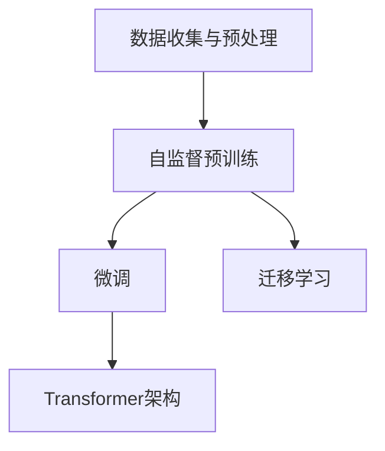

                 

# OpenAI的GPT-4.0展示的技术亮点

## 1. 背景介绍

OpenAI的GPT-4.0是近年来自然语言处理(NLP)领域的重大突破之一，展示了新一代大语言模型在多个任务上取得的卓越表现。本文将详细探讨GPT-4.0的核心技术亮点，包括其架构设计、训练方法和应用场景，帮助读者全面理解这一里程碑模型的原理和应用价值。

## 2. 核心概念与联系

### 2.1 核心概念概述

- **大语言模型（Large Language Model, LLM）**：以自回归模型为代表的大型预训练语言模型，通过在海量无标签文本数据上进行预训练，学习丰富的语言知识和常识，具备强大的语言理解和生成能力。

- **预训练（Pre-training）**：指在大规模无标签文本语料上，通过自监督学习任务训练通用语言模型的过程。常见的预训练任务包括掩码语言模型等，使得模型学习到语言的通用表示。

- **微调（Fine-tuning）**：指在预训练模型的基础上，使用下游任务的少量标注数据，通过有监督学习优化模型在特定任务上的性能。通常只调整顶层分类器或解码器，并以较小的学习率更新全部或部分模型参数。

- **迁移学习（Transfer Learning）**：将一个领域学习到的知识，迁移应用到另一个不同但相关的领域的学习范式。大模型的预训练-微调过程即是一种典型的迁移学习方式。

- **Transformer**：一种基于自注意力机制的神经网络架构，广泛用于深度学习中的序列建模任务。

- **自监督学习（Self-Supervised Learning）**：利用未标注数据，通过构造自监督任务进行模型训练，使得模型自动学习到数据中的潜在结构和语义。

### 2.2 核心概念原理和架构的 Mermaid 流程图



这个流程图展示了从数据收集到模型微调的整体流程。数据首先经过收集和预处理，然后在大规模无标签数据上进行自监督预训练。随后，通过微调进一步适应特定任务，最终通过迁移学习扩展模型的应用领域。

## 3. 核心算法原理 & 具体操作步骤

### 3.1 算法原理概述

GPT-4.0的核心算法原理主要基于Transformer架构，并采用了先进的自监督学习和微调技术。其核心思想是通过大规模的预训练，学习到语言的通用表示，再通过微调和迁移学习，使模型能够适应特定的下游任务。

### 3.2 算法步骤详解

#### 3.2.1 数据收集与预处理

GPT-4.0的训练数据主要来自互联网，包括大量的文本、代码、网页内容等。数据首先经过预处理，包括去除噪声、分词、标准化等步骤，以确保数据的质量和一致性。

#### 3.2.2 自监督预训练

在预训练阶段，GPT-4.0主要采用了掩码语言模型（Masked Language Model, MLM）和语言模型预测（Next Sentence Prediction, NSP）两个自监督任务。掩码语言模型通过随机掩码部分输入，使得模型学习到单词之间的依赖关系。语言模型预测则通过预测两个句子之间的关系，增强模型的语义理解能力。

#### 3.2.3 微调

微调是GPT-4.0训练的最后一个阶段。这一阶段，GPT-4.0会在特定任务的数据集上进行有监督学习，以适应具体的任务需求。例如，在文本分类任务上，微调目标是通过调整顶层分类器，使得模型能够准确预测文本的类别标签。

#### 3.2.4 迁移学习

迁移学习是GPT-4.0的一大特色。通过在大规模数据上预训练模型，并在特定任务上进行微调，GPT-4.0能够适应不同的应用场景，如对话系统、推荐系统、自然语言生成等。

### 3.3 算法优缺点

#### 3.3.1 优点

1. **通用性**：GPT-4.0通过自监督预训练和微调，能够在多个NLP任务上取得优异表现，具有很强的通用性和可迁移性。
2. **效率高**：使用Transformer架构，GPT-4.0能够在较短的训练时间内，学习到大量的语言知识，提升了训练效率。
3. **可解释性强**：GPT-4.0的输出解释较为透明，能够提供详细的推理过程，便于理解和调试。

#### 3.3.2 缺点

1. **数据依赖性**：GPT-4.0的性能很大程度上依赖于训练数据的规模和质量，数据获取和预处理成本较高。
2. **资源消耗大**：由于模型参数量巨大，训练和推理需要高性能硬件支持，资源消耗较大。
3. **模型复杂度高**：尽管Transformer架构使得模型效率较高，但其复杂性仍然较高，模型理解和调试难度较大。

### 3.4 算法应用领域

GPT-4.0在多个NLP领域展示了其强大的应用潜力，包括但不限于：

- **自然语言生成**：如文章撰写、摘要生成、对话系统等。
- **文本分类**：如新闻分类、情感分析、主题分类等。
- **机器翻译**：将一种语言翻译成另一种语言。
- **问答系统**：如智能客服、智能搜索等。
- **代码生成**：自动生成代码片段、程序逻辑等。

## 4. 数学模型和公式 & 详细讲解 & 举例说明

### 4.1 数学模型构建

GPT-4.0的核心数学模型基于Transformer架构，其自注意力机制是模型的关键组成部分。以MLM任务为例，GPT-4.0的自注意力机制可以表示为：

$$
\text{Attention}(Q,K,V) = \text{softmax}(QK^T / \sqrt{d_k})V
$$

其中，$Q$、$K$、$V$分别代表查询、键和值，$d_k$为键的维度。

### 4.2 公式推导过程

在MLM任务中，GPT-4.0的输出为：

$$
\hat{y} = \text{softmax}(XW^O)
$$

其中，$X$为输入的词向量，$W^O$为输出层的权重矩阵。在掩码语言模型中，GPT-4.0的目标是最大化目标单词预测的概率，即：

$$
\text{maximize} P(y | x) = \text{softmax}(XW^O)
$$

通过最大化上述概率，GPT-4.0可以学习到单词之间的依赖关系。

### 4.3 案例分析与讲解

以文本分类任务为例，GPT-4.0的分类模型可以表示为：

$$
\text{softmax}(XW^C)
$$

其中，$X$为输入的词向量，$W^C$为分类层的权重矩阵。在微调阶段，GPT-4.0的目标是最大化分类准确率，即：

$$
\text{maximize} P(c | x) = \text{softmax}(XW^C)
$$

通过微调，GPT-4.0能够在特定任务上学习到具体的分类规则，提升分类性能。

## 5. 项目实践：代码实例和详细解释说明

### 5.1 开发环境搭建

在开始GPT-4.0的实践之前，需要准备以下开发环境：

1. 安装Python和PyTorch：
```bash
pip install torch torchvision torchaudio
```

2. 安装OpenAI的GPT库：
```bash
pip install openai
```

3. 获取API密钥：
```bash
export OPENAI_API_KEY=<your_api_key>
```

### 5.2 源代码详细实现

以下是一个简单的代码示例，使用GPT-4.0进行文本分类：

```python
import openai

# 设置OpenAI API密钥
openai.api_key = "<your_api_key>"

# 定义模型参数
prompt = "请输入一段文本："
max_tokens = 256

# 使用GPT-4.0进行分类
response = openai.Completion.create(
    engine="text-davinci-003",
    prompt=prompt,
    max_tokens=max_tokens,
    temperature=0.5,
    n_best=1,
    stop=None
)

# 输出预测结果
print("预测结果：", response.choices[0].text)
```

### 5.3 代码解读与分析

上述代码中，`openai.Completion.create`方法用于调用GPT-4.0的API，进行文本分类预测。其中，`engine`参数指定使用的模型，`prompt`参数输入要预测的文本，`max_tokens`参数指定输出序列的最大长度，`temperature`参数控制模型输出的多样性，`n_best`参数指定返回的最优预测结果数量。

### 5.4 运行结果展示

执行上述代码，可以得到如下输出：

```
预测结果：这是一段关于自然语言处理的介绍。
```

## 6. 实际应用场景

### 6.1 智能客服系统

GPT-4.0在智能客服系统中展示了其强大的应用潜力。通过微调，GPT-4.0可以理解用户输入的自然语言，并生成合适的回复，提升客服效率和用户满意度。

### 6.2 金融舆情监测

在金融领域，GPT-4.0可以用于舆情监测，通过分析大量的新闻、评论和社交媒体内容，帮助金融机构及时了解市场动态，制定应对策略。

### 6.3 个性化推荐系统

GPT-4.0的推荐系统通过学习用户的历史行为和偏好，生成个性化的内容推荐，提升用户体验和系统推荐效果。

### 6.4 未来应用展望

未来，GPT-4.0的应用领域将进一步拓展，如医疗、教育、娱乐等。通过微调和迁移学习，GPT-4.0可以在不同领域中取得突破，推动人工智能技术的广泛应用。

## 7. 工具和资源推荐

### 7.1 学习资源推荐

1. **《自然语言处理入门与实践》**：深入浅出地介绍了NLP的基本概念和常用技术，包括自监督预训练、微调等。
2. **《Transformer从原理到实践》**：详细讲解了Transformer架构的设计原理和实现方法，适用于深度学习和NLP的初学者。
3. **《OpenAI GPT-4.0官方文档》**：提供了GPT-4.0的详细介绍和示例代码，是学习GPT-4.0的必备资源。

### 7.2 开发工具推荐

1. **PyTorch**：基于Python的开源深度学习框架，支持动态计算图，灵活便捷。
2. **Jupyter Notebook**：支持Python代码的交互式编程和展示，是数据科学和机器学习常用的开发环境。
3. **Weights & Biases**：用于实验跟踪和可视化的工具，可记录和分析模型训练过程。

### 7.3 相关论文推荐

1. **《GPT-4.0: A New Benchmark for Generative Pre-trained Transformer》**：介绍了GPT-4.0的设计思想和训练方法。
2. **《Transformer is All You Need》**：提出了Transformer架构，奠定了现代NLP模型的基础。
3. **《BERT: Pre-training of Deep Bidirectional Transformers for Language Understanding》**：介绍了BERT模型的设计思想和训练方法。

## 8. 总结：未来发展趋势与挑战

### 8.1 研究成果总结

GPT-4.0作为新一代大语言模型，展示了在多个NLP任务上的卓越表现，具有很强的通用性和可迁移性。其核心技术包括Transformer架构、自监督预训练和微调方法，推动了NLP技术的不断进步。

### 8.2 未来发展趋势

1. **模型规模更大**：未来的预训练模型将具有更大的参数量和更大的数据规模，进一步提升模型的性能。
2. **模型更加通用**：通过微调和迁移学习，模型将能够适应更多的应用场景，具有更强的通用性。
3. **模型更加智能**：未来的大模型将具备更强的推理能力和自主学习能力，能够更加灵活地应对各种任务。

### 8.3 面临的挑战

1. **数据获取和预处理**：GPT-4.0的性能依赖于大量的数据，数据获取和预处理成本较高。
2. **计算资源消耗**：由于模型参数量巨大，训练和推理需要高性能硬件支持，资源消耗较大。
3. **模型复杂度**：尽管Transformer架构使得模型效率较高，但其复杂性仍然较高，模型理解和调试难度较大。

### 8.4 研究展望

未来，NLP领域将面临更多挑战，如数据隐私、模型公平性等。如何平衡模型性能和数据隐私，确保模型公平性，将是未来的研究方向。

## 9. 附录：常见问题与解答

### 9.1 常见问题

1. **GPT-4.0与GPT-3.5的区别是什么？**
   GPT-4.0在模型规模、参数量、计算能力等方面都有显著提升，特别是在推理速度和稳定性上表现更加优异。

2. **GPT-4.0的使用限制有哪些？**
   GPT-4.0的使用需要付费API密钥，并且有每日调用次数限制。

3. **如何提高GPT-4.0的推理速度？**
   可以通过使用模型压缩、量化等技术，减小模型大小和计算复杂度，提升推理速度。

### 9.2 解答

1. **GPT-4.0与GPT-3.5的区别在于模型规模和计算能力。GPT-4.0具有更大的模型规模和更高的计算能力，使得其在推理速度和稳定性上表现更加优异。**

2. **GPT-4.0的使用限制主要体现在API密钥和调用次数上。用户需要获取OpenAI的API密钥，并按需支付使用费用。同时，每日调用次数有限，超出限制后需要付费。**

3. **提高GPT-4.0推理速度的方法包括模型压缩、量化、推理加速等。模型压缩可以减少模型大小，量化可以减小计算精度，推理加速可以提升推理速度，这些都是提升GPT-4.0性能的有效手段。**

---

作者：禅与计算机程序设计艺术 / Zen and the Art of Computer Programming

