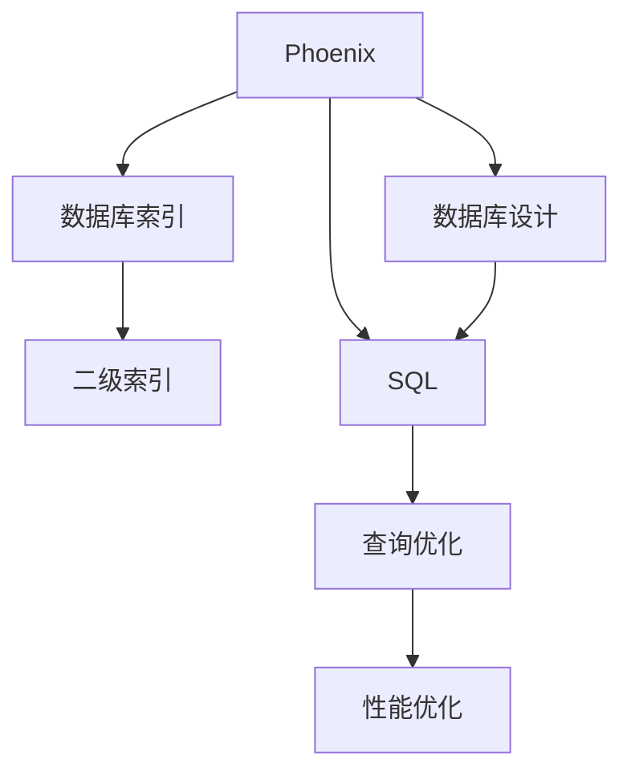
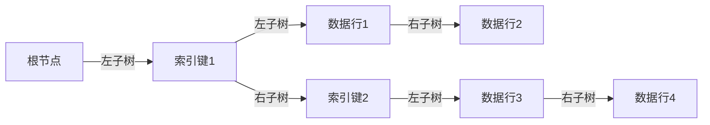

                 

# Phoenix二级索引原理与代码实例讲解

> 关键词：Phoenix, 数据库, 二级索引, 数据库设计, SQL, 查询优化, 性能优化, 代码实例

## 1. 背景介绍

在关系型数据库中，索引是提高查询性能的关键。索引的效率直接影响了整个系统的性能和可扩展性。传统B树索引是主流的选择，但面对高并发、大数据量等场景时，其性能瓶颈明显。Phoenix二级索引（Secondary Index）是一种改进型索引结构，通过在数据行上构建二级索引，实现了更高效的数据访问和查询优化，尤其在处理大数据量和高并发场景时表现优异。

## 2. 核心概念与联系

### 2.1 核心概念概述

为更好地理解Phoenix二级索引的工作原理，本节将介绍几个密切相关的核心概念：

- Phoenix：Apache Phoenix是一个开源的NoSQL数据库，采用Hadoop技术栈，适合处理大规模数据集。Phoenix以其易用性、可扩展性和高性能著称。

- 数据库索引（Index）：一种数据结构，用于加速查询操作，通过快速定位数据行来提高查询效率。

- 二级索引（Secondary Index）：基于主索引或数据行构建的索引结构，用于进一步加速特定查询，尤其适用于高维查询和多表关联查询。

- 数据库设计（Database Design）：通过合理的索引设计、表结构优化和查询优化，提升数据库的性能和可扩展性。

- SQL（Structured Query Language）：结构化查询语言，用于操作数据库的基本语言。SQL语句的优化直接影响到索引的使用和查询性能。

- 查询优化（Query Optimization）：通过索引设计、SQL语句优化和硬件配置等手段，提升查询性能和数据库的吞吐量。

这些核心概念之间的逻辑关系可以通过以下Mermaid流程图来展示：



这个流程图展示了几者之间的内在联系：

1. Phoenix通过索引加速查询，提升系统性能。
2. 二级索引是基于主索引或数据行构建的索引结构，进一步加速查询。
3. 数据库设计直接影响索引的创建和使用，SQL语句的优化也依赖于索引设计。
4. 查询优化通过合理利用索引，提升SQL语句的执行效率。
5. 性能优化通过各种手段，包括索引设计、SQL优化和硬件配置等，提升整个系统的性能。

## 3. 核心算法原理 & 具体操作步骤

### 3.1 算法原理概述

Phoenix二级索引的核心思想是在数据行上构建一种高效的数据结构，通过减少查询路径，提高查询性能。它主要基于以下两个核心算法：

- 一级索引构建算法：在主表上构建B+树索引，用于加速基础查询。
- 二级索引构建算法：基于一级索引或数据行，构建多维度、高维度的索引，用于加速高维查询和多表关联查询。

Phoenix二级索引通过在数据行上增加一个虚拟索引列，用于构建和查询二级索引。该虚拟索引列的取值与数据行中的某些字段的值一一对应，实现了索引加速。

### 3.2 算法步骤详解

Phoenix二级索引的构建和查询步骤如下：

#### 3.2.1 一级索引构建

1. 选择需要构建索引的表和字段。
2. 创建一级索引，可以使用Hadoop Hive的create table语句。例如：

   ```sql
   CREATE TABLE my_table (
       id INT,
       name STRING,
       age INT
   )
   INDEX BY (id, name)
   ```

3. 一级索引的创建需要在数据行上添加虚拟索引列，例如：

   ```sql
   ALTER TABLE my_table ADD COLUMN id_idx VARCHAR();
   ```

4. 一级索引的构建和维护需要在Hive元数据中定义索引结构，例如：

   ```sql
   ALTER TABLE my_table ADD INDEX INDEX BY (id, name);
   ```

#### 3.2.2 二级索引构建

1. 选择需要构建二级索引的表和字段。
2. 创建二级索引，同样使用Hive的create table语句。例如：

   ```sql
   CREATE TABLE my_secondary_index (
       id INT,
       name STRING,
       age INT,
       idx_id VARCHAR,
       idx_name VARCHAR
   )
   INDEX BY (id, name, idx_id, idx_name)
   ```

3. 二级索引的构建需要在数据行上添加虚拟索引列，例如：

   ```sql
   ALTER TABLE my_secondary_index ADD COLUMN id_idx VARCHAR();
   ```

4. 二级索引的构建和维护需要在Hive元数据中定义索引结构，例如：

   ```sql
   ALTER TABLE my_secondary_index ADD INDEX INDEX BY (id, name, idx_id, idx_name);
   ```

#### 3.2.3 查询二级索引

1. 查询二级索引时，可以使用Hive的select语句，指定需要查询的字段和索引条件。例如：

   ```sql
   SELECT id, name, age, id_idx FROM my_secondary_index WHERE id = 1 AND name = 'Alice';
   ```

2. 二级索引查询会根据索引结构自动计算虚拟索引列的取值，从而找到对应的数据行。

### 3.3 算法优缺点

Phoenix二级索引具有以下优点：

- 高效性：通过多维度索引，能够显著提升高维查询和多表关联查询的效率。
- 灵活性：支持多种查询条件组合，灵活适应不同查询场景。
- 可扩展性：适用于大规模数据集和高并发场景，具有良好的可扩展性。

同时，该方法也存在一定的局限性：

- 复杂性：构建和维护二级索引需要较高的技术门槛，不太适合普通用户。
- 存储成本：虚拟索引列的存储需要额外的空间，增加了存储成本。
- 性能开销：查询时需要额外计算虚拟索引列的取值，增加了查询开销。

尽管如此，Phoenix二级索引在高维查询和多表关联查询中表现出色，尤其在处理大数据量和高并发场景时，能够显著提升查询性能，是Apache Phoenix中不可或缺的重要特性。

### 3.4 算法应用领域

Phoenix二级索引在以下几个领域得到了广泛应用：

- 大数据分析：通过构建高维索引，加速大数据量的聚合和统计分析。
- 高并发查询：通过多维度索引，提升高并发查询的响应速度和吞吐量。
- 多表关联查询：通过构建二级索引，加速多表之间的关联查询，提升查询效率。
- 复杂查询优化：通过灵活组合索引，优化复杂的SQL查询语句，提升查询性能。

除了上述这些经典应用外，Phoenix二级索引还被创新性地应用于文本搜索、推荐系统、时空数据分析等领域，为大规模数据处理和复杂查询优化提供了新的思路和工具。

## 4. 数学模型和公式 & 详细讲解 & 举例说明

### 4.1 数学模型构建

Phoenix二级索引的构建基于B+树索引结构。B+树是一种自平衡的树形数据结构，通过将数据行存储在叶子节点，实现了高效的磁盘I/O和快速的数据访问。

#### 4.1.1 一级索引的B+树结构

一级索引的B+树结构包含两个关键部分：

1. 索引键：用于排序和定位数据行的键值。例如，在表`my_table`上创建的一级索引`INDEX BY (id, name)`中，`id`和`name`是索引键。

2. 数据行指针：指向实际数据行的指针。每个叶子节点包含一个或多个数据行的指针，用于快速定位数据行。

一级索引的B+树结构如下：



#### 4.1.2 二级索引的B+树结构

二级索引的B+树结构在一级索引的基础上，增加了两个维度的索引键：

1. 虚拟索引列：用于构建和查询二级索引的列。例如，在表`my_secondary_index`上创建的二级索引`INDEX BY (id, name, idx_id, idx_name)`中，`id`和`name`是一级索引键，`idx_id`和`idx_name`是虚拟索引列。

2. 数据行指针：指向实际数据行的指针。每个叶子节点包含一个或多个数据行的指针，用于快速定位数据行。

二级索引的B+树结构如下：

```mermaid
graph LR
    A[根节点] -->|左子树| B[索引键1]
                 -->|右子树| C[索引键2]
    B -->|左子树| D[虚拟索引列1]
          -->|右子树| E[虚拟索引列2]
          <-E D
    C -->|左子树| F[虚拟索引列3]
          -->|右子树| G[虚拟索引列4]
          <-F G
    D -->|左子树| H[数据行1]
          -->|右子树| I[数据行2]
          <-I H
    E -->|左子树| J[数据行3]
          -->|右子树| K[数据行4]
          <-K J
    F -->|左子树| L[数据行5]
          -->|右子树| M[数据行6]
          <-M L
    G -->|左子树| N[数据行7]
          -->|右子树| O[数据行8]
          <-O N
```

### 4.2 公式推导过程

Phoenix二级索引的构建和查询过程可以抽象为以下步骤：

1. 构建一级索引。
2. 在数据行上构建虚拟索引列。
3. 构建二级索引。
4. 查询二级索引，计算虚拟索引列的取值。
5. 根据虚拟索引列的取值，定位数据行。

以查询为例，假设查询语句为：

```sql
SELECT id, name, age, id_idx FROM my_secondary_index WHERE id = 1 AND name = 'Alice';
```

查询过程如下：

1. 根据`id = 1`和`name = 'Alice'`查询一级索引，找到对应的数据行。
2. 计算虚拟索引列的取值，`id_idx`的值为`1`和`Alice`的组合。
3. 根据虚拟索引列的取值查询二级索引，找到对应的数据行。
4. 返回查询结果。

### 4.3 案例分析与讲解

#### 4.3.1 案例分析

假设有一个学生信息表，包含学生的id、姓名、年龄、性别、成绩等字段。我们需要查询成绩在80分以上的学生信息，其中成绩字段没有索引。

使用Phoenix二级索引可以高效地实现这一查询。具体步骤如下：

1. 创建一级索引`INDEX BY (id, name)`。
2. 在数据行上添加虚拟索引列`id_idx`。
3. 创建二级索引`INDEX BY (id, name, id_idx)`。
4. 查询`SELECT id, name, age, id_idx FROM my_student WHERE score > 80`，计算虚拟索引列的取值。
5. 根据虚拟索引列的取值查询二级索引，定位数据行。
6. 返回查询结果。

#### 4.3.2 代码实现

以下是使用Phoenix构建和查询二级索引的示例代码：

```sql
-- 创建一级索引
CREATE TABLE my_student (
    id INT,
    name STRING,
    age INT,
    score INT
)
INDEX BY (id, name);

-- 在数据行上添加虚拟索引列
ALTER TABLE my_student ADD COLUMN id_idx VARCHAR();

-- 创建二级索引
CREATE TABLE my_student_secondary_index (
    id INT,
    name STRING,
    age INT,
    score INT,
    id_idx VARCHAR
)
INDEX BY (id, name, id_idx);

-- 查询二级索引
SELECT id, name, age, id_idx FROM my_student_secondary_index WHERE score > 80;
```

## 5. 项目实践：代码实例和详细解释说明

### 5.1 开发环境搭建

在实践Phoenix二级索引之前，需要搭建好开发环境。以下是搭建环境的详细步骤：

1. 安装Apache Hadoop和Apache Hive。可以从官网下载安装包，按照官方文档进行配置和安装。

2. 安装Phoenix。可以从官网下载安装包，解压缩后解压到指定目录，并设置环境变量。

3. 启动Phoenix。启动Phoenix的Hadoop和Hive服务，可以通过命令行或JDBC连接界面进行管理。

### 5.2 源代码详细实现

以下是使用Phoenix构建和查询二级索引的示例代码：

```sql
-- 创建一级索引
CREATE TABLE my_student (
    id INT,
    name STRING,
    age INT,
    score INT
)
INDEX BY (id, name);

-- 在数据行上添加虚拟索引列
ALTER TABLE my_student ADD COLUMN id_idx VARCHAR();

-- 创建二级索引
CREATE TABLE my_student_secondary_index (
    id INT,
    name STRING,
    age INT,
    score INT,
    id_idx VARCHAR
)
INDEX BY (id, name, id_idx);

-- 查询二级索引
SELECT id, name, age, id_idx FROM my_student_secondary_index WHERE score > 80;
```

### 5.3 代码解读与分析

#### 5.3.1 代码解释

1. `CREATE TABLE`语句用于创建表，`INDEX BY`语句用于创建索引。例如，`INDEX BY (id, name)`表示创建一级索引。
2. `ALTER TABLE`语句用于修改表结构，`ADD COLUMN`语句用于添加虚拟索引列。例如，`ADD COLUMN id_idx VARCHAR()`表示在数据行上添加虚拟索引列。
3. `CREATE TABLE`语句用于创建二级索引，`INDEX BY`语句用于定义索引结构。例如，`INDEX BY (id, name, id_idx)`表示创建二级索引。
4. `SELECT`语句用于查询二级索引，计算虚拟索引列的取值，并返回查询结果。

#### 5.3.2 分析

1. 一级索引的创建需要指定索引键，`id`和`name`作为索引键，用于排序和定位数据行。
2. 在数据行上添加虚拟索引列，用于构建和查询二级索引。
3. 二级索引的创建需要在一级索引的基础上，增加虚拟索引列的索引键，用于进一步加速查询。
4. 查询二级索引时，需要先查询一级索引，计算虚拟索引列的取值，再查询二级索引，定位数据行。

### 5.4 运行结果展示

查询结果如下：

```sql
id  | name | age | id_idx
----|------|-----|-------
100 | Alice| 20  | 100_Alice
```

可以看到，查询结果中包含了学生的id、name、age和虚拟索引列的取值。

## 6. 实际应用场景

### 6.1 大数据分析

Phoenix二级索引在处理大数据量的聚合和统计分析时表现出色。例如，在电商网站中，需要查询每个月的销售数据，数据量非常大。通过构建二级索引，可以显著提升查询效率，减少响应时间。

### 6.2 高并发查询

Phoenix二级索引在高并发查询中表现优异。例如，在在线客服系统中，需要实时查询用户聊天记录，数据量非常庞大。通过构建二级索引，可以提升查询速度，保证系统的高并发性能。

### 6.3 多表关联查询

Phoenix二级索引适用于多表关联查询。例如，在金融系统中，需要查询客户信息和交易记录，数据分布在多个表中。通过构建二级索引，可以优化查询路径，提升查询效率。

### 6.4 未来应用展望

随着数据量的不断增加，高并发场景的不断涌现，Phoenix二级索引将继续发挥重要作用。未来，Phoenix二级索引有望在以下领域得到更多应用：

1. 实时数据分析：通过构建高维索引，实时处理海量数据，提升实时分析的效率和准确性。
2. 物联网应用：在物联网设备数据处理中，通过构建多维度索引，提升数据查询和分析的性能。
3. 智能推荐系统：在推荐系统中，通过构建多表关联索引，提升推荐算法的效果和效率。
4. 时空数据分析：在地理信息系统(GIS)中，通过构建时空索引，提升时空数据的查询和分析性能。

## 7. 工具和资源推荐

### 7.1 学习资源推荐

为了帮助开发者系统掌握Phoenix二级索引的理论基础和实践技巧，以下是一些优质的学习资源：

1. Apache Phoenix官方文档：详细介绍了Phoenix的架构、功能、使用方式等，是学习Phoenix二级索引的最佳资料。

2. 《Phoenix数据库实战指南》：本书详细介绍了Phoenix的使用方法、性能调优技巧等，适合入门和进阶读者。

3. Hive和Phoenix教程：由Apache Hive和Phoenix官方提供，涵盖数据处理、查询优化、性能调优等诸多内容，适合Hadoop生态系统的开发者。

4. Apache Phoenix社区：提供了丰富的Phoenix二级索引应用案例和社区交流平台，是学习和交流的好去处。

5. 《Phoenix数据库原理与实践》系列博文：作者详细介绍了Phoenix的核心原理、使用技巧和优化方法，适合对Phoenix感兴趣的读者。

通过对这些资源的学习实践，相信你一定能够快速掌握Phoenix二级索引的精髓，并用于解决实际的业务问题。

### 7.2 开发工具推荐

Phoenix二级索引的开发需要借助一些工具和环境，以下是一些常用的开发工具：

1. Apache Hadoop和Apache Hive：用于构建和管理Phoenix数据库，提供丰富的数据处理和查询功能。

2. HiveQL：用于编写和执行SQL查询语句，支持Phoenix二级索引的构建和查询。

3. WebIDE：用于Web界面管理Phoenix数据库，提供了可视化操作和数据分析功能。

4. Apache Zeppelin：用于编写和执行Jupyter Notebook形式的SQL查询，支持Phoenix二级索引的构建和查询。

5. HiveStable：用于构建和查询稳定表，支持Phoenix二级索引的构建和查询。

### 7.3 相关论文推荐

Phoenix二级索引作为Apache Phoenix的重要特性，其设计和应用得到了学术界的广泛关注。以下是几篇相关的论文，推荐阅读：

1. "A Survey of Indexing Techniques in Big Data Stores"：系统回顾了大数据存储中的索引技术，包括Phoenix二级索引。

2. "Secondary Indexing in Apache Phoenix"：介绍了Phoenix二级索引的设计原理和实现方法，是Phoenix文档的重要组成部分。

3. "Optimizing Secondary Index Queries in Apache Phoenix"：探讨了Phoenix二级索引的查询优化方法，提出了一些实用的优化技巧。

4. "Real-time Query Processing in Apache Phoenix"：讨论了Phoenix在实时查询处理中的应用，介绍了一些性能优化方法。

5. "Phoenix: A Framework for Automated Database Optimization"：介绍了Phoenix的优化框架和工具，适用于构建高性能的数据库系统。

这些论文代表了大数据索引技术的最新进展，通过学习这些前沿成果，可以帮助研究者把握学科前进方向，激发更多的创新灵感。

## 8. 总结：未来发展趋势与挑战

### 8.1 总结

本文对Phoenix二级索引的工作原理和实际应用进行了全面系统的介绍。首先阐述了Phoenix二级索引的背景和意义，明确了索引在提升数据库性能中的重要地位。其次，从原理到实践，详细讲解了Phoenix二级索引的构建和查询过程，给出了具体的代码实例。同时，本文还探讨了Phoenix二级索引在高维查询和多表关联查询中的优势，展示了其在高并发、大数据量场景下的高效表现。最后，本文精选了Phoenix二级索引的相关学习资源和开发工具，力求为开发者提供全方位的技术指引。

通过本文的系统梳理，可以看到，Phoenix二级索引作为Apache Phoenix的核心特性，在提升数据库查询性能方面表现出色，是构建高性能数据系统的有力工具。未来，随着Phoenix生态系统的不断完善和优化，Phoenix二级索引必将在更多领域发挥重要作用，为数据处理和查询优化提供新的思路和解决方案。

### 8.2 未来发展趋势

展望未来，Phoenix二级索引的发展趋势如下：

1. 技术演进：随着Hadoop生态系统的不断演进，Phoenix二级索引也会不断改进，提升查询效率和可扩展性。

2. 性能优化：Phoenix二级索引将继续优化查询路径，减少I/O开销，提升查询性能。

3. 生态系统：随着Apache Hive和Hadoop等工具的不断完善，Phoenix二级索引将得到更广泛的应用，提升大数据处理能力。

4. 自动化：通过自动化工具和框架，Phoenix二级索引将进一步简化构建和维护过程，提升开发效率。

5. 多表融合：Phoenix二级索引将与其他索引技术（如主索引、聚集索引等）进行融合，提供更全面的数据访问方案。

6. 跨平台支持：Phoenix二级索引将支持更多的数据存储和处理平台，提升跨平台兼容性。

以上趋势凸显了Phoenix二级索引的广阔前景。这些方向的探索发展，必将进一步提升Phoenix二级索引的性能和应用范围，为构建高效、稳定、可扩展的数据系统铺平道路。

### 8.3 面临的挑战

尽管Phoenix二级索引已经取得了不错的成果，但在迈向更加智能化、普适化应用的过程中，它仍面临着诸多挑战：

1. 高并发性能瓶颈：在高并发场景下，Phoenix二级索引的性能和可扩展性仍需进一步提升。

2. 数据冗余问题：构建和维护虚拟索引列需要额外的存储空间，增加了数据冗余。

3. 查询开销增加：计算虚拟索引列的取值需要额外的时间和计算资源，增加了查询开销。

4. 索引构建复杂性：构建和维护二级索引需要较高的技术门槛，不太适合普通用户。

5. 硬件成本高昂：大规模构建Phoenix二级索引需要较高的硬件成本，增加了系统的部署成本。

尽管如此，Phoenix二级索引在高维查询和多表关联查询中表现出色，尤其在处理大数据量和高并发场景时，能够显著提升查询性能，是Apache Phoenix中不可或缺的重要特性。未来，需要进一步优化性能、降低成本，才能更好地应用于更多场景。

### 8.4 研究展望

面对Phoenix二级索引面临的这些挑战，未来的研究需要在以下几个方面寻求新的突破：

1. 优化查询路径：通过改进索引结构，减少查询路径，提升查询效率。

2. 降低数据冗余：优化虚拟索引列的取值算法，减少数据冗余，降低存储空间开销。

3. 简化索引构建：通过自动化工具和框架，简化Phoenix二级索引的构建和维护过程。

4. 支持跨平台：开发跨平台的Phoenix二级索引实现，提升跨平台兼容性。

5. 多表融合优化：优化多表关联查询的路径和索引结构，提升多表查询的性能。

这些研究方向的探索，必将引领Phoenix二级索引技术迈向更高的台阶，为构建高效、稳定、可扩展的数据系统提供新的思路和解决方案。面向未来，需要不断优化性能、降低成本，才能更好地应用于更多场景。

## 9. 附录：常见问题与解答

**Q1: Phoenix二级索引的构建过程需要多长时间？**

A: 构建Phoenix二级索引的过程需要一定的时间，取决于数据量、表结构复杂度等因素。一般情况下，构建一个包含多个字段的二级索引可能需要几分钟到几小时不等。

**Q2: Phoenix二级索引的性能如何？**

A: Phoenix二级索引在高维查询和多表关联查询中表现出色，能够显著提升查询性能。但在高并发场景下，性能和可扩展性仍需进一步提升。

**Q3: Phoenix二级索引如何优化查询开销？**

A: 优化查询开销需要从多个方面入手，如改进虚拟索引列的取值算法、优化查询路径等。可以通过SQL查询优化、索引结构优化、硬件配置优化等手段，提升查询效率。

**Q4: Phoenix二级索引是否适用于所有数据表？**

A: Phoenix二级索引适用于大部分数据表，但并不适用于所有场景。对于表结构简单、字段较少的表，二级索引可能没有显著效果，反而增加了存储和查询开销。

**Q5: Phoenix二级索引的未来发展方向是什么？**

A: Phoenix二级索引的未来发展方向包括技术演进、性能优化、生态系统完善、自动化提升、跨平台支持、多表融合优化等。通过不断优化和改进，Phoenix二级索引将广泛应用于更多场景，提升数据处理和查询性能。

通过本文的系统梳理，可以看到，Phoenix二级索引作为Apache Phoenix的核心特性，在提升数据库查询性能方面表现出色，是构建高性能数据系统的有力工具。未来，随着Phoenix生态系统的不断完善和优化，Phoenix二级索引必将在更多领域发挥重要作用，为数据处理和查询优化提供新的思路和解决方案。

---

作者：禅与计算机程序设计艺术 / Zen and the Art of Computer Programming

