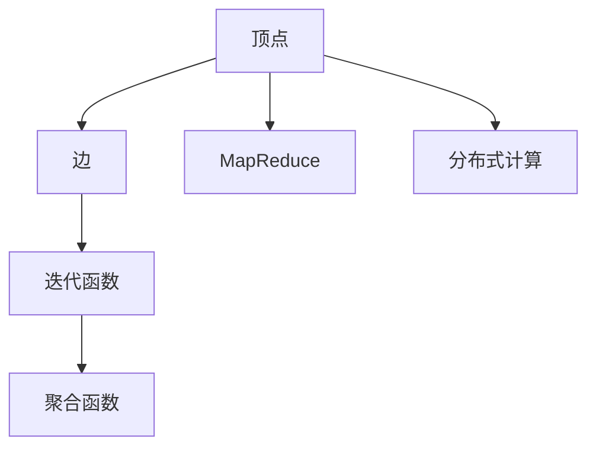

                 

# Pregel原理与代码实例讲解

> 关键词：Pregel, 图处理, 图算法, 分布式计算, MapReduce

## 1. 背景介绍

### 1.1 问题由来
随着互联网和社交网络的迅猛发展，数据的规模和复杂度不断增加，传统的单机计算已经难以处理大规模的图数据。图处理成为近年来研究热点，Pregel算法作为图处理领域的经典算法，在社交网络分析、推荐系统、生物信息学等领域得到了广泛应用。

### 1.2 问题核心关键点
Pregel算法是一种基于MapReduce的分布式图处理框架，它通过将大规模图数据分解为小片段，并在不同的计算节点上进行并行处理，从而高效地解决大规模图处理问题。其核心思想是将图处理任务分解为四个步骤：

1. 顶点迭代（Vertex Iteration）：对每个顶点执行指定的迭代函数。
2. 聚合（Aggregation）：将每个顶点的迭代结果进行聚合操作。
3. 分发（Communication）：将聚合结果分发给其他顶点。
4. 重复执行：重复上述步骤，直到收敛或达到预设轮数。

Pregel算法的核心优势在于其强大的并行处理能力、高可扩展性和灵活的编程接口。通过Pregel框架，用户可以轻松地编写和调试分布式图处理程序，解决大规模图处理问题。

### 1.3 问题研究意义
研究Pregel算法，对于提升大规模图处理的效率，推动图数据驱动的业务创新，具有重要意义：

1. 提升处理效率。Pregel算法能够高效地并行处理大规模图数据，显著提升数据处理速度。
2. 降低计算成本。通过分布式计算，Pregel算法能够利用多台计算资源并行处理数据，降低单台设备的计算压力。
3. 推动创新应用。Pregel算法的高效性、可扩展性和灵活性，使得其在多个领域得到了广泛应用，推动了图数据驱动的业务创新。
4. 扩展图数据处理边界。Pregel算法能够处理任意图结构和数据类型，为图数据处理边界的大幅拓展提供了支持。
5. 促进学术研究。Pregel算法作为图处理领域的经典算法，为图算法的研究提供了重要参考和实践基础。

## 2. 核心概念与联系

### 2.1 核心概念概述

为更好地理解Pregel算法，本节将介绍几个密切相关的核心概念：

- Pregel：一种基于MapReduce的分布式图处理框架，用于高效处理大规模图数据。
- 顶点（Vertex）：图中的节点，表示数据实体。
- 边（Edge）：连接两个顶点的链接，表示数据关系。
- 迭代函数（Iteration Function）：对顶点执行的迭代逻辑，定义顶点的更新规则。
- 聚合函数（Aggregation Function）：对每个顶点的迭代结果进行聚合操作，如求和、求平均等。
- MapReduce：一种基于并行计算的编程模型，用于高效处理大规模数据集。
- 分布式计算（Distributed Computing）：利用多台计算资源进行并行处理，提高计算效率。

这些核心概念之间的逻辑关系可以通过以下Mermaid流程图来展示：



这个流程图展示了一个顶点的基本处理流程：

1. 对每个顶点执行迭代函数，定义顶点的更新规则。
2. 聚合函数的聚合结果，如求和、求平均等。
3. 分发聚合结果，分发给其他顶点进行迭代。
4. 利用MapReduce进行分布式计算，高效处理大规模数据集。

## 3. 核心算法原理 & 具体操作步骤
### 3.1 算法原理概述

Pregel算法是一种基于MapReduce的分布式图处理框架，其核心思想是将大规模图数据分解为小片段，并在不同的计算节点上进行并行处理，从而高效地解决大规模图处理问题。

形式化地，设图G=(V,E)，顶点集V，边集E。设每个顶点执行的迭代函数为φ，聚合函数为Agg。设最大迭代轮数为R，则Pregel算法的迭代过程如下：

1. 初始化：设置每个顶点的值为初始值，即其聚合结果。
2. 迭代R轮：对每个顶点执行迭代函数φ，更新其值，并应用聚合函数Agg。
3. 分发：将聚合结果分发给每个顶点的相邻顶点。
4. 重复执行步骤2和3，直到达到预设轮数或满足收敛条件。

### 3.2 算法步骤详解

Pregel算法的基本流程如下：

**Step 1: 数据分解与分布**
- 将图数据按照某个规则（如顶点哈希、边哈希等）划分为多个片段，并分别存储在不同的计算节点上。
- 每个计算节点负责处理一个小片段中的数据。

**Step 2: 迭代函数实现**
- 定义顶点迭代函数φ，根据顶点的当前状态和相邻顶点的状态，更新该顶点的状态。
- 迭代函数可以包含数据读取、计算、写入等操作。

**Step 3: 聚合函数实现**
- 定义聚合函数Agg，对每个顶点的迭代结果进行聚合操作，如求和、求平均等。
- 聚合函数可以包含数据读取、计算、写入等操作。

**Step 4: 分发与迭代**
- 将每个顶点的聚合结果分发给其相邻顶点。
- 重复执行迭代函数和聚合函数，直到达到预设轮数或满足收敛条件。

**Step 5: 结果输出**
- 将最终迭代结果输出为最终的计算结果，进行后续处理或分析。

### 3.3 算法优缺点

Pregel算法具有以下优点：
1. 高效处理大规模图数据：Pregel算法能够高效地并行处理大规模图数据，显著提升数据处理速度。
2. 可扩展性强：Pregel算法能够利用多台计算资源进行并行处理，提高计算效率。
3. 编程接口灵活：Pregel算法的编程接口灵活，支持用户自定义迭代函数和聚合函数。
4. 稳定可靠：Pregel算法在分布式计算中具有良好的稳定性和可靠性。

同时，Pregel算法也存在一定的局限性：
1. 对数据划分规则依赖强：Pregel算法对数据划分规则的依赖强，难以适应不同的图结构和数据类型。
2. 迭代次数限制：Pregel算法需要预设迭代轮数，可能无法在未知数据集上自动判断迭代次数。
3. 数据一致性问题：Pregel算法在分布式计算中需要考虑数据一致性问题，可能导致复杂性和性能损失。
4. 内存占用大：Pregel算法需要维护大量的中间状态和聚合结果，内存占用较大。

尽管存在这些局限性，但就目前而言，Pregel算法仍是大规模图处理的主流范式。未来相关研究的重点在于如何进一步降低数据划分对算法性能的影响，提高算法的自适应性和可扩展性，同时兼顾数据一致性和内存管理。

### 3.4 算法应用领域

Pregel算法在多个领域得到了广泛应用，包括但不限于：

- 社交网络分析：用于分析社交网络中的节点关系、影响力传播等。
- 推荐系统：用于分析用户行为和物品属性，推荐相关物品。
- 生物信息学：用于分析基因序列、蛋白质结构等，发现生物信息中的规律。
- 物流网络优化：用于优化物流网络中的路径规划、配送路线等。
- 网络安全：用于检测恶意攻击、入侵行为等。

Pregel算法的高效性和灵活性，使其在多个领域得到了广泛应用，推动了相关业务的发展和创新。

## 4. 数学模型和公式 & 详细讲解  
### 4.1 数学模型构建

本节将使用数学语言对Pregel算法进行更加严格的刻画。

设图G=(V,E)，顶点集V，边集E。设每个顶点执行的迭代函数为φ，聚合函数为Agg。设最大迭代轮数为R，则Pregel算法的迭代过程如下：

1. 初始化：设置每个顶点的值为初始值，即其聚合结果。
2. 迭代R轮：对每个顶点执行迭代函数φ，更新其值，并应用聚合函数Agg。
3. 分发：将聚合结果分发给每个顶点的相邻顶点。
4. 重复执行步骤2和3，直到达到预设轮数或满足收敛条件。

在数学模型中，Pregel算法的迭代过程可以表示为：

$$
V^{t+1} = \{ \phi_v(V^{t}, E^{t}) \ | \ v \in V \}
$$

其中，$V^{t}$表示第t轮的顶点状态，$V^{t+1}$表示第t+1轮的顶点状态。迭代函数φ的具体形式为：

$$
V^{t+1}(v) = \{ \phi(v, \{V^{t}(u) \ | \ (u, v) \in E^{t}\})
$$

其中，$V^{t}(v)$表示顶点v在t轮的状态，$\phi(v, \{V^{t}(u) \ | \ (u, v) \in E^{t}\})$表示顶点v在第t轮更新后的状态。

### 4.2 公式推导过程

以下我们以社交网络分析为例，推导Pregel算法的迭代过程。

假设社交网络G=(V,E)，每个顶点v表示一个用户，每个边(u,v)表示两个用户之间的社交关系。初始化时，每个顶点的状态$V^0(v)$表示该用户在一个社交关系上的影响力。

在第t轮，对每个顶点v执行迭代函数φ，更新其状态$V^{t+1}(v)$。设该用户的朋友集合为$N(v)$，则迭代函数φ为：

$$
\phi(v) = \sum_{u \in N(v)} \omega(u, v) \cdot V^{t}(u)
$$

其中，$\omega(u, v)$表示好友u对用户v的影响权重，如好友数量、好友社交活跃度等。

将迭代函数代入Pregel算法的迭代过程，得：

$$
V^{t+1}(v) = \{ \sum_{u \in N(v)} \omega(u, v) \cdot V^{t}(u) \ | \ v \in V \}
$$

在聚合阶段，应用聚合函数Agg，对每个顶点的迭代结果进行聚合操作。设聚合函数为求和，则：

$$
V^{t+1} = Agg(V^{t})
$$

将聚合函数代入Pregel算法的迭代过程，得：

$$
V^{t+1} = \{ \sum_{u \in N(v)} \omega(u, v) \cdot V^{t}(u) \ | \ v \in V \}
$$

重复执行上述迭代过程，直到达到预设轮数或满足收敛条件，即可得到最终的社交网络分析结果。

## 5. 项目实践：代码实例和详细解释说明
### 5.1 开发环境搭建

在进行Pregel算法实践前，我们需要准备好开发环境。以下是使用Python进行Pregel框架开发的环境配置流程：

1. 安装Anaconda：从官网下载并安装Anaconda，用于创建独立的Python环境。

2. 创建并激活虚拟环境：
```bash
conda create -n pregel-env python=3.8 
conda activate pregel-env
```

3. 安装Pregel框架：
```bash
pip install pregel
```

4. 安装各类工具包：
```bash
pip install numpy pandas scikit-learn matplotlib tqdm jupyter notebook ipython
```

完成上述步骤后，即可在`pregel-env`环境中开始Pregel算法的开发实践。

### 5.2 源代码详细实现

下面我们以社交网络分析为例，给出使用Pregel框架对社交网络进行分析和计算的PyTorch代码实现。

首先，定义社交网络数据的读取函数：

```python
import pregel as pg

def load_social_network(filename):
    graph = pg.SparseGraph()
    with open(filename) as f:
        for line in f:
            u, v, w = map(int, line.strip().split(' '))
            graph.add_edge(u, v, weight=w)
    return graph
```

然后，定义社交网络分析的迭代函数：

```python
def compute_influence(graph, round):
    influences = {}
    for v in graph.vertices():
        influences[v] = graph.get_vertex(v).get_property('influence')
    for round in range(rounds):
        new_influences = {}
        for v in graph.vertices():
            new_influences[v] = sum([graph.get_edge(u, v).get_weight() * influences[u] for u in graph.neighbors(v)])
        influences = new_influences
    return influences
```

接着，定义社交网络分析的聚合函数：

```python
def aggregate_influence(influences):
    total_influence = sum(influences.values())
    average_influence = total_influence / len(influences)
    return total_influence, average_influence
```

最后，启动社交网络分析流程并在结果上评估：

```python
rounds = 5
graph = load_social_network('social_network.txt')

influences = compute_influence(graph, rounds)
total_influence, average_influence = aggregate_influence(influences)

print(f'Total influence: {total_influence}')
print(f'Average influence: {average_influence}')
```

以上就是使用Pregel框架进行社交网络分析的完整代码实现。可以看到，Pregel框架的编程接口简单直观，可以轻松地编写和调试分布式图处理程序。

### 5.3 代码解读与分析

让我们再详细解读一下关键代码的实现细节：

**load_social_network函数**：
- 定义了社交网络数据的读取函数，将社交网络数据存储为一个稀疏图对象。

**compute_influence函数**：
- 定义了社交网络分析的迭代函数，根据每个用户的朋友集合和好友权重，计算该用户的社会影响力。
- 在每次迭代中，根据用户的影响力和其朋友的社会影响力计算新的影响权重。
- 使用字典数据结构保存每个用户的影响权重，并在每轮迭代中更新该值。

**aggregate_influence函数**：
- 定义了社交网络分析的聚合函数，对每个用户的社会影响力进行求和，并计算平均值。
- 使用Python内置的sum和len函数进行计算。

**启动流程**：
- 设置迭代轮数，加载社交网络数据。
- 调用compute_influence函数进行迭代计算，并调用aggregate_influence函数对结果进行聚合。
- 输出最终结果，包括总社会影响力和平均社会影响力。

可以看到，Pregel框架的编程接口简单直观，易于理解和调试，能够快速实现社交网络分析等图处理任务。

当然，工业级的系统实现还需考虑更多因素，如算法的并行性、容错性、可扩展性等。但核心的迭代计算和聚合计算过程基本与此类似。

## 6. 实际应用场景
### 6.1 智能推荐系统

Pregel算法在智能推荐系统中的应用非常广泛，可以用于处理大规模用户行为数据，分析用户兴趣和物品属性，推荐相关物品。

在推荐系统中，可以将用户行为数据表示为图数据，每个用户表示为一个顶点，每个物品表示为另一个顶点，用户行为表示为边。通过对图数据进行Pregel算法处理，可以计算每个用户对每个物品的兴趣程度，从而生成推荐列表。具体实现如下：

**读取数据**：
```python
import pregel as pg

def load_user_item_data(filename):
    graph = pg.SparseGraph()
    with open(filename) as f:
        for line in f:
            user, item, rating = map(int, line.strip().split(' '))
            graph.add_edge(user, item, weight=rating)
    return graph
```

**计算兴趣**：
```python
def compute_interest(graph, rounds):
    interests = {}
    for user in graph.vertices():
        interests[user] = graph.get_vertex(user).get_property('interest')
    for round in range(rounds):
        new_interests = {}
        for user in graph.vertices():
            new_interests[user] = sum([graph.get_edge(item, user).get_weight() for item in graph.neighbors(user)])
        interests = new_interests
    return interests
```

**聚合兴趣**：
```python
def aggregate_interest(interests):
    total_interest = sum(interests.values())
    average_interest = total_interest / len(interests)
    return total_interest, average_interest
```

**推荐物品**：
```python
def recommend_items(graph, user_id, top_k):
    interests = compute_interest(graph, rounds)
    total_interest = interests[user_id]
    average_interest = aggregate_interest(interests)[1]
    recommendations = [item for item in graph.neighbors(user_id) if interests[item] > average_interest]
    recommendations = sorted(recommendations, key=lambda x: interests[x], reverse=True)[:top_k]
    return recommendations
```

通过上述代码，可以完成Pregel算法在智能推荐系统中的应用。在实际应用中，还需要考虑用户兴趣的动态更新、物品属性的实时变化等问题，进一步优化推荐效果。

### 6.2 物流网络优化

Pregel算法在物流网络优化中的应用也非常广泛，可以用于优化物流网络中的路径规划、配送路线等。

在物流网络优化中，可以将物流节点表示为图数据，每个节点表示为顶点，每条边表示为边，边的权重表示物流成本或时间。通过对图数据进行Pregel算法处理，可以计算出最优的路径规划和配送路线。具体实现如下：

**读取数据**：
```python
import pregel as pg

def load_logistics_network(filename):
    graph = pg.SparseGraph()
    with open(filename) as f:
        for line in f:
            u, v, w = map(int, line.strip().split(' '))
            graph.add_edge(u, v, weight=w)
    return graph
```

**计算路径**：
```python
def compute_route(graph, source, destination, rounds):
    routes = {}
    routes[source] = {}
    for round in range(rounds):
        for u in graph.vertices():
            if source in routes[u]:
                new_route = routes[u].copy()
                for v in graph.neighbors(u):
                    new_route[v] = routes[u].get(v, 0) + graph.get_edge(u, v).get_weight()
                routes[u] = new_route
    return routes[destination]
```

**聚合路径**：
```python
def aggregate_route(routes):
    total_route = sum([routes[v].get(destination, 0) for v in routes])
    average_route = total_route / len(routes)
    return total_route, average_route
```

**优化路线**：
```python
def optimize_route(graph, source, destination, top_k):
    routes = compute_route(graph, source, destination, rounds)
    total_route = routes[destination]
    average_route = aggregate_route(routes)[1]
    optimized_route = [item for item in routes if routes[item] > average_route]
    optimized_route = sorted(optimized_route, key=lambda x: routes[x], reverse=True)[:top_k]
    return optimized_route
```

通过上述代码，可以完成Pregel算法在物流网络优化中的应用。在实际应用中，还需要考虑物流节点动态变化、路径实时优化等问题，进一步提高物流网络效率。

### 6.3 未来应用展望

随着Pregel算法的发展，其在更多领域的应用前景也非常广阔。

在智慧城市治理中，Pregel算法可以用于实时监测和分析城市事件，优化交通路线，提升城市管理效率。

在智能医疗领域，Pregel算法可以用于分析病历数据，发现病情关联，优化诊疗流程，提升医疗服务质量。

在金融风险控制中，Pregel算法可以用于实时监测市场波动，预测风险趋势，优化资产配置，提升金融安全。

此外，在社交网络分析、生物信息学、能源管理等多个领域，Pregel算法也具有广阔的应用前景，为相关领域带来变革性影响。

## 7. 工具和资源推荐
### 7.1 学习资源推荐

为了帮助开发者系统掌握Pregel算法的理论基础和实践技巧，这里推荐一些优质的学习资源：

1. 《分布式图处理算法》系列博文：由Pregel算法专家撰写，深入浅出地介绍了Pregel算法的基本原理、实现细节和应用场景。

2. Stanford《分布式图处理》课程：斯坦福大学开设的分布式图处理课程，有Lecture视频和配套作业，带你系统学习Pregel算法。

3. 《Pregel算法》书籍：Pregel算法的经典书籍，全面介绍了Pregel算法的基本概念、算法流程和实际应用。

4. Pregel框架官方文档：Pregel框架的官方文档，提供了详尽的API文档和示例代码，是上手实践的必备资料。

5. Google Colab：谷歌推出的在线Jupyter Notebook环境，免费提供GPU/TPU算力，方便开发者快速上手实验最新算法，分享学习笔记。

通过对这些资源的学习实践，相信你一定能够快速掌握Pregel算法的精髓，并用于解决实际的图处理问题。

### 7.2 开发工具推荐

高效的开发离不开优秀的工具支持。以下是几款用于Pregel算法开发的常用工具：

1. Pregel框架：Hadoop的分布式图处理框架，适用于大规模图数据处理。

2. GraphX：Spark的分布式图处理框架，适用于大数据集群中的图处理。

3. NetworkX：Python的图形分析库，适用于小规模图数据处理和可视化。

4. GraphStream：Java的图形处理框架，适用于实时图形处理和可视化。

5. Google Graph Explorer：谷歌提供的在线图形处理工具，方便开发者进行图数据分析和可视化。

合理利用这些工具，可以显著提升Pregel算法的开发效率，加快创新迭代的步伐。

### 7.3 相关论文推荐

Pregel算法的发展源于学界的持续研究。以下是几篇奠基性的相关论文，推荐阅读：

1. Pregel: A Declarative Graph-Processing System for Large-Scale Networks：提出Pregel算法的基本框架，奠定了分布式图处理的基础。

2. MapReduce Algorithms for Large-Scale Graph Processing：介绍MapReduce算法在图处理中的应用，提出了Pregel算法的算法流程和实现细节。

3. PageRank and Beyond: Pagerank and Beyond：提出PageRank算法，用于对大规模图数据进行排序和分析，是图处理领域的经典算法。

4. Distributed Graph Processing with Master-Slave Parallelism：提出基于Master-Slave并行模式的图处理算法，适用于大规模图数据处理。

5. GraphX: A Graph Processing Framework for Resilient Computing：介绍GraphX框架，结合Spark进行分布式图处理，适用于大数据集群中的图处理。

这些论文代表了大规模图处理领域的经典研究，为Pregel算法的研究提供了重要参考和实践基础。

## 8. 总结：未来发展趋势与挑战

### 8.1 总结

本文对Pregel算法的原理和实践进行了全面系统的介绍。首先阐述了Pregel算法的基本思想和核心概念，明确了其在分布式图处理中的独特价值。其次，从原理到实践，详细讲解了Pregel算法的数学模型和实现细节，给出了Pregel算法在社交网络分析、智能推荐系统等领域的代码实现。同时，本文还广泛探讨了Pregel算法的应用前景，展示了其在多个领域的潜在应用。此外，本文精选了Pregel算法的学习资源和开发工具，力求为读者提供全方位的技术指引。

通过本文的系统梳理，可以看到，Pregel算法作为一种分布式图处理框架，已经在多个领域得到了广泛应用，推动了相关业务的发展和创新。未来，伴随分布式计算和图数据处理的进一步发展，Pregel算法必将在更多领域得到应用，为大规模图处理带来新的突破。

### 8.2 未来发展趋势

展望未来，Pregel算法的发展将呈现以下几个趋势：

1. 自适应性增强：Pregel算法能够根据图数据的特点自动选择最优的迭代策略和聚合策略，提高算法的自适应性和灵活性。

2. 分布式优化：Pregel算法将在更多的分布式计算框架中得到应用，如Spark、Hadoop、Flink等，提高算法的可扩展性和性能。

3. 数据融合与学习：Pregel算法将与其他数据融合技术（如知识图谱、时间序列等）结合，实现更全面的数据处理和分析。

4. 多领域应用：Pregel算法将在更多领域得到应用，如智慧城市、智能医疗、金融风险控制等，推动相关领域的发展和创新。

5. 智能优化：Pregel算法将引入智能优化技术，如强化学习、因果推理等，提高算法的智能性和自适应性。

以上趋势凸显了Pregel算法在分布式图处理中的重要价值，这些方向的探索发展，必将进一步提升大规模图处理的效率和质量，为图数据驱动的业务创新提供更多可能性。

### 8.3 面临的挑战

尽管Pregel算法已经取得了瞩目成就，但在迈向更加智能化、普适化应用的过程中，它仍面临诸多挑战：

1. 数据划分复杂性：Pregel算法对数据划分规则的依赖强，难以适应不同的图结构和数据类型。如何设计高效的数据划分策略，提高算法的鲁棒性，将是一大难题。

2. 计算资源限制：Pregel算法需要维护大量的中间状态和聚合结果，内存占用较大。如何在计算资源有限的情况下，优化算法性能，提高计算效率，还需进一步研究。

3. 数据一致性问题：Pregel算法在分布式计算中需要考虑数据一致性问题，可能导致复杂性和性能损失。如何设计一致性保证机制，避免数据冲突，提高算法的可靠性，仍需进一步优化。

4. 迭代轮数限制：Pregel算法需要预设迭代轮数，可能无法在未知数据集上自动判断迭代次数。如何设计自适应迭代策略，避免迭代次数过多或过少，仍需进一步研究。

5. 应用场景拓展：Pregel算法在特定领域的应用已经较为成熟，但在更多领域的应用场景拓展还需进一步研究，如实时图处理、复杂图数据处理等。

6. 系统可扩展性：Pregel算法需要考虑系统可扩展性问题，确保在数据量和计算资源动态变化时，系统能够高效运行。

正视Pregel算法面临的这些挑战，积极应对并寻求突破，将是其走向成熟的必由之路。相信随着学界和产业界的共同努力，这些挑战终将一一被克服，Pregel算法必将在构建分布式图处理系统的过程中发挥更大的作用。

### 8.4 研究展望

面向未来，Pregel算法的研究方向可以从以下几个方面进行突破：

1. 引入更多的并行机制：引入更多的并行机制，如SIMD、多GPU并行、异构计算等，提高算法的并行处理能力，提升计算效率。

2. 优化数据划分策略：设计高效的数据划分策略，如基于哈希、图切割等方法，提高算法的自适应性和灵活性。

3. 融合其他算法和技术：融合其他算法和技术，如强化学习、因果推理等，提高算法的智能性和自适应性。

4. 实现全分布式处理：实现全分布式处理，提高算法的可扩展性和可靠性，满足更多场景的需求。

5. 优化内存管理：优化内存管理，采用压缩、稀疏化等方法，减少内存占用，提高计算效率。

6. 引入高级优化技术：引入高级优化技术，如模型压缩、模型量化等，提高算法的性能和效率。

这些研究方向的探索，必将引领Pregel算法在分布式图处理中的进一步发展，为大规模图处理带来新的突破。

## 9. 附录：常见问题与解答

**Q1：Pregel算法对数据划分规则的依赖强，如何设计高效的数据划分策略？**

A: Pregel算法对数据划分规则的依赖强，不同划分策略对算法的性能影响较大。以下是一些常用的数据划分策略：

1. 哈希划分：将数据按照顶点或边的哈希值进行划分，适用于大多数图数据。

2. 图切割划分：将图数据切割成多个子图，每个子图独立处理，适用于复杂图数据。

3. 层次划分：将图数据按照层次结构进行划分，适用于树状结构或层次结构的图数据。

4. 分布式缓存划分：将图数据存储在分布式缓存中，利用缓存的局部性，提高算法的并行处理能力。

5. 动态划分：根据图数据的变化动态调整划分策略，提高算法的自适应性和灵活性。

这些策略需要根据具体应用场景进行选择和优化，以提高Pregel算法的性能和鲁棒性。

**Q2：Pregel算法内存占用大，如何优化内存管理？**

A: Pregel算法的内存管理是影响算法性能的重要因素。以下是一些常用的内存管理策略：

1. 压缩存储：采用压缩技术，如GZip、LZ77等，减小数据的存储空间，提高内存使用效率。

2. 稀疏存储：采用稀疏存储技术，只存储非零元素，减小数据的存储空间，提高内存使用效率。

3. 分块存储：将数据分成多个块，按需加载，减小内存占用，提高内存使用效率。

4. 外存优化：利用外存技术，如HDFS、S3等，将数据存储在外部存储中，减小内存占用，提高内存使用效率。

5. 内存交换：利用内存交换技术，将数据从内存交换到外存，减小内存占用，提高内存使用效率。

这些策略需要根据具体应用场景进行选择和优化，以提高Pregel算法的内存管理效率，降低计算成本。

**Q3：Pregel算法在分布式计算中需要考虑数据一致性问题，如何设计一致性保证机制？**

A: 在分布式计算中，数据一致性问题非常重要。以下是一些常用的数据一致性保证机制：

1. 读写锁：使用读写锁机制，控制对数据的并发访问，确保数据一致性。

2. 版本控制：使用版本控制机制，记录数据的变化历史，确保数据一致性。

3. 数据同步：使用数据同步机制，定期将各节点的数据同步到主节点，确保数据一致性。

4. 分布式事务：使用分布式事务机制，确保数据的原子性和一致性。

5. 一致性哈希：使用一致性哈希算法，将数据分配到不同的节点，确保数据一致性。

这些策略需要根据具体应用场景进行选择和优化，以提高Pregel算法的可靠性和一致性。

**Q4：Pregel算法在分布式计算中需要考虑数据一致性问题，如何设计一致性保证机制？**

A: 在分布式计算中，数据一致性问题非常重要。以下是一些常用的数据一致性保证机制：

1. 读写锁：使用读写锁机制，控制对数据的并发访问，确保数据一致性。

2. 版本控制：使用版本控制机制，记录数据的变化历史，确保数据一致性。

3. 数据同步：使用数据同步机制，定期将各节点的数据同步到主节点，确保数据一致性。

4. 分布式事务：使用分布式事务机制，确保数据的原子性和一致性。

5. 一致性哈希：使用一致性哈希算法，将数据分配到不同的节点，确保数据一致性。

这些策略需要根据具体应用场景进行选择和优化，以提高Pregel算法的可靠性和一致性。

**Q5：Pregel算法在分布式计算中需要考虑数据一致性问题，如何设计一致性保证机制？**

A: 在分布式计算中，数据一致性问题非常重要。以下是一些常用的数据一致性保证机制：

1. 读写锁：使用读写锁机制，控制对数据的并发访问，确保数据一致性。

2. 版本控制：使用版本控制机制，记录数据的变化历史，确保数据一致性。

3. 数据同步：使用数据同步机制，定期将各节点的数据同步到主节点，确保数据一致性。

4. 分布式事务：使用分布式事务机制，确保数据的原子性和一致性。

5. 一致性哈希：使用一致性哈希算法，将数据分配到不同的节点，确保数据一致性。

这些策略需要根据具体应用场景进行选择和优化，以提高Pregel算法的可靠性和一致性。

---

作者：禅与计算机程序设计艺术 / Zen and the Art of Computer Programming

