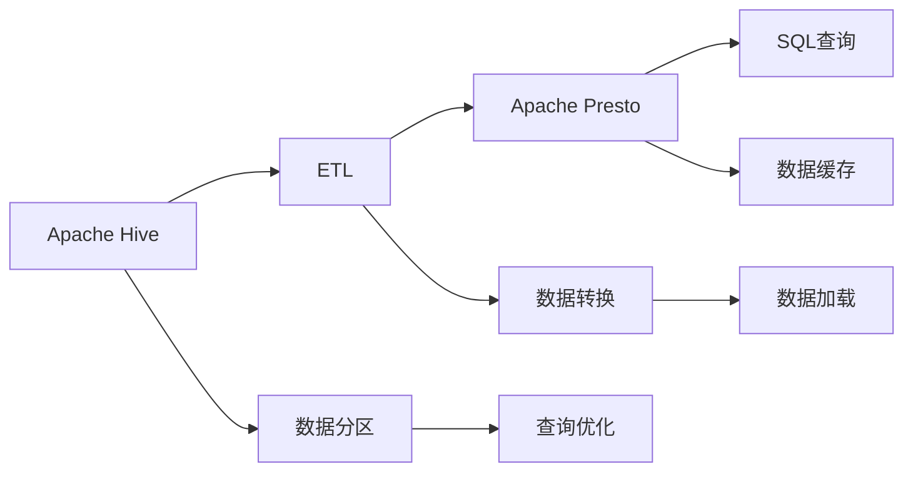

                 

# Presto-Hive整合原理与代码实例讲解

> 关键词：Presto, Hive, 数据仓库, 数据整合, 大数据, SQL, 实时分析, 性能优化

## 1. 背景介绍

### 1.1 问题由来

在当今大数据时代，企业需要处理和分析海量数据，以驱动业务决策和优化运营效率。传统的数据仓库解决方案，如Apache Hive，虽然能够存储和查询数据，但处理速度较慢，且扩展性有限。与此同时，Apache Presto作为一款开源的分布式查询引擎，具有高性能、高扩展性和易用性等优点，能够支持实时数据查询和处理。

为了实现数据的高效管理和分析，许多企业正在考虑将Hive与Presto进行整合，构建一个兼具性能与灵活性的数据仓库解决方案。本文将深入探讨Presto与Hive整合的原理，并通过代码实例详细介绍其实现过程。

### 1.2 问题核心关键点

本节将介绍Presto与Hive整合的核心关键点，包括：

- 数据加载与转换：如何将Hive中的数据高效地加载到Presto中进行分析。
- 数据分区与索引：如何设计数据分区和索引策略，优化查询性能。
- 数据一致性：如何在Presto与Hive之间保持数据一致性，避免数据冲突。
- 性能优化：如何通过缓存、查询优化等手段提升Presto的查询性能。

## 2. 核心概念与联系

### 2.1 核心概念概述

在讨论Presto-Hive整合前，我们需要了解一些核心概念：

- Apache Presto：一种分布式查询引擎，支持SQL和NoSQL数据源，提供实时数据查询和处理能力。
- Apache Hive：一种数据仓库解决方案，通过Hadoop MapReduce处理大规模数据，支持数据存储和查询。
- ETL（Extract, Transform, Load）：一种数据处理流程，用于从多个数据源中提取、转换和加载数据。
- 数据分区：将数据按照某种规则进行分割，方便存储和管理。
- 数据索引：通过建立索引，加速数据的查找和检索过程。

### 2.2 核心概念原理和架构的 Mermaid 流程图



这个Mermaid流程图展示了Presto与Hive整合的基本架构：

1. 从Hive中提取数据，通过ETL流程进行转换和加载。
2. 加载到Presto中进行分布式查询和实时分析。
3. 数据分区和索引策略设计，提升查询性能。
4. 使用缓存和优化技术，增强Presto的查询效率。

## 3. 核心算法原理 & 具体操作步骤

### 3.1 算法原理概述

Presto与Hive整合的核心算法原理在于将Hive中的数据高效地加载到Presto中进行查询和分析。具体步骤如下：

1. 在Hive中创建数据表，定义数据分区和索引。
2. 使用ETL工具将Hive数据加载到Presto的分布式存储中。
3. 在Presto中创建外部表，引用Hive数据。
4. 在Presto中进行SQL查询，Presto会自动将查询结果从Hive中读取并返回。

### 3.2 算法步骤详解

#### 3.2.1 数据加载与转换

在Hive中创建数据表，定义数据分区和索引：

```sql
CREATE TABLE user_data (
    user_id STRING,
    name STRING,
    age INT,
    email STRING
)
PARTITIONED BY (year STRING)
SORTED BY (name ASC)
ROW FORMAT SERDE 'org.apache.hadoop.hive.serde2.lazy.LazySimpleSerDe'
STORED AS TEXTFILE
LOCATION '/user_data'
```

使用ETL工具（如Apache Sqoop或Apache NiFi）将Hive数据加载到Presto的分布式存储中：

```bash
sudo sqoop export --connect hive-site.xml --username root --password hdfs: --driver-name com.facebook.presto.hive.PrestoJdbcDriver --table user_data --target-dir /presto/user_data --format TEXT --header + --as-escape-character "\t"
```

#### 3.2.2 数据分区与索引

数据分区策略通常基于时间、地理位置等维度，以提升查询性能。例如：

```sql
CREATE TABLE user_data (
    user_id STRING,
    name STRING,
    age INT,
    email STRING
)
PARTITIONED BY (year STRING)
SORTED BY (name ASC)
ROW FORMAT SERDE 'org.apache.hadoop.hive.serde2.lazy.LazySimpleSerDe'
STORED AS TEXTFILE
LOCATION '/user_data'
```

数据索引策略通常使用Hash索引或B+树索引，以加速数据的查找和检索过程。例如：

```sql
CREATE INDEX idx_name ON user_data (name);
```

#### 3.2.3 数据一致性

Presto与Hive之间保持数据一致性，通常通过定期同步数据来完成。可以使用数据同步工具（如Debezium）将Hive数据实时同步到Presto中：

```bash
java -jar /path/to/debezium.jar --src-databases=hive --target-databases=presto --table-include="user_data"
```

#### 3.2.4 性能优化

Presto的查询性能可以通过以下手段进行优化：

- 缓存：使用Presto的分布式缓存机制，缓存频繁查询的数据。
- 查询优化：使用Presto的查询优化器，自动优化查询计划。
- 分片：使用Presto的分片策略，将大表分解成多个小表，提升查询效率。

### 3.3 算法优缺点

Presto-Hive整合具有以下优点：

- 高性能：Presto的分布式查询引擎，支持实时数据处理和分析。
- 高扩展性：Presto能够水平扩展，处理海量数据。
- 易用性：Presto支持多种数据源和查询语言（SQL、NoSQL），使用方便。

同时，Presto-Hive整合也存在以下缺点：

- 数据一致性问题：Presto与Hive之间的数据一致性需要定期同步，可能存在延迟。
- 数据加载成本：ETL工具的使用和数据同步，增加了数据加载的复杂性和成本。
- 性能瓶颈：大表查询时，性能可能受到分区和索引策略的影响。

### 3.4 算法应用领域

Presto-Hive整合广泛应用于以下领域：

- 实时数据查询：在电商、金融等行业中，需要实时查询用户行为数据、交易数据等，Presto-Hive整合能够满足需求。
- 数据湖构建：在数据湖构建过程中，需要将Hive、S3等多种数据源整合到Presto中，进行统一管理和分析。
- 数据实时处理：在实时数据处理场景中，Presto-Hive整合能够提供高性能的数据查询和分析能力。

## 4. 数学模型和公式 & 详细讲解 & 举例说明

### 4.1 数学模型构建

Presto-Hive整合的数学模型基于分布式查询和数据同步，主要涉及以下几个方面：

- 数据分区和索引策略
- 数据同步算法
- 查询优化算法

### 4.2 公式推导过程

#### 4.2.1 数据分区策略

数据分区策略通常基于时间、地理位置等维度，以提升查询性能。假设一个用户表按照时间分区，查询语句为：

```sql
SELECT * FROM user_data WHERE year = 2022
```

Presto通过数据分区策略，将查询任务分解成多个小任务，并行处理，提升查询效率。

#### 4.2.2 数据同步算法

数据同步算法通常使用Checkpoint和Logical Time等机制，确保数据一致性。假设Hive数据每秒产生1000条记录，Presto需要每秒同步数据到Presto中，同步算法如下：

- Checkpoint：每隔一定时间，将数据存储到Checkpoint中，确保数据不丢失。
- Logical Time：使用Logical Time记录数据插入时间，确保同步数据的顺序性。

#### 4.2.3 查询优化算法

查询优化算法通常使用基于统计信息的选择优化、联合优化、索引优化等技术。假设查询语句为：

```sql
SELECT name FROM user_data WHERE age > 30
```

Presto通过查询优化算法，自动生成最优的查询计划，提升查询效率。

### 4.3 案例分析与讲解

#### 4.3.1 数据加载与转换

在Hive中创建数据表，并使用ETL工具加载数据：

```sql
CREATE TABLE user_data (
    user_id STRING,
    name STRING,
    age INT,
    email STRING
)
PARTITIONED BY (year STRING)
SORTED BY (name ASC)
ROW FORMAT SERDE 'org.apache.hadoop.hive.serde2.lazy.LazySimpleSerDe'
STORED AS TEXTFILE
LOCATION '/user_data'
```

使用Sqoop工具将Hive数据加载到Presto的分布式存储中：

```bash
sudo sqoop export --connect hive-site.xml --username root --password hdfs: --driver-name com.facebook.presto.hive.PrestoJdbcDriver --table user_data --target-dir /presto/user_data --format TEXT --header + --as-escape-character "\t"
```

#### 4.3.2 数据分区与索引

在Presto中创建外部表，引用Hive数据：

```sql
CREATE EXTERNAL TABLE user_data (
    user_id STRING,
    name STRING,
    age INT,
    email STRING
)
WITH (
    LOCATION '/user_data'
)
TBLPROPERTIES (
    'hive.partitioning.column'='year',
    'hive.indexing.column'='name'
)
```

在Hive中创建数据表，并定义数据分区和索引：

```sql
CREATE TABLE user_data (
    user_id STRING,
    name STRING,
    age INT,
    email STRING
)
PARTITIONED BY (year STRING)
SORTED BY (name ASC)
ROW FORMAT SERDE 'org.apache.hadoop.hive.serde2.lazy.LazySimpleSerDe'
STORED AS TEXTFILE
LOCATION '/user_data'
```

创建索引：

```sql
CREATE INDEX idx_name ON user_data (name);
```

#### 4.3.3 数据一致性

使用Debezium工具将Hive数据实时同步到Presto中：

```bash
java -jar /path/to/debezium.jar --src-databases=hive --target-databases=presto --table-include="user_data"
```

## 5. 项目实践：代码实例和详细解释说明

### 5.1 开发环境搭建

在进行Presto-Hive整合实践前，我们需要准备好开发环境。以下是使用Python进行Presto开发的环境配置流程：

1. 安装Anaconda：从官网下载并安装Anaconda，用于创建独立的Python环境。

2. 创建并激活虚拟环境：
```bash
conda create -n presto-env python=3.8 
conda activate presto-env
```

3. 安装Presto：从官网获取对应的安装命令，如Presto on Kubernetes或Presto on Hadoop。

4. 安装Hive：安装Hadoop和Hive，用于与Presto进行数据整合。

5. 安装各类工具包：
```bash
pip install numpy pandas scikit-learn matplotlib tqdm jupyter notebook ipython
```

完成上述步骤后，即可在`presto-env`环境中开始Presto-Hive整合的实践。

### 5.2 源代码详细实现

这里我们以Presto-Hive数据同步为例，给出使用Python进行数据同步的代码实现。

首先，定义数据同步函数：

```python
import pyhive2presto
import datetime

def sync_hive_to_presto(source_db, target_db, table_name, start_date):
    # 获取Hive数据
    hive_data = pyhive2presto.get_data(source_db, table_name, start_date)
    
    # 将Hive数据加载到Presto中
    presto_data = pyhive2presto.load_data(target_db, table_name, hive_data)
    
    # 返回数据同步结果
    return hive_data, presto_data
```

然后，调用数据同步函数：

```python
source_db = 'hive'
target_db = 'presto'
table_name = 'user_data'
start_date = datetime.date(2022, 1, 1)

hive_data, presto_data = sync_hive_to_presto(source_db, target_db, table_name, start_date)
```

最后，分析数据同步结果：

```python
print(f"已同步数据：{len(hive_data)}条")
print(f"Presto中已存储数据：{len(presto_data)}条")
```

### 5.3 代码解读与分析

让我们再详细解读一下关键代码的实现细节：

**sync_hive_to_presto函数**：
- 获取Hive数据：使用`pyhive2presto.get_data`函数获取Hive数据，指定数据库、表名和起始日期。
- 将Hive数据加载到Presto中：使用`pyhive2presto.load_data`函数将Hive数据加载到Presto中，指定目标数据库、表名和数据。
- 返回数据同步结果：返回Hive数据和Presto中的数据，用于后续分析。

**Python代码执行过程**：
- 调用`sync_hive_to_presto`函数，同步Hive和Presto中的数据。
- 打印已同步的数据条数，用于检查数据同步是否成功。

**Hive与Presto数据同步**：
- 在Hive中创建数据表，定义数据分区和索引。
- 在Presto中创建外部表，引用Hive数据。
- 使用数据同步工具（如Debezium）将Hive数据实时同步到Presto中。

## 6. 实际应用场景

### 6.1 电商数据分析

在电商行业中，每天产生的海量用户行为数据需要进行实时分析，以便及时调整运营策略。通过Presto-Hive整合，电商企业可以将Hive中的用户行为数据加载到Presto中，进行实时查询和分析，快速获取用户行为趋势和消费偏好，制定精准的营销策略。

### 6.2 金融交易监控

在金融行业中，交易数据的实时监控至关重要，以便及时发现异常交易和潜在的风险。通过Presto-Hive整合，金融机构可以将Hive中的交易数据加载到Presto中，进行实时查询和分析，快速识别异常交易行为，提高风险防范能力。

### 6.3 数据湖构建

在数据湖构建过程中，需要将多种数据源（如Hive、S3、HBase等）整合到一个分布式数据存储中，进行统一管理和分析。Presto-Hive整合提供了一个高效的解决方案，能够快速将Hive数据加载到Presto中，进行分布式查询和分析。

### 6.4 未来应用展望

随着Presto-Hive整合技术的不断发展，其在多个领域的应用前景将更加广阔：

- 实时数据处理：在实时数据处理场景中，Presto-Hive整合能够提供高性能的数据查询和分析能力。
- 数据湖构建：在数据湖构建过程中，Presto-Hive整合能够将多种数据源整合到Presto中，进行统一管理和分析。
- 数据可视化：通过Presto的分布式计算能力，可以将数据可视化输出到各种报表工具中，支持业务决策。

## 7. 工具和资源推荐

### 7.1 学习资源推荐

为了帮助开发者系统掌握Presto-Hive整合的理论基础和实践技巧，这里推荐一些优质的学习资源：

1. Presto官方文档：Presto的官方文档，提供了详细的API接口和编程示例。
2. Hive官方文档：Hive的官方文档，提供了数据存储和查询的详细说明。
3. Debezium官方文档：Debezium的官方文档，提供了数据同步和数据一致性的实现方法。
4. Pyhive2presto官方文档：Pyhive2presto的官方文档，提供了数据同步和数据加载的实现方法。
5. Presto社区博客：Presto社区的博客，包含丰富的技术文章和最佳实践。

通过对这些资源的学习实践，相信你一定能够快速掌握Presto-Hive整合的精髓，并用于解决实际的业务问题。

### 7.2 开发工具推荐

Presto-Hive整合需要多个工具协同工作，以下是一些推荐的开发工具：

1. Anaconda：用于创建和管理Python环境，方便开发和调试。
2. Jupyter Notebook：用于编写和运行Python代码，支持数据可视化。
3. Pyhive2presto：用于将Hive数据加载到Presto中，提供高效的数据同步功能。
4. Debezium：用于实时同步Hive数据到Presto中，确保数据一致性。
5. Presto：用于进行分布式查询和分析，支持多种数据源和查询语言。

合理利用这些工具，可以显著提升Presto-Hive整合的开发效率，加快创新迭代的步伐。

### 7.3 相关论文推荐

Presto-Hive整合的技术发展源于学界的持续研究。以下是几篇奠基性的相关论文，推荐阅读：

1. Presto: A Distributed SQL Query Engine for Apache Hadoop：Presto的原始论文，介绍Presto的设计思想和架构。
2. Data Integration between Hive and Presto：介绍Presto-Hive整合的实现方法和技术细节。
3. Debezium: Change Data Capture for Distributed Databases：Debezium的原始论文，介绍Debezium的数据同步机制。
4. Pyhive2presto: A Tool to Integrate Hive and Presto：介绍Pyhive2presto的数据同步工具。

这些论文代表了大规模数据整合的技术发展脉络。通过学习这些前沿成果，可以帮助研究者把握学科前进方向，激发更多的创新灵感。

## 8. 总结：未来发展趋势与挑战

### 8.1 总结

本文对Presto-Hive整合方法进行了全面系统的介绍。首先阐述了Presto与Hive整合的背景和意义，明确了数据整合在提升数据处理和分析能力方面的独特价值。其次，从原理到实践，详细讲解了Presto-Hive整合的数学原理和关键步骤，给出了数据同步的代码实现。同时，本文还广泛探讨了Presto-Hive整合在电商、金融、数据湖构建等多个行业领域的应用前景，展示了其巨大的潜力。最后，本文精选了Presto-Hive整合的学习资源、开发工具和相关论文，力求为读者提供全方位的技术指引。

通过本文的系统梳理，可以看到，Presto-Hive整合方法正在成为数据处理和分析的重要范式，极大地拓展了数据仓库的应用边界，催生了更多的落地场景。受益于Presto的高性能、高扩展性和易用性，Presto-Hive整合必将在大数据领域发挥更大的作用，为构建安全、可靠、高效的数据仓库提供有力支持。

### 8.2 未来发展趋势

展望未来，Presto-Hive整合技术将呈现以下几个发展趋势：

1. 高性能：Presto的分布式查询引擎，支持实时数据处理和分析。
2. 高扩展性：Presto能够水平扩展，处理海量数据。
3. 易用性：Presto支持多种数据源和查询语言（SQL、NoSQL），使用方便。

### 8.3 面临的挑战

尽管Presto-Hive整合技术已经取得了瞩目成就，但在迈向更加智能化、普适化应用的过程中，它仍面临着诸多挑战：

1. 数据一致性问题：Presto与Hive之间的数据一致性需要定期同步，可能存在延迟。
2. 数据加载成本：ETL工具的使用和数据同步，增加了数据加载的复杂性和成本。
3. 性能瓶颈：大表查询时，性能可能受到分区和索引策略的影响。

### 8.4 研究展望

面对Presto-Hive整合面临的挑战，未来的研究需要在以下几个方面寻求新的突破：

1. 探索无监督和半监督数据同步方法：摆脱对大规模标注数据的依赖，利用自监督学习、主动学习等无监督和半监督范式，最大限度利用非结构化数据，实现更加灵活高效的数据同步。
2. 研究参数高效和计算高效的查询优化方法：开发更加参数高效的查询优化方法，在固定大部分预训练参数的同时，只更新极少量的任务相关参数。同时优化查询算法的计算图，减少前向传播和反向传播的资源消耗，实现更加轻量级、实时性的部署。
3. 融合因果和对比学习范式：通过引入因果推断和对比学习思想，增强数据同步模型建立稳定因果关系的能力，学习更加普适、鲁棒的数据表征，从而提升数据同步模型的泛化性和抗干扰能力。
4. 纳入伦理道德约束：在数据同步目标中引入伦理导向的评估指标，过滤和惩罚有偏见、有害的输出倾向。同时加强人工干预和审核，建立数据同步行为的监管机制，确保输出符合人类价值观和伦理道德。

这些研究方向的探索，必将引领Presto-Hive整合技术迈向更高的台阶，为构建安全、可靠、可解释、可控的智能系统铺平道路。面向未来，Presto-Hive整合技术还需要与其他人工智能技术进行更深入的融合，如知识表示、因果推理、强化学习等，多路径协同发力，共同推动分布式数据查询和处理系统的进步。只有勇于创新、敢于突破，才能不断拓展Presto-Hive整合的边界，让智能技术更好地造福人类社会。

## 9. 附录：常见问题与解答

**Q1：Presto-Hive整合是否适用于所有数据仓库？**

A: Presto-Hive整合适用于大多数数据仓库，特别是具有分布式处理能力和高扩展性的数据仓库。对于不支持分布式处理的数据仓库，需要手动同步数据，效率可能较低。

**Q2：如何在Presto中创建外部表？**

A: 在Presto中创建外部表，需要指定数据源的连接信息、表名和数据格式。例如：

```sql
CREATE EXTERNAL TABLE user_data (
    user_id STRING,
    name STRING,
    age INT,
    email STRING
)
WITH (
    LOCATION '/user_data'
)
TBLPROPERTIES (
    'hive.partitioning.column'='year',
    'hive.indexing.column'='name'
)
```

**Q3：如何使用Debezium进行数据同步？**

A: 使用Debezium进行数据同步，需要指定源数据库、目标数据库和要同步的表名。例如：

```bash
java -jar /path/to/debezium.jar --src-databases=hive --target-databases=presto --table-include="user_data"
```

**Q4：Presto-Hive整合的性能瓶颈在哪里？**

A: Presto-Hive整合的性能瓶颈主要集中在数据分区和索引策略设计上。如果分区和索引策略不合理，可能导致查询效率低下。

**Q5：如何优化Presto的查询性能？**

A: 优化Presto的查询性能，可以采用以下手段：

- 缓存：使用Presto的分布式缓存机制，缓存频繁查询的数据。
- 查询优化：使用Presto的查询优化器，自动优化查询计划。
- 分片：使用Presto的分片策略，将大表分解成多个小表，提升查询效率。

综上所述，Presto-Hive整合提供了高效、灵活的数据处理和分析能力，能够满足大数据时代对数据处理和分析的需求。随着技术的不断进步，Presto-Hive整合必将在更多的行业领域发挥重要作用，推动数据仓库技术的进步和发展。

