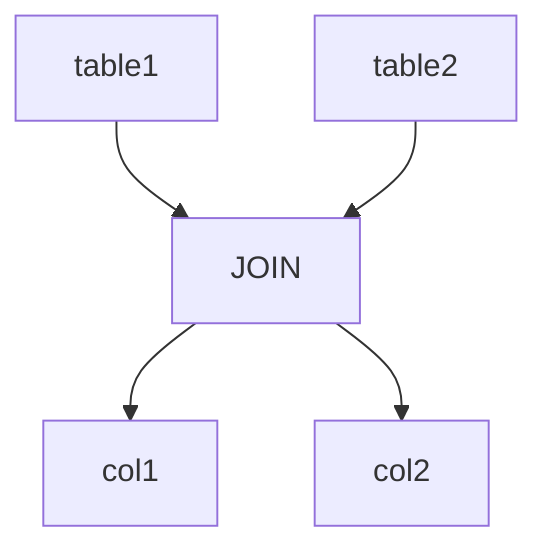

                 

# Presto原理与代码实例讲解

> 关键词：Presto,SQL查询引擎,分布式计算,大数据处理,查询优化,实时数据处理

## 1. 背景介绍

### 1.1 问题由来

随着互联网和移动互联网的普及，全球数据量呈爆炸式增长。海量数据带来了巨大的商业价值，但同时也给数据存储、管理和查询带来了巨大的挑战。传统的单节点数据库无法满足日益增长的数据处理需求，分布式数据库系统成为了企业数据处理的首选方案。

Presto是一个由Facebook开源的分布式SQL查询引擎，其特点是开源、易用、高性能、兼容性和可扩展性。自问世以来，Presto已经成为大数据处理领域的明星项目，广泛应用于金融、电商、物联网、人工智能等众多行业。

Presto项目通过在Hadoop生态系统中的Cassandra、Hive、S3等数据源上实现高性能的数据仓库查询功能，允许用户通过标准的SQL语句进行数据查询和分析。其高性能的数据处理能力，得益于其在分布式计算和数据共享机制上的创新设计。

## 2. 核心概念与联系

### 2.1 核心概念概述

为了更好地理解Presto的工作原理和架构设计，本节将介绍几个密切相关的核心概念：

- **Presto**：Facebook开源的分布式SQL查询引擎，支持多种数据源，包括Hive、HBase、MySQL等，具备高扩展性和高性能。
- **分布式计算**：通过将数据分布在多个节点上，并行处理大规模数据集，提升计算效率。
- **数据共享**：在分布式系统中，通过节点之间的数据交换和同步，实现数据的集中管理和共享，减少数据冗余。
- **查询优化**：通过优化SQL查询语句，减少计算资源消耗，提高查询效率。
- **实时数据处理**：Presto支持实时数据处理，能够在毫秒级别返回查询结果，满足企业对数据实时分析和决策的需求。

这些核心概念之间的逻辑关系可以通过以下Mermaid流程图来展示：


这个流程图展示了大数据处理的基本流程：

1. Presto通过分布式计算对数据进行处理。
2. 数据在节点间共享，提升数据管理效率。
3. 查询优化算法减少计算资源消耗。
4. Presto支持实时数据处理，满足企业对数据实时分析和决策的需求。

这些核心概念共同构成了Presto的查询处理框架，使其能够在高效、灵活、可扩展的基础上，处理海量数据，提供高性能的查询能力。

## 3. 核心算法原理 & 具体操作步骤

### 3.1 算法原理概述

Presto的查询处理流程大致可以分为以下几个步骤：

1. **连接数据源**：Presto支持多种数据源，如Hive、HBase、S3等，将数据源连接到查询任务中。
2. **分片数据**：将数据按照逻辑关系分割成多个分片，每个分片在独立的节点上进行处理。
3. **查询计划生成**：根据SQL语句，Presto的查询优化器生成查询计划。
4. **分片并行执行**：在各个节点上并行执行查询计划，通过数据共享机制实现跨节点计算。
5. **结果合并**：将各个节点的查询结果进行合并，生成最终的查询结果。

Presto通过分布式计算和数据共享，实现了大规模数据的高效处理。其高性能的计算能力，得益于其查询优化算法和实时数据处理机制。

### 3.2 算法步骤详解

Presto的查询处理过程包括以下关键步骤：

**Step 1: 数据源连接**

Presto支持多种数据源，如Hive、HBase、S3等，在查询开始前，需要将数据源连接到查询任务中。数据源连接包括查询数据源类型、数据源地址和数据源格式等配置信息。

**Step 2: 数据分片**

Presto将数据按照逻辑关系分割成多个分片，每个分片在独立的节点上进行处理。分片可以按照主键、时间戳、哈希等规则进行划分。数据分片后，可以通过数据共享机制在各个节点间进行交换和同步，提升数据处理效率。

**Step 3: 查询计划生成**

Presto的查询优化器根据SQL语句生成查询计划。查询计划包括数据的扫描方式、分片执行顺序、计算逻辑等。查询优化器通过统计信息、查询语义分析等手段，生成高效的查询计划。

**Step 4: 分片并行执行**

Presto在各个节点上并行执行查询计划。每个分片在独立的节点上进行处理，并通过数据共享机制实现跨节点计算。Presto的查询执行器根据查询计划，生成具体的数据处理任务，分配到各个节点上执行。

**Step 5: 结果合并**

Presto将各个节点的查询结果进行合并，生成最终的查询结果。合并操作可以通过数据共享机制在各个节点间进行。合并过程中，Presto进行数据去重、排序等操作，生成最终的查询结果。

### 3.3 算法优缺点

Presto作为分布式SQL查询引擎，具有以下优点：

1. 高性能：通过分布式计算和数据共享，Presto可以高效处理大规模数据。
2. 灵活性：支持多种数据源和查询方式，适合不同业务场景。
3. 扩展性强：可以轻松扩展到上千个节点，支持海量数据处理。
4. 兼容性好：兼容多种数据源和查询标准，易于集成到现有系统中。

同时，Presto也存在一些局限性：

1. 数据传输消耗高：数据分片和数据共享机制需要频繁的数据传输，增加了网络带宽的消耗。
2. 状态管理复杂：节点之间的数据共享需要维护状态信息，增加了系统的复杂度。
3. 学习成本高：对于不熟悉分布式系统的开发者，学习成本较高。
4. 数据冗余：数据分片可能导致数据冗余，增加存储空间。

尽管存在这些局限性，但Presto凭借其高性能、灵活性和扩展性，成为当前大数据处理领域的重要工具。

### 3.4 算法应用领域

Presto的应用领域非常广泛，可以应用于各种数据驱动的业务场景，例如：

- 金融数据分析：金融机构可以通过Presto查询Hadoop生态系统中的数据，进行实时风险控制和市场分析。
- 电商用户分析：电商平台可以通过Presto查询用户行为数据，进行用户画像和个性化推荐。
- 物联网设备监控：物联网平台可以通过Presto查询设备数据，进行实时监控和故障分析。
- 人工智能模型训练：人工智能团队可以通过Presto查询大规模数据集，进行模型训练和验证。
- 数据挖掘与分析：企业可以通过Presto查询各种数据源，进行数据挖掘和分析，提取有价值的商业洞察。

Presto在金融、电商、物联网、人工智能等众多领域的应用，展示了其强大的数据处理能力和业务适应性。

## 4. 数学模型和公式 & 详细讲解 & 举例说明

### 4.1 数学模型构建

Presto的查询优化过程可以抽象为图灵机的查询计算模型。图灵机模型将查询过程抽象为一条计算带，每条计算带上的每个位置都表示一个计算步骤，并维护一个指针，指向下一个计算步骤。查询优化器通过不断调整指针和计算步骤，生成最优的查询计划。

### 4.2 公式推导过程

假设查询语句为 `SELECT col1, col2 FROM table1 JOIN table2 ON table1.id = table2.id`，查询优化器需要生成一个查询计划来执行该查询。查询优化器首先对查询语句进行语义分析，得到以下信息：

- 查询涉及的表名：table1, table2
- 查询涉及的列名：col1, col2
- 连接条件：table1.id = table2.id

查询优化器根据以上信息，生成一个查询计划，如图：



查询优化器需要为每个节点生成具体的计算任务，并根据连接条件进行数据交换和同步。查询优化器通过分析统计信息、查询语义等手段，优化查询计划，减少计算资源消耗。

### 4.3 案例分析与讲解

假设有一个金融数据分析的查询任务，需要查询Hadoop生态系统中的Hive数据，进行风险控制分析。查询语句为：

```sql
SELECT user_id, SUM(amount) as total_amount FROM orders GROUP BY user_id
```

查询优化器需要对该查询进行优化。优化步骤如下：

1. **连接数据源**：将Hive数据源连接到查询任务中。
2. **分片数据**：将数据按照user_id进行分片，每个分片在独立的节点上进行处理。
3. **查询计划生成**：查询优化器生成一个查询计划，如图：

   ```mermaid
   graph TB
       node0[orders]
       node1[GROUP BY]
       node2[SUM]
       node3[SELECT]
       node0 --> node1
       node1 --> node2
       node2 --> node3
   ```

4. **分片并行执行**：在各个节点上并行执行查询计划。节点0对orders表进行分片，并将分片数据进行交换和同步。节点1和节点2在独立的节点上并行执行，生成分组和求和结果。
5. **结果合并**：将各个节点的查询结果进行合并，生成最终的查询结果。

Presto通过分布式计算和数据共享，实现了大规模数据的高效处理。查询优化器通过统计信息和查询语义分析，生成高效的查询计划，提升了查询效率。

## 5. 项目实践：代码实例和详细解释说明

### 5.1 开发环境搭建

在进行Presto项目实践前，我们需要准备好开发环境。以下是使用Python进行Presto项目开发的环境配置流程：

1. 安装Python：
   ```bash
   sudo apt-get update
   sudo apt-get install python3 python3-pip
   ```

2. 安装Presto：
   ```bash
   pip install presto
   ```

3. 创建虚拟环境：
   ```bash
   pip install virtualenv
   virtualenv presto_env
   source presto_env/bin/activate
   ```

4. 安装相关依赖：
   ```bash
   pip install numpy pandas sqlalchemy dask
   ```

完成上述步骤后，即可在`presto_env`环境中开始Presto项目实践。

### 5.2 源代码详细实现

以下是一个简单的Presto项目示例，用于查询Hadoop生态系统中的Hive数据：

```python
from presto import Connection, Execution

# 创建连接对象
conn = Connection('localhost', 9048)

# 创建执行对象
exe = conn.cursor()

# 执行查询
exe.execute("SELECT user_id, SUM(amount) as total_amount FROM orders GROUP BY user_id")

# 获取查询结果
results = exe.fetchall()
for row in results:
    print(row)
```

### 5.3 代码解读与分析

让我们再详细解读一下关键代码的实现细节：

**Connection类**：
- `__init__`方法：初始化连接信息，包括服务地址和端口号。
- `cursor()`方法：返回一个执行对象，用于执行具体的查询语句。

**Execution类**：
- `execute`方法：执行具体的查询语句。
- `fetchall`方法：获取查询结果，返回一个包含所有行的列表。

**代码示例**：
- 创建连接对象：
  ```python
  conn = Connection('localhost', 9048)
  ```
- 创建执行对象：
  ```python
  exe = conn.cursor()
  ```
- 执行查询：
  ```python
  exe.execute("SELECT user_id, SUM(amount) as total_amount FROM orders GROUP BY user_id")
  ```
- 获取查询结果：
  ```python
  results = exe.fetchall()
  for row in results:
      print(row)
  ```

可以看到，使用Presto项目，开发者可以轻松连接各种数据源，执行SQL查询语句，并获取查询结果。Presto通过分布式计算和数据共享机制，实现了高效的数据处理能力。

当然，Presto的实际应用场景非常广泛，需要根据具体任务进行优化设计和参数调整。开发者需要不断积累实践经验，才能真正发挥Presto的高性能优势。

## 6. 实际应用场景

### 6.1 金融数据分析

金融机构需要实时查询和分析海量交易数据，进行风险控制和市场分析。Presto可以通过连接Hadoop生态系统中的Hive、HBase、S3等数据源，实时查询交易数据，进行风险预警和市场预测。

在技术实现上，可以构建一个基于Presto的实时数据平台，通过Spark等大数据计算引擎对交易数据进行预处理，再通过Presto进行实时查询和分析。

### 6.2 电商用户分析

电商平台需要实时查询用户行为数据，进行用户画像和个性化推荐。Presto可以通过连接Hadoop生态系统中的Hive、HBase等数据源，实时查询用户浏览、点击、购买等行为数据，生成用户画像和推荐列表。

在技术实现上，可以通过Spark对用户行为数据进行预处理，再通过Presto进行实时查询和分析。Presto的高性能和灵活性，能够满足电商平台的实时查询需求。

### 6.3 物联网设备监控

物联网平台需要实时查询设备数据，进行实时监控和故障分析。Presto可以通过连接Hadoop生态系统中的Hive、HBase等数据源，实时查询设备状态数据，生成设备监控报告和故障分析结果。

在技术实现上，可以通过Spark对设备状态数据进行预处理，再通过Presto进行实时查询和分析。Presto的实时数据处理能力，能够满足物联网平台的实时监控需求。

### 6.4 未来应用展望

随着Presto项目的持续演进，其高性能、灵活性和扩展性将进一步提升。未来Presto将有以下发展趋势：

1. **高性能提升**：Presto将引入更多优化算法和技术，提升数据处理速度和并发处理能力。
2. **灵活性增强**：Presto将支持更多数据源和查询标准，提供更灵活的数据处理方式。
3. **扩展性增强**：Presto将支持更多节点和计算资源，提供更强大的数据处理能力。
4. **安全性提升**：Presto将引入更多安全机制和认证方式，保障数据和系统的安全。
5. **实时性提升**：Presto将引入更多实时处理技术，进一步提升实时查询和分析能力。

Presto在大数据处理领域的应用前景广阔，其高性能、灵活性和扩展性，能够满足企业对数据处理的各项需求。未来Presto还将继续创新优化，成为企业数据处理的强大工具。

## 7. 工具和资源推荐

### 7.1 学习资源推荐

为了帮助开发者系统掌握Presto的技术原理和实践技巧，这里推荐一些优质的学习资源：

1. Presto官方文档：Presto官方提供了详细的文档，涵盖Presto的安装、使用和扩展等内容，是学习Presto的最佳入门资料。
2. Presto教程：Presto社区提供了丰富的教程和示例代码，帮助开发者快速上手Presto，并进行项目开发。
3. Hadoop生态系统文档：Presto基于Hadoop生态系统进行开发，了解Hadoop生态系统对Presto的部署和使用具有重要意义。
4. Python数据分析教程：学习Python数据分析技术，可以帮助开发者更好地理解Presto的数据处理机制和优化方法。

通过对这些资源的学习实践，相信你一定能够快速掌握Presto的精髓，并用于解决实际的业务问题。

### 7.2 开发工具推荐

Presto的开发和部署需要依赖多种工具和技术，以下是几款常用的开发工具：

1. Python：Python是Presto项目的主要开发语言，具有良好的可扩展性和灵活性。
2. Java：Presto的部分组件是用Java编写的，了解Java开发技术对Presto的深入理解具有重要意义。
3. Spark：Spark是Presto项目的主要大数据计算引擎，了解Spark的使用和优化，能够提升Presto的性能和扩展性。
4. Hadoop：Presto项目基于Hadoop生态系统进行开发，了解Hadoop的使用和配置，能够更好地部署和使用Presto。

合理利用这些工具，可以显著提升Presto项目的开发效率，加快创新迭代的步伐。

### 7.3 相关论文推荐

Presto项目的发展离不开学界的持续研究。以下是几篇奠基性的相关论文，推荐阅读：

1. "Presto: Distributed SQL with Performance at Scale"：Presto的起源论文，介绍了Presto的设计理念和技术细节。
2. "Performance Optimization Techniques for Presto"：Presto的高性能优化技术，提供了详细的性能优化方法和案例。
3. "Distributed SQL Query Processing Using Presto"：Presto的分布式查询处理技术，介绍了Presto的查询优化和分布式计算机制。
4. "Presto: A Distributed SQL Query Engine"：Presto的介绍和应用，涵盖Presto的技术细节和实际应用场景。

这些论文代表了大数据处理领域的发展脉络，通过学习这些前沿成果，可以帮助研究者把握学科前进方向，激发更多的创新灵感。

## 8. 总结：未来发展趋势与挑战

### 8.1 总结

本文对Presto的原理与代码实例进行了全面系统的介绍。首先阐述了Presto的工作原理和架构设计，明确了其在大数据处理领域的独特优势。其次，从原理到实践，详细讲解了Presto的查询优化和执行机制，给出了Presto项目开发的完整代码示例。同时，本文还广泛探讨了Presto在金融、电商、物联网等众多领域的应用前景，展示了其强大的数据处理能力和业务适应性。

通过本文的系统梳理，可以看到，Presto作为分布式SQL查询引擎，凭借其高性能、灵活性和扩展性，已经成为大数据处理领域的重要工具。Presto通过分布式计算和数据共享，实现了大规模数据的高效处理，满足企业对数据实时分析和决策的需求。

### 8.2 未来发展趋势

展望未来，Presto的发展趋势主要包括以下几个方面：

1. **高性能提升**：Presto将引入更多优化算法和技术，提升数据处理速度和并发处理能力。
2. **灵活性增强**：Presto将支持更多数据源和查询标准，提供更灵活的数据处理方式。
3. **扩展性增强**：Presto将支持更多节点和计算资源，提供更强大的数据处理能力。
4. **安全性提升**：Presto将引入更多安全机制和认证方式，保障数据和系统的安全。
5. **实时性提升**：Presto将引入更多实时处理技术，进一步提升实时查询和分析能力。

以上趋势展示了Presto在大数据处理领域的广阔前景，其高性能、灵活性和扩展性，将继续推动Presto项目的发展。

### 8.3 面临的挑战

尽管Presto项目已经取得了显著成就，但在迈向更加智能化、普适化应用的过程中，它仍面临着诸多挑战：

1. **数据传输消耗高**：数据分片和数据共享机制需要频繁的数据传输，增加了网络带宽的消耗。
2. **状态管理复杂**：节点之间的数据共享需要维护状态信息，增加了系统的复杂度。
3. **学习成本高**：对于不熟悉分布式系统的开发者，学习成本较高。
4. **数据冗余**：数据分片可能导致数据冗余，增加存储空间。

尽管存在这些挑战，但通过不断的技术创新和优化，Presto的性能和扩展性将继续提升，更好地满足企业对数据处理的各项需求。

### 8.4 研究展望

面对Presto项目面临的种种挑战，未来的研究需要在以下几个方面寻求新的突破：

1. **探索更多优化算法**：开发更加高效的查询优化算法，减少计算资源消耗。
2. **引入更多实时处理技术**：引入更多实时处理技术，进一步提升实时查询和分析能力。
3. **提高数据处理能力**：通过引入更多分布式计算技术和并行处理算法，提高Presto的数据处理能力。
4. **降低学习成本**：提供更易用的API和工具，降低Presto的使用门槛。
5. **优化数据共享机制**：优化数据共享机制，减少数据传输和存储消耗。

这些研究方向的探索，必将引领Presto项目走向更高的台阶，为大数据处理领域带来新的突破。

## 9. 附录：常见问题与解答

**Q1：Presto项目有哪些优缺点？**

A: Presto项目作为分布式SQL查询引擎，具有以下优点：

1. 高性能：通过分布式计算和数据共享，Presto可以高效处理大规模数据。
2. 灵活性：支持多种数据源和查询方式，适合不同业务场景。
3. 扩展性强：可以轻松扩展到上千个节点，支持海量数据处理。
4. 兼容性好：兼容多种数据源和查询标准，易于集成到现有系统中。

同时，Presto也存在一些局限性：

1. 数据传输消耗高：数据分片和数据共享机制需要频繁的数据传输，增加了网络带宽的消耗。
2. 状态管理复杂：节点之间的数据共享需要维护状态信息，增加了系统的复杂度。
3. 学习成本高：对于不熟悉分布式系统的开发者，学习成本较高。
4. 数据冗余：数据分片可能导致数据冗余，增加存储空间。

尽管存在这些局限性，但Presto凭借其高性能、灵活性和扩展性，成为当前大数据处理领域的重要工具。

**Q2：Presto项目有哪些应用场景？**

A: Presto项目适用于各种数据驱动的业务场景，包括但不限于以下几种：

1. 金融数据分析：金融机构可以通过Presto查询Hadoop生态系统中的数据，进行实时风险控制和市场分析。
2. 电商用户分析：电商平台可以通过Presto查询用户行为数据，进行用户画像和个性化推荐。
3. 物联网设备监控：物联网平台可以通过Presto查询设备数据，进行实时监控和故障分析。
4. 人工智能模型训练：人工智能团队可以通过Presto查询大规模数据集，进行模型训练和验证。
5. 数据挖掘与分析：企业可以通过Presto查询各种数据源，进行数据挖掘和分析，提取有价值的商业洞察。

Presto在金融、电商、物联网、人工智能等众多领域的应用，展示了其强大的数据处理能力和业务适应性。

**Q3：Presto项目的学习资源有哪些？**

A: Presto项目的学习资源包括：

1. Presto官方文档：Presto官方提供了详细的文档，涵盖Presto的安装、使用和扩展等内容，是学习Presto的最佳入门资料。
2. Presto教程：Presto社区提供了丰富的教程和示例代码，帮助开发者快速上手Presto，并进行项目开发。
3. Hadoop生态系统文档：Presto基于Hadoop生态系统进行开发，了解Hadoop生态系统对Presto的部署和使用具有重要意义。
4. Python数据分析教程：学习Python数据分析技术，可以帮助开发者更好地理解Presto的数据处理机制和优化方法。

通过对这些资源的学习实践，相信你一定能够快速掌握Presto的精髓，并用于解决实际的业务问题。

**Q4：Presto项目有哪些开发工具推荐？**

A: Presto项目的开发和部署需要依赖多种工具和技术，以下是几款常用的开发工具：

1. Python：Python是Presto项目的主要开发语言，具有良好的可扩展性和灵活性。
2. Java：Presto的部分组件是用Java编写的，了解Java开发技术对Presto的深入理解具有重要意义。
3. Spark：Spark是Presto项目的主要大数据计算引擎，了解Spark的使用和优化，能够提升Presto的性能和扩展性。
4. Hadoop：Presto项目基于Hadoop生态系统进行开发，了解Hadoop的使用和配置，能够更好地部署和使用Presto。

合理利用这些工具，可以显著提升Presto项目的开发效率，加快创新迭代的步伐。

**Q5：Presto项目有哪些未来突破？**

A: 未来的Presto项目将在以下几个方面寻求新的突破：

1. **探索更多优化算法**：开发更加高效的查询优化算法，减少计算资源消耗。
2. **引入更多实时处理技术**：引入更多实时处理技术，进一步提升实时查询和分析能力。
3. **提高数据处理能力**：通过引入更多分布式计算技术和并行处理算法，提高Presto的数据处理能力。
4. **降低学习成本**：提供更易用的API和工具，降低Presto的使用门槛。
5. **优化数据共享机制**：优化数据共享机制，减少数据传输和存储消耗。

这些研究方向的探索，必将引领Presto项目走向更高的台阶，为大数据处理领域带来新的突破。

---

作者：禅与计算机程序设计艺术 / Zen and the Art of Computer Programming

