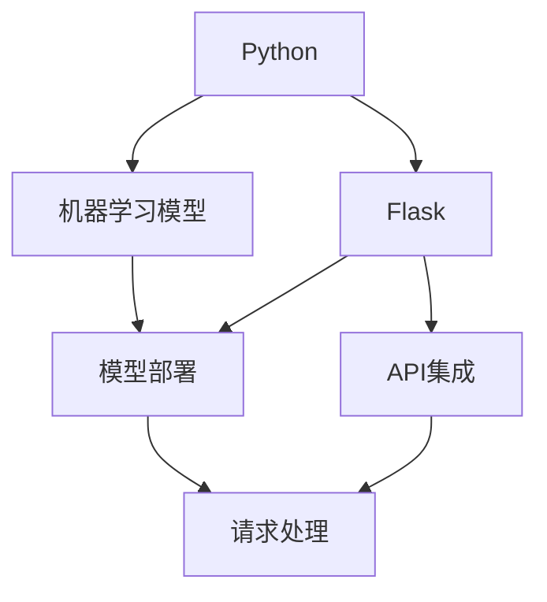

                 

# Python机器学习实战：使用Flask构建机器学习API

> 关键词：Python机器学习, Flask, 机器学习API, 实战, 代码实例, 实际应用场景

## 1. 背景介绍

在当今数据驱动的时代，机器学习算法在各行各业中得到了广泛应用。无论是金融、医疗、电商还是智能家居，机器学习都在通过数据分析、模式识别等技术，提高决策效率、优化运营效果、提升用户体验。然而，将机器学习模型部署到生产环境中，并不是一件简单的事情。模型的开发、训练、评估、优化、部署等环节，都可能需要耗费大量的时间和精力。尤其是当模型需要提供即时的API服务时，传统的前端开发方式，如Web框架、RESTful API等，显得力不从心。这时，使用Python和Flask框架构建机器学习API，可以极大提升模型部署和调用的效率，实现快速迭代和无缝集成。

## 2. 核心概念与联系

### 2.1 核心概念概述

在本文中，我们将介绍几个与构建机器学习API相关的核心概念：

- Python：一种高效、灵活、易于扩展的编程语言，广泛应用于数据科学和机器学习领域。
- Flask：一个轻量级、快速开发的Web框架，特别适合构建小型、低延迟的API服务。
- 机器学习API：通过Web服务的形式，提供机器学习模型推理、评估、监控等服务，满足前端应用程序的需求。
- RESTful API：基于HTTP协议、遵循标准API设计原则的Web服务接口，支持无状态请求和响应，便于前后端集成。
- 部署：将训练好的机器学习模型封装成可扩展的API服务，支持HTTP接口调用，方便第三方应用集成。

这些核心概念之间存在着紧密的联系，构成了一个完整的机器学习API生态系统。通过学习这些概念和实践经验，读者可以掌握从模型开发到API部署的全流程技能。

### 2.2 核心概念原理和架构的 Mermaid 流程图



这个流程图展示了Python、机器学习模型、Flask和RESTful API之间的关系：

1. Python作为编程语言，提供了强大的数据分析和机器学习库，如NumPy、Pandas、Scikit-learn等。
2. 机器学习模型通过训练，获得对数据的预测能力，最终以模型文件的形式部署到API服务。
3. Flask作为Web框架，提供RESTful API的实现和部署，支持异步请求处理和并发扩展。
4. RESTful API基于HTTP协议，遵循标准API设计规范，满足前后端无状态通信的需求。
5. 用户端通过HTTP请求调用API，获取机器学习模型的推理结果。

## 3. 核心算法原理 & 具体操作步骤

### 3.1 算法原理概述

构建机器学习API的核心在于将训练好的机器学习模型封装成Web服务，并通过RESTful API提供接口调用。其关键步骤如下：

1. 选择适当的机器学习框架和库，构建和训练模型。
2. 使用Flask框架搭建Web服务，实现模型的推理和监控。
3. 设计RESTful API接口，实现对模型的调用和响应。
4. 部署API服务到服务器，进行性能优化和监控。

这一过程涉及到多个环节的协同工作，包括模型开发、API设计、Web服务部署等。

### 3.2 算法步骤详解

#### 3.2.1 数据准备

构建机器学习API的第一步是准备数据。根据具体任务的不同，数据准备的工作也各不相同。但无论何种任务，数据预处理都是至关重要的。

- 数据清洗：去除数据中的噪声、异常值等，确保数据的质量。
- 特征工程：选择合适的特征，并进行标准化、归一化等处理，提取有意义的特征。
- 数据划分：将数据划分为训练集、验证集和测试集，分别用于模型训练、调参和评估。

#### 3.2.2 模型训练

选择适当的机器学习框架和库，构建和训练模型。常用的机器学习框架包括Scikit-learn、TensorFlow、PyTorch等。

1. 导入机器学习库和数据集：
```python
import pandas as pd
from sklearn.model_selection import train_test_split
from sklearn.ensemble import RandomForestClassifier

# 导入数据集
data = pd.read_csv('data.csv')
X = data.drop('target', axis=1)
y = data['target']
```

2. 数据划分：
```python
X_train, X_test, y_train, y_test = train_test_split(X, y, test_size=0.2, random_state=42)
```

3. 模型构建和训练：
```python
# 构建随机森林模型
model = RandomForestClassifier(n_estimators=100, random_state=42)

# 训练模型
model.fit(X_train, y_train)
```

#### 3.2.3 模型评估

评估模型的性能是构建机器学习API的重要环节。常见的评估指标包括准确率、召回率、F1值等。

1. 模型评估：
```python
from sklearn.metrics import accuracy_score

# 模型评估
y_pred = model.predict(X_test)
accuracy = accuracy_score(y_test, y_pred)
print('Accuracy:', accuracy)
```

2. 模型调参：
```python
from sklearn.model_selection import GridSearchCV

# 调参
param_grid = {
    'n_estimators': [100, 200, 300],
    'max_depth': [5, 10, 15]
}
grid_search = GridSearchCV(model, param_grid, cv=5, scoring='accuracy')
grid_search.fit(X_train, y_train)

# 选择最佳参数
best_params = grid_search.best_params_
print('Best parameters:', best_params)
```

#### 3.2.4 模型导出

将训练好的模型导出为模型文件，以便后续的API部署。常用的模型导出方法包括Pickle、joblib等。

1. 模型导出：
```python
import pickle

# 导出模型
with open('model.pkl', 'wb') as f:
    pickle.dump(model, f)
```

#### 3.2.5 API设计

设计RESTful API接口，实现对模型的调用和响应。常用的API设计方法包括RESTful风格、GraphQL风格等。

1. Flask初始化：
```python
from flask import Flask, request, jsonify

app = Flask(__name__)

# 模型加载
with open('model.pkl', 'rb') as f:
    model = pickle.load(f)
```

2. 定义API接口：
```python
@app.route('/predict', methods=['POST'])
def predict():
    # 接收请求数据
    data = request.json
    # 数据预处理
    X = preprocess(data)
    # 模型推理
    y_pred = model.predict(X)
    # 返回结果
    return jsonify({'result': y_pred.tolist()})
```

#### 3.2.6 部署API

将API服务部署到服务器，进行性能优化和监控。常用的部署方式包括Docker、Kubernetes等。

1. Flask部署：
```python
if __name__ == '__main__':
    app.run(host='0.0.0.0', port=5000, debug=True)
```

2. Docker部署：
```bash
# 构建Docker镜像
docker build -t model-api .

# 部署Docker镜像
docker run -p 5000:5000 model-api
```

### 3.3 算法优缺点

构建机器学习API的优点包括：

1. 灵活性高：支持多种机器学习框架和库，能够快速适配不同的模型和算法。
2. 可扩展性：支持并发请求和异步处理，能够轻松应对高并发和高吞吐量的API服务。
3. 易于集成：API接口遵循RESTful标准，便于与其他系统进行无缝集成。

构建机器学习API的缺点包括：

1. 性能开销：API服务增加了额外的网络开销，可能影响模型的响应速度。
2. 安全性问题：API接口可能成为黑客攻击的目标，需要注意安全防护措施。
3. 资源消耗：API服务的部署和维护需要额外的计算和存储资源。

### 3.4 算法应用领域

构建机器学习API在多个领域得到了广泛应用：

1. 金融：构建风险评估、信用评分、反欺诈等API，辅助金融决策和风控管理。
2. 电商：构建商品推荐、用户画像、交易监控等API，提升用户体验和业务效率。
3. 医疗：构建疾病诊断、健康管理、基因分析等API，支持智能医疗和个性化健康管理。
4. 智能家居：构建环境监测、能源管理、智能控制等API，实现智能家居的自动化和智能化。
5. 智能制造：构建质量检测、故障诊断、生产优化等API，推动智能制造的数字化转型。

## 4. 数学模型和公式 & 详细讲解 & 举例说明

### 4.1 数学模型构建

在机器学习API的构建中，数学模型是核心。常用的数学模型包括线性回归、逻辑回归、决策树、随机森林、神经网络等。这里以线性回归模型为例，进行详细讲解。

线性回归模型的数学模型可以表示为：
$$ y = \beta_0 + \beta_1 x_1 + \beta_2 x_2 + \cdots + \beta_n x_n + \epsilon $$

其中，$y$为因变量，$\beta_0$为截距，$\beta_1, \beta_2, \cdots, \beta_n$为回归系数，$x_1, x_2, \cdots, x_n$为自变量，$\epsilon$为随机误差项。

### 4.2 公式推导过程

线性回归模型的推导过程包括以下几个步骤：

1. 最小二乘法：最小化残差平方和，即求解最优的回归系数 $\beta_0, \beta_1, \cdots, \beta_n$。
$$ \sum_{i=1}^{n} (y_i - \hat{y}_i)^2 = \sum_{i=1}^{n} (y_i - \beta_0 - \beta_1 x_{i1} - \beta_2 x_{i2} - \cdots - \beta_n x_{in})^2 $$

2. 矩阵求解：将最小二乘法转化为矩阵形式，求解回归系数。
$$ \mathbf{X}^T \mathbf{X} \mathbf{\beta} = \mathbf{X}^T \mathbf{y} $$
其中，$\mathbf{X}$为自变量矩阵，$\mathbf{y}$为因变量向量，$\mathbf{\beta}$为回归系数向量。

### 4.3 案例分析与讲解

以房价预测为例，假设有一组房屋数据，包括面积、卧室数量、卫生间数量、位置等特征，预测房价。可以使用线性回归模型进行建模。

1. 数据准备：
```python
import numpy as np

# 导入数据
X = np.array([[120, 2, 1, 1], [150, 3, 2, 1], [130, 2, 1, 0], [180, 3, 2, 1], [200, 4, 2, 1]])
y = np.array([5000, 6500, 4500, 8000, 10000])

# 标准化数据
X = (X - np.mean(X, axis=0)) / np.std(X, axis=0)
y = (y - np.mean(y)) / np.std(y)
```

2. 模型训练：
```python
# 构建最小二乘模型
X = np.column_stack([np.ones(len(X)), X])
beta = np.linalg.inv(X.T @ X) @ X.T @ y
```

3. 模型评估：
```python
from sklearn.metrics import r2_score

# 模型评估
y_pred = X @ beta
r2 = r2_score(y, y_pred)
print('R-squared:', r2)
```

## 5. 项目实践：代码实例和详细解释说明

### 5.1 开发环境搭建

在进行机器学习API的开发前，需要搭建开发环境。以下是使用Python和Flask进行API开发的环境配置流程：

1. 安装Python：从官网下载并安装Python，推荐使用3.8版本以上。
2. 安装Flask：使用pip安装Flask库。
```bash
pip install flask
```

3. 安装机器学习库：使用pip安装常用的机器学习库，如Scikit-learn、Pandas等。
```bash
pip install scikit-learn pandas
```

4. 安装Docker：从官网下载并安装Docker，用于部署API服务。

完成上述步骤后，即可在Python环境中开始API开发。

### 5.2 源代码详细实现

这里我们以房价预测为例，使用Flask构建机器学习API，并进行详细代码实现。

1. Flask初始化：
```python
from flask import Flask, request, jsonify
import pickle
import numpy as np
from sklearn.ensemble import RandomForestRegressor
from sklearn.preprocessing import StandardScaler

app = Flask(__name__)

# 模型加载
with open('model.pkl', 'rb') as f:
    model = pickle.load(f)
```

2. 数据预处理：
```python
def preprocess(data):
    features = ['area', 'rooms', 'bathrooms', 'location']
    X = np.array([data[feature] for feature in features])
    X = (X - np.mean(X, axis=0)) / np.std(X, axis=0)
    return X
```

3. 模型推理：
```python
@app.route('/predict', methods=['POST'])
def predict():
    # 接收请求数据
    data = request.json
    # 数据预处理
    X = preprocess(data)
    # 模型推理
    y_pred = model.predict(X)
    # 返回结果
    return jsonify({'result': y_pred.tolist()})
```

### 5.3 代码解读与分析

让我们再详细解读一下关键代码的实现细节：

**Flask初始化**：
- `Flask(__name__)`：初始化Flask应用对象，`__name__`表示当前模块的命名空间。
- `with open('model.pkl', 'rb') as f:`：打开模型文件，使用`pickle.load(f)`将模型加载到应用对象中。

**数据预处理**：
- `preprocess(data)`：接收输入数据，将其转换为模型所需的格式。这里使用了`StandardScaler`对数据进行标准化处理，以便模型能够更好地拟合。

**模型推理**：
- `@app.route('/predict', methods=['POST'])`：定义API接口路径和请求方法。
- `request.json`：接收POST请求的数据，自动解码为Python对象。
- `preprocess(data)`：对接收到的数据进行预处理。
- `model.predict(X)`：调用训练好的模型进行推理。
- `jsonify({'result': y_pred.tolist()})`：将推理结果转换为JSON格式，并返回给客户端。

### 5.4 运行结果展示

在运行以上代码后，可以使用curl或Postman等工具，向API发送请求，获取预测结果。例如：
```bash
curl -X POST -H 'Content-Type: application/json' -d '{"area": 120, "rooms": 2, "bathrooms": 1, "location": 1}' http://localhost:5000/predict
```

## 6. 实际应用场景

### 6.1 智能推荐系统

智能推荐系统是机器学习API的重要应用场景之一。通过API服务，推荐系统可以实时获取用户的输入数据，调用机器学习模型进行个性化推荐。

具体而言，可以构建一个推荐API，根据用户的历史行为数据、兴趣爱好、实时点击情况等信息，调用模型进行推荐，返回推荐结果。推荐API可以集成到电商网站、视频平台、社交网络等多个场景中，为用户提供个性化的内容和服务。

### 6.2 实时监控系统

实时监控系统需要收集和处理大量的数据，以便及时发现异常情况并进行预警。通过API服务，实时监控系统可以方便地调用机器学习模型进行数据分析和异常检测。

具体而言，可以构建一个监控API，接收传感器数据、日志数据、网络流量等实时数据，调用模型进行异常检测和分类，返回预警结果。监控API可以集成到智慧城市、工业控制、医疗健康等多个领域中，实现高效、实时的监控预警。

### 6.3 智能客服系统

智能客服系统需要处理大量的客户咨询和反馈，以便及时响应客户需求并解决问题。通过API服务，智能客服系统可以方便地调用机器学习模型进行文本分类、情感分析、意图识别等任务，返回回答结果。

具体而言，可以构建一个客服API，接收客户输入的文本，调用模型进行分类和分析，返回合适的回答和建议。客服API可以集成到企业客服中心、社交媒体平台、在线客服等多个场景中，提升客户咨询体验和服务质量。

## 7. 工具和资源推荐

### 7.1 学习资源推荐

为了帮助开发者掌握构建机器学习API的技能，这里推荐一些优质的学习资源：

1. Flask官方文档：详细介绍了Flask框架的使用方法、API设计规范和部署方式，是Flask开发的必备资料。
2. Flask-RESTful扩展：提供了RESTful API的扩展功能，支持跨域请求、JSON解析等。
3. PyTorch官方文档：提供了PyTorch框架的使用方法和API接口，是机器学习开发的常用工具。
4. Scikit-learn官方文档：提供了Scikit-learn库的使用方法和API接口，是机器学习建模和评估的常用工具。
5. TensorFlow官方文档：提供了TensorFlow框架的使用方法和API接口，是深度学习建模和训练的常用工具。

通过对这些资源的学习实践，相信你一定能够掌握构建机器学习API的技能，并用于解决实际的机器学习问题。

### 7.2 开发工具推荐

高效的开发离不开优秀的工具支持。以下是几款用于机器学习API开发的常用工具：

1. Jupyter Notebook：交互式编程环境，支持Python代码的编写和运行，方便调试和演示。
2. Postman：API测试工具，支持HTTP请求和响应，方便测试和调试API接口。
3. Docker：容器化部署工具，方便快速部署和扩展API服务。
4. Kubernetes：容器编排工具，支持分布式部署和资源管理，提升API服务的可扩展性和稳定性。
5. TensorBoard：TensorFlow的可视化工具，支持模型训练和性能监控，方便调试和优化模型。

合理利用这些工具，可以显著提升机器学习API的开发效率，加快创新迭代的步伐。

### 7.3 相关论文推荐

机器学习API的研究始于学界的持续研究。以下是几篇奠基性的相关论文，推荐阅读：

1. Deep Learning with Python：DeepMind的深度学习教材，介绍了深度学习的基本概念和常用工具。
2. TensorFlow官方文档：TensorFlow框架的官方文档，提供了深度学习模型的构建和训练方法。
3. PyTorch官方文档：PyTorch框架的官方文档，提供了深度学习模型的构建和训练方法。
4. Scikit-learn官方文档：Scikit-learn库的官方文档，提供了机器学习模型的构建和评估方法。
5. Flask官方文档：Flask框架的官方文档，提供了API服务的构建和部署方法。

这些论文代表了大模型微调技术的发展脉络。通过学习这些前沿成果，可以帮助研究者把握学科前进方向，激发更多的创新灵感。

## 8. 总结：未来发展趋势与挑战

### 8.1 研究成果总结

本文对使用Flask构建机器学习API的方法进行了全面系统的介绍。首先阐述了机器学习API的研究背景和意义，明确了API在提升数据处理效率、优化决策效果方面的独特价值。其次，从原理到实践，详细讲解了机器学习API的构建流程，包括数据准备、模型训练、API设计和部署等环节。最后，展示了API在多个领域的应用前景，如智能推荐、实时监控、智能客服等。

通过本文的系统梳理，可以看到，使用Flask构建机器学习API的方法已经非常成熟，在提升模型部署和调用效率方面表现出色。未来，伴随深度学习框架和Web框架的不断发展，API服务将更加高效、稳定、易于集成，为机器学习技术的落地应用提供坚实基础。

### 8.2 未来发展趋势

展望未来，机器学习API的发展将呈现以下几个趋势：

1. 模型集成化：将多个模型的输出进行融合，提高API的综合性能。例如，集成多个深度学习模型、多个决策树模型等。
2. 模型服务化：将模型封装成API服务，支持多种接口协议，方便集成到不同的系统和平台中。例如，支持HTTP、gRPC、WebSockets等协议。
3. 模型可视化：将模型推理过程进行可视化展示，方便调试和优化模型。例如，使用TensorBoard等工具进行模型可视化。
4. 模型可解释性：通过可解释性技术，揭示模型的决策机制和推理逻辑，增强模型的透明度和可信度。例如，使用LIME、SHAP等工具进行模型可解释性分析。
5. 模型安全性：通过安全技术，保护API服务的安全性，防止恶意攻击和数据泄露。例如，使用OAuth2、API密钥等安全措施。

这些趋势凸显了机器学习API的广阔前景。这些方向的探索发展，将进一步提升API服务的性能和安全性，为机器学习技术的落地应用提供更强有力的支持。

### 8.3 面临的挑战

尽管机器学习API技术已经取得了显著成果，但在迈向更加智能化、普适化应用的过程中，它仍面临诸多挑战：

1. 性能瓶颈：API服务增加了额外的网络开销，可能影响模型的响应速度。
2. 安全性问题：API接口可能成为黑客攻击的目标，需要注意安全防护措施。
3. 资源消耗：API服务的部署和维护需要额外的计算和存储资源。
4. 可解释性不足：模型推理过程不透明，难以理解和解释模型决策。
5. 模型更新困难：模型更新需要重新部署和测试，可能影响API服务的稳定性。

### 8.4 研究展望

面对机器学习API面临的挑战，未来的研究需要在以下几个方面寻求新的突破：

1. 模型高效化：开发更加高效的模型结构，提高API服务的响应速度和吞吐量。
2. 模型可解释性：通过可解释性技术，提高模型的透明度和可信度，方便调试和优化模型。
3. 模型安全化：采用安全技术，保护API服务的安全性，防止恶意攻击和数据泄露。
4. 模型集成化：将多个模型的输出进行融合，提高API的综合性能。
5. 模型服务化：将模型封装成API服务，支持多种接口协议，方便集成到不同的系统和平台中。

这些研究方向将进一步提升机器学习API的性能和安全性，为机器学习技术的落地应用提供更加坚实的保障。相信随着研究的深入和技术的发展，机器学习API必将在更广阔的应用场景中发挥重要的作用，推动人工智能技术的普及和应用。

## 9. 附录：常见问题与解答

**Q1：机器学习API是否适用于所有NLP任务？**

A: 机器学习API在大多数NLP任务上都能取得不错的效果，特别是对于数据量较小的任务。但对于一些特定领域的任务，如医学、法律等，仅仅依靠通用语料预训练的模型可能难以很好地适应。此时需要在特定领域语料上进一步预训练，再进行微调，才能获得理想效果。此外，对于一些需要时效性、个性化很强的任务，如对话、推荐等，API方法也需要针对性的改进优化。

**Q2：API服务如何处理大规模数据？**

A: 处理大规模数据时，可以使用分布式计算技术，如Spark、Hadoop等，将数据切分成多个小块，并行处理。同时，可以使用缓存技术，如Redis、Memcached等，将经常访问的数据缓存到内存中，提升响应速度。此外，可以使用GPU、TPU等高性能设备，加速数据处理和模型推理。

**Q3：API服务如何实现高可用性和高可靠性？**

A: 实现高可用性和高可靠性，需要从多个方面进行优化：
1. 使用负载均衡技术，将请求分发到多个服务器中，提升服务的吞吐量和稳定性。
2. 使用自动故障转移技术，当某台服务器故障时，自动将请求转移到其他服务器中，确保服务的可用性。
3. 使用冗余备份技术，建立多副本服务，防止单点故障，提升服务的可靠性。
4. 使用监控告警技术，实时监测服务状态，设置异常告警阈值，及时发现和解决问题。

**Q4：API服务如何保证安全性？**

A: 保证API服务的安全性，需要从多个方面进行保护：
1. 使用OAuth2等认证机制，确保API请求的身份合法性。
2. 使用API密钥等加密方式，防止请求被篡改和重放。
3. 使用限流和防御技术，防止恶意攻击和恶意请求，保护服务安全。
4. 使用日志和审计技术，记录和分析API请求和响应，发现和解决问题。

通过这些措施，可以大大提升API服务的安全性和可靠性，确保服务稳定运行。

**Q5：API服务如何优化性能？**

A: 优化API服务的性能，可以从多个方面进行优化：
1. 使用缓存技术，将频繁访问的数据缓存到内存中，减少数据库和网络开销。
2. 使用异步处理技术，提升API服务的并发处理能力，降低响应时间。
3. 使用分布式计算技术，将请求分发到多个服务器中，提升服务的吞吐量。
4. 使用CDN技术，将静态资源缓存到全球分布的节点中，加速资源的访问速度。
5. 使用性能监控技术，实时监测API服务的性能指标，发现和解决问题。

通过这些措施，可以显著提升API服务的性能，满足大规模和高并发场景的需求。

---

作者：禅与计算机程序设计艺术 / Zen and the Art of Computer Programming

