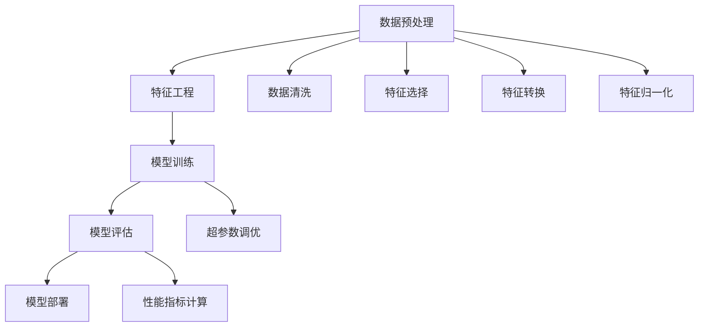

                 

# Python机器学习实战：使用Scikit-Learn构建端到端的机器学习项目

> 关键词：机器学习，Scikit-Learn，数据预处理，特征工程，模型训练，模型评估，实际应用，Python

## 1. 背景介绍

### 1.1 问题由来

随着人工智能技术的不断进步，机器学习（Machine Learning, ML）在各个领域的应用越来越广泛。从金融、医疗、零售到互联网、能源，几乎无处不在。机器学习能够帮助企业从海量数据中挖掘出有价值的信息，从而实现智能决策、优化运营、提升用户体验等目标。然而，机器学习的实施并不是一件简单的事情。它需要大量的数据、专业知识、工具和算法，才能构建出一个高效、稳定、准确的机器学习系统。

Scikit-Learn作为Python中最流行的机器学习库之一，提供了简单易用的API和丰富的算法，成为了机器学习开发者的首选工具。通过Scikit-Learn，开发者可以迅速构建端到端的机器学习项目，将模型训练、特征工程、数据预处理等步骤无缝衔接，高效地实现机器学习任务。

本文章将详细介绍使用Scikit-Learn构建端到端的机器学习项目的方法和步骤，帮助读者理解机器学习的基础概念，掌握Scikit-Learn的常用功能和最佳实践，并最终实现实际应用。

### 1.2 问题核心关键点

构建端到端的机器学习项目，涉及以下几个核心关键点：

- 数据预处理：清洗、转换和归一化原始数据，为模型训练提供高质量的数据。
- 特征工程：从原始数据中提取有意义的特征，提升模型的预测能力。
- 模型训练：选择合适的算法和超参数，对数据进行训练，得到模型参数。
- 模型评估：使用交叉验证、AUC、RMSE等指标评估模型的性能，避免过拟合和欠拟合。
- 模型部署：将训练好的模型集成到生产环境，实现高效的预测服务。

这些关键点相辅相成，缺一不可，只有通过系统的学习和实践，才能构建出高质量的机器学习项目。

## 2. 核心概念与联系

### 2.1 核心概念概述

为了更好地理解机器学习项目的构建流程，本节将介绍几个核心概念：

- **机器学习（Machine Learning, ML）**：指使用算法和模型对数据进行训练，从而实现对未知数据的预测、分类、回归等任务的技术。
- **监督学习（Supervised Learning）**：使用标注数据训练模型，使其能够对新数据进行分类或回归的机器学习方法。
- **无监督学习（Unsupervised Learning）**：使用未标注数据训练模型，使其能够发现数据中的隐藏结构和模式的方法。
- **特征工程（Feature Engineering）**：从原始数据中提取、构造有意义的特征，提升模型的预测能力。
- **模型训练（Model Training）**：使用训练数据对模型进行拟合，得到模型参数的过程。
- **模型评估（Model Evaluation）**：使用测试数据对模型进行评估，判断其预测能力的方法。
- **模型部署（Model Deployment）**：将训练好的模型集成到生产环境，实现高效的预测服务的过程。

这些核心概念之间的逻辑关系可以通过以下Mermaid流程图来展示：



这个流程图展示出数据预处理、特征工程、模型训练、模型评估、模型部署五个步骤，以及每个步骤中涉及的子任务，如数据清洗、特征选择、特征转换、特征归一化等。

## 3. 核心算法原理 & 具体操作步骤

### 3.1 算法原理概述

机器学习项目的核心在于模型训练和评估。模型的训练过程是通过优化算法最小化损失函数，使模型能够准确地预测未知数据。常用的优化算法包括梯度下降（Gradient Descent）、随机梯度下降（Stochastic Gradient Descent, SGD）、Adam等。模型的评估则是通过交叉验证、AUC、RMSE等指标，判断模型的预测能力和泛化能力。

Scikit-Learn提供了多种机器学习算法，包括分类算法、回归算法、聚类算法等。常见的分类算法包括逻辑回归（Logistic Regression）、决策树（Decision Tree）、支持向量机（Support Vector Machine, SVM）、随机森林（Random Forest）、梯度提升树（Gradient Boosting Tree, GBM）等。常见的回归算法包括线性回归（Linear Regression）、岭回归（Ridge Regression）、Lasso回归等。

### 3.2 算法步骤详解

基于Scikit-Learn构建机器学习项目，通常需要以下步骤：

1. **数据预处理**：包括数据清洗、特征选择、特征转换、特征归一化等步骤，确保数据的质量和有效性。
2. **特征工程**：从原始数据中提取、构造有意义的特征，提升模型的预测能力。
3. **模型训练**：选择合适的算法和超参数，对数据进行训练，得到模型参数。
4. **模型评估**：使用交叉验证、AUC、RMSE等指标评估模型的性能，避免过拟合和欠拟合。
5. **模型部署**：将训练好的模型集成到生产环境，实现高效的预测服务。

以下是一个使用Scikit-Learn进行二分类问题的示例：

**Step 1: 数据预处理**

```python
import pandas as pd
from sklearn.model_selection import train_test_split
from sklearn.preprocessing import StandardScaler

# 加载数据
data = pd.read_csv('data.csv')

# 数据清洗
data = data.dropna()

# 划分训练集和测试集
X_train, X_test, y_train, y_test = train_test_split(data.drop('target', axis=1), data['target'], test_size=0.2, random_state=42)

# 特征归一化
scaler = StandardScaler()
X_train = scaler.fit_transform(X_train)
X_test = scaler.transform(X_test)
```

**Step 2: 特征工程**

```python
from sklearn.compose import ColumnTransformer
from sklearn.pipeline import Pipeline
from sklearn.preprocessing import OneHotEncoder

# 特征选择
feature_selection = ColumnTransformer([
    ('num', StandardScaler(), ['numerical_features']),
    ('cat', OneHotEncoder(), ['categorical_features'])
], remainder='passthrough')

# 构建管道
pipeline = Pipeline([
    ('feature_selection', feature_selection),
    ('classifier', LogisticRegression())
])
```

**Step 3: 模型训练**

```python
from sklearn.model_selection import GridSearchCV

# 设置超参数
parameters = {
    'classifier__C': [0.001, 0.01, 0.1, 1],
    'classifier__penalty': ['l1', 'l2'],
    'classifier__class_weight': ['balanced', None]
}

# 交叉验证和超参数调优
grid_search = GridSearchCV(pipeline, parameters, cv=5)
grid_search.fit(X_train, y_train)

# 获取最佳模型
best_model = grid_search.best_estimator_
```

**Step 4: 模型评估**

```python
from sklearn.metrics import accuracy_score, confusion_matrix

# 预测测试集
y_pred = best_model.predict(X_test)

# 计算准确率和混淆矩阵
accuracy = accuracy_score(y_test, y_pred)
confusion_matrix = confusion_matrix(y_test, y_pred)
```

**Step 5: 模型部署**

```python
import joblib
import flask

# 保存模型
joblib.dump(best_model, 'best_model.pkl')

# 构建Flask应用
app = flask.Flask(__name__)

@app.route('/predict')
def predict():
    # 获取预测参数
    params = request.get_json()
    X = pd.DataFrame([params])
    X = scaler.transform(X)
    
    # 预测结果
    y_pred = best_model.predict(X)
    
    # 返回结果
    return {'result': y_pred[0]}
```

### 3.3 算法优缺点

使用Scikit-Learn构建机器学习项目有以下优点：

- **简单易用**：Scikit-Learn提供了简单易用的API，可以快速构建和测试机器学习模型。
- **算法丰富**：Scikit-Learn支持多种机器学习算法，包括分类、回归、聚类等，满足不同应用场景的需求。
- **预处理功能**：Scikit-Learn内置了多种数据预处理和特征工程功能，如数据清洗、特征选择、特征转换等，便于快速处理数据。
- **模型评估功能**：Scikit-Learn提供了多种模型评估指标和工具，如交叉验证、AUC、RMSE等，便于全面评估模型性能。

同时，使用Scikit-Learn构建机器学习项目也存在一些缺点：

- **性能瓶颈**：对于大规模数据和高维数据，Scikit-Learn的性能可能不足。
- **灵活性不足**：Scikit-Learn的API设计相对保守，不支持一些最新的机器学习技术和算法。
- **难以调试**：Scikit-Learn的模型难以调试，特别是在处理复杂问题时，容易出现过拟合和欠拟合。

## 4. 数学模型和公式 & 详细讲解 & 举例说明

### 4.1 数学模型构建

在机器学习项目中，常见的数学模型包括线性回归、逻辑回归、支持向量机、决策树、随机森林等。以下以逻辑回归为例，说明数学模型的构建方法。

逻辑回归是一种常用的分类算法，其数学模型为：

$$
P(y|x) = \frac{1}{1 + e^{-z}} 
$$

其中，$z = w_0 + w_1x_1 + w_2x_2 + \cdots + w_nx_n$，$w_0, w_1, w_2, \cdots, w_n$ 为模型的权重，$x_1, x_2, \cdots, x_n$ 为输入特征，$y$ 为输出标签，$e$ 为自然常数。

### 4.2 公式推导过程

逻辑回归的推导过程如下：

- 设 $P(y|x)$ 为在输入 $x$ 下，输出 $y$ 的概率。
- 定义 $z = w_0 + w_1x_1 + w_2x_2 + \cdots + w_nx_n$，将输入 $x$ 转换为一个实数 $z$。
- 设 $y$ 为二分类问题，即 $y \in \{0, 1\}$。根据二项分布，可得：
  $$
  P(y|x) = \frac{1}{1 + e^{-z}} \cdot 1_{y=1} + \frac{1}{1 + e^{-z}} \cdot 1_{y=0}
  $$
  其中，$1_{y=1}$ 和 $1_{y=0}$ 分别为 $y=1$ 和 $y=0$ 的指示函数。
  $$
  P(y|x) = \frac{e^{-z}}{1 + e^{-z}} \cdot 1_{y=1} + \frac{1}{1 + e^{-z}} \cdot 1_{y=0}
  $$
  $$
  P(y|x) = \frac{1}{1 + e^{-z}} 
  $$

### 4.3 案例分析与讲解

在实际应用中，逻辑回归模型常用于二分类问题，如垃圾邮件识别、信用评分、用户行为预测等。以下是一个使用Scikit-Learn进行垃圾邮件识别的示例：

```python
from sklearn.linear_model import LogisticRegression
from sklearn.metrics import accuracy_score, confusion_matrix

# 加载数据
data = pd.read_csv('spam.csv')

# 划分训练集和测试集
X_train, X_test, y_train, y_test = train_test_split(data.drop('label', axis=1), data['label'], test_size=0.2, random_state=42)

# 特征归一化
scaler = StandardScaler()
X_train = scaler.fit_transform(X_train)
X_test = scaler.transform(X_test)

# 模型训练
model = LogisticRegression()
model.fit(X_train, y_train)

# 模型评估
y_pred = model.predict(X_test)
accuracy = accuracy_score(y_test, y_pred)
confusion_matrix = confusion_matrix(y_test, y_pred)

# 输出结果
print(f'Accuracy: {accuracy:.2f}')
print(f'Confusion Matrix:\n{confusion_matrix}')
```

## 5. 项目实践：代码实例和详细解释说明

### 5.1 开发环境搭建

在进行机器学习项目开发前，需要先搭建好开发环境。以下是使用Python进行Scikit-Learn开发的环境配置流程：

1. 安装Anaconda：从官网下载并安装Anaconda，用于创建独立的Python环境。

2. 创建并激活虚拟环境：
```bash
conda create -n sklearn-env python=3.8 
conda activate sklearn-env
```

3. 安装Scikit-Learn：使用pip安装Scikit-Learn，支持最新版本的算法和功能。
```bash
pip install scikit-learn
```

4. 安装其他相关库：安装pandas、numpy、matplotlib等库，方便数据处理和可视化。
```bash
pip install pandas numpy matplotlib
```

完成上述步骤后，即可在`sklearn-env`环境中开始机器学习项目开发。

### 5.2 源代码详细实现

这里我们以线性回归为例，展示使用Scikit-Learn进行数据预处理、特征工程、模型训练、模型评估、模型部署的完整代码实现。

**Step 1: 数据预处理**

```python
import pandas as pd
from sklearn.model_selection import train_test_split
from sklearn.preprocessing import StandardScaler

# 加载数据
data = pd.read_csv('data.csv')

# 数据清洗
data = data.dropna()

# 划分训练集和测试集
X_train, X_test, y_train, y_test = train_test_split(data.drop('target', axis=1), data['target'], test_size=0.2, random_state=42)

# 特征归一化
scaler = StandardScaler()
X_train = scaler.fit_transform(X_train)
X_test = scaler.transform(X_test)
```

**Step 2: 特征工程**

```python
from sklearn.compose import ColumnTransformer
from sklearn.pipeline import Pipeline
from sklearn.preprocessing import OneHotEncoder

# 特征选择
feature_selection = ColumnTransformer([
    ('num', StandardScaler(), ['numerical_features']),
    ('cat', OneHotEncoder(), ['categorical_features'])
], remainder='passthrough')

# 构建管道
pipeline = Pipeline([
    ('feature_selection', feature_selection),
    ('classifier', LogisticRegression())
])
```

**Step 3: 模型训练**

```python
from sklearn.model_selection import GridSearchCV

# 设置超参数
parameters = {
    'classifier__C': [0.001, 0.01, 0.1, 1],
    'classifier__penalty': ['l1', 'l2'],
    'classifier__class_weight': ['balanced', None]
}

# 交叉验证和超参数调优
grid_search = GridSearchCV(pipeline, parameters, cv=5)
grid_search.fit(X_train, y_train)

# 获取最佳模型
best_model = grid_search.best_estimator_
```

**Step 4: 模型评估**

```python
from sklearn.metrics import accuracy_score, confusion_matrix

# 预测测试集
y_pred = best_model.predict(X_test)

# 计算准确率和混淆矩阵
accuracy = accuracy_score(y_test, y_pred)
confusion_matrix = confusion_matrix(y_test, y_pred)
```

**Step 5: 模型部署**

```python
import joblib
import flask

# 保存模型
joblib.dump(best_model, 'best_model.pkl')

# 构建Flask应用
app = flask.Flask(__name__)

@app.route('/predict')
def predict():
    # 获取预测参数
    params = request.get_json()
    X = pd.DataFrame([params])
    X = scaler.transform(X)
    
    # 预测结果
    y_pred = best_model.predict(X)
    
    # 返回结果
    return {'result': y_pred[0]}
```

### 5.3 代码解读与分析

让我们再详细解读一下关键代码的实现细节：

**数据预处理**

- `train_test_split`：将数据集划分为训练集和测试集，方便模型训练和评估。
- `StandardScaler`：对数值型特征进行标准化处理，确保数据的分布一致。

**特征工程**

- `ColumnTransformer`：从原始数据中提取和构造特征，同时保留其他特征不变。
- `Pipeline`：将特征工程和模型训练步骤组合成一条流水线，方便代码的组织和管理。

**模型训练**

- `GridSearchCV`：通过交叉验证和超参数调优，找到最佳模型参数。
- `LogisticRegression`：定义逻辑回归模型，用于二分类问题。

**模型评估**

- `accuracy_score`：计算模型的准确率，评估模型的预测能力。
- `confusion_matrix`：计算混淆矩阵，提供更多细节的评估指标。

**模型部署**

- `joblib.dump`：将训练好的模型保存到文件中，方便后续使用。
- `Flask`：构建Web服务，将模型集成到生产环境，提供高效的预测服务。

## 6. 实际应用场景

### 6.1 金融风险评估

在金融领域，风险评估是核心业务之一。通过机器学习模型，可以实时分析客户的信用状况、投资风险等，为银行、保险公司等机构提供决策支持。

使用Scikit-Learn进行金融风险评估，可以从客户的信用记录、收入状况、家庭背景等数据中提取特征，构建分类模型，判断客户的信用风险。以下是一个使用Scikit-Learn进行信用评分示例：

```python
from sklearn.ensemble import RandomForestClassifier
from sklearn.metrics import roc_auc_score

# 加载数据
data = pd.read_csv('credit.csv')

# 数据清洗
data = data.dropna()

# 划分训练集和测试集
X_train, X_test, y_train, y_test = train_test_split(data.drop('score', axis=1), data['score'], test_size=0.2, random_state=42)

# 特征工程
feature_selection = ColumnTransformer([
    ('num', StandardScaler(), ['numerical_features']),
    ('cat', OneHotEncoder(), ['categorical_features'])
], remainder='passthrough')

# 构建管道
pipeline = Pipeline([
    ('feature_selection', feature_selection),
    ('classifier', RandomForestClassifier())
])

# 交叉验证和超参数调优
grid_search = GridSearchCV(pipeline, parameters, cv=5)
grid_search.fit(X_train, y_train)

# 模型评估
y_pred = grid_search.predict(X_test)
roc_auc = roc_auc_score(y_test, y_pred)

# 输出结果
print(f'ROC-AUC: {roc_auc:.2f}')
```

### 6.2 健康数据分析

健康数据分析是机器学习在医疗领域的重要应用之一。通过机器学习模型，可以从患者的医疗记录、基因数据、生活习惯等数据中提取特征，预测疾病的发生风险，辅助医生进行诊断和治疗。

使用Scikit-Learn进行健康数据分析，可以从患者的生化指标、症状、生活习惯等数据中提取特征，构建分类或回归模型，预测疾病的发生风险。以下是一个使用Scikit-Learn进行疾病预测示例：

```python
from sklearn.neighbors import KNeighborsClassifier
from sklearn.metrics import accuracy_score

# 加载数据
data = pd.read_csv('health.csv')

# 数据清洗
data = data.dropna()

# 划分训练集和测试集
X_train, X_test, y_train, y_test = train_test_split(data.drop('disease', axis=1), data['disease'], test_size=0.2, random_state=42)

# 特征工程
feature_selection = ColumnTransformer([
    ('num', StandardScaler(), ['numerical_features']),
    ('cat', OneHotEncoder(), ['categorical_features'])
], remainder='passthrough')

# 构建管道
pipeline = Pipeline([
    ('feature_selection', feature_selection),
    ('classifier', KNeighborsClassifier())
])

# 交叉验证和超参数调优
grid_search = GridSearchCV(pipeline, parameters, cv=5)
grid_search.fit(X_train, y_train)

# 模型评估
y_pred = grid_search.predict(X_test)
accuracy = accuracy_score(y_test, y_pred)

# 输出结果
print(f'Accuracy: {accuracy:.2f}')
```

### 6.3 零售客户分析

在零售领域，客户分析是提高销售效率、优化运营决策的重要手段。通过机器学习模型，可以从客户的购买记录、浏览历史、评价反馈等数据中提取特征，构建分类或聚类模型，分析客户的消费行为和偏好，提供个性化的推荐和服务。

使用Scikit-Learn进行客户分析，可以从客户的购买记录、浏览历史、评价反馈等数据中提取特征，构建分类或聚类模型，分析客户的消费行为和偏好，提供个性化的推荐和服务。以下是一个使用Scikit-Learn进行客户分群示例：

```python
from sklearn.cluster import KMeans
from sklearn.metrics import silhouette_score

# 加载数据
data = pd.read_csv('retail.csv')

# 数据清洗
data = data.dropna()

# 划分训练集和测试集
X_train, X_test, _, _ = train_test_split(data.drop('category', axis=1), data['category'], test_size=0.2, random_state=42)

# 特征工程
feature_selection = ColumnTransformer([
    ('num', StandardScaler(), ['numerical_features']),
    ('cat', OneHotEncoder(), ['categorical_features'])
], remainder='passthrough')

# 构建管道
pipeline = Pipeline([
    ('feature_selection', feature_selection),
    ('classifier', KMeans())
])

# 交叉验证和超参数调优
grid_search = GridSearchCV(pipeline, parameters, cv=5)
grid_search.fit(X_train, X_test)

# 模型评估
silhouette_score = grid_search.score(X_test)

# 输出结果
print(f'Silhouette Score: {silhouette_score:.2f}')
```

## 7. 工具和资源推荐

### 7.1 学习资源推荐

为了帮助开发者系统掌握机器学习的基础概念和Scikit-Learn的使用方法，这里推荐一些优质的学习资源：

1. **《Python机器学习实战》**：一本适合初学者的入门书籍，涵盖了机器学习的基础知识和Scikit-Learn的详细用法。

2. **《机器学习实战》**：一本深入浅出的机器学习入门书籍，适合有编程基础的读者，涵盖了机器学习的核心算法和实践方法。

3. **《Scikit-Learn官方文档》**：Scikit-Learn的官方文档，提供了详细的API文档和案例示例，是学习Scikit-Learn的最佳资料。

4. **Kaggle数据集和竞赛**：Kaggle提供了大量的数据集和机器学习竞赛，可以帮助读者实践机器学习项目，积累实际经验。

5. **Coursera和Udacity课程**：Coursera和Udacity提供了多门机器学习相关的在线课程，涵盖了机器学习的基础知识和Scikit-Learn的使用方法。

通过对这些学习资源的系统学习，相信你一定能够快速掌握机器学习的基础知识和Scikit-Learn的使用方法，并实现实际应用。

### 7.2 开发工具推荐

高效的开发离不开优秀的工具支持。以下是几款用于机器学习开发常用的工具：

1. **Jupyter Notebook**：Python的交互式编程环境，支持代码块的运行和调试，方便进行机器学习项目的开发和测试。

2. **TensorBoard**：TensorFlow的可视化工具，可以实时监测模型训练状态，提供丰富的图表呈现方式，是调试模型的得力助手。

3. **scikit-learn-vscode**：Visual Studio Code的Scikit-Learn插件，提供代码补全、提示和自动格式化等功能，提升开发效率。

4. **Anaconda Navigator**：Anaconda的图形化界面，方便管理虚拟环境、安装和管理第三方库，提升开发效率。

5. **PyCharm**：JetBrains开发的Python IDE，提供了丰富的功能和插件，适合进行复杂的机器学习项目开发。

合理利用这些工具，可以显著提升机器学习项目的开发效率，加快创新迭代的步伐。

### 7.3 相关论文推荐

机器学习领域的研究不断推进，以下是几篇奠基性的相关论文，推荐阅读：

1. **《An Introduction to Statistical Learning》**：统计学习领域的经典书籍，涵盖了机器学习的基础知识和算法，适合初学者学习。

2. **《Pattern Recognition and Machine Learning》**：机器学习领域的权威书籍，涵盖了机器学习的基本概念和算法，适合中级读者学习。

3. **《Machine Learning Yearning》**：Andrew Ng撰写的机器学习实践指南，详细介绍了机器学习项目开发的流程和技巧。

4. **《Deep Learning》**：Ian Goodfellow撰写的深度学习领域的经典书籍，涵盖了深度学习的基本概念和算法，适合进阶读者学习。

通过对这些论文的学习，可以帮助研究者把握学科前进方向，激发更多的创新灵感。

## 8. 总结：未来发展趋势与挑战

### 8.1 研究成果总结

通过使用Scikit-Learn构建机器学习项目，可以系统地了解机器学习的基本概念和常用算法，掌握Scikit-Learn的API和最佳实践，实现从数据预处理、特征工程、模型训练、模型评估到模型部署的完整流程。这不仅可以帮助开发者高效地构建机器学习项目，还可以为实际应用提供可靠的数据分析和决策支持。

### 8.2 未来发展趋势

机器学习技术正在快速演进，未来的发展趋势如下：

1. **深度学习的发展**：深度学习算法在图像、语音、自然语言处理等领域的应用越来越广泛，未来将继续发挥重要作用。

2. **自动化和智能化**：机器学习自动化和智能化是未来的发展方向，包括自动特征工程、自动超参数调优、自动模型选择等，提升机器学习的效率和效果。

3. **可解释性和可控性**：机器学习的可解释性和可控性是未来研究的重要课题，增强模型的透明性和可解释性，使其更好地服务于实际应用。

4. **联邦学习和边缘计算**：联邦学习和边缘计算是未来机器学习的重要方向，通过分布式计算和数据本地化，提升机器学习系统的效率和安全性。

5. **多模态学习**：多模态学习将深度学习、计算机视觉、自然语言处理等技术进行融合，提升机器学习系统的综合性能。

### 8.3 面临的挑战

尽管机器学习技术取得了巨大的进展，但在实际应用中也面临一些挑战：

1. **数据质量和分布**：机器学习模型的性能依赖于高质量的数据，但数据获取和处理往往成本高昂，数据分布差异也难以避免。

2. **模型复杂性**：深度学习模型通常参数量大、训练时间长，对计算资源和算力要求较高。

3. **模型可解释性**：深度学习模型的决策过程难以解释，缺乏透明性和可控性，增加了模型的风险和不确定性。

4. **数据隐私和安全**：机器学习模型的训练和应用过程中，数据的隐私和安全问题难以保障，存在数据泄露和滥用的风险。

5. **模型泛化能力**：机器学习模型在不同数据分布和领域上的泛化能力有限，需要不断优化和调整。

6. **模型鲁棒性**：机器学习模型在面对噪声、对抗攻击等异常情况时，鲁棒性不足，容易出现误判和过拟合。

### 8.4 研究展望

面对机器学习面临的挑战，未来的研究需要在以下几个方面寻求新的突破：

1. **数据增强和合成**：通过数据增强和合成技术，提升数据质量和多样性，缓解数据获取和处理的瓶颈。

2. **模型压缩和加速**：开发更加高效的模型压缩和加速方法，提升深度学习模型的计算效率和可扩展性。

3. **模型可解释性**：开发可解释性和可控性强的机器学习模型，增强模型的透明性和可解释性，减少误判和不确定性。

4. **数据隐私和安全保护**：研究数据隐私和安全保护技术，保障数据的安全性和隐私性，增强机器学习系统的可信度和可靠性。

5. **多模态融合**：研究多模态学习技术，将深度学习、计算机视觉、自然语言处理等技术进行融合，提升机器学习系统的综合性能。

6. **鲁棒性提升**：研究鲁棒性强的机器学习模型，提升模型在噪声、对抗攻击等异常情况下的泛化能力和鲁棒性。

通过对这些方向的研究，相信机器学习技术将进一步提升其在实际应用中的表现和效果，为各个领域带来更高效、可靠、智能的解决方案。

## 9. 附录：常见问题与解答

**Q1：什么是机器学习？**

A: 机器学习是指使用算法和模型对数据进行训练，从而实现对未知数据的预测、分类、回归等任务的技术。

**Q2：机器学习项目包括哪些步骤？**

A: 机器学习项目通常包括数据预处理、特征工程、模型训练、模型评估和模型部署等步骤。

**Q3：如何选择合适的机器学习算法？**

A: 选择合适的机器学习算法需要根据数据类型、任务类型、模型复杂度等因素进行综合考虑，常用的算法包括逻辑回归、决策树、支持向量机、随机森林、梯度提升树、线性回归、岭回归、Lasso回归等。

**Q4：如何评估机器学习模型的性能？**

A: 评估机器学习模型的性能通常使用交叉验证、AUC、RMSE等指标，判断模型的预测能力和泛化能力。

**Q5：机器学习模型在实际应用中需要注意哪些问题？**

A: 机器学习模型在实际应用中需要注意数据质量和分布、模型复杂性、模型可解释性、数据隐私和安全、模型泛化能力和鲁棒性等问题。

---

作者：禅与计算机程序设计艺术 / Zen and the Art of Computer Programming

