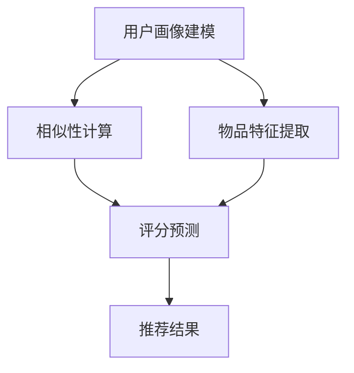

                 

# Python机器学习实战：构建并优化推荐系统的协同过滤模型

> 关键词：协同过滤, 推荐系统, 用户行为分析, 数据建模, 特征工程, 模型评估, 模型优化, 推荐算法

## 1. 背景介绍

### 1.1 问题由来

推荐系统是现代互联网产品中不可或缺的一部分。通过分析用户的浏览、点击、购买等行为数据，推荐系统可以为用户推荐他们可能感兴趣的商品、新闻、视频等，极大地提升用户满意度和转化率。在电商、视频、新闻等诸多行业，推荐系统已经成为用户获取信息的主要来源。

然而，推荐系统的开发与优化是一个极其复杂且耗时的过程。传统的推荐算法如基于内容的推荐和协同过滤推荐，虽然能够根据用户历史行为或物品属性进行推荐，但面对海量数据和复杂环境，其效果往往不尽如人意。为了提升推荐精度和推荐效率，研究人员在机器学习领域不断探索新的方法，协同过滤算法因此应运而生。

协同过滤算法是一种基于用户和物品之间的相似性的推荐方法。该方法通过分析用户对物品的评分数据，找到与目标用户兴趣相似的其他用户，再根据这些相似用户的评分数据，推荐目标用户可能感兴趣的物品。在实际应用中，协同过滤算法通常分为基于用户的协同过滤和基于物品的协同过滤两种方式。

## 2. 核心概念与联系

### 2.1 核心概念概述

协同过滤算法是一种典型的基于用户行为数据的推荐方法。其核心思想是通过分析用户对物品的评分数据，找到与目标用户兴趣相似的其他用户，再根据这些相似用户的评分数据，推荐目标用户可能感兴趣的物品。协同过滤算法主要分为以下两种：

- **基于用户的协同过滤**：找到与目标用户兴趣相似的其他用户，并根据这些相似用户对物品的评分数据，推荐目标用户可能感兴趣的物品。

- **基于物品的协同过滤**：找到与目标物品相似的其他物品，并根据这些相似物品被目标用户和其他用户的评分数据，推荐目标用户可能感兴趣的物品。

这些核心概念之间存在紧密的联系：

1. **相似性计算**：协同过滤算法的关键在于计算用户或物品之间的相似性。相似性度量可以基于用户的评分数据、物品的评分数据、用户兴趣标签等进行计算。

2. **用户画像建模**：协同过滤算法需要构建用户画像，即用户对不同物品的评分分布。用户画像建模可以从用户行为数据中提取有意义的特征，如用户的兴趣偏好、活动时间等。

3. **物品特征提取**：物品特征提取是将物品的原始属性转化为机器学习模型可以处理的特征向量。物品特征可以包括物品的类别、价格、品牌、图片等。

4. **评分预测**：协同过滤算法的最终目标是预测用户对物品的评分，并根据预测评分进行推荐。评分预测通常使用线性回归、逻辑回归、K近邻等机器学习模型进行。

5. **模型评估与优化**：模型评估与优化是协同过滤算法的核心部分。模型评估通常使用准确率、召回率、F1分数等指标进行衡量。模型优化可以通过特征工程、参数调优、模型集成等方法进行。

### 2.2 核心概念原理和架构的 Mermaid 流程图



该流程图展示了协同过滤算法的基本流程：首先进行用户画像建模和物品特征提取，然后使用相似性计算得到用户或物品的相似度，最后通过评分预测得到推荐结果。

## 3. 核心算法原理 & 具体操作步骤

### 3.1 算法原理概述

协同过滤算法的核心在于计算用户或物品之间的相似性。基于用户的协同过滤算法（User-based Collaborative Filtering）通常包括以下步骤：

1. 对用户对物品的评分数据进行预处理。
2. 计算用户之间的相似性，并根据相似度生成用户-用户矩阵。
3. 根据用户-用户矩阵，预测目标用户对目标物品的评分。
4. 将预测评分排序，得到推荐列表。

基于物品的协同过滤算法（Item-based Collaborative Filtering）通常包括以下步骤：

1. 对用户对物品的评分数据进行预处理。
2. 计算物品之间的相似性，并根据相似度生成物品-物品矩阵。
3. 根据物品-物品矩阵，预测目标物品对目标用户的评分。
4. 将预测评分排序，得到推荐列表。

### 3.2 算法步骤详解

#### 3.2.1 基于用户的协同过滤算法步骤

1. **数据预处理**：对用户对物品的评分数据进行预处理，如去除无效评分、处理缺失值等。

2. **相似性计算**：计算用户之间的相似性，可以使用余弦相似度、皮尔逊相关系数等方法。

3. **用户-用户矩阵构建**：将用户之间的相似性转化为矩阵形式，即用户-用户矩阵。

4. **评分预测**：根据用户-用户矩阵，预测目标用户对目标物品的评分。可以使用加权平均值等方法。

5. **推荐结果排序**：将预测评分排序，得到推荐列表。

#### 3.2.2 基于物品的协同过滤算法步骤

1. **数据预处理**：对用户对物品的评分数据进行预处理，如去除无效评分、处理缺失值等。

2. **相似性计算**：计算物品之间的相似性，可以使用余弦相似度、皮尔逊相关系数等方法。

3. **物品-物品矩阵构建**：将物品之间的相似性转化为矩阵形式，即物品-物品矩阵。

4. **评分预测**：根据物品-物品矩阵，预测目标物品对目标用户的评分。可以使用加权平均值等方法。

5. **推荐结果排序**：将预测评分排序，得到推荐列表。

### 3.3 算法优缺点

基于协同过滤算法的推荐系统具有以下优点：

1. **个性化推荐**：通过分析用户行为数据，能够为用户提供个性化的推荐，满足用户的个性化需求。
2. **高效性**：在数据量较大时，协同过滤算法相对简单高效，计算速度较快。
3. **鲁棒性**：协同过滤算法对数据稀疏性有较好的鲁棒性，即用户对物品的评分数据较少时，仍能进行有效的推荐。

同时，该算法也存在以下缺点：

1. **冷启动问题**：对于新用户或新物品，协同过滤算法无法进行推荐，需要进行冷启动处理。
2. **数据稀疏性**：用户和物品之间的评分数据往往存在稀疏性，即大部分用户或物品之间没有评分数据，导致推荐效果不佳。
3. **可解释性不足**：协同过滤算法的推荐结果通常难以解释，用户无法了解推荐的依据。
4. **不稳定性**：用户和物品之间的评分数据可能受到各种因素的影响，导致推荐结果不稳定。

### 3.4 算法应用领域

协同过滤算法在推荐系统中得到了广泛应用，适用于各种类型的推荐任务，例如：

- **电商推荐**：通过分析用户的购物行为，推荐用户可能感兴趣的商品。
- **视频推荐**：根据用户观看历史和评分数据，推荐用户可能感兴趣的视频。
- **新闻推荐**：根据用户阅读行为，推荐用户可能感兴趣的新闻文章。
- **音乐推荐**：根据用户听歌行为，推荐用户可能感兴趣的音乐。
- **电影推荐**：根据用户观影历史，推荐用户可能感兴趣的电影。

协同过滤算法还广泛应用于广告投放、个性化搜索、内容推荐等多个领域，为用户的个性化需求提供了强有力的支持。

## 4. 数学模型和公式 & 详细讲解 & 举例说明

### 4.1 数学模型构建

基于用户的协同过滤算法的数学模型可以表示为：

1. **用户-物品评分矩阵**：$U \in \mathbb{R}^{N \times M}$，其中$N$为物品数量，$M$为用户数量。

2. **用户-用户相似度矩阵**：$U_{uu} \in \mathbb{R}^{M \times M}$，其中$U_{uu_{ij}}$表示用户$i$和用户$j$的相似度。

3. **评分预测模型**：$P_{ui} \in \mathbb{R}^{1 \times M}$，其中$P_{ui}$表示用户$i$对物品$u$的预测评分。

基于物品的协同过滤算法的数学模型可以表示为：

1. **物品-物品评分矩阵**：$I \in \mathbb{R}^{M \times N}$，其中$M$为用户数量，$N$为物品数量。

2. **物品-物品相似度矩阵**：$I_{ii} \in \mathbb{R}^{N \times N}$，其中$I_{ii_{jk}}$表示物品$j$和物品$k$的相似度。

3. **评分预测模型**：$P_{iu} \in \mathbb{R}^{1 \times N}$，其中$P_{iu}$表示物品$u$对用户$i$的预测评分。

### 4.2 公式推导过程

#### 4.2.1 基于用户的协同过滤算法

假设用户$i$对物品$j$的评分表示为$U_{ij}$，用户$i$和用户$j$的相似度表示为$U_{uu_{ij}}$，用户$i$对物品$u$的预测评分表示为$P_{ui}$。

**相似度计算**：

$$
U_{uu_{ij}} = \text{similarity}(U_{ij}, U_{ji})
$$

其中，$\text{similarity}$为相似度计算函数，可以使用余弦相似度、皮尔逊相关系数等。

**评分预测**：

$$
P_{ui} = \sum_{j=1}^{M} U_{uu_{ij}} U_{ij}
$$

**推荐结果排序**：

$$
\text{rank}_{ui} = \text{sort}(P_{ui})
$$

#### 4.2.2 基于物品的协同过滤算法

假设物品$j$对用户$i$的评分表示为$I_{ij}$，物品$j$和物品$k$的相似度表示为$I_{ii_{jk}}$，物品$u$对用户$i$的预测评分表示为$P_{iu}$。

**相似度计算**：

$$
I_{ii_{jk}} = \text{similarity}(I_{ik}, I_{jk})
$$

其中，$\text{similarity}$为相似度计算函数，可以使用余弦相似度、皮尔逊相关系数等。

**评分预测**：

$$
P_{iu} = \sum_{j=1}^{N} I_{ii_{jk}} I_{jk}
$$

**推荐结果排序**：

$$
\text{rank}_{iu} = \text{sort}(P_{iu})
$$

### 4.3 案例分析与讲解

假设一个电商网站有一个用户$i$，他对物品$u_1$、$u_2$、$u_3$的评分分别为4、3、5，其他用户对物品$u_1$、$u_2$、$u_3$的评分如表1所示。

| 用户编号 | $u_1$ | $u_2$ | $u_3$ |
|----------|-------|-------|-------|
| 1        | 5     | 4     | 3     |
| 2        | 4     | 5     | 2     |
| 3        | 3     | 2     | 5     |

使用余弦相似度计算用户$i$和用户$j$的相似度$U_{uu_{ij}}$，得到如下相似度矩阵：

|        | 1      | 2      | 3      |
|--------|--------|--------|--------|
| 1      | 0.91   | 0.78   | 0.69   |
| 2      | 0.78   | 0.91   | 0.69   |
| 3      | 0.69   | 0.69   | 0.91   |

然后，使用加权平均值预测用户$i$对物品$u$的评分$P_{ui}$，得到如下评分矩阵：

| 物品编号 | $u_1$ | $u_2$ | $u_3$ |
|----------|-------|-------|-------|
| 用户1    | 4.5   | 3.8   | 3.9   |
| 用户2    | 3.8   | 4.5   | 3.3   |
| 用户3    | 3.9   | 3.3   | 4.5   |

最后，将预测评分进行排序，得到推荐列表。

## 5. 项目实践：代码实例和详细解释说明

### 5.1 开发环境搭建

在进行协同过滤模型实践前，我们需要准备好开发环境。以下是使用Python进行Pandas和Scikit-learn开发的开发环境配置流程：

1. 安装Anaconda：从官网下载并安装Anaconda，用于创建独立的Python环境。

2. 创建并激活虚拟环境：
```bash
conda create -n scikit-learn-env python=3.8 
conda activate scikit-learn-env
```

3. 安装必要的库：
```bash
pip install pandas scikit-learn joblib dask distributed
```

4. 安装Dask：
```bash
pip install dask
```

5. 安装分布式计算库：
```bash
pip install dask[ray] distributed
```

完成上述步骤后，即可在`scikit-learn-env`环境中开始协同过滤模型的实践。

### 5.2 源代码详细实现

这里我们以基于用户的协同过滤算法为例，使用Scikit-learn库实现协同过滤模型的开发。

首先，定义用户-物品评分矩阵和用户-用户相似度矩阵：

```python
import numpy as np
from sklearn.metrics.pairwise import cosine_similarity

# 用户-物品评分矩阵
U = np.array([[5, 4, 3],
              [4, 5, 2],
              [3, 2, 5]])

# 用户-用户相似度矩阵
U_uu = cosine_similarity(U)
```

然后，计算用户$i$对物品$u$的预测评分：

```python
# 计算评分预测
P = np.dot(U_uu, U)
```

最后，将预测评分排序，得到推荐列表：

```python
# 排序推荐结果
rank = np.argsort(P)[:, 0][::-1]

# 输出推荐列表
for i in range(U.shape[0]):
    print(f"User {i+1} Recommendations: {U[i][rank[:5]].tolist()}")
```

### 5.3 代码解读与分析

让我们再详细解读一下关键代码的实现细节：

**用户-物品评分矩阵和用户-用户相似度矩阵的创建**：

```python
import numpy as np
from sklearn.metrics.pairwise import cosine_similarity

# 用户-物品评分矩阵
U = np.array([[5, 4, 3],
              [4, 5, 2],
              [3, 2, 5]])

# 用户-用户相似度矩阵
U_uu = cosine_similarity(U)
```

这里使用了NumPy库创建了一个3x3的用户-物品评分矩阵U，并使用Scikit-learn的cosine_similarity函数计算了用户-用户相似度矩阵U_uu。

**评分预测的计算**：

```python
# 计算评分预测
P = np.dot(U_uu, U)
```

这里使用了NumPy的dot函数，将用户-用户相似度矩阵U_uu和用户-物品评分矩阵U相乘，得到用户对物品的预测评分矩阵P。

**推荐结果排序**：

```python
# 排序推荐结果
rank = np.argsort(P)[:, 0][::-1]

# 输出推荐列表
for i in range(U.shape[0]):
    print(f"User {i+1} Recommendations: {U[i][rank[:5]].tolist()}")
```

这里使用了NumPy的argsort函数，对预测评分矩阵P进行排序，得到推荐列表rank。然后，将推荐列表输出到控制台。

可以看到，代码实现相对简洁，易于理解。结合Scikit-learn库的强大封装能力，协同过滤模型的开发变得非常简单高效。

## 6. 实际应用场景

### 6.1 智能推荐系统

协同过滤算法是智能推荐系统的核心技术之一。在电商、视频、新闻等多个领域，智能推荐系统已经成为用户获取信息的主要来源。

在电商领域，智能推荐系统通过分析用户的购物行为，推荐用户可能感兴趣的商品。例如，用户A最近购买了一款手机，智能推荐系统可以根据用户A的购物历史和用户A对其他商品的评分，推荐用户A可能感兴趣的其他商品。

在视频领域，智能推荐系统根据用户观看历史和评分数据，推荐用户可能感兴趣的视频。例如，用户B最近观看了多部科幻类电影，智能推荐系统可以根据用户B的观看历史和评分数据，推荐用户B可能感兴趣的科幻类电影。

在新闻领域，智能推荐系统根据用户阅读行为，推荐用户可能感兴趣的新闻文章。例如，用户C最近关注了科技类新闻，智能推荐系统可以根据用户C的阅读历史和评分数据，推荐用户C可能感兴趣的科技类新闻。

### 6.2 广告推荐系统

广告推荐系统通过分析用户的浏览和点击行为，向用户推荐可能感兴趣的广告。协同过滤算法在广告推荐系统中也有广泛应用。

例如，某电商网站的用户D最近浏览了多个服饰类商品，广告推荐系统可以根据用户D的浏览历史和评分数据，推荐用户D可能感兴趣的服饰类广告。

### 6.3 内容推荐系统

内容推荐系统通过分析用户的阅读、观看、听歌等行为，推荐用户可能感兴趣的内容。协同过滤算法在内容推荐系统中也有广泛应用。

例如，某视频网站的用户E最近观看了多部体育类视频，内容推荐系统可以根据用户E的观看历史和评分数据，推荐用户E可能感兴趣的体育类视频。

## 7. 工具和资源推荐

### 7.1 学习资源推荐

为了帮助开发者系统掌握协同过滤算法的理论基础和实践技巧，这里推荐一些优质的学习资源：

1. 《推荐系统实践》系列博文：由大模型技术专家撰写，深入浅出地介绍了推荐系统的基础概念、协同过滤算法、深度学习推荐算法等。

2. Coursera《Machine Learning》课程：斯坦福大学开设的经典机器学习课程，有Lecture视频和配套作业，涵盖协同过滤算法等推荐系统基础内容。

3. 《Python数据科学手册》书籍：由知名数据科学家编写，详细介绍了Python数据科学生态系统，包括Scikit-learn库的使用。

4. Kaggle平台：提供了大量的推荐系统数据集和竞赛项目，可以通过实践学习协同过滤算法等推荐系统技术。

5. Scikit-learn官方文档：Scikit-learn库的官方文档，提供了详细的协同过滤算法样例代码和文档。

通过对这些资源的学习实践，相信你一定能够快速掌握协同过滤算法的精髓，并用于解决实际的推荐系统问题。

### 7.2 开发工具推荐

高效的开发离不开优秀的工具支持。以下是几款用于协同过滤模型开发的常用工具：

1. Python：Python语言具有简单易学、开源免费等优点，是推荐系统开发的主要语言。

2. Pandas：Pandas库提供了高效的数据处理和分析能力，是推荐系统数据预处理的重要工具。

3. Scikit-learn：Scikit-learn库提供了丰富的机器学习算法和模型，包括协同过滤算法等。

4. Dask：Dask库提供了分布式计算能力，可以处理大规模数据集，加速协同过滤算法的训练和推理。

5. Ray：Ray库提供了分布式计算框架，支持大规模并行计算，优化协同过滤算法的训练过程。

6. Apache Spark：Apache Spark是一个快速通用的大数据处理引擎，提供了丰富的分布式计算功能，可以用于协同过滤算法的分布式训练。

合理利用这些工具，可以显著提升协同过滤模型的开发效率，加快创新迭代的步伐。

### 7.3 相关论文推荐

协同过滤算法在推荐系统中已经得到了广泛的研究，以下是几篇奠基性的相关论文，推荐阅读：

1. "Collaborative Filtering for Implicit Feedback Datasets"（SIGIR'07）：本文提出了基于矩阵分解的协同过滤算法，可以处理稀疏评分数据，成为协同过滤算法的经典之作。

2. "Adaptive Collaborative Filtering using Matrix Factorization Techniques"（IEEE TKDE'06）：本文提出了自适应协同过滤算法，通过引入矩阵分解技术，提高了协同过滤算法的推荐效果。

3. "Personalized PageRank for Recommender Systems"（SDM'09）：本文提出了个性化PageRank算法，结合PageRank算法和协同过滤算法，提升了推荐系统的个性化程度。

4. "Item-Based Collaborative Filtering Recommendation Algorithm"（JSAI 2010）：本文提出了基于物品的协同过滤算法，通过分析物品之间的相似性进行推荐，提高了推荐系统的鲁棒性。

5. "Hybrid Recommendation System: A Comprehensive Survey"（WSDM'16）：本文综述了多种协同过滤算法，包括基于用户的协同过滤、基于物品的协同过滤、基于模型的协同过滤等，提供了丰富的协同过滤算法实现参考。

这些论文代表了大数据推荐系统的研究脉络。通过学习这些前沿成果，可以帮助研究者把握学科前进方向，激发更多的创新灵感。

## 8. 总结：未来发展趋势与挑战

### 8.1 研究成果总结

协同过滤算法在推荐系统中得到了广泛应用，适用于各种类型的推荐任务。协同过滤算法的核心在于计算用户或物品之间的相似性，通过分析用户对物品的评分数据，找到与目标用户兴趣相似的其他用户或物品，并根据这些相似用户或物品的评分数据，推荐目标用户或物品可能感兴趣的物品。

协同过滤算法具有个性化推荐、高效性、鲁棒性等优点，但也面临冷启动问题、数据稀疏性、可解释性不足、不稳定性等挑战。

### 8.2 未来发展趋势

展望未来，协同过滤算法将在以下几个方面发展：

1. **深度学习融合**：将深度学习技术引入协同过滤算法，提升推荐精度和模型泛化能力。

2. **多模态数据融合**：将文本、图像、音频等多模态数据引入协同过滤算法，提升推荐系统的综合性。

3. **分布式计算**：利用分布式计算技术，处理大规模数据集，加速协同过滤算法的训练和推理。

4. **实时推荐**：通过在线学习算法，实现实时推荐，满足用户的即时需求。

5. **用户行为分析**：利用深度学习技术，对用户行为进行建模，提升推荐系统的个性化程度。

6. **模型优化**：结合特征工程、模型集成等技术，优化协同过滤算法，提升推荐效果。

### 8.3 面临的挑战

尽管协同过滤算法已经取得了一定的成果，但在迈向更加智能化、普适化应用的过程中，它仍面临以下挑战：

1. **数据稀疏性**：协同过滤算法依赖评分数据，对于评分数据稀疏的情况，推荐效果不佳。

2. **冷启动问题**：对于新用户或新物品，协同过滤算法无法进行推荐，需要进行冷启动处理。

3. **可解释性不足**：协同过滤算法的推荐结果难以解释，用户无法了解推荐的依据。

4. **不稳定性**：协同过滤算法的推荐结果可能受到评分数据的影响，不具有稳定性。

5. **计算资源消耗大**：协同过滤算法的训练和推理过程计算资源消耗较大，需要优化计算效率。

6. **安全性问题**：协同过滤算法的推荐结果可能受到恶意用户的干扰，需要提高推荐系统的安全性。

### 8.4 研究展望

面对协同过滤算法面临的挑战，未来的研究需要在以下几个方面寻求新的突破：

1. **稀疏数据处理**：通过引入数据增强、深度学习等技术，处理评分数据稀疏性问题，提升推荐效果。

2. **冷启动处理**：通过引入矩阵分解、深度学习等技术，解决冷启动问题，提高推荐系统的覆盖率。

3. **推荐结果解释**：通过引入可解释性模型，提供推荐结果的解释和依据，增强用户对推荐系统的信任。

4. **稳定性提升**：通过引入在线学习算法、自适应算法等技术，提高推荐结果的稳定性。

5. **计算效率优化**：通过引入分布式计算、高效算法等技术，优化计算效率，提升推荐系统的实时性。

6. **安全性保障**：通过引入安全机制、监控机制等技术，保障推荐系统的安全性，防止恶意用户干扰。

这些研究方向的探索，必将引领协同过滤算法走向更高的台阶，为推荐系统的发展提供更广阔的空间。面向未来，协同过滤算法还需要与其他推荐算法、机器学习技术进行更深入的融合，共同推动推荐系统的进步。只有勇于创新、敢于突破，才能不断拓展推荐系统的边界，让推荐技术更好地造福人类社会。

## 9. 附录：常见问题与解答

**Q1：协同过滤算法是否适用于所有推荐系统？**

A: 协同过滤算法在推荐系统中得到了广泛应用，适用于各种类型的推荐任务。但在某些特定领域，如新闻、社交网络等，协同过滤算法可能无法取得理想的效果。此时可以考虑引入其他推荐算法，如基于内容的推荐、基于关联规则的推荐等。

**Q2：协同过滤算法如何处理数据稀疏性问题？**

A: 协同过滤算法依赖评分数据，对于评分数据稀疏的情况，推荐效果不佳。以下是几种处理数据稀疏性问题的方法：

1. **矩阵分解**：将评分矩阵分解为两个低秩矩阵的乘积，通过矩阵分解技术处理数据稀疏性问题。

2. **深度学习**：利用深度学习技术，对评分数据进行建模，提升推荐系统的泛化能力。

3. **数据增强**：通过回译、近义替换等方式扩充训练集，增加数据样本的数量。

4. **信息过滤**：使用信息过滤技术，过滤掉噪声数据，减少数据稀疏性的影响。

**Q3：协同过滤算法的推荐结果是否具有稳定性？**

A: 协同过滤算法的推荐结果可能受到评分数据的影响，不具有稳定性。以下是几种提高推荐结果稳定性的方法：

1. **在线学习**：通过在线学习算法，实时更新模型，避免历史数据对推荐结果的影响。

2. **自适应算法**：通过自适应算法，调整模型的参数，提高推荐结果的稳定性。

3. **混合推荐**：结合多种推荐算法，提升推荐系统的稳定性。

**Q4：协同过滤算法的推荐结果是否可解释？**

A: 协同过滤算法的推荐结果通常难以解释，用户无法了解推荐的依据。以下是几种提高推荐结果可解释性的方法：

1. **基于规则的推荐**：通过引入规则，提供推荐结果的解释和依据。

2. **知识图谱**：利用知识图谱，提供推荐结果的解释和依据。

3. **可解释性模型**：通过可解释性模型，提供推荐结果的解释和依据。

**Q5：协同过滤算法如何处理冷启动问题？**

A: 协同过滤算法对于新用户或新物品，无法进行推荐，需要进行冷启动处理。以下是几种处理冷启动问题的方法：

1. **基线推荐**：使用基线推荐算法，如基于内容的推荐、随机推荐等，解决冷启动问题。

2. **协同过滤预训练**：使用协同过滤算法对新用户或新物品进行预训练，提升推荐效果。

3. **社交网络**：利用社交网络信息，对新用户或新物品进行推荐。

**Q6：协同过滤算法如何优化计算效率？**

A: 协同过滤算法的计算资源消耗较大，需要优化计算效率。以下是几种优化计算效率的方法：

1. **分布式计算**：利用分布式计算技术，处理大规模数据集，加速协同过滤算法的训练和推理。

2. **高效算法**：使用高效算法，如矩阵分解、在线学习等技术，优化计算效率。

3. **模型裁剪**：对协同过滤模型进行裁剪，减少模型的计算量和存储空间。

**Q7：协同过滤算法如何提高安全性？**

A: 协同过滤算法的推荐结果可能受到恶意用户的干扰，需要提高推荐系统的安全性。以下是几种提高推荐系统安全性的方法：

1. **访问控制**：使用访问控制技术，防止恶意用户对推荐系统的干扰。

2. **数据脱敏**：使用数据脱敏技术，保护用户隐私。

3. **监控告警**：设置异常告警阈值，实时监控推荐系统的行为，防止恶意行为。

**Q8：协同过滤算法如何处理多模态数据？**

A: 协同过滤算法通常只处理文本评分数据，对于多模态数据，需要处理不同模态数据之间的关系。以下是几种处理多模态数据的方法：

1. **数据融合**：将不同模态的数据进行融合，生成新的特征向量。

2. **联合建模**：将不同模态的数据进行联合建模，生成新的推荐结果。

3. **多任务学习**：利用多任务学习技术，对不同模态的数据进行建模，生成新的推荐结果。

这些方法可以帮助协同过滤算法处理多模态数据，提升推荐系统的综合性。

---

作者：禅与计算机程序设计艺术 / Zen and the Art of Computer Programming

