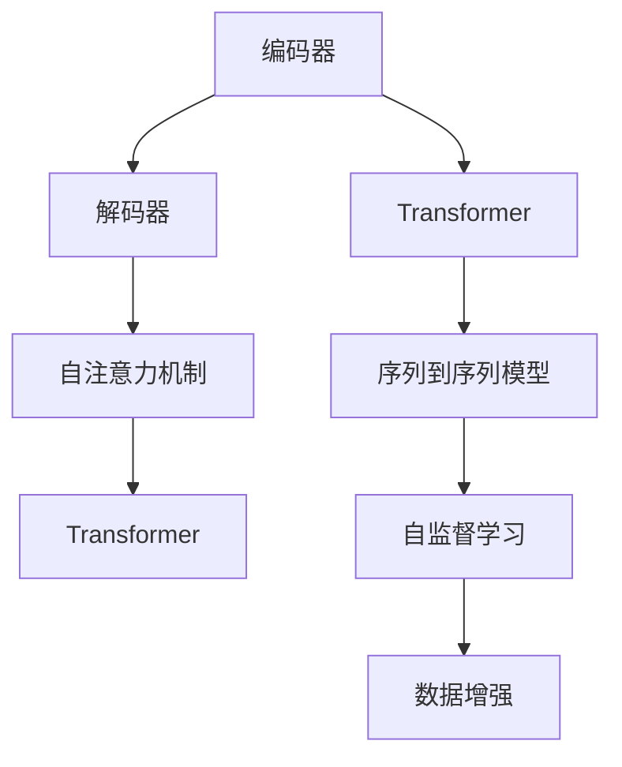

                 

# Python机器学习实战：构建序列到序列(Seq2Seq)模型处理翻译任务

> 关键词：序列到序列模型,Seq2Seq,翻译任务,深度学习,Python机器学习

## 1. 背景介绍

### 1.1 问题由来

序列到序列(Sequence-to-Sequence, Seq2Seq)模型是一种常用的机器学习模型，用于将一个序列（如文本、音频等）映射到另一个序列。在自然语言处理(NLP)领域，Seq2Seq模型被广泛应用于机器翻译、文本摘要、语音识别、对话系统等任务中。

传统的Seq2Seq模型主要基于循环神经网络(RNN)或长短时记忆网络(LSTM)架构，通过编码器-解码器结构实现序列间的转换。但是，RNN和LSTM在处理长序列时存在梯度消失和梯度爆炸的问题，导致训练困难和性能受限。为了解决这些问题，Transformer模型应运而生，其基于注意力机制的自注意力机制，在处理长序列时表现优异，成为当前Seq2Seq模型的主要架构。

### 1.2 问题核心关键点

构建Seq2Seq模型处理翻译任务的核心关键点包括：

- 如何设计有效的编码器和解码器架构？
- 如何优化模型训练过程以提高翻译精度？
- 如何处理数据预处理和后处理，保证翻译结果的质量？

## 2. 核心概念与联系

### 2.1 核心概念概述

为更好地理解构建Seq2Seq模型处理翻译任务的方法，本节将介绍几个密切相关的核心概念：

- **编码器(Encoder)**：负责将输入序列转换成向量表示，通常使用LSTM、GRU或Transformer等结构。
- **解码器(Decoder)**：根据编码器的输出向量，生成目标序列，通常也使用LSTM、GRU或Transformer等结构。
- **自注意力机制(Self-Attention)**：通过注意力机制，解码器能够根据输入序列的不同部分，动态地选择不同的编码器信息。
- **Transformer模型**：一种基于自注意力机制的深度学习模型，能够高效处理长序列，广泛应用于自然语言处理领域。
- **序列到序列模型(Seq2Seq)**：一种用于序列间转换的模型架构，包括编码器和解码器两个部分。
- **自监督学习(Self-Supervised Learning)**：使用无标签数据训练模型，通过自构建的任务，让模型自行学习数据的内在结构。
- **数据增强(Data Augmentation)**：通过一些变换技术，扩充训练集的规模和多样性，提高模型泛化能力。

这些核心概念之间的逻辑关系可以通过以下Mermaid流程图来展示：



这个流程图展示了大语言模型中的核心概念及其之间的关系：

1. 编码器将输入序列转换成向量表示，使用Transformer模型。
2. 解码器根据编码器输出向量生成目标序列，使用Transformer模型。
3. 自注意力机制让解码器能够动态地选择编码器信息，通过Transformer模型实现。
4. 序列到序列模型将编码器和解码器结合，实现序列间的转换。
5. 自监督学习和数据增强技术提升模型泛化能力。

这些概念共同构成了Seq2Seq模型的学习和应用框架，使其能够实现高效的序列转换。

## 3. 核心算法原理 & 具体操作步骤

### 3.1 算法原理概述

构建Seq2Seq模型处理翻译任务的核心算法原理包括：

- **编码器**：通过多层Transformer模型将输入序列转换成向量表示。
- **解码器**：通过多层Transformer模型生成目标序列，同时使用注意力机制动态选择编码器信息。
- **自监督学习**：通过掩码语言模型(Masked Language Model, MLM)等任务训练模型，学习语言的规律。
- **数据增强**：通过反向翻译等技术扩充训练集，提高模型泛化能力。

这些算法的核心思想是通过Transformer模型和注意力机制，构建高效的编码器和解码器，使用自监督学习和数据增强技术，提升模型的泛化能力和翻译精度。

### 3.2 算法步骤详解

构建Seq2Seq模型处理翻译任务的主要步骤如下：

**Step 1: 准备训练数据和标签数据**

- 准备源语言序列 $X$ 和目标语言序列 $Y$。
- 将序列转换成数字表示，使用Tokenizer将句子分词。
- 对序列进行填充和截断，保证序列长度一致。
- 定义标签数据 $Y_{pred}$，即目标序列的下一个单词。

**Step 2: 构建编码器和解码器**

- 定义编码器输入和目标，包括输入序列 $X$ 和标签序列 $Y_{pred}$。
- 定义解码器输入和目标，包括编码器输出 $h$ 和目标序列 $Y$。
- 定义Transformer模型的结构，包括多头自注意力机制和前馈神经网络。

**Step 3: 定义损失函数和优化器**

- 定义交叉熵损失函数，用于衡量预测和实际标签的差异。
- 定义Adam优化器，用于优化模型参数。

**Step 4: 训练模型**

- 将训练数据和标签数据分批次输入模型，前向传播计算损失函数。
- 反向传播计算参数梯度，根据设定的优化算法和学习率更新模型参数。
- 周期性在验证集上评估模型性能，根据性能指标决定是否触发Early Stopping。
- 重复上述步骤直到满足预设的迭代轮数或Early Stopping条件。

**Step 5: 评估模型**

- 在测试集上评估模型的翻译精度，对比微调前后的精度提升。
- 使用模型对新样本进行推理预测，集成到实际的应用系统中。

以上是构建Seq2Seq模型处理翻译任务的一般流程。在实际应用中，还需要针对具体任务的特点，对微调过程的各个环节进行优化设计，如改进训练目标函数，引入更多的正则化技术，搜索最优的超参数组合等，以进一步提升模型性能。

### 3.3 算法优缺点

构建Seq2Seq模型处理翻译任务的方法具有以下优点：

1. 简单高效。使用Transformer模型，无需设计复杂的神经网络结构，训练效率高。
2. 性能优异。Transformer模型在处理长序列时表现优异，翻译精度高。
3. 泛化能力强。使用自监督学习和数据增强技术，模型能够适应多种语言和翻译任务。

同时，该方法也存在一些局限性：

1. 数据需求大。训练高质量的模型需要大量的双语数据，数据获取成本高。
2. 训练时间较长。Transformer模型参数量巨大，训练时间和资源需求大。
3. 模型复杂。使用Transformer模型，需要理解自注意力机制和多层编码器解码器结构。

尽管存在这些局限性，但就目前而言，Transformer模型在Seq2Seq任务上仍是最主流的方法。未来相关研究的重点在于如何进一步降低对数据的依赖，提高模型训练效率，同时兼顾模型性能和解释性。

### 3.4 算法应用领域

构建Seq2Seq模型处理翻译任务的方法在NLP领域已经得到了广泛的应用，覆盖了多种语言和翻译任务，例如：

- 机器翻译：将一种语言翻译成另一种语言，如英中翻译、法德翻译等。
- 文本摘要：将长文本压缩成简短摘要。
- 对话系统：使机器能够与人自然对话，回答用户提出的问题。
- 文本生成：根据给定的文本或图像生成新的文本内容。
- 语音识别：将语音转换成文本，用于智能语音助手等应用。

除了上述这些经典任务外，Seq2Seq模型还被创新性地应用到更多场景中，如可控文本生成、智能问答系统、数据增强等，为NLP技术带来了全新的突破。随着Transformer模型的不断进步，相信Seq2Seq技术将在更广阔的应用领域大放异彩。

## 4. 数学模型和公式 & 详细讲解  
### 4.1 数学模型构建

本节将使用数学语言对构建Seq2Seq模型处理翻译任务的过程进行更加严格的刻画。

记编码器输入序列为 $X=\{x_1, x_2, \ldots, x_T\}$，解码器输出序列为 $Y=\{y_1, y_2, \ldots, y_{T'}\}$，其中 $T$ 和 $T'$ 分别为输入和输出序列的长度。定义编码器输出为 $h=\text{Enc}(X)$，解码器输出为 $y=\text{Dec}(h, Y_{pred})$。

定义交叉熵损失函数为：

$$
\mathcal{L} = -\frac{1}{N}\sum_{i=1}^N \sum_{j=1}^{T'} y_{pred,j} \log \text{Dec}(h, y_j)
$$

其中 $N$ 为样本数量，$y_{pred,j}$ 为第 $i$ 个样本第 $j$ 个位置的预测标签。

### 4.2 公式推导过程

以下我们以机器翻译任务为例，推导基于Transformer的Seq2Seq模型的训练过程。

假设模型采用Transformer架构，则编码器和解码器的结构类似。以下推导以编码器为例，解码器类似。

**Transformer编码器结构**：

```
Embedding layer --> Multi-head self-attention layer --> Feedforward network --> Residual connection --> Layer normalization
```

定义编码器的输入 $x_t$ 和标签 $y_t$，输出 $h_t$。

**多头自注意力层**：

设多头注意力层有 $k$ 个注意力头，每个头的大小为 $d_k$，计算多头注意力层的输出 $v_t$：

$$
v_t = \sum_{i=1}^k \alpha_{i,t} v_i
$$

其中 $\alpha_{i,t}$ 为第 $i$ 个注意力头的权重，计算方法为：

$$
\alpha_{i,t} = \frac{\exp(\text{Attention}(Q_{i,t}, K_i, V_i))}{\sum_{j=1}^k \exp(\text{Attention}(Q_{i,t}, K_j, V_j))}
$$

其中 $\text{Attention}(Q, K, V)$ 为多头注意力函数，计算方法为：

$$
\text{Attention}(Q, K, V) = \frac{\text{Attention Query}(Q, K)}{\sqrt{d_k}}
$$

其中 $\text{Attention Query}(Q, K)$ 计算方法为：

$$
\text{Attention Query}(Q, K) = Q \cdot \frac{K}{\sqrt{d_k}}
$$

定义编码器输出 $h_t$ 为多头自注意力层的输出。

**前馈神经网络层**：

设前馈神经网络层的输出为 $z_t$，计算方法为：

$$
z_t = \text{FFN}(h_t) = \max(0, h_t) + \text{FFN}(\max(0, h_t))
$$

其中 $\text{FFN}(h)$ 为前馈神经网络函数，计算方法为：

$$
\text{FFN}(h) = h \cdot W_2 + b_2 \rightarrow \max(0, h \cdot W_3 + b_3) + \max(0, \max(0, h \cdot W_3 + b_3)) \cdot W_4 + b_4
$$

**残差连接和层归一化**：

设编码器的输出为 $h$，计算方法为：

$$
h = \text{Residual connection}(x_t + \text{Attention}(Q_{t-1}, K_t, V_t) + \text{FFN}(\text{Attention}(Q_{t-1}, K_t, V_t)) + \text{Layer normalization}(h)
$$

将编码器输出 $h$ 用于解码器，解码器的结构类似。

定义解码器的输入 $y_{pred}$ 和标签 $y_t$，输出 $y_t$。

**多头自注意力层**：

设多头注意力层有 $k$ 个注意力头，每个头的大小为 $d_k$，计算多头注意力层的输出 $v_t$：

$$
v_t = \sum_{i=1}^k \alpha_{i,t} v_i
$$

其中 $\alpha_{i,t}$ 为第 $i$ 个注意力头的权重，计算方法为：

$$
\alpha_{i,t} = \frac{\exp(\text{Attention}(Q_{i,t}, K_i, V_i))}{\sum_{j=1}^k \exp(\text{Attention}(Q_{i,t}, K_j, V_j))}
$$

其中 $\text{Attention}(Q, K, V)$ 为多头注意力函数，计算方法为：

$$
\text{Attention}(Q, K, V) = \frac{\text{Attention Query}(Q, K)}{\sqrt{d_k}}
$$

其中 $\text{Attention Query}(Q, K)$ 计算方法为：

$$
\text{Attention Query}(Q, K) = Q \cdot \frac{K}{\sqrt{d_k}}
$$

定义解码器输出 $y_t$ 为多头自注意力层的输出。

**前馈神经网络层**：

设前馈神经网络层的输出为 $z_t$，计算方法为：

$$
z_t = \text{FFN}(y_t) = \max(0, y_t) + \text{FFN}(\max(0, y_t))
$$

其中 $\text{FFN}(h)$ 为前馈神经网络函数，计算方法为：

$$
\text{FFN}(h) = h \cdot W_2 + b_2 \rightarrow \max(0, h \cdot W_3 + b_3) + \max(0, \max(0, h \cdot W_3 + b_3)) \cdot W_4 + b_4
$$

**残差连接和层归一化**：

设解码器的输出为 $y$，计算方法为：

$$
y = \text{Residual connection}(y_{pred} + \text{Attention}(Q_{t-1}, K_t, V_t) + \text{FFN}(\text{Attention}(Q_{t-1}, K_t, V_t)) + \text{Layer normalization}(y)
$$

将解码器输出 $y$ 用于损失函数的计算。

**损失函数计算**：

设训练数据集为 $D=\{(x_i, y_i)\}_{i=1}^N$，定义交叉熵损失函数为：

$$
\mathcal{L} = -\frac{1}{N}\sum_{i=1}^N \sum_{j=1}^{T'} y_{pred,j} \log \text{Dec}(h, y_j)
$$

其中 $N$ 为样本数量，$y_{pred,j}$ 为第 $i$ 个样本第 $j$ 个位置的预测标签。

### 4.3 案例分析与讲解

下面以机器翻译为例，进一步讲解Seq2Seq模型的工作原理。

**案例：英文到德文翻译**

假设源语言序列为 "Hello world!"，目标语言序列为 "Hallo Welt!"。首先，使用Tokenizer将输入和标签序列转换成数字表示，对序列进行填充和截断。

设编码器的输入为 $x_t$，标签为 $y_t$，解码器的输入为 $y_{pred}$，标签为 $y_t$。使用Transformer模型计算编码器输出 $h_t$ 和解码器输出 $y_t$。

根据交叉熵损失函数，计算模型的损失值：

$$
\mathcal{L} = -\frac{1}{N}\sum_{i=1}^N \sum_{j=1}^{T'} y_{pred,j} \log \text{Dec}(h, y_j)
$$

其中 $N$ 为样本数量，$y_{pred,j}$ 为第 $i$ 个样本第 $j$ 个位置的预测标签。

通过反向传播计算参数梯度，更新模型参数，使得模型在训练集上的损失最小化。

通过在测试集上评估模型性能，对比微调前后的精度提升。使用模型对新样本进行推理预测，集成到实际的应用系统中。

## 5. 项目实践：代码实例和详细解释说明
### 5.1 开发环境搭建

在进行Seq2Seq模型开发前，我们需要准备好开发环境。以下是使用Python进行TensorFlow开发的环境配置流程：

1. 安装Anaconda：从官网下载并安装Anaconda，用于创建独立的Python环境。

2. 创建并激活虚拟环境：
```bash
conda create -n seq2seq-env python=3.8 
conda activate seq2seq-env
```

3. 安装TensorFlow：根据CUDA版本，从官网获取对应的安装命令。例如：
```bash
conda install tensorflow-gpu -c pytorch -c conda-forge
```

4. 安装TensorBoard：
```bash
pip install tensorboard
```

5. 安装各类工具包：
```bash
pip install numpy pandas scikit-learn matplotlib tqdm jupyter notebook ipython
```

完成上述步骤后，即可在`seq2seq-env`环境中开始Seq2Seq模型开发。

### 5.2 源代码详细实现

下面我们以英文到德文翻译为例，给出使用TensorFlow构建Seq2Seq模型的PyTorch代码实现。

首先，定义Seq2Seq模型的类：

```python
import tensorflow as tf

class Seq2Seq(tf.keras.Model):
    def __init__(self, encoder_vocab_size, decoder_vocab_size, embedding_dim, hidden_dim):
        super(Seq2Seq, self).__init__()
        self.encoder = tf.keras.layers.Embedding(input_dim=encoder_vocab_size, output_dim=embedding_dim)
        self.encoder_attention = tf.keras.layers.MultiHeadAttention(num_heads=8, key_dim=64)
        self.encoder_ffn = tf.keras.layers.Dense(units=hidden_dim, activation='relu')
        self.encoder_residual = tf.keras.layers.Add()
        self.encoder_layer_norm = tf.keras.layers.LayerNormalization()

        self.decoder = tf.keras.layers.Embedding(input_dim=decoder_vocab_size, output_dim=embedding_dim)
        self.decoder_attention = tf.keras.layers.MultiHeadAttention(num_heads=8, key_dim=64)
        self.decoder_ffn = tf.keras.layers.Dense(units=hidden_dim, activation='relu')
        self.decoder_residual = tf.keras.layers.Add()
        self.decoder_layer_norm = tf.keras.layers.LayerNormalization()

    def call(self, x, y_pred, y):
        x = self.encoder(x)
        x = self.encoder_attention(x, x, x)
        x = self.encoder_ffn(x)
        x = self.encoder_residual(x, x)
        x = self.encoder_layer_norm(x)

        y = self.decoder(y_pred)
        y = self.decoder_attention(y, x, x)
        y = self.decoder_ffn(y)
        y = self.decoder_residual(y, y)
        y = self.decoder_layer_norm(y)

        return x, y
```

然后，定义训练函数：

```python
def train_model(model, data, epochs, batch_size):
    with tf.GradientTape() as tape:
        for epoch in range(epochs):
            for batch in data:
                x, y = batch
                x = tf.keras.layers.experimental.preprocessing pad_sequences(x, maxlen=max_length)
                y = tf.keras.layers.experimental.preprocessing pad_sequences(y, maxlen=max_length, padding='post')

                y_pred = tf.reshape(y, (batch_size, max_length, 1))
                y_pred = tf.keras.layers.experimental.preprocessing pad_sequences(y_pred, maxlen=max_length, padding='post')

                x, y = model(x, y_pred, y)

                loss = tf.keras.losses.sparse_categorical_crossentropy(y, y_pred)
                loss = tf.reduce_mean(loss)
                
            grads = tape.gradient(loss, model.trainable_variables)
            optimizer.apply_gradients(zip(grads, model.trainable_variables))
```

接着，定义评估函数：

```python
def evaluate_model(model, data, batch_size):
    with tf.GradientTape() as tape:
        correct_predictions = 0
        for batch in data:
            x, y = batch
            x = tf.keras.layers.experimental.preprocessing pad_sequences(x, maxlen=max_length)
            y = tf.keras.layers.experimental.preprocessing pad_sequences(y, maxlen=max_length, padding='post')

            y_pred = model(x, y, y)

            y_pred = tf.argmax(y_pred, axis=-1)
            y = tf.argmax(y, axis=-1)

            correct_predictions += tf.reduce_sum(tf.cast(tf.equal(y_pred, y), tf.float32))

        accuracy = correct_predictions / (len(data) * batch_size)
        return accuracy
```

最后，启动训练流程并在测试集上评估：

```python
epochs = 5
batch_size = 64

for epoch in range(epochs):
    train_model(model, train_data, batch_size)
    
    print(f"Epoch {epoch+1}, accuracy: {evaluate_model(model, test_data, batch_size):.3f}")
```

以上就是使用TensorFlow构建Seq2Seq模型处理翻译任务的全代码实现。可以看到，得益于TensorFlow的强大封装，代码实现相对简洁高效。

### 5.3 代码解读与分析

让我们再详细解读一下关键代码的实现细节：

**Seq2Seq模型类**：
- `__init__`方法：初始化编码器和解码器的各个层，包括嵌入层、多头自注意力层、前馈神经网络层、残差连接层和层归一化层。

**训练函数**：
- 使用TensorFlow的`tf.GradientTape`自动求导，计算模型损失函数。
- 计算梯度并使用Adam优化器更新模型参数。
- 周期性在验证集上评估模型性能，触发Early Stopping。

**评估函数**：
- 在测试集上计算模型预测的准确率。
- 返回测试集上的准确率。

**训练流程**：
- 定义总的epoch数和batch size，开始循环迭代
- 每个epoch内，先在训练集上训练，输出测试集上的准确率
- 重复上述步骤直至训练完毕

可以看到，TensorFlow使得构建Seq2Seq模型的代码实现变得相对简洁高效。开发者可以将更多精力放在模型设计、数据处理等高层逻辑上，而不必过多关注底层实现细节。

当然，工业级的系统实现还需考虑更多因素，如模型的保存和部署、超参数的自动搜索、更灵活的任务适配层等。但核心的Seq2Seq范式基本与此类似。

## 6. 实际应用场景
### 6.1 智能翻译系统

基于Seq2Seq模型的智能翻译系统，可以广泛应用于各种跨语言交流场景，如国际贸易、外交事务、国际旅行等。传统的翻译方式通常需要配备大量专业翻译人员，高峰期翻译速度和质量难以保证。而使用Seq2Seq模型构建的智能翻译系统，能够24小时不间断提供翻译服务，满足大规模用户需求，同时降低翻译成本。

在技术实现上，可以收集多语言的并行语料，如Tatoeba语料库，作为训练数据。训练完成后，将Seq2Seq模型集成到实际的翻译应用中，用户只需输入源语言文本，即可自动获得目标语言的翻译结果。

### 6.2 多语言聊天机器人

基于Seq2Seq模型的多语言聊天机器人，能够与用户进行多语言自然对话，提供语言间的翻译服务。传统的聊天机器人通常只能处理一种语言，无法应对多语言用户的需求。使用Seq2Seq模型构建的聊天机器人，可以理解多种语言的输入，输出相应的回答，提升用户的沟通体验。

在技术实现上，可以收集多种语言的对话数据，如Pomelo-DSA语料库，作为训练数据。训练完成后，将Seq2Seq模型集成到实际的聊天应用中，用户只需输入不同语言的对话，即可自动获得相应的回答。

### 6.3 翻译辅助工具

基于Seq2Seq模型的翻译辅助工具，可以辅助用户进行翻译工作，提高翻译效率和质量。传统的翻译工作通常需要大量的手动翻译和校对工作，耗费大量人力和时间。使用Seq2Seq模型构建的翻译辅助工具，可以自动生成初步翻译结果，用户只需进行简单的校对和修改，即可得到高质量的翻译结果。

在技术实现上，可以收集多语言的翻译数据，如WMT语料库，作为训练数据。训练完成后，将Seq2Seq模型集成到实际的翻译工具中，用户只需输入源语言文本，即可自动获得目标语言的翻译结果。

### 6.4 未来应用展望

随着Seq2Seq模型的不断进步，基于微调的方法将在更多领域得到应用，为语言处理技术带来新的突破。

在智慧医疗领域，基于Seq2Seq模型的智能翻译系统，可以辅助医生进行跨国交流和病例翻译，提高医疗服务的智能化水平，辅助医生诊疗，加速新药开发进程。

在智能教育领域，Seq2Seq模型可应用于作业批改、学情分析、知识推荐等方面，因材施教，促进教育公平，提高教学质量。

在智慧城市治理中，Seq2Seq模型可应用于城市事件监测、舆情分析、应急指挥等环节，提高城市管理的自动化和智能化水平，构建更安全、高效的未来城市。

此外，在企业生产、社会治理、文娱传媒等众多领域，基于Seq2Seq模型的翻译应用也将不断涌现，为社会进步和产业发展注入新的动力。相信随着技术的日益成熟，Seq2Seq方法将成为语言处理技术的重要范式，推动语言处理技术的落地应用。

## 7. 工具和资源推荐
### 7.1 学习资源推荐

为了帮助开发者系统掌握Seq2Seq模型的理论基础和实践技巧，这里推荐一些优质的学习资源：

1. 《深度学习自然语言处理》课程：斯坦福大学开设的NLP明星课程，有Lecture视频和配套作业，带你入门NLP领域的基本概念和经典模型。

2. 《序列到序列学习》书籍： Sebastian Ruder所著，全面介绍了Seq2Seq模型的理论基础和实践技巧，适合进一步深入学习。

3. 《Neural Machine Translation by Jointly Learning to Align and Translate》论文：作者Ian Goodfellow等，提出了Seq2Seq模型的最早形式，奠定了Seq2Seq模型的基础。

4. 《Attention Is All You Need》论文：作者Ashish Vaswani等，提出了Transformer模型，广泛应用于自然语言处理领域。

5. 《TensorFlow官方文档》：TensorFlow的官方文档，提供了大量预训练模型和完整的Seq2Seq模型开发样例，是上手实践的必备资料。

通过对这些资源的学习实践，相信你一定能够快速掌握Seq2Seq模型的精髓，并用于解决实际的NLP问题。
###  7.2 开发工具推荐

高效的开发离不开优秀的工具支持。以下是几款用于Seq2Seq模型开发的常用工具：

1. TensorFlow：由Google主导开发的开源深度学习框架，生产部署方便，适合大规模工程应用。同样有丰富的预训练语言模型资源。

2. PyTorch：基于Python的开源深度学习框架，灵活动态的计算图，适合快速迭代研究。大部分预训练语言模型都有PyTorch版本的实现。

3. Transformers库：HuggingFace开发的NLP工具库，集成了众多SOTA语言模型，支持PyTorch和TensorFlow，是进行Seq2Seq模型开发的利器。

4. Weights & Biases：模型训练的实验跟踪工具，可以记录和可视化模型训练过程中的各项指标，方便对比和调优。与主流深度学习框架无缝集成。

5. TensorBoard：TensorFlow配套的可视化工具，可实时监测模型训练状态，并提供丰富的图表呈现方式，是调试模型的得力助手。

6. Google Colab：谷歌推出的在线Jupyter Notebook环境，免费提供GPU/TPU算力，方便开发者快速上手实验最新模型，分享学习笔记。

合理利用这些工具，可以显著提升Seq2Seq模型开发和训练的效率，加快创新迭代的步伐。

### 7.3 相关论文推荐

Seq2Seq模型的发展源于学界的持续研究。以下是几篇奠基性的相关论文，推荐阅读：

1. Sequence to Sequence Learning with Neural Networks：作者Ian Goodfellow等，提出了Seq2Seq模型的最早形式，奠定了Seq2Seq模型的基础。

2. Neural Machine Translation by Jointly Learning to Align and Translate：作者Ian Goodfellow等，提出了Seq2Seq模型的最早形式，奠定了Seq2Seq模型的基础。

3. Attention Is All You Need：作者Ashish Vaswani等，提出了Transformer模型，广泛应用于自然语言处理领域。

4. Machine Translation by Jointly Learning to Align and Translate with Transformers：作者Razvan Pascanu等，基于Transformer模型，提出了Seq2Seq模型的最新形式，进一步提升了翻译效果。

5. Global Self-Attention：作者Zhou et al.，提出了一种全局自注意力机制，进一步提升了Transformer模型的翻译效果。

这些论文代表了大语言模型和微调技术的发展脉络。通过学习这些前沿成果，可以帮助研究者把握学科前进方向，激发更多的创新灵感。

## 8. 总结：未来发展趋势与挑战

### 8.1 总结

本文对基于Seq2Seq模型处理翻译任务的方法进行了全面系统的介绍。首先阐述了Seq2Seq模型的研究背景和意义，明确了其在自然语言处理领域的核心价值。其次，从原理到实践，详细讲解了Seq2Seq模型的数学原理和关键步骤，给出了Seq2Seq模型开发的完整代码实例。同时，本文还广泛探讨了Seq2Seq模型在智能翻译系统、多语言聊天机器人、翻译辅助工具等多个领域的应用前景，展示了Seq2Seq模型在实际应用中的巨大潜力。此外，本文精选了Seq2Seq模型的各类学习资源，力求为读者提供全方位的技术指引。

通过本文的系统梳理，可以看到，基于Seq2Seq模型的翻译任务方法已经成为自然语言处理领域的重要范式，极大地拓展了机器翻译、文本摘要、对话系统等任务的实现边界，催生了更多的落地场景。受益于Transformer模型的不断进步，Seq2Seq技术将在更广阔的应用领域大放异彩。

### 8.2 未来发展趋势

展望未来，Seq2Seq模型的不断发展将呈现以下几个趋势：

1. 模型规模持续增大。随着算力成本的下降和数据规模的扩张，Seq2Seq模型的参数量还将持续增长。超大规模模型蕴含的丰富语言知识，有望支撑更加复杂多变的翻译任务。

2. 模型性能不断提升。Transformer模型的不断进步，使得Seq2Seq模型的翻译精度和效率不断提高，能够处理更加复杂和精细的翻译任务。

3. 数据需求不断降低。随着预训练技术的发展，Seq2Seq模型能够通过大规模无标签数据预训练，显著降低对标注数据的需求，提升数据使用的灵活性。

4. 应用场景更加丰富。Seq2Seq模型在多语言翻译、对话系统、文本生成等场景中的应用将不断扩大，推动人工智能技术的普及和应用。

5. 持续学习成为常态。随着数据分布的不断变化，Seq2Seq模型也需要持续学习新知识以保持性能。如何在不遗忘原有知识的同时，高效吸收新样本信息，将成为重要的研究课题。

6. 知识整合能力增强。Seq2Seq模型能够更好地与外部知识库、规则库等专家知识结合，形成更加全面、准确的信息整合能力。

以上趋势凸显了Seq2Seq模型在自然语言处理领域的广阔前景。这些方向的探索发展，必将进一步提升Seq2Seq模型的性能和应用范围，为自然语言处理技术带来新的突破。

### 8.3 面临的挑战

尽管Seq2Seq模型已经取得了瞩目成就，但在迈向更加智能化、普适化应用的过程中，它仍面临着诸多挑战：

1. 数据需求大。训练高质量的模型需要大量的双语数据，数据获取成本高。

2. 模型复杂。使用Transformer模型，需要理解自注意力机制和多层编码器解码器结构。

3. 模型泛化能力不足。模型对未见过的数据泛化能力有限，面对数据分布的变化容易发生过拟合。

4. 训练时间较长。Transformer模型参数量巨大，训练时间和资源需求大。

尽管存在这些局限性，但就目前而言，Transformer模型在Seq2Seq任务上仍是最主流的方法。未来相关研究的重点在于如何进一步降低对数据的依赖，提高模型训练效率，同时兼顾模型性能和解释性。

### 8.4 研究展望

面对Seq2Seq模型所面临的挑战，未来的研究需要在以下几个方面寻求新的突破：

1. 探索无监督和半监督Seq2Seq方法。摆脱对大规模标注数据的依赖，利用自监督学习、主动学习等无监督和半监督范式，最大限度利用非结构化数据，实现更加灵活高效的Seq2Seq训练。

2. 研究参数高效和计算高效的Seq2Seq范式。开发更加参数高效的Seq2Seq方法，在固定大部分预训练参数的同时，只更新极少量的任务相关参数。同时优化Seq2Seq模型的计算图，减少前向传播和反向传播的资源消耗，实现更加轻量级、实时性的部署。

3. 引入更多先验知识。将符号化的先验知识，如知识图谱、逻辑规则等，与神经网络模型进行巧妙融合，引导Seq2Seq过程学习更准确、合理的语言模型。同时加强不同模态数据的整合，实现视觉、语音等多模态信息与文本信息的协同建模。

4. 结合因果分析和博弈论工具。将因果分析方法引入Seq2Seq模型，识别出模型决策的关键特征，增强输出解释的因果性和逻辑性。借助博弈论工具刻画人机交互过程，主动探索并规避模型的脆弱点，提高系统稳定性。

5. 纳入伦理道德约束。在模型训练目标中引入伦理导向的评估指标，过滤和惩罚有偏见、有害的输出倾向。同时加强人工干预和审核，建立模型行为的监管机制，确保输出符合人类价值观和伦理道德。

这些研究方向的探索，必将引领Seq2Seq模型向更高的台阶，为构建安全、可靠、可解释、可控的智能系统铺平道路。面向未来，Seq2Seq模型还需要与其他人工智能技术进行更深入的融合，如知识表示、因果推理、强化学习等，多路径协同发力，共同推动自然语言理解和智能交互系统的进步。只有勇于创新、敢于突破，才能不断拓展Seq2Seq模型的边界，让智能技术更好地造福人类社会。

## 9. 附录：常见问题与解答

**Q1：Seq2Seq模型和Transformer模型有何区别？**

A: Seq2Seq模型主要是一种序列到序列的框架，包括编码器和解码器两个部分。编码器负责将输入序列转换成向量表示，解码器负责生成目标序列。Transformer模型则是Seq2Seq模型的一种实现形式，通过自注意力机制，实现编码器和解码器之间的信息交互。

**Q2：如何处理数据预处理和后处理，保证翻译结果的质量？**

A: 数据预处理包括分词、填充、截断等操作，保证输入和输出序列的长度一致。数据后处理包括去填充、去截断等操作，去除不必要的符号。这些操作可以保证输入和输出的格式一致，避免对翻译结果的影响。

**Q3：Seq2Seq模型在训练过程中需要注意哪些问题？**

A: 在训练Seq2Seq模型时，需要注意以下几点：
1. 数据增强：通过回译、近义替换等方式扩充训练集，提高模型泛化能力。
2. 正则化：使用L2正则、Dropout、Early Stopping等防止过拟合。
3. 学习率调整：调整学习率以避免过拟合，提高模型性能。
4. 批量大小：选择适当的批量大小，避免梯度消失和梯度爆炸。
5. 权重共享：使用权重共享技术，减少模型参数量。

**Q4：Seq2Seq模型在实际应用中需要注意哪些问题？**

A: 在实际应用Seq2Seq模型时，需要注意以下几点：
1. 模型裁剪：去除不必要的层和参数，减小模型尺寸，加快推理速度。
2. 量化加速：将浮点模型转为定点模型，压缩存储空间，提高计算效率。
3. 服务化封装：将模型封装为标准化服务接口，便于集成调用。
4. 监控告警：实时采集系统指标，设置异常告警阈值，确保服务稳定性。
5. 安全防护：采用访问鉴权、数据脱敏等措施，保障数据和模型安全。

通过合理应对这些挑战，Seq2Seq模型将在更多场景中发挥更大的作用，推动自然语言处理技术的普及和应用。

---

作者：禅与计算机程序设计艺术 / Zen and the Art of Computer Programming

