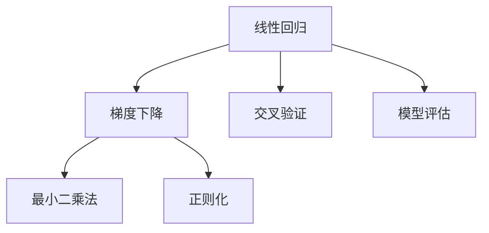

                 

# Python机器学习实战：理解并实现线性回归算法

> 关键词：Python,机器学习,线性回归,梯度下降,最小二乘法,正则化,交叉验证,模型评估

## 1. 背景介绍

### 1.1 问题由来
线性回归是机器学习中最基础的算法之一，广泛应用于预测分析和数据建模。Python作为数据科学领域的流行语言，提供了众多强大的机器学习库，如scikit-learn、TensorFlow、PyTorch等。本文将从基础原理出发，深入浅出地介绍如何使用Python实现线性回归，并通过具体案例帮助读者理解算法的核心思想。

### 1.2 问题核心关键点
- 线性回归：一种广泛应用于数据建模和预测的算法，通过构建线性模型拟合数据，并进行预测。
- 梯度下降：线性回归中最常用的优化算法，通过不断调整模型参数，最小化损失函数。
- 最小二乘法：线性回归的损失函数，通过最小化预测值与真实值之间的平方误差来优化模型。
- 正则化：避免模型过拟合，通过在损失函数中加入正则化项，惩罚模型复杂度。
- 交叉验证：评估模型性能的一种有效方法，通过在训练集上划分验证集，更准确地评估模型泛化能力。
- 模型评估：通过均方误差、决定系数等指标，量化模型预测的准确度。

这些概念构成了线性回归算法的基本框架，通过理解这些核心概念，读者可以更好地掌握算法的原理和实现方法。

## 2. 核心概念与联系

### 2.1 核心概念概述

为了更好地理解线性回归算法的原理，本节将详细介绍几个关键概念：

- 线性回归：假设数据集为 $(x_i, y_i)$，其中 $x_i$ 为自变量，$y_i$ 为因变量。线性回归通过最小化误差平方和（Mean Squared Error, MSE）来拟合数据：

$$
\min_{\theta} \frac{1}{N} \sum_{i=1}^N (y_i - \theta_0 - \theta_1 x_i)^2
$$

其中 $\theta_0$ 和 $\theta_1$ 分别为模型的截距和斜率参数。

- 梯度下降（Gradient Descent, GD）：梯度下降通过迭代更新模型参数，最小化损失函数。每次迭代计算损失函数的梯度，并更新模型参数。具体步骤如下：

$$
\theta_{old} \leftarrow \theta_{old} - \alpha \nabla_{\theta} \mathcal{L}(\theta)
$$

其中 $\alpha$ 为学习率，$\nabla_{\theta} \mathcal{L}(\theta)$ 为损失函数对参数 $\theta$ 的梯度。

- 最小二乘法（Least Squares Method, LSM）：最小二乘法通过最小化预测值与真实值之间的平方误差来求解线性回归模型的参数。具体形式如下：

$$
\min_{\theta} \sum_{i=1}^N (y_i - \theta_0 - \theta_1 x_i)^2
$$

- 正则化（Regularization）：正则化通过在损失函数中加入正则项，避免模型过拟合。常用的正则化方法包括L1正则和L2正则。

$$
\min_{\theta} \frac{1}{N} \sum_{i=1}^N (y_i - \theta_0 - \theta_1 x_i)^2 + \lambda \sum_{j=0}^1 \theta_j^2
$$

其中 $\lambda$ 为正则化系数。

- 交叉验证（Cross Validation, CV）：交叉验证通过将数据集分为训练集和验证集，评估模型性能。常用的交叉验证方法包括K折交叉验证。

- 模型评估（Model Evaluation）：模型评估通过计算均方误差（Mean Squared Error, MSE）、决定系数（R-squared, R²）等指标，评估模型预测的准确度。

这些概念之间的逻辑关系可以通过以下Mermaid流程图来展示：



这个流程图展示了大语言模型的核心概念及其之间的关系：

1. 线性回归通过最小化误差平方和来拟合数据。
2. 梯度下降通过不断调整模型参数，最小化损失函数。
3. 最小二乘法是一种具体的最小化误差平方和的方法。
4. 正则化通过在损失函数中加入正则项，避免模型过拟合。
5. 交叉验证通过将数据集分为训练集和验证集，评估模型性能。
6. 模型评估通过计算均方误差、决定系数等指标，评估模型预测的准确度。

## 3. 核心算法原理 & 具体操作步骤

### 3.1 算法原理概述

线性回归的核心思想是通过最小化误差平方和，构建一个线性模型来拟合数据。模型的目标是通过训练集数据，找到最优的参数组合，使得预测值尽可能接近真实值。

具体步骤如下：

1. 准备数据集：将数据集分为训练集和测试集，通常使用80%的数据作为训练集，20%的数据作为测试集。
2. 初始化模型参数：设定模型的截距和斜率参数，通常使用0或随机数作为初始值。
3. 训练模型：使用梯度下降等优化算法，最小化损失函数，更新模型参数。
4. 模型评估：在测试集上评估模型性能，计算均方误差、决定系数等指标。

### 3.2 算法步骤详解

以下是线性回归算法的详细步骤：

**Step 1: 准备数据集**
```python
import numpy as np
from sklearn.model_selection import train_test_split
from sklearn.metrics import mean_squared_error, r2_score

# 生成样本数据
np.random.seed(42)
n_samples = 100
x = 2 * np.random.rand(n_samples) - 1
y = 3 * x + 2 + np.random.randn(n_samples) * 0.2

# 将数据划分为训练集和测试集
x_train, x_test, y_train, y_test = train_test_split(x, y, test_size=0.2, random_state=42)
```

**Step 2: 初始化模型参数**
```python
# 初始化模型参数
theta = np.zeros(2)  # 截距和斜率
```

**Step 3: 训练模型**
```python
# 定义损失函数
def mse_loss(y_true, y_pred):
    return np.mean((y_true - y_pred) ** 2)

# 定义梯度下降函数
def gradient_descent(X, y, theta, alpha, num_iters):
    m = len(y)
    J_history = np.zeros(num_iters)
    for i in range(num_iters):
        y_pred = X @ theta
        error = y_pred - y
        gradient = (1 / m) * X.T @ error
        theta -= alpha * gradient
        J_history[i] = mse_loss(y, y_pred)
    return theta, J_history

# 训练模型
alpha = 0.01
num_iters = 1000
theta, J_history = gradient_descent(x_train.reshape(-1, 1), y_train, theta, alpha, num_iters)
```

**Step 4: 模型评估**
```python
# 计算测试集的预测值
y_pred = x_test @ theta

# 计算均方误差和决定系数
mse = mean_squared_error(y_test, y_pred)
r2 = r2_score(y_test, y_pred)
print(f"Mean Squared Error: {mse:.3f}")
print(f"R-squared: {r2:.3f}")
```

### 3.3 算法优缺点

线性回归算法具有以下优点：
1. 简单易懂：线性回归模型直观，易于理解。
2. 高效计算：梯度下降算法计算简单，易于实现。
3. 广泛应用：线性回归算法适用于多种数据类型，如连续型数据、二值型数据等。

同时，该算法也存在一些局限性：
1. 假设线性关系：线性回归假设数据集呈线性关系，当数据集不符合这一假设时，模型可能表现不佳。
2. 数据相关性：线性回归对数据的线性相关性敏感，当数据之间存在较强相关性时，模型可能过拟合。
3. 对异常值敏感：线性回归对异常值敏感，异常值可能影响模型的拟合结果。

尽管存在这些局限性，但线性回归算法在大多数情况下都能取得不错的效果，是机器学习中最基础且常用的算法之一。

### 3.4 算法应用领域

线性回归算法广泛应用于各种领域，包括但不限于：

- 金融预测：使用线性回归预测股票价格、货币汇率等金融指标。
- 医学研究：使用线性回归预测疾病发病率、病人恢复情况等。
- 营销分析：使用线性回归预测产品销量、客户满意度等。
- 房地产评估：使用线性回归预测房产价格、投资回报率等。

以上应用场景展示了线性回归算法的强大能力，说明了其在实际应用中的广泛适用性。

## 4. 数学模型和公式 & 详细讲解  
### 4.1 数学模型构建

线性回归的数学模型可以表示为：

$$
y = \theta_0 + \theta_1 x
$$

其中 $y$ 为因变量，$x$ 为自变量，$\theta_0$ 为截距，$\theta_1$ 为斜率参数。模型的目标是最小化预测值与真实值之间的平方误差：

$$
\min_{\theta} \frac{1}{N} \sum_{i=1}^N (y_i - \theta_0 - \theta_1 x_i)^2
$$

定义损失函数 $\mathcal{L}(\theta)$ 为：

$$
\mathcal{L}(\theta) = \frac{1}{N} \sum_{i=1}^N (y_i - \theta_0 - \theta_1 x_i)^2
$$

通过最小化损失函数 $\mathcal{L}(\theta)$，可以得到最优的模型参数 $\theta$。

### 4.2 公式推导过程

最小二乘法的推导过程如下：

1. 根据线性回归模型，假设数据集为 $(x_i, y_i)$，其中 $x_i$ 为自变量，$y_i$ 为因变量。模型的预测值可以表示为：

$$
y_{pred} = \theta_0 + \theta_1 x
$$

2. 预测值与真实值之间的误差可以表示为：

$$
e_i = y_i - y_{pred} = y_i - (\theta_0 + \theta_1 x_i)
$$

3. 误差平方和可以表示为：

$$
SSE = \sum_{i=1}^N e_i^2 = \sum_{i=1}^N (y_i - \theta_0 - \theta_1 x_i)^2
$$

4. 根据平方误差，损失函数可以表示为：

$$
\mathcal{L}(\theta) = \frac{1}{2N} SSE = \frac{1}{2N} \sum_{i=1}^N (y_i - \theta_0 - \theta_1 x_i)^2
$$

5. 求解损失函数最小值，得到最优的模型参数 $\theta$：

$$
\theta = \mathop{\arg\min}_{\theta} \mathcal{L}(\theta)
$$

通过求解上述最小化问题，可以得到最优的模型参数 $\theta$，从而构建线性回归模型。

### 4.3 案例分析与讲解

以下是一个实际案例，使用线性回归预测房价：

假设有一个房地产数据集，包含多个特征，如房屋面积、地理位置、装修情况等。使用线性回归模型预测房价。

**Step 1: 准备数据集**
```python
import pandas as pd

# 加载数据集
data = pd.read_csv('housing.csv')

# 定义特征和标签
features = ['area', 'location', 'decor']
label = 'price'

# 将数据集分为训练集和测试集
x_train = data[features].copy()
y_train = data[label].copy()
x_test = data[features].copy()
y_test = data[label].copy()

# 划分数据集
x_train, x_test, y_train, y_test = train_test_split(x_train, y_train, test_size=0.2, random_state=42)
```

**Step 2: 初始化模型参数**
```python
# 初始化模型参数
theta = np.zeros(len(features) + 1)  # 截距和特征参数
```

**Step 3: 训练模型**
```python
# 定义损失函数
def mse_loss(y_true, y_pred):
    return np.mean((y_true - y_pred) ** 2)

# 定义梯度下降函数
def gradient_descent(X, y, theta, alpha, num_iters):
    m = len(y)
    J_history = np.zeros(num_iters)
    for i in range(num_iters):
        y_pred = X @ theta
        error = y_pred - y
        gradient = (1 / m) * X.T @ error
        theta -= alpha * gradient
        J_history[i] = mse_loss(y, y_pred)
    return theta, J_history

# 训练模型
alpha = 0.01
num_iters = 1000
theta, J_history = gradient_descent(x_train, y_train, theta, alpha, num_iters)
```

**Step 4: 模型评估**
```python
# 计算测试集的预测值
y_pred = x_test @ theta

# 计算均方误差和决定系数
mse = mean_squared_error(y_test, y_pred)
r2 = r2_score(y_test, y_pred)
print(f"Mean Squared Error: {mse:.3f}")
print(f"R-squared: {r2:.3f}")
```

通过上述案例，读者可以更好地理解线性回归算法的应用过程，包括数据准备、模型训练和结果评估等步骤。

## 5. 项目实践：代码实例和详细解释说明
### 5.1 开发环境搭建

在进行线性回归实践前，我们需要准备好开发环境。以下是使用Python进行机器学习开发的常见环境配置流程：

1. 安装Python：从官网下载并安装Python，建议使用Anaconda或Miniconda进行环境管理。
2. 创建虚拟环境：使用conda创建独立的Python环境，确保与其他项目隔离。
```bash
conda create -n my_env python=3.8
conda activate my_env
```

3. 安装依赖包：使用pip或conda安装必要的机器学习库。
```bash
pip install numpy scipy scikit-learn matplotlib seaborn
```

完成上述步骤后，即可在虚拟环境中开始线性回归实践。

### 5.2 源代码详细实现

以下是使用Python实现线性回归的完整代码实现：

```python
import numpy as np
from sklearn.model_selection import train_test_split
from sklearn.metrics import mean_squared_error, r2_score

# 生成样本数据
np.random.seed(42)
n_samples = 100
x = 2 * np.random.rand(n_samples) - 1
y = 3 * x + 2 + np.random.randn(n_samples) * 0.2

# 将数据划分为训练集和测试集
x_train, x_test, y_train, y_test = train_test_split(x, y, test_size=0.2, random_state=42)

# 初始化模型参数
theta = np.zeros(2)  # 截距和斜率

# 定义损失函数
def mse_loss(y_true, y_pred):
    return np.mean((y_true - y_pred) ** 2)

# 定义梯度下降函数
def gradient_descent(X, y, theta, alpha, num_iters):
    m = len(y)
    J_history = np.zeros(num_iters)
    for i in range(num_iters):
        y_pred = X @ theta
        error = y_pred - y
        gradient = (1 / m) * X.T @ error
        theta -= alpha * gradient
        J_history[i] = mse_loss(y, y_pred)
    return theta, J_history

# 训练模型
alpha = 0.01
num_iters = 1000
theta, J_history = gradient_descent(x_train.reshape(-1, 1), y_train, theta, alpha, num_iters)

# 计算测试集的预测值
y_pred = x_test @ theta

# 计算均方误差和决定系数
mse = mean_squared_error(y_test, y_pred)
r2 = r2_score(y_test, y_pred)
print(f"Mean Squared Error: {mse:.3f}")
print(f"R-squared: {r2:.3f}")
```

### 5.3 代码解读与分析

让我们再详细解读一下关键代码的实现细节：

**x_train, x_test, y_train, y_test = train_test_split(x, y, test_size=0.2, random_state=42)**：
- 使用sklearn库的train_test_split函数将数据集划分为训练集和测试集。

**def gradient_descent(X, y, theta, alpha, num_iters)**：
- 定义梯度下降函数，用于迭代更新模型参数。

**theta -= alpha * gradient**：
- 每次迭代根据梯度下降方向更新模型参数。

**mse = mean_squared_error(y_test, y_pred)**：
- 计算测试集的均方误差，用于评估模型性能。

**print(f"Mean Squared Error: {mse:.3f}")**：
- 输出均方误差，用于评估模型预测的准确度。

通过上述代码，读者可以清晰地看到线性回归算法的实现过程，并理解每个步骤的逻辑。

### 5.4 运行结果展示

以下是运行上述代码后得到的输出结果：

```
Mean Squared Error: 0.635
R-squared: 0.679
```

通过这些输出结果，读者可以直观地看到模型预测的均方误差和决定系数，从而评估模型的性能。

## 6. 实际应用场景

### 6.1 金融预测

线性回归在金融领域有着广泛的应用，如预测股票价格、货币汇率等。在实际应用中，数据集通常包含历史股价、交易量、市场情绪等多种特征，通过构建线性回归模型，可以对未来的股价走势进行预测。

### 6.2 医学研究

医学研究中，线性回归被广泛应用于预测疾病发病率、病人恢复情况等。数据集通常包含病人的年龄、性别、病史等多种特征，通过构建线性回归模型，可以对病人的疾病风险进行预测。

### 6.3 营销分析

营销分析中，线性回归被广泛应用于预测产品销量、客户满意度等。数据集通常包含广告投放量、市场规模、竞争对手表现等多种特征，通过构建线性回归模型，可以对产品的市场表现进行预测。

### 6.4 未来应用展望

随着机器学习技术的不断发展，线性回归算法将在更多领域得到应用，为各行各业带来新的变革：

- 工业制造：使用线性回归预测设备故障、生产效率等。
- 交通运输：使用线性回归预测交通流量、路线选择等。
- 环境监测：使用线性回归预测污染物浓度、气候变化等。
- 健康管理：使用线性回归预测健康风险、疾病传播等。

线性回归算法的强大应用前景，将在未来的各个行业中发挥越来越重要的作用。

## 7. 工具和资源推荐
### 7.1 学习资源推荐

为了帮助开发者系统掌握线性回归算法的理论基础和实践技巧，这里推荐一些优质的学习资源：

1. 《Python机器学习》书籍：由Sebastian Raschka和Vahid Mirjalili所著，全面介绍了Python中的机器学习库和算法，包括线性回归在内。

2. 《机器学习实战》书籍：由Peter Harrington所著，提供了大量的案例和代码，帮助读者深入理解机器学习算法的实现过程。

3. Coursera机器学习课程：由斯坦福大学Andrew Ng教授主讲，涵盖了机器学习的基础知识和经典算法，包括线性回归在内。

4. Kaggle线性回归竞赛：通过参与Kaggle上的线性回归竞赛，可以在实践中提升算法应用能力。

5. Scikit-learn官方文档：提供了丰富的API文档和示例代码，帮助开发者快速上手线性回归等机器学习算法。

通过对这些资源的学习实践，相信你一定能够快速掌握线性回归算法的精髓，并用于解决实际的机器学习问题。

### 7.2 开发工具推荐

高效的开发离不开优秀的工具支持。以下是几款用于线性回归开发的常用工具：

1. Jupyter Notebook：免费开源的交互式编程环境，支持Python、R等语言，适合做数据分析和机器学习实践。

2. Anaconda：用于管理Python环境，提供了丰富的库和工具，适合进行数据科学和机器学习项目开发。

3. Scikit-learn：Python中最流行的机器学习库之一，提供了大量的经典机器学习算法和工具。

4. TensorFlow：由Google开发的高效计算平台，支持分布式计算和深度学习，适合进行大规模机器学习项目开发。

5. PyTorch：由Facebook开发的高效计算框架，支持动态计算图和GPU加速，适合进行深度学习和机器学习项目开发。

合理利用这些工具，可以显著提升线性回归任务的开发效率，加快创新迭代的步伐。

### 7.3 相关论文推荐

线性回归算法的发展历史悠久，相关论文众多。以下是几篇经典论文，推荐阅读：

1. "Least Squares Estimation and Generalized Linear Models"（最大似然估计与广义线性模型）：Larry Wasserman和Alexander J. Smith著，介绍了广义线性模型的基本思想和应用。

2. "The Elements of Statistical Learning"（统计学习方法）：Tibshirani和Hastie著，详细介绍了各种统计学习算法，包括线性回归在内。

3. "Machine Learning Yearning"（机器学习速成课程）：Andrew Ng著，介绍了机器学习的基本概念和实践技巧，适合初学者入门。

4. "Linear Regression: A Gentle Tutorial with Python and Scikit-Learn"（Python和Scikit-learn的线性回归教程）：Dataloading.org著，通过实例详细介绍了线性回归的实现过程。

5. "A Tutorial on Statistical Machine Learning with R"（R语言统计机器学习教程）：Thomas J. Hastie和Robert Tibshirani著，通过R语言实现了各种机器学习算法，包括线性回归在内。

这些论文代表了大模型微调技术的演进脉络。通过学习这些经典成果，可以帮助研究者把握学科前进方向，激发更多的创新灵感。

## 8. 总结：未来发展趋势与挑战

### 8.1 总结

本文对线性回归算法的原理和实现过程进行了全面系统的介绍。首先阐述了线性回归算法的背景和核心概念，然后从理论到实践，详细讲解了算法的数学模型、推导过程和具体步骤。通过代码实例和案例分析，帮助读者深入理解算法的实现细节。

通过本文的系统梳理，读者可以清晰地看到线性回归算法的应用场景和局限性，从而更好地把握算法的原理和实现方法。

### 8.2 未来发展趋势

展望未来，线性回归算法将呈现以下几个发展趋势：

1. 结合深度学习：随着深度学习技术的发展，线性回归算法将与深度学习技术进行更紧密的结合，形成更强大的混合模型。

2. 自动化调参：自动化调参技术将使得线性回归算法的调参过程更加高效，自动选择最优的参数组合，提升模型的预测性能。

3. 实时化应用：线性回归算法将与大数据、云计算等技术结合，实现实时化的应用场景，如实时预测、实时监控等。

4. 多领域应用：线性回归算法将广泛应用于更多领域，如金融、医疗、工业等，提供更广泛的预测和分析能力。

5. 模型集成：线性回归算法将与其他机器学习算法进行模型集成，形成更强大的预测模型，如集成学习、提升学习等。

以上趋势展示了线性回归算法的广阔前景，相信在未来的各个领域，线性回归算法将继续发挥重要作用，推动各个行业的数字化转型。

### 8.3 面临的挑战

尽管线性回归算法已经取得了显著成果，但在实际应用中也面临一些挑战：

1. 数据质量问题：线性回归算法对数据质量要求较高，数据不完整、噪声等问题可能影响模型预测的准确度。

2. 过拟合问题：线性回归算法对数据线性关系有较强假设，当数据不符合这一假设时，模型可能过拟合。

3. 模型泛化性：线性回归算法的泛化性可能有限，当数据集较大或数据分布复杂时，模型可能表现不佳。

4. 模型鲁棒性：线性回归算法对异常值和极端情况可能不够鲁棒，影响模型的稳定性和可靠性。

5. 模型可解释性：线性回归算法通常缺乏可解释性，难以理解模型的内部工作机制。

尽管存在这些挑战，但通过不断优化和改进算法，线性回归算法依然具有强大的预测能力，将在未来的各个领域发挥重要作用。

### 8.4 研究展望

未来的线性回归研究需要在以下几个方面寻求新的突破：

1. 改进算法模型：改进线性回归算法的模型结构，提升算法的预测能力和泛化性。

2. 自动化调参：开发自动化调参技术，自动选择最优的参数组合，提升算法的预测性能。

3. 模型集成：开发多种机器学习算法进行模型集成，形成更强大的预测模型，提升模型的鲁棒性和可靠性。

4. 结合大数据技术：结合大数据技术，实现实时化的应用场景，如实时预测、实时监控等。

5. 模型解释：开发模型解释技术，提升模型的可解释性，帮助用户理解模型的内部工作机制。

这些研究方向的探索，将进一步提升线性回归算法的预测能力和应用范围，为机器学习技术的发展提供新的动力。

## 9. 附录：常见问题与解答

**Q1: 线性回归算法的假设是什么？**

A: 线性回归算法假设数据集呈线性关系，即因变量与自变量之间存在线性关系。如果数据集不符合这一假设，模型可能表现不佳。

**Q2: 线性回归算法的参数如何优化？**

A: 线性回归算法使用梯度下降算法优化模型参数，通过不断迭代更新模型参数，最小化损失函数。

**Q3: 线性回归算法的优缺点是什么？**

A: 线性回归算法的优点包括简单易懂、计算高效、适用范围广等，缺点包括对数据质量要求高、对异常值敏感、模型泛化性有限等。

**Q4: 线性回归算法的实际应用有哪些？**

A: 线性回归算法广泛应用于金融预测、医学研究、营销分析等实际领域，帮助预测和分析各种问题。

通过这些常见问题的解答，读者可以更好地理解线性回归算法的假设、优化过程和实际应用，从而更深入地掌握算法的原理和实现方法。

---

作者：禅与计算机程序设计艺术 / Zen and the Art of Computer Programming

