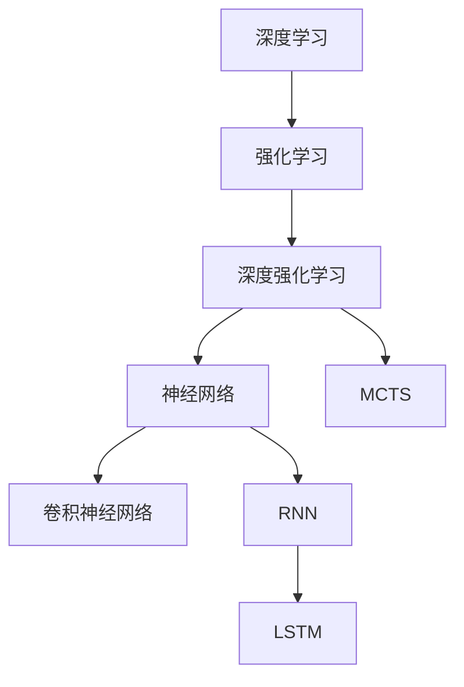

                 

# Python深度学习实践：使用强化学习玩转游戏

> 关键词：强化学习,深度学习,Python,游戏AI,环境感知,决策优化

## 1. 背景介绍

### 1.1 问题由来

随着深度学习技术的飞速发展，其在各种领域的广泛应用正逐步改变人们的生活和工作方式。在娱乐行业，特别是游戏中，深度学习已经从简单的图像识别任务逐渐扩展到更加复杂的决策制定、智能推荐等高级功能。然而，尽管在游戏AI领域已经取得了很多进展，但目前基于规则的AI策略在面对复杂和动态变化的环境时仍然显得力不从心。

强化学习作为一种人工智能领域的核心技术，通过与环境交互来学习最优策略，在游戏AI领域展现出巨大的潜力。本文将详细阐述使用强化学习技术开发游戏AI的全过程，从环境感知到决策优化，并借助Python深度学习框架TensorFlow，展示如何构建一个简单但实用的游戏AI系统。

### 1.2 问题核心关键点

在使用强化学习进行游戏AI开发时，需要注意以下几个关键问题：

- 如何构建一个适宜的游戏环境：环境的可模拟性、完备性、稳定性和奖励信号的合理性都是关键因素。
- 如何设计合适的策略模型：即选择合适的深度学习模型以及神经网络的架构。
- 如何进行训练：需要制定合理的训练流程和策略，如样本获取、网络训练、参数更新等。
- 如何评估与优化：在实际应用中，需要不断地评估AI的性能，并根据评估结果进行策略优化。

## 2. 核心概念与联系

### 2.1 核心概念概述

为了更好地理解强化学习在游戏AI中的应用，本节将介绍几个关键概念：

- 强化学习(Reinforcement Learning, RL)：通过与环境交互，根据当前状态和行动选择来最大化预期奖励的策略学习算法。
- 深度强化学习(Deep Reinforcement Learning, DRL)：结合深度学习和强化学习，通过神经网络逼近最优策略。
- 蒙特卡洛树搜索(Monte Carlo Tree Search, MCTS)：一种用于游戏AI的搜索算法，通过不断扩展和剪枝决策树，来选择最优策略。
- 神经网络(Neural Network, NN)：一种深度学习模型的常见形式，由多个神经元组成，可以处理和分析复杂数据。
- 卷积神经网络(Convolutional Neural Network, CNN)：一种常用于图像处理任务的神经网络，通过卷积操作提取特征。
- 递归神经网络(Recurrent Neural Network, RNN)：一种能够处理序列数据的神经网络，通常用于时间序列预测任务。
- 长短期记忆网络(Long Short-Term Memory, LSTM)：一种特殊的RNN，能够在长序列中保留长期依赖关系。

这些核心概念之间的关系可以通过以下Mermaid流程图来展示：



这个流程图展示了深度学习、强化学习与具体的神经网络、搜索算法之间的关系：

1. 深度学习提供了一种强大的数据处理能力，可以用于构建复杂的模型。
2. 强化学习结合了深度学习，提供了策略学习的新范式。
3. 神经网络是深度学习的核心组成部分，可以用于各种任务。
4. 卷积神经网络适用于图像处理任务，能够提取空间特征。
5. 递归神经网络适用于序列数据处理，可以捕捉时间依赖关系。
6. 长短期记忆网络是RNN的一种改进形式，适用于需要处理长期依赖关系的数据。

这些核心概念共同构成了深度学习与强化学习在游戏AI开发中的应用基础，使得AI能够在游戏中进行有效的策略学习和优化。

## 3. 核心算法原理 & 具体操作步骤
### 3.1 算法原理概述

强化学习游戏AI的核心是构建一个模型，使该模型能够在与游戏环境的交互中，学习到最优的行动策略。游戏AI通常包含以下几个步骤：

1. **环境感知**：通过传感器获取环境状态，如摄像头采集图像、位置传感器获取物理位置等。
2. **决策优化**：将感知到的环境状态输入到策略模型中，选择最优的行动策略。
3. **执行行动**：执行模型选择的策略，进行实际的行动。
4. **环境反馈**：获取环境对当前行动的反馈，如游戏得分、位置变化等。
5. **策略更新**：根据反馈调整策略模型参数，优化策略。

以一个简单的打砖游戏为例，我们将说明这一流程：

1. **环境感知**：摄像机获取当前游戏的图像，并将其作为输入数据。
2. **决策优化**：将图像输入到卷积神经网络中，输出可能的行动列表。
3. **执行行动**：根据行动列表选择一个行动，如移动、发射子弹等。
4. **环境反馈**：游戏环境提供反馈，如砖块的破裂、分数的变化等。
5. **策略更新**：根据得分变化调整神经网络的权重，使得后续的决策更加合理。

### 3.2 算法步骤详解

以下是使用强化学习开发游戏AI的详细步骤：

**Step 1: 环境构建**
- 创建游戏环境，可以是一个简单的自定义游戏引擎，或者使用现成的游戏库，如Unity、Pygame等。
- 设计环境状态空间，包括玩家位置、游戏得分、砖块状态等信息。
- 设计环境奖励机制，根据玩家的行动选择给出相应的奖励。

**Step 2: 策略模型设计**
- 选择适当的深度学习模型，如卷积神经网络(CNN)或递归神经网络(RNN)。
- 设计模型的输入和输出接口，将环境状态映射为模型输入，将行动策略映射为模型输出。
- 确定模型训练过程，包括数据获取、前向传播、损失计算、反向传播等。

**Step 3: 训练过程**
- 准备训练数据集，通常包括大量的游戏玩法视频或屏幕截图。
- 进行模型训练，使用监督学习或强化学习算法，优化模型参数。
- 设定合适的训练策略，如学习率调整、样本批处理、正则化等。

**Step 4: 测试与评估**
- 在测试环境中进行模型测试，观察其表现和稳定性。
- 调整模型参数和训练策略，进一步提升模型的性能。
- 收集用户反馈，优化游戏体验。

**Step 5: 部署与迭代**
- 将训练好的模型部署到游戏环境中，进行实时应用。
- 定期收集游戏数据，进行模型迭代和优化。
- 持续监控游戏效果，确保模型的持续改进。

### 3.3 算法优缺点

使用强化学习开发游戏AI有以下优点：

1. 适应性强：强化学习模型能够根据实际情况不断调整策略，适应各种复杂环境。
2. 可扩展性好：强化学习模型可以通过增加数据和计算资源来提升性能。
3. 鲁棒性好：强化学习模型具有较强的抗干扰能力，能够处理噪声和不确定性。
4. 性能提升显著：通过优化策略，强化学习模型能够显著提升游戏AI的性能。

然而，强化学习在游戏AI开发中也存在一些缺点：

1. 计算资源需求高：训练过程需要大量的计算资源和时间，尤其是深度强化学习。
2. 训练过程复杂：强化学习模型训练过程需要复杂的算法和调试，需要丰富的经验。
3. 存在探索与利用冲突：强化学习模型需要在探索新策略和利用现有策略之间进行平衡。
4. 可解释性差：强化学习模型通常是黑盒模型，难以解释其内部决策逻辑。

### 3.4 算法应用领域

强化学习在游戏AI领域有着广泛的应用，主要包括以下几个方向：

- **即时战略游戏**：如《星际争霸》、《文明》等，强化学习模型需要处理复杂的策略决策和资源管理。
- **射击类游戏**：如《使命召唤》、《守望先锋》等，强化学习模型需要实时响应敌人动态变化。
- **动作类游戏**：如《马里奥》、《塞尔达》等，强化学习模型需要处理高动态和实时反馈。
- **棋类游戏**：如《围棋》、《国际象棋》等，强化学习模型需要处理复杂的策略选择和博弈过程。
- **体育类游戏**：如《FIFA》、《PUBG》等，强化学习模型需要处理玩家动作和游戏规则。

## 4. 数学模型和公式 & 详细讲解 & 举例说明
### 4.1 数学模型构建

我们使用马尔可夫决策过程(Markov Decision Process, MDP)来构建强化学习模型。一个典型的MDP由状态空间 $\mathcal{S}$、动作空间 $\mathcal{A}$、状态转移概率 $P(s_{t+1}|s_t,a_t)$、奖励函数 $R(s_t,a_t)$ 和折扣因子 $\gamma$ 组成。

设 $\pi$ 为策略函数，表示在给定状态 $s_t$ 下选择动作 $a_t$ 的概率分布。根据MDP，我们可以构建如下的模型：

$$
\max_{\pi} \mathbb{E}_{\pi}\left[\sum_{t=0}^{\infty} \gamma^t R(s_t,a_t)\right]
$$

其中，$\mathbb{E}_{\pi}$ 表示策略 $\pi$ 下的期望。

### 4.2 公式推导过程

以下，我们将以打砖游戏为例，详细推导强化学习的数学模型。

假设环境状态 $s_t$ 由玩家位置 $x_t$、玩家速度 $v_t$、砖块位置 $p_t$、砖块状态 $b_t$ 组成。每个状态 $s_t$ 下，玩家可以选择的行动 $a_t$ 有若干个，如移动、发射子弹等。

设奖励函数 $R(s_t,a_t)$ 为当前砖块的破裂得分，即 $R(s_t,a_t) = \sum_{i} \text{score}(p_i)$，其中 $\text{score}(p_i)$ 表示砖块 $p_i$ 破裂后的得分。

根据强化学习的定义，我们的目标是在给定状态 $s_t$ 下选择最优行动 $a_t$，使得未来奖励期望最大化：

$$
\max_{a_t} \mathbb{E}_{\pi}\left[\sum_{t=0}^{\infty} \gamma^t R(s_t,a_t)\right]
$$

我们可以通过蒙特卡洛树搜索(MCTS)算法来优化上述目标，MCTS 算法的基本步骤如下：

1. 根节点添加动作 $a_t$。
2. 从根节点开始，向叶子节点进行扩展和剪枝，每次扩展一个子节点，并计算出该节点的预期奖励 $V(s_{t+1})$。
3. 根据子节点的预期奖励 $V(s_{t+1})$，回溯更新根节点到该子节点的价值估计 $Q(s_t,a_t)$。
4. 选择具有最高价值估计的子节点执行行动。

上述过程可以通过以下伪代码来表示：

```python
def monte_carlo_tree_search(state):
    root = Node(state)
    while root not is_leaf_node():
        action = root.get_child_with_best_value()
        new_state = apply_action(state, action)
        new_node = Node(new_state)
        parent = root.get_parent()
        if parent is not None:
            parent.update_value(child, value)
        return action
```

其中，`Node` 表示搜索树中的节点，包含当前状态 $s_t$、动作 $a_t$、价值估计 $Q(s_t,a_t)$ 等属性。

### 4.3 案例分析与讲解

以《星际争霸》为例，我们分析如何使用强化学习开发游戏AI。

1. **环境感知**：通过摄像头获取游戏中的地图和单位信息。
2. **决策优化**：将地图和单位信息输入到卷积神经网络中，输出最优的单位部署策略。
3. **执行行动**：根据卷积神经网络的输出，执行单位部署和移动等行动。
4. **环境反馈**：通过传感器获取游戏得分、单位状态等反馈信息。
5. **策略更新**：根据得分变化调整卷积神经网络权重，使得后续的单位部署策略更加合理。

在实际开发中，我们需要不断优化模型的输入输出接口和训练策略，以便更好地适应游戏环境的变化和优化。

## 5. 项目实践：代码实例和详细解释说明
### 5.1 开发环境搭建

在进行游戏AI的开发前，我们需要准备好开发环境。以下是使用Python进行PyTorch开发的环境配置流程：

1. 安装Anaconda：从官网下载并安装Anaconda，用于创建独立的Python环境。

2. 创建并激活虚拟环境：
```bash
conda create -n pytorch-env python=3.8 
conda activate pytorch-env
```

3. 安装PyTorch：根据CUDA版本，从官网获取对应的安装命令。例如：
```bash
conda install pytorch torchvision torchaudio cudatoolkit=11.1 -c pytorch -c conda-forge
```

4. 安装TensorFlow：使用pip安装TensorFlow及其依赖：
```bash
pip install tensorflow==2.5
```

5. 安装TensorBoard：用于可视化模型训练过程，跟踪训练进度：
```bash
pip install tensorboard
```

6. 安装Pygame：用于搭建游戏环境：
```bash
pip install pygame
```

完成上述步骤后，即可在`pytorch-env`环境中开始游戏AI的开发。

### 5.2 源代码详细实现

下面我们以《打砖块》游戏为例，给出使用PyTorch和TensorFlow进行游戏AI开发的完整代码实现。

首先，定义游戏环境的类：

```python
import pygame
import numpy as np
import tensorflow as tf

class Bricks:
    def __init__(self, screen, width, height, num_bricks):
        self.screen = screen
        self.width = width
        self.height = height
        self.bricks = np.zeros((self.width, self.height))
        self.num_bricks = num_bricks
        
    def draw_bricks(self):
        for x, y in np.argwhere(self.bricks == 1):
            pygame.draw.rect(self.screen, (255, 0, 0), (x, y, 20, 10))
            
    def is_brick(self, x, y):
        return self.bricks[x][y] == 1
    
    def reset(self):
        self.bricks = np.zeros((self.width, self.height))
        self.draw_bricks()
```

然后，定义玩家类的属性和方法：

```python
class Player:
    def __init__(self, screen, paddle_width, paddle_height, paddle_speed):
        self.screen = screen
        self.paddle_width = paddle_width
        self.paddle_height = paddle_height
        self.paddle_speed = paddle_speed
        self.paddle = pygame.Rect(0, self.height - self.paddle_height, self.paddle_width, self.paddle_height)
    
    def draw_paddle(self):
        pygame.draw.rect(self.screen, (255, 255, 0), (self.paddle.x, self.paddle.y, self.paddle_width, self.paddle_height))
    
    def update_paddle(self):
        keys = pygame.key.get_pressed()
        if keys[pygame.K_LEFT] and self.paddle.left > 0:
            self.paddle.x -= self.paddle_speed
        if keys[pygame.K_RIGHT] and self.paddle.right < self.width:
            self.paddle.x += self.paddle_speed
```

接着，定义卷积神经网络模型的代码实现：

```python
class CNN:
    def __init__(self):
        self.model = tf.keras.Sequential([
            tf.keras.layers.Conv2D(32, (3, 3), activation='relu', input_shape=(64, 64, 3)),
            tf.keras.layers.MaxPooling2D((2, 2)),
            tf.keras.layers.Conv2D(64, (3, 3), activation='relu'),
            tf.keras.layers.MaxPooling2D((2, 2)),
            tf.keras.layers.Flatten(),
            tf.keras.layers.Dense(64, activation='relu'),
            tf.keras.layers.Dense(num_bricks, activation='softmax')
        ])
    
    def predict(self, input_tensor):
        return self.model.predict(input_tensor)
```

最后，实现游戏AI的逻辑：

```python
def game_loop():
    screen = pygame.display.set_mode((screen_width, screen_height))
    pygame.display.set_caption('Bricks Game')
    
    game = Bricks(screen, screen_width, screen_height, num_bricks)
    player = Player(screen, paddle_width, paddle_height, paddle_speed)
    cnn = CNN()
    
    game.reset()
    player.draw_paddle()
    game.draw_bricks()
    
    while True:
        for event in pygame.event.get():
            if event.type == pygame.QUIT:
                pygame.quit()
                sys.exit()
        
        screen.fill((0, 0, 0))
        player.update_paddle()
        game.draw_bricks()
        
        input_tensor = np.array(pygame.image.tostring(pixel_array, 'RGBA').reshape((1, screen_width, screen_height, 4)))
        predictions = cnn.predict(input_tensor)
        action = np.argmax(predictions)
        
        game.update_bricks(action)
        player.update_paddle()
        game.draw_bricks()
        
        pygame.display.update()
```

### 5.3 代码解读与分析

让我们再详细解读一下关键代码的实现细节：

**Bricks类**：
- `__init__`方法：初始化游戏环境，包括屏幕大小、砖块数量等。
- `draw_bricks`方法：绘制砖块。
- `is_brick`方法：判断是否为砖块。
- `reset`方法：重置游戏环境。

**Player类**：
- `__init__`方法：初始化玩家，包括屏幕、得分、速度等。
- `draw_paddle`方法：绘制得分栏。
- `update_paddle`方法：根据按键更新得分栏位置。

**CNN类**：
- `__init__`方法：构建卷积神经网络模型。
- `predict`方法：输入图像数据，预测输出。

**游戏循环**：
- `game_loop`方法：实现游戏的主循环，不断获取用户输入和更新游戏状态。
- 在主循环中，不断接收用户输入，更新玩家和砖块的状态，并根据卷积神经网络的输出选择最优的行动策略。

**代码实现细节**：
- 使用Pygame库搭建游戏环境，实现屏幕绘制、事件处理等。
- 通过numpy库处理图像数据，实现卷积神经网络的输入输出接口。
- 使用TensorFlow实现卷积神经网络，进行游戏AI的策略学习和优化。
- 在游戏循环中，根据玩家动作和环境反馈，实时更新游戏状态，并使用卷积神经网络选择最优策略。

## 6. 实际应用场景
### 6.1 智能推荐系统

智能推荐系统在游戏AI领域的应用非常广泛。通过分析用户的行为数据，推荐系统能够根据用户的历史行为和偏好，为用户推荐游戏内容，提升用户的体验和留存率。

在实际开发中，我们可以使用强化学习算法来训练推荐模型，该模型能够根据用户的操作和反馈，动态调整推荐策略，不断优化推荐结果。通过与用户互动，强化学习模型能够学习到用户喜好的变化，并迅速调整推荐内容，提高推荐系统的准确性和个性化。

### 6.2 虚拟现实游戏

虚拟现实(VR)游戏需要高精度的环境感知和实时响应。通过使用强化学习技术，VR游戏能够更加智能地处理复杂的场景和动态变化，提升游戏的沉浸感和互动性。

在VR游戏中，强化学习模型能够实时处理用户动作和环境变化，进行最优决策，使游戏更加自然流畅。通过在游戏过程中不断学习和优化策略，强化学习模型能够适应各种游戏场景，提供更加丰富的互动体验。

### 6.3 机器人导航

强化学习在游戏AI中的应用不仅限于游戏，还可以用于机器人导航等实际应用。例如，在智能家居环境中，机器人需要导航到指定位置进行物品搬运、清洁等操作。通过使用强化学习技术，机器人能够学习最优路径和策略，提高导航效率和准确性。

在游戏AI中的强化学习技术同样适用于机器人导航。在导航过程中，强化学习模型能够根据环境变化和任务需求，动态调整导航策略，并优化路径规划，使得机器人在复杂环境中的导航更加高效和稳定。

### 6.4 未来应用展望

未来，强化学习在游戏AI领域的应用将更加广泛和深入，推动游戏技术的不断进步和革新。

随着深度学习技术的不断进步，游戏AI模型的性能和鲁棒性将进一步提升，使得AI在处理复杂和动态变化的游戏场景中更加得心应手。

智能推荐系统、虚拟现实游戏、机器人导航等应用也将不断拓展，进一步提升用户的游戏体验和互动性。

未来，强化学习将与更多的AI技术进行融合，如知识表示、因果推理、强化学习、博弈论等，共同构建更加全面、智能的游戏AI系统，为游戏产业带来更多创新和突破。

## 7. 工具和资源推荐
### 7.1 学习资源推荐

为了帮助开发者系统掌握强化学习在游戏AI中的应用，这里推荐一些优质的学习资源：

1. 《Deep Reinforcement Learning for Game AI》：作者Eric Elim，系统介绍了在游戏AI中使用强化学习技术的理论基础和实践技巧。

2. 《Reinforcement Learning: An Introduction》：作者Richard S. Sutton和Andrew G. Barto，是一本经典的强化学习教材，涵盖强化学习的基本概念和算法。

3. PyTorch官方文档：PyTorch深度学习框架的官方文档，提供了详细的API接口和代码示例。

4. TensorFlow官方文档：TensorFlow深度学习框架的官方文档，提供了丰富的教程和案例。

5. Coursera《Deep Learning Specialization》课程：由深度学习大师Andrew Ng开设的在线课程，涵盖深度学习的基本概念和算法。

通过对这些资源的学习实践，相信你一定能够快速掌握强化学习在游戏AI中的应用，并用于解决实际的游戏问题。

### 7.2 开发工具推荐

高效的开发离不开优秀的工具支持。以下是几款用于强化学习开发的游戏AI常用工具：

1. PyTorch：基于Python的开源深度学习框架，灵活动态的计算图，适合快速迭代研究。大部分深度学习模型都有PyTorch版本的实现。

2. TensorFlow：由Google主导开发的开源深度学习框架，生产部署方便，适合大规模工程应用。

3. OpenAI Gym：一个游戏AI的测试平台，提供大量预定义的游戏环境和API接口，便于进行游戏AI开发和测试。

4. Unity ML-Agents：一个开源的游戏AI开发工具，支持多种游戏引擎和机器学习算法。

5. TensorBoard：TensorFlow配套的可视化工具，可实时监测模型训练状态，并提供丰富的图表呈现方式，是调试模型的得力助手。

6. Weights & Biases：模型训练的实验跟踪工具，可以记录和可视化模型训练过程中的各项指标，方便对比和调优。

合理利用这些工具，可以显著提升强化学习游戏AI的开发效率，加快创新迭代的步伐。

### 7.3 相关论文推荐

强化学习在游戏AI领域的发展离不开学界的持续研究。以下是几篇奠基性的相关论文，推荐阅读：

1. DeepMind的《Playing Atari with Deep Reinforcement Learning》：展示了通过强化学习算法训练神经网络模型，成功完成Atari游戏的控制任务。

2. OpenAI的《Evolution Strategies for Learning Diverse Policies》：提出了使用进化策略算法训练强化学习模型，适用于大规模并行学习。

3. AlphaGo的论文：《Mastering the Game of Go with Monte Carlo Tree Search》和《Mastering the Game of Go without Human Knowledge》，展示了使用强化学习算法开发棋类游戏AI的思路和方法。

4. AlphaZero的论文：《Mastering Chess and Go with Zero Knowledge》和《Mastering the Game of Go without Human Knowledge》，展示了使用强化学习算法开发围棋AI的思路和方法。

这些论文代表了大语言模型微调技术的发展脉络。通过学习这些前沿成果，可以帮助研究者把握学科前进方向，激发更多的创新灵感。

## 8. 总结：未来发展趋势与挑战
### 8.1 总结

本文对使用强化学习技术开发游戏AI的全过程进行了详细阐述。首先阐述了强化学习在游戏AI中的应用背景，明确了强化学习在处理复杂和动态变化的游戏场景中的重要性。其次，从原理到实践，详细讲解了强化学习的数学模型和算法步骤，并提供了代码实例，帮助读者深入理解游戏AI的实现过程。同时，本文还广泛探讨了强化学习在游戏AI中的实际应用场景，展示了其在智能推荐系统、虚拟现实游戏、机器人导航等领域的巨大潜力。最后，本文推荐了相关的学习资源和开发工具，帮助开发者系统掌握强化学习在游戏AI中的应用。

通过本文的系统梳理，可以看到，强化学习在游戏AI领域的应用前景广阔，具有极高的潜力和发展空间。游戏AI技术的不断进步，将为游戏产业带来革命性的变化和突破，推动游戏体验的进一步提升和创新。

### 8.2 未来发展趋势

展望未来，强化学习在游戏AI领域将呈现以下几个发展趋势：

1. 深度强化学习的普及：随着深度学习技术的不断进步，深度强化学习模型将得到更广泛的应用，成为游戏AI开发的主流。

2. 多智能体学习的应用：在复杂多智能体系统中，强化学习模型能够学习到合作和竞争策略，提升游戏的交互性和复杂性。

3. 自监督学习的融合：自监督学习与强化学习的融合，将使游戏AI模型能够更高效地利用未标注数据进行学习和优化。

4. 泛化能力的提升：通过迁移学习和多任务学习，强化学习模型能够更好地泛化到不同的游戏场景中，适应更加多样化的游戏需求。

5. 鲁棒性和可解释性的增强：通过改进算法和优化模型，强化学习模型将具备更强的鲁棒性和可解释性，提高游戏的稳定性和可预测性。

6. 跨平台和跨设备的兼容：强化学习模型将能够跨不同平台和设备进行部署和优化，提高游戏的可访问性和用户体验。

以上趋势凸显了强化学习在游戏AI领域的广阔前景。这些方向的探索发展，将进一步提升游戏AI的性能和应用范围，为游戏产业带来更多创新和突破。

### 8.3 面临的挑战

尽管强化学习在游戏AI领域已经取得了显著进展，但在实际应用中仍面临诸多挑战：

1. 训练效率低：深度强化学习模型的训练过程非常耗时，需要大量的计算资源和数据量。

2. 策略复杂度高：在复杂游戏中，策略模型需要处理大量的状态和动作空间，使得学习过程更加困难。

3. 模型鲁棒性差：强化学习模型在面对动态变化和噪声干扰时，容易发生性能下降。

4. 可解释性差：强化学习模型通常是黑盒模型，难以解释其内部决策逻辑，导致用户对模型的信任度较低。

5. 安全性问题：强化学习模型可能学习到有害的策略，导致游戏不公平、不道德等问题。

6. 硬件成本高：强化学习模型需要高性能的计算硬件支持，增加了游戏AI开发的成本。

7. 用户隐私问题：强化学习模型需要收集大量用户数据进行训练，涉及用户隐私问题。

以上挑战需要通过技术创新、算法优化和伦理规范等多方面的努力，才能逐步克服。

### 8.4 研究展望

面对强化学习在游戏AI领域面临的挑战，未来的研究需要在以下几个方面寻求新的突破：

1. 优化算法设计：设计更加高效、稳健的强化学习算法，提高训练效率和模型鲁棒性。

2. 改进模型结构：开发更加结构化的模型，提高模型的泛化能力和可解释性。

3. 融合多种技术：结合深度学习、自监督学习、迁移学习等多种技术，提升游戏AI模型的性能和应用范围。

4. 注重用户隐私：通过匿名化、差分隐私等技术，保护用户数据隐私，增强用户对AI的信任。

5. 提升模型鲁棒性：引入对抗训练、鲁棒优化等技术，提高模型对动态变化和噪声干扰的鲁棒性。

6. 注重伦理规范：在模型设计中引入伦理导向的评估指标，确保模型的行为符合道德规范，避免有害行为的发生。

这些研究方向将推动强化学习在游戏AI领域的进一步发展和应用，为游戏产业带来更多创新和突破。总之，强化学习在游戏AI领域的未来发展方向仍有很多挑战需要克服，但通过不断的技术创新和探索，我们相信游戏AI技术必将迎来更加美好的未来。

## 9. 附录：常见问题与解答

**Q1：使用强化学习开发游戏AI有哪些步骤？**

A: 使用强化学习开发游戏AI通常包括以下步骤：

1. 设计游戏环境和奖励机制。
2. 构建深度学习模型，实现环境感知和策略优化。
3. 获取训练数据，进行模型训练。
4. 在测试环境中测试和评估模型。
5. 部署模型，进行实际应用。

**Q2：强化学习在游戏AI开发中常用哪些算法？**

A: 强化学习在游戏AI开发中常用的算法包括：

1. Q-Learning：一种基于值函数的强化学习算法，用于处理状态和动作空间较大的环境。
2. SARSA：一种基于状态-动作-奖励-状态的强化学习算法，用于处理状态空间较小的环境。
3. Deep Q-Networks (DQN)：将深度神经网络与强化学习算法结合，适用于复杂环境和高维状态空间。
4. Proximal Policy Optimization (PPO)：一种基于策略梯度的强化学习算法，适用于高维动作空间和连续动作空间。
5. Actor-Critic：一种结合值函数和策略函数的强化学习算法，适用于连续动作空间和复杂的任务。

**Q3：在游戏AI开发中，如何设计合理的奖励函数？**

A: 设计合理的奖励函数是强化学习在游戏AI开发中的关键步骤。以下是一些设计奖励函数的常用方法：

1. 基于目标实现的奖励：如完成目标任务的得分，奖励高得分的行为。
2. 基于时间或任务的奖励：如在规定时间内完成任务的奖励，鼓励快速完成任务的行为。
3. 基于环境状态的奖励：如在复杂环境中保持平稳状态的奖励，鼓励稳定的行为。
4. 基于路径和距离的奖励：如在导航任务中，奖励靠近目标的行为，鼓励快速找到目标的行为。
5. 结合多种奖励：如结合目标得分、时间、距离等多种因素，设计综合性的奖励函数。

**Q4：强化学习在游戏AI开发中面临哪些技术挑战？**

A: 强化学习在游戏AI开发中面临以下技术挑战：

1. 训练效率低：深度强化学习模型的训练过程非常耗时，需要大量的计算资源和数据量。
2. 策略复杂度高：在复杂游戏中，策略模型需要处理大量的状态和动作空间，使得学习过程更加困难。
3. 模型鲁棒性差：强化学习模型在面对动态变化和噪声干扰时，容易发生性能下降。
4. 可解释性差：强化学习模型通常是黑盒模型，难以解释其内部决策逻辑。
5. 安全性问题：强化学习模型可能学习到有害的策略，导致游戏不公平、不道德等问题。
6. 硬件成本高：强化学习模型需要高性能的计算硬件支持，增加了游戏AI开发的成本。
7. 用户隐私问题：强化学习模型需要收集大量用户数据进行训练，涉及用户隐私问题。

**Q5：强化学习在游戏AI开发中有哪些实际应用？**

A: 强化学习在游戏AI开发中有以下实际应用：

1. 即时战略游戏：如《星际争霸》、《文明》等，强化学习模型需要处理复杂的策略决策和资源管理。
2. 射击类游戏：如《使命召唤》、《守望先锋》等，强化学习模型需要实时响应敌人动态变化。
3. 动作类游戏：如《马里奥》、《塞尔达》等，强化学习模型需要处理高动态和实时反馈。
4. 棋类游戏：如《围棋》、《国际象棋》等，强化学习模型需要处理复杂的策略选择和博弈过程。
5. 体育类游戏：如《FIFA》、《PUBG》等，强化学习模型需要处理玩家动作和游戏规则。

通过上述详细解析，相信你对强化学习在游戏AI中的应用有了更全面的了解。希望本文能够帮助你在游戏AI开发中取得更好的成果。

---

作者：禅与计算机程序设计艺术 / Zen and the Art of Computer Programming

