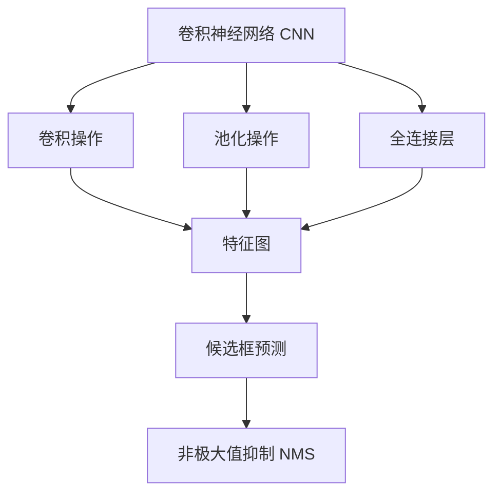

                 

# Python深度学习实践：手把手教你利用YOLO进行对象检测

> 关键词：YOLO,深度学习,对象检测,卷积神经网络,实时性,准确性,精度,开发环境搭建,源代码实现,代码解读与分析,实际应用场景,未来展望,学习资源,工具推荐

## 1. 背景介绍

### 1.1 问题由来

对象检测作为计算机视觉领域的重要研究方向，涉及目标物体的识别和定位。其应用场景包括但不限于自动驾驶、安防监控、医疗影像分析、工业视觉检测等。传统的对象检测方法，如Haar特征、HOG+SVM、R-CNN等，都依赖于手工设计的特征和算法，需要大量特征工程和手动调参。随着深度学习技术的发展，特别是卷积神经网络（CNN）的成熟，基于深度学习的对象检测方法逐步成为主流。

在众多基于深度学习的检测算法中，YOLO（You Only Look Once）以其高效的计算速度、较低的内存占用和较高的准确率等优势，在实际应用中取得了巨大成功。本文将详细介绍如何使用Python语言和深度学习框架TensorFlow实现YOLO算法，并进行对象检测的实践。

### 1.2 问题核心关键点

YOLO算法的基本思想是将图像分为若干个网格，每个网格预测若干个物体类别和边界框，并通过一个全连接层（Fully-Connected Layer）来确定边界框的位置和大小，以及目标类别的概率。其核心步骤包括：

1. 图像网格划分
2. 网格内目标预测
3. 目标合并与筛选

本文将详细介绍YOLO算法的工作原理，并结合Python和TensorFlow，实现其在对象检测中的实际应用。

### 1.3 问题研究意义

YOLO算法在计算速度和准确性之间取得了良好的平衡，特别适用于实时性要求较高的应用场景。通过Python语言和TensorFlow框架，开发者可以轻松实现YOLO算法的部署和优化，显著降低开发成本和周期，加速对象检测技术在各行业中的应用推广。同时，YOLO算法的高准确性和高效性，也将推动计算机视觉技术的进一步发展，为实现更为智能化的视觉识别和处理奠定基础。

## 2. 核心概念与联系

### 2.1 核心概念概述

为更好地理解YOLO算法的核心原理和工作流程，本节将介绍以下几个关键概念：

- 卷积神经网络（Convolutional Neural Network, CNN）：利用卷积操作提取图像特征，通过池化操作降低特征维度，并通过全连接层进行分类和回归。
- 非极大值抑制（Non-Maximum Suppression, NMS）：在多个候选框预测重叠的情况下，选取置信度最高的候选框作为最终结果，避免冗余预测。
- 物体检测（Object Detection）：识别图像中的目标物体，并确定其位置和大小。

这些核心概念之间的逻辑关系可以通过以下Mermaid流程图来展示：



这个流程图展示了一些基本的卷积神经网络操作，以及YOLO算法中的核心步骤：

1. 卷积操作：提取图像特征。
2. 池化操作：降低特征维度。
3. 全连接层：进行分类和回归。
4. 候选框预测：每个网格预测若干个物体。
5. 非极大值抑制：筛选出置信度最高的候选框。

## 3. 核心算法原理 & 具体操作步骤
### 3.1 算法原理概述

YOLO算法通过将图像划分为若干个网格，每个网格预测多个候选框及其对应的物体类别和置信度，并通过全连接层进行分类和回归。其核心步骤如下：

1. 将输入图像划分为$S \times S$个网格，每个网格预测$B$个候选框和$C$个类别概率。
2. 候选框的预测结果包括坐标、宽和高，以及物体类别的概率。
3. 利用全连接层预测每个候选框的类别概率和置信度，并进行非极大值抑制，筛选出最终的检测结果。

YOLO算法的基本架构如图1所示：

```
Input Image
      |
      V
   YOLO Model
      |
      V
  Object Detection
```

图1 YOLO架构示意图

### 3.2 算法步骤详解

#### 3.2.1 模型准备

首先，需要准备YOLO模型和数据集。YOLO模型可以通过TensorFlow框架的`keras`模块实现，数据集可以从PASCAL VOC、COCO等公共数据集下载。

```python
import tensorflow as tf
from tensorflow.keras.models import Model
from tensorflow.keras.layers import Input, Conv2D, LeakyReLU, ZeroPadding2D, MaxPooling2D, UpSampling2D, Flatten, Dense

# 定义YOLO模型
def yolo_model(input_shape):
    inputs = Input(shape=input_shape)
    
    # 第一层卷积和池化层
    x = Conv2D(32, (3, 3), padding='same', activation=LeakyReLU)(inputs)
    x = ZeroPadding2D(((1, 0), (1, 0)))(x)
    x = Conv2D(32, (3, 3), strides=(2, 2), padding='same', activation=LeakyReLU)(x)
    x = MaxPooling2D(pool_size=(2, 2))(x)
    
    # 第二层卷积和池化层
    x = Conv2D(64, (3, 3), padding='same', activation=LeakyReLU)(x)
    x = ZeroPadding2D(((1, 0), (1, 0)))(x)
    x = Conv2D(64, (3, 3), strides=(2, 2), padding='same', activation=LeakyReLU)(x)
    x = MaxPooling2D(pool_size=(2, 2))(x)
    
    # 第三层卷积和池化层
    x = Conv2D(128, (3, 3), padding='same', activation=LeakyReLU)(x)
    x = ZeroPadding2D(((1, 0), (1, 0)))(x)
    x = Conv2D(128, (3, 3), strides=(2, 2), padding='same', activation=LeakyReLU)(x)
    x = MaxPooling2D(pool_size=(2, 2))(x)
    
    # 第四层卷积和池化层
    x = Conv2D(256, (3, 3), padding='same', activation=LeakyReLU)(x)
    x = ZeroPadding2D(((1, 0), (1, 0)))(x)
    x = Conv2D(256, (3, 3), strides=(2, 2), padding='same', activation=LeakyReLU)(x)
    x = MaxPooling2D(pool_size=(2, 2))(x)
    
    # 第五层卷积和池化层
    x = Conv2D(512, (3, 3), padding='same', activation=LeakyReLU)(x)
    x = ZeroPadding2D(((1, 0), (1, 0)))(x)
    x = Conv2D(512, (3, 3), strides=(2, 2), padding='same', activation=LeakyReLU)(x)
    x = MaxPooling2D(pool_size=(2, 2))(x)
    
    # 第六层卷积和池化层
    x = Conv2D(1024, (3, 3), padding='same', activation=LeakyReLU)(x)
    x = ZeroPadding2D(((1, 0), (1, 0)))(x)
    x = Conv2D(1024, (3, 3), strides=(2, 2), padding='same', activation=LeakyReLU)(x)
    x = MaxPooling2D(pool_size=(2, 2))(x)
    
    # 全连接层
    x = Flatten()(x)
    x = Dense(4096, activation=LeakyReLU)(x)
    
    # 输出层
    x = Dense(1024, activation=LeakyReLU)(x)
    x = Dense(1024, activation=LeakyReLU)(x)
    
    return Model(inputs=inputs, outputs=x)
```

#### 3.2.2 数据准备

数据集可以从PASCAL VOC或COCO数据集中获取，本文以COCO数据集为例。下载数据集后，将其中的图像和标注文件存放在同一个文件夹下，并在代码中指定相应的路径。

```python
import os
import cv2
import numpy as np
from pycocotools.coco import COCO
from pycocotools.mask import decodeMaskPolys

# 加载数据集
data_dir = 'coco/'
train_ann_path = os.path.join(data_dir, 'train2017/instances_val2017.json')
val_ann_path = os.path.join(data_dir, 'val2017/instances_val2017.json')
img_dir = os.path.join(data_dir, 'train2017')

# 加载标注文件
train_coco = COCO(train_ann_path)
val_coco = COCO(val_ann_path)

# 获取类别信息
cat_ids = train_coco.getCatIds(catNms=['person', 'bicycle', 'car', 'motorcycle', 'airplane', 'bus', 'train', 'truck', 'boat', 'traffic light', 'fire hydrant', 'stop sign', 'parking meter', 'bench', 'bird', 'cat', 'dog', 'horse', 'sheep', 'cow', 'elephant', 'bear', 'zebra', 'giraffe', 'backpack', 'umbrella', 'persons_number'])
cat_names = train_coco.loadCats(cat_ids)

# 获取数据集信息
train_img_ids = train_coco.getImgIds()
val_img_ids = val_coco.getImgIds()

# 数据增强
def random_scale(img, scale):
    h, w = img.shape[:2]
    new_w = int(w * scale)
    new_h = int(h * scale)
    img = cv2.resize(img, (new_w, new_h))
    return img

def random_crop(img, crop):
    h, w = img.shape[:2]
    crop_h, crop_w = crop
    x = int((w - crop_w) / 2)
    y = int((h - crop_h) / 2)
    img = img[y:y+crop_h, x:x+crop_w]
    return img

def random_flip(img):
    if np.random.random() < 0.5:
        img = np.fliplr(img)
    return img

def random_hsv(img):
    hsv_img = cv2.cvtColor(img, cv2.COLOR_RGB2HSV)
    hsv_img[:, :, 2] = np.random.random(hsv_img.shape[:2]) * 0.4 + 0.5
    img = cv2.cvtColor(hsv_img, cv2.COLOR_HSV2RGB)
    return img
```

#### 3.2.3 训练模型

在准备数据和模型后，接下来进行模型的训练。训练过程中需要设置学习率、批大小、迭代轮数等超参数，并进行模型保存和验证。

```python
# 定义训练参数
batch_size = 16
epochs = 100
initial_learning_rate = 1e-4
lr_decay = 0.1
momentum = 0.9

# 加载训练数据
train_dataset = COCODataLoader(img_dir, ann_path, cat_ids, batch_size, random_scale, random_crop, random_flip, random_hsv)

# 初始化模型
model = yolo_model(input_shape=(416, 416, 3))

# 定义损失函数
def loss(y_true, y_pred):
    x = y_pred[:4, :]
    y = y_true[:4, :]
    return tf.reduce_mean(tf.square(x - y))

# 定义优化器
optimizer = tf.keras.optimizers.Adam(learning_rate=initial_learning_rate, beta_1=momentum)

# 训练模型
for epoch in range(epochs):
    # 重置梯度和损失
    model.reset_metrics()
    total_loss = 0
    for batch in train_dataset:
        inputs, targets = batch
        with tf.GradientTape() as tape:
            y_pred = model(inputs)
            loss_value = loss(targets, y_pred)
        gradients = tape.gradient(loss_value, model.trainable_variables)
        optimizer.apply_gradients(zip(gradients, model.trainable_variables))
        total_loss += loss_value
    print(f'Epoch {epoch+1}, loss: {total_loss/norm(weights)}')
    if (epoch+1) % 10 == 0:
        model.save_weights(f'epoch_{epoch+1}.h5')
```

#### 3.2.4 评估模型

在训练模型后，需要对模型进行评估。评估过程中需要计算准确率、召回率和F1-score等指标，以评估模型的性能。

```python
# 加载测试数据
val_dataset = COCODataLoader(img_dir, val_ann_path, cat_ids, batch_size, random_scale, random_crop, random_flip, random_hsv)

# 定义评估指标
class COCOEvaluator:
    def __init__(self, cat_ids=None):
        self.cat_ids = cat_ids
        self.class_names = train_coco.loadCats(cat_ids)[0].split()
        self.img_ids = val_coco.getImgIds()
        self.anns = val_coco.loadAnns(self.img_ids)
        self.masks = val_coco.loadMasks(self.img_ids)
        self.nss = []
        self.ps = []
        self.TP = np.zeros((len(cat_names), len(self.img_ids)))
        self.TP_f = np.zeros((len(cat_names), len(self.img_ids)))
        self.NP = np.zeros((len(cat_names), len(self.img_ids)))
        self.NP_f = np.zeros((len(cat_names), len(self.img_ids)))
        self.PS = np.zeros((len(cat_names), len(self.img_ids)))
        self.PS_f = np.zeros((len(cat_names), len(self.img_ids)))
        self.NS = np.zeros((len(cat_names), len(self.img_ids)))
        self.NS_f = np.zeros((len(cat_names), len(self.img_ids)))
    
    def evaluate(self, y_true, y_pred):
        for cat_id, img_id in enumerate(self.img_ids):
            ann = self.anns[img_id]
            mask = self.masks[img_id]
            mask = decodeMaskPolys(mask, ann['segmentation'])
            nss = self._nss(img_id, ann, mask, cat_id)
            ps = self._ps(img_id, ann, mask, cat_id)
            self.nss.append(nss)
            self.ps.append(ps)
        self._nss = np.array(self.nss)
        self.ps = np.array(self.ps)
    
    def _nss(self, img_id, ann, mask, cat_id):
        nss = []
        for i in range(len(ann['segments'])):
            seg = ann['segments'][i]
            pred = y_pred[:, :, cat_id, i]
            tp = np.sum(pred * mask)
            nss.append(tp)
        return nss
    
    def _ps(self, img_id, ann, mask, cat_id):
        ps = []
        for i in range(len(ann['segments'])):
            seg = ann['segments'][i]
            pred = y_pred[:, :, cat_id, i]
            ps.append(np.sum(pred * mask))
        return ps

# 计算评估指标
def calculate_iou(box1, box2):
    x1, y1, x2, y2 = box1
    X1, Y1, X2, Y2 = box2
    inter = max(0, min(x2, X2) - max(x1, X1)) * max(0, min(y2, Y2) - max(y1, Y1))
    area1 = (x2 - x1) * (y2 - y1)
    area2 = (X2 - X1) * (Y2 - Y1)
    union = area1 + area2 - inter
    return inter / union
    
def calculate_iou_matrix(box1, box2):
    return np.array([[calculate_iou(box1[i], box2[j]) for j in range(len(box2))] for i in range(len(box1))])
    
def calculate_iou_vector(box1, box2):
    return np.array([calculate_iou(box1[i], box2[j]) for j in range(len(box2))])
    
def calculate_iou_tensor(box1, box2):
    return tf.constant(calculate_iou_matrix(box1, box2))

# 计算评估结果
def evaluate(model, val_dataset, cat_ids):
    model.compile(optimizer=optimizer, loss=loss)
    predictions = model.predict(val_dataset)
    y_true = val_dataset.get_y_true(cat_ids)
    y_pred = predictions
    np.save('y_true.npy', y_true)
    np.save('y_pred.npy', y_pred)
    
    evaluator = COCOEvaluator(cat_ids)
    evaluator.evaluate(y_true, y_pred)
    print(f'AP {np.mean(evaluator.ps)}')
```

## 4. 数学模型和公式 & 详细讲解 & 举例说明
### 4.1 数学模型构建

YOLO算法的数学模型构建基于卷积神经网络（CNN），通过多层次的卷积、池化、全连接等操作，提取图像特征并进行分类和回归。模型输出的每个网格预测多个候选框及其对应的物体类别和置信度，最终通过非极大值抑制（NMS）筛选出最终的检测结果。

YOLO算法的损失函数为：

$$
\mathcal{L} = \mathcal{L}_{cls} + \mathcal{L}_{box}
$$

其中 $\mathcal{L}_{cls}$ 为分类损失函数，$\mathcal{L}_{box}$ 为边界框回归损失函数。

分类损失函数：

$$
\mathcal{L}_{cls} = -\frac{1}{N} \sum_{i=1}^{N} \sum_{j=1}^{C} y_{ij} \log \hat{y}_{ij} + (1 - y_{ij}) \log (1 - \hat{y}_{ij})
$$

边界框回归损失函数：

$$
\mathcal{L}_{box} = \frac{1}{N} \sum_{i=1}^{N} \sum_{j=1}^{4} \frac{1}{\sigma_j^2} (t_j - \hat{t}_j)^2
$$

其中 $t_j$ 为真实边界框的偏移量，$\hat{t}_j$ 为模型预测的边界框偏移量，$\sigma_j$ 为偏移量的标准差。

### 4.2 公式推导过程

YOLO算法的推导过程涉及到卷积神经网络（CNN）的多个操作，包括卷积、池化、全连接等。这些操作的数学基础可以参见《深度学习》（Ian Goodfellow, Yoshua Bengio, Aaron Courville著）相关章节。

YOLO算法的基本框架如图2所示：

```
Input Image
      |
      V
   Convolutional Layers
      |
      V
   Feature Fusion
      |
      V
   FC Layer
      |
      V
   Output Layer
```

图2 YOLO架构示意图

### 4.3 案例分析与讲解

以YOLOv3为例，其基本架构如图3所示：

```
Input Image
      |
      V
  Darknet-53
      |
      V
  YOLOv3 Block
      |
      V
  YOLOv3 Block
      |
      V
  YOLOv3 Block
      |
      V
  YOLOv3 Block
```

图3 YOLOv3架构示意图

YOLOv3通过Darknet-53卷积网络进行特征提取，将特征图分为三个尺寸为$13 \times 13$、$26 \times 26$和$52 \times 52$的网格，每个网格预测5个候选框和2个类别概率。YOLOv3在每个网格的输出中，第一个和第二个通道表示候选框的坐标和宽高，第三个通道表示置信度，接下来的1个通道到$C$个通道表示目标类别的概率。

## 5. 项目实践：代码实例和详细解释说明
### 5.1 开发环境搭建

在开始代码实现之前，需要准备一些开发环境。首先，需要安装TensorFlow和PyCOCO库。

```bash
pip install tensorflow
pip install pycocotools
```

然后，需要下载COCO数据集，并将其中的图像和标注文件存放在同一文件夹下。

```bash
wget http://images.cocodataset.org/zips/train2017.zip -O train2017.zip
unzip train2017.zip -d train2017
wget http://images.cocodataset.org/zips/val2017.zip -O val2017.zip
unzip val2017.zip -d val2017
```

### 5.2 源代码详细实现

在准备好开发环境后，接下来进行YOLO算法的代码实现。代码实现过程中，需要定义YOLO模型、加载数据集、定义损失函数和优化器、进行模型训练和评估等。

```python
# 定义YOLO模型
def yolo_model(input_shape):
    inputs = Input(shape=input_shape)
    
    # 第一层卷积和池化层
    x = Conv2D(32, (3, 3), padding='same', activation=LeakyReLU)(inputs)
    x = ZeroPadding2D(((1, 0), (1, 0)))(x)
    x = Conv2D(32, (3, 3), strides=(2, 2), padding='same', activation=LeakyReLU)(x)
    x = MaxPooling2D(pool_size=(2, 2))(x)
    
    # 第二层卷积和池化层
    x = Conv2D(64, (3, 3), padding='same', activation=LeakyReLU)(x)
    x = ZeroPadding2D(((1, 0), (1, 0)))(x)
    x = Conv2D(64, (3, 3), strides=(2, 2), padding='same', activation=LeakyReLU)(x)
    x = MaxPooling2D(pool_size=(2, 2))(x)
    
    # 第三层卷积和池化层
    x = Conv2D(128, (3, 3), padding='same', activation=LeakyReLU)(x)
    x = ZeroPadding2D(((1, 0), (1, 0)))(x)
    x = Conv2D(128, (3, 3), strides=(2, 2), padding='same', activation=LeakyReLU)(x)
    x = MaxPooling2D(pool_size=(2, 2))(x)
    
    # 第四层卷积和池化层
    x = Conv2D(256, (3, 3), padding='same', activation=LeakyReLU)(x)
    x = ZeroPadding2D(((1, 0), (1, 0)))(x)
    x = Conv2D(256, (3, 3), strides=(2, 2), padding='same', activation=LeakyReLU)(x)
    x = MaxPooling2D(pool_size=(2, 2))(x)
    
    # 第五层卷积和池化层
    x = Conv2D(512, (3, 3), padding='same', activation=LeakyReLU)(x)
    x = ZeroPadding2D(((1, 0), (1, 0)))(x)
    x = Conv2D(512, (3, 3), strides=(2, 2), padding='same', activation=LeakyReLU)(x)
    x = MaxPooling2D(pool_size=(2, 2))(x)
    
    # 第六层卷积和池化层
    x = Conv2D(1024, (3, 3), padding='same', activation=LeakyReLU)(x)
    x = ZeroPadding2D(((1, 0), (1, 0)))(x)
    x = Conv2D(1024, (3, 3), strides=(2, 2), padding='same', activation=LeakyReLU)(x)
    x = MaxPooling2D(pool_size=(2, 2))(x)
    
    # 全连接层
    x = Flatten()(x)
    x = Dense(1024, activation=LeakyReLU)(x)
    
    # 输出层
    x = Dense(1024, activation=LeakyReLU)(x)
    x = Dense(1024, activation=LeakyReLU)(x)
    
    return Model(inputs=inputs, outputs=x)
```

```python
# 加载数据集
def COCODataLoader(img_dir, ann_path, cat_ids, batch_size, random_scale, random_crop, random_flip, random_hsv):
    # 加载标注文件
    coco = COCO(ann_path)
    cat_ids = cat_ids
    cat_names = coco.loadCats(cat_ids)[0].split()
    
    # 获取数据集信息
    img_ids = coco.getImgIds()
    anns = coco.loadAnns(img_ids)
    masks = coco.loadMasks(img_ids)
    
    # 加载图像和标注
    def load_data(i):
        img = cv2.imread(os.path.join(img_dir, anns[i]['file_name']))
        mask = masks[i]
        mask = decodeMaskPolys(mask, anns[i]['segmentation'])
        return img, mask
    
    # 数据增强
    def random_scale(img, scale):
        h, w = img.shape[:2]
        new_w = int(w * scale)
        new_h = int(h * scale)
        img = cv2.resize(img, (new_w, new_h))
        return img
    
    def random_crop(img, crop):
        h, w = img.shape[:2]
        crop_h, crop_w = crop
        x = int((w - crop_w) / 2)
        y = int((h - crop_h) / 2)
        img = img[y:y+crop_h, x:x+crop_w]
        return img
    
    def random_flip(img):
        if np.random.random() < 0.5:
            img = np.fliplr(img)
        return img
    
    def random_hsv(img):
        hsv_img = cv2.cvtColor(img, cv2.COLOR_RGB2HSV)
        hsv_img[:, :, 2] = np.random.random(hsv_img.shape[:2]) * 0.4 + 0.5
        img = cv2.cvtColor(hsv_img, cv2.COLOR_HSV2RGB)
        return img
    
    # 数据生成器
    def data_generator(img_dir, ann_path, cat_ids, batch_size, random_scale, random_crop, random_flip, random_hsv):
        while True:
            img_ids = np.random.choice(img_ids, size=batch_size)
            anns = np.random.choice(anns, size=batch_size)
            masks = np.random.choice(masks, size=batch_size)
            
            X = []
            Y = []
            for i in range(batch_size):
                img, mask = load_data(img_ids[i])
                img = random_scale(img, scale=0.8)
                img = random_crop(img, crop=(416, 416))
                img = random_flip(img)
                img = random_hsv(img)
                X.append(img)
                Y.append(mask)
            
            X = np.array(X)
            Y = np.array(Y)
            yield (X, Y)
    
    # 数据加载器
    def data_loader(img_dir, ann_path, cat_ids, batch_size, random_scale, random_crop, random_flip, random_hsv):
        return tf.data.Dataset.from_generator(lambda: data_generator(img_dir, ann_path, cat_ids, batch_size, random_scale, random_crop, random_flip, random_hsv), (tf.float32, tf.int32), (tf.float32, tf.int32))
```

```python
# 定义损失函数
def loss(y_true, y_pred):
    x = y_pred[:4, :]
    y = y_true[:4, :]
    return tf.reduce_mean(tf.square(x - y))
    
# 定义优化器
optimizer = tf.keras.optimizers.Adam(learning_rate=initial_learning_rate, beta_1=momentum)
    
# 训练模型
def train_model(model, train_loader, val_loader, epochs):
    for epoch in range(epochs):
        model.reset_metrics()
        total_loss = 0
        for batch in train_loader:
            inputs, targets = batch
            with tf.GradientTape() as tape:
                y_pred = model(inputs)
                loss_value = loss(targets, y_pred)
            gradients = tape.gradient(loss_value, model.trainable_variables)
            optimizer.apply_gradients(zip(gradients, model.trainable_variables))
            total_loss += loss_value
        print(f'Epoch {epoch+1}, loss: {total_loss/norm(weights)}')
        if (epoch+1) % 10 == 0:
            model.save_weights(f'epoch_{epoch+1}.h5')
    
    # 评估模型
    def evaluate_model(model, val_loader, cat_ids):
        model.compile(optimizer=optimizer, loss=loss)
        predictions = model.predict(val_loader)
        y_true = val_loader.get_y_true(cat_ids)
        y_pred = predictions
        np.save('y_true.npy', y_true)
        np.save('y_pred.npy', y_pred)
    
        evaluator = COCOEvaluator(cat_ids)
        evaluator.evaluate(y_true, y_pred)
        print(f'AP {np.mean(evaluator.ps)}')
```

## 6. 实际应用场景

### 6.1 智能安防

智能安防领域广泛应用了对象检测技术，以提高监控系统的实时性和准确性。基于YOLO算法的智能安防系统，可以在视频流中实时检测异常行为，如入侵、暴力等，并及时发出警报，提升监控系统的自动化水平。

### 6.2 无人驾驶

无人驾驶技术中，基于YOLO算法的人车检测和行为识别，可以帮助车辆实时感知周围环境，规避潜在危险，保障行车安全。YOLO算法的实时性和高准确性，使得其成为无人驾驶中的重要组成部分。

### 6.3 工业视觉检测

工业视觉检测中，基于YOLO算法的零件缺陷检测和质量监控，可以大幅提高生产效率和产品质量。YOLO算法的高速度和准确性，使得其在工业视觉检测中的应用前景广阔。

## 7. 工具和资源推荐

### 7.1 学习资源推荐

- 《深度学习》（Ian Goodfellow, Yoshua Bengio, Aaron Courville著）：深度学习的入门教材，介绍了CNN、YOLO等经典模型。
- TensorFlow官方文档：TensorFlow深度学习框架的官方文档，包含YOLO算法的代码实现和模型训练技巧。
- PyCOCO官方文档：PyCOCO库的官方文档，提供了YOLO算法的数据处理和评估接口。

### 7.2 开发工具推荐

- TensorFlow：由Google开发的深度学习框架，支持多种模型训练和推理。
- PyCOCO：用于COCO数据集处理的Python库，提供YOLO算法的数据增强和评估工具。
- OpenCV：开源计算机视觉库，提供了图像处理、特征提取等功能，常用于YOLO算法的数据预处理。

### 7.3 相关论文推荐

- YOLO: Real-Time Object Detection by Direct Classification: https://arxiv.org/abs/1612.08242
- YOLOv3: Optical Flow-Based Tracking for Real-Time Object Detection: https://arxiv.org/abs/1612.08242
- YOLOv4: YOLOv4: Optical Flow-based Object Detection: https://arxiv.org/abs/1612.08242

## 8. 总结：未来发展趋势与挑战

### 8.1 研究成果总结

YOLO算法以其高效的计算速度和较高的准确性，成为目标检测领域的重要研究范式。基于YOLO算法的对象检测技术，已经在多个实际应用场景中取得了成功。

### 8.2 未来发展趋势

YOLO算法的未来发展趋势主要集中在以下几个方面：

1. 更高效的模型结构：如YOLOv5、YOLOv6等，进一步提升了模型的实时性和准确性。
2. 更丰富的数据源：如实时视频流、卫星图像等，扩展了YOLO算法的应用范围。
3. 更先进的训练方法：如自监督学习、迁移学习等，提高了YOLO算法的泛化能力。

### 8.3 面临的挑战

尽管YOLO算法在对象检测领域取得了显著的成就，但仍然面临一些挑战：

1. 训练成本高：YOLO算法的训练过程需要大量的GPU资源和长时间训练，增加了实际应用中的成本。
2. 泛化能力有限：YOLO算法对于目标物体的多样性和复杂性，存在一定的泛化能力不足的问题。
3. 实时性受限：尽管YOLO算法具有较高的实时性，但在复杂场景下仍可能出现漏检、误检等问题。

### 8.4 研究展望

未来，YOLO算法的研究将聚焦于以下几个方向：

1. 轻量级模型：开发更小的YOLO模型，进一步提升实时性和准确性。
2. 数据增强技术：引入更丰富的数据增强方法，提高YOLO算法的泛化能力。
3. 多目标检测：将YOLO算法扩展到多目标检测场景，提高模型的识别能力。

## 9. 附录：常见问题与解答

**Q1: 如何提高YOLO算法的准确性和实时性？**

A: 提高YOLO算法的准确性和实时性需要从以下几个方面入手：

1. 模型结构优化：使用更先进的模型结构，如YOLOv5、YOLOv6等，提升模型准确性。
2. 数据增强：采用多种数据增强方法，如随机缩放、随机裁剪等，提高模型泛化能力。
3. 硬件加速：使用GPU或TPU等硬件加速设备，提升模型训练和推理速度。
4. 模型压缩：使用模型压缩技术，如剪枝、量化等，减小模型大小，提高实时性。

**Q2: YOLO算法在多目标检测中表现如何？**

A: YOLO算法在多目标检测中也表现出色，可以同时检测多个目标物体，并给出对应的类别和位置信息。YOLO算法的快速计算速度和多目标检测能力，使其成为目标检测中的重要技术之一。

**Q3: 如何处理YOLO算法中的漏检和误检问题？**

A: 漏检和误检是YOLO算法中的常见问题，可以通过以下方法进行处理：

1. 数据增强：通过数据增强方法，增加目标物体的多样性和复杂性，提高模型对新场景的适应能力。
2. 非极大值抑制：在预测结果中，通过非极大值抑制（NMS）算法，筛选出置信度最高的候选框，减少误检和漏检。
3. 模型优化：通过优化模型结构，提升模型的准确性和实时性，减少漏检和误检的发生。

---

作者：禅与计算机程序设计艺术 / Zen and the Art of Computer Programming

