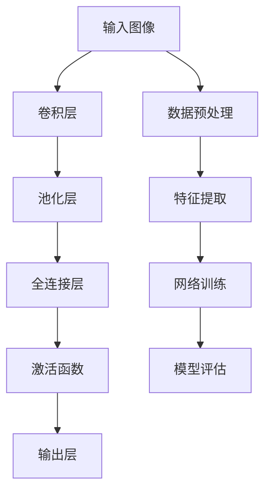

                 

# Python深度学习实践：构建深度卷积网络识别图像

> 关键词：深度卷积网络,图像识别,Python,深度学习,卷积操作,卷积层,池化层,激活函数,神经网络

## 1. 背景介绍

### 1.1 问题由来
图像识别是计算机视觉领域的重要任务之一，广泛应用于自动驾驶、人脸识别、安防监控、医疗影像分析等多个行业。传统的图像识别方法依赖于手工设计的特征提取和分类器，难以满足复杂多变的现实需求。近年来，随着深度学习技术的成熟，基于深度神经网络的图像识别方法逐渐成为主流。深度卷积网络(Deep Convolutional Neural Networks, DCNNs)通过堆叠多个卷积层和池化层，能够自动提取图像的特征表示，并通过全连接层进行分类，具有较高的识别精度。

本文将从核心概念和算法原理入手，详细介绍使用Python进行深度卷积网络图像识别的全流程，涵盖数据预处理、模型搭建、优化训练、结果评估等关键步骤。通过本文的学习实践，希望读者能够深入理解深度卷积网络的原理和实现方法，掌握图像识别技术，实现高效的图像识别应用。

## 2. 核心概念与联系

### 2.1 核心概念概述

为更好地理解深度卷积网络图像识别的方法，本节将介绍几个密切相关的核心概念：

- 深度卷积网络(Deep Convolutional Neural Networks, DCNNs)：一种以卷积操作为核心的神经网络结构，通过多层卷积和池化操作，自动学习图像的特征表示，并通过全连接层进行分类。
- 卷积操作(Convolution)：对输入数据在局部区域内的权重和偏置进行卷积运算，提取局部特征。
- 卷积层(Convolutional Layer)：由多个卷积核组成的神经网络层，通过并行卷积操作提取特征图。
- 池化层(Pooling Layer)：通过降采样操作减少特征图的尺寸，增强特征的鲁棒性和区分度。
- 激活函数(Activation Function)：如ReLU、Sigmoid等，用于引入非线性映射，增强模型的表达能力。
- 损失函数(Loss Function)：用于衡量模型预测输出与真实标签之间的差异，常用的如交叉熵损失、均方误差损失等。
- 优化器(Optimizer)：如Adam、SGD等，用于通过梯度下降算法最小化损失函数，更新模型参数。

这些核心概念之间的逻辑关系可以通过以下Mermaid流程图来展示：



这个流程图展示了深度卷积网络的构成和训练流程：

1. 输入图像经过卷积层和池化层提取特征。
2. 特征图通过全连接层和激活函数得到最终的输出。
3. 模型训练通过最小化损失函数更新参数。
4. 模型评估通过准确率、精确度等指标评估效果。

这些概念共同构成了深度卷积网络的基础，是实现图像识别任务的关键。

## 3. 核心算法原理 & 具体操作步骤
### 3.1 算法原理概述

深度卷积网络的核心原理是通过堆叠多个卷积层和池化层，自动学习图像的特征表示，并通过全连接层进行分类。其训练过程是使用大量标注数据，通过最小化损失函数，利用梯度下降算法更新模型参数的过程。

形式化地，假设输入图像为 $x \in \mathbb{R}^{H \times W \times C}$，其中 $H$、$W$ 和 $C$ 分别为图像的高、宽和通道数。定义卷积核为 $k \in \mathbb{R}^{h \times w \times C \times C'}$，其中 $h$ 和 $w$ 分别为卷积核的高和宽，$C'$ 为卷积核的通道数。设卷积层输出为 $f(x)$，则卷积操作可以表示为：

$$
f(x) = \mathcal{F}_{\theta}(x) = \sum_{i=1}^n w_i * x_i + b_i
$$

其中 $w_i$ 为卷积核，$x_i$ 为输入图像的局部区域，$b_i$ 为偏置项，$\theta$ 为模型参数。

经过多层的卷积和池化操作后，特征图尺寸会显著减小。设池化层输出为 $g(x)$，则池化操作可以表示为：

$$
g(x) = \mathcal{P}_{\theta}(x) = \max_{i=1,...,H-W+1} \max_{j=1,...,W-H+1} \mathcal{F}_{\theta}(x)
$$

经过全连接层和激活函数后，模型的最终输出为：

$$
y = \mathcal{A}_{\theta}(\mathcal{D}_{\theta}(f(x)))
$$

其中 $\mathcal{D}_{\theta}$ 为全连接层，$\mathcal{A}_{\theta}$ 为激活函数。

模型的训练过程是使用反向传播算法，通过最小化损失函数 $L(y,t)$ 更新模型参数，损失函数的具体形式取决于任务类型。如二分类任务，常用的损失函数为交叉熵损失：

$$
L(y,t) = -\frac{1}{N}\sum_{i=1}^N (y_i \log t_i + (1-y_i) \log (1-t_i))
$$

其中 $y$ 为真实标签，$t$ 为模型预测概率。

### 3.2 算法步骤详解

深度卷积网络图像识别的实现一般包括以下几个关键步骤：

**Step 1: 数据预处理**
- 对输入图像进行预处理，包括裁剪、归一化、缩放等操作，以适应神经网络的输入要求。
- 将图像转换为模型所需的张量形式，如将二维图像转换为三维张量。

**Step 2: 模型搭建**
- 使用Python的深度学习框架，如TensorFlow、PyTorch等，定义卷积层、池化层、全连接层等结构。
- 根据任务需求，设计合适的网络结构，包括卷积层数、池化层数、全连接层数等。

**Step 3: 模型训练**
- 使用训练集对模型进行前向传播和反向传播，计算损失函数。
- 使用优化器更新模型参数，通过梯度下降算法最小化损失函数。
- 定期在验证集上评估模型性能，防止过拟合。

**Step 4: 模型评估**
- 使用测试集对模型进行评估，计算准确率、精确度、召回率等指标。
- 对比模型在不同任务上的性能，选择最优的模型进行应用。

**Step 5: 应用部署**
- 将训练好的模型部署到实际应用场景中，进行图像识别任务。

以上是深度卷积网络图像识别的基本流程。在实际应用中，还需要针对具体任务进行优化设计，如调整网络结构、引入数据增强、设计更好的优化器等，以进一步提升模型性能。

### 3.3 算法优缺点

深度卷积网络图像识别具有以下优点：
1. 精度高：通过多层卷积和池化操作，自动提取图像特征，提取能力较强。
2. 适应性广：网络结构可变，适用于各种类型的图像识别任务。
3. 端到端训练：端到端训练方法能够提高模型泛化能力和鲁棒性。
4. 模型压缩：通过特征提取，减少模型参数量，提高推理速度。

同时，该方法也存在一定的局限性：
1. 计算资源要求高：大规模卷积操作需要大量计算资源，难以在低端设备上运行。
2. 数据需求大：需要大量标注数据进行训练，标注成本较高。
3. 过拟合风险：网络复杂度较高，容易发生过拟合，需要引入正则化技术。
4. 可解释性不足：神经网络模型具有黑盒性质，难以解释其内部工作机制。

尽管存在这些局限性，但就目前而言，深度卷积网络仍然是图像识别任务中最主流的方法，其高精度和泛化能力使其在诸多领域中取得了优异的性能。

### 3.4 算法应用领域

深度卷积网络图像识别技术已被广泛应用于多个行业，包括但不限于：

- 医学影像分析：如X光片、CT扫描等医学图像的分类、定位、分割等。
- 自动驾驶：通过实时图像识别，实现车辆定位、障碍物检测、道路识别等。
- 人脸识别：通过人脸图像的特征提取和分类，实现身份验证和行为监控等。
- 安防监控：通过监控图像的实时分析，实现入侵检测、异常行为识别等。
- 电子零售：通过商品图像的识别，实现自动化库存管理、推荐系统等。

除了上述这些经典应用外，深度卷积网络图像识别技术还在遥感影像分析、地理信息识别、自然场景分析等多个领域中展现出巨大的应用潜力。随着技术的发展，深度卷积网络将进一步拓展其在不同领域的应用，为人工智能技术带来更广阔的发展空间。

## 4. 数学模型和公式 & 详细讲解  
### 4.1 数学模型构建

本节将使用数学语言对深度卷积网络图像识别的训练过程进行更加严格的刻画。

假设输入图像为 $x \in \mathbb{R}^{H \times W \times C}$，其中 $H$、$W$ 和 $C$ 分别为图像的高、宽和通道数。定义卷积核为 $k \in \mathbb{R}^{h \times w \times C \times C'}$，其中 $h$ 和 $w$ 分别为卷积核的高和宽，$C'$ 为卷积核的通道数。设卷积层输出为 $f(x)$，则卷积操作可以表示为：

$$
f(x) = \mathcal{F}_{\theta}(x) = \sum_{i=1}^n w_i * x_i + b_i
$$

其中 $w_i$ 为卷积核，$x_i$ 为输入图像的局部区域，$b_i$ 为偏置项，$\theta$ 为模型参数。

经过多层的卷积和池化操作后，特征图尺寸会显著减小。设池化层输出为 $g(x)$，则池化操作可以表示为：

$$
g(x) = \mathcal{P}_{\theta}(x) = \max_{i=1,...,H-W+1} \max_{j=1,...,W-H+1} \mathcal{F}_{\theta}(x)
$$

经过全连接层和激活函数后，模型的最终输出为：

$$
y = \mathcal{A}_{\theta}(\mathcal{D}_{\theta}(f(x)))
$$

其中 $\mathcal{D}_{\theta}$ 为全连接层，$\mathcal{A}_{\theta}$ 为激活函数。

模型的训练过程是使用反向传播算法，通过最小化损失函数 $L(y,t)$ 更新模型参数，损失函数的具体形式取决于任务类型。如二分类任务，常用的损失函数为交叉熵损失：

$$
L(y,t) = -\frac{1}{N}\sum_{i=1}^N (y_i \log t_i + (1-y_i) \log (1-t_i))
$$

其中 $y$ 为真实标签，$t$ 为模型预测概率。

### 4.2 公式推导过程

以下我们以二分类任务为例，推导交叉熵损失函数及其梯度的计算公式。

假设模型 $M_{\theta}$ 在输入 $x$ 上的输出为 $\hat{y}=M_{\theta}(x) \in [0,1]$，表示样本属于正类的概率。真实标签 $y \in \{0,1\}$。则二分类交叉熵损失函数定义为：

$$
\ell(M_{\theta}(x),y) = -[y\log \hat{y} + (1-y)\log (1-\hat{y})]
$$

将其代入经验风险公式，得：

$$
\mathcal{L}(\theta) = -\frac{1}{N}\sum_{i=1}^N [y_i\log M_{\theta}(x_i)+(1-y_i)\log(1-M_{\theta}(x_i))]
$$

根据链式法则，损失函数对参数 $\theta_k$ 的梯度为：

$$
\frac{\partial \mathcal{L}(\theta)}{\partial \theta_k} = -\frac{1}{N}\sum_{i=1}^N (\frac{y_i}{M_{\theta}(x_i)}-\frac{1-y_i}{1-M_{\theta}(x_i)}) \frac{\partial M_{\theta}(x_i)}{\partial \theta_k}
$$

其中 $\frac{\partial M_{\theta}(x_i)}{\partial \theta_k}$ 可进一步递归展开，利用自动微分技术完成计算。

在得到损失函数的梯度后，即可带入参数更新公式，完成模型的迭代优化。重复上述过程直至收敛，最终得到适应特定任务的最优模型参数 $\theta^*$。

## 5. 项目实践：代码实例和详细解释说明
### 5.1 开发环境搭建

在进行深度卷积网络图像识别实践前，我们需要准备好开发环境。以下是使用Python进行TensorFlow开发的环境配置流程：

1. 安装Anaconda：从官网下载并安装Anaconda，用于创建独立的Python环境。

2. 创建并激活虚拟环境：
```bash
conda create -n tf-env python=3.8 
conda activate tf-env
```

3. 安装TensorFlow：根据CUDA版本，从官网获取对应的安装命令。例如：
```bash
pip install tensorflow-gpu==2.7
```

4. 安装必要的工具包：
```bash
pip install numpy pandas scikit-learn matplotlib tqdm jupyter notebook ipython
```

完成上述步骤后，即可在`tf-env`环境中开始深度卷积网络图像识别的实践。

### 5.2 源代码详细实现

下面我们以手写数字识别(MNIST)任务为例，给出使用TensorFlow进行深度卷积网络图像识别的完整代码实现。

首先，导入必要的库：

```python
import tensorflow as tf
from tensorflow.keras.datasets import mnist
from tensorflow.keras.models import Sequential
from tensorflow.keras.layers import Conv2D, MaxPooling2D, Flatten, Dense, Dropout
from tensorflow.keras.utils import to_categorical
from sklearn.metrics import accuracy_score

# 导入MNIST数据集
(x_train, y_train), (x_test, y_test) = mnist.load_data()

# 数据预处理
x_train = x_train.reshape(-1, 28, 28, 1) / 255.0
x_test = x_test.reshape(-1, 28, 28, 1) / 255.0
y_train = to_categorical(y_train)
y_test = to_categorical(y_test)

# 定义模型结构
model = Sequential([
    Conv2D(32, (3, 3), activation='relu', input_shape=(28, 28, 1)),
    MaxPooling2D((2, 2)),
    Dropout(0.25),
    Flatten(),
    Dense(128, activation='relu'),
    Dropout(0.5),
    Dense(10, activation='softmax')
])
```

然后，编译模型并定义损失函数：

```python
model.compile(optimizer='adam', loss='categorical_crossentropy', metrics=['accuracy'])

# 训练模型
model.fit(x_train, y_train, batch_size=128, epochs=10, validation_data=(x_test, y_test))
```

接着，评估模型：

```python
_, test_loss, test_acc = model.evaluate(x_test, y_test)
print(f'Test loss: {test_loss}, Test accuracy: {test_acc}')
```

以上就是使用TensorFlow进行深度卷积网络图像识别的完整代码实现。可以看到，TensorFlow提供了丰富的API，可以方便地搭建、训练和评估深度卷积网络。

### 5.3 代码解读与分析

让我们再详细解读一下关键代码的实现细节：

**模型定义**：
- `Sequential`：使用顺序模型定义网络结构。
- `Conv2D`：定义卷积层，32个3x3的卷积核，ReLU激活函数。
- `MaxPooling2D`：定义池化层，2x2的最大池化。
- `Dropout`：定义Dropout层，随机失活部分神经元，避免过拟合。
- `Flatten`：将特征图展开成一维张量。
- `Dense`：定义全连接层，128个神经元，ReLU激活函数。
- `softmax`：定义输出层，输出10个类别的概率分布。

**数据预处理**：
- `reshape`：将二维图像转换为三维张量。
- `to_categorical`：将标签转换为one-hot编码。

**模型编译**：
- `adam`：定义优化器，自适应矩估计的梯度下降算法。
- `categorical_crossentropy`：定义损失函数，适用于多分类任务。

**模型训练**：
- `fit`：使用训练集对模型进行训练，batch_size=128，epochs=10，验证集为测试集。

**模型评估**：
- `evaluate`：使用测试集对模型进行评估，输出损失和准确率。

可以看到，TensorFlow提供了便捷的API和工具，可以方便地进行深度卷积网络的搭建、训练和评估。开发者可以通过简单的代码实现复杂的深度卷积网络，并快速迭代优化。

## 6. 实际应用场景
### 6.1 医疗影像分析

深度卷积网络在医疗影像分析中有着广泛的应用，如X光片、CT扫描、MRI等医学影像的分类、定位、分割等。通过训练大模型，可以实现多种医学影像任务，如肿瘤检测、病变定位、器官分割等。

以肺结节检测为例，利用深度卷积网络可以从CT扫描中自动检测出肺部结节，生成高精度的结节定位结果。使用大模型进行预训练，在标注数据上微调，能够快速适应不同医院和患者的影像数据，提升诊断效率和准确度。

### 6.2 自动驾驶

自动驾驶技术中的视觉识别和定位任务，也广泛应用于深度卷积网络。通过训练大模型，自动驾驶车辆可以实时识别道路标志、交通信号、行人等，进行车辆定位、障碍物检测、道路识别等，从而实现安全、可靠的自动驾驶。

以车道线检测为例，使用深度卷积网络可以从实时摄像头中识别出车道线，并根据车道线自动调整车辆行驶方向，提高自动驾驶的安全性和稳定性。

### 6.3 人脸识别

人脸识别技术在安防监控、身份验证等领域有着广泛的应用。通过训练大模型，可以实现高精度的人脸识别，如实时面部识别、人脸身份验证等。

以实时面部识别为例，使用深度卷积网络可以从摄像头中实时识别出人脸，并进行身份验证和行为监控，提高安全性和实时性。

### 6.4 电子零售

电子零售领域中的商品识别和推荐任务，也广泛应用于深度卷积网络。通过训练大模型，可以自动识别货架上的商品，生成商品推荐列表，提高销售效率和客户满意度。

以商品图像识别为例，使用深度卷积网络可以从商品图像中自动识别出商品种类和品牌，并进行推荐，提高商品的销售转化率。

### 6.5 未来应用展望

随着深度卷积网络技术的不断发展，其应用领域还将进一步拓展，为各行各业带来更多的智能化和高效化。

在智慧医疗领域，深度卷积网络可以用于多种医学影像分析任务，如肿瘤检测、病变定位、器官分割等，提高诊断的准确性和效率。

在自动驾驶领域，深度卷积网络可以用于多种视觉识别和定位任务，如车道线检测、交通标志识别、行人检测等，提高自动驾驶的安全性和稳定性。

在人脸识别领域，深度卷积网络可以用于实时面部识别、人脸身份验证等，提高安防监控和身份验证的安全性和实时性。

在电子零售领域，深度卷积网络可以用于商品识别和推荐，提高销售效率和客户满意度。

除了这些经典应用外，深度卷积网络还在遥感影像分析、地理信息识别、自然场景分析等多个领域中展现出巨大的应用潜力。未来，随着计算资源和数据规模的不断提升，深度卷积网络必将在更多领域中大放异彩，带来更多的智能化和高效化。

## 7. 工具和资源推荐
### 7.1 学习资源推荐

为了帮助开发者系统掌握深度卷积网络图像识别的原理和实践，这里推荐一些优质的学习资源：

1. 《深度学习》系列博文：由深度学习领域专家撰写，深入浅出地介绍了深度学习的原理、算法和应用，涵盖卷积神经网络、循环神经网络等多个主题。

2. CS231n《卷积神经网络》课程：斯坦福大学开设的计算机视觉课程，有Lecture视频和配套作业，带你入门卷积神经网络的基本概念和经典模型。

3. 《Python深度学习》书籍：TensorFlow官方文档，详细介绍了使用TensorFlow进行深度学习的全流程，包括数据预处理、模型搭建、训练优化等。

4. PyTorch官方文档：PyTorch官方文档，提供了丰富的API和工具，方便进行深度卷积网络的应用开发。

5. Kaggle竞赛平台：Kaggle上的各种图像识别竞赛，可以实践深度卷积网络技术，积累实战经验。

通过对这些资源的学习实践，相信你一定能够深入理解深度卷积网络的原理和实现方法，掌握图像识别技术，实现高效的图像识别应用。

### 7.2 开发工具推荐

高效的开发离不开优秀的工具支持。以下是几款用于深度卷积网络图像识别开发的常用工具：

1. TensorFlow：由Google主导开发的开源深度学习框架，支持多种计算图和优化算法，适合大规模工程应用。

2. PyTorch：由Facebook主导开发的开源深度学习框架，动态计算图和灵活的张量操作，适合快速迭代研究。

3. Keras：高层次的深度学习API，可以方便地搭建、训练和评估深度卷积网络，适用于初学者和快速原型开发。

4. OpenCV：开源计算机视觉库，提供了丰富的图像处理和计算机视觉算法，支持深度卷积网络的应用开发。

5. Matplotlib：Python绘图库，支持绘制各种图表和可视化效果，方便进行模型评估和调试。

6. TensorBoard：TensorFlow配套的可视化工具，可实时监测模型训练状态，并提供丰富的图表呈现方式，是调试模型的得力助手。

合理利用这些工具，可以显著提升深度卷积网络图像识别的开发效率，加快创新迭代的步伐。

### 7.3 相关论文推荐

深度卷积网络的发展源于学界的持续研究。以下是几篇奠基性的相关论文，推荐阅读：

1. LeCun Y., Bottou L., Bengio Y., Haffner P. (1998) Gradient-based learning applied to document recognition. Proceedings of the IEEE 86(11), 2278-2324.

2. He K., Zhang X., Ren S., Sun J. (2016) Deep Residual Learning for Image Recognition. Proceedings of the IEEE Conference on Computer Vision and Pattern Recognition (CVPR) 3, 770-778.

3. Krizhevsky A., Sutskever I., Hinton G. E. (2012) ImageNet Classification with Deep Convolutional Neural Networks. Proceedings of the 25th International Conference on Neural Information Processing Systems (NIPS) 1, 1097-1105.

4. Simonyan K., Zisserman A. (2015) Very Deep Convolutional Networks for Large-Scale Image Recognition. Proceedings of the International Conference on Learning Representations (ICLR) 3, 1-9.

5. Huang G., Zhu M., Sun J., Liu W. (2017) Single Image Haze Removal Using Deep Convolutional Neural Networks. Proceedings of the IEEE Conference on Computer Vision and Pattern Recognition (CVPR) 1, 1287-1296.

6. Gao X., Yang Y., Lin L., Xu Y., Song Y. (2018) Scene Parsing Network: A Scene Parsing Framework with Class-Agnostic Semantic Segmentation. Proceedings of the IEEE Conference on Computer Vision and Pattern Recognition (CVPR) 3, 3840-3848.

这些论文代表了大规模卷积神经网络的演进，展示了其在图像识别领域的强大性能。通过学习这些前沿成果，可以帮助研究者把握学科前进方向，激发更多的创新灵感。

## 8. 总结：未来发展趋势与挑战

### 8.1 总结

本文对深度卷积网络图像识别的原理和实践进行了全面系统的介绍。首先阐述了深度卷积网络的核心原理和构成，通过数学模型和公式推导，深入讲解了网络训练的过程。其次，从数据预处理、模型搭建、优化训练、结果评估等关键步骤，给出了完整代码实现，帮助读者掌握深度卷积网络图像识别的全流程。同时，本文还广泛探讨了深度卷积网络在多个行业领域的应用，展示了其在实际场景中的强大效果。

通过本文的学习实践，相信读者已经能够深入理解深度卷积网络图像识别的原理和实现方法，掌握图像识别技术，实现高效的图像识别应用。

### 8.2 未来发展趋势

展望未来，深度卷积网络图像识别技术将呈现以下几个发展趋势：

1. 模型规模持续增大。随着计算资源和数据规模的不断提升，深度卷积网络的参数量还将持续增长。超大批次的训练和推理也将变得更加高效。

2. 模型结构更加灵活。深度卷积网络的结构将更加灵活多变，如引入残差连接、Inception模块等，增强模型的表达能力和泛化能力。

3. 端到端训练技术不断改进。端到端训练技术能够提升模型的泛化能力和鲁棒性，未来将有更多高效的优化器和正则化技术涌现。

4. 迁移学习和多任务学习将更加普及。通过迁移学习和多任务学习，能够快速适应新任务，提高模型的可扩展性和实用性。

5. 低资源环境下的优化技术将不断突破。深度卷积网络将能够在小规模设备上高效运行，实现端到端图像识别。

6. 模型压缩和量化技术将进一步发展。模型压缩和量化技术能够减少模型体积和计算资源消耗，提升模型的实时性和应用范围。

这些趋势将进一步推动深度卷积网络技术的发展，使其在图像识别领域中发挥更大的作用。

### 8.3 面临的挑战

尽管深度卷积网络图像识别技术已经取得了巨大的成功，但在迈向更加智能化、普适化应用的过程中，它仍面临诸多挑战：

1. 数据需求大。需要大量标注数据进行训练，标注成本较高。数据质量和多样性不足，容易导致过拟合。

2. 计算资源要求高。深度卷积网络的计算资源需求较大，难以在低端设备上运行。

3. 模型结构复杂。深度卷积网络的结构复杂度较高，容易发生过拟合，需要引入正则化技术。

4. 推理速度慢。深度卷积网络的推理速度较慢，难以实时处理大规模数据流。

5. 可解释性不足。深度卷积网络具有黑盒性质，难以解释其内部工作机制，不利于应用场景中的安全和可控性。

6. 应用场景多样。不同领域的应用场景差异较大，深度卷积网络需要针对具体场景进行优化设计。

尽管存在这些挑战，但深度卷积网络图像识别技术的优势明显，应用前景广阔。随着技术的不断发展，这些挑战也将逐步被克服，深度卷积网络将能够在更多领域中发挥更大的作用。

### 8.4 研究展望

未来，深度卷积网络图像识别技术的研究方向将集中在以下几个方面：

1. 探索新型的神经网络结构。如时空卷积网络、注意力机制等，增强模型的表达能力和泛化能力。

2. 研究更高效的训练优化技术。如自适应优化器、自归一化等，提高训练效率和模型性能。

3. 引入先验知识指导模型训练。如知识图谱、逻辑规则等，增强模型的可解释性和适用性。

4. 开发跨模态深度学习技术。如视觉-语音融合、图像-文本融合等，提升模型的综合应用能力。

5. 研究模型压缩和量化技术。如剪枝、量化、蒸馏等，减小模型体积和计算资源消耗，提升模型的实时性和应用范围。

6. 探索低资源环境下的深度学习技术。如轻量级神经网络、边缘计算等，实现深度卷积网络在低端设备上的高效运行。

这些研究方向将进一步推动深度卷积网络技术的发展，使其在图像识别领域中发挥更大的作用。

## 9. 附录：常见问题与解答

**Q1：深度卷积网络有哪些常见的问题？**

A: 深度卷积网络在实际应用中可能会遇到以下常见问题：
1. 数据不足。深度卷积网络需要大量标注数据进行训练，数据不足容易导致过拟合。
2. 计算资源要求高。深度卷积网络的结构复杂，需要较高的计算资源。
3. 过拟合。网络结构复杂容易导致过拟合，需要引入正则化技术。
4. 推理速度慢。深度卷积网络的推理速度较慢，难以实时处理大规模数据流。
5. 可解释性不足。深度卷积网络具有黑盒性质，难以解释其内部工作机制。
6. 应用场景多样。不同领域的应用场景差异较大，深度卷积网络需要针对具体场景进行优化设计。

这些问题需要通过数据增强、正则化、模型压缩等技术进行解决。

**Q2：深度卷积网络有哪些典型的应用？**

A: 深度卷积网络在多个领域中都有广泛的应用，以下是一些典型的应用场景：
1. 医学影像分析：如X光片、CT扫描等医学图像的分类、定位、分割等。
2. 自动驾驶：通过实时图像识别，实现车辆定位、障碍物检测、道路识别等。
3. 人脸识别：通过人脸图像的特征提取和分类，实现身份验证和行为监控等。
4. 安防监控：通过监控图像的实时分析，实现入侵检测、异常行为识别等。
5. 电子零售：通过商品图像的识别，实现自动化库存管理、推荐系统等。
6. 遥感影像分析：如卫星图像的分类、目标检测等。
7. 地理信息识别：如地形地貌的分类、道路网络分析等。
8. 自然场景分析：如自然图像的分类、对象检测等。

这些应用场景展示了深度卷积网络在各个领域中的强大能力，未来还将有更多的应用领域得到拓展。

**Q3：如何提高深度卷积网络的训练效率？**

A: 提高深度卷积网络的训练效率可以从以下几个方面进行优化：
1. 数据增强：通过对训练数据进行随机变换，增加数据多样性，提高模型泛化能力。
2. 正则化：引入L2正则、Dropout等技术，防止过拟合。
3. 优化器：选择合适的优化器，如Adam、SGD等，提高训练速度。
4. 模型压缩：通过剪枝、量化等技术，减小模型体积，提高推理速度。
5. 多任务学习：在多个相关任务上进行联合训练，提高模型泛化能力和鲁棒性。
6. 分布式训练：利用分布式计算资源，提高训练速度和模型性能。
7. 硬件加速：利用GPU、TPU等加速设备，提高训练速度。

通过这些优化技术，可以显著提升深度卷积网络的训练效率，提高模型性能和应用范围。

**Q4：如何解释深度卷积网络的工作机制？**

A: 深度卷积网络的工作机制具有黑盒性质，难以解释其内部工作机制。但可以通过以下几个方法进行解释：
1. 可视化技术：通过可视化技术，如梯度可视化、激活可视化等，观察模型在训练过程中的激活状态和梯度变化，理解模型内部工作机制。
2. 特征可视化：通过特征可视化技术，观察模型在训练过程中提取的特征，理解模型对输入数据的关注点和特征表示能力。
3. 模型压缩：通过模型压缩技术，如剪枝、量化等，减小模型复杂度，提高模型的可解释性和可控性。
4. 知识图谱：引入知识图谱等先验知识，指导模型训练，提高模型的可解释性和适用性。
5. 多模态融合：引入多模态数据，如视觉、语音等，增强模型的综合应用能力，提高模型的可解释性。

这些方法可以帮助理解深度卷积网络的工作机制，提高模型的可解释性和可控性。

**Q5：如何降低深度卷积网络的计算资源需求？**

A: 降低深度卷积网络的计算资源需求可以从以下几个方面进行优化：
1. 模型压缩：通过剪枝、量化等技术，减小模型体积和计算资源消耗，提高模型的实时性和应用范围。
2. 低资源环境下的深度学习技术：如轻量级神经网络、边缘计算等，实现深度卷积网络在低端设备上的高效运行。
3. 硬件加速：利用GPU、TPU等加速设备，提高训练速度和模型性能。
4. 分布式训练：利用分布式计算资源，提高训练速度和模型性能。
5. 数据增强：通过对训练数据进行随机变换，增加数据多样性，提高模型泛化能力。

通过这些优化技术，可以显著降低深度卷积网络的计算资源需求，提高模型的实时性和应用范围。

