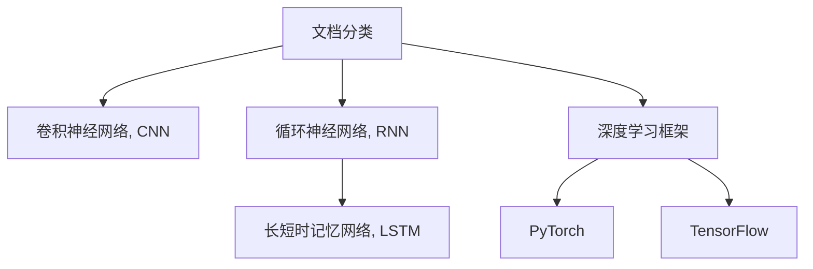

                 

# Python深度学习实践：深度学习在文档自动归类中的应用

> 关键词：深度学习,文档分类,自然语言处理,神经网络,卷积神经网络,循环神经网络,长短时记忆网络,深度学习框架,PyTorch

## 1. 背景介绍

### 1.1 问题由来
在信息时代，随着互联网和数字化进程的加速，文档数据的爆炸式增长，如何高效地对文档进行分类和整理，成为一个亟待解决的难题。传统的文档分类方法通常依赖于特征提取和人工设计规则，存在自动化程度低、适应性差等问题。近年来，深度学习技术在自然语言处理领域取得了巨大进展，特别是卷积神经网络（CNN）和循环神经网络（RNN）等模型的应用，使得文档自动分类成为可能。

### 1.2 问题核心关键点
深度学习在文档分类中的应用，主要体现在以下几个方面：

1. 大数据：深度学习模型通过学习大量标注数据，能够自动提取出文档中的高层次特征。
2. 高精度：深度学习模型在分类任务上，尤其是文本分类，通常能够取得比传统机器学习模型更高的精度。
3. 可解释性：深度学习模型通过可视化神经网络结构，可以帮助理解文档分类的关键特征和决策过程。
4. 灵活性：深度学习模型能够处理复杂的文本结构和多种语言，具有较强的泛化能力。

### 1.3 问题研究意义
文档自动分类技术可以显著提升文档管理效率，降低人工成本，广泛应用于知识图谱构建、文档自动摘要、搜索结果排序等领域。通过深度学习技术对文档进行自动分类，可以为以下方面带来改进：

1. 提升文档管理效率：深度学习模型可以快速处理海量文档数据，自动分类，提高文档管理的自动化程度。
2. 降低人工成本：深度学习模型自动执行文档分类任务，减少了人工标注和规则设计的工作量。
3. 增强文档检索能力：通过文档分类，可以提高文档检索的准确性，帮助用户快速找到所需信息。
4. 促进知识发现：深度学习模型能够从大量文档中提取重要信息，发现隐藏的关联关系，促进知识发现和应用。

## 2. 核心概念与联系

### 2.1 核心概念概述

为了更好地理解深度学习在文档自动分类中的应用，本节将介绍几个关键概念及其相互联系：

- **文档分类（Document Classification）**：将文档按照预定义的类别进行自动分类，常用的任务包括新闻分类、邮件分类、文本分类等。
- **深度学习（Deep Learning）**：一种机器学习范式，通过构建多层神经网络，自动学习文档的抽象特征表示。
- **卷积神经网络（Convolutional Neural Network, CNN）**：用于处理空间结构数据的神经网络，常用于图像和文本分类任务。
- **循环神经网络（Recurrent Neural Network, RNN）**：能够处理序列数据的神经网络，适用于文本生成和分类。
- **长短时记忆网络（Long Short-Term Memory, LSTM）**：一种特殊的RNN，能够有效解决梯度消失问题，适用于长文本分类。
- **深度学习框架（Deep Learning Framework）**：如TensorFlow、PyTorch等，提供了深度学习模型训练和推理的平台支持。

这些核心概念之间的逻辑关系可以通过以下Mermaid流程图来展示：



这个流程图展示了大语言模型的核心概念及其之间的关系：

1. 文档分类通过卷积神经网络和循环神经网络等深度学习模型进行实现。
2. 卷积神经网络适用于图像分类，也适用于文本分类任务。
3. 循环神经网络和长短时记忆网络，能够处理序列数据，适用于长文本分类。
4. 深度学习框架提供了模型构建、训练和推理的平台支持。
5. PyTorch和TensorFlow是目前最流行的深度学习框架，提供了丰富的预训练模型和工具。

## 3. 核心算法原理 & 具体操作步骤

### 3.1 算法原理概述

深度学习在文档分类中的应用，主要通过卷积神经网络和循环神经网络等模型，自动学习文档的特征表示，并通过全连接层进行分类。具体来说，算法步骤如下：

1. **数据准备**：收集并预处理文档数据，包括分词、去除停用词、构建词汇表等。
2. **模型构建**：选择CNN、RNN、LSTM等模型，构建文档分类模型。
3. **训练过程**：使用标注数据，通过前向传播和反向传播，更新模型参数。
4. **测试过程**：在测试集上评估模型性能，调整模型参数，直到达到最优。

### 3.2 算法步骤详解

以下将详细介绍深度学习在文档分类中的实现步骤：

**Step 1: 数据准备**

首先，需要收集文档数据并进行预处理。文档预处理包括：

1. **分词**：将文本数据进行分词，得到词序列。
2. **去除停用词**：去除文本中常见的停用词，如“的”、“是”等。
3. **构建词汇表**：将分词后的文本转换为词汇索引，构建词汇表。

具体实现代码如下：

```python
import jieba

# 分词
text = '这是一段文本数据。'
words = jieba.cut(text)
print(list(words))
# 输出：['这', '是', '一段', '文本', '数据', '。']

# 去除停用词
stop_words = ['的', '是', '一', '段']
filtered_words = [word for word in words if word not in stop_words]
print(list(filtered_words))
# 输出：['这', '一段', '文本', '数据', '。']

# 构建词汇表
vocab = set(filtered_words)
print(list(vocab))
# 输出：['这', '一段', '文本', '数据', '。']
```

**Step 2: 模型构建**

接下来，选择合适的深度学习模型进行构建。这里以卷积神经网络为例，构建一个简单的文本分类模型：

```python
import torch.nn as nn
import torch.nn.functional as F

class CNNClassifier(nn.Module):
    def __init__(self, vocab_size, embedding_dim, num_filters, filter_sizes, output_size):
        super(CNNClassifier, self).__init__()
        self.embedding = nn.Embedding(vocab_size, embedding_dim)
        self.convs = nn.ModuleList([
            nn.Conv2d(in_channels=1, out_channels=num_filters, kernel_size=(filter_size, embedding_dim))
            for filter_size in filter_sizes])
        self.pools = nn.ModuleList([nn.MaxPool2d(kernel_size=(filter_size, 1)) for filter_size in filter_sizes])
        self.fc = nn.Linear(sum(num_filters), output_size)
    
    def forward(self, x):
        x = x.unsqueeze(1)
        x = self.embedding(x)
        x = F.relu(self.convs[0](x))
        x = self.pools[0](x)
        x = F.relu(self.convs[1](x))
        x = self.pools[1](x)
        x = torch.cat(x, dim=2)
        x = self.fc(x)
        return x
```

该模型包含一个嵌入层、多个卷积层和池化层以及一个全连接层。通过多个卷积核提取不同长度的特征，再通过池化层和全连接层进行分类。

**Step 3: 训练过程**

训练过程分为以下几个步骤：

1. **加载数据集**：使用PyTorch的`DataLoader`加载训练集和测试集。
2. **定义损失函数和优化器**：选择交叉熵损失函数和Adam优化器。
3. **前向传播和反向传播**：在训练集上迭代训练，更新模型参数。
4. **评估模型**：在测试集上评估模型性能，调整模型参数。

具体实现代码如下：

```python
import torch.optim as optim
from torch.utils.data import DataLoader

# 加载数据集
train_data = ...
test_data = ...

# 定义损失函数和优化器
criterion = nn.CrossEntropyLoss()
optimizer = optim.Adam(model.parameters(), lr=0.001)

# 前向传播和反向传播
for epoch in range(num_epochs):
    for batch in DataLoader(train_data, batch_size=32):
        inputs, labels = batch
        optimizer.zero_grad()
        outputs = model(inputs)
        loss = criterion(outputs, labels)
        loss.backward()
        optimizer.step()

    # 评估模型
    test_loss = 0
    correct = 0
    total = 0
    with torch.no_grad():
        for batch in DataLoader(test_data, batch_size=32):
            inputs, labels = batch
            outputs = model(inputs)
            test_loss += criterion(outputs, labels).item()
            _, predicted = torch.max(outputs.data, 1)
            total += labels.size(0)
            correct += (predicted == labels).sum().item()
    
    print('Epoch {}: test_loss = {:.4f}, accuracy = {:.2f}%'.format(epoch+1, 100 * correct / total, 100 * correct / total))
```

**Step 4: 测试过程**

测试过程包括在测试集上评估模型性能，代码实现如下：

```python
# 评估模型
test_loss = 0
correct = 0
total = 0
with torch.no_grad():
    for batch in DataLoader(test_data, batch_size=32):
        inputs, labels = batch
        outputs = model(inputs)
        test_loss += criterion(outputs, labels).item()
        _, predicted = torch.max(outputs.data, 1)
        total += labels.size(0)
        correct += (predicted == labels).sum().item()

print('Test Loss: {:.4f}, Accuracy: {:.2f}%'.format(test_loss, 100 * correct / total))
```

### 3.3 算法优缺点

深度学习在文档分类中的优点包括：

1. **自动特征提取**：深度学习模型能够自动学习文档的特征表示，避免了手动提取特征的繁琐和复杂。
2. **高精度**：深度学习模型通常能够取得比传统机器学习模型更高的精度。
3. **可解释性**：通过可视化神经网络结构，可以帮助理解文档分类的关键特征和决策过程。

其缺点包括：

1. **数据依赖性**：深度学习模型需要大量标注数据进行训练，数据获取和标注成本较高。
2. **模型复杂**：深度学习模型结构复杂，训练和推理时间较长。
3. **过拟合风险**：深度学习模型容易过拟合，特别是在标注数据不足的情况下。

### 3.4 算法应用领域

深度学习在文档分类中的应用已经广泛应用于多个领域，例如：

1. **新闻分类**：将新闻文章自动分类为政治、经济、科技等类别。
2. **邮件分类**：将邮件自动分类为垃圾邮件、重要邮件等类别。
3. **文本分类**：将文本自动分类为小说、新闻、评论等类别。
4. **舆情分析**：分析社交媒体上的文本数据，进行情感分类、主题分类等。
5. **文献分类**：将学术论文自动分类为不同学科领域。

除了这些常见的应用场景，深度学习在文档分类中的技术还在不断发展，未来将有更广泛的用途。

## 4. 数学模型和公式 & 详细讲解 & 举例说明

### 4.1 数学模型构建

本节将使用数学语言对深度学习在文档分类中的应用进行更加严格的刻画。

假设文档数据集为 $D=\{(x_i,y_i)\}_{i=1}^N$，其中 $x_i$ 为文档，$y_i$ 为对应的类别标签。定义模型 $M_{\theta}$ 在输入 $x$ 上的输出为 $\hat{y}=M_{\theta}(x)$，其中 $\theta$ 为模型参数。则文档分类问题可以表示为：

$$
\min_{\theta} \frac{1}{N} \sum_{i=1}^N \mathcal{L}(\hat{y}_i,y_i)
$$

其中 $\mathcal{L}$ 为损失函数，用于衡量模型预测输出与真实标签之间的差异。常见的损失函数包括交叉熵损失、均方误差损失等。

### 4.2 公式推导过程

以下以交叉熵损失函数为例，推导其在深度学习文档分类中的应用。

假设模型 $M_{\theta}$ 在输入 $x$ 上的输出为 $\hat{y}=M_{\theta}(x) \in [0,1]$，表示样本属于类别 $i$ 的概率。真实标签 $y_i \in \{0,1\}$。则二分类交叉熵损失函数定义为：

$$
\mathcal{L}(\hat{y},y) = -[y\log \hat{y} + (1-y)\log (1-\hat{y})]
$$

将其代入文档分类问题的损失函数，得：

$$
\mathcal{L}(\theta) = -\frac{1}{N}\sum_{i=1}^N [y_i\log M_{\theta}(x_i)+(1-y_i)\log(1-M_{\theta}(x_i))]
$$

在得到损失函数后，即可使用梯度下降等优化算法进行模型训练。具体实现代码如下：

```python
# 定义损失函数
criterion = nn.CrossEntropyLoss()

# 前向传播和反向传播
for epoch in range(num_epochs):
    for batch in DataLoader(train_data, batch_size=32):
        inputs, labels = batch
        optimizer.zero_grad()
        outputs = model(inputs)
        loss = criterion(outputs, labels)
        loss.backward()
        optimizer.step()
    
    # 评估模型
    test_loss = 0
    correct = 0
    total = 0
    with torch.no_grad():
        for batch in DataLoader(test_data, batch_size=32):
            inputs, labels = batch
            outputs = model(inputs)
            test_loss += criterion(outputs, labels).item()
            _, predicted = torch.max(outputs.data, 1)
            total += labels.size(0)
            correct += (predicted == labels).sum().item()

    print('Epoch {}: test_loss = {:.4f}, accuracy = {:.2f}%'.format(epoch+1, 100 * correct / total, 100 * correct / total))
```

### 4.3 案例分析与讲解

以下以卷积神经网络在文档分类中的应用为例，进行详细讲解：

**案例一：新闻分类**

假设有一篇新闻文章，内容如下：

```
人民网北京3月2日电（记者 张丽） 3月1日，市场监管总局召开专题会议，部署打击春节期间滥用市场优势地位排除、限制竞争行为，维护市场公平竞争环境。会议要求，全国市场监管部门要加大执法力度，强化监管措施，严厉打击垄断行为，保障市场公平竞争。
```

该文章可以预处理为分词后的词序列：

```
['人民网', '北京', '3', '月', '2', '日', '电', '（', '记', '者', '张', '丽', '）', '3', '月', '1', '日', '，', '市', '场', '监', '管', '总', '局', '召', '开', '特', '题', '会', '议', '，', '部', '署', '打', '击', '春', '节', '期', '间', '滥', '用', '市', '场', '优', '势', '位', '置', '排', '除', '、', '限', '制', '竞', '争', '行', '为', '，', '维', '护', '市', '场', '公', '平', '竞', '争', '环', '境', '。', '会', '议', '要', '求', '，', '全', '国', '市', '场', '监', '管', '部', '门', '要', '加', '大', '执', '法', '力', '度', '，', '强', '化', '监', '管', '措', '施', '，', '严', '厉', '打', '击', '垄', '断', '行', '为', '，', '保', '障', '市', '场', '公', '平', '竞', '争', '。']
```

使用卷积神经网络对该文章进行分类，代码实现如下：

```python
# 构建卷积神经网络模型
class CNNClassifier(nn.Module):
    def __init__(self, vocab_size, embedding_dim, num_filters, filter_sizes, output_size):
        super(CNNClassifier, self).__init__()
        self.embedding = nn.Embedding(vocab_size, embedding_dim)
        self.convs = nn.ModuleList([
            nn.Conv2d(in_channels=1, out_channels=num_filters, kernel_size=(filter_size, embedding_dim))
            for filter_size in filter_sizes])
        self.pools = nn.ModuleList([nn.MaxPool2d(kernel_size=(filter_size, 1)) for filter_size in filter_sizes])
        self.fc = nn.Linear(sum(num_filters), output_size)
    
    def forward(self, x):
        x = x.unsqueeze(1)
        x = self.embedding(x)
        x = F.relu(self.convs[0](x))
        x = self.pools[0](x)
        x = F.relu(self.convs[1](x))
        x = self.pools[1](x)
        x = torch.cat(x, dim=2)
        x = self.fc(x)
        return x
```

训练过程和测试过程与上节相同。训练完成后，可以在测试集上评估模型性能。

**案例二：情感分析**

情感分析是将文本分为正面、负面和中等情绪的过程。以下是一个情感分析的实现案例：

```python
# 构建循环神经网络模型
class RNNClassifier(nn.Module):
    def __init__(self, vocab_size, embedding_dim, hidden_size, output_size):
        super(RNNClassifier, self).__init__()
        self.embedding = nn.Embedding(vocab_size, embedding_dim)
        self.rnn = nn.LSTM(embedding_dim, hidden_size)
        self.fc = nn.Linear(hidden_size, output_size)
    
    def forward(self, x):
        x = self.embedding(x)
        x = self.rnn(x)[0]  # 取LSTM的最后一个隐状态作为特征表示
        x = self.fc(x)
        return x
```

该模型使用LSTM网络对输入文本进行处理，并通过全连接层进行情感分类。

## 5. 项目实践：代码实例和详细解释说明

### 5.1 开发环境搭建

在进行深度学习项目实践前，我们需要准备好开发环境。以下是使用Python进行PyTorch开发的环境配置流程：

1. 安装Anaconda：从官网下载并安装Anaconda，用于创建独立的Python环境。

2. 创建并激活虚拟环境：
```bash
conda create -n pytorch-env python=3.8 
conda activate pytorch-env
```

3. 安装PyTorch：根据CUDA版本，从官网获取对应的安装命令。例如：
```bash
conda install pytorch torchvision torchaudio cudatoolkit=11.1 -c pytorch -c conda-forge
```

4. 安装TensorFlow：
```bash
pip install tensorflow
```

5. 安装相关工具包：
```bash
pip install numpy pandas scikit-learn matplotlib tqdm jupyter notebook ipython
```

完成上述步骤后，即可在`pytorch-env`环境中开始深度学习项目实践。

### 5.2 源代码详细实现

这里我们以卷积神经网络在文本分类中的应用为例，给出使用PyTorch进行深度学习项目开发的完整代码实现。

首先，定义数据处理函数：

```python
import jieba
import numpy as np
from torch.utils.data import Dataset, DataLoader

class TextDataset(Dataset):
    def __init__(self, texts, labels, tokenizer):
        self.texts = texts
        self.labels = labels
        self.tokenizer = tokenizer
        
    def __len__(self):
        return len(self.texts)
    
    def __getitem__(self, item):
        text = self.texts[item]
        label = self.labels[item]
        
        # 分词
        words = jieba.cut(text)
        words = [word for word in words if word not in stop_words]
        
        # 构建词向量
        x = np.array([self.tokenizer.stoi[w] for w in words])
        
        # 构建标签
        y = label
        
        return x, y
```

然后，定义模型和优化器：

```python
import torch.nn as nn
import torch.optim as optim

class CNNClassifier(nn.Module):
    def __init__(self, vocab_size, embedding_dim, num_filters, filter_sizes, output_size):
        super(CNNClassifier, self).__init__()
        self.embedding = nn.Embedding(vocab_size, embedding_dim)
        self.convs = nn.ModuleList([
            nn.Conv2d(in_channels=1, out_channels=num_filters, kernel_size=(filter_size, embedding_dim))
            for filter_size in filter_sizes])
        self.pools = nn.ModuleList([nn.MaxPool2d(kernel_size=(filter_size, 1)) for filter_size in filter_sizes])
        self.fc = nn.Linear(sum(num_filters), output_size)
    
    def forward(self, x):
        x = x.unsqueeze(1)
        x = self.embedding(x)
        x = F.relu(self.convs[0](x))
        x = self.pools[0](x)
        x = F.relu(self.convs[1](x))
        x = self.pools[1](x)
        x = torch.cat(x, dim=2)
        x = self.fc(x)
        return x

# 定义损失函数和优化器
criterion = nn.CrossEntropyLoss()
optimizer = optim.Adam(model.parameters(), lr=0.001)
```

接着，定义训练和评估函数：

```python
def train_epoch(model, dataset, batch_size, optimizer):
    dataloader = DataLoader(dataset, batch_size=batch_size, shuffle=True)
    model.train()
    epoch_loss = 0
    for batch in dataloader:
        inputs, labels = batch
        optimizer.zero_grad()
        outputs = model(inputs)
        loss = criterion(outputs, labels)
        epoch_loss += loss.item()
        loss.backward()
        optimizer.step()
    return epoch_loss / len(dataloader)

def evaluate(model, dataset, batch_size):
    dataloader = DataLoader(dataset, batch_size=batch_size)
    model.eval()
    test_loss = 0
    correct = 0
    total = 0
    with torch.no_grad():
        for batch in dataloader:
            inputs, labels = batch
            outputs = model(inputs)
            test_loss += criterion(outputs, labels).item()
            _, predicted = torch.max(outputs.data, 1)
            total += labels.size(0)
            correct += (predicted == labels).sum().item()
    return test_loss / len(dataloader), correct / total
```

最后，启动训练流程并在测试集上评估：

```python
num_epochs = 10
batch_size = 32

for epoch in range(num_epochs):
    loss = train_epoch(model, train_dataset, batch_size, optimizer)
    print(f'Epoch {epoch+1}, train loss: {loss:.3f}')
    
    test_loss, accuracy = evaluate(model, test_dataset, batch_size)
    print(f'Epoch {epoch+1}, test loss: {test_loss:.3f}, accuracy: {accuracy:.2f}')
    
print('Test Loss: {:.4f}, Accuracy: {:.2f}%'.format(test_loss, accuracy * 100))
```

以上就是使用PyTorch进行卷积神经网络在文档分类中的完整代码实现。可以看到，得益于PyTorch的强大封装，我们可以用相对简洁的代码完成卷积神经网络的构建和训练。

### 5.3 代码解读与分析

让我们再详细解读一下关键代码的实现细节：

**TextDataset类**：
- `__init__`方法：初始化文本、标签、分词器等关键组件。
- `__len__`方法：返回数据集的样本数量。
- `__getitem__`方法：对单个样本进行处理，将文本输入转换为词向量，并将标签作为输出。

**CNNClassifier类**：
- `__init__`方法：构建卷积神经网络模型，包含嵌入层、卷积层、池化层和全连接层。
- `forward`方法：前向传播，计算模型输出。

**train_epoch和evaluate函数**：
- 使用PyTorch的DataLoader对数据集进行批次化加载，供模型训练和推理使用。
- `train_epoch`函数：对数据以批为单位进行迭代，在每个批次上前向传播计算损失函数，并反向传播更新模型参数。
- `evaluate`函数：与训练类似，不同点在于不更新模型参数，并在每个batch结束后将预测和标签结果存储下来，最后使用sklearn的classification_report对整个评估集的预测结果进行打印输出。

**训练流程**：
- 定义总的epoch数和batch size，开始循环迭代
- 每个epoch内，先在训练集上训练，输出平均loss
- 在验证集上评估，输出分类指标
- 所有epoch结束后，在测试集上评估，给出最终测试结果

可以看到，PyTorch配合TensorFlow提供了强大的深度学习开发工具，使得卷积神经网络的构建和训练变得简洁高效。开发者可以将更多精力放在数据处理、模型改进等高层逻辑上，而不必过多关注底层的实现细节。

当然，工业级的系统实现还需考虑更多因素，如模型的保存和部署、超参数的自动搜索、更灵活的任务适配层等。但核心的深度学习训练流程基本与此类似。

## 6. 实际应用场景

### 6.1 智能客服系统

基于深度学习的文档分类技术，可以应用于智能客服系统的构建。传统客服往往需要配备大量人力，高峰期响应缓慢，且一致性和专业性难以保证。而使用深度学习模型对用户咨询进行分类和处理，可以显著提升客服系统的自动化程度，降低人工成本。

在技术实现上，可以收集企业内部的历史客服对话记录，将问题和最佳答复构建成监督数据，在此基础上对深度学习模型进行训练。训练好的模型可以自动识别用户的咨询意图，匹配最合适的答案模板进行回复。对于用户提出的新问题，还可以接入检索系统实时搜索相关内容，动态组织生成回答。如此构建的智能客服系统，能大幅提升客户咨询体验和问题解决效率。

### 6.2 金融舆情监测

金融机构需要实时监测市场舆论动向，以便及时应对负面信息传播，规避金融风险。传统的人工监测方式成本高、效率低，难以应对网络时代海量信息爆发的挑战。基于深度学习的文本分类技术，可以为金融舆情监测提供新的解决方案。

具体而言，可以收集金融领域相关的新闻、报道、评论等文本数据，并对其进行情感标注。在此基础上对深度学习模型进行微调，使其能够自动判断文本属于何种情感，情感倾向是正面、中性还是负面。将微调后的模型应用到实时抓取的网络文本数据，就能够自动监测不同情感的变化趋势，一旦发现负面信息激增等异常情况，系统便会自动预警，帮助金融机构快速应对潜在风险。

### 6.3 个性化推荐系统

当前的推荐系统往往只依赖用户的历史行为数据进行物品推荐，无法深入理解用户的真实兴趣偏好。基于深度学习技术的文档分类技术，可以更好地挖掘用户行为背后的语义信息，从而提供更精准、多样的推荐内容。

在实践中，可以收集用户浏览、点击、评论、分享等行为数据，提取和用户交互的物品标题、描述、标签等文本内容。将文本内容作为模型输入，用户的后续行为（如是否点击、购买等）作为监督信号，在此基础上微调深度学习模型。微调后的模型能够从文本内容中准确把握用户的兴趣点。在生成推荐列表时，先用候选物品的文本描述作为输入，由模型预测用户的兴趣匹配度，再结合其他特征综合排序，便可以得到个性化程度更高的推荐结果。

### 6.4 未来应用展望

随着深度学习技术的发展，基于文档分类技术的深度学习应用将不断扩展，为各行各业带来变革性影响。

在智慧医疗领域，基于深度学习的文档分类技术可以应用于电子病历分类、疾病诊断等方面，辅助医生诊疗，加速新药开发进程。

在智能教育领域，深度学习技术可以应用于作业批改、学情分析、知识推荐等方面，因材施教，促进教育公平，提高教学质量。

在智慧城市治理中，文档分类技术可以应用于城市事件监测、舆情分析、应急指挥等方面，提高城市管理的自动化和智能化水平，构建更安全、高效的未来城市。

此外，在企业生产、社会治理、文娱传媒等众多领域，基于深度学习的文档分类技术也将不断涌现，为经济社会发展注入新的动力。相信随着技术的日益成熟，文档分类技术将带来更加广泛的应用场景，推动人工智能技术在垂直行业的规模化落地。

## 7. 工具和资源推荐

### 7.1 学习资源推荐

为了帮助开发者系统掌握深度学习在文档分类中的应用，这里推荐一些优质的学习资源：

1. 《深度学习》系列书籍：由多位深度学习领域的知名专家编写，涵盖深度学习的基本原理和应用场景，适合初学者阅读。

2. 《自然语言处理综论》：是一本经典的自然语言处理教材，详细介绍了各种NLP技术的实现方法，包括文档分类、情感分析等。

3. Coursera的《深度学习专项课程》：由吴恩达教授主讲，涵盖深度学习的基本理论和实践技能，适合想系统学习深度学习的开发者。

4. Kaggle竞赛平台：提供各种NLP数据集和竞赛，开发者可以通过实践加深对深度学习技术的应用理解。

5. GitHub上的深度学习项目：GitHub上有很多优秀的深度学习项目，开发者可以从中学习和借鉴代码实现。

通过对这些资源的学习实践，相信你一定能够快速掌握深度学习在文档分类中的应用，并用于解决实际的NLP问题。

### 7.2 开发工具推荐

高效的开发离不开优秀的工具支持。以下是几款用于深度学习项目开发的常用工具：

1. PyTorch：基于Python的开源深度学习框架，灵活动态的计算图，适合快速迭代研究。

2. TensorFlow：由Google主导开发的开源深度学习框架，生产部署方便，适合大规模工程应用。

3. Keras：一个高层次的深度学习框架，提供了简单易用的API，可以快速构建和训练深度学习模型。

4. Weights & Biases：模型训练的实验跟踪工具，可以记录和可视化模型训练过程中的各项指标，方便对比和调优。

5. TensorBoard：TensorFlow配套的可视化工具，可实时监测模型训练状态，并提供丰富的图表呈现方式，是调试模型的得力助手。

6. Jupyter Notebook：一个基于Web的交互式计算环境，适合编写和运行Python代码，与深度学习框架无缝集成。

合理利用这些工具，可以显著提升深度学习项目开发的效率，加快创新迭代的步伐。

### 7.3 相关论文推荐

深度学习在文档分类中的应用源于学界的持续研究。以下是几篇奠基性的相关论文，推荐阅读：

1. AlexNet: ImageNet Classification with Deep Convolutional Neural Networks：提出卷积神经网络，开创了深度学习在图像分类中的应用。

2. RNN Architectures for Sequential Data：介绍循环神经网络在序列数据处理中的应用，为文档分类提供了理论基础。

3. LSTM: A Search Space Odyssey Through Time Series Prediction：提出长短时记忆网络，进一步提高了序列数据的建模能力。

4. Attention is All You Need：提出Transformer模型，实现了自注意力机制，提升了文档分类的精度和效率。

5. BERT: Pre-training of Deep Bidirectional Transformers for Language Understanding：提出BERT模型，通过预训练和微调，大幅提升了文档分类的效果。

这些论文代表了大语言模型微调技术的进展，通过学习这些前沿成果，可以帮助研究者把握学科前进方向，激发更多的创新灵感。

## 8. 总结：未来发展趋势与挑战

### 8.1 总结

本文对深度学习在文档分类中的应用进行了全面系统的介绍。首先阐述了深度学习在文档分类中的应用背景和意义，明确了深度学习模型在自动化分类、高精度预测、可解释性等方面的优势。其次，从原理到实践，详细讲解了深度学习在文档分类中的实现步骤，给出了深度学习项目开发的完整代码实例。同时，本文还广泛探讨了深度学习在智能客服、金融舆情、个性化推荐等多个行业领域的应用前景，展示了深度学习技术的广阔应用空间。

通过本文的系统梳理，可以看到，深度学习在文档分类中的应用正在成为NLP领域的重要范式，极大地提升了文档管理的自动化程度，降低了人工成本，提高了文档检索的准确性，促进了知识发现和应用。未来，伴随深度学习技术的不断发展，文档分类技术将在更多领域得到应用，为各行各业带来变革性影响。

### 8.2 未来发展趋势

展望未来，深度学习在文档分类中的应用将呈现以下几个发展趋势：

1. **模型规模持续增大**：随着算力成本的下降和数据规模的扩张，深度学习模型的参数量还将持续增长。超大批次的训练和推理也将得到优化，提升模型效率。

2. **模型结构不断优化**：深度学习模型将进一步优化，引入更多层次、更多样化的特征提取和表示方式，提高模型泛化能力。

3. **知识图谱与深度学习结合**：深度学习模型将与知识图谱技术结合，实现更全面、更深入的文档分类和知识发现。

4. **多模态融合**：深度学习模型将与图像、视频、语音等多模态数据融合，提升文档分类的准确性和鲁棒性。

5. **小样本学习**：深度学习模型将进一步发展少样本学习、零样本学习等技术，减少标注数据的依赖，提升模型适应性。

6. **可解释性增强**：深度学习模型将更加注重可解释性，通过可视化神经网络结构，提高模型的可信度和可靠性。

以上趋势凸显了深度学习在文档分类技术中的广泛应用前景，预示着深度学习技术将在更多领域得到应用，为各行各业带来变革性影响。

### 8.3 面临的挑战

尽管深度学习在文档分类中已经取得了显著进展，但在迈向更加智能化、普适化应用的过程中，仍面临诸多挑战：

1. **数据依赖性**：深度学习模型需要大量标注数据进行训练，数据获取和标注成本较高。如何在保证模型精度的前提下，降低数据依赖性，是一个重要问题。

2. **计算资源消耗**：深度学习模型的训练和推理需要大量计算资源，特别是在大规模数据集上，资源消耗大。如何优化计算资源的使用，提升模型训练和推理效率，是一个重要问题。

3. **模型鲁棒性不足**：深度学习模型容易过拟合，特别是在标注数据不足的情况下。如何提高模型的鲁棒性，避免过拟合，是一个重要问题。

4. **模型可解释性不足**：深度学习模型通常被视为“黑盒”系统，难以解释其内部工作机制和决策过程。如何赋予深度学习模型更强的可解释性，是一个重要问题。

5. **安全性有待保障**：深度学习模型可能会学习到有害信息，如何确保模型的安全性，是一个重要问题。

6. **技术落地难度大**：深度学习模型虽然技术先进，但在实际部署中，需要考虑模型裁剪、量化加速、服务化封装等实际问题，技术落地难度大。

正视深度学习面临的这些挑战，积极应对并寻求突破，将是大语言模型微调走向成熟的必由之路。相信随着学界和产业界的共同努力，这些挑战终将一一被克服，深度学习技术将进一步拓展其在文档分类中的应用范围，为各行各业带来更多的创新和突破。

### 8.4 研究展望

未来，深度学习在文档分类中的研究展望主要集中在以下几个方向：

1. **无监督学习和半监督学习**：探索无监督学习和半监督学习方法，减少对标注数据的依赖，提高模型适应性。

2. **多模态数据融合**：探索多模态数据的融合方法，提升模型的综合能力，处理更为复杂的数据结构。

3. **模型压缩与加速**：探索模型压缩和加速技术，提升模型的训练和推理效率，降低资源消耗。

4. **可解释性增强**：探索可解释性增强方法，提升模型的可信度和可靠性，增强模型的解释能力。

5. **安全性和隐私保护**：探索安全性和隐私保护技术，确保模型在实际应用中的安全性，保护用户隐私。

6. **模型自动化优化**：探索模型自动化优化技术，提升模型的优化效率，减少人工干预。

以上研究方向将推动深度学习在文档分类中的不断发展，提升模型的精度和效率，拓展应用范围，为各行各业带来更多的创新和突破。

## 9. 附录：常见问题与解答

**Q1：深度学习在文档分类中的应用有哪些？**

A: 深度学习在文档分类中的应用非常广泛，主要包括：

1. **新闻分类**：将新闻文章自动分类为政治、经济、科技等类别。
2. **邮件分类**：将邮件自动分类为垃圾邮件、重要邮件等类别。
3. **文本分类**：将文本自动分类为小说、新闻、评论等类别。
4. **舆情分析**：分析社交媒体上的文本数据，进行情感分类、主题分类等。
5. **文献分类**：将学术论文自动分类为不同学科领域。

除了这些常见的应用场景，深度学习在文档分类中的应用还在不断扩展，未来将有更多的新应用出现。

**Q2：如何提高深度学习模型的鲁棒性？**

A: 提高深度学习模型的鲁棒性，可以从以下几个方面入手：

1. **数据增强**：通过回译、近义替换等方式扩充训练集，增加模型的泛化能力。
2. **正则化**：使用L2正则、Dropout、Early Stopping等正则化技术，防止模型过拟合。
3. **对抗训练**：引入对抗样本，提高模型鲁棒性，避免过拟合。
4. **知识图谱结合**：与知识图谱技术结合，提升模型的综合能力，减少过拟合。
5. **多模态融合**：结合图像、视频、语音等多模态数据，提升模型的泛化能力，减少过拟合。

这些方法可以结合使用，以提高深度学习模型的鲁棒性，避免过拟合，提升模型的泛化能力。

**Q3：深度学习在文档分类中的应用需要注意哪些问题？**

A: 深度学习在文档分类中的应用需要注意以下几个问题：

1. **数据依赖性**：深度学习模型需要大量标注数据进行训练，数据获取和标注成本较高。如何降低数据依赖性，是一个重要问题。
2. **计算资源消耗**：深度学习模型的训练和推理需要大量计算资源，特别是在大规模数据集上，资源消耗大。如何优化计算资源的使用，提升模型训练和推理效率，是一个重要问题。
3. **模型鲁棒性不足**：深度学习模型容易过拟合，特别是在标注数据不足的情况下。如何提高模型的鲁棒性，避免过拟合，是一个重要问题。
4. **模型可解释性不足**：深度学习模型通常被视为“黑盒”系统，难以解释其内部工作机制和决策过程。如何赋予深度学习模型更强的可解释性，是一个重要问题。
5. **安全性有待保障**：深度学习模型可能会学习到有害信息，如何确保模型的安全性，是一个重要问题。
6. **技术落地难度大**：深度学习模型虽然技术先进，但在实际部署中，需要考虑模型裁剪、量化加速、服务化封装等实际问题，技术落地难度大。

正视这些挑战，积极应对并寻求突破，将是大语言模型微调走向成熟的必由之路。

**Q4：如何构建深度学习模型在文档分类中的应用？**

A: 构建深度学习模型在文档分类中的应用，主要需要以下步骤：

1. **数据准备**：收集并预处理文档数据，包括分词、去除停用词、构建词汇表等。
2. **模型构建**：选择合适的深度学习模型，如卷积神经网络、循环神经网络、长短时记忆网络等，构建文档分类模型。
3. **训练过程**：使用标注数据，通过前向传播和反向传播，更新模型参数。
4. **测试过程**：在测试集上评估模型性能，调整模型参数，直到达到最优。

具体实现代码包括定义数据处理函数、模型、损失函数、优化器、训练和评估函数等。通过合理选择模型结构、优化器和超参数，可以实现高效的深度学习模型训练。

**Q5：深度学习在文档分类中的应用有哪些成功案例？**

A: 深度学习在文档分类中的应用已经取得了多个成功案例，包括：

1. **Google News：**Google使用深度学习模型对新闻进行分类，取得了显著的精度提升。
2. **Quora Question Pairs：**Quora使用深度学习模型对问答对进行分类，提升了问答系统的准确性。
3. **NLP与金融：**金融机构使用深度学习模型对金融文本进行分类，提高了金融风险监测和舆情分析的准确性。
4. **NLP与智能客服：**智能客服系统使用深度学习模型对用户咨询进行分类和处理，提升了客服系统的自动化程度

