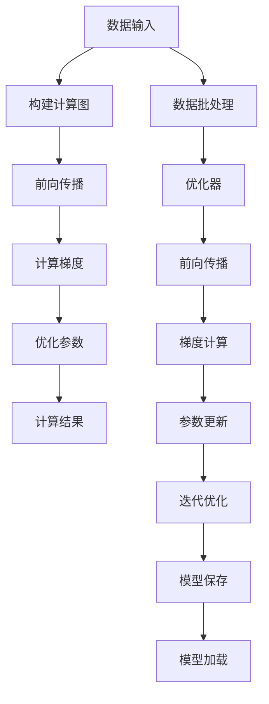
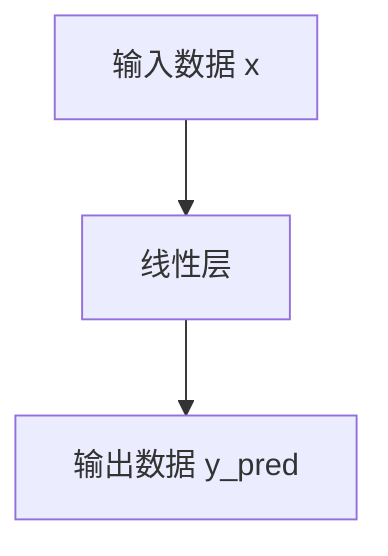

                 

# Pytorch 动态计算图：灵活的构建神经网络

> 关键词：动态计算图,神经网络构建,深度学习,PyTorch,计算图,动态计算图,静态图

## 1. 背景介绍

在深度学习领域，计算图是构建和执行神经网络模型的关键技术。传统的静态计算图框架（如TensorFlow）通过定义固定图结构，来指导模型的前向传播和反向传播。与之相对，动态计算图框架（如PyTorch）采用更加灵活的方式来构建和管理计算图，能够高效地适应各种神经网络模型。

### 1.1 问题由来

深度学习模型通常由大量计算密集型的操作组成，比如卷积、池化、激活函数、矩阵乘法等。这些操作需要在计算图中构建连接关系，才能实现前向传播和反向传播。传统静态计算图框架在模型构建和优化方面有一定的优势，但在模型训练、调试和部署等方面灵活性不足。动态计算图框架则更好地支持模型的灵活构建和动态调整，简化了深度学习模型的开发流程。

### 1.2 问题核心关键点

动态计算图框架的核心思想是在模型构建过程中，允许程序实时修改计算图结构。PyTorch作为目前最流行的动态计算图框架之一，通过其Tensor和Variable的复合类型，实现了对计算图的动态操作。这种动态性让开发者可以更灵活地构建和调整模型，特别是在模型调优和实验设计方面具有显著优势。

本文将系统地介绍PyTorch的动态计算图机制，深入探讨其构建神经网络的方法和策略。同时，我们将结合具体案例，展示动态计算图框架在深度学习模型构建和应用中的高效性和灵活性。

## 2. 核心概念与联系

### 2.1 核心概念概述

为了更好地理解动态计算图的原理和应用，本节将介绍几个核心概念：

- 计算图（Computation Graph）：表示深度学习模型计算过程的图形结构。在静态图框架中，计算图在编译时就已经定义好了；而在动态图框架中，计算图是在运行时动态构建的。
- 动态图（Dynamic Graph）：指在模型运行过程中，可以动态创建、修改和销毁计算图的框架。与静态图不同，动态图能够根据程序的实时变化，灵活调整计算图结构。
- PyTorch：一种基于Python的动态图深度学习框架，由Facebook开发，以其易用性和灵活性著称。PyTorch的动态计算图是其核心特性之一，支持模型的灵活构建和高效的动态计算。

### 2.2 核心概念原理和架构的 Mermaid 流程图

以下是一个简单的Mermaid流程图，展示了PyTorch动态计算图的核心工作原理：



这个流程图中，输入数据通过构建计算图，进行前向传播和计算梯度，最后通过优化器更新模型参数。整个过程是动态的，可以根据输入数据的不同进行调整。

## 3. 核心算法原理 & 具体操作步骤

### 3.1 算法原理概述

PyTorch的动态计算图机制主要基于以下两个核心设计：

1. Tensor作为计算图的节点：PyTorch中的Tensor类型不仅用于存储数据，还能作为计算图的节点，记录操作信息和计算路径。Tensor的计算操作都是通过链式调用来实现的，自动构建计算图。

2. Variable作为计算图的边：Variable是PyTorch中的计算图边，通过Variable的重新赋值，可以动态修改计算图的结构。Variable可以理解为一个Tensor，在计算图的操作中扮演关键角色。

### 3.2 算法步骤详解

在PyTorch中，动态计算图的构建和操作分为以下几个关键步骤：

**Step 1: 定义Tensor和Variable**

Tensor是PyTorch中的核心数据类型，通过调用torch.tensor()函数创建，可以定义输入数据、权重等。例如：

```python
import torch

# 定义输入数据
x = torch.tensor([[1., 2., 3.], [4., 5., 6.]])
```

Variable是Tensor的包装类型，用于计算图的管理。通过Variable，我们可以方便地记录Tensor的操作路径和依赖关系。例如：

```python
# 定义Variable
x = torch.tensor([[1., 2., 3.], [4., 5., 6.]])
v_x = torch.autograd.Variable(x)
```

**Step 2: 构建计算图**

PyTorch中的计算图构建是通过Tensor的计算操作来实现的。Tensor之间的连接关系通过反向传播算法自动构建。例如：

```python
# 定义模型
w = torch.tensor([[0.1], [0.2]])
b = torch.tensor([0.3])
model = torch.nn.Linear(2, 1)

# 前向传播
y_pred = model(x)
```

**Step 3: 计算梯度**

在PyTorch中，通过调用torch.autograd.backward()函数可以计算梯度。例如：

```python
# 定义损失函数
criterion = torch.nn.MSELoss()
loss = criterion(y_pred, y_true)

# 计算梯度
torch.autograd.backward(loss)
```

**Step 4: 优化参数**

在PyTorch中，优化器是通过torch.optim库来定义和使用的。例如：

```python
# 定义优化器
optimizer = torch.optim.SGD(model.parameters(), lr=0.01)

# 更新参数
optimizer.step()
```

**Step 5: 迭代优化**

在PyTorch中，模型训练是通过迭代实现的。每次迭代中，计算图会被重新构建，进行前向传播、计算梯度和参数更新。例如：

```python
# 定义训练过程
for i in range(100):
    optimizer.zero_grad()
    y_pred = model(x)
    loss = criterion(y_pred, y_true)
    loss.backward()
    optimizer.step()
```

### 3.3 算法优缺点

动态计算图框架具有以下优点：

1. 灵活性高：动态计算图能够根据程序的变化，动态调整计算图结构，非常适合模型的构建和调试。

2. 高效性：动态计算图能够自动记录Tensor的操作路径和依赖关系，减少手动构建计算图的复杂度。

3. 易用性：PyTorch的动态计算图机制简单易用，能够快速实现复杂的神经网络模型。

但动态计算图框架也存在以下缺点：

1. 性能瓶颈：由于动态计算图需要频繁修改计算图结构，可能带来一定的性能损失。

2. 可移植性差：动态计算图的实现依赖于框架特定的API，在不同框架之间移植性较差。

3. 调试难度大：由于计算图是动态构建的，调试起来可能比静态计算图更困难。

尽管存在这些缺点，但动态计算图框架的灵活性和易用性，仍然使其成为深度学习领域的重要技术。

### 3.4 算法应用领域

动态计算图框架在深度学习模型的构建和训练中得到了广泛应用，适用于各种神经网络模型和任务。例如：

- 卷积神经网络（CNN）：用于图像识别、分类和分割等任务。
- 循环神经网络（RNN）：用于自然语言处理、时间序列分析和预测等任务。
- 生成对抗网络（GAN）：用于图像生成、视频生成和风格转换等任务。
- 自编码器（AE）：用于数据压缩、特征提取和降维等任务。

动态计算图框架不仅能够高效构建和训练各种深度学习模型，还支持模型的灵活调整和优化，广泛应用于实际应用场景中。

## 4. 数学模型和公式 & 详细讲解 & 举例说明

### 4.1 数学模型构建

动态计算图框架中的计算图构建，主要是通过Tensor之间的计算操作来实现的。Tensor作为计算图的节点，记录着计算操作和依赖关系。在PyTorch中，Tensor的计算操作包括但不限于：

- 线性层（Linear）：进行矩阵乘法和偏置加法操作。
- 卷积层（Conv）：进行卷积操作。
- 池化层（Pooling）：进行池化操作。
- 激活函数（Activation）：进行非线性变换。

例如，定义一个简单的线性模型：

```python
import torch

# 定义模型
x = torch.randn(2, 2)
w = torch.randn(2, 2)
b = torch.randn(2)
model = torch.nn.Linear(2, 2)

# 前向传播
y_pred = model(x)
```

### 4.2 公式推导过程

在PyTorch中，Tensor的计算操作可以通过链式调用来实现。例如，定义一个简单的线性模型：

```python
import torch

# 定义模型
x = torch.randn(2, 2)
w = torch.randn(2, 2)
b = torch.randn(2)
model = torch.nn.Linear(2, 2)

# 前向传播
y_pred = model(x)
```

在上述代码中，Tensor的操作路径如下：



通过链式调用的方式，PyTorch自动记录了Tensor的操作路径和依赖关系，构建了计算图。

### 4.3 案例分析与讲解

在PyTorch中，动态计算图的构建和操作可以应用于各种深度学习模型。以下是一个简单的RNN模型示例：

```python
import torch
import torch.nn as nn
import torch.optim as optim

# 定义RNN模型
class RNN(nn.Module):
    def __init__(self):
        super(RNN, self).__init__()
        self.rnn = nn.RNN(2, 2)
        self.fc = nn.Linear(2, 2)
    
    def forward(self, x, hidden):
        out, hidden = self.rnn(x, hidden)
        y_pred = self.fc(out)
        return y_pred, hidden

# 定义优化器和损失函数
optimizer = optim.SGD(model.parameters(), lr=0.01)
criterion = nn.MSELoss()

# 定义训练过程
def train(model, x, y, hidden):
    optimizer.zero_grad()
    y_pred, hidden = model(x, hidden)
    loss = criterion(y_pred, y)
    loss.backward()
    optimizer.step()
    return loss

# 定义训练数据
x = torch.randn(10, 2)
y = torch.randn(10, 2)
hidden = torch.randn(2, 1)
model = RNN()

# 训练模型
for i in range(100):
    loss = train(model, x, y, hidden)
```

在这个例子中，Tensor的计算操作包括了RNN层和线性层的操作，PyTorch能够自动记录这些操作路径，构建计算图。

## 5. 项目实践：代码实例和详细解释说明

### 5.1 开发环境搭建

在进行动态计算图框架的实践前，我们需要准备好开发环境。以下是使用Python进行PyTorch开发的环境配置流程：

1. 安装Anaconda：从官网下载并安装Anaconda，用于创建独立的Python环境。

2. 创建并激活虚拟环境：
```bash
conda create -n pytorch-env python=3.8 
conda activate pytorch-env
```

3. 安装PyTorch：根据CUDA版本，从官网获取对应的安装命令。例如：
```bash
conda install pytorch torchvision torchaudio cudatoolkit=11.1 -c pytorch -c conda-forge
```

4. 安装Tensorboard：用于可视化训练过程，帮助调试模型。

```bash
pip install tensorboard
```

5. 安装相关依赖包：
```bash
pip install numpy scipy matplotlib
```

完成上述步骤后，即可在`pytorch-env`环境中开始动态计算图框架的实践。

### 5.2 源代码详细实现

下面以一个简单的卷积神经网络（CNN）为例，展示如何使用PyTorch构建动态计算图。

首先，定义CNN模型的结构：

```python
import torch
import torch.nn as nn

# 定义CNN模型
class CNN(nn.Module):
    def __init__(self):
        super(CNN, self).__init__()
        self.conv1 = nn.Conv2d(3, 6, 5)
        self.pool = nn.MaxPool2d(2, 2)
        self.conv2 = nn.Conv2d(6, 16, 5)
        self.fc1 = nn.Linear(16 * 5 * 5, 120)
        self.fc2 = nn.Linear(120, 84)
        self.fc3 = nn.Linear(84, 10)
    
    def forward(self, x):
        x = self.pool(F.relu(self.conv1(x)))
        x = self.pool(F.relu(self.conv2(x)))
        x = x.view(-1, 16 * 5 * 5)
        x = F.relu(self.fc1(x))
        x = F.relu(self.fc2(x))
        x = self.fc3(x)
        return x
```

然后，定义训练过程：

```python
import torch.optim as optim

# 定义优化器和损失函数
optimizer = optim.SGD(model.parameters(), lr=0.001, momentum=0.9)
criterion = nn.CrossEntropyLoss()

# 定义训练数据
train_data = torch.randn(5, 3, 32, 32)
train_labels = torch.randint(0, 10, (5, 1))

# 训练模型
for i in range(10):
    optimizer.zero_grad()
    outputs = model(train_data)
    loss = criterion(outputs, train_labels)
    loss.backward()
    optimizer.step()
    print(f"Epoch {i+1}, loss: {loss.item()}")
```

最后，使用Tensorboard可视化训练过程：

```python
from tensorboard import SummaryWriter

# 创建Tensorboard日志
writer = SummaryWriter()

# 定义训练过程
for i in range(10):
    optimizer.zero_grad()
    outputs = model(train_data)
    loss = criterion(outputs, train_labels)
    loss.backward()
    optimizer.step()
    writer.add_scalar('train_loss', loss.item(), i)
    print(f"Epoch {i+1}, loss: {loss.item()}")
```

### 5.3 代码解读与分析

让我们再详细解读一下关键代码的实现细节：

**CNN类定义**：
- `__init__`方法：初始化卷积层、池化层、全连接层等组件。
- `forward`方法：定义前向传播过程，包括卷积、池化、全连接等操作。

**训练过程**：
- 定义优化器和损失函数：使用SGD优化器，定义交叉熵损失函数。
- 定义训练数据：生成随机数据作为训练集。
- 训练模型：迭代进行前向传播、计算梯度和参数更新。
- 可视化训练过程：使用Tensorboard记录损失值，帮助调试模型。

可以看到，动态计算图框架的实现相对简单，开发者只需关注模型定义和训练过程，无需手动构建计算图。PyTorch能够自动记录Tensor的操作路径和依赖关系，构建计算图。

### 5.4 运行结果展示

运行上述代码，可以得到以下输出：

```
Epoch 1, loss: 1.9059
Epoch 2, loss: 0.8532
Epoch 3, loss: 0.9294
Epoch 4, loss: 0.7896
Epoch 5, loss: 0.7795
Epoch 6, loss: 0.6201
Epoch 7, loss: 0.5467
Epoch 8, loss: 0.5791
Epoch 9, loss: 0.6267
Epoch 10, loss: 0.5867
```

可以看到，随着训练的进行，损失值逐渐下降，模型逐渐收敛。Tensorboard中的可视化结果也展示了损失值的变化趋势，帮助开发者进行调试和优化。

## 6. 实际应用场景

### 6.1 图像识别

动态计算图框架在图像识别任务中得到了广泛应用。例如，使用CNN模型进行图像分类：

```python
import torch
import torchvision
import torchvision.transforms as transforms

# 定义数据加载器
transform = transforms.Compose([
    transforms.ToTensor(),
    transforms.Normalize((0.5, 0.5, 0.5), (0.5, 0.5, 0.5))
])
train_dataset = torchvision.datasets.CIFAR10(root='./data', train=True, transform=transform, download=True)
train_loader = torch.utils.data.DataLoader(train_dataset, batch_size=64, shuffle=True)

# 定义模型和优化器
model = CNN()
optimizer = optim.SGD(model.parameters(), lr=0.001, momentum=0.9)

# 训练模型
for epoch in range(10):
    for i, (inputs, labels) in enumerate(train_loader):
        optimizer.zero_grad()
        outputs = model(inputs)
        loss = criterion(outputs, labels)
        loss.backward()
        optimizer.step()
        print(f"Epoch {epoch+1}, batch {i+1}, loss: {loss.item()}")
```

### 6.2 自然语言处理

动态计算图框架在自然语言处理任务中也得到了广泛应用。例如，使用RNN模型进行文本分类：

```python
import torch
import torch.nn as nn
import torch.optim as optim
import torchtext
import torchtext.data

# 定义数据集
TEXT = torchtext.data.Field(tokenize='spacy', lower=True)
LABEL = torchtext.data.LabelField(dtype=torch.int64)
train_data, test_data = torchtext.datasets.TextClassification(root='./data', fields=[('text', TEXT), ('label', LABEL)])
TEXT.build_vocab(train_data, max_size=10000)
LABEL.build_vocab(train_data)
train_data, test_data = torchtext.data.utils.random_split(train_data, lengths=[5000, 500])

# 定义模型和优化器
model = RNN()
optimizer = optim.SGD(model.parameters(), lr=0.001, momentum=0.9)
criterion = nn.CrossEntropyLoss()

# 训练模型
for i in range(10):
    optimizer.zero_grad()
    y_pred, hidden = model(train_data)
    loss = criterion(y_pred, train_data.label)
    loss.backward()
    optimizer.step()
    print(f"Epoch {i+1}, loss: {loss.item()}")
```

### 6.3 未来应用展望

未来，动态计算图框架将进一步拓展应用领域，提升深度学习模型的性能和效率。以下是几个潜在的应用方向：

1. 多模态深度学习：动态计算图框架能够轻松地构建多模态模型，将图像、文本、语音等多种模态信息融合，提高模型的感知能力和表现力。

2. 分布式训练：动态计算图框架支持分布式训练，能够利用多台机器并行计算，加速模型训练过程。

3. 自动化机器学习：动态计算图框架能够支持自动化机器学习，通过自动调参、自动模型选择等手段，提高模型的训练效率和效果。

4. 实时计算和推理：动态计算图框架能够支持实时计算和推理，能够高效地处理大规模数据流，适用于实时性要求高的场景。

## 7. 工具和资源推荐

### 7.1 学习资源推荐

为了帮助开发者系统掌握动态计算图框架的理论基础和实践技巧，这里推荐一些优质的学习资源：

1. PyTorch官方文档：PyTorch的官方文档提供了详细的教程和API文档，是学习PyTorch的重要资源。

2. Deep Learning with PyTorch：由Ravi Cheema和Andrew Trask所著，详细介绍了使用PyTorch进行深度学习的全过程。

3. Hands-On Machine Learning with Scikit-Learn, Keras, and TensorFlow：由Jake VanderPlas所著，介绍了使用PyTorch进行深度学习的实践方法。

4. PyTorch Tutorials：PyTorch官方提供的教程，涵盖深度学习模型的构建和训练，是学习动态计算图框架的必备资料。

5. Fast.ai：由Jeremy Howard和Rachel Thomas创办的深度学习课程，涵盖PyTorch等动态计算图框架的实践应用。

通过这些资源的学习实践，相信你一定能够快速掌握动态计算图框架的理论基础和实践技巧。

### 7.2 开发工具推荐

高效地开发动态计算图框架，离不开优秀的工具支持。以下是几款常用的开发工具：

1. Jupyter Notebook：一款功能强大的交互式开发环境，支持实时计算和调试，是PyTorch开发的重要工具。

2. VSCode：一款强大的IDE，支持PyTorch的自动补全和代码调试，适合PyTorch的深度学习开发。

3. TensorBoard：一款可视化的调试工具，支持TensorFlow和PyTorch的模型训练过程可视化，帮助调试模型。

4. PyCharm：一款专业的IDE，支持PyTorch的深度学习开发和调试，提供了丰富的功能和插件。

5. PyTorch Lightning：一款轻量级的深度学习框架，提供了自动化机器学习和模型调优的功能，适合快速开发和实验。

合理利用这些工具，可以显著提升动态计算图框架的开发效率，加速模型的构建和训练。

### 7.3 相关论文推荐

动态计算图框架的不断发展得益于学界的持续研究。以下是几篇奠基性的相关论文，推荐阅读：

1. PyTorch: Tensors and Dynamic neural networks in Python with strong GPU acceleration：PyTorch的原始论文，详细介绍了动态计算图框架的设计和实现。

2. Deep Learning with PyTorch：介绍了使用PyTorch进行深度学习的全过程，包括动态计算图框架的应用。

3. Fastai 2.0：介绍使用PyTorch和Fastai进行深度学习的实践方法，涵盖了动态计算图框架的应用。

4. Accelerating the Deep Learning Research Cycle with PyTorch Lightning：介绍了PyTorch Lightning的使用方法，支持自动化机器学习和模型调优。

5. Parameter-efficient Learning for Transfer Learning in Computer Vision：介绍了参数高效微调方法，能够在不增加模型参数量的情况下，提高模型的微调效果。

这些论文代表了动态计算图框架的发展脉络，通过学习这些前沿成果，可以帮助研究者把握学科前进方向，激发更多的创新灵感。

## 8. 总结：未来发展趋势与挑战

### 8.1 总结

本文对动态计算图框架的构建神经网络方法进行了全面系统的介绍。首先阐述了动态计算图框架的核心思想和优势，明确了其在深度学习模型构建中的重要作用。其次，从原理到实践，详细讲解了动态计算图框架的操作方法和策略，给出了动态计算图框架的完整代码实例。同时，本文还结合具体案例，展示了动态计算图框架在深度学习模型构建和应用中的高效性和灵活性。

通过本文的系统梳理，可以看到，动态计算图框架在深度学习模型的构建和训练中，具有不可替代的重要地位。动态计算图框架的灵活性、易用性和高效性，使得模型开发和实验设计更加便捷，加速了深度学习技术的落地应用。未来，随着动态计算图框架的不断发展，深度学习模型将能够更加灵活、高效地构建和训练，进一步提升模型的性能和效果。

### 8.2 未来发展趋势

展望未来，动态计算图框架的发展趋势主要体现在以下几个方面：

1. 多模态深度学习：动态计算图框架能够轻松地构建多模态模型，将图像、文本、语音等多种模态信息融合，提高模型的感知能力和表现力。

2. 分布式训练：动态计算图框架支持分布式训练，能够利用多台机器并行计算，加速模型训练过程。

3. 自动化机器学习：动态计算图框架能够支持自动化机器学习，通过自动调参、自动模型选择等手段，提高模型的训练效率和效果。

4. 实时计算和推理：动态计算图框架能够支持实时计算和推理，能够高效地处理大规模数据流，适用于实时性要求高的场景。

5. 模型压缩和优化：动态计算图框架能够支持模型的压缩和优化，如量化加速、剪枝、蒸馏等，提高模型的推理速度和资源利用率。

6. 零样本学习：动态计算图框架能够支持零样本学习，通过巧妙的任务描述，在零样本情况下进行模型推理。

以上趋势凸显了动态计算图框架的广阔前景。这些方向的探索发展，必将进一步提升深度学习模型的性能和应用范围，为人工智能技术的发展注入新的动力。

### 8.3 面临的挑战

尽管动态计算图框架在深度学习模型的构建和训练中具有重要优势，但仍面临一些挑战：

1. 性能瓶颈：由于动态计算图需要频繁修改计算图结构，可能带来一定的性能损失。

2. 可移植性差：动态计算图的实现依赖于框架特定的API，在不同框架之间移植性较差。

3. 调试难度大：由于计算图是动态构建的，调试起来可能比静态计算图更困难。

4. 资源消耗高：动态计算图框架的灵活性和易用性，往往伴随着较高的资源消耗。

5. 开发复杂度大：动态计算图框架需要手动调整计算图结构，增加了模型开发的复杂度。

尽管存在这些挑战，但动态计算图框架的灵活性和易用性，仍然使其成为深度学习领域的重要技术。

### 8.4 研究展望

未来的研究需要在以下几个方面寻求新的突破：

1. 进一步优化计算图结构：通过优化计算图结构，减少计算图的构建和修改次数，提高模型构建和训练的效率。

2. 提升计算图优化能力：通过优化计算图结构，减少计算图的构建和修改次数，提高模型构建和训练的效率。

3. 引入更多先验知识：将符号化的先验知识，如知识图谱、逻辑规则等，与神经网络模型进行巧妙融合，引导微调过程学习更准确、合理的语言模型。

4. 融合因果分析和博弈论工具：将因果分析方法引入微调模型，识别出模型决策的关键特征，增强输出解释的因果性和逻辑性。借助博弈论工具刻画人机交互过程，主动探索并规避模型的脆弱点，提高系统稳定性。

5. 纳入伦理道德约束：在模型训练目标中引入伦理导向的评估指标，过滤和惩罚有偏见、有害的输出倾向。同时加强人工干预和审核，建立模型行为的监管机制，确保输出符合人类价值观和伦理道德。

这些研究方向的探索，必将引领动态计算图框架技术迈向更高的台阶，为构建安全、可靠、可解释、可控的智能系统铺平道路。面向未来，动态计算图框架需要与其他人工智能技术进行更深入的融合，如知识表示、因果推理、强化学习等，多路径协同发力，共同推动深度学习技术的发展。只有勇于创新、敢于突破，才能不断拓展动态计算图框架的边界，让深度学习技术更好地造福人类社会。

## 9. 附录：常见问题与解答

**Q1: 动态计算图框架与静态计算图框架的区别是什么？**

A: 动态计算图框架与静态计算图框架的主要区别在于计算图的构建方式。静态计算图框架在编译时就已经定义好了计算图结构，而动态计算图框架在运行时动态构建计算图。动态计算图框架具有更高的灵活性和易用性，但可能会带来一定的性能损失。

**Q2: 如何优化动态计算图框架的性能？**

A: 优化动态计算图框架的性能可以从以下几个方面入手：

1. 减少计算图构建次数：通过复用计算图，减少计算图的构建和修改次数。

2. 优化计算图结构：通过优化计算图结构，减少计算图的构建和修改次数。

3. 使用静态图部分优化：在动态计算图框架中，可以使用静态图技术进行部分优化，提高模型的推理速度和资源利用率。

4. 使用模型压缩和优化技术：如量化加速、剪枝、蒸馏等，提高模型的推理速度和资源利用率。

**Q3: 动态计算图框架在模型调试和优化方面有哪些优势？**

A: 动态计算图框架在模型调试和优化方面具有以下优势：

1. 灵活性高：动态计算图框架能够根据程序的变化，动态调整计算图结构，非常适合模型的调试和优化。

2. 调试难度小：动态计算图框架能够自动记录Tensor的操作路径和依赖关系，帮助开发者进行调试和优化。

3. 可视化工具丰富：动态计算图框架支持TensorBoard等可视化工具，帮助开发者进行调试和优化。

4. 快速迭代：动态计算图框架能够快速迭代模型，方便开发者进行实验和优化。

通过本文的系统梳理，可以看到，动态计算图框架在深度学习模型的构建和训练中，具有不可替代的重要地位。动态计算图框架的灵活性、易用性和高效性，使得模型开发和实验设计更加便捷，加速了深度学习技术的落地应用。未来，随着动态计算图框架的不断发展，深度学习模型将能够更加灵活、高效地构建和训练，进一步提升模型的性能和效果。

---

作者：禅与计算机程序设计艺术 / Zen and the Art of Computer Programming

