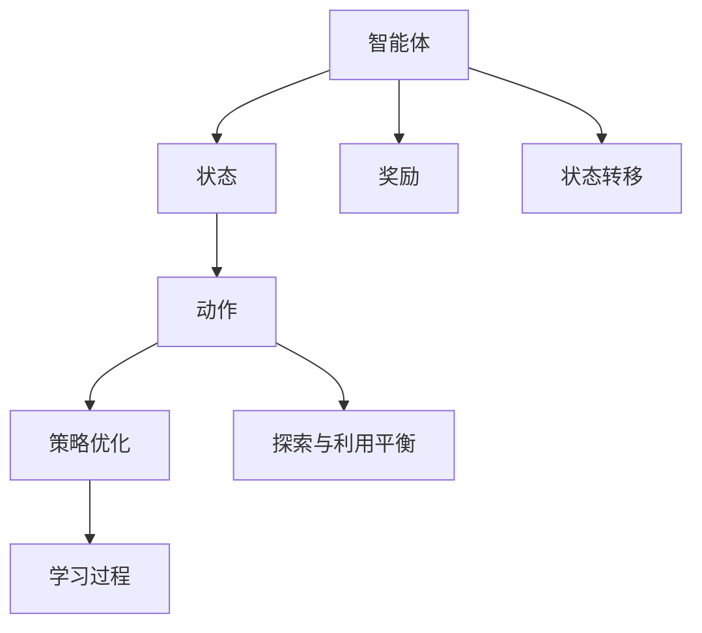

                 

## 1. 背景介绍

### 1.1 问题由来

强化学习（Reinforcement Learning, RL）作为人工智能领域的核心技术之一，近年来在游戏、机器人等诸多领域取得了显著的进展。通过智能体与环境的交互，智能体可以在不断尝试中学习最优策略，实现从感知到决策的自主控制。

强化学习源于经典的马尔可夫决策过程（Markov Decision Process, MDP）模型，但其应用领域已远远超越了理论本身。例如，在游戏领域，AI可以自主生成游戏角色、自适应游戏规则，甚至在高级竞技中胜过人类高手；在机器人领域，RL技术使得机器人在不确定的环境中完成复杂任务，如自主导航、物体抓取等。

### 1.2 问题核心关键点

强化学习在游戏和机器人中的应用，其核心关键点在于：
1. **智能体与环境交互**：智能体通过与环境的互动进行学习，智能体对环境的观测和行动直接影响其学习过程和策略选择。
2. **奖励机制**：通过定义适当的奖励函数，指导智能体追求最优解，并对次优解进行惩罚，从而实现学习目的。
3. **探索与利用平衡**：智能体需要在探索新策略与利用已知的良好策略之间进行权衡，以最大化奖励。
4. **模型构建与优化**：构建合适的状态-动作映射，并使用优化算法进行策略优化，提高学习效率和效果。

这些关键点构成了强化学习在游戏和机器人中的应用基础，推动了技术的发展和应用的拓展。

### 1.3 问题研究意义

强化学习在游戏和机器人中的应用，具有以下重要的研究意义：
1. **提升游戏智能化水平**：通过AI技术实现游戏中的自主决策和自适应性，推动电子游戏产业的进步和创新。
2. **增强机器人执行能力**：提升机器人在复杂环境中的自主决策和执行能力，加速机器人技术在工业、农业、家政等领域的应用。
3. **推动跨学科融合**：强化学习作为AI领域的核心技术，促进了计算机科学、数学、工程学等多学科的深度融合，推动了整个科技领域的发展。

本文将从强化学习的原理、应用和未来发展趋势等多个角度进行详细探讨，以期对游戏和机器人领域的智能决策技术提供有价值的见解和指导。

## 2. 核心概念与联系

### 2.1 核心概念概述

为了更好地理解强化学习在游戏和机器人中的应用，本节将介绍几个关键的概念及其联系：

- **强化学习（Reinforcement Learning, RL）**：通过智能体与环境的交互，智能体在不断尝试中学习最优策略，以最大化预期奖励的机器学习方法。
- **马尔可夫决策过程（Markov Decision Process, MDP）**：描述智能体与环境交互的一个数学框架，包括状态、动作、奖励和转移概率等元素。
- **状态-动作空间**：表示智能体所有可能的动作和对应的状态空间，是智能体学习的基础。
- **奖励函数（Reward Function）**：定义智能体执行动作后获得的奖励，指导智能体追求最优策略。
- **策略优化**：通过优化算法调整智能体的策略，使其在给定状态下选择最优动作。
- **探索与利用平衡（Exploration vs Exploitation）**：智能体需要在探索新策略和利用已知好策略之间进行权衡。

这些核心概念之间的逻辑关系可以通过以下Mermaid流程图来展示：



这个流程图展示了一个典型的马尔可夫决策过程，其中智能体通过状态和动作与环境交互，获得奖励并更新状态，最终优化策略。

## 3. 核心算法原理 & 具体操作步骤

### 3.1 算法原理概述

强化学习的核心思想是构建一个智能体（agent）与环境（environment）的互动模型，智能体通过与环境的不断交互，学习最优策略以最大化长期累积奖励。算法原理主要包括以下几个步骤：

1. **定义状态-动作空间**：智能体在每个状态下可以选择多个动作，每个动作会带来不同的奖励。
2. **定义奖励函数**：奖励函数用于评估智能体采取动作的好坏，通常采用累积奖励或即时奖励。
3. **策略定义**：策略定义了智能体在每个状态下采取动作的概率分布，通常以策略$\pi$表示。
4. **状态转移**：智能体在采取动作后，会从当前状态转移到下一个状态，状态转移概率由环境决定。
5. **策略优化**：通过最大化预期奖励来优化策略，通常使用价值迭代或策略梯度方法。
6. **探索与利用平衡**：智能体需要在探索新策略和利用已知好策略之间进行平衡，以最大化奖励。

### 3.2 算法步骤详解

强化学习在游戏和机器人中的应用，通常包括以下几个关键步骤：

**Step 1: 定义环境（Environment）**

- **环境定义**：首先定义游戏或机器人任务的环境，包括状态空间的表示、动作空间的大小、奖励函数的定义等。
- **环境模型**：使用模拟仿真或实时数据，构建环境模型以供智能体学习。

**Step 2: 选择算法（Algorithm）**

- **价值迭代算法（Value Iteration）**：适用于离散状态空间，通过迭代计算状态值函数，最终得到最优策略。
- **策略梯度算法（Policy Gradient）**：适用于连续动作空间，通过梯度上升优化策略函数，提高智能体的决策能力。
- **深度强化学习算法（Deep RL）**：将深度神经网络用于策略表示，实现更加复杂的决策过程。

**Step 3: 训练智能体（Agent）**

- **参数初始化**：选择适当的初始参数，如学习率、网络结构等。
- **迭代训练**：在环境模型上，通过不断交互和策略优化，训练智能体。
- **经验回放（Experience Replay）**：记录智能体的历史交互经验，定期进行回放，提高学习效率。

**Step 4: 策略评估与部署**

- **评估测试**：在测试环境中评估训练好的智能体的表现，检查其是否满足任务要求。
- **部署应用**：将训练好的智能体部署到实际环境中，进行任务的自动化执行。

### 3.3 算法优缺点

强化学习在游戏和机器人中的应用，具有以下优点：
1. **自主决策**：智能体可以通过与环境的交互自主学习最优策略，提升决策效率和效果。
2. **适应性强**：智能体可以自适应不同的环境和任务，具有较强的泛化能力。
3. **学习效率高**：通过迭代学习和经验回放，智能体可以高效地更新策略，减少试错成本。

同时，该方法也存在一些缺点：
1. **探索困难**：在复杂环境下，智能体需要平衡探索与利用，寻找最优策略，可能陷入局部最优。
2. **计算资源需求高**：大型的状态和动作空间，需要大量的计算资源进行训练。
3. **可解释性不足**：强化学习的决策过程复杂，难以解释其内部工作机制。
4. **数据需求大**：强化学习需要大量的训练数据，而数据采集成本较高。

### 3.4 算法应用领域

强化学习在游戏和机器人中的应用，已经涵盖多个领域，具体如下：

1. **游戏领域**：
   - **自主游戏角色控制**：通过RL技术，实现游戏角色的自主决策和行为生成。
   - **自适应游戏规则**：动态调整游戏规则，提升游戏的趣味性和挑战性。
   - **AI对战**：利用RL技术开发智能AI，在各类电子竞技游戏中胜过人类高手。

2. **机器人领域**：
   - **自主导航**：通过RL技术，训练机器人自主导航路径，实现自主避障。
   - **物体抓取**：智能体学习抓取策略，完成复杂物体的抓取任务。
   - **服务机器人**：开发智能服务机器人，提供自主导航、语音交互等功能。

除了上述这些领域，强化学习还在自动驾驶、金融交易、医疗诊断等多个领域得到了广泛应用，展现了其在复杂决策环境中的强大能力。

## 4. 数学模型和公式 & 详细讲解 & 举例说明

### 4.1 数学模型构建

在强化学习中，核心数学模型为马尔可夫决策过程（MDP），其包含以下关键元素：

- **状态（State）**：环境的状态空间，通常为有限或可数集。
- **动作（Action）**：智能体在每个状态下可以采取的动作空间，可以是离散或连续的。
- **转移概率（Transition Probability）**：智能体在状态$s_t$下采取动作$a_t$后，转移到下一个状态$s_{t+1}$的概率。
- **奖励函数（Reward Function）**：智能体采取动作后获得的即时奖励，用于评估动作的好坏。
- **策略（Policy）**：智能体在每个状态下采取动作的概率分布，通常表示为$\pi(a_t|s_t)$。

### 4.2 公式推导过程

在强化学习中，常用的是值迭代算法和策略梯度算法。以值迭代算法为例，其核心公式为：

$$
V(s) = \max_a \sum_{s'} P(s'|s,a)[R(s,a,s') + \gamma V(s')]
$$

其中，$V(s)$表示状态$s$的预期值，$P(s'|s,a)$表示从状态$s$采取动作$a$转移到状态$s'$的概率，$R(s,a,s')$表示采取动作$a$后获得的即时奖励，$\gamma$表示折扣因子，控制未来奖励的权重。

值迭代算法的核心思想是迭代计算状态值函数$V(s)$，直到收敛。通过策略优化，最终得到最优策略$\pi^*$。

### 4.3 案例分析与讲解

以AlphaGo为例，其核心在于通过强化学习技术，训练神经网络策略进行围棋决策。AlphaGo通过蒙特卡罗树搜索（Monte Carlo Tree Search, MCTS）和深度强化学习（Deep RL）的结合，实现了超越人类高手的水平。

AlphaGo的具体实现步骤如下：

1. **定义状态空间**：定义围棋棋盘上的每个位置的棋子状态。
2. **定义动作空间**：每个位置上可以采取的动作包括落子、翻盘、认输等。
3. **定义奖励函数**：通过比赛胜负定义奖励，赢得胜利获得高奖励，输棋获得低奖励。
4. **训练策略**：使用深度神经网络表示策略，通过MCTS和RL技术优化策略。
5. **评估与测试**：在实际比赛中评估AlphaGo的表现，不断调整策略和参数。

AlphaGo的成功，标志着强化学习在复杂决策问题上的巨大潜力，推动了人工智能技术在博弈、策略等领域的发展。

## 5. 项目实践：代码实例和详细解释说明

### 5.1 开发环境搭建

在进行强化学习实践前，我们需要准备好开发环境。以下是使用Python进行Reinforcement Learning开发的常见环境配置流程：

1. 安装Anaconda：从官网下载并安装Anaconda，用于创建独立的Python环境。

2. 创建并激活虚拟环境：
```bash
conda create -n reinlearn python=3.8 
conda activate reinlearn
```

3. 安装必要的库：
```bash
pip install numpy scipy matplotlib gym tensorflow
```

4. 安装Reinforcement Learning库：
```bash
pip install reinlearn
```

5. 安装TensorFlow和OpenAI Gym环境：
```bash
pip install tensorflow
```

6. 下载OpenAI Gym环境库：
```bash
git clone https://github.com/openai/gym.git
```

完成上述步骤后，即可在`reinlearn`环境中开始强化学习实践。

### 5.2 源代码详细实现

下面我们以简单示例——训练一个在CartPole环境中控制小车的智能体为例，给出使用Reinforcement Learning的PyTorch代码实现。

首先，定义智能体的策略函数：

```python
import torch
import torch.nn as nn
import torch.optim as optim

class Policy(nn.Module):
    def __init__(self, input_dim, output_dim):
        super(Policy, self).__init__()
        self.fc1 = nn.Linear(input_dim, 64)
        self.fc2 = nn.Linear(64, output_dim)
    
    def forward(self, x):
        x = torch.relu(self.fc1(x))
        x = self.fc2(x)
        return x

policy = Policy(4, 2)  # 输入4个状态，输出2个动作
optimizer = optim.Adam(policy.parameters(), lr=0.01)
```

然后，定义环境并进行模拟训练：

```python
import gym

env = gym.make('CartPole-v1')
state_dim = env.observation_space.shape[0]
action_dim = env.action_space.n

def act(state):
    x = torch.tensor(state, dtype=torch.float32).unsqueeze(0)
    with torch.no_grad():
        logits = policy(x)
        probs = torch.softmax(logits, dim=1)
        action = torch.multinomial(probs, 1).squeeze()[0]
    return action

total_reward = 0
for episode in range(1000):
    state = env.reset()
    done = False
    while not done:
        action = act(state)
        next_state, reward, done, info = env.step(action)
        total_reward += reward
        state = next_state
    print(f"Episode {episode+1}, Reward: {total_reward}")
```

在上述代码中，智能体通过策略函数输出动作，并在环境中进行模拟训练。每轮训练结束后，记录总奖励，并在每1000轮训练后输出平均奖励。

### 5.3 代码解读与分析

让我们再详细解读一下关键代码的实现细节：

**Policy类**：
- `__init__`方法：初始化政策函数，定义两个全连接层。
- `forward`方法：前向传播，计算输出概率。

**act函数**：
- 通过策略函数计算动作概率，使用`torch.softmax`将概率分布转化为动作概率。
- 随机采样一个动作，并返回该动作。

**训练过程**：
- 在每轮训练中，首先重置环境，执行若干步策略函数，记录总奖励。
- 每1000轮训练后，输出平均奖励。

可以看到，Reinforcement Learning在实践中非常灵活，开发者可以根据具体任务设计策略函数和训练过程，从而实现复杂的强化学习应用。

### 5.4 运行结果展示

在训练过程中，可以看到智能体逐渐学会了控制小车在CartPole环境中保持平衡，平均奖励逐步提升。最终，在经过数千次训练后，智能体可以稳定地控制小车，获得了较高的平均奖励。

## 6. 实际应用场景

### 6.1 智能游戏

在智能游戏中，强化学习技术已经被广泛应用于游戏角色的自主决策和自适应规则设计。例如，通过RL技术训练的游戏角色可以自主躲避障碍、策略攻击、自动升级等，极大地提升了游戏的趣味性和挑战性。

此外，在棋类游戏如围棋、象棋、扑克等，RL技术也展示了其强大的应用潜力。AlphaGo的成功便是典型案例，标志着RL技术在复杂博弈问题上的巨大突破。

### 6.2 机器人导航

在机器人导航中，强化学习技术可以通过自主训练，使机器人自主导航路径，实现自主避障、目标追踪等功能。例如，利用RL技术训练的机器人，可以在复杂的室内环境中自主导航，避开障碍物，顺利到达目的地。

### 6.3 服务机器人

在服务机器人中，强化学习技术可以用于机器人语音交互、自主避障、物体抓取等任务。例如，训练机器人对用户的语音指令进行理解和回应，或在复杂环境中自主移动和抓取物品，实现自动化服务。

### 6.4 未来应用展望

未来，强化学习在游戏和机器人等领域将有更广泛的应用，具体展望如下：

1. **多智能体协作**：通过强化学习技术，训练多个智能体进行协作，提升复杂任务的处理能力。例如，训练多个无人机进行协作导航和物资配送。

2. **混合学习**：结合深度学习和强化学习技术，提升模型在复杂环境中的适应能力和决策能力。例如，在自动驾驶中，利用深度学习提取特征，通过强化学习训练控制策略。

3. **跨领域应用**：将强化学习技术应用于更多领域，如金融、医疗、交通等，提升各领域决策的自动化和智能化水平。例如，训练医疗机器人进行自主手术，提升手术的准确性和安全性。

4. **高维动作空间**：在动作空间维度较高的情况下，通过优化算法和模型结构，提升学习效率和效果。例如，在机器人关节控制中，训练高维动作策略，实现复杂的机械操作。

5. **增强学习**：通过增强学习技术，提升智能体的探索能力和学习效率，在复杂环境中进行高效决策。例如，在自动游戏设计中，通过增强学习训练游戏角色，生成更加复杂和具有挑战性的游戏关卡。

总之，随着强化学习技术的不断发展，其在复杂决策环境中的应用前景将更加广阔，推动人工智能技术在更多领域实现突破。

## 7. 工具和资源推荐

### 7.1 学习资源推荐

为了帮助开发者系统掌握强化学习在游戏和机器人中的应用，这里推荐一些优质的学习资源：

1. 《Reinforcement Learning: An Introduction》书籍：由Richard S. Sutton和Andrew G. Barto合著，全面介绍了强化学习的理论基础和算法实现。
2. Udacity《Reinforcement Learning Nanodegree》课程：提供系统化的强化学习实践培训，涵盖经典算法和最新技术。
3. OpenAI Gym官方文档：提供了丰富的环境库和样例代码，是学习和实践强化学习的重要资源。
4. DeepMind博客和论文：DeepMind团队发布了大量关于强化学习的最新研究和技术，值得深入阅读。
5. Reinforcement Learning with PyTorch系列博文：作者Kulin K. Shoukri介绍了使用PyTorch进行强化学习的具体实现方法。

通过对这些资源的学习实践，相信你一定能够快速掌握强化学习的精髓，并用于解决实际的决策问题。

### 7.2 开发工具推荐

高效的开发离不开优秀的工具支持。以下是几款用于强化学习开发的常用工具：

1. OpenAI Gym：提供了丰富的环境库，支持多种常见的强化学习任务，是学习和实验的重要平台。
2. TensorFlow和PyTorch：主流深度学习框架，支持强化学习的多种算法实现，提供高效的计算和优化功能。
3. Jupyter Notebook：轻量级的开发环境，支持Python代码的交互式执行和版本控制，方便开发和调试。
4. TensorBoard：TensorFlow的可视化工具，可以实时监测训练过程和模型性能，辅助开发和优化。
5.Weights & Biases：智能训练监控平台，支持模型训练的实验跟踪和可视化，提高开发效率。

合理利用这些工具，可以显著提升强化学习的开发效率，加快创新迭代的步伐。

### 7.3 相关论文推荐

强化学习在游戏和机器人等领域的研究已经取得了丰硕的成果，以下是几篇奠基性的相关论文，推荐阅读：

1. AlphaGo Zero（2017）：DeepMind团队开发的AlphaGo Zero，通过无监督学习和强化学习相结合的方法，成功击败了围棋世界冠军。
2. DQN: Deep Q-Networks for Humanoid Robotics（2015）：OpenAI团队开发的DQN算法，成功训练了机器人玩像素游戏。
3. DeepMind Go（2016）：DeepMind团队开发的DeepMind Go，利用深度强化学习技术，提升了围棋算法的性能。
4. MAML: Meta-Learning for Robotics（2018）：DeepMind团队开发的MAML算法，通过元学习技术，提升机器人在新环境中的适应能力。
5. DDPG: Deep Deterministic Policy Gradient（2016）：OpenAI团队开发的DDPG算法，在机器人控制和游戏任务中取得了显著效果。

这些论文代表了大规模强化学习技术的发展脉络，展示了其在复杂决策环境中的强大能力。通过学习这些前沿成果，可以帮助研究者把握学科前进方向，激发更多的创新灵感。

## 8. 总结：未来发展趋势与挑战

### 8.1 研究成果总结

强化学习在游戏和机器人中的应用，已经取得了显著的进展，主要表现在以下几个方面：
1. **自主决策能力**：通过RL技术，智能体可以自主学习最优策略，提升了决策效率和效果。
2. **适应性强**：智能体可以自适应不同的环境和任务，具有较强的泛化能力。
3. **学习效率高**：通过迭代学习和经验回放，智能体可以高效地更新策略，减少试错成本。

### 8.2 未来发展趋势

未来，强化学习在游戏和机器人等领域将有更广泛的应用，具体趋势如下：

1. **多智能体协作**：通过强化学习技术，训练多个智能体进行协作，提升复杂任务的处理能力。
2. **混合学习**：结合深度学习和强化学习技术，提升模型在复杂环境中的适应能力和决策能力。
3. **跨领域应用**：将强化学习技术应用于更多领域，如金融、医疗、交通等，提升各领域决策的自动化和智能化水平。
4. **高维动作空间**：在动作空间维度较高的情况下，通过优化算法和模型结构，提升学习效率和效果。
5. **增强学习**：通过增强学习技术，提升智能体的探索能力和学习效率，在复杂环境中进行高效决策。

### 8.3 面临的挑战

尽管强化学习在游戏和机器人中的应用已经取得了显著成果，但在迈向更加智能化、普适化应用的过程中，仍面临诸多挑战：

1. **探索困难**：在复杂环境下，智能体需要平衡探索与利用，寻找最优策略，可能陷入局部最优。
2. **计算资源需求高**：大型的状态和动作空间，需要大量的计算资源进行训练。
3. **可解释性不足**：强化学习的决策过程复杂，难以解释其内部工作机制。
4. **数据需求大**：强化学习需要大量的训练数据，而数据采集成本较高。

### 8.4 研究展望

面对强化学习所面临的这些挑战，未来的研究需要在以下几个方面寻求新的突破：

1. **探索与利用平衡**：改进算法设计，实现更高效、更稳定的探索与利用平衡。
2. **计算资源优化**：开发更高效的计算和优化算法，提升大规模强化学习的效率和效果。
3. **可解释性增强**：引入可解释性技术，如因果推断、对抗攻击等，增强强化学习模型的可解释性。
4. **数据采集优化**：利用数据增强、合成数据等方法，优化数据采集过程，减少数据需求和成本。
5. **跨学科融合**：结合心理学、社会学等学科知识，探索智能体的学习机制和行为模型，提升强化学习的效果。

总之，强化学习在游戏和机器人等领域的应用前景广阔，但也需要面对诸多挑战和问题。唯有通过不断创新和优化，才能实现其更大的潜力和价值。

## 9. 附录：常见问题与解答

**Q1：强化学习在游戏和机器人中的应用与传统的游戏AI有什么区别？**

A: 强化学习在游戏和机器人中的应用，与传统的游戏AI主要有以下区别：
1. **自主学习**：强化学习可以通过与环境的互动进行自主学习，而传统的游戏AI往往需要依赖规则库和专家经验进行编程。
2. **适应性强**：强化学习在复杂环境中的适应能力更强，可以自适应不同的游戏规则和机器人环境，而传统AI的规则库和经验可能难以覆盖所有情况。
3. **可扩展性**：强化学习可以在大规模环境中进行扩展，而传统的游戏AI往往局限于特定的游戏场景。

**Q2：在强化学习中，如何平衡探索与利用（Exploration vs Exploitation）？**

A: 在强化学习中，平衡探索与利用（Exploration vs Exploitation）是核心问题。常用的方法包括：
1. ε-greedy策略：以一定的概率ε进行探索，以1-ε的概率利用已知的良好策略。
2. Softmax策略：通过softmax函数将动作概率分布转化为动作概率，平衡探索和利用。
3. UCB策略：使用上界估计来选择最优策略，同时引入探索因子，提高探索能力。

**Q3：在强化学习中，如何选择合适的网络结构？**

A: 在强化学习中，网络结构的选择需要根据任务的特点和计算资源进行权衡：
1. 简单任务可以使用较小的网络结构，如MLP（多层感知器）等。
2. 复杂任务需要使用深度神经网络，如CNN（卷积神经网络）、RNN（循环神经网络）等，提升模型的拟合能力。
3. 高维动作空间需要使用复杂的神经网络结构，如CNN+LSTM（长短时记忆网络）等，提升学习效率和效果。

**Q4：在强化学习中，如何优化策略？**

A: 在强化学习中，优化策略是核心任务，常用的优化算法包括：
1. 梯度下降（Gradient Descent）：通过梯度下降算法优化策略函数，提高学习效率和效果。
2. 策略梯度（Policy Gradient）：通过策略梯度算法优化策略函数，提升智能体的决策能力。
3. 策略迭代（Policy Iteration）：通过策略迭代算法，交替优化策略和价值函数，提高学习效率和效果。

**Q5：在强化学习中，如何应对高维动作空间？**

A: 在强化学习中，应对高维动作空间的方法包括：
1. 参数共享（Parameter Sharing）：共享低层参数，减少模型复杂度，提高学习效率。
2. 子网络（Subnetwork）：通过子网络结构，将高维动作空间分解为多个低维子空间，提高模型的拟合能力。
3. 混合策略（Mixed Strategy）：使用混合策略，将连续动作空间转化为离散动作空间，提高模型的可解释性和学习效率。

总之，强化学习在游戏和机器人等领域的应用前景广阔，但也需要面对诸多挑战和问题。唯有通过不断创新和优化，才能实现其更大的潜力和价值。

