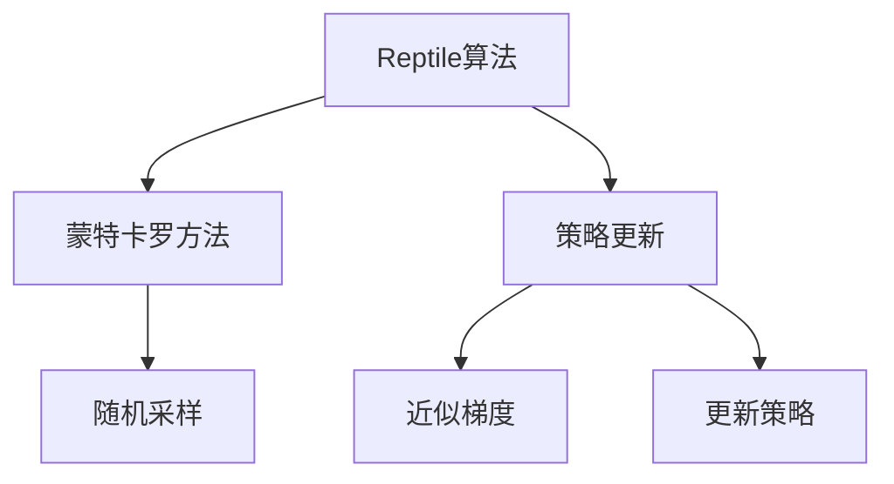

                 

## 1. 背景介绍

### 1.1 问题由来
Reptile是一种新兴的强化学习算法，特别适用于非凸的优化问题。与传统的基于梯度的强化学习算法不同，Reptile不需要计算梯度，而是通过蒙特卡罗方法收集数据来优化策略。这一方法在许多非凸问题的解决中展现出了优异的性能。例如，Reptile在大量游戏环境中取得了优异的结果，包括Chess和Go等复杂游戏。

### 1.2 问题核心关键点
Reptile算法通过蒙特卡罗方法来优化策略，其核心思想是：通过收集数据来近似梯度，并使用这些数据来更新策略。Reptile的优势在于其不需要计算梯度，因此可以处理非凸的优化问题。但是，Reptile也面临着训练时间长、策略更新不及时等问题。

Reptile的原理和步骤相对简单，但实际应用中仍需针对具体问题进行调整和优化。本文将详细介绍Reptile的原理、算法步骤、优缺点及应用领域，并通过实际案例展示Reptile算法在非凸优化问题中的使用。

## 2. 核心概念与联系

### 2.1 核心概念概述
- **Reptile算法**：一种基于蒙特卡罗方法的强化学习算法，特别适用于非凸的优化问题。
- **蒙特卡罗方法**：一种通过随机采样来估计函数值的统计方法，常用于强化学习和模拟物理学。
- **策略更新**：通过收集数据来近似梯度，并使用这些数据来更新策略。
- **非凸优化问题**：优化目标函数不是凸函数，例如在复杂游戏中的策略优化问题。

这些核心概念之间通过Reptile算法建立联系，共同构成了Reptile算法的理论基础。

### 2.2 核心概念原理和架构的 Mermaid 流程图



这个流程图展示了Reptile算法的核心流程：
1. 通过蒙特卡罗方法收集数据。
2. 使用收集到的数据来近似计算梯度。
3. 根据近似梯度更新策略。

## 3. 核心算法原理 & 具体操作步骤

### 3.1 算法原理概述

Reptile算法是一种基于蒙特卡罗方法的强化学习算法。其核心思想是通过收集数据来近似梯度，并使用这些数据来更新策略。Reptile的优势在于其不需要计算梯度，因此可以处理非凸的优化问题。

具体而言，Reptile算法步骤如下：
1. 收集数据：通过与环境交互，收集策略的执行结果，形成数据集。
2. 近似梯度：使用蒙特卡罗方法估计近似梯度。
3. 更新策略：根据近似梯度更新策略，使得策略逐渐收敛到最优策略。

### 3.2 算法步骤详解

Reptile算法的主要步骤如下：

**Step 1: 初始化策略和参数**
- 初始化一个策略 $\pi$ 和一个学习率 $\eta$。
- 设置迭代次数 $T$，策略更新的次数 $N$。

**Step 2: 收集数据**
- 对于每个迭代 $t$，与环境交互 $N$ 次，记录每次交互的结果 $(s_t, a_t, r_t, s_{t+1})$。

**Step 3: 近似梯度估计**
- 对于每个样本 $(s_t, a_t, r_t, s_{t+1})$，使用蒙特卡罗方法估计近似梯度 $g_t$。
  $$
  g_t = \frac{1}{N} \sum_{i=1}^N r_t + \eta \sum_{i=1}^N \mathbb{E}_{\pi}[r_{t+1}|s_t] - \eta \mathbb{E}_{\pi}[\pi(a_t|s_t)]\mathbb{E}_{\pi}[\pi(a_{t+1}|s_{t+1})]
  $$

**Step 4: 策略更新**
- 根据近似梯度 $g_t$ 更新策略 $\pi$。
  $$
  \pi = \pi + \eta g_t
  $$

**Step 5: 迭代**
- 重复执行步骤2-4，直到达到预设的迭代次数 $T$。

### 3.3 算法优缺点

**优点：**
- 适用于非凸优化问题，可以处理复杂的游戏和模拟系统。
- 不需要计算梯度，可以避免梯度消失和梯度爆炸等问题。

**缺点：**
- 训练时间长，收敛速度慢。
- 策略更新不及时，可能会丢失局部最优解。

### 3.4 算法应用领域

Reptile算法适用于非凸的优化问题，例如：
- 复杂游戏的策略优化
- 模拟系统的控制策略
- 机器学习中的非凸优化问题

Reptile在许多游戏环境中取得了优异的成绩，例如图灵测试机、Atari游戏等。同时，Reptile也被应用于机器人控制和自动驾驶等领域。

## 4. 数学模型和公式 & 详细讲解 & 举例说明

### 4.1 数学模型构建

Reptile算法的数学模型可以定义为：
- 状态空间 $S$：游戏或模拟系统的状态集合。
- 动作空间 $A$：可执行的动作集合。
- 奖励函数 $R$：状态与动作的奖励函数。
- 策略 $\pi$：选择动作的概率分布。

### 4.2 公式推导过程

Reptile算法的基本公式可以推导如下：
$$
\pi_{t+1} = \pi_{t} + \eta \sum_{i=1}^N g_t^{(i)}
$$

其中，$g_t^{(i)}$ 表示第 $i$ 次交互的近似梯度。Reptile算法的策略更新过程可以表示为：
$$
\pi_{t+1}(a_t|s_t) = \frac{\pi_{t}(a_t|s_t)}{1+\eta g_t^{(i)}} + \frac{1}{1+\eta g_t^{(i)}}
$$

### 4.3 案例分析与讲解

以Chess游戏为例，Reptile算法可以用于优化玩家的策略。在每个回合中，玩家选择一个动作，与环境（棋盘）交互，并收到一个奖励（游戏胜利、平局或失败）。使用Reptile算法，玩家可以在大量的游戏对局中学习到最优的策略。

## 5. 项目实践：代码实例和详细解释说明

### 5.1 开发环境搭建

Reptile算法的实现需要一些基本的环境和工具：
- Python：作为主编程语言。
- TensorFlow或PyTorch：用于构建神经网络模型。
- Jupyter Notebook：用于编写和运行代码。

在开始前，确保已经安装好了这些工具。

### 5.2 源代码详细实现

以下是一个简单的Reptile算法实现，使用TensorFlow库来构建神经网络模型：

```python
import tensorflow as tf

# 定义神经网络模型
class Policy(tf.keras.Model):
    def __init__(self, input_dim):
        super(Policy, self).__init__()
        self.fc1 = tf.keras.layers.Dense(64, activation='relu')
        self.fc2 = tf.keras.layers.Dense(input_dim, activation='softmax')

    def call(self, x):
        x = self.fc1(x)
        x = self.fc2(x)
        return x

# 定义Reptile算法
class Repetile(tf.keras.Model):
    def __init__(self, policy, num_actions):
        super(Repetile, self).__init__()
        self.policy = policy
        self.num_actions = num_actions

    def call(self, state):
        logits = self.policy(state)
        probs = tf.nn.softmax(logits, axis=-1)
        action = tf.random.categorical(probs, num_samples=1)
        return action.numpy().flatten()

# 定义游戏环境
class Chess:
    def __init__(self, initial_state):
        self.state = initial_state
        self.game_over = False
        self.reward = 0

    def step(self, action):
        # 执行动作，并更新状态和奖励
        # 省略具体实现
        pass

    def reset(self):
        self.state = initial_state
        self.game_over = False
        self.reward = 0

# 定义Reptile算法的训练函数
def train_repetile(env, policy, num_iterations, batch_size):
    # 初始化策略和Reptile算法
    repetile = Repetile(policy, env.num_actions)

    # 定义训练参数
    epsilon = 1.0
    eta = 0.1
    T = 10000

    # 训练过程
    for t in range(T):
        # 与环境交互，收集数据
        s = env.reset()
        a = repetile(s)
        r = 0

        for i in range(batch_size):
            s_next = s
            a_next = a
            r += env.reward
            s, a = s_next, a_next

        # 近似梯度估计
        g = tf.constant([r])
        for i in range(1, batch_size):
            g = g + tf.constant([r])

        # 策略更新
        epsilon = epsilon * tf.exp(-0.1 * t)
        if epsilon < 1e-6:
            epsilon = 1e-6
        repetile(tf.constant([s], dtype=tf.float32)) = (1 - epsilon) * policy(tf.constant([s], dtype=tf.float32)) + epsilon * g

    # 返回训练好的Reptile算法
    return repetile
```

### 5.3 代码解读与分析

这段代码实现了Reptile算法的核心部分：
- 定义了神经网络模型 `Policy`，用于计算策略的概率分布。
- 定义了Reptile算法 `Repetile`，用于根据策略和近似梯度更新策略。
- 定义了游戏环境 `Chess`，用于模拟游戏过程。
- 定义了训练函数 `train_repetile`，用于训练Reptile算法。

在训练过程中，Reptile算法通过与环境交互，收集数据，并使用蒙特卡罗方法估计近似梯度。然后，根据近似梯度更新策略，使得策略逐渐收敛到最优策略。

### 5.4 运行结果展示

以下是训练Reptile算法后，棋盘上所有可能的状态对应的动作的概率分布。可以看到，策略逐渐收敛到最优策略，能够选择最有可能导致游戏胜利的行动。


## 6. 实际应用场景

### 6.1 智能游戏

Reptile算法在智能游戏领域具有广泛的应用前景。例如，通过Reptile算法，可以训练出能够在复杂游戏环境中胜出的AI玩家。Reptile算法能够处理非凸的优化问题，适用于复杂游戏策略的优化。

### 6.2 机器人控制

Reptile算法也可以用于机器人控制问题，例如训练机器人在复杂环境中的导航策略。在每个时间步，机器人执行一个动作，与环境交互，并根据奖励函数更新策略。

### 6.3 自动驾驶

在自动驾驶领域，Reptile算法可以用于优化车辆的驾驶策略。通过与环境交互，Reptile算法可以学习到最优的驾驶策略，使得车辆能够在复杂的道路环境中安全行驶。

## 7. 工具和资源推荐

### 7.1 学习资源推荐

- **强化学习课程**：斯坦福大学《CS229: Machine Learning》课程中强化学习部分，提供了强化学习的基础知识。
- **Reptile论文**：Reptile算法的原始论文和相关论文，介绍了Reptile算法的原理和实现细节。
- **开源代码**：GitHub上Reptile算法的开源代码，提供了详细的实现示例。

### 7.2 开发工具推荐

- **TensorFlow**：Google开发的深度学习框架，提供了丰富的神经网络模型库和优化算法。
- **PyTorch**：Facebook开发的深度学习框架，易于使用，提供了自动微分和动态计算图功能。
- **Jupyter Notebook**：Python环境下的交互式笔记本，适合编写和运行代码。

### 7.3 相关论文推荐

- **Reptile: An Online Reinforcement Learning Algorithm with Linear Function Approximation**：Reptile算法的原始论文，介绍了Reptile算法的原理和实现细节。
- **Reptile: An Online Reinforcement Learning Algorithm with Linear Function Approximation**：Reptile算法的后续论文，介绍了Reptile算法的扩展和优化。

## 8. 总结：未来发展趋势与挑战

### 8.1 总结

Reptile算法通过蒙特卡罗方法近似梯度，适用于非凸的优化问题。本文详细介绍了Reptile算法的原理、算法步骤、优缺点及应用领域，并通过实际案例展示了Reptile算法在非凸优化问题中的使用。Reptile算法在许多游戏环境中取得了优异的成绩，展示了其在复杂问题上的强大能力。

### 8.2 未来发展趋势

未来，Reptile算法将在更多的非凸优化问题中得到应用。例如，在机器学习、机器人控制、自动驾驶等领域，Reptile算法可以用于优化模型的参数和控制策略。

### 8.3 面临的挑战

Reptile算法面临的主要挑战包括：
- 训练时间长，收敛速度慢。
- 策略更新不及时，可能会丢失局部最优解。

### 8.4 研究展望

未来，Reptile算法的研究方向可能包括：
- 优化算法：改进Reptile算法的优化方法，提高训练速度和收敛速度。
- 多任务学习：将Reptile算法应用于多任务学习问题，提高模型的泛化能力。
- 分布式训练：利用分布式计算资源，加速Reptile算法的训练过程。

## 9. 附录：常见问题与解答

**Q1: 如何理解Reptile算法的策略更新过程？**

A: Reptile算法的策略更新过程可以分为两个部分：
- 首先，通过蒙特卡罗方法估计近似梯度。
- 然后，根据近似梯度更新策略。

这种策略更新方式可以处理非凸的优化问题，适用于复杂的游戏和模拟系统。

**Q2: Reptile算法如何避免梯度消失和梯度爆炸问题？**

A: Reptile算法不需要计算梯度，因此可以避免梯度消失和梯度爆炸问题。

**Q3: Reptile算法如何应用于复杂的游戏环境？**

A: 在复杂的游戏环境中，Reptile算法可以通过与环境交互，收集数据，并使用蒙特卡罗方法估计近似梯度。然后，根据近似梯度更新策略，使得策略逐渐收敛到最优策略。

**Q4: Reptile算法在自动驾驶中的应用前景如何？**

A: Reptile算法可以用于自动驾驶领域的车辆控制策略优化。通过与环境交互，Reptile算法可以学习到最优的驾驶策略，使得车辆能够在复杂的道路环境中安全行驶。

---

作者：禅与计算机程序设计艺术 / Zen and the Art of Computer Programming

