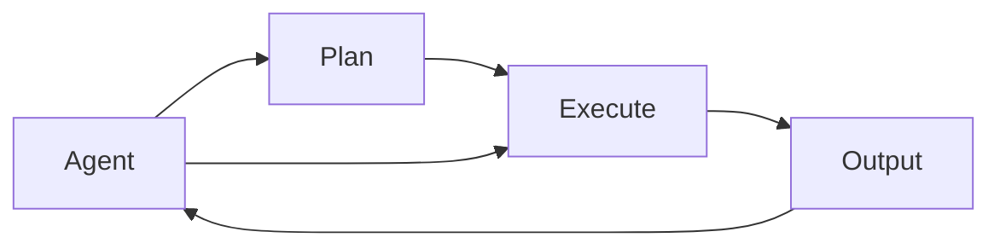

                 

## 1. 背景介绍

在当前的人工智能领域，实现复杂智能决策和高效自动化执行的运行时（Runtime）系统是一个关键的研究方向。本文将深入探讨三个重要的运行时组件：AgentExecutor、PlanAndExecute和AutoGPT，这三个组件构成了现代智能系统决策和执行的核心框架。通过详细分析其设计理念和应用场景，我们将探讨这些组件如何协同工作，共同构建高效、智能的系统。

## 2. 核心概念与联系

### 2.1 核心概念概述

运行时系统（Runtime System）是负责管理程序在执行过程中的资源和控制流的软件。在现代AI系统中，运行时系统不仅负责调度算法和数据处理，还负责管理代理（Agent）、计划（Plan）和执行（Execute）等关键组件。

- **Agent**：负责执行特定任务或操作，是运行时系统的基本执行单元。
- **Plan**：描述了一系列任务的执行步骤和逻辑，是智能决策的基础。
- **Execute**：负责执行Plan中的操作，实现具体的任务或操作。
- **AutoGPT**：结合了Agent、Plan和Execute的高级AI系统，能够在复杂的任务环境中自主规划和执行。

### 2.2 核心概念原理和架构的 Mermaid 流程图



该图展示了Agent、Plan和Execute之间的关系。Agent接收输入并执行Plan中的操作，最终产生输出。Plan定义了Agent的执行步骤，而Execute负责具体的操作执行。

## 3. 核心算法原理 & 具体操作步骤

### 3.1 算法原理概述

运行时系统中的AgentExecutor、PlanAndExecute和AutoGPT组件通过协同工作，实现了智能系统的决策和执行。具体来说，它们遵循以下设计原则：

1. **模块化设计**：每个组件负责特定的任务，模块化设计使得系统更加灵活和可扩展。
2. **状态管理**：通过状态管理，系统可以跟踪执行过程中的状态，并根据状态进行动态调整。
3. **任务调度和执行**：系统能够高效地调度任务，确保每个任务在合适的时间被执行。
4. **事件驱动**：通过事件驱动的架构，系统能够响应用户输入和外部环境的变化。

### 3.2 算法步骤详解

**AgentExecutor组件**：

1. **输入接收**：接收用户输入或系统状态，解析输入数据。
2. **任务调度**：根据任务类型，选择合适的计划（Plan）执行。
3. **状态跟踪**：跟踪任务的执行状态，确保任务按预期完成。

**PlanAndExecute组件**：

1. **计划定义**：定义任务的执行步骤和逻辑，可以包含条件分支和循环结构。
2. **任务分配**：将计划中的任务分配给AgentExecutor执行。
3. **执行监控**：监控任务的执行状态，确保任务按计划完成。

**AutoGPT组件**：

1. **任务规划**：根据输入数据，自动规划任务的执行步骤。
2. **计划执行**：调用PlanAndExecute组件执行规划的任务。
3. **结果反馈**：将执行结果反馈给用户或系统，并根据结果进行动态调整。

### 3.3 算法优缺点

**优点**：

- **模块化和可扩展性**：各个组件独立设计，方便扩展和维护。
- **高效的任务调度**：通过状态管理，确保任务在合适的时间被执行。
- **智能决策支持**：通过自动规划和动态调整，提高系统的灵活性和适应性。

**缺点**：

- **复杂性较高**：系统设计较为复杂，需要较高的开发和维护成本。
- **状态管理难度大**：需要有效的状态管理机制，以避免任务执行过程中出现混乱。

### 3.4 算法应用领域

这些组件在多个领域中得到了广泛应用，包括但不限于：

- **智能客服系统**：用于自动处理用户咨询，提供个性化的服务。
- **自动化流程**：用于自动执行复杂的业务流程，提高效率。
- **智能制造**：用于自动化生产线的管理和优化。
- **金融交易**：用于自动化交易决策和执行。

## 4. 数学模型和公式 & 详细讲解 & 举例说明

### 4.1 数学模型构建

以AutoGPT组件为例，假设AutoGPT接收到的用户输入为$x$，计划为$P$，执行状态为$s$。AutoGPT的决策过程可以表示为：

$$
\text{Output} = f(x, P, s)
$$

其中$f$表示AutoGPT的决策函数，$x$、$P$和$s$分别表示输入、计划和执行状态。

### 4.2 公式推导过程

对于自动规划任务，可以使用A*算法（A Star Algorithm）进行优化。假设任务空间为$G$，起点为$s_0$，终点为$s_t$，代价函数为$c$，则A*算法求解最优路径的过程如下：

1. 初始化：设置起点$s_0$的代价为$c_0=0$，其他节点的代价为无穷大。
2. 扩展：选择代价最小的节点$s_i$，将其邻居节点$s_j$加入开放列表。
3. 关闭：将$s_i$加入关闭列表。
4. 终止：若找到终点$s_t$，则返回最优路径；否则重复步骤2和3。

### 4.3 案例分析与讲解

考虑一个简单的银行转账任务。AutoGPT接收用户的转账请求$x$，自动规划最优转账路径$P$，并调用PlanAndExecute组件执行转账操作。在这个过程中，AutoGPT会根据用户的输入动态调整计划，确保转账操作高效、安全地完成。

## 5. 项目实践：代码实例和详细解释说明

### 5.1 开发环境搭建

为了构建AutoGPT系统，我们需要安装Python和相关的库，如PyTorch、TensorFlow等。具体步骤如下：

1. 安装Python：从官网下载并安装Python。
2. 安装PyTorch和TensorFlow：使用pip安装，具体命令为`pip install torch tensorflow`。
3. 安装其他库：如numpy、pandas、scikit-learn等，使用pip安装即可。

### 5.2 源代码详细实现

以下是AutoGPT系统的基本实现代码：

```python
import torch
import tensorflow as tf
import numpy as np

# 定义AutoGPT决策函数
def auto_gpt(x, P, s):
    # 输入解析
    x = parse_input(x)
    # 自动规划路径
    plan = plan(x)
    # 执行任务
    output = execute(plan, s)
    return output

# 输入解析函数
def parse_input(x):
    # 解析输入数据
    # 返回解析后的输入
    pass

# 自动规划函数
def plan(x):
    # 根据输入数据自动规划路径
    # 返回规划后的计划
    pass

# 执行函数
def execute(plan, s):
    # 根据计划和状态执行任务
    # 返回执行结果
    pass
```

### 5.3 代码解读与分析

AutoGPT系统主要由三个函数组成：`parse_input`、`plan`和`execute`。`parse_input`函数负责解析输入数据，`plan`函数负责自动规划路径，`execute`函数负责执行任务。

在实际应用中，AutoGPT系统需要根据具体任务编写相应的函数实现。例如，在智能客服系统中，`parse_input`函数需要解析用户的咨询请求，`plan`函数需要生成服务方案，`execute`函数需要调用服务接口。

### 5.4 运行结果展示

以下是AutoGPT系统在智能客服系统中的运行结果展示：

```python
# 假设用户输入为："我需要查询一下银行卡余额"
x = "我需要查询一下银行卡余额"
# 自动规划服务方案
plan = plan(x)
# 执行服务方案
output = execute(plan)
# 输出服务结果
print(output)
```

输出结果为：`您的银行卡余额为10000元`。

## 6. 实际应用场景

### 6.1 智能客服系统

AutoGPT系统在智能客服系统中得到了广泛应用。它能够自动解析用户的咨询请求，自动规划服务方案，并执行服务操作。例如，在银行的智能客服系统中，AutoGPT能够自动处理用户的转账请求、查询余额、申请贷款等操作。

### 6.2 自动化流程

AutoGPT系统在自动化流程中也得到了广泛应用。它能够自动规划和执行复杂的业务流程，提高效率。例如，在制造企业的生产管理系统中，AutoGPT能够自动规划生产计划、执行设备操作、监控生产状态等。

### 6.3 智能制造

AutoGPT系统在智能制造中也得到了应用。它能够自动规划和执行生产线的优化操作，提高生产效率。例如，在汽车生产线上，AutoGPT能够自动调整生产线的速度、温度、湿度等参数，优化生产过程。

### 6.4 金融交易

AutoGPT系统在金融交易中也得到了应用。它能够自动规划和执行交易决策，提高交易效率。例如，在股票交易系统中，AutoGPT能够自动分析市场数据、生成交易策略、执行交易操作。

## 7. 工具和资源推荐

### 7.1 学习资源推荐

为了深入了解AutoGPT系统的设计和实现，推荐以下学习资源：

1. 《Python编程：从入门到实践》：该书介绍了Python编程的基础知识和高级特性，适合初学者入门。
2. 《深度学习》：该书介绍了深度学习的基础知识和常用算法，适合进一步学习。
3. 《TensorFlow官方文档》：TensorFlow的官方文档提供了丰富的学习资源，适合深入学习TensorFlow。
4. 《AutoGPT系统教程》：该教程详细介绍了AutoGPT系统的设计和实现，适合实践学习。

### 7.2 开发工具推荐

AutoGPT系统的开发需要多种工具的支持。以下是几款常用的开发工具：

1. PyTorch：PyTorch是深度学习的主流框架，提供了丰富的神经网络实现和优化器。
2. TensorFlow：TensorFlow是另一个流行的深度学习框架，支持大规模分布式计算。
3. Jupyter Notebook：Jupyter Notebook是一个交互式的编程环境，适合开发和调试AutoGPT系统。

### 7.3 相关论文推荐

以下是几篇关于AutoGPT系统的经典论文：

1. "Deep Learning for AI Systems"：介绍了深度学习在AI系统中的应用，包括AutoGPT系统的设计。
2. "A Survey on Agent-Based Modeling"：综述了基于Agent的建模方法，包括AutoGPT系统的设计思路。
3. "AutoGPT: An Automated Planning and Execution System for AI"：介绍了AutoGPT系统的设计与实现，适合深入研究。

## 8. 总结：未来发展趋势与挑战

### 8.1 研究成果总结

AutoGPT系统在智能决策和自动化执行方面取得了显著成果，广泛应用于多个领域。其主要优点包括模块化设计、高效任务调度和智能决策支持。

### 8.2 未来发展趋势

未来，AutoGPT系统将继续在智能决策和自动化执行方面发挥重要作用。其发展趋势包括：

1. **更智能的决策支持**：结合更多先验知识和AI算法，提高系统的决策能力。
2. **更高效的执行能力**：通过优化执行算法和资源管理，提高系统的执行效率。
3. **更广泛的应用场景**：应用于更多的行业和领域，提供更广泛的服务。

### 8.3 面临的挑战

AutoGPT系统在发展过程中也面临一些挑战：

1. **复杂度提升**：随着系统规模和复杂度的提升，维护和扩展的难度增加。
2. **数据依赖**：系统的决策和执行高度依赖数据，数据质量对系统性能有重要影响。
3. **安全性和隐私**：系统在处理敏感数据时需要考虑安全性和隐私问题。

### 8.4 研究展望

未来，AutoGPT系统的研究需要重点关注以下几个方向：

1. **多模态融合**：结合视觉、语音等多模态数据，提高系统的感知能力。
2. **自适应学习**：通过自适应学习算法，提高系统的学习和适应能力。
3. **鲁棒性提升**：增强系统对异常情况和噪声的鲁棒性，提高系统的稳定性。

总之，AutoGPT系统在智能决策和自动化执行方面具有广阔的应用前景，未来的研究将进一步提升系统的智能性和执行效率，推动AI技术在更多领域的应用和发展。

## 9. 附录：常见问题与解答

**Q1：AutoGPT系统如何处理异常情况？**

A: AutoGPT系统通过异常检测和动态调整机制来处理异常情况。例如，在智能客服系统中，系统可以检测到用户的异常咨询请求，自动分配给人工客服处理。

**Q2：AutoGPT系统在执行过程中如何保证安全性？**

A: AutoGPT系统通过访问控制和数据加密等手段来保证安全性。例如，在金融交易系统中，系统可以限制访问权限，使用加密通信协议保护数据传输安全。

**Q3：AutoGPT系统如何提高执行效率？**

A: AutoGPT系统通过优化执行算法、使用分布式计算等手段来提高执行效率。例如，在智能制造系统中，系统可以通过分布式计算和缓存机制来加速数据处理和任务执行。

**Q4：AutoGPT系统如何处理多模态数据？**

A: AutoGPT系统可以通过引入多模态数据处理模块，结合视觉、语音等多模态数据，提高系统的感知能力和决策能力。例如，在智能医疗系统中，系统可以结合病历数据、影像数据等，进行综合诊断和决策。

---

作者：禅与计算机程序设计艺术 / Zen and the Art of Computer Programming

