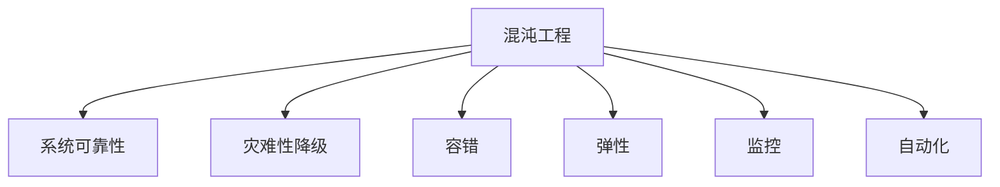

                 

# SRE混沌工程应用实践

## 1. 背景介绍

SRE(站点可靠性工程师)是保障网站系统稳定运行的核心力量，他们的工作包括监控系统健康状态、优化系统性能、应急故障处理等。在数字化转型加速的今天，系统的复杂度不断增加，故障风险也随之升高。SRE团队需要面对越来越多的未知挑战和不断演进的业务需求。

为提升系统可用性，SRE在实践中逐步引入混沌工程方法。混沌工程是一种实验性的系统健康检测手段，通过人为引入干扰、故障注入，观察系统在压力和异常情况下的表现，提前发现潜在问题并及时优化，从而提升系统的整体可靠性和鲁棒性。

混沌工程最早由Netflix提出，用于保障其全球化视频服务系统的稳定。通过系统性实验，Netflix在故障的发现、分析、解决过程中积累了丰富的经验。混沌工程的核心理念是"构建可靠性，而不是消除不确定性"，通过对系统进行“破坏性实验”，确保系统具备足够的弹性，能够抵御现实世界中的各种不确定性。

## 2. 核心概念与联系

### 2.1 核心概念概述

为更好地理解混沌工程在SRE中的应用，本节将介绍几个密切相关的核心概念：

- **混沌工程(Chaos Engineering)**：一种系统化的实验方法，通过人为制造故障、压力、性能下降等实验场景，观察系统的反应和恢复能力，从而提升系统的鲁棒性和可靠性。

- **系统可靠性(System Reliability)**：系统能够在规定的时间和条件下，按预期正常运行的能力。

- **灾难性降级(Disaster Recovery)**：在故障发生时，系统能够快速降级到备用状态，保障关键业务连续性。

- **容错(Fault Tolerance)**：系统能够在某些部分故障的情况下，仍能正常运行，并提供基本服务。

- **弹性(Elasticity)**：系统能够自动适应负载变化，并在资源不足时自动扩容或缩容。

- **监控(Monitoring)**：通过实时数据监控，及时发现系统异常，采取应急措施，避免问题扩大。

- **自动化(Automation)**：通过脚本、工具等自动化手段，提升系统故障响应速度和效率。

这些核心概念之间的逻辑关系可以通过以下Mermaid流程图来展示：



这个流程图展示出混沌工程与其他SRE核心概念的紧密联系：

1. **混沌工程**是系统可靠性实验的核心方法。
2. **系统可靠性**是混沌工程的最终目标。
3. **灾难性降级、容错、弹性**是保障系统可靠性的重要手段。
4. **监控、自动化**是混沌工程实验的辅助工具。

## 3. 核心算法原理 & 具体操作步骤

### 3.1 算法原理概述

混沌工程的核心思想是通过引入系统故障、压力、异常等干扰因素，观察系统在特定情境下的表现。具体步骤如下：

1. **实验设计**：确定实验目标，设计实验方案。
2. **故障注入**：在系统中引入故障、负载压力、服务中断等实验。
3. **数据收集**：记录实验中的系统行为数据，如响应时间、服务可用性、错误日志等。
4. **分析评估**：对实验数据进行分析评估，确定系统的鲁棒性。
5. **结果应用**：根据实验结果，优化系统架构和运维策略，提升系统可靠性。

混沌工程通过模拟真实世界的故障，提前发现系统中的潜在风险，并通过实验验证和优化，将系统风险降至最低。

### 3.2 算法步骤详解

混沌工程的实验步骤一般包括以下几个关键环节：

**Step 1: 确定实验目标**
- 明确实验的业务目标和关键指标，如响应时间、吞吐量、服务可用性等。
- 确定实验的影响范围和影响频率，避免实验对业务产生负面影响。

**Step 2: 设计实验方案**
- 根据实验目标，设计具体的故障注入方案。
- 确定实验所需的环境条件，如负载压力、数据分布、用户行为等。
- 设计实验的监控点和测量指标，以便于实验数据的收集和分析。

**Step 3: 故障注入和数据收集**
- 通过脚本、工具等手段，模拟各种故障和异常场景。
- 记录实验过程中的系统行为数据，包括日志、性能指标、响应时间等。
- 监控系统响应，确保实验过程的安全性和稳定性。

**Step 4: 数据分析与评估**
- 对实验数据进行分析，统计系统在不同故障情况下的行为表现。
- 分析系统的异常响应时间、服务可用性、错误日志等关键指标。
- 评估系统在实验中的表现，确定系统鲁棒性。

**Step 5: 结果应用与优化**
- 根据实验结果，制定优化措施，如加强负载均衡、优化资源配置等。
- 修改系统架构，提升系统弹性，增强容错能力。
- 更新运维策略，建立自动化流程，提升应急响应速度。

通过以上实验步骤，SRE团队可以全面了解系统在不同压力和异常情况下的表现，通过实验验证和优化，保障系统的高可用性。

### 3.3 算法优缺点

混沌工程通过实验方法提升系统可靠性，具有以下优点：
1. 提前发现问题。通过模拟真实世界的故障，提前发现潜在风险。
2. 精准定位问题。通过系统行为数据，精确分析问题根源。
3. 全面验证系统。实验覆盖面广，可以有效验证系统的各个部分。
4. 优化效果显著。通过实验验证和优化，系统性能得到显著提升。

同时，混沌工程也存在一些缺点：
1. 实验复杂度高。实验设计需要充分考虑系统的各个方面，耗时较长。
2. 实验风险大。不合理的实验设计可能对系统造成损害，影响业务正常运行。
3. 实验结果不确定。实验结果依赖于系统行为数据，存在一定的随机性。
4. 实验成本高。大规模实验需要大量资源投入，包括人力、时间和设备等。

尽管存在这些缺点，混沌工程仍然是一种有效的系统健康检测手段，值得SRE团队在实践中不断探索和改进。

### 3.4 算法应用领域

混沌工程广泛应用于SRE中的各种系统和服务。以下是几个典型应用场景：

- **微服务架构**：在微服务架构中，每个服务独立部署，通过混沌工程实验，可以模拟服务间的通信故障，评估服务间的依赖关系和负载均衡能力。
- **大数据系统**：大数据系统通常处理海量数据，通过混沌工程实验，可以验证数据存储和传输的可靠性，提升数据处理性能。
- **分布式数据库**：分布式数据库需要跨节点处理数据，通过混沌工程实验，可以模拟数据节点故障，评估数据复制和备份机制的有效性。
- **云原生系统**：云原生系统依赖容器编排和自动化工具，通过混沌工程实验，可以验证容器编排和调度机制的健壮性，提升系统的弹性和稳定性。

## 4. 数学模型和公式 & 详细讲解 & 举例说明

### 4.1 数学模型构建

混沌工程实验的数学模型构建主要基于统计学原理。假设系统在无故障情况下，服务可用性为 $u$，平均响应时间为 $t$。引入故障后，服务可用性降低到 $u'$，响应时间增加到 $t'$。实验结果可以用以下公式表示：

$$
u' = u - (1-u)P
$$

$$
t' = t + \Delta t
$$

其中 $P$ 为故障发生的概率，$\Delta t$ 为故障影响时间。

### 4.2 公式推导过程

公式推导基于假设：
1. 故障是独立同分布的随机事件。
2. 系统的可用性和响应时间服从一定的统计分布。
3. 系统的平均故障发生率和平均故障恢复时间是一定的。

通过这些假设，可以推导出系统的故障率和响应时间分布。实验中，通过统计样本均值和方差，计算故障发生概率 $P$ 和故障影响时间 $\Delta t$，进而得到系统在实验情况下的可用性和响应时间。

### 4.3 案例分析与讲解

**案例一：负载压力实验**
- 实验目标：测试系统在高负载情况下的性能表现。
- 实验方案：通过模拟高并发请求，逐步增加负载，记录系统的响应时间和错误日志。
- 数据分析：统计系统在高负载情况下的响应时间分布，计算系统错误率和故障影响时间。
- 结果应用：优化负载均衡机制，增加系统资源，提升系统性能。

**案例二：服务中断实验**
- 实验目标：测试系统在服务中断情况下的恢复能力。
- 实验方案：模拟服务中断，记录系统从故障恢复的过程和时间。
- 数据分析：统计服务中断后的恢复时间分布，评估系统的容错能力。
- 结果应用：修改服务切换策略，提升系统的容错性能。

## 5. 项目实践：代码实例和详细解释说明

### 5.1 开发环境搭建

在进行混沌工程实验前，我们需要准备好开发环境。以下是使用Python进行Kubernetes开发的环境配置流程：

1. 安装Anaconda：从官网下载并安装Anaconda，用于创建独立的Python环境。

2. 创建并激活虚拟环境：
```bash
conda create -n pytorch-env python=3.8 
conda activate pytorch-env
```

3. 安装PyTorch：根据CUDA版本，从官网获取对应的安装命令。例如：
```bash
conda install pytorch torchvision torchaudio cudatoolkit=11.1 -c pytorch -c conda-forge
```

4. 安装Kubernetes和Python库：
```bash
pip install kubernetes pyyaml traitlets
```

5. 安装 chaos-mesh：chaos-mesh是开源的混沌工程平台，用于管理混沌实验。
```bash
pip install chaos-mesh
```

完成上述步骤后，即可在`pytorch-env`环境中开始混沌工程实验的实践。

### 5.2 源代码详细实现

这里我们以Kubernetes中一个简单的负载压力实验为例，给出使用Kubernetes进行混沌工程实验的PyTorch代码实现。

首先，定义实验方案：

```python
from kubernetes import client, config

config.load_kube_config()

# 定义实验资源配置
api_version = "v1"
namespace = "default"

# 定义实验参数
num_repetitions = 5
success_threshold = 4
failure_threshold = 1
step_duration = 60

# 定义实验目标
service_name = "my-service"
pod_labels = {"hello-world": "v1"}

# 创建实验
experiment = client.models.V1ChaosExperiment()
experiment.metadata.name = "load-experiment"
experiment.metadata.labels = pod_labels
experiment.spec.name = service_name
experiment.spec.server_name = service_name
experiment.spec.mutex = True
experiment.spec.stateful_set = "hello-world"
experiment.spec.container = "hello-world"
experiment.spec.num_container = 1
experiment.spec.timeout_in_seconds = 300
experiment.spec.duration = step_duration
experiment.spec.num_successful_replicates = success_threshold
experiment.spec.num_unsuccessful_replicates = failure_threshold
experiment.spec.terminal_state = "AutoRevert"

# 创建实验资源
api_instance = client.ChaosExperimentApi()
api_instance.create_namespaced_chaos_experiment(namespace, body=experiment)
```

然后，通过Kubernetes API创建实验资源，并启动实验：

```python
# 启动实验
api_instance.create_namespaced_chaos_experiment(namespace, body=experiment)

# 监控实验结果
def check_experiment_status():
    # 获取实验状态
    experiment = api_instance.read_namespaced_chaos_experiment_status(namespace, experiment.metadata.name)
    # 判断实验是否成功
    if experiment.status.state == "Complete":
        print("实验成功")
    elif experiment.status.state == "Failed":
        print("实验失败")
    else:
        print("实验进行中")

while True:
    check_experiment_status()
    time.sleep(10)
```

### 5.3 代码解读与分析

让我们再详细解读一下关键代码的实现细节：

**实验定义**：
- `config.load_kube_config()`：加载Kubernetes配置文件。
- `api_version` 和 `namespace`：定义实验的Kubernetes环境。
- `num_repetitions` 和 `success_threshold`：定义实验重复次数和成功次数阈值。
- `service_name` 和 `pod_labels`：定义实验目标服务和容器标签。
- `experiment` 变量：定义实验对象，设置实验参数和资源配置。

**资源创建**：
- `api_instance.create_namespaced_chaos_experiment(namespace, body=experiment)`：创建实验资源，提交到Kubernetes集群中。
- `api_instance.read_namespaced_chaos_experiment_status(namespace, experiment.metadata.name)`：获取实验状态，判断实验结果。

**实验监控**：
- `while True`：持续监控实验状态，直到实验完成。
- `check_experiment_status()`：定义一个函数，判断实验状态，输出结果。
- `time.sleep(10)`：暂停10秒，避免监控脚本对系统的频繁干扰。

可以看到，通过Kubernetes的API，我们可以方便地定义和监控混沌实验，实现实验的自动化和可管理化。这使得混沌工程在SRE实践中更加高效、稳定。

## 6. 实际应用场景

### 6.1 负载压力测试

负载压力测试是混沌工程中最常见的实验类型，通过模拟高并发请求，测试系统在高负载情况下的表现。负载压力测试可以用于以下场景：

**Web服务**：
- 实验目标：测试Web服务在高负载情况下的响应时间。
- 实验方案：通过模拟高并发请求，逐步增加负载，记录系统的响应时间。
- 数据分析：统计系统在高负载情况下的响应时间分布，计算系统的吞吐量。
- 结果应用：优化负载均衡机制，增加系统资源，提升系统性能。

**数据库**：
- 实验目标：测试数据库在高负载情况下的响应时间。
- 实验方案：通过模拟大量SQL请求，逐步增加负载，记录系统的响应时间。
- 数据分析：统计数据库在高负载情况下的响应时间分布，计算系统的并发量。
- 结果应用：优化数据库查询计划，增加系统资源，提升系统性能。

### 6.2 服务中断测试

服务中断测试通过模拟服务中断，验证系统在故障发生后的恢复能力。服务中断测试可以用于以下场景：

**Web服务**：
- 实验目标：测试Web服务在服务中断后的恢复时间。
- 实验方案：模拟服务中断，记录系统从故障恢复的过程和时间。
- 数据分析：统计服务中断后的恢复时间分布，评估系统的容错能力。
- 结果应用：修改服务切换策略，提升系统的容错性能。

**数据库**：
- 实验目标：测试数据库在服务中断后的恢复时间。
- 实验方案：模拟数据库服务中断，记录系统从故障恢复的过程和时间。
- 数据分析：统计数据库在服务中断后的恢复时间分布，评估系统的容错能力。
- 结果应用：优化数据库服务恢复策略，提升系统的容错性能。

### 6.3 容错能力测试

容错能力测试通过模拟系统部分故障，验证系统在部分故障情况下的表现。容错能力测试可以用于以下场景：

**微服务架构**：
- 实验目标：测试微服务架构在服务部分故障情况下的表现。
- 实验方案：模拟微服务部分故障，记录系统在不同故障情况下的行为。
- 数据分析：统计系统在部分故障情况下的行为分布，评估系统的容错能力。
- 结果应用：优化服务切换策略，提升系统的容错性能。

**分布式系统**：
- 实验目标：测试分布式系统在部分节点故障情况下的表现。
- 实验方案：模拟分布式系统部分节点故障，记录系统在不同故障情况下的行为。
- 数据分析：统计系统在部分节点故障情况下的行为分布，评估系统的容错能力。
- 结果应用：优化数据备份和复制机制，提升系统的容错性能。

## 7. 工具和资源推荐

### 7.1 学习资源推荐

为了帮助SRE团队系统掌握混沌工程的理论基础和实践技巧，这里推荐一些优质的学习资源：

1. **《混沌工程实践》书籍**：介绍混沌工程的基本概念和实验方法，提供大量案例和实践经验。
2. **Netflix混沌工程系列讲座**：Netflix SRE团队分享的混沌工程实践经验，讲解混沌工程在实际项目中的应用。
3. **混沌工程社区**：提供混沌工程的最新动态和最佳实践，交流实验经验，分享心得体会。
4. **Kubernetes官方文档**：详细讲解Kubernetes的API和操作，帮助用户掌握Kubernetes实验的实现方法。
5. **chaos-mesh文档**：介绍chaos-mesh的使用方法，提供丰富的实验案例，帮助用户开展实验。

通过这些资源的学习实践，相信SRE团队一定能够快速掌握混沌工程的精髓，并用于解决实际的系统健康问题。

### 7.2 开发工具推荐

高效的开发离不开优秀的工具支持。以下是几款用于混沌工程实验开发的常用工具：

1. **Kubernetes**：开源的容器编排平台，支持容器化应用的部署、管理和调度。
2. **chaos-mesh**：开源的混沌工程平台，支持定义和执行混沌实验，提供可视化管理工具。
3. **Prometheus**：开源的监控系统，支持实时数据采集和告警，帮助监控系统行为。
4. **ELK Stack**：包括Elasticsearch、Logstash、Kibana，用于日志收集、分析和可视化。
5. **Jenkins**：开源的持续集成平台，支持自动化测试和实验调度。

合理利用这些工具，可以显著提升混沌工程实验的开发效率，加快创新迭代的步伐。

### 7.3 相关论文推荐

混沌工程作为SRE领域的新兴技术，近年来受到了广泛关注。以下是几篇奠基性的相关论文，推荐阅读：

1. **《Site Reliability Engineering: How Google Runs Production Systems》**：介绍Google SRE的实践经验，讲解混沌工程在实际项目中的应用。
2. **《Chaos Engineering and Cultural Transformation at Netflix》**：Netflix SRE团队分享的混沌工程实践经验，讲解混沌工程在实际项目中的应用。
3. **《Engineering for Failure: Improving Your Systems Resilience with Chaos Engineering》**：讲解如何通过混沌工程提升系统的可靠性，提供大量的实验案例和工具推荐。
4. **《Chaos Engineering in Kubernetes》**：介绍如何在Kubernetes中进行混沌工程实验，提供详细的代码示例和最佳实践。
5. **《Eureka: A Chaos Engineering System for Kubernetes》**：介绍Eureka的混沌工程平台，支持定义和执行混沌实验，提供可视化管理工具。

这些论文代表了大规模系统工程中混沌工程的最新进展，通过学习这些前沿成果，可以帮助SRE团队把握学科前进方向，激发更多的创新灵感。

## 8. 总结：未来发展趋势与挑战

### 8.1 总结

本文对混沌工程在SRE中的应用进行了全面系统的介绍。首先阐述了混沌工程的基本概念和核心理念，明确了其通过实验手段提升系统可靠性的重要价值。其次，从原理到实践，详细讲解了混沌工程的数学模型和关键步骤，给出了混沌工程实验的代码实例。同时，本文还广泛探讨了混沌工程在负载压力测试、服务中断测试、容错能力测试等各个场景下的应用前景，展示了混沌工程在SRE实践中的广泛应用。最后，本文精选了混沌工程的各类学习资源，力求为读者提供全方位的技术指引。

通过本文的系统梳理，可以看到，混沌工程作为SRE实验方法，通过引入系统故障、压力、异常等干扰因素，全面评估系统在各种压力情况下的表现，并通过实验验证和优化，显著提升系统的可靠性和弹性。未来，伴随系统复杂度的不断增加，混沌工程必将在SRE实践中发挥越来越重要的作用，为保障系统健康稳定运行提供有力保障。

### 8.2 未来发展趋势

展望未来，混沌工程将呈现以下几个发展趋势：

1. **实验复杂度提升**：随着系统复杂度的不断增加，实验设计将更加复杂，需要考虑更多的影响因素和实验变量。
2. **自动化程度提升**：通过自动化工具和平台，提升实验的执行效率和覆盖面，降低实验成本。
3. **数据可视化增强**：通过可视化工具，帮助SRE团队更好地分析实验数据，快速定位问题。
4. **多维度实验设计**：引入更多的实验变量和维度，全面评估系统的鲁棒性和弹性。
5. **实验流程标准化**：制定实验规范和标准流程，提高实验的可重复性和可复现性。
6. **实验结果分析优化**：引入更高级的分析方法，如因果推断、A/B测试等，提升实验结果的科学性和准确性。

这些趋势将进一步提升混沌工程的实验效果和应用价值，为SRE团队提供更加强大的工具和手段，保障系统的稳定可靠运行。

### 8.3 面临的挑战

尽管混沌工程已经取得了诸多成功，但在迈向更加智能化、普适化应用的过程中，它仍面临着诸多挑战：

1. **实验设计复杂**：实验设计需要考虑系统各个方面，耗时较长，且容易出错。
2. **实验结果不确定**：实验结果依赖于系统行为数据，存在一定的随机性，难以精确预测。
3. **实验风险大**：不合理的实验设计可能对系统造成损害，影响业务正常运行。
4. **实验成本高**：大规模实验需要大量资源投入，包括人力、时间和设备等。
5. **实验数据处理复杂**：实验数据通常来自多个来源，数据处理和整合难度较大。
6. **实验自动化难度大**：实验自动化需要开发和维护复杂的脚本和工具，难度较大。

尽管存在这些挑战，混沌工程仍然是一种有效的系统健康检测手段，值得SRE团队在实践中不断探索和改进。

### 8.4 研究展望

未来，混沌工程的研究方向可以从以下几个方面进行探索：

1. **实验方法创新**：引入新的实验方法和技术，如基于人工智能的实验设计，提升实验设计的自动化和科学性。
2. **实验数据融合**：通过数据融合技术，整合多来源实验数据，提升实验结果的准确性和可靠性。
3. **实验结果评估**：引入更高级的评估方法，如因果推断、A/B测试等，提升实验结果的科学性和准确性。
4. **实验自动化**：开发更灵活的实验自动化工具和平台，提升实验的执行效率和覆盖面。
5. **实验文化建设**：通过培训和教育，提升团队对混沌工程的认知和实践能力，建立良好的实验文化。

这些研究方向将推动混沌工程技术的不断进步，为SRE团队提供更加强大的工具和手段，保障系统的稳定可靠运行。总之，混沌工程需要不断创新和改进，才能满足未来数字化转型过程中对系统健康稳定性的高要求。

## 9. 附录：常见问题与解答

**Q1: 混沌工程是否适用于所有系统？**

A: 混沌工程适用于大多数系统，特别是复杂的大型分布式系统。然而，对于一些实时性要求高、数据敏感的系统，需要慎重考虑实验的影响和风险。

**Q2: 如何设计合理的实验方案？**

A: 设计实验方案需要考虑系统的各个方面，包括负载、故障、服务中断等。实验方案应明确实验目标、实验步骤、实验参数、实验监控等关键要素，确保实验过程的可控性和安全性。

**Q3: 如何评估实验结果？**

A: 评估实验结果应从系统的可用性、响应时间、错误率等多个维度进行综合评估，识别出系统在实验中的表现和潜在的风险点。通过数据分析和统计，确定系统的鲁棒性和弹性。

**Q4: 实验结果对系统有哪些影响？**

A: 实验结果可以提供系统在特定情况下的表现，帮助SRE团队发现系统中的潜在问题，进行优化和改进。实验结果还可以用于指导系统的设计和运维策略，提升系统的稳定性和可靠性。

**Q5: 如何降低实验风险？**

A: 降低实验风险需要从实验设计、实验执行、实验监控等多个环节进行优化。例如，逐步增加负载、设置实验时间窗口、监控实验数据等，确保实验过程的可控性和安全性。

这些常见问题及解答，帮助SRE团队更好地理解和应用混沌工程，确保系统健康稳定运行。

---

作者：禅与计算机程序设计艺术 / Zen and the Art of Computer Programming

