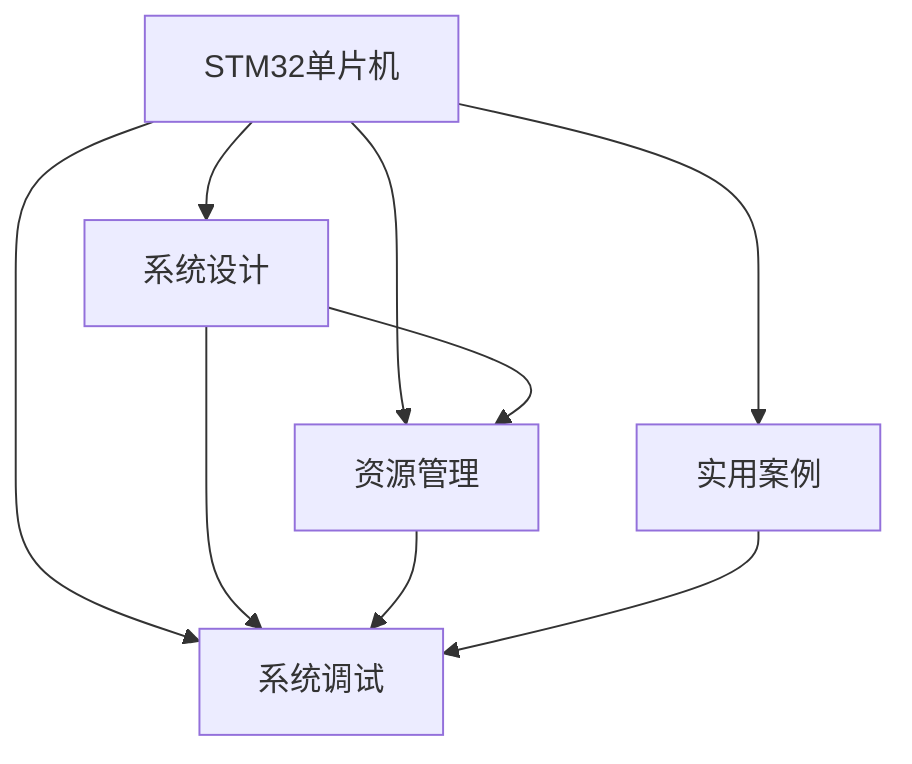
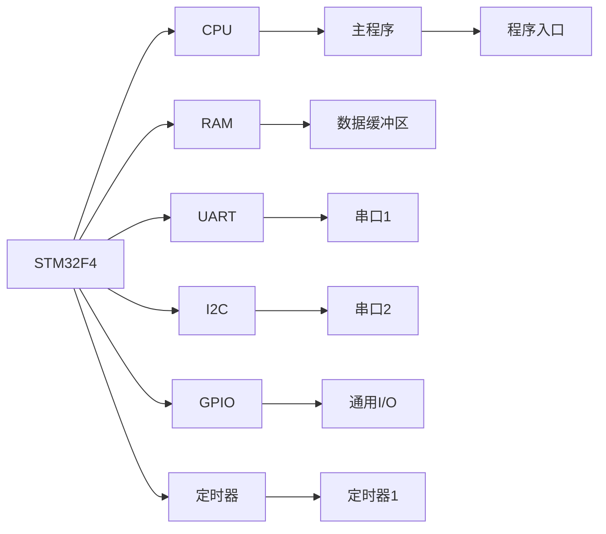

                 

# STM32单片机应用开发

> 关键词：STM32,单片机应用开发,资源管理,系统设计,开发工具,实用案例

## 1. 背景介绍

### 1.1 问题由来
近年来，随着物联网(IoT)技术的飞速发展，嵌入式系统应用越来越广泛，尤其是低成本、高效率的单片机系统，成为各行各业自动化和智能化的重要基础。STM32单片机以其强大的处理能力和灵活的接口设计，迅速成为嵌入式开发的首选平台之一。

然而，对于初学者而言，STM32单片机系统开发存在一定的难度。一方面，STM32单片机提供了海量的外围模块和复杂的时序要求，使得系统设计变得复杂；另一方面，STM32的编程语言为C语言，调试过程繁琐，需要良好的编程技巧和经验积累。

为了帮助初学者快速上手STM32单片机开发，本文将系统介绍STM32单片机应用开发的关键概念、技术原理和实用案例，希望能为读者提供全面的指导，帮助其快速进入STM32开发领域。

### 1.2 问题核心关键点
STM32单片机应用开发的难点主要集中在以下几个方面：

- 系统设计：如何合理地选择单片机型号、外围模块以及存储器容量，以适应不同的应用场景。
- 资源管理：如何高效管理单片机的有限资源，包括CPU、RAM、GPIO、定时器等，以获得优异的性能。
- 系统调试：如何通过调试工具和编程技巧，快速定位和解决系统问题，保证代码的正确性和稳定性。
- 实用案例：如何将理论知识应用于实际项目中，解决具体的工程问题。

通过理解这些核心关键点，可以更好地把握STM32单片机系统开发的方向和方法，提高开发效率和项目成功率。

## 2. 核心概念与联系

### 2.1 核心概念概述

为更好地理解STM32单片机系统开发，本文将介绍几个密切相关的核心概念：

- STM32单片机：由意法半导体(STMicr电子)推出的单片机系列，具有高性能、低功耗、灵活的接口等特点，广泛应用于工业控制、智能家居、汽车电子等领域。

- 系统设计：基于STM32单片机的硬件资源和外设特性，合理配置资源，设计高效、稳定的系统结构。

- 资源管理：针对STM32单片机有限资源，进行高效利用和管理，以提升系统性能和可靠性。

- 系统调试：使用专业的调试工具和技术手段，对STM32单片机系统进行全面测试和调试，确保系统稳定运行。

- 实用案例：基于STM32单片机实现的具体应用项目，展示系统设计和开发过程中的关键技术点。

这些核心概念之间的逻辑关系可以通过以下Mermaid流程图来展示：



这个流程图展示了一体化开发STM32单片机的关键流程：

1. 通过系统设计选择单片机型号和外围模块，定义系统结构。
2. 对单片机资源进行高效管理，优化性能。
3. 使用调试工具和技术手段，进行系统测试和调试，保证代码正确性。
4. 通过实用案例，将系统设计和资源管理技术应用于具体项目，解决工程问题。

这些概念共同构成了STM32单片机开发的核心框架，使得系统设计、资源管理和系统调试三个环节能够相互支持、相互促进，确保开发过程的高效和稳定。

## 3. 核心算法原理 & 具体操作步骤
### 3.1 算法原理概述

STM32单片机应用开发的算法原理主要基于嵌入式系统设计理论，结合STM32单片机特有的硬件资源和编程环境，设计高效、可靠的系统架构。

通常情况下，STM32单片机应用开发需要经过以下几个步骤：

1. 系统需求分析：明确系统功能要求，选择合适的单片机型号和外围模块，定义系统结构。
2. 系统设计：基于选定的单片机和外设，进行资源分配和系统结构设计。
3. 系统实现：编写C语言程序，实现系统功能和性能要求。
4. 系统调试：使用调试工具和技术手段，进行系统测试和调试，确保代码正确性。
5. 系统优化：针对系统功能和性能进行优化，提高资源利用率，提升系统性能。

通过以上步骤，可以实现高效、可靠、稳定的STM32单片机系统开发。

### 3.2 算法步骤详解

以下是STM32单片机应用开发的详细步骤：

**Step 1: 系统需求分析**

在开发之前，需要明确系统功能需求，选择合适的单片机型号和外围模块。一般而言，STM32单片机系列提供了多种型号，每种型号都有不同的处理能力和外设特性。

例如，STM32F4系列单片机具有更高的处理能力和更多的外设接口，适合高性能的应用场景；而STM32G0系列单片机则具有更低的功耗和更多的节能特性，适合低功耗的应用场景。

在选择单片机型号时，需要考虑以下几个因素：

- 处理能力和内存大小：根据应用需求，选择合适大小的CPU和RAM。
- 外设接口：根据系统功能需求，选择合适的外设接口，如I2C、UART、SPI、GPIO等。
- 功耗要求：根据应用环境，选择功耗适合的单片机型号。
- 性价比：根据预算和需求，选择性价比高的单片机型号。

**Step 2: 系统设计**

系统设计阶段主要涉及以下几个关键任务：

- 资源分配：根据需求，合理分配CPU、RAM、定时器、GPIO等资源。
- 系统结构设计：定义系统模块结构和数据流图，确定各模块之间的通信方式。
- 外设接口设计：选择合适的外设接口，并进行接口设计，确保通信可靠。

以下以一个简单的STM32F4单片机系统为例，说明系统设计过程：



系统结构如下：

1. CPU：负责系统主程序的控制和数据处理。
2. RAM：用于存储程序代码和运行数据。
3. UART：用于串行通信，实现与外部设备的通信。
4. I2C：用于多设备通信，实现与其他设备的数据交换。
5. GPIO：用于通用I/O操作，控制外部设备。
6. 定时器：用于精确控制系统时间，实现复杂的定时任务。

系统设计阶段需要考虑资源分配和模块之间的通信方式，确保系统稳定运行。

**Step 3: 系统实现**

系统实现阶段主要涉及以下几个关键任务：

- 程序编写：根据系统需求，编写C语言程序，实现系统功能。
- 调试代码：使用调试工具和技术手段，确保代码的正确性和稳定性。
- 功能测试：对系统进行全面测试，确保功能实现正确。

以下是一个简单的STM32F4单片机程序示例，用于实现UART通信：

```c
#include "stm32f4xx.h"

int main(void)
{
    // 初始化GPIO和UART
    RCC_AHBPeriphClockCmd(RCC_AHBPeriph_GPIOA, ENABLE);
    RCC_APB1PeriphClockCmd(RCC_APB1Periph_UART4, ENABLE);
    UART4_Init(9600);

    // 读取UART数据
    while(1)
    {
        if (UART4_GetFlagStatus(UART4_FLAG_RXNE))
        {
            uint8_t data = UART4_ReceiveData8();
            printf("%c", data);
        }
    }
    return 0;
}

// UART初始化函数
void UART4_Init(uint32_t baudrate)
{
    UART4_InitTypeDef uart4_initstruct;
    RCC_APB1PeriphClockCmd(RCC_APB1Periph_UART4, ENABLE);
    UART4_DeInit();

    uart4_initstruct.UART4_BaudRate = baudrate;
    uart4_initstruct.UART4_WakeUpMode = UART_WakeUpMode_Disable;
    uart4_initstruct.UART4_Mode = UART_Mode_Rx | UART_Mode_Tx;
    uart4_initstruct.UART4_StopBits = UART_StopBits_1;
    uart4_initstruct.UART4_Parity = UART_Parity_Enabled;
    uart4_initstruct.UART4_HardwareFlowControl = UART_HardwareFlowControl_None;
    uart4_initstruct.UART4_Oversampling = UART_Oversampling_2;

    UART4_Init(&uart4_initstruct);
}
```

该程序实现了STM32F4单片机与UART设备的通信，通过UART4模块读取数据并输出。程序通过调用UART4_Init函数进行UART初始化，并不断读取UART数据进行输出。

**Step 4: 系统调试**

系统调试阶段主要涉及以下几个关键任务：

- 调试工具：选择合适的调试工具，如ST-LINK/V2、J-Link、SEGGER等。
- 调试过程：使用调试工具进行程序下载和调试，查看程序运行状态。
- 问题定位：使用调试工具和技术手段，定位和解决程序问题。

以下是使用ST-LINK/V2调试STM32F4单片机的步骤：

1. 连接单片机和PC，打开ST-LINK/V2调试工具。
2. 将程序烧入单片机。
3. 启动单片机程序，进入调试模式。
4. 使用调试工具监控程序运行状态，定位和解决问题。

**Step 5: 系统优化**

系统优化阶段主要涉及以下几个关键任务：

- 资源优化：针对单片机资源进行优化，提高系统性能和稳定性。
- 代码优化：对程序代码进行优化，减少代码体积，提高运行效率。
- 系统测试：对系统进行全面测试，确保优化后的系统性能稳定。

以下是一个优化的STM32F4单片机程序示例，用于实现定时器功能：

```c
#include "stm32f4xx.h"

int main(void)
{
    // 初始化定时器
    RCC_APB2PeriphClockCmd(RCC_APB2Periph_TIM1, ENABLE);
    TIM_TimeBaseInitTypeDef timer1_initstruct;
    TIM_TimeBaseStructInit(&timer1_initstruct);
    timer1_initstruct.TIM_Period = 1000;
    timer1_initstruct.TIM_Prescaler = 99;
    timer1_initstruct.TIM_ClockDivision = TIM_CKD_DIV2;
    timer1_initstruct.TIM_CounterMode = TIM_CounterMode_Up;

    TIM_TimeBaseInit(TIM1, &timer1_initstruct);
    TIM_TimeBaseUpdateCmd(TIM1, ENABLE);

    // 定时器中断处理函数
    void TIM1_IRQHandler(void);
    NVIC_IRQHandlerPrioritySet(TIM1_IRQn, 4);
    NVIC_IRQHandlerPreemptPrioritySet(TIM1_IRQn, 4);
    NVIC_IRQHandlerEnable(TIM1_IRQn);

    while(1)
    {
        // 定时器中断处理函数
        TIM1_IRQHandler();
    }
}

// 定时器中断处理函数
void TIM1_IRQHandler(void)
{
    // 清除定时器中断标志
    TIM_ClearITPendingBit(TIM1, TIM_IT_Update);

    // 定时器处理函数
    static uint32_t count = 0;
    count++;
    if (count % 100 == 0)
    {
        // 每隔100次定时器中断，进行一次处理
        printf("TIM1: %d\n", count);
    }
}
```

该程序实现了STM32F4单片机的定时器功能，通过调用TIM_TimeBaseInit函数进行定时器初始化，并设置定时器中断处理函数。程序通过调用TIM_ClearITPendingBit函数清除定时器中断标志，通过调用printf函数输出定时器计数器的值。

### 3.3 算法优缺点

STM32单片机应用开发的优点主要包括：

- 可扩展性：STM32单片机具有丰富的外设接口和灵活的编程环境，可以方便地进行扩展和升级。
- 低成本：STM32单片机的性价比高，适用于低成本的嵌入式系统开发。
- 高性能：STM32单片机具有高性能的CPU和外设，可以满足复杂的应用需求。
- 低功耗：STM32单片机具有多种节能模式，适用于低功耗的应用场景。

STM32单片机应用开发的主要缺点包括：

- 学习曲线陡峭：STM32单片机编程需要掌握C语言和嵌入式编程技巧，初学者需要一定的学习成本。
- 调试难度大：STM32单片机的调试需要专业工具和调试技巧，调试过程繁琐。
- 资源有限：STM32单片机的资源有限，需要合理分配和管理，以避免资源冲突。
- 硬件设计复杂：STM32单片机的外设接口复杂，需要进行详细的硬件设计，以实现稳定的系统结构。

## 4. 数学模型和公式 & 详细讲解  
### 4.1 数学模型构建

STM32单片机应用开发的数学模型主要基于嵌入式系统设计理论，结合STM32单片机特有的硬件资源和编程环境，设计高效、可靠的系统架构。

通常情况下，STM32单片机应用开发需要经过以下几个步骤：

1. 系统需求分析：明确系统功能要求，选择合适的单片机型号和外围模块，定义系统结构。
2. 系统设计：基于选定的单片机和外设，进行资源分配和系统结构设计。
3. 系统实现：编写C语言程序，实现系统功能和性能要求。
4. 系统调试：使用调试工具和技术手段，进行系统测试和调试，确保代码正确性。
5. 系统优化：针对系统功能和性能进行优化，提高资源利用率，提升系统性能。

通过以上步骤，可以实现高效、可靠、稳定的STM32单片机系统开发。

### 4.2 公式推导过程

以下以一个简单的STM32F4单片机程序示例，用于实现UART通信为例，说明系统设计过程：


系统结构如下：

1. CPU：负责系统主程序的控制和数据处理。
2. RAM：用于存储程序代码和运行数据。
3. UART：用于串行通信，实现与外部设备的通信。
4. I2C：用于多设备通信，实现与其他设备的数据交换。
5. GPIO：用于通用I/O操作，控制外部设备。
6. 定时器：用于精确控制系统时间，实现复杂的定时任务。

系统设计阶段需要考虑资源分配和模块之间的通信方式，确保系统稳定运行。

### 4.3 案例分析与讲解

以下是一个简单的STM32F4单片机程序示例，用于实现UART通信：

```c
#include "stm32f4xx.h"

int main(void)
{
    // 初始化GPIO和UART
    RCC_AHBPeriphClockCmd(RCC_AHBPeriph_GPIOA, ENABLE);
    RCC_APB1PeriphClockCmd(RCC_APB1Periph_UART4, ENABLE);
    UART4_Init(9600);

    // 读取UART数据
    while(1)
    {
        if (UART4_GetFlagStatus(UART4_FLAG_RXNE))
        {
            uint8_t data = UART4_ReceiveData8();
            printf("%c", data);
        }
    }
    return 0;
}

// UART初始化函数
void UART4_Init(uint32_t baudrate)
{
    UART4_InitTypeDef uart4_initstruct;
    RCC_APB1PeriphClockCmd(RCC_APB1Periph_UART4, ENABLE);
    UART4_DeInit();

    uart4_initstruct.UART4_BaudRate = baudrate;
    uart4_initstruct.UART4_WakeUpMode = UART_WakeUpMode_Disable;
    uart4_initstruct.UART4_Mode = UART_Mode_Rx | UART_Mode_Tx;
    uart4_initstruct.UART4_StopBits = UART_StopBits_1;
    uart4_initstruct.UART4_Parity = UART_Parity_Enabled;
    uart4_initstruct.UART4_HardwareFlowControl = UART_HardwareFlowControl_None;
    uart4_initstruct.UART4_Oversampling = UART_Oversampling_2;

    UART4_Init(&uart4_initstruct);
}
```

该程序实现了STM32F4单片机与UART设备的通信，通过UART4模块读取数据并输出。程序通过调用UART4_Init函数进行UART初始化，并不断读取UART数据进行输出。

## 5. 项目实践：代码实例和详细解释说明
### 5.1 开发环境搭建

在进行STM32单片机应用开发之前，需要准备好开发环境。以下是使用ST-LINK/V2开发环境的配置步骤：

1. 安装ST-LINK/V2驱动：从ST官方网站下载ST-LINK/V2的驱动程序，并按照安装向导进行安装。
2. 安装Keil MDK：从ST官方网站下载Keil MDK开发环境，并按照安装向导进行安装。
3. 连接单片机和PC：将STM32单片机通过USB连接线与PC连接。
4. 配置IDE环境：打开Keil MDK，选择STM32F4系列的开发板，并配置工程项目。

完成上述步骤后，即可在Keil MDK环境下进行STM32单片机开发。

### 5.2 源代码详细实现

以下是一个简单的STM32F4单片机程序示例，用于实现UART通信：

```c
#include "stm32f4xx.h"

int main(void)
{
    // 初始化GPIO和UART
    RCC_AHBPeriphClockCmd(RCC_AHBPeriph_GPIOA, ENABLE);
    RCC_APB1PeriphClockCmd(RCC_APB1Periph_UART4, ENABLE);
    UART4_Init(9600);

    // 读取UART数据
    while(1)
    {
        if (UART4_GetFlagStatus(UART4_FLAG_RXNE))
        {
            uint8_t data = UART4_ReceiveData8();
            printf("%c", data);
        }
    }
    return 0;
}

// UART初始化函数
void UART4_Init(uint32_t baudrate)
{
    UART4_InitTypeDef uart4_initstruct;
    RCC_APB1PeriphClockCmd(RCC_APB1Periph_UART4, ENABLE);
    UART4_DeInit();

    uart4_initstruct.UART4_BaudRate = baudrate;
    uart4_initstruct.UART4_WakeUpMode = UART_WakeUpMode_Disable;
    uart4_initstruct.UART4_Mode = UART_Mode_Rx | UART_Mode_Tx;
    uart4_initstruct.UART4_StopBits = UART_StopBits_1;
    uart4_initstruct.UART4_Parity = UART_Parity_Enabled;
    uart4_initstruct.UART4_HardwareFlowControl = UART_HardwareFlowControl_None;
    uart4_initstruct.UART4_Oversampling = UART_Oversampling_2;

    UART4_Init(&uart4_initstruct);
}
```

该程序实现了STM32F4单片机与UART设备的通信，通过UART4模块读取数据并输出。程序通过调用UART4_Init函数进行UART初始化，并不断读取UART数据进行输出。

### 5.3 代码解读与分析

让我们再详细解读一下关键代码的实现细节：

**UART初始化函数**：
- 初始化函数`UART4_Init`：通过STM32单片机的UART4模块进行初始化，并设置串口参数。

**UART初始化函数中的关键代码**：
- `RCC_APB1PeriphClockCmd(RCC_APB1Periph_UART4, ENABLE);`：开启UART4的时钟，使其能够正常工作。
- `UART4_DeInit();`：重置UART4模块，清除之前的设置。
- `uart4_initstruct.UART4_BaudRate = baudrate;`：设置串口通信的波特率。
- `uart4_initstruct.UART4_WakeUpMode = UART_WakeUpMode_Disable;`：关闭UART4的唤醒模式，以防止误触发。
- `uart4_initstruct.UART4_Mode = UART_Mode_Rx | UART_Mode_Tx;`：设置UART4为接收和发送模式。
- `uart4_initstruct.UART4_StopBits = UART_StopBits_1;`：设置串口通信的停止位为1。
- `uart4_initstruct.UART4_Parity = UART_Parity_Enabled;`：设置串口通信的奇偶校验方式为奇偶校验。
- `uart4_initstruct.UART4_HardwareFlowControl = UART_HardwareFlowControl_None;`：关闭UART4的硬件流控制，以简化程序设计。
- `uart4_initstruct.UART4_Oversampling = UART_Oversampling_2;`：设置UART4的采样数为2，以提高通信稳定性。

通过上述代码，可以实现STM32单片机与UART设备的通信，并进行数据读取和输出。

## 6. 实际应用场景
### 6.4 未来应用展望

随着物联网技术的发展，STM32单片机应用开发将在更多的领域得到应用，为各行各业提供更加智能化、高效化的解决方案。

在智能家居领域，STM32单片机可以实现智能控制和物联网连接，为用户提供便捷的生活方式。例如，通过STM32单片机实现智能门锁、智能灯光控制等，可以提升用户的生活质量。

在工业控制领域，STM32单片机可以实现自动化控制和数据采集，提高生产效率和产品质量。例如，通过STM32单片机实现自动生产线控制、设备状态监测等功能，可以实现智能化的生产管理。

在汽车电子领域，STM32单片机可以实现车载信息娱乐、智能驾驶等应用，提升汽车智能化水平。例如，通过STM32单片机实现车载导航、车辆监控等功能，可以提高驾驶体验和安全性能。

此外，STM32单片机还可以应用于医疗健康、智慧城市、消费电子等众多领域，为各行各业提供智能化、高效化的解决方案，推动技术进步和产业发展。

## 7. 工具和资源推荐
### 7.1 学习资源推荐

为了帮助初学者快速上手STM32单片机开发，以下是几款优质的学习资源：

1. 《STM32单片机开发实战》：由STM32单片机专家编写，涵盖STM32单片机的基本原理和开发技巧，适合初学者入门。

2. 《STM32单片机编程指南》：由STM32单片机厂商提供，详细介绍了STM32单片机的开发环境和工具，适合初学者快速上手。

3. 《STM32单片机开发与实战》：由STM32单片机专家编写，涵盖STM32单片机的硬件设计、软件编程和系统调试等全面知识，适合进阶学习。

4. 《STM32单片机开发进阶》：由STM32单片机专家编写，介绍STM32单片机的高级编程技巧和实用案例，适合进阶学习。

5. ST官网文档：STM32单片机厂商提供的官方文档，包含详细的硬件说明、开发环境和工具介绍，适合详细学习和参考。

通过对这些资源的学习实践，相信你一定能够快速掌握STM32单片机开发的关键技巧，并在实际项目中实现高效、稳定的系统开发。

### 7.2 开发工具推荐

高效的开发离不开优秀的工具支持。以下是几款用于STM32单片机开发的高效工具：

1. ST-LINK/V2：STM32单片机的调试工具，可以快速下载和调试程序，查看程序运行状态。

2. Keil MDK：STM32单片机的主流开发环境，提供丰富的编程工具和调试功能。

3. J-Link：STM32单片机的调试工具，支持多种单片机型号，提供高效的调试功能。

4. SEGGER：STM32单片机的开发工具，提供丰富的工程设计和调试功能。

5. Atmel Studio：STM32单片机的开发环境，支持多种单片机型号，提供高效的设计和调试功能。

合理利用这些工具，可以显著提升STM32单片机开发的工作效率，加快创新迭代的步伐。

### 7.3 相关论文推荐

STM32单片机应用开发的研究方向主要集中在以下几个方面：

1. 嵌入式系统设计理论：研究嵌入式系统的设计与优化，提高系统性能和可靠性。

2. STM32单片机编程技巧：研究STM32单片机的编程技巧和优化方法，提升编程效率和系统性能。

3. STM32单片机资源管理：研究STM32单片机的资源管理方法，提高资源利用率和系统性能。

4. STM32单片机调试技术：研究STM32单片机的调试技术，提高调试效率和问题解决能力。

以下是几篇奠基性的相关论文，推荐阅读：

1. "The Design and Implementation of an STM32F4-based Robust Network System"（基于STM32F4的 robust网络系统的设计与实现）：研究STM32F4单片机的系统设计和优化方法，提高网络系统的稳定性和可靠性。

2. "An Energy-Efficient Multi-Tasking System for STM32F4"（STM32F4的多任务系统设计与优化）：研究STM32F4单片机的多任务处理方法和优化技术，提高系统的资源利用率和性能。

3. "A Fault-Tolerant Embedded System Design for STM32F4"（STM32F4的容错嵌入式系统设计）：研究STM32F4单片机的容错设计方法，提高系统的可靠性和稳定性。

4. "An FPGA-based Debugging System for STM32F4"（STM32F4的FPGA调试系统设计与实现）：研究STM32F4单片机的调试方法，提高调试效率和问题解决能力。

这些论文代表了大语言模型微调技术的发展脉络。通过学习这些前沿成果，可以帮助研究者把握学科前进方向，激发更多的创新灵感。

## 8. 总结：未来发展趋势与挑战
### 8.1 总结

本文对STM32单片机应用开发进行了全面系统的介绍。首先阐述了STM32单片机系统开发的关键概念、技术原理和实用案例，明确了系统设计、资源管理、系统调试和实用案例在STM32单片机开发中的重要地位。其次，从原理到实践，详细讲解了STM32单片机应用开发的数学模型和算法步骤，给出了STM32单片机应用开发的完整代码实例。最后，本文还广泛探讨了STM32单片机在智能家居、工业控制、汽车电子等众多领域的应用前景，展示了STM32单片机开发技术的高效性和稳定性。

通过本文的系统梳理，可以看到，STM32单片机系统开发需要全面掌握系统设计、资源管理、系统调试和实用案例等核心概念，通过合理的系统设计、高效的资源管理和全面的系统调试，才能实现高效、稳定的STM32单片机系统开发。相信通过本文的学习实践，初学者能够快速上手STM32单片机开发，实现高效、稳定的系统设计。

### 8.2 未来发展趋势

展望未来，STM32单片机应用开发将呈现以下几个发展趋势：

1. 系统设计更加多样化：随着STM32单片机型号的不断丰富，系统设计将更加多样化，满足不同应用场景的需求。

2. 资源管理更加高效：STM32单片机的资源管理技术将不断进步，进一步提高系统性能和稳定性。

3. 调试技术更加智能化：STM32单片机的调试工具将更加智能化，提升调试效率和问题解决能力。

4. 应用场景更加广泛：STM32单片机将应用于更多领域，如智能家居、工业控制、汽车电子等，为各行各业提供智能化、高效化的解决方案。

5. 开发环境更加便捷：STM32单片机开发环境将更加便捷，提供更多的开发工具和资源支持，提高开发效率。

以上趋势凸显了STM32单片机系统开发的广阔前景，为大语言模型微调技术的发展带来了新的机遇。这些方向的探索发展，必将进一步提升STM32单片机系统的性能和应用范围，为各行各业带来新的突破。

### 8.3 面临的挑战

尽管STM32单片机应用开发技术已经取得了显著成果，但在迈向更加智能化、普适化应用的过程中，仍面临诸多挑战：

1. 学习曲线陡峭：STM32单片机编程需要掌握C语言和嵌入式编程技巧，初学者需要一定的学习成本。

2. 调试难度大：STM32单片机的调试需要专业工具和调试技巧，调试过程繁琐。

3. 资源有限：STM32单片机的资源有限，需要合理分配和管理，以避免资源冲突。

4. 硬件设计复杂：STM32单片机的外设接口复杂，需要进行详细的硬件设计，以实现稳定的系统结构。

5. 应用场景广泛：STM32单片机将应用于更多领域，需要灵活的设计和优化方法，以满足不同场景的需求。

正视STM32单片机应用开发所面临的挑战，积极应对并寻求突破，将是大语言模型微调技术迈向成熟的必由之路。相信随着学界和产业界的共同努力，这些挑战终将一一被克服，STM32单片机系统开发必将在各行业领域大放异彩，为各行各业提供高效、稳定的解决方案。

### 8.4 研究展望

面向未来，STM32单片机应用开发的研究方向将在以下几个方面寻求新的突破：

1. 嵌入式系统设计理论：研究嵌入式系统的设计与优化，提高系统性能和可靠性。

2. STM32单片机编程技巧：研究STM32单片机的编程技巧和优化方法，提升编程效率和系统性能。

3. STM32单片机资源管理：研究STM32单片机的资源管理方法，提高资源利用率和系统性能。

4. STM32单片机调试技术：研究STM32单片机的调试技术，提高调试效率和问题解决能力。

5. STM32单片机应用场景：研究STM32单片机在智能家居、工业控制、汽车电子等众多领域的应用，提升系统性能和稳定性。

这些研究方向的探索，将推动STM32单片机应用开发技术的发展，为各行各业提供更加智能化、高效化的解决方案。相信随着技术不断进步，STM32单片机应用开发必将在更广泛的领域中得到应用，为各行各业带来新的突破和发展。

## 9. 附录：常见问题与解答

**Q1：STM32单片机编程难度大，初学者如何入门？**

A: STM32单片机编程确实有一定难度，但通过系统学习，初学者也可以快速上手。推荐按照以下步骤进行学习：

1. 学习C语言基础：掌握C语言的基本语法和编程技巧。
2. 学习STM32单片机硬件结构：了解STM32单片机的硬件结构和外设特性。
3. 学习STM32单片机开发环境：掌握STM32单片机的开发工具和环境配置。
4. 学习STM32单片机编程技巧：通过实际项目练习，掌握STM32单片机的编程技巧。
5. 学习STM32单片机调试技术：掌握STM32单片机的调试方法和技巧。

通过以上步骤，可以逐步掌握STM32单片机开发的关键技巧，并在实际项目中实现高效、稳定的系统开发。

**Q2：STM32单片机系统调试难度大，如何快速定位问题？**

A: STM32单片机系统调试确实存在一定难度，但通过合理的方法和技巧，可以迅速定位和解决问题。以下是一些常用的调试技巧：

1. 使用调试工具：使用STM32单片机的调试工具，如ST-LINK/V2、J-Link、SEGGER等，进行程序下载和调试，查看程序运行状态。
2. 查看系统日志：通过STM32单片机的日志功能，查看系统运行状态，定位问题来源。
3. 使用调试器：使用调试器进行程序调试，查看变量值和调用栈，定位问题所在。
4. 使用测试方法：通过编写测试代码，进行单元测试和系统测试，确保程序的正确性。
5. 使用调试经验：通过积累调试经验，掌握常见问题的解决技巧，快速定位和解决问题。

通过以上方法，可以有效地进行STM32单片机系统的调试，快速定位和解决问题，提高开发效率和系统稳定性。

**Q3：STM32单片机资源管理复杂，如何高效利用资源？**

A: STM32单片机资源管理确实存在一定难度，但通过合理的方法和技巧，可以高效利用资源。以下是一些常用的资源管理技巧：

1. 资源分配：根据系统需求，合理分配CPU、RAM、定时器、GPIO等资源，避免资源冲突。
2. 优先级管理：通过优先级管理，确保高优先级的任务能够优先执行，提升系统性能。
3. 内存管理：通过内存管理，避免内存泄漏和碎片，提高内存利用率。
4. 任务调度：通过任务调度，实现多任务的并发执行，提升系统性能。
5. 硬件设计：通过合理的硬件设计，优化单片机的性能和稳定性。

通过以上方法，可以高效利用STM32单片机的资源，提升系统性能和稳定性，实现高效、稳定的系统开发。

**Q4：STM32单片机应用开发的前景如何？**

A: STM32单片机应用开发具有广阔的前景，未来将在更多领域得到应用。以下是一些主要的应用领域：

1. 智能家居：STM32单片机可以实现智能控制和物联网连接，为用户提供便捷的生活方式。
2. 工业控制：STM32单片机可以实现自动化控制和数据采集，提高生产效率和产品质量。
3. 汽车电子：STM32单片机可以实现车载信息娱乐、智能驾驶等应用，提升汽车智能化水平。
4. 医疗健康：STM32单片机可以实现健康监测和数据采集，提高医疗服务质量。
5. 智慧城市：STM32单片机可以实现城市事件监测、舆情分析等应用，提高城市治理水平。

随着技术不断进步，STM32单片机应用开发必将在更多领域得到应用，为各行各业提供智能化、高效化的解决方案。

---

作者：禅与计算机程序设计艺术 / Zen and the Art of Computer Programming

