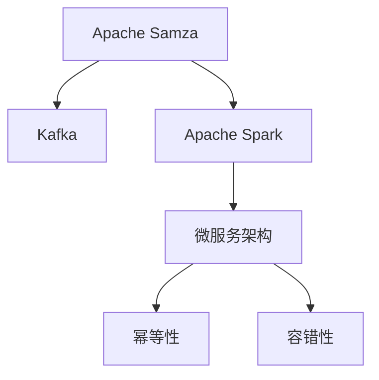

                 

# Samza原理与代码实例讲解

> 关键词：Apache Samza, 流处理, 分布式计算, Kafka, 数据流, 数据存储, 容错性, 实时数据处理, 微服务架构

## 1. 背景介绍

### 1.1 问题由来

在当今数据时代，数据量呈爆炸式增长，对实时数据处理的需求日益增加。传统的批处理技术难以满足实时性要求，流处理技术应运而生。流处理技术通过实时处理数据流，支持复杂计算和高吞吐量，具有极强的适应性。

Apache Samza是Apache软件基金会在2015年发布的一个开源流处理框架，旨在解决分布式流处理的痛点，支持高吞吐量、低延迟和可靠性的数据流处理。

### 1.2 问题核心关键点

Apache Samza通过分布式并行计算，支持高吞吐量的实时数据处理。核心技术包括：

- **Kafka作为数据流传输管道**：Kafka是一个分布式消息队列，可以作为数据的生产者和消费者，支持高吞吐量和低延迟的数据传输。
- **Spark作为计算框架**：Spark是一个开源分布式计算框架，支持在分布式集群上高效计算。
- **容错性保证**：Samza采用Kafka消息的幂等性特性，保证数据不会丢失。
- **微服务架构**：Samza支持微服务架构，通过划分任务和任务日志，提高系统的扩展性和可维护性。

这些核心技术使得Samza成为大数据和实时数据处理领域的佼佼者。本文将系统介绍Samza的原理和核心技术，并通过代码实例深入讲解其实现细节。

## 2. 核心概念与联系

### 2.1 核心概念概述

为了更好地理解Apache Samza的核心技术，本节将介绍几个密切相关的核心概念：

- **Apache Samza**：Apache Samza是一个基于Kafka的流处理框架，支持高吞吐量、低延迟和可靠性的数据流处理。
- **Kafka**：Kafka是一个开源分布式消息队列，用于流数据的生产、传输和消费，支持高吞吐量和低延迟。
- **Apache Spark**：Apache Spark是一个分布式计算框架，支持在集群上进行高效计算，是Samza的计算框架。
- **微服务架构**：将系统划分为多个小模块，每个模块负责独立的功能，提高系统的扩展性和可维护性。
- **幂等性**：Kafka的消息具有幂等性，即多次消费不会产生新的效果，用于保证数据的可靠性。
- **容错性**：Samza通过任务日志和检查点，保证数据不会丢失，支持高可用性。

这些核心概念之间的逻辑关系可以通过以下Mermaid流程图来展示：



这个流程图展示了大规模数据流处理的基本流程：

1. 数据通过Kafka生产者写入Kafka主题，并由Samza消费。
2. Samza在集群上通过Spark计算任务进行数据处理。
3. Samza采用微服务架构，将任务细粒度划分，通过任务日志和检查点保证容错性。
4. Kafka的幂等性特性保证数据不会丢失。

## 3. 核心算法原理 & 具体操作步骤
### 3.1 算法原理概述

Apache Samza的核心算法原理基于Kafka和Apache Spark的分布式计算特性，通过数据流的方式实现高吞吐量、低延迟的数据处理。其关键在于：

1. **数据流传输**：数据通过Kafka进行流传输，支持高吞吐量和低延迟。
2. **分布式计算**：Samza通过Apache Spark进行分布式计算，支持大规模数据处理。
3. **容错机制**：通过任务日志和检查点，保证任务的容错性，避免数据丢失。
4. **微服务架构**：将系统划分为多个小模块，提高系统的扩展性和可维护性。

### 3.2 算法步骤详解

Apache Samza的基本流程包括以下几个关键步骤：

**Step 1: 配置Kafka和Spark环境**

- 安装Kafka和Spark，启动相应的服务。
- 配置Kafka和Spark的连接信息，如Kafka服务器的地址、端口、Spark集群的信息等。

**Step 2: 定义Samza作业**

- 使用Samza API定义作业，包括任务的输入、输出、中间处理等。
- 编写Samza任务的源码，实现数据的流式处理逻辑。

**Step 3: 启动Samza作业**

- 通过Samza命令行或API提交作业。
- Samza集群会自动启动相应的任务，对数据进行处理。

**Step 4: 监控和调试**

- 使用Samza提供的Web UI界面，监控作业的运行状态和性能。
- 在Spark UI界面中查看作业的执行情况和资源使用情况。

**Step 5: 数据可视化**

- 使用工具如Grafana对处理后的数据进行可视化，实时展示业务指标和性能指标。

通过上述步骤，可以顺利地实现数据的流式处理和实时计算，完成Apache Samza作业的部署和监控。

### 3.3 算法优缺点

Apache Samza具有以下优点：

1. **高吞吐量、低延迟**：通过Kafka和Spark的高性能特性，支持高吞吐量的数据流处理，保证低延迟。
2. **分布式计算**：支持大规模数据处理，具有高度的扩展性和容错性。
3. **微服务架构**：通过微服务划分任务，提高系统的可维护性和可扩展性。
4. **容错机制**：通过任务日志和检查点，保证数据处理的可靠性。

同时，该方法也存在一些局限性：

1. **复杂性较高**：需要一定的系统运维和架构设计经验。
2. **学习曲线陡峭**：对于初学者来说，学习成本较高。
3. **依赖性强**：对Kafka和Spark的依赖较大，需要保证其稳定性和可靠性。
4. **性能调优困难**：在极端场景下，性能调优难度较大。

尽管存在这些局限性，Apache Samza在处理大规模实时数据方面仍具有无可替代的优势，广泛应用于金融、物流、电子商务等领域。

### 3.4 算法应用领域

Apache Samza主要用于以下几个领域：

- **金融领域**：实时计算高频交易、风险管理等。
- **电商领域**：实时计算订单流、用户行为分析等。
- **物流领域**：实时计算物流数据、异常检测等。
- **新闻媒体**：实时处理新闻数据、内容推荐等。
- **物联网**：实时处理传感器数据、设备监控等。

## 4. 数学模型和公式 & 详细讲解 & 举例说明

### 4.1 数学模型构建

本节将使用数学语言对Apache Samza的核心算法进行严格的刻画。

假设Samza作业处理的数据流为 $\{(x_t,y_t)\}_{t=1}^T$，其中 $x_t$ 表示输入，$y_t$ 表示输出。Samza作业的输入和输出可以表示为：

$$
\text{Input}(t) = \{(x_t, s_t)\}_{t=1}^T
$$
$$
\text{Output}(t) = \{(y_t, s_t)\}_{t=1}^T
$$

其中 $s_t$ 表示任务的状态。Samza作业的任务状态机可以表示为：

$$
S = \{S_0, S_1, \ldots, S_n\}
$$

其中 $S_0$ 表示初始状态，$S_n$ 表示最终状态。

### 4.2 公式推导过程

根据上述模型，Samza作业的执行过程可以表示为状态转移和数据处理的过程。设 $T_0(t)$ 表示任务在状态 $S_0$ 的执行时间，$T_1(t)$ 表示任务在状态 $S_1$ 的执行时间，以此类推。则Samza作业的执行时间可以表示为：

$$
T(t) = \sum_{i=0}^n T_i(t)
$$

Samza作业的任务执行时间为 $T$，则其执行效率可以表示为：

$$
\text{Efficiency} = \frac{T}{T(t)}
$$

为了保证任务的可靠性，Samza引入了任务日志和检查点机制。设任务日志的存储周期为 $L$，任务日志的大小为 $S$，则任务日志的存储量为：

$$
\text{Log Storage} = L \times S
$$

任务日志的存储周期越长，则任务的可恢复性越高，但需要更多的存储空间。因此需要在效率和可靠性之间进行权衡。

### 4.3 案例分析与讲解

以一个简单的股票交易系统为例，分析Samza作业的执行过程。假设系统的输入为股票的实时价格，输出为交易指令。Samza作业可以表示为：

- **输入**：股票价格数据流。
- **处理**：根据价格数据流，生成交易指令。
- **输出**：交易指令数据流。

在处理过程中，Samza作业可以按照以下步骤进行：

1. 从Kafka队列中读取股票价格数据流，存储到Spark计算节点。
2. 在Spark计算节点上，进行数据处理和计算，生成交易指令。
3. 将交易指令输出到Kafka队列，供其他系统或应用使用。

通过上述流程，Samza作业实现了股票交易系统的实时处理，确保了交易的及时性和准确性。

## 5. 项目实践：代码实例和详细解释说明
### 5.1 开发环境搭建

在进行Samza实践前，我们需要准备好开发环境。以下是使用Python进行PySpark开发的环境配置流程：

1. 安装Anaconda：从官网下载并安装Anaconda，用于创建独立的Python环境。

2. 创建并激活虚拟环境：
```bash
conda create -n spark-env python=3.8 
conda activate spark-env
```

3. 安装PySpark：从官网获取对应的安装命令。例如：
```bash
conda install pyspark=3.0.2 
```

4. 安装Kafka：从官网获取对应的安装命令。例如：
```bash
conda install kafka-python=2.4.0 
```

5. 安装Flume：从官网获取对应的安装命令。例如：
```bash
conda install flume4=1.11.0 
```

完成上述步骤后，即可在`spark-env`环境中开始Samza实践。

### 5.2 源代码详细实现

下面我们以一个简单的订单流处理为例，给出使用PySpark对Samza作业进行实现的代码。

首先，定义订单流处理任务的数据模型：

```python
from pyspark.sql import SparkSession
from pyspark.sql.functions import col

spark = SparkSession.builder.appName("OrderStreamProcessing").getOrCreate()

# 订单数据模型
order = spark.createDataFrame([
    (1, "apple", 5),
    (2, "banana", 3),
    (3, "orange", 2)
], ["id", "product", "quantity"])
```

然后，定义订单流处理任务的入流、处理和出流：

```python
# 订单流处理任务
orderStream = order.writeStream \
    .format("kafka") \
    .option("kafka.topic", "order-topic") \
    .option("kafka.bootstrap.servers", "localhost:9092") \
    .option("kafka.consumer.timeout", "1000") \
    .option("kafka.partition", "0") \
    .start()

# 订单流处理任务的处理逻辑
orderStream.foreachBatch(lambda batch: batch.select().writeStream \
    .format("kafka") \
    .option("kafka.topic", "order-aggregate-topic") \
    .option("kafka.bootstrap.servers", "localhost:9092") \
    .option("kafka.consumer.timeout", "1000") \
    .option("kafka.partition", "0") \
    .start())

# 订单流处理任务的输出
orderStream.stop()
```

接下来，启动订单流处理任务：

```python
spark.stop()
```

以上就是使用PySpark对Samza作业进行订单流处理的完整代码实现。可以看到，在PySpark中，Samza作业可以通过DataStream API轻松实现数据的流式处理和计算。

### 5.3 代码解读与分析

让我们再详细解读一下关键代码的实现细节：

**订单数据模型定义**：
- 使用SparkSession创建订单数据模型，定义订单的id、产品和数量等字段。

**订单流处理任务定义**：
- 使用DataStream API定义订单流处理任务，指定输入流和输出流的主题、服务器地址等参数。
- 使用`foreachBatch`方法实现订单流的批量处理，并将处理结果输出到新的Kafka主题。

**订单流处理任务启动**：
- 使用`start`方法启动订单流处理任务。
- 使用`stop`方法停止订单流处理任务。

通过上述代码，实现了订单流的实时处理和计算。Samza作业的实际部署还需要考虑数据源、数据处理逻辑、数据存储等方面的细节，但核心的数据流处理逻辑基本与此类似。

## 6. 实际应用场景
### 6.1 金融风控系统

金融风控系统是Apache Samza的重要应用场景之一。传统的风控系统需要手动编写复杂的规则和算法，难以应对复杂和动态的业务场景。而基于Samza的流处理系统，可以实时分析交易数据，发现异常行为，提升风险管理的及时性和准确性。

具体而言，可以收集实时交易数据，使用Samza对数据进行流式处理，分析交易行为、账户余额等关键指标，实时识别异常交易和风险用户，及时采取风控措施，防范金融风险。

### 6.2 电商推荐系统

电商推荐系统需要实时处理用户行为数据，进行商品推荐。传统的推荐系统难以应对实时性要求，且推荐算法复杂。而基于Samza的流处理系统，可以实时分析用户行为数据，计算推荐结果，提升推荐效果。

具体而言，可以收集用户的浏览、点击、购买等行为数据，使用Samza进行流式处理，实时计算用户的兴趣偏好，进行个性化推荐，提升用户满意度。

### 6.3 物流仓储管理

物流仓储管理需要实时处理大量的订单数据和物流数据，进行订单处理、库存管理、配送路线优化等。传统的系统难以应对实时性和高并发要求，且管理复杂。而基于Samza的流处理系统，可以实时处理订单数据，进行库存和配送管理，提升物流效率。

具体而言，可以收集订单数据和物流数据，使用Samza进行流式处理，实时计算库存和配送路线，优化物流管理，提高配送效率。

### 6.4 未来应用展望

随着Apache Samza的不断发展，其在实时数据处理领域的应用前景广阔。未来，Samza将更加广泛地应用于：

- **物联网数据处理**：实时处理传感器数据，进行设备监控、故障检测等。
- **医疗健康数据处理**：实时处理医疗数据，进行疾病监测、患者管理等。
- **社交媒体数据处理**：实时处理社交媒体数据，进行舆情分析、用户行为分析等。
- **智能交通数据处理**：实时处理交通数据，进行交通流量预测、交通管理等。

## 7. 工具和资源推荐
### 7.1 学习资源推荐

为了帮助开发者系统掌握Apache Samza的理论基础和实践技巧，这里推荐一些优质的学习资源：

1. **Apache Samza官方文档**：详细介绍了Samza的基本概念、架构和应用场景，是学习和实践Samza的重要参考资料。

2. **Apache Spark官方文档**：Apache Spark是Samza的计算框架，详细介绍了Spark的基本概念、API和最佳实践。

3. **Kafka官方文档**：Kafka是Samza的数据传输管道，详细介绍了Kafka的基本概念、API和最佳实践。

4. **Samza实战指南**：由官方社区成员编写的实战指南，通过实际案例讲解Samza的应用和实践。

5. **Spark 和 Samza 实战**：由大数据专家编写的实战指南，通过实际案例讲解Spark和Samza的应用和实践。

通过对这些资源的学习实践，相信你一定能够快速掌握Apache Samza的精髓，并用于解决实际的流处理问题。

### 7.2 开发工具推荐

高效的开发离不开优秀的工具支持。以下是几款用于Apache Samza开发的常用工具：

1. **PySpark**：基于Python的Spark API，支持实时数据流处理和计算。
2. **Kafka**：开源分布式消息队列，支持高吞吐量和低延迟的数据传输。
3. **Flume**：开源数据收集系统，支持实时收集和传输日志数据。
4. **Grafana**：开源数据可视化工具，支持实时展示业务指标和性能指标。
5. **Spark UI**：Spark的Web UI界面，支持实时监控Spark作业的执行情况和资源使用情况。

合理利用这些工具，可以显著提升Apache Samza的开发效率，加快创新迭代的步伐。

### 7.3 相关论文推荐

Apache Samza的研究和发展源于学界的持续研究。以下是几篇奠基性的相关论文，推荐阅读：

1. **Apache Samza: A Fast and Fault-tolerant Stream Processing System**：Samza的原论文，详细介绍了Samza的架构和算法原理。

2. **Kafka: A real-time distributed messaging system**：Kafka的原论文，详细介绍了Kafka的基本概念和架构。

3. **Apache Spark: Cluster Computing with Fault Tolerance**：Spark的原论文，详细介绍了Spark的基本概念和算法原理。

4. **Real-time Stream Processing in Apache Spark**：Samza和Spark结合的论文，详细介绍了Samza在Spark上的实现和应用。

5. **Apache Samza: A Fault-tolerant, Distributed Stream Processing System**：Samza的后续论文，详细介绍了Samza的容错机制和优化策略。

这些论文代表了大规模流处理技术的演进脉络，通过学习这些前沿成果，可以帮助研究者把握学科前进方向，激发更多的创新灵感。

## 8. 总结：未来发展趋势与挑战
### 8.1 总结

本文对Apache Samza的原理和核心技术进行了全面系统的介绍。首先阐述了Samza在大数据和实时数据处理领域的背景和意义，明确了Samza在流处理方面的独特价值。其次，从原理到实践，详细讲解了Samza的数学模型和实现细节，并通过代码实例深入讲解其实现细节。同时，本文还广泛探讨了Samza在金融风控、电商推荐、物流仓储等诸多行业领域的应用前景，展示了Samza范式的巨大潜力。此外，本文精选了Samza的学习资源，力求为读者提供全方位的技术指引。

通过本文的系统梳理，可以看到，Apache Samza通过Kafka和Spark的高性能特性，支持高吞吐量、低延迟的实时数据处理，具有极强的扩展性和容错性。未来，Samza必将在更多领域得到应用，为大数据和实时数据处理带来新的突破。

### 8.2 未来发展趋势

展望未来，Apache Samza的发展趋势如下：

1. **流处理和批处理的融合**：Samza将进一步融合流处理和批处理技术，支持混合计算模式，满足不同应用场景的需求。
2. **微服务架构的优化**：Samza将进一步优化微服务架构，提高系统的可扩展性和可维护性。
3. **实时数据处理和分析的深度融合**：Samza将进一步融合数据分析技术，实现更深入的数据分析和应用。
4. **容错机制的改进**：Samza将进一步改进容错机制，支持更高的数据可靠性和可用性。
5. **大数据技术的集成**：Samza将进一步集成大数据技术，支持更大规模的数据处理和存储。

这些趋势将进一步提升Samza的性能和应用范围，使其在实时数据处理领域发挥更大的作用。

### 8.3 面临的挑战

尽管Apache Samza在实时数据处理领域表现出色，但在迈向更加智能化、普适化应用的过程中，仍面临以下挑战：

1. **性能瓶颈**：在大规模数据处理时，Samza的性能和扩展性仍需进一步优化。
2. **系统复杂性**：Samza的系统架构和运维复杂性较高，需要更高的运维能力和技术水平。
3. **数据安全**：在实时数据处理中，数据安全和隐私保护问题尤为突出。
4. **资源消耗**：Samza在大规模数据处理时，需要消耗大量的计算和存储资源，资源消耗问题需要进一步优化。
5. **跨平台支持**：Samza在大规模分布式系统中，跨平台支持的难度较大，需要更多的跨平台解决方案。

这些挑战凸显了Samza在实时数据处理领域的应用难点，需要更多的创新和突破。

### 8.4 研究展望

为了解决上述挑战，未来Samza的研究方向如下：

1. **高性能优化**：通过算法优化和架构改进，提升Samza的性能和扩展性，支持更大规模的数据处理。
2. **系统简化**：通过简化系统架构和运维，提高Samza的可维护性和易用性，降低系统复杂性。
3. **数据安全保护**：通过数据加密、访问控制等技术，提升数据安全和隐私保护能力。
4. **资源优化**：通过资源优化技术，降低Samza的资源消耗，提升系统的效率和可扩展性。
5. **跨平台支持**：通过平台标准化和工具集成，支持Samza在大规模分布式系统中的应用。

这些研究方向将进一步提升Samza的性能和应用范围，使其在实时数据处理领域发挥更大的作用。

## 9. 附录：常见问题与解答

**Q1: Apache Samza的架构是什么？**

A: Apache Samza的架构基于微服务架构，将系统划分为多个小模块，每个模块负责独立的功能。系统由数据流处理模块、任务调度模块、任务日志模块和检查点模块组成。数据流处理模块负责数据的流式处理和计算，任务调度模块负责任务的分配和调度，任务日志模块负责任务的容错和恢复，检查点模块负责任务的持久化。

**Q2: Apache Samza如何保证数据的可靠性？**

A: Apache Samza通过任务日志和检查点机制，保证数据的可靠性。任务日志存储任务的状态信息，用于任务容错和恢复。检查点存储任务的中间状态，用于任务异常情况下的恢复。

**Q3: Apache Samza在Spark中是如何进行流处理的？**

A: Apache Samza在Spark中通过DataStream API进行流处理。将Spark的RDD数据流转换为DataStream数据流，实现数据的实时处理和计算。

**Q4: Apache Samza和Apache Kafka是如何协同工作的？**

A: Apache Samza通过Kafka进行数据流传输，Kafka负责数据的生产、传输和消费。Samza将输入数据写入Kafka队列，通过Spark进行流式处理，并将处理结果输出到Kafka队列，供其他系统或应用使用。

**Q5: Apache Samza的实时性是如何保证的？**

A: Apache Samza通过Kafka和Spark的高性能特性，支持高吞吐量和低延迟的数据处理。Kafka支持高吞吐量的数据传输，Spark支持高并发的数据处理，确保了系统的实时性。

---

作者：禅与计算机程序设计艺术 / Zen and the Art of Computer Programming

