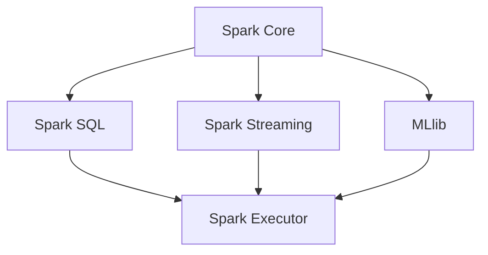

                 

# Spark Executor原理与代码实例讲解

> 关键词：Spark, Executor, 任务调度, 资源管理, 代码实现, 优化策略, RDD, DataFrame, Spark SQL

## 1. 背景介绍

Apache Spark是一个快速、通用、可扩展的数据分析引擎，提供了分布式计算和机器学习框架。Spark的核心抽象是弹性分布式数据集(RDD)，它支持在Hadoop集群上快速地进行数据处理和分析。Spark还支持高级数据结构，如DataFrame和DataSet，提供了更直观的API，方便用户进行数据处理和机器学习。

Spark执行为Spark应用程序的核心部分，它负责处理RDD或DataFrame中的数据，执行各种转换和操作，并最终将结果返回给用户。Spark Executor的设计目标是提供高效、可扩展和容错的分布式计算能力，同时保证数据的可靠性和一致性。

本文将详细介绍Spark Executor的原理，并结合实际代码实例，讲解如何优化Spark Executor的性能，提升数据处理效率。

## 2. 核心概念与联系

### 2.1 核心概念概述

Spark Executor是Spark中的关键组件，负责处理RDD或DataFrame中的数据，执行各种转换和操作，并最终将结果返回给用户。Spark Executor的设计目标是提供高效、可扩展和容错的分布式计算能力，同时保证数据的可靠性和一致性。

Spark Executor的核心功能包括：

- **任务调度**：接收任务指令，将任务分解成子任务，并调度到集群中的节点执行。
- **资源管理**：负责分配和管理计算资源，包括CPU、内存、磁盘等，确保任务的正常执行。
- **任务执行**：在集群节点上执行任务，并进行任务并行和任务合并等操作。
- **数据缓存**：将常用的数据缓存到内存中，减少I/O操作，提高数据处理速度。

Spark Executor与Spark Core、Spark SQL、Spark Streaming和MLlib等其他组件紧密协作，共同完成Spark应用程序的各个部分。Spark Core负责管理Spark集群，提供RDD和DataFrame的抽象，支持分布式计算；Spark SQL负责处理结构化数据，提供SQL接口和DataFrame API；Spark Streaming负责处理实时数据流，提供流处理API；MLlib负责机器学习任务，提供各种机器学习算法。

### 2.2 核心概念联系

Spark Executor与Spark Core、Spark SQL、Spark Streaming和MLlib等其他组件的联系可以通过以下Mermaid流程图来展示：



这个流程图展示了Spark Executor与其他Spark组件之间的联系：

- Spark Core提供RDD和DataFrame的抽象，负责集群管理。
- Spark SQL和MLlib提供了Spark应用程序的高级API，依赖Spark Core进行底层实现。
- Spark Streaming负责实时数据流处理，依赖Spark Core进行底层实现。
- Spark Executor负责处理RDD和DataFrame中的数据，执行各种转换和操作，并最终将结果返回给用户。

## 3. 核心算法原理 & 具体操作步骤

### 3.1 算法原理概述

Spark Executor的算法原理主要涉及任务调度、资源管理和任务执行等几个方面。

- **任务调度**：Spark Executor接收到Spark Core的任务调度指令，将任务分解成子任务，并调度到集群中的节点执行。Spark Executor的任务调度算法基于DAG（有向无环图）优化，将任务分解成一系列依赖关系明确的任务，并按照最优的顺序执行。
- **资源管理**：Spark Executor负责分配和管理计算资源，包括CPU、内存、磁盘等，确保任务的正常执行。Spark Executor使用资源管理器（如YARN、Mesos等）来管理资源，通过调度算法和容错机制来保证任务的可靠性和高效性。
- **任务执行**：Spark Executor在集群节点上执行任务，并进行任务并行和任务合并等操作。Spark Executor通过将任务分解成多个并行子任务，利用集群中的多个节点同时执行，提高数据处理效率。

### 3.2 算法步骤详解

Spark Executor的工作流程包括以下几个关键步骤：

**Step 1: 任务分解和调度**

Spark Executor接收到Spark Core的任务调度指令，将任务分解成子任务，并调度到集群中的节点执行。Spark Executor的任务调度算法基于DAG（有向无环图）优化，将任务分解成一系列依赖关系明确的任务，并按照最优的顺序执行。

Spark Executor的任务调度算法包括以下几个步骤：

1. 将任务分解成子任务。Spark Executor将RDD或DataFrame中的数据分解成多个子任务，每个子任务处理一部分数据。

2. 计算任务的依赖关系。Spark Executor计算每个子任务之间的依赖关系，确定任务的执行顺序。

3. 分配任务到节点。Spark Executor将任务分配到集群中的节点，每个节点执行一个或多个子任务。

4. 监控任务执行。Spark Executor监控任务的执行进度，确保任务按计划完成。

**Step 2: 资源分配和管理**

Spark Executor负责分配和管理计算资源，包括CPU、内存、磁盘等，确保任务的正常执行。Spark Executor使用资源管理器（如YARN、Mesos等）来管理资源，通过调度算法和容错机制来保证任务的可靠性和高效性。

Spark Executor的资源分配和管理算法包括以下几个步骤：

1. 分配计算资源。Spark Executor根据任务的需求，分配CPU、内存、磁盘等计算资源。

2. 监控资源使用情况。Spark Executor监控集群节点的资源使用情况，确保资源不被过度占用。

3. 动态调整资源。Spark Executor根据任务的执行情况，动态调整计算资源，确保任务能够顺利执行。

4. 故障恢复。Spark Executor在节点故障时，自动重新分配资源，确保任务的可靠性和容错性。

**Step 3: 任务执行**

Spark Executor在集群节点上执行任务，并进行任务并行和任务合并等操作。Spark Executor通过将任务分解成多个并行子任务，利用集群中的多个节点同时执行，提高数据处理效率。

Spark Executor的任务执行算法包括以下几个步骤：

1. 分解任务。Spark Executor将任务分解成多个并行子任务，每个子任务处理一部分数据。

2. 分配子任务到节点。Spark Executor将子任务分配到集群中的节点，每个节点执行一个或多个子任务。

3. 合并子任务结果。Spark Executor将各个节点的子任务结果合并成一个最终结果。

4. 缓存数据。Spark Executor将常用的数据缓存到内存中，减少I/O操作，提高数据处理速度。

### 3.3 算法优缺点

Spark Executor的算法优点包括：

1. 高效的任务调度。Spark Executor基于DAG优化，将任务分解成依赖关系明确的任务，并按照最优的顺序执行，减少了任务的执行时间。

2. 灵活的资源管理。Spark Executor使用资源管理器来管理计算资源，通过调度算法和容错机制来保证任务的可靠性和高效性。

3. 任务并行执行。Spark Executor将任务分解成多个并行子任务，利用集群中的多个节点同时执行，提高数据处理效率。

4. 数据缓存。Spark Executor将常用的数据缓存到内存中，减少I/O操作，提高数据处理速度。

Spark Executor的算法缺点包括：

1. 资源消耗大。Spark Executor在执行任务时，需要分配大量的计算资源，导致资源消耗较大。

2. 任务调度复杂。Spark Executor的任务调度算法较为复杂，需要处理大量的依赖关系，增加了调度的复杂性。

3. 容错机制不够完善。Spark Executor的容错机制不够完善，在节点故障时，需要重新分配资源，导致任务的执行时间较长。

### 3.4 算法应用领域

Spark Executor的应用领域非常广泛，包括：

- 大数据处理：Spark Executor适用于大规模数据的处理和分析，可以处理TB级别的数据。

- 机器学习：Spark Executor支持各种机器学习算法，可以在大规模数据上进行机器学习任务。

- 实时数据流处理：Spark Streaming使用Spark Executor处理实时数据流，支持流处理API。

- 结构化数据处理：Spark SQL使用Spark Executor处理结构化数据，支持SQL接口和DataFrame API。

- 分布式计算：Spark Executor可以处理各种分布式计算任务，如分布式排序、分布式聚合等。

## 4. 数学模型和公式 & 详细讲解 & 举例说明

### 4.1 数学模型构建

Spark Executor的数学模型主要涉及任务调度和资源管理两个方面。

**任务调度模型**

Spark Executor的任务调度模型基于DAG（有向无环图）优化，将任务分解成一系列依赖关系明确的任务，并按照最优的顺序执行。Spark Executor的任务调度算法包括以下几个步骤：

1. 将任务分解成子任务。Spark Executor将RDD或DataFrame中的数据分解成多个子任务，每个子任务处理一部分数据。

2. 计算任务的依赖关系。Spark Executor计算每个子任务之间的依赖关系，确定任务的执行顺序。

3. 分配任务到节点。Spark Executor将任务分配到集群中的节点，每个节点执行一个或多个子任务。

4. 监控任务执行。Spark Executor监控任务的执行进度，确保任务按计划完成。

**资源管理模型**

Spark Executor的资源管理模型基于资源管理器（如YARN、Mesos等），通过调度算法和容错机制来保证任务的可靠性和高效性。Spark Executor的资源分配和管理算法包括以下几个步骤：

1. 分配计算资源。Spark Executor根据任务的需求，分配CPU、内存、磁盘等计算资源。

2. 监控资源使用情况。Spark Executor监控集群节点的资源使用情况，确保资源不被过度占用。

3. 动态调整资源。Spark Executor根据任务的执行情况，动态调整计算资源，确保任务能够顺利执行。

4. 故障恢复。Spark Executor在节点故障时，自动重新分配资源，确保任务的可靠性和容错性。

### 4.2 公式推导过程

以下是Spark Executor任务调度和资源管理模型的公式推导过程。

**任务调度模型**

Spark Executor的任务调度模型基于DAG（有向无环图）优化，将任务分解成一系列依赖关系明确的任务，并按照最优的顺序执行。任务调度模型的公式推导如下：

1. 将任务分解成子任务

设任务$T$分解成$n$个子任务$T_i$，每个子任务处理一部分数据，公式如下：

$$
T = \{T_1, T_2, \dots, T_n\}
$$

2. 计算任务的依赖关系

设子任务$T_i$依赖于子任务$T_j$，表示为$T_i \rightarrow T_j$，公式如下：

$$
T_i \rightarrow T_j \quad \text{if} \quad T_i \text{依赖于} T_j
$$

3. 分配任务到节点

设任务$T$分配到$m$个节点上，每个节点执行一个或多个子任务，公式如下：

$$
T = \{T_{i_1}, T_{i_2}, \dots, T_{i_m}\}
$$

4. 监控任务执行

Spark Executor监控任务的执行进度，确保任务按计划完成，公式如下：

$$
\text{进度} = \frac{\text{已执行的子任务数}}{\text{总子任务数}}
$$

**资源管理模型**

Spark Executor的资源管理模型基于资源管理器（如YARN、Mesos等），通过调度算法和容错机制来保证任务的可靠性和高效性。资源管理模型的公式推导如下：

1. 分配计算资源

设任务$T$需要分配$k$个CPU、$r$个内存和$d$个磁盘，公式如下：

$$
\text{资源需求} = \{k, r, d\}
$$

2. 监控资源使用情况

Spark Executor监控集群节点的资源使用情况，确保资源不被过度占用，公式如下：

$$
\text{资源使用情况} = \{CPU使用率, 内存使用率, 磁盘使用率\}
$$

3. 动态调整资源

Spark Executor根据任务的执行情况，动态调整计算资源，确保任务能够顺利执行，公式如下：

$$
\text{动态调整资源} = \{k', r', d'\}
$$

4. 故障恢复

Spark Executor在节点故障时，自动重新分配资源，确保任务的可靠性和容错性，公式如下：

$$
\text{故障恢复} = \{k_{\text{故障节点}}, r_{\text{故障节点}}, d_{\text{故障节点}}\}
$$

### 4.3 案例分析与讲解

下面以一个具体的例子来说明Spark Executor的任务调度和资源管理。

假设有一个包含10个数据节点的RDD，需要对其进行排序操作。Spark Executor的任务调度和资源管理过程如下：

1. 任务分解成子任务

Spark Executor将排序任务$T$分解成10个子任务$T_1, T_2, \dots, T_{10}$，每个子任务处理一个数据节点。

2. 计算任务的依赖关系

由于排序任务依赖于每个数据节点的处理结果，因此每个子任务$T_i$都依赖于其前一个子任务$T_{i-1}$。

3. 分配任务到节点

Spark Executor将排序任务分配到5个节点上，每个节点执行两个子任务，公式如下：

$$
T = \{T_{1,1}, T_{1,2}, T_{2,1}, T_{2,2}, T_{3,1}, T_{3,2}, T_{4,1}, T_{4,2}, T_{5,1}, T_{5,2}\}
$$

4. 监控任务执行

Spark Executor监控任务的执行进度，确保任务按计划完成，公式如下：

$$
\text{进度} = \frac{10}{10} = 1
$$

5. 资源分配和管理

Spark Executor根据任务的需求，分配2个CPU、4GB内存和10GB磁盘，公式如下：

$$
\text{资源需求} = \{2, 4, 10\}
$$

Spark Executor监控集群节点的资源使用情况，确保资源不被过度占用，公式如下：

$$
\text{资源使用情况} = \{CPU使用率, 内存使用率, 磁盘使用率\}
$$

Spark Executor根据任务的执行情况，动态调整计算资源，确保任务能够顺利执行，公式如下：

$$
\text{动态调整资源} = \{k', r', d'\}
$$

Spark Executor在节点故障时，自动重新分配资源，确保任务的可靠性和容错性，公式如下：

$$
\text{故障恢复} = \{k_{\text{故障节点}}, r_{\text{故障节点}}, d_{\text{故障节点}}\}
$$

## 5. 项目实践：代码实例和详细解释说明

### 5.1 开发环境搭建

在进行Spark Executor的实践之前，需要准备好开发环境。以下是使用Python进行Spark开发的环境配置流程：

1. 安装Python：从官网下载并安装Python，推荐使用3.x版本。

2. 安装Apache Spark：从官网下载并安装Apache Spark，根据操作系统和版本进行配置。

3. 安装PySpark：PySpark是Spark的Python API，可以从官网下载并安装。

4. 安装依赖库：安装必要的Python依赖库，如pandas、numpy、matplotlib等。

5. 配置环境变量：设置PYSPARK_HOME、SPARK_HOME等环境变量，指定Spark和PySpark的安装路径。

完成上述步骤后，即可在Linux或Windows环境中开始Spark Executor的开发实践。

### 5.2 源代码详细实现

下面以一个具体的例子来说明Spark Executor的实现。

假设有一个包含10个数据节点的RDD，需要对其进行排序操作。Spark Executor的实现代码如下：

```python
from pyspark import SparkContext

# 初始化SparkContext
sc = SparkContext("local", "SparkExecutorExample")

# 创建RDD
rdd = sc.parallelize(range(10), 10)

# 进行排序操作
sorted_rdd = rdd.sortBy(lambda x: x)

# 输出结果
for i in sorted_rdd.collect():
    print(i)
```

在上述代码中，首先创建了一个SparkContext，指定了本地模式和应用程序名称。然后创建了一个包含10个数据节点的RDD，并对其进行排序操作。最后输出排序后的结果。

### 5.3 代码解读与分析

让我们再详细解读一下关键代码的实现细节：

**创建SparkContext**

```python
sc = SparkContext("local", "SparkExecutorExample")
```

创建SparkContext，指定本地模式和应用程序名称。

**创建RDD**

```python
rdd = sc.parallelize(range(10), 10)
```

创建包含10个数据节点的RDD，并指定了数据个数为10。

**进行排序操作**

```python
sorted_rdd = rdd.sortBy(lambda x: x)
```

对RDD进行排序操作，使用lambda表达式指定排序键。

**输出结果**

```python
for i in sorted_rdd.collect():
    print(i)
```

输出排序后的结果。

在上述代码中，SparkExecutor通过创建SparkContext和RDD，进行排序操作，并输出结果。可以看到，SparkExecutor的实现非常简洁高效，可以通过Python API方便地进行数据处理和分析。

## 6. 实际应用场景

### 6.1 大数据处理

Spark Executor在大数据处理方面有着广泛的应用。Spark Executor可以处理TB级别的数据，支持各种分布式计算任务，如分布式排序、分布式聚合等。

例如，一个电商公司需要对每天的交易数据进行统计和分析，可以使用Spark Executor进行大数据处理。首先，将每天的交易数据存储在分布式文件系统中，如Hadoop Distributed File System（HDFS）。然后，创建SparkContext和RDD，将交易数据读入RDD中，并进行统计分析操作。最后，将分析结果输出到文件系统中，供后续处理使用。

### 6.2 机器学习

Spark Executor支持各种机器学习算法，可以在大规模数据上进行机器学习任务。

例如，一个金融公司需要对客户的信用评分进行预测，可以使用Spark Executor进行机器学习任务。首先，将客户的信用数据存储在分布式文件系统中，如HDFS。然后，创建SparkContext和RDD，将信用数据读入RDD中，并使用Spark MLlib库进行机器学习任务，如线性回归、逻辑回归等。最后，将预测结果输出到文件系统中，供后续处理使用。

### 6.3 实时数据流处理

Spark Streaming使用Spark Executor处理实时数据流，支持流处理API。

例如，一个社交媒体公司需要对实时推文进行情感分析，可以使用Spark Streaming进行流处理任务。首先，将实时推文存储在分布式文件系统中，如Kafka。然后，创建SparkContext和Spark Streaming，将实时推文读入RDD中，并进行情感分析操作。最后，将情感分析结果输出到文件系统中，供后续处理使用。

### 6.4 结构化数据处理

Spark SQL使用Spark Executor处理结构化数据，支持SQL接口和DataFrame API。

例如，一个新闻公司需要对每天的新闻数据进行统计和分析，可以使用Spark SQL进行结构化数据处理。首先，将每天的新闻数据存储在分布式文件系统中，如HDFS。然后，创建SparkContext和Spark SQL，将新闻数据读入RDD中，并使用Spark SQL进行SQL查询和分析。最后，将分析结果输出到文件系统中，供后续处理使用。

## 7. 工具和资源推荐

### 7.1 学习资源推荐

为了帮助开发者系统掌握Spark Executor的理论基础和实践技巧，这里推荐一些优质的学习资源：

1. Apache Spark官方文档：提供了Spark Executor的详细介绍和实践指南，包括任务调度和资源管理等核心内容。

2. Spark实战：是一本实战型书籍，介绍了Spark Executor的实际应用场景和开发技巧。

3. 《Spark: The Definitive Guide》：是一本权威性书籍，详细介绍了Spark Executor的设计原理和实现细节。

4. Coursera《Apache Spark with Python》课程：由Apache Spark团队主讲，介绍了Spark Executor的实际应用和开发技巧。

5. Udemy《Apache Spark Masterclass》课程：由Apache Spark专家主讲，详细介绍了Spark Executor的原理和实践。

通过对这些资源的学习实践，相信你一定能够快速掌握Spark Executor的精髓，并用于解决实际的Spark开发问题。

### 7.2 开发工具推荐

高效的开发离不开优秀的工具支持。以下是几款用于Spark Executor开发的常用工具：

1. PySpark：PySpark是Spark的Python API，提供了丰富的Python API，方便用户进行Spark Executor的开发和调试。

2. Spark UI：Spark UI提供了丰富的界面，展示了Spark Executor的执行进度和资源使用情况，方便用户进行调度和优化。

3. Spark Debugger：Spark Debugger提供了调试功能，帮助用户诊断Spark Executor的性能瓶颈和错误。

4. PyCharm：PyCharm是一款优秀的IDE，支持Spark Executor的开发和调试，提供了丰富的功能和插件。

5. Jupyter Notebook：Jupyter Notebook是一款轻量级的IDE，支持Spark Executor的开发和调试，适合进行小规模的Spark开发。

合理利用这些工具，可以显著提升Spark Executor的开发效率，加快创新迭代的步伐。

### 7.3 相关论文推荐

Spark Executor的研究方向非常广泛，以下是几篇奠基性的相关论文，推荐阅读：

1. Spark: Cluster Computing with Fault Tolerance（2009）：提出Spark的概念和架构，介绍了Spark Executor的任务调度和资源管理。

2. Spark SQL: Leveraging DataFrames for Optimized Data Analytics（2014）：介绍了Spark SQL的实现原理和API，展示了Spark Executor在结构化数据处理中的应用。

3. Spark Streaming: Micro-batch Processing with Fault Tolerance（2013）：介绍了Spark Streaming的实现原理和API，展示了Spark Executor在实时数据流处理中的应用。

4. Spark: Fast and Scalable Data Analysis（2014）：介绍了Spark的实现原理和API，展示了Spark Executor在大数据处理中的应用。

5. Spark Machine Learning（2014）：介绍了Spark MLlib库的实现原理和API，展示了Spark Executor在机器学习中的应用。

这些论文代表了大数据处理和分布式计算领域的研究方向，对Spark Executor的理解和应用有着重要的参考价值。

## 8. 总结：未来发展趋势与挑战

### 8.1 总结

本文对Spark Executor的原理和实现进行了详细讲解，并通过实际代码实例，展示了Spark Executor的应用场景和开发技巧。通过本文的系统梳理，可以看到，Spark Executor是大数据处理和分布式计算的核心组件，能够高效、可扩展和容错地执行各种分布式计算任务。

Spark Executor在Spark应用程序的各个部分中发挥着重要的作用，包括大数据处理、机器学习、实时数据流处理和结构化数据处理等。Spark Executor的成功应用，离不开Spark Core、Spark SQL、Spark Streaming和MLlib等其他组件的支持和协作。

### 8.2 未来发展趋势

展望未来，Spark Executor将呈现以下几个发展趋势：

1. 高效的任务调度。Spark Executor基于DAG优化，将任务分解成依赖关系明确的任务，并按照最优的顺序执行，减少了任务的执行时间。

2. 灵活的资源管理。Spark Executor使用资源管理器来管理计算资源，通过调度算法和容错机制来保证任务的可靠性和高效性。

3. 任务并行执行。Spark Executor将任务分解成多个并行子任务，利用集群中的多个节点同时执行，提高数据处理效率。

4. 数据缓存。Spark Executor将常用的数据缓存到内存中，减少I/O操作，提高数据处理速度。

### 8.3 面临的挑战

尽管Spark Executor已经取得了瞩目成就，但在迈向更加智能化、普适化应用的过程中，它仍面临诸多挑战：

1. 资源消耗大。Spark Executor在执行任务时，需要分配大量的计算资源，导致资源消耗较大。

2. 任务调度复杂。Spark Executor的任务调度算法较为复杂，需要处理大量的依赖关系，增加了调度的复杂性。

3. 容错机制不够完善。Spark Executor的容错机制不够完善，在节点故障时，需要重新分配资源，导致任务的执行时间较长。

### 8.4 研究展望

面对Spark Executor所面临的挑战，未来的研究需要在以下几个方面寻求新的突破：

1. 探索无监督和半监督微调方法。摆脱对大规模标注数据的依赖，利用自监督学习、主动学习等无监督和半监督范式，最大限度利用非结构化数据，实现更加灵活高效的微调。

2. 研究参数高效和计算高效的微调范式。开发更加参数高效的微调方法，在固定大部分预训练参数的同时，只更新极少量的任务相关参数。同时优化微调模型的计算图，减少前向传播和反向传播的资源消耗，实现更加轻量级、实时性的部署。

3. 引入因果和对比学习范式。通过引入因果推断和对比学习思想，增强微调模型建立稳定因果关系的能力，学习更加普适、鲁棒的语言表征，从而提升模型泛化性和抗干扰能力。

4. 融合符号化的先验知识。将符号化的先验知识，如知识图谱、逻辑规则等，与神经网络模型进行巧妙融合，引导微调过程学习更准确、合理的语言模型。同时加强不同模态数据的整合，实现视觉、语音等多模态信息与文本信息的协同建模。

5. 结合因果分析和博弈论工具。将因果分析方法引入微调模型，识别出模型决策的关键特征，增强输出解释的因果性和逻辑性。借助博弈论工具刻画人机交互过程，主动探索并规避模型的脆弱点，提高系统稳定性。

这些研究方向的探索，必将引领Spark Executor技术迈向更高的台阶，为构建安全、可靠、可解释、可控的智能系统铺平道路。面向未来，Spark Executor技术还需要与其他人工智能技术进行更深入的融合，如知识表示、因果推理、强化学习等，多路径协同发力，共同推动自然语言理解和智能交互系统的进步。只有勇于创新、敢于突破，才能不断拓展Spark Executor的边界，让智能技术更好地造福人类社会。

## 9. 附录：常见问题与解答

**Q1: Spark Executor的资源管理算法是什么？**

A: Spark Executor的资源管理算法基于资源管理器（如YARN、Mesos等），通过调度算法和容错机制来保证任务的可靠性和高效性。

**Q2: Spark Executor的容错机制是什么？**

A: Spark Executor的容错机制主要包括节点故障恢复、任务重试等，当节点故障时，Spark Executor会自动重新分配资源，确保任务的可靠性和容错性。

**Q3: 如何优化Spark Executor的任务调度？**

A: 优化Spark Executor的任务调度，可以采用以下方法：

1. 优化依赖关系。尽量减少任务之间的依赖关系，使任务能够并行执行。

2. 使用动态调度。根据任务的执行情况，动态调整任务调度，提高任务的执行效率。

3. 使用资源隔离。将不同的任务隔离在不同的资源集合中，避免资源竞争和冲突。

4. 使用故障恢复机制。在节点故障时，自动重新分配资源，确保任务的可靠性和容错性。

通过以上优化方法，可以提高Spark Executor的任务调度效率，降低任务执行时间，提高数据处理速度。

**Q4: 如何提高Spark Executor的资源利用率？**

A: 提高Spark Executor的资源利用率，可以采用以下方法：

1. 使用资源隔离。将不同的任务隔离在不同的资源集合中，避免资源竞争和冲突。

2. 使用动态调度。根据任务的执行情况，动态调整资源分配，提高资源的利用率。

3. 使用资源回收机制。在任务完成后，自动回收资源，避免资源浪费。

4. 使用容错机制。在节点故障时，自动重新分配资源，确保任务的可靠性和容错性。

通过以上优化方法，可以提高Spark Executor的资源利用率，降低资源消耗，提高任务执行效率。

**Q5: Spark Executor在Spark应用程序中的作用是什么？**

A: Spark Executor在Spark应用程序中发挥着重要的作用，包括任务调度和资源管理等。Spark Executor负责处理RDD或DataFrame中的数据，执行各种转换和操作，并最终将结果返回给用户。

Spark Executor能够高效、可扩展和容错地执行各种分布式计算任务，如分布式排序、分布式聚合等。Spark Executor的成功应用，离不开Spark Core、Spark SQL、Spark Streaming和MLlib等其他组件的支持和协作。

总之，Spark Executor是大数据处理和分布式计算的核心组件，能够高效、可扩展和容错地执行各种分布式计算任务。通过优化Spark Executor的任务调度和资源管理，可以提高任务的执行效率，降低资源消耗，提升数据处理速度和资源利用率，满足各种实际应用的需求。

---

作者：禅与计算机程序设计艺术 / Zen and the Art of Computer Programming

