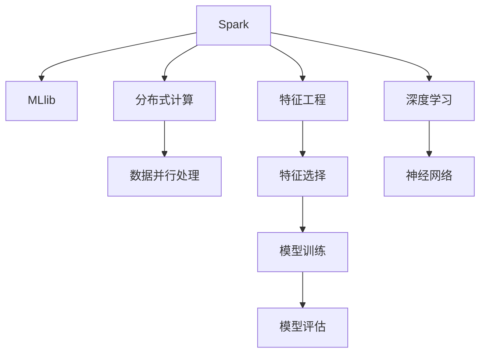

                 

# Spark MLlib原理与代码实例讲解

## 1. 背景介绍

### 1.1 问题由来

随着大数据时代的来临，数据科学和机器学习成为了推动社会进步和创新发展的核心动力。Spark作为目前主流的分布式计算框架，其提供的MLlib库极大地简化了机器学习任务的开发和部署。

MLlib（Machine Learning Library）是Apache Spark的机器学习库，提供了丰富的算法实现和工具，包括线性回归、分类、聚类、协同过滤、分布式矩阵计算、深度学习等。MLlib的使用降低了机器学习任务的技术门槛，使得开发者可以更快速地构建和训练复杂模型。

### 1.2 问题核心关键点

MLlib的核心目标是提供高效、易用的机器学习工具，支持从数据预处理、特征工程到模型训练和评估的完整流程。其主要特点包括：

- **高效性**：MLlib使用Spark的分布式计算能力，能够在大规模数据集上进行并行处理和优化计算。
- **易用性**：提供了高层次的API，使得模型开发和部署更加简单快捷。
- **可扩展性**：支持多节点分布式训练，能够适应大规模数据和计算资源的扩展需求。
- **模块化**：包含丰富的算法和工具，覆盖了各种机器学习任务，适用于不同应用场景。
- **支持深度学习**：提供了分布式深度学习框架Spark DL，支持大规模深度神经网络的训练和优化。

MLlib的出现极大地推动了大数据时代机器学习技术的应用和发展，成为数据科学领域不可或缺的工具之一。

## 2. 核心概念与联系

### 2.1 核心概念概述

为更好地理解MLlib的原理和实现，本节将介绍几个密切相关的核心概念：

- **Spark**：Spark是一个快速的通用分布式计算系统，支持多种编程语言（如Java、Scala、Python），用于大规模数据处理和分析。
- **MLlib**：Spark的机器学习库，提供了丰富的算法和工具，覆盖了从数据预处理、特征工程到模型训练和评估的完整流程。
- **分布式计算**：利用多台计算资源的并行计算能力，处理大规模数据集，提升计算效率和处理速度。
- **特征工程**：通过数据预处理和特征选择，提取和构建有助于模型训练的特征，提升模型的泛化能力和性能。
- **模型评估**：使用交叉验证、ROC曲线、准确率等指标，评估模型的预测能力和泛化能力。
- **深度学习**：基于神经网络模型的机器学习算法，能够自动学习和提取特征，适用于大规模数据的处理和复杂模式的识别。

这些核心概念之间的逻辑关系可以通过以下Mermaid流程图来展示：



这个流程图展示了一系列的机器学习任务流程，从数据处理到特征工程、模型训练和评估，再到深度学习的高级应用，形成一个完整的机器学习应用框架。

## 3. 核心算法原理 & 具体操作步骤
### 3.1 算法原理概述

MLlib的核心思想是利用Spark的分布式计算能力，高效处理大规模数据集，并使用丰富的机器学习算法和工具，简化模型开发和部署的过程。其核心算法原理包括以下几个方面：

- **数据分布式存储和处理**：Spark的分布式存储系统RDD（Resilient Distributed Datasets）可以高效处理大规模数据，支持并行计算和数据分片。
- **特征工程和选择**：通过一系列的预处理和特征选择方法，如归一化、降维、特征提取等，提取有用的特征，提升模型性能。
- **模型训练和优化**：使用Spark的机器学习库MLlib，提供包括线性回归、逻辑回归、支持向量机、随机森林等丰富的算法，支持从数据预处理到模型训练和评估的完整流程。
- **深度学习框架Spark DL**：MLlib内置深度学习框架Spark DL，支持大规模深度神经网络的训练和优化，适用于复杂模式的识别和预测。

MLlib通过上述原理，提供了一个高效、易用的机器学习开发平台，支持大规模数据处理和模型训练。

### 3.2 算法步骤详解

MLlib的使用流程一般包括以下几个关键步骤：

**Step 1: 数据准备**
- 收集数据集并进行初步清洗，如去除重复值、处理缺失值等。
- 将数据集分为训练集和测试集，用于模型训练和评估。
- 选择合适的特征并进行预处理，如归一化、标准化、特征选择等。

**Step 2: 特征工程**
- 使用MLlib提供的特征工程工具，如`PCA`降维、`PolynomialExpansion`生成多项式特征等，提取有用的特征。
- 选择合适的特征组合方式，如`FeatureHashing`、`ChiSquareSelector`等，进行特征选择和构造。

**Step 3: 模型训练**
- 选择合适的算法，如`LinearRegression`、`LogisticRegression`、`RandomForest`等，进行模型训练。
- 使用MLlib提供的优化器，如`SGD`、`GradientDescent`等，进行模型优化和超参数调整。
- 使用交叉验证等方法，评估模型性能和泛化能力。

**Step 4: 模型评估**
- 使用MLlib提供的评估工具，如`RegressionMetrics`、`ClassificationMetrics`等，评估模型预测能力和泛化能力。
- 根据评估结果调整模型参数，进行多次迭代训练，提升模型性能。

**Step 5: 模型应用**
- 将训练好的模型部署到实际应用中，进行预测和推理。
- 使用MLlib提供的工具，如`ModelSave`、`ModelLoad`等，保存和加载模型，便于后续使用。

以上步骤是MLlib的基本使用流程，开发者可以根据具体任务和数据特点，灵活选择和组合不同的工具和算法。

### 3.3 算法优缺点

MLlib作为Spark的机器学习库，具有以下优点：

- **高效性**：利用Spark的分布式计算能力，能够在大规模数据集上进行并行处理和优化计算。
- **易用性**：提供高层次的API，使得模型开发和部署更加简单快捷。
- **可扩展性**：支持多节点分布式训练，能够适应大规模数据和计算资源的扩展需求。
- **丰富算法**：包含丰富的算法和工具，覆盖了各种机器学习任务，适用于不同应用场景。
- **支持深度学习**：内置深度学习框架Spark DL，支持大规模深度神经网络的训练和优化。

同时，MLlib也存在一些局限性：

- **学习成本**：对于初学者而言，理解Spark和MLlib的分布式计算和机器学习算法需要一定时间。
- **资源消耗**：大规模数据集的处理和模型训练需要较高的计算资源，可能对硬件配置提出较高要求。
- **算法选择**：对于某些特定任务，MLlib提供的算法可能不够灵活，需要开发自定义算法。

尽管存在这些局限性，但MLlib作为机器学习领域的杰出工具，以其高效、易用和丰富的算法库，成为了大数据时代机器学习应用的重要选择。

### 3.4 算法应用领域

MLlib在多个领域得到了广泛应用，以下是几个典型的应用场景：

- **金融风险评估**：利用MLlib的线性回归和随机森林算法，评估贷款违约风险，预测信用评分，提升风险控制能力。
- **电商推荐系统**：使用协同过滤和基于矩阵分解的算法，分析用户行为数据，推荐相关商品，提升用户满意度和购买转化率。
- **医疗诊断预测**：采用支持向量机和深度学习算法，分析病历数据，预测疾病风险，辅助医生诊断和治疗。
- **社交网络分析**：利用聚类和图算法，分析社交网络关系，识别关键节点和社群，提升社交网络应用的价值。
- **自然语言处理**：通过文本处理和特征工程，提取文本特征，训练分类和回归模型，应用于情感分析、文本分类等任务。

## 4. 数学模型和公式 & 详细讲解  
### 4.1 数学模型构建

在MLlib中，常见的机器学习模型包括线性回归、逻辑回归、支持向量机、随机森林等。这里以线性回归模型为例，详细讲解其数学模型和公式推导过程。

假设我们有一个训练集 $D=\{(x_i, y_i)\}_{i=1}^N$，其中 $x_i \in \mathbb{R}^p$ 为输入特征，$y_i \in \mathbb{R}$ 为输出标签。线性回归的数学模型为：

$$
y = \theta^T x + b
$$

其中 $\theta \in \mathbb{R}^p$ 为模型参数，$b \in \mathbb{R}$ 为截距。目标是最小化损失函数：

$$
\mathcal{L}(\theta) = \frac{1}{2N} \sum_{i=1}^N (y_i - \theta^T x_i - b)^2
$$

求解上述最小化问题，得到参数 $\theta$ 的值为：

$$
\theta = (X^T X)^{-1} X^T y
$$

其中 $X = [x_1, x_2, ..., x_N]^T \in \mathbb{R}^{N \times p}$ 为特征矩阵，$y = [y_1, y_2, ..., y_N]^T \in \mathbb{R}^N$ 为标签向量。

### 4.2 公式推导过程

以线性回归模型为例，推导其优化公式。

目标是最小化损失函数：

$$
\mathcal{L}(\theta) = \frac{1}{2N} \sum_{i=1}^N (y_i - \theta^T x_i - b)^2
$$

对 $\theta$ 和 $b$ 求偏导数，得到：

$$
\frac{\partial \mathcal{L}(\theta)}{\partial \theta} = \frac{1}{N} X^T (X \theta - y)
$$
$$
\frac{\partial \mathcal{L}(\theta)}{\partial b} = \frac{1}{N} \sum_{i=1}^N (y_i - \theta^T x_i - b)
$$

令梯度为0，求解上述方程组，得到：

$$
\theta = (X^T X)^{-1} X^T y
$$
$$
b = \bar{y} - \theta^T \bar{x}
$$

其中 $\bar{y} = \frac{1}{N} \sum_{i=1}^N y_i$，$\bar{x} = \frac{1}{N} \sum_{i=1}^N x_i$。

### 4.3 案例分析与讲解

在实际应用中，我们可以使用MLlib提供的`LinearRegressionWithSGD`类进行线性回归模型的训练和优化。以下是一个简单的代码示例：

```python
from pyspark.ml.regression import LinearRegressionWithSGD
from pyspark.ml.linalg import Vectors

# 构建特征向量
data = [(1.0, 2.0, 3.0), (4.0, 5.0, 6.0), (7.0, 8.0, 9.0), (10.0, 11.0, 12.0)]
features = [Vectors.dense([x, y, z]) for x, y, z in data]

# 构建标签向量
labels = [1.0, 2.0, 3.0, 4.0]

# 创建模型实例
model = LinearRegressionWithSGD.train(features, labels)

# 预测新样本
new_samples = [Vectors.dense([13.0, 14.0, 15.0]), Vectors.dense([16.0, 17.0, 18.0])]
predictions = [model.predict(sample) for sample in new_samples]
```

在上述代码中，我们首先构建了特征向量 `features` 和标签向量 `labels`，然后使用 `LinearRegressionWithSGD` 类进行模型训练，得到线性回归模型 `model`。最后使用模型进行新样本的预测。

## 5. 项目实践：代码实例和详细解释说明
### 5.1 开发环境搭建

在进行MLlib项目实践前，我们需要准备好开发环境。以下是使用Python进行PySpark开发的配置流程：

1. 安装Apache Spark：从官网下载并安装Spark，配置Spark环境变量。
2. 安装PySpark：在Spark安装目录下的Python目录中，安装PySpark库。
3. 创建Spark应用：在PySpark环境中，编写Spark程序，并使用`spark-submit`提交到Spark集群运行。

### 5.2 源代码详细实现

下面我们以线性回归模型为例，给出使用PySpark进行MLlib开发的完整代码实现。

首先，定义数据集和模型训练参数：

```python
from pyspark.sql import SparkSession
from pyspark.ml.linalg import Vectors
from pyspark.ml.regression import LinearRegressionWithSGD

# 创建SparkSession
spark = SparkSession.builder.appName("LinearRegression").getOrCreate()

# 定义数据集
data = [(1.0, 2.0, 3.0), (4.0, 5.0, 6.0), (7.0, 8.0, 9.0), (10.0, 11.0, 12.0)]
features = [Vectors.dense([x, y, z]) for x, y, z in data]
labels = [1.0, 2.0, 3.0, 4.0]

# 创建DataFrame
df = spark.createDataFrame(features, ["x", "y", "z"])
label_df = spark.createDataFrame(labels, ["label"])

# 拼接数据集
combined_df = df.join(label_df, ["x", "y", "z"], "left_outer")

# 分割数据集
split = combined_df.randomSplit([0.8, 0.2])
train_df = split[0]
test_df = split[1]
```

然后，定义模型训练过程：

```python
# 创建模型实例
model = LinearRegressionWithSGD.train(train_df.select("x", "y", "z"), "label")

# 预测新样本
new_samples = [Vectors.dense([13.0, 14.0, 15.0]), Vectors.dense([16.0, 17.0, 18.0])]
predictions = [model.predict(sample) for sample in new_samples]

# 输出预测结果
print(predictions)
```

在上述代码中，我们首先创建了SparkSession，然后定义了数据集和模型训练参数。接着，使用`LinearRegressionWithSGD`类进行模型训练，得到线性回归模型 `model`。最后使用模型进行新样本的预测，并输出预测结果。

### 5.3 代码解读与分析

让我们再详细解读一下关键代码的实现细节：

**数据集构建**：
- 我们使用Python列表构建了特征向量 `features` 和标签向量 `labels`。
- 然后使用`Vectors.dense`方法将列表转换为Spark向量，并创建DataFrame对象 `df`。
- 通过`join`方法将特征和标签数据拼接，得到完整的数据集 `combined_df`。
- 使用`randomSplit`方法将数据集随机分为训练集和测试集。

**模型训练**：
- 使用`LinearRegressionWithSGD`类进行模型训练，得到线性回归模型 `model`。
- 使用`predict`方法对新样本进行预测，得到预测结果。

在实际应用中，我们还可以使用MLlib提供的其他算法进行模型训练，如随机森林、支持向量机等，具体实现方式类似。

## 6. 实际应用场景
### 6.1 金融风控系统

在金融领域，风险评估和信用评分是重要的应用场景。利用MLlib提供的线性回归和随机森林算法，可以构建高效的风险评估模型，预测贷款违约概率和信用评分，提升风险控制能力。

具体而言，可以收集贷款申请数据、信用记录、还款记录等信息，构建特征向量，使用MLlib进行模型训练，得到预测模型。模型可以应用于贷款审批、信用评分、风险预警等环节，降低坏账率和信用风险，提升金融机构的收益和稳定性。

### 6.2 电商推荐系统

电商推荐系统是提升用户体验和提高销售转化的关键。利用MLlib提供的协同过滤和基于矩阵分解的算法，可以构建推荐模型，推荐相关商品，提升用户满意度和购买转化率。

具体而言，可以收集用户行为数据、商品信息、交易记录等信息，构建用户-商品矩阵。然后使用MLlib提供的算法进行特征工程和模型训练，得到推荐模型。模型可以应用于实时推荐、搜索推荐、个性化推荐等环节，提升电商平台的销售和用户体验。

### 6.3 医疗诊断预测

在医疗领域，诊断预测是提高医疗水平和降低误诊率的重要手段。利用MLlib提供的支持向量机和深度学习算法，可以构建高效的医疗诊断模型，预测疾病风险，辅助医生诊断和治疗。

具体而言，可以收集病历数据、实验室检测数据、影像数据等信息，构建特征向量。然后使用MLlib进行模型训练，得到诊断模型。模型可以应用于疾病预测、治疗方案推荐、患者风险评估等环节，提升医疗服务的质量和效率。

### 6.4 未来应用展望

随着MLlib和Spark的不断发展，其在各个领域的应用前景将更加广阔。未来，MLlib有望在更多领域得到应用，如智能制造、智慧城市、智能交通等，为各行各业带来新的发展机遇。

在智能制造领域，MLlib可以用于生产调度优化、设备维护预测、质量控制等环节，提升生产效率和产品质量。

在智慧城市领域，MLlib可以用于交通流量预测、环境监测、城市管理等环节，提升城市管理和治理水平。

在智能交通领域，MLlib可以用于智能驾驶、交通流量预测、安全预警等环节，提升交通安全和效率。

## 7. 工具和资源推荐
### 7.1 学习资源推荐

为了帮助开发者系统掌握MLlib的原理和实践技巧，这里推荐一些优质的学习资源：

1. **《Spark MLlib快速入门》**：详细讲解了MLlib的基本概念和使用方法，是初学者入门的好资源。
2. **《Apache Spark实战》**：介绍了Spark和MLlib的实战应用，涵盖数据处理、机器学习、大数据分析等多个领域。
3. **《Apache Spark权威指南》**：详细讲解了Spark和MLlib的内部原理和实现机制，适合中高级开发者学习。
4. **Apache Spark官方文档**：提供全面的Spark和MLlib文档，包括API参考、使用指南、案例研究等。
5. **Kaggle机器学习竞赛**：通过实际数据集和模型评估，帮助开发者锻炼机器学习技能。

通过对这些资源的学习实践，相信你一定能够快速掌握MLlib的精髓，并用于解决实际的机器学习问题。

### 7.2 开发工具推荐

高效的开发离不开优秀的工具支持。以下是几款用于MLlib开发的常用工具：

1. **Jupyter Notebook**：开源的交互式编程工具，支持Python、Scala等多种编程语言，适合数据科学和机器学习开发。
2. **PyCharm**：专业的Python IDE，提供丰富的开发工具和库支持，适合PySpark开发。
3. **Eclipse Spark IDE**：Apache Spark的官方IDE，支持Spark和MLlib的开发和调试。
4. **DataRobot**：自动化的机器学习平台，提供丰富的算法和工具，支持模型训练、特征工程等。

合理利用这些工具，可以显著提升MLlib开发的效率，加快创新迭代的步伐。

### 7.3 相关论文推荐

MLlib作为Spark的核心组件，其发展源于学界的持续研究。以下是几篇奠基性的相关论文，推荐阅读：

1. **《Apache Spark: Cluster Computing with Fault Tolerance》**：介绍Spark的基本概念和实现机制。
2. **《The Spark MLib Machine Learning Library》**：介绍Spark MLib的基本概念和功能，是MLlib的官方文档。
3. **《Parameter Tuning for Distributed Machine Learning with Spark》**：探讨Spark MLib中的参数调优方法，适合中高级开发者阅读。
4. **《Data-parallel Machine Learning for Big Data Processing》**：介绍Spark MLib在大数据处理中的应用，适合实际项目开发者阅读。

这些论文代表了大数据时代机器学习算法的发展脉络。通过学习这些前沿成果，可以帮助研究者把握学科前进方向，激发更多的创新灵感。

## 8. 总结：未来发展趋势与挑战

### 8.1 总结

本文对Spark MLlib的原理与代码实例进行了全面系统的介绍。首先阐述了MLlib在大数据时代机器学习中的应用背景和意义，明确了其高效、易用和丰富的算法库的特点。其次，从原理到实践，详细讲解了MLlib的数学模型和核心算法，给出了模型训练和优化的完整代码实例。同时，本文还广泛探讨了MLlib在金融风控、电商推荐、医疗诊断等多个领域的应用前景，展示了其广泛的应用潜力。最后，本文精选了MLlib的学习资源和开发工具，力求为读者提供全方位的技术指引。

通过本文的系统梳理，可以看到，Spark MLlib作为机器学习领域的杰出工具，以其高效、易用和丰富的算法库，成为了大数据时代机器学习应用的重要选择。未来，伴随Spark和MLlib的不断发展，其在各个领域的应用前景将更加广阔，为各行各业带来新的发展机遇。

### 8.2 未来发展趋势

展望未来，Spark MLlib的发展趋势将呈现以下几个方向：

1. **算法多样性**：MLlib将引入更多高效的算法和工具，覆盖更多机器学习任务，适用于不同应用场景。
2. **深度学习支持**：MLlib内置深度学习框架Spark DL，支持大规模深度神经网络的训练和优化，适用于复杂模式的识别和预测。
3. **自动化机器学习**：利用自动化机器学习技术，自动进行特征选择、模型调优等操作，降低开发门槛，提升模型性能。
4. **模型压缩和加速**：使用模型压缩、量化加速等技术，提升模型推理效率，降低计算资源消耗。
5. **分布式优化**：利用分布式计算和优化技术，提升模型的训练和推理效率，支持大规模数据处理和分析。
6. **边缘计算支持**：支持在边缘设备上进行本地化机器学习任务，降低数据传输成本，提升计算效率。

以上趋势凸显了Spark MLlib在大数据时代机器学习应用的广泛前景。这些方向的探索发展，必将进一步提升机器学习算法的性能和应用范围，为各行各业带来新的发展机遇。

### 8.3 面临的挑战

尽管Spark MLlib已经取得了显著的进展，但在迈向更加智能化、普适化应用的过程中，其仍面临诸多挑战：

1. **学习成本**：对于初学者而言，理解Spark和MLlib的分布式计算和机器学习算法需要一定时间。
2. **资源消耗**：大规模数据集的处理和模型训练需要较高的计算资源，可能对硬件配置提出较高要求。
3. **算法选择**：对于某些特定任务，MLlib提供的算法可能不够灵活，需要开发自定义算法。
4. **模型解释性**：MLlib的某些算法缺乏可解释性，对于高风险应用，算法的可解释性和可审计性尤为重要。
5. **模型鲁棒性**：MLlib的某些模型在面对域外数据时，泛化性能往往大打折扣。对于测试样本的微小扰动，模型的预测也容易发生波动。
6. **数据安全**：MLlib的某些算法需要访问敏感数据，可能面临数据安全和隐私问题。

这些挑战凸显了Spark MLlib在实际应用中需要进一步优化和改进的方向。

### 8.4 研究展望

面对Spark MLlib所面临的种种挑战，未来的研究需要在以下几个方面寻求新的突破：

1. **自动化机器学习**：利用自动化机器学习技术，自动进行特征选择、模型调优等操作，降低开发门槛，提升模型性能。
2. **模型压缩和加速**：使用模型压缩、量化加速等技术，提升模型推理效率，降低计算资源消耗。
3. **分布式优化**：利用分布式计算和优化技术，提升模型的训练和推理效率，支持大规模数据处理和分析。
4. **模型解释性**：引入可解释性算法和工具，提升模型的可解释性和可审计性。
5. **分布式训练**：利用分布式计算和优化技术，提升模型的训练效率，支持大规模数据处理和分析。
6. **边缘计算支持**：支持在边缘设备上进行本地化机器学习任务，降低数据传输成本，提升计算效率。

这些研究方向的探索，必将引领Spark MLlib的进一步发展，为各行各业带来新的发展机遇。未来，Spark MLlib有望在更多领域得到应用，为各行各业带来新的发展机遇。

## 9. 附录：常见问题与解答

**Q1：MLlib是否支持分布式计算？**

A: 是的，MLlib是Spark的核心组件之一，支持分布式计算。MLlib中的算法和工具都基于Spark的分布式计算能力，可以高效处理大规模数据集。

**Q2：如何选择合适的MLlib算法？**

A: 在实际应用中，应根据具体任务和数据特点，选择合适的MLlib算法。例如，对于线性回归任务，可以选择`LinearRegressionWithSGD`类进行模型训练。对于分类任务，可以选择`RandomForest`类进行模型训练。

**Q3：MLlib在训练模型时，如何选择合适的超参数？**

A: 在MLlib中，可以使用交叉验证等方法，选择合适的超参数。例如，在`RandomForest`类中，可以使用`setMaxDepth`方法设置最大树深度，使用`setNumTrees`方法设置树的数量等。

**Q4：如何使用MLlib进行数据预处理？**

A: 在MLlib中，可以使用`VectorAssembler`类进行特征组合和选择，使用`StandardScaler`类进行数据归一化，使用`PolynomialExpansion`类生成多项式特征等。

**Q5：如何在MLlib中保存和加载模型？**

A: 在MLlib中，可以使用`ModelSave`和`ModelLoad`方法保存和加载模型，便于后续使用。例如，可以使用`model.save(modelPath)`保存模型，使用`model.load(modelPath)`加载模型。

通过对这些问题的解答，相信你对Spark MLlib有了更加深入的了解。在未来学习和应用MLlib的过程中，这些知识将为你提供重要的参考和指导。

---

作者：禅与计算机程序设计艺术 / Zen and the Art of Computer Programming

