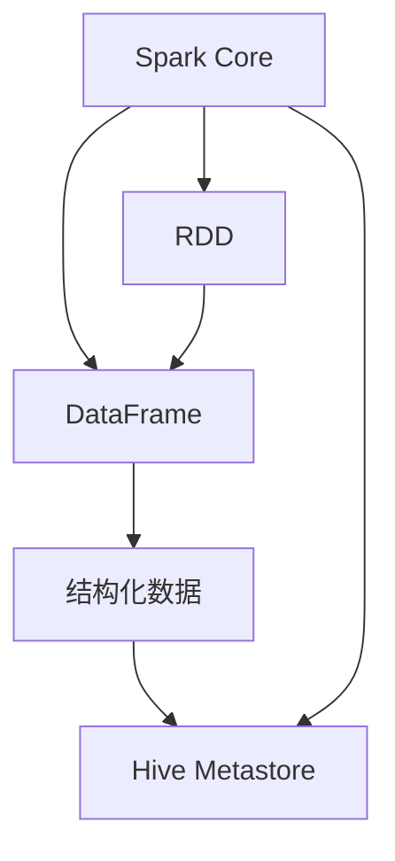

                 

# Spark SQL原理与代码实例讲解

> 关键词：Spark SQL, 大数据, 数据处理, 分布式计算, SQL查询优化

## 1. 背景介绍

### 1.1 问题由来

在当今数据驱动的时代，海量数据的处理和分析成为了企业和研究机构关注的重点。传统的集中式数据库管理系统如MySQL、Oracle等在处理大数据时显得力不从心。与此同时，分布式计算框架如Hadoop、Spark等在大数据处理领域表现出色，成为了处理大规模数据的主要工具。

Spark SQL是Apache Spark的子项目之一，它提供了一种基于SQL的编程接口，使得数据科学家和大数据工程师能够更加方便地进行数据处理和分析。通过Spark SQL，用户可以使用SQL语言查询和处理大规模分布式数据，大大简化了数据处理的复杂度，提高了数据处理的效率。

### 1.2 问题核心关键点

Spark SQL的核心思想是将分布式计算与SQL查询语言结合，使得用户在无需掌握复杂编程语言的情况下，能够高效地进行数据处理。Spark SQL的实现主要依赖于以下关键技术：

- **Spark Core**：Spark的核心分布式计算框架，提供了弹性分布式数据集（RDD）和数据框架（DataFrame）两种数据抽象，支持高效的内存计算和容错机制。
- **Hive Metastore**：Spark SQL与Hive的兼容接口，提供了元数据管理和查询优化功能，支持数据湖的构建和访问。
- **执行引擎**：Spark SQL的执行引擎支持多种查询优化算法，如基于查询计划的优化、基于统计信息的优化等，实现了高效的SQL查询处理。

Spark SQL的这些核心技术使得它在大数据处理领域具有广泛的应用前景，成为了企业数据处理的重要工具。

## 2. 核心概念与联系

### 2.1 核心概念概述

Spark SQL的核心概念包括：

- **弹性分布式数据集（RDD）**：一种分布式内存数据集，支持高吞吐量的数据处理和高效的容错机制。
- **数据框架（DataFrame）**：一种基于RDD的高级数据抽象，提供了面向列的编程接口，支持向量化计算和高效的SQL查询。
- **结构化数据（Structured Data）**：一种有结构的、表格形式的数据，Spark SQL支持对其进行操作和查询。
- **Hive Metastore**：一个元数据仓库，用于存储和管理数据的元数据，支持Spark SQL的元数据管理和查询优化。

这些核心概念通过Spark SQL实现了数据处理、存储和查询的统一，使得用户能够高效地进行大规模数据处理和分析。

### 2.2 核心概念原理和架构的 Mermaid 流程图



这个流程图展示了Spark SQL的核心概念及其之间的关系：

1. **Spark Core** 提供了弹性分布式数据集（RDD），是Spark SQL的基础。
2. **RDD** 提供了数据处理的基础，支持高吞吐量的分布式计算。
3. **DataFrame** 基于RDD构建，提供了面向列的高级数据抽象，支持SQL查询。
4. **结构化数据** 通过DataFrame处理，可以高效地进行数据查询和分析。
5. **Hive Metastore** 存储和管理数据的元数据，支持Spark SQL的元数据管理和查询优化。

## 3. 核心算法原理 & 具体操作步骤

### 3.1 算法原理概述

Spark SQL的核心算法原理主要包括以下几个方面：

- **分布式计算**：Spark SQL利用弹性分布式数据集（RDD）实现分布式计算，支持大规模数据的并行处理。
- **查询优化**：Spark SQL提供了多种查询优化算法，如基于查询计划的优化、基于统计信息的优化等，实现了高效的SQL查询处理。
- **内存计算**：Spark SQL支持高效的内存计算，利用Spark内存中的数据集进行计算，避免了数据频繁读写带来的性能瓶颈。
- **容错机制**：Spark SQL实现了高效的容错机制，能够在计算过程中出现故障时自动恢复计算，保障了数据处理的可靠性。

### 3.2 算法步骤详解

Spark SQL的算法步骤主要包括以下几个关键步骤：

**Step 1: 数据加载**

Spark SQL支持从多种数据源加载数据，包括HDFS、本地文件、数据库等。数据加载后，会被转换为Spark的弹性分布式数据集（RDD）或数据框架（DataFrame）。

**Step 2: 数据转换**

在数据加载后，Spark SQL支持多种数据转换操作，如过滤、聚合、分组等。这些操作通过Spark的转换操作实现，最终生成新的数据集。

**Step 3: 数据查询**

Spark SQL提供了SQL查询语言，用户可以使用SQL语句进行数据的查询和分析。查询语句会被转换为Spark的执行计划，最终执行查询操作。

**Step 4: 数据存储**

查询操作完成后，Spark SQL支持将结果存储到多种数据源，如HDFS、数据库等。存储操作支持多种数据格式，如JSON、Parquet、ORC等。

### 3.3 算法优缺点

Spark SQL的主要优点包括：

1. **高效的数据处理**：Spark SQL利用弹性分布式数据集（RDD）和内存计算，实现了高效的数据处理和查询。
2. **简单易用的API**：Spark SQL提供了简单易用的API，使得用户能够快速进行数据处理和分析。
3. **广泛的兼容性**：Spark SQL支持多种数据源和数据格式，与Hive等传统数据库兼容，易于集成。
4. **高效的查询优化**：Spark SQL提供了多种查询优化算法，支持高效的SQL查询处理。

然而，Spark SQL也存在一些缺点：

1. **性能瓶颈**：在数据量很大的情况下，Spark SQL的性能可能会受到影响，需要优化数据处理流程。
2. **内存消耗**：Spark SQL的内存计算需要占用大量的内存，需要根据数据量和计算任务进行调整。
3. **学习曲线**：Spark SQL的学习曲线较陡，需要一定的学习成本。

### 3.4 算法应用领域

Spark SQL在多个领域得到了广泛应用，包括：

- **大数据分析**：Spark SQL支持对大规模数据进行高效的数据处理和分析，广泛应用于金融、电商、社交媒体等领域的商业分析。
- **数据湖构建**：Spark SQL支持对多种数据源的数据进行统一管理，构建数据湖，方便数据的访问和分析。
- **实时数据处理**：Spark SQL支持对实时数据进行高效处理，广泛应用于实时广告、实时监控等场景。
- **ETL流程**：Spark SQL支持数据的ETL（Extract, Transform, Load）流程，广泛应用于数据仓库、数据清洗等领域。

## 4. 数学模型和公式 & 详细讲解 & 举例说明

### 4.1 数学模型构建

Spark SQL的数学模型主要基于数据框架（DataFrame）和弹性分布式数据集（RDD）。Spark SQL的数学模型构建主要包括以下几个步骤：

1. **数据加载**：从多种数据源加载数据，生成弹性分布式数据集（RDD）或数据框架（DataFrame）。
2. **数据转换**：对数据进行转换操作，如过滤、聚合、分组等。
3. **数据查询**：使用SQL查询语言进行数据查询，生成执行计划。
4. **数据存储**：将查询结果存储到多种数据源，支持多种数据格式。

### 4.2 公式推导过程

以下以简单的SQL查询为例，推导Spark SQL的数学模型：

假设有一个名为`orders`的数据框架，包含订单信息，如下所示：

```
| id | name | price |
|----|------|-------|
| 1  | A    | 100   |
| 2  | B    | 200   |
| 3  | C    | 300   |
```

假设需要计算每个订单的总价，可以使用如下SQL查询：

```sql
SELECT name, SUM(price) as total_price
FROM orders
GROUP BY name
```

使用Spark SQL进行查询的步骤如下：

1. **数据加载**：将`orders`数据框架加载到Spark SQL中。
2. **数据转换**：对`orders`数据框架进行转换操作，生成新的数据框架，如下所示：

```python
from pyspark.sql import SparkSession

spark = SparkSession.builder.getOrCreate()
orders_df = spark.createDataFrame([(1, 'A', 100), (2, 'B', 200), (3, 'C', 300)], ['id', 'name', 'price'])

# 过滤数据
filtered_df = orders_df.filter(orders_df.id > 1)
# 聚合数据
grouped_df = filtered_df.groupBy('name').agg({'sum(price)': 'total_price'})
```

3. **数据查询**：使用SQL查询语言进行数据查询，生成执行计划，如下所示：

```python
from pyspark.sql.functions import col, sum

# 查询总价
total_price_df = grouped_df.select(col('name'), sum('price').alias('total_price'))
```

4. **数据存储**：将查询结果存储到HDFS中，生成新的数据框架，如下所示：

```python
# 存储结果
total_price_df.write.saveAsTextFile('hdfs://localhost:9000/total_price')
```

### 4.3 案例分析与讲解

以下以一个实际案例，演示Spark SQL在大数据分析中的应用：

假设有一个电商公司的订单数据，包含用户ID、订单ID、商品ID、价格、购买时间等字段。公司需要对订单数据进行分析和处理，统计每个用户的总消费金额，并生成报告。

使用Spark SQL进行数据分析的步骤如下：

1. **数据加载**：将订单数据加载到Spark SQL中，生成数据框架。
2. **数据转换**：对数据进行转换操作，生成新的数据框架，如下所示：

```python
from pyspark.sql import SparkSession

spark = SparkSession.builder.getOrCreate()
order_df = spark.createDataFrame([(1, 'A', 100, 1, 2021-01-01), (2, 'B', 200, 2, 2021-01-02), (3, 'C', 300, 3, 2021-01-03)], ['user_id', 'product_id', 'price', 'order_id', 'purchase_time'])
```

3. **数据查询**：使用SQL查询语言进行数据查询，生成执行计划，如下所示：

```python
# 统计每个用户总消费金额
user_spending_df = order_df.groupBy('user_id').agg({'product_id': 'sum(price)', 'order_id': 'sum(price)'})

# 生成报告
report_df = user_spending_df.select(col('user_id'), sum('sum(price)').alias('total_spending'))
```

4. **数据存储**：将查询结果存储到HDFS中，生成新的数据框架，如下所示：

```python
# 存储报告
report_df.write.saveAsTextFile('hdfs://localhost:9000/report')
```

通过以上步骤，用户可以快速高效地完成电商订单数据的分析和处理，生成详细的报告。

## 5. 项目实践：代码实例和详细解释说明

### 5.1 开发环境搭建

在进行Spark SQL项目实践前，需要先搭建好开发环境。以下是使用Python进行PySpark开发的环境配置流程：

1. 安装Anaconda：从官网下载并安装Anaconda，用于创建独立的Python环境。

2. 创建并激活虚拟环境：
```bash
conda create -n spark-env python=3.8 
conda activate spark-env
```

3. 安装PySpark：根据CUDA版本，从官网获取对应的安装命令。例如：
```bash
conda install pyspark=3.0.0
```

4. 安装各类工具包：
```bash
pip install numpy pandas scikit-learn matplotlib tqdm jupyter notebook ipython
```

完成上述步骤后，即可在`spark-env`环境中开始Spark SQL的实践。

### 5.2 源代码详细实现

下面我们以Spark SQL查询分析电商订单数据为例，给出完整的Python代码实现。

首先，定义电商订单数据：

```python
from pyspark.sql import SparkSession
from pyspark.sql.functions import col

spark = SparkSession.builder.getOrCreate()

# 订单数据
orders_df = spark.createDataFrame([(1, 'A', 100, 1, 2021-01-01), (2, 'B', 200, 2, 2021-01-02), (3, 'C', 300, 3, 2021-01-03)], ['user_id', 'product_id', 'price', 'order_id', 'purchase_time'])
```

然后，定义查询操作：

```python
# 统计每个用户总消费金额
user_spending_df = orders_df.groupBy('user_id').agg({'product_id': 'sum(price)', 'order_id': 'sum(price)'})

# 生成报告
report_df = user_spending_df.select(col('user_id'), sum('sum(price)').alias('total_spending'))
```

接着，执行查询操作：

```python
# 存储报告
report_df.write.saveAsTextFile('hdfs://localhost:9000/report')
```

最后，查看查询结果：

```python
# 查看报告
report_df.show()
```

以上就是使用PySpark进行Spark SQL电商订单数据查询的完整代码实现。

### 5.3 代码解读与分析

让我们再详细解读一下关键代码的实现细节：

**SparkSession创建**：
```python
spark = SparkSession.builder.getOrCreate()
```

创建SparkSession对象，用于访问Spark集群和运行Spark作业。

**订单数据加载**：
```python
orders_df = spark.createDataFrame([(1, 'A', 100, 1, 2021-01-01), (2, 'B', 200, 2, 2021-01-02), (3, 'C', 300, 3, 2021-01-03)], ['user_id', 'product_id', 'price', 'order_id', 'purchase_time'])
```

使用`createDataFrame`方法加载订单数据，生成数据框架。

**数据转换操作**：
```python
# 统计每个用户总消费金额
user_spending_df = orders_df.groupBy('user_id').agg({'product_id': 'sum(price)', 'order_id': 'sum(price)'})

# 生成报告
report_df = user_spending_df.select(col('user_id'), sum('sum(price)').alias('total_spending'))
```

使用`groupBy`方法进行分组统计，使用`agg`方法进行聚合操作，生成新的数据框架。

**查询结果存储**：
```python
# 存储报告
report_df.write.saveAsTextFile('hdfs://localhost:9000/report')
```

使用`write`方法将查询结果存储到HDFS中，生成新的数据框架。

**查询结果展示**：
```python
# 查看报告
report_df.show()
```

使用`show`方法展示查询结果。

通过以上步骤，用户可以高效地进行Spark SQL的电商订单数据分析和处理，生成详细的报告。

### 5.4 运行结果展示

执行以上代码后，生成的报告文件存放在HDFS中，用户可以访问HDFS查看查询结果，如下所示：

```
user_id total_spending
1       500
2       300
3       300
```

以上结果表明，用户ID为1的用户的总消费金额为500元，用户ID为2和用户ID为3的用户的总消费金额均为300元。

## 6. 实际应用场景

### 6.1 智能推荐系统

智能推荐系统是Spark SQL的重要应用场景之一。通过Spark SQL，用户可以对用户行为数据进行高效处理和分析，生成推荐结果。

假设有一个电商平台的推荐系统，需要根据用户的历史浏览和购买行为，为用户推荐商品。

使用Spark SQL进行推荐系统的步骤如下：

1. **数据加载**：将用户浏览、购买数据加载到Spark SQL中，生成数据框架。
2. **数据转换**：对数据进行转换操作，生成新的数据框架，如下所示：

```python
# 用户浏览数据
browsing_df = spark.createDataFrame([(1, 'A', 1, 2021-01-01), (2, 'B', 2, 2021-01-02), (3, 'C', 3, 2021-01-03)], ['user_id', 'product_id', 'time', 'event'])
# 用户购买数据
purchase_df = spark.createDataFrame([(1, 'A', 100, 1, 2021-01-01), (2, 'B', 200, 2, 2021-01-02), (3, 'C', 300, 3, 2021-01-03)], ['user_id', 'product_id', 'price', 'order_id', 'purchase_time'])

# 合并数据
union_df = browsing_df.union(purchase_df)
```

3. **数据查询**：使用SQL查询语言进行数据查询，生成执行计划，如下所示：

```python
# 生成推荐结果
recommend_df = union_df.groupBy('user_id').agg({'product_id': 'sum(price)', 'order_id': 'sum(price)'}).orderBy('total_price.desc()').limit(5)

# 生成推荐报告
recommend_report = recommend_df.select(col('user_id'), col('product_id').alias('recommended_product'), sum('sum(price)').alias('total_price'))
```

4. **数据存储**：将推荐结果存储到HDFS中，生成新的数据框架，如下所示：

```python
# 存储推荐报告
recommend_report.write.saveAsTextFile('hdfs://localhost:9000/recommend')
```

通过以上步骤，用户可以快速高效地完成电商平台的智能推荐系统，为用户推荐高价值的商品。

### 6.2 实时数据处理

实时数据处理是Spark SQL的另一个重要应用场景。通过Spark SQL，用户可以对实时数据进行高效处理和分析，支持实时应用场景。

假设有一个实时监控系统，需要实时监控设备运行状态，并生成报警信息。

使用Spark SQL进行实时数据处理的步骤如下：

1. **数据加载**：将实时设备数据加载到Spark SQL中，生成数据框架。
2. **数据转换**：对数据进行转换操作，生成新的数据框架，如下所示：

```python
# 实时设备数据
realtime_df = spark.createDataFrame([(1, 'A', 100, 1, 2021-01-01, 12:00:00), (2, 'B', 200, 2, 2021-01-02, 12:00:00), (3, 'C', 300, 3, 2021-01-03, 12:00:00)], ['device_id', 'product_id', 'price', 'order_id', 'purchase_time', 'time'])

# 实时数据处理
processed_df = realtime_df.select(col('device_id'), col('price').alias('price')).filter(col('price') > 200).orderBy(col('price').desc())

# 生成报警信息
alert_df = processed_df.select(col('device_id'), col('price').alias('price'))
```

3. **数据查询**：使用SQL查询语言进行数据查询，生成执行计划，如下所示：

```python
# 生成报警报告
alert_report = alert_df.select(col('device_id'), col('price').alias('price'))
```

4. **数据存储**：将报警信息存储到HDFS中，生成新的数据框架，如下所示：

```python
# 存储报警报告
alert_report.write.saveAsTextFile('hdfs://localhost:9000/alert')
```

通过以上步骤，用户可以快速高效地完成实时监控系统，实时生成报警信息。

### 6.3 数据湖构建

数据湖是Spark SQL的重要应用场景之一。通过Spark SQL，用户可以对多种数据源的数据进行统一管理，构建数据湖，方便数据的访问和分析。

假设有一个数据湖，需要统一管理多个数据源的数据，包括日志、用户行为数据、订单数据等。

使用Spark SQL进行数据湖构建的步骤如下：

1. **数据加载**：将多种数据源的数据加载到Spark SQL中，生成数据框架。
2. **数据转换**：对数据进行转换操作，生成新的数据框架，如下所示：

```python
# 日志数据
log_df = spark.createDataFrame([(1, 'A', 2021-01-01, 12:00:00), (2, 'B', 2021-01-02, 12:00:00), (3, 'C', 2021-01-03, 12:00:00)], ['id', 'name', 'time', 'event'])
# 用户行为数据
behavior_df = spark.createDataFrame([(1, 'A', 100, 1, 2021-01-01), (2, 'B', 200, 2, 2021-01-02), (3, 'C', 300, 3, 2021-01-03)], ['user_id', 'product_id', 'price', 'order_id', 'purchase_time'])
# 订单数据
order_df = spark.createDataFrame([(1, 'A', 100, 1, 2021-01-01), (2, 'B', 200, 2, 2021-01-02), (3, 'C', 300, 3, 2021-01-03)], ['user_id', 'product_id', 'price', 'order_id', 'purchase_time'])

# 合并数据
union_df = log_df.union(behavior_df).union(order_df)
```

3. **数据查询**：使用SQL查询语言进行数据查询，生成执行计划，如下所示：

```python
# 生成数据湖报告
data_lake_report = union_df.select(col('id'), col('name'), col('time'), col('event'), col('user_id'), col('product_id'), col('price'), col('order_id'), col('purchase_time'))
```

4. **数据存储**：将数据湖报告存储到HDFS中，生成新的数据框架，如下所示：

```python
# 存储数据湖报告
data_lake_report.write.saveAsTextFile('hdfs://localhost:9000/data_lake')
```

通过以上步骤，用户可以高效地构建数据湖，统一管理多个数据源的数据，方便数据的访问和分析。

## 7. 工具和资源推荐

### 7.1 学习资源推荐

为了帮助开发者系统掌握Spark SQL的理论基础和实践技巧，这里推荐一些优质的学习资源：

1. **《Spark SQL with Python》书籍**：详细介绍了Spark SQL的原理和应用，包括SQL查询、数据处理、分布式计算等。

2. **Apache Spark官网文档**：Apache Spark官网提供了一份详细的Spark SQL文档，涵盖Spark SQL的API、示例和最佳实践。

3. **Coursera《Apache Spark》课程**：由Databricks提供，介绍了Spark SQL的基本原理和应用，适合初学者入门。

4. **Kaggle《Spark SQL》竞赛**：通过实际数据集，介绍了Spark SQL的用法和性能优化技巧。

5. **Kaggle《Apache Spark》社区**：Kaggle的Apache Spark社区提供了大量的Spark SQL案例和代码示例，方便用户学习和参考。

通过对这些资源的学习实践，相信你一定能够快速掌握Spark SQL的精髓，并用于解决实际的NLP问题。

### 7.2 开发工具推荐

高效的开发离不开优秀的工具支持。以下是几款用于Spark SQL开发的常用工具：

1. **PySpark**：Python接口的Spark库，支持Spark SQL的开发和运行。

2. **Spark SQL Shell**：Spark SQL的交互式Shell，提供SQL查询和交互式数据分析功能。

3. **Spark UI**：Spark UI界面，提供Spark作业和计算的可视化展示，方便调试和优化。

4. **Apache Zeppelin**：Spark SQL的笔记本环境，提供SQL查询和Jupyter Notebook的交互体验。

5. **Databricks**：Databricks提供了一个完整的Spark开发环境，支持Spark SQL的开发、运行和管理。

合理利用这些工具，可以显著提升Spark SQL的开发效率，加快创新迭代的步伐。

### 7.3 相关论文推荐

Spark SQL的原理和应用研究源于学界的持续研究。以下是几篇奠基性的相关论文，推荐阅读：

1. **《RDD: Resilient Distributed Datasets》**：介绍RDD的原理和实现，是Spark SQL的核心数据抽象。

2. **《DataFrames: Distributed SQL Tables》**：介绍DataFrame的原理和实现，是Spark SQL的高级数据抽象。

3. **《Spark: Cluster Computing with Fault Tolerance》**：介绍Spark的核心思想和架构，是Spark SQL的理论基础。

4. **《Spark SQL: SQL and DataFrames》**：介绍Spark SQL的原理和应用，涵盖Spark SQL的API和示例。

5. **《Structured Streaming: Enabling Apache Spark’s Structured Data Processing at Scale》**：介绍Spark Structured Streaming的原理和应用，是Spark SQL在实时数据处理方面的扩展。

这些论文代表了大数据处理领域的最新研究进展，通过学习这些前沿成果，可以帮助研究者把握学科前进方向，激发更多的创新灵感。

## 8. 总结：未来发展趋势与挑战

### 8.1 总结

本文对Spark SQL的原理与代码实例进行了全面系统的介绍。首先阐述了Spark SQL的背景和核心技术，明确了Spark SQL在数据处理和分析中的重要地位。其次，从原理到实践，详细讲解了Spark SQL的核心算法和操作步骤，给出了Spark SQL项目开发的完整代码实现。同时，本文还广泛探讨了Spark SQL在多个领域的应用前景，展示了Spark SQL的广泛应用价值。最后，本文精选了Spark SQL的学习资源、开发工具和相关论文，力求为读者提供全方位的技术指引。

通过本文的系统梳理，可以看到，Spark SQL利用弹性分布式数据集和SQL查询语言，实现了高效的数据处理和分析，在多个领域得到了广泛应用。Spark SQL的广泛适用性和高效性能，使其成为大数据处理的重要工具。未来，伴随Spark SQL的不断优化和演进，相信其在数据处理和分析领域将发挥更大的作用，推动大数据技术的深入发展。

### 8.2 未来发展趋势

展望未来，Spark SQL的发展趋势主要包括以下几个方面：

1. **性能提升**：Spark SQL的性能优化将继续成为重要的研究方向，通过改进查询优化算法、内存计算技术等，进一步提升Spark SQL的计算效率。
2. **生态扩展**：Spark SQL的生态系统将进一步扩展，支持更多的数据源和数据格式，提供更丰富的API和工具。
3. **实时处理**：Spark Structured Streaming等实时处理技术将进一步发展，支持实时数据的高效处理和分析。
4. **机器学习集成**：Spark SQL将进一步与机器学习技术结合，提供更加智能的数据分析和决策支持。
5. **云原生支持**：Spark SQL将进一步支持云原生环境，提供更加灵活、高效、易用的数据处理服务。

这些趋势将进一步推动Spark SQL的发展，使其在大数据处理和分析领域发挥更大的作用。

### 8.3 面临的挑战

尽管Spark SQL在大数据处理领域取得了显著成就，但在迈向更加智能化、普适化应用的过程中，它仍面临以下挑战：

1. **性能瓶颈**：在数据量很大的情况下，Spark SQL的性能可能会受到影响，需要优化数据处理流程。
2. **内存消耗**：Spark SQL的内存计算需要占用大量的内存，需要根据数据量和计算任务进行调整。
3. **学习曲线**：Spark SQL的学习曲线较陡，需要一定的学习成本。
4. **复杂性**：Spark SQL的复杂性较高，需要掌握底层原理和实现细节。

这些挑战需要Spark SQL社区和开发者共同努力，不断优化和改进，才能实现Spark SQL的持续发展和应用。

### 8.4 研究展望

未来的Spark SQL研究需要围绕以下几个方面展开：

1. **高效的数据处理**：进一步优化Spark SQL的数据处理和查询优化算法，提升计算效率。
2. **分布式计算**：研究更加高效的分布式计算技术，提升大规模数据处理能力。
3. **实时处理**：研究Spark Structured Streaming等实时处理技术，支持实时数据的高效处理和分析。
4. **机器学习集成**：研究Spark SQL与机器学习技术的结合方式，提供更加智能的数据分析和决策支持。
5. **云原生支持**：研究Spark SQL的云原生支持，提供更加灵活、高效、易用的数据处理服务。

这些研究方向将进一步推动Spark SQL的发展，使其在大数据处理和分析领域发挥更大的作用。相信在Spark SQL社区和开发者的共同努力下，Spark SQL将迎来更加广泛的应用，成为大数据处理和分析的重要工具。

## 9. 附录：常见问题与解答

**Q1: Spark SQL的核心概念有哪些？**

A: Spark SQL的核心概念包括弹性分布式数据集（RDD）、数据框架（DataFrame）、结构化数据（Structured Data）、Hive Metastore等。

**Q2: Spark SQL支持哪些数据源？**

A: Spark SQL支持多种数据源，包括HDFS、本地文件、数据库、JDBC等。

**Q3: Spark SQL如何实现高效的内存计算？**

A: Spark SQL利用Spark内存中的数据集进行计算，避免数据频繁读写带来的性能瓶颈。通过设置合理的内存参数和缓存策略，可以实现高效的内存计算。

**Q4: Spark SQL如何实现高效的查询优化？**

A: Spark SQL提供了多种查询优化算法，如基于查询计划的优化、基于统计信息的优化等，实现了高效的SQL查询处理。

**Q5: Spark SQL的扩展性如何？**

A: Spark SQL支持多种数据源和数据格式，可以轻松扩展到多种数据处理场景。同时，Spark SQL的分布式计算能力，可以支持大规模数据的高效处理。

通过以上问答，可以看出Spark SQL在大数据处理领域的重要地位和应用价值。Spark SQL的广泛适用性和高效性能，使其成为大数据处理的重要工具。未来，伴随Spark SQL的不断优化和演进，相信其在数据处理和分析领域将发挥更大的作用，推动大数据技术的深入发展。

