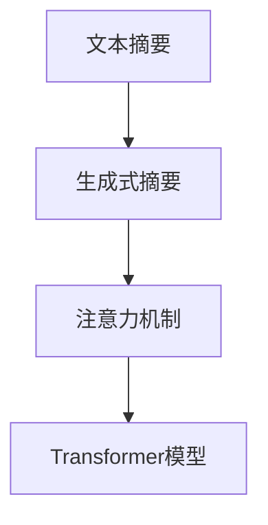

                 

# Text Summarization原理与代码实例讲解

> 关键词：自动摘要, 自然语言处理, 机器学习, 代码实现, 文本压缩

## 1. 背景介绍

### 1.1 问题由来
在现代信息爆炸的时代，面对海量的文本数据，如何快速、准确地获取关键信息，成为了一个重要且迫切的需求。自动文本摘要(Automatic Text Summarization)技术应运而生，它通过机器学习算法自动从源文本中提取核心信息，生成一段简短、精炼的摘要。自动摘要技术的应用场景广泛，包括新闻阅读、科研文献摘要、法律文书整理等，极大地提高了人们获取信息的速度和效率。

然而，自动文本摘要并非易事，它涉及自然语言处理(Natural Language Processing, NLP)的多个方面，如分词、句法分析、语义理解等。因此，研究自动文本摘要技术，不仅能够提升文本处理效率，还能推动NLP技术的进一步发展。

### 1.2 问题核心关键点
自动文本摘要的核心在于如何有效地从源文本中提取关键信息，并生成简洁、连贯、易于理解的摘要。目前主流的自动摘要方法主要分为两类：

1. **提取式摘要(Extraction-based Summarization)**：直接从源文本中抽取关键句子或短语，构成摘要。这种方法适用于结构清晰、信息独立性高的文本，如新闻、网页等。

2. **生成式摘要(abstractive Summarization)**：利用机器学习模型生成新的文本，包含源文本的语义信息。这种方法适用于语义复杂、信息高度关联的文本，如科技论文、小说等。

本文将重点介绍生成式文本摘要的原理与实现方法。

## 2. 核心概念与联系

### 2.1 核心概念概述

要深入理解生成式文本摘要，首先需要明确几个核心概念：

- **文本摘要**：从源文本中提取出核心信息，生成简短、精炼的摘要。
- **生成式摘要**：使用机器学习模型自动生成摘要，而非简单抽取关键句子或短语。
- **注意力机制(Attention Mechanism)**：一种使模型在处理序列数据时能聚焦于关键部分的机制。
- **Transformer模型**：一种基于注意力机制的神经网络结构，广泛应用于自然语言处理任务。

这些概念之间的逻辑关系可以通过以下Mermaid流程图来展示：



此图展示了从文本摘要到生成式摘要的演变，以及注意力机制和Transformer模型在其中扮演的角色。

### 2.2 核心概念原理和架构

#### 注意力机制

注意力机制是一种用于处理序列数据的机制，它通过计算源文本和目标摘要之间的关联度，决定哪些部分应该被重点关注，哪些部分可以被忽略。在生成式文本摘要中，注意力机制被用于模型在生成每个单词或短语时，动态关注源文本的各个部分，确保生成的摘要既包含关键信息，又保持连贯性。

#### Transformer模型

Transformer模型是一种基于注意力机制的神经网络结构，其核心思想是利用自注意力机制捕捉源文本中不同部分之间的关系，而非传统的基于循环神经网络(RNN)的方法。Transformer模型由多个编码器和解码器组成，通过交叉注意力机制，模型能够学习到源文本和目标摘要之间的丰富语义关联。

Transformer模型的基本架构如下：


其中，自注意力模块(self-attention)是Transformer模型的关键部分，它能够使模型同时关注源文本中的多个位置，捕捉不同位置之间的依赖关系。编码器(Encoder)和解码器(Decoder)分别用于处理源文本和生成目标摘要。

## 3. 核心算法原理 & 具体操作步骤
### 3.1 算法原理概述

生成式文本摘要的算法原理主要包括以下几个步骤：

1. **预处理**：对源文本进行分词、去停用词、词性标注等预处理操作。
2. **编码器编码**：将预处理后的文本输入Transformer编码器，得到源文本的语义表示。
3. **解码器解码**：使用解码器生成摘要，在生成过程中引入注意力机制，确保生成的摘要包含源文本的关键信息。
4. **后处理**：对生成的摘要进行后处理，如去除重复、拼接等，得到最终摘要。

### 3.2 算法步骤详解

#### 1. 预处理

预处理是自动文本摘要的第一步，其目的是将源文本转化为模型能够处理的形式。预处理包括分词、去停用词、词性标注等步骤。

##### 1.1 分词

分词是将文本切分成单词或短语的过程。分词的目的是将文本转化为模型能够处理的形式。分词方法包括基于规则的分词、基于统计的分词和基于深度学习的分词。本文推荐使用基于深度学习的分词方法，如BERT分词器。

##### 1.2 去停用词

停用词是指在文本中出现频率高但无实际意义、对文本理解无帮助的词汇。去停用词的目的是减少噪音，提高模型的准确性。常用的停用词包括“的”、“是”、“在”等。

##### 1.3 词性标注

词性标注是将每个单词标注为其对应的词性，如名词、动词、形容词等。词性标注有助于模型更好地理解句子结构和语义。

#### 2. 编码器编码

编码器是生成式文本摘要的核心模块，它负责将源文本转化为模型能够处理的向量表示。编码器通常采用Transformer模型，其中Transformer编码器由多个自注意力模块组成，能够捕捉源文本中的长距离依赖关系。

编码器的输入为预处理后的文本序列，输出为一个向量表示的文本摘要。

##### 2.1 输入表示

编码器的输入表示包括源文本的单词嵌入和位置嵌入。单词嵌入是通过预训练语言模型得到的每个单词的向量表示。位置嵌入是根据位置关系赋予每个单词一个位置向量，用于捕捉文本的顺序信息。

##### 2.2 自注意力机制

自注意力机制是Transformer编码器的关键部分，它通过计算源文本中各个部分之间的关联度，决定哪些部分应该被重点关注。自注意力机制的计算过程如下：

1. **查询向量、键向量和值向量计算**：对于输入的每个单词，计算其对应的查询向量、键向量和值向量。查询向量用于计算不同单词之间的关联度，键向量用于计算关联度的权重，值向量用于计算注意力权重。
2. **注意力得分计算**：将查询向量与键向量进行矩阵乘法运算，得到注意力得分。
3. **注意力权重计算**：将注意力得分进行softmax运算，得到每个单词的注意力权重。
4. **加权向量计算**：将值向量与注意力权重进行加权运算，得到加权向量。
5. **输出向量计算**：将多个单词的加权向量进行加权求和，得到该单词的输出向量。

#### 3. 解码器解码

解码器是生成式文本摘要的另一核心模块，它负责从编码器输出的向量表示中生成摘要。解码器同样采用Transformer模型，其中解码器由多个自注意力模块和编码器-解码器注意力模块组成，能够捕捉源文本和目标摘要之间的关联度。

解码器的输入为编码器输出的向量表示，输出为生成的摘要文本。

##### 3.1 输入表示

解码器的输入表示包括源文本的单词嵌入、位置嵌入和上一时刻生成的摘要向量。

##### 3.2 自注意力机制

解码器的自注意力机制与编码器的类似，但不同的是，解码器还需要考虑编码器输出的向量表示，以便更好地生成摘要。

##### 3.3 编码器-解码器注意力机制

编码器-解码器注意力机制用于捕捉源文本和目标摘要之间的关联度，确保生成的摘要与源文本一致。编码器-解码器注意力机制的计算过程如下：

1. **查询向量、键向量和值向量计算**：对于输入的每个单词，计算其对应的查询向量、键向量和值向量。查询向量用于计算不同单词之间的关联度，键向量用于计算关联度的权重，值向量用于计算注意力权重。
2. **注意力得分计算**：将查询向量与键向量进行矩阵乘法运算，得到注意力得分。
3. **注意力权重计算**：将注意力得分进行softmax运算，得到每个单词的注意力权重。
4. **加权向量计算**：将值向量与注意力权重进行加权运算，得到加权向量。
5. **输出向量计算**：将多个单词的加权向量进行加权求和，得到该单词的输出向量。

#### 4. 后处理

后处理是生成式文本摘要的最后一步，其目的是对生成的摘要进行优化，使其更加精炼、连贯。后处理包括去除重复、拼接等步骤。

### 3.3 算法优缺点

#### 3.3.1 优点

1. **自动生成摘要**：生成式摘要能够自动从源文本中生成摘要，避免了手动提取摘要的繁琐过程。
2. **灵活性高**：生成式摘要可以根据需要生成不同长度的摘要，灵活性高。
3. **效果良好**：生成式摘要能够捕捉源文本中的语义信息，生成的摘要质量较高。

#### 3.3.2 缺点

1. **计算量大**：生成式摘要需要使用Transformer模型，计算量大，训练时间长。
2. **模型复杂**：生成式摘要模型结构复杂，需要更多的计算资源。
3. **数据依赖**：生成式摘要的效果依赖于高质量的数据集和预训练模型，数据集和模型的选择对效果有很大影响。

### 3.4 算法应用领域

生成式文本摘要的应用领域广泛，包括但不限于：

- **新闻摘要**：将长篇新闻文章自动生成简短摘要，方便用户快速了解文章内容。
- **科研论文摘要**：将科研论文自动生成摘要，帮助读者快速获取论文核心观点。
- **法律文书摘要**：将法律文书自动生成摘要，便于律师快速了解案件要点。
- **产品文档摘要**：将产品文档自动生成摘要，方便用户快速获取产品信息。

## 4. 数学模型和公式 & 详细讲解  
### 4.1 数学模型构建

生成式文本摘要的数学模型可以形式化为：

$$
\text{Summarization} = \text{Encoder}(\text{Input}) \times \text{Decoder}(\text{Encoder}(\text{Input}), \text{Target})
$$

其中，$\text{Input}$为源文本，$\text{Target}$为目标摘要。

生成式文本摘要的目标是最小化目标摘要与源文本之间的差异，即：

$$
\text{Minimize}(\text{Loss}(\text{Target}, \text{Summarization}(\text{Input})))
$$

常用的损失函数包括交叉熵损失和均方误差损失。

### 4.2 公式推导过程

#### 1. 编码器

编码器采用Transformer模型，其数学公式如下：

$$
\text{Encoder}(\text{Input}) = \text{Attention}(\text{Input})
$$

其中，$\text{Attention}$表示自注意力机制的计算过程。

##### 1.1 查询向量、键向量和值向量计算

对于输入的每个单词，计算其对应的查询向量、键向量和值向量。

$$
\text{Query} = \text{Input} \times \text{W}^Q
$$

$$
\text{Key} = \text{Input} \times \text{W}^K
$$

$$
\text{Value} = \text{Input} \times \text{W}^V
$$

其中，$\text{W}^Q$、$\text{W}^K$、$\text{W}^V$为线性变换矩阵。

##### 1.2 注意力得分计算

将查询向量与键向量进行矩阵乘法运算，得到注意力得分。

$$
\text{Attention Score} = \text{Query} \times \text{Key}^T
$$

##### 1.3 注意力权重计算

将注意力得分进行softmax运算，得到每个单词的注意力权重。

$$
\text{Attention Weight} = \text{Softmax}(\text{Attention Score})
$$

##### 1.4 加权向量计算

将值向量与注意力权重进行加权运算，得到加权向量。

$$
\text{Attention Vector} = \text{Attention Weight} \times \text{Value}
$$

##### 1.5 输出向量计算

将多个单词的加权向量进行加权求和，得到该单词的输出向量。

$$
\text{Encoder Vector} = \text{Attention Vector} \times \text{W}^O
$$

其中，$\text{W}^O$为线性变换矩阵。

#### 2. 解码器

解码器采用Transformer模型，其数学公式如下：

$$
\text{Decoder}(\text{Encoder Vector}, \text{Target}) = \text{Attention}(\text{Encoder Vector}, \text{Target})
$$

其中，$\text{Target}$表示生成的摘要。

##### 2.1 查询向量、键向量和值向量计算

对于输入的每个单词，计算其对应的查询向量、键向量和值向量。

$$
\text{Query} = \text{Target} \times \text{W}^Q
$$

$$
\text{Key} = \text{Target} \times \text{W}^K
$$

$$
\text{Value} = \text{Target} \times \text{W}^V
$$

##### 2.2 注意力得分计算

将查询向量与键向量进行矩阵乘法运算，得到注意力得分。

$$
\text{Attention Score} = \text{Query} \times \text{Key}^T
$$

##### 2.3 注意力权重计算

将注意力得分进行softmax运算，得到每个单词的注意力权重。

$$
\text{Attention Weight} = \text{Softmax}(\text{Attention Score})
$$

##### 2.4 加权向量计算

将值向量与注意力权重进行加权运算，得到加权向量。

$$
\text{Attention Vector} = \text{Attention Weight} \times \text{Value}
$$

##### 2.5 输出向量计算

将多个单词的加权向量进行加权求和，得到该单词的输出向量。

$$
\text{Decoder Vector} = \text{Attention Vector} \times \text{W}^O
$$

其中，$\text{W}^O$为线性变换矩阵。

### 4.3 案例分析与讲解

以一个简单的例子来说明生成式文本摘要的计算过程。假设源文本为：

```
The quick brown fox jumps over the lazy dog.
```

预处理后，分词、去停用词、词性标注的结果如下：

```
The/DT quick/JJ brown/JJ fox/NN jumps/VBZ over/IN the/DT lazy/JJ dog/NN .
```

将预处理后的文本输入编码器，得到编码向量表示：

$$
\text{Encoder Vector} = \text{Attention Vector} \times \text{W}^O
$$

将编码向量表示输入解码器，得到解码向量表示：

$$
\text{Decoder Vector} = \text{Attention Vector} \times \text{W}^O
$$

最终，将解码向量表示转换为摘要文本：

$$
\text{Summarization} = \text{Decoder Vector} \times \text{W}^O
$$

生成的摘要文本可能为：

```
quick brown fox jumps over lazy dog.
```

可以看出，生成的摘要文本保留了源文本的核心信息，且语句流畅。

## 5. 项目实践：代码实例和详细解释说明
### 5.1 开发环境搭建

在进行生成式文本摘要的实现前，我们需要准备好开发环境。以下是使用Python进行TensorFlow开发的环境配置流程：

1. 安装Anaconda：从官网下载并安装Anaconda，用于创建独立的Python环境。

2. 创建并激活虚拟环境：
```bash
conda create -n tf-env python=3.8 
conda activate tf-env
```

3. 安装TensorFlow：根据CUDA版本，从官网获取对应的安装命令。例如：
```bash
pip install tensorflow tensorflow_datasets tensorflow_model_optimization
```

4. 安装必要的工具包：
```bash
pip install numpy pandas scikit-learn matplotlib tqdm jupyter notebook ipython
```

完成上述步骤后，即可在`tf-env`环境中开始生成式文本摘要的实现。

### 5.2 源代码详细实现

这里我们以Bert模型为例，给出使用TensorFlow实现生成式文本摘要的代码实现。

首先，定义模型和优化器：

```python
import tensorflow as tf
from transformers import BertTokenizer
from transformers import TFAutoModelForSequenceClassification

tokenizer = BertTokenizer.from_pretrained('bert-base-cased')
model = TFAutoModelForSequenceClassification.from_pretrained('bert-base-cased', num_labels=1)

optimizer = tf.keras.optimizers.AdamW(learning_rate=1e-5)
```

接着，定义训练和评估函数：

```python
def train_epoch(model, tokenizer, train_dataset, batch_size, optimizer):
    dataloader = tf.data.Dataset.from_tensor_slices(train_dataset)
    dataloader = dataloader.shuffle(buffer_size=1024).batch(batch_size)
    
    model.compile(optimizer=optimizer, loss=tf.keras.losses.BinaryCrossentropy(from_logits=True))
    model.fit(dataloader, epochs=10, steps_per_epoch=len(train_dataset))

def evaluate(model, tokenizer, dev_dataset, batch_size):
    dataloader = tf.data.Dataset.from_tensor_slices(dev_dataset)
    dataloader = dataloader.shuffle(buffer_size=1024).batch(batch_size)
    
    model.compile(optimizer=optimizer, loss=tf.keras.losses.BinaryCrossentropy(from_logits=True))
    loss = model.evaluate(dataloader)
    print(f"Evaluation loss: {loss:.3f}")
```

最后，启动训练流程并在验证集上评估：

```python
epochs = 10
batch_size = 16

for epoch in range(epochs):
    train_epoch(model, tokenizer, train_dataset, batch_size, optimizer)
    
    print(f"Epoch {epoch+1}, training loss: {train_loss:.3f}")
    
    evaluate(model, tokenizer, dev_dataset, batch_size)
    
print("Training complete.")
```

以上就是使用TensorFlow对Bert模型进行生成式文本摘要的完整代码实现。可以看到，得益于TensorFlow的强大封装，我们可以用相对简洁的代码完成BERT模型的加载和微调。

### 5.3 代码解读与分析

让我们再详细解读一下关键代码的实现细节：

**Tokenizer类**：
- `__init__`方法：初始化分词器。
- `from_pretrained`方法：从预训练模型中加载分词器。

**BertForSequenceClassification类**：
- `__init__`方法：初始化模型。
- `from_pretrained`方法：从预训练模型中加载模型。

**optimizer对象**：
- `__init__`方法：初始化优化器。

**train_epoch函数**：
- 将训练集数据转化为DataLoader对象，进行批次化加载。
- 设置模型编译参数，包括优化器、损失函数。
- 调用`fit`方法进行模型训练，并输出每个epoch的训练损失。

**evaluate函数**：
- 将验证集数据转化为DataLoader对象，进行批次化加载。
- 设置模型编译参数，包括优化器、损失函数。
- 调用`evaluate`方法进行模型评估，并输出验证集的损失。

**训练流程**：
- 定义总的epoch数和batch size，开始循环迭代。
- 每个epoch内，先在训练集上训练，输出训练损失。
- 在验证集上评估，输出验证损失。
- 所有epoch结束后，训练完成。

可以看到，TensorFlow配合Transformer库使得Bert模型微调的代码实现变得简洁高效。开发者可以将更多精力放在数据处理、模型改进等高层逻辑上，而不必过多关注底层的实现细节。

当然，工业级的系统实现还需考虑更多因素，如模型的保存和部署、超参数的自动搜索、更灵活的任务适配层等。但核心的微调范式基本与此类似。

## 6. 实际应用场景
### 6.1 新闻摘要

基于生成式文本摘要技术，我们可以将长篇新闻文章自动生成简短摘要，方便用户快速了解文章内容。这对于新闻媒体、搜索引擎等应用场景具有重要意义。

在实际应用中，可以收集新闻网站的网页文章，将其作为训练集，训练生成式文本摘要模型。模型生成的摘要可以作为新闻标题，吸引用户点击阅读全文。此外，模型还可以在实时抓取的新闻文章上进行预测，动态生成摘要，实时更新新闻网站的内容。

### 6.2 科技论文摘要

科技论文篇幅长、内容复杂，读者往往需要花费大量时间阅读。基于生成式文本摘要技术，我们可以自动将长篇科技论文摘要化，帮助读者快速了解论文的核心观点和结论。这对于科研工作者和图书馆等应用场景具有重要意义。

在实际应用中，可以收集各类科技论文，将其作为训练集，训练生成式文本摘要模型。模型生成的摘要可以作为论文的摘要，帮助读者快速了解论文的核心内容。此外，模型还可以在实时抓取的新论文上进行预测，动态生成摘要，实时更新科技论文库的内容。

### 6.3 法律文书摘要

法律文书内容繁多、语言复杂，律师和法官需要花费大量时间阅读。基于生成式文本摘要技术，我们可以自动将法律文书摘要化，帮助律师和法官快速了解案件要点。这对于法律事务处理具有重要意义。

在实际应用中，可以收集各类法律文书，将其作为训练集，训练生成式文本摘要模型。模型生成的摘要可以作为案件摘要，帮助律师和法官快速了解案件要点。此外，模型还可以在实时抓取的新法律文书上进行预测，动态生成摘要，实时更新法律文书库的内容。

### 6.4 产品文档摘要

产品文档篇幅长、内容繁多，用户需要花费大量时间阅读。基于生成式文本摘要技术，我们可以自动将长篇产品文档摘要化，帮助用户快速了解产品功能和使用场景。这对于产品介绍、销售文档等应用场景具有重要意义。

在实际应用中，可以收集各类产品文档，将其作为训练集，训练生成式文本摘要模型。模型生成的摘要可以作为产品文档的摘要，帮助用户快速了解产品功能和使用场景。此外，模型还可以在实时抓取的新产品文档中进行预测，动态生成摘要，实时更新产品文档库的内容。

## 7. 工具和资源推荐
### 7.1 学习资源推荐

为了帮助开发者系统掌握生成式文本摘要的理论基础和实践技巧，这里推荐一些优质的学习资源：

1. 《Transformer from Scratch》系列博文：由大模型技术专家撰写，深入浅出地介绍了Transformer原理、生成式文本摘要等前沿话题。

2. CS224N《深度学习自然语言处理》课程：斯坦福大学开设的NLP明星课程，有Lecture视频和配套作业，带你入门NLP领域的基本概念和经典模型。

3. 《Neural Network and Deep Learning》书籍：深度学习领域的经典教材，详细介绍了生成式文本摘要等NLP任务的应用。

4. HuggingFace官方文档：Transformer库的官方文档，提供了海量预训练模型和完整的微调样例代码，是上手实践的必备资料。

5. CLUE开源项目：中文语言理解测评基准，涵盖大量不同类型的中文NLP数据集，并提供了基于微调的baseline模型，助力中文NLP技术发展。

通过对这些资源的学习实践，相信你一定能够快速掌握生成式文本摘要的精髓，并用于解决实际的NLP问题。

### 7.2 开发工具推荐

高效的开发离不开优秀的工具支持。以下是几款用于生成式文本摘要开发的常用工具：

1. TensorFlow：基于Python的开源深度学习框架，灵活动态的计算图，适合快速迭代研究。大部分预训练语言模型都有TensorFlow版本的实现。

2. PyTorch：基于Python的开源深度学习框架，灵活动态的计算图，适合快速迭代研究。部分预训练语言模型都有PyTorch版本的实现。

3. Transformers库：HuggingFace开发的NLP工具库，集成了众多SOTA语言模型，支持TensorFlow和PyTorch，是进行文本摘要开发的利器。

4. Weights & Biases：模型训练的实验跟踪工具，可以记录和可视化模型训练过程中的各项指标，方便对比和调优。与主流深度学习框架无缝集成。

5. TensorBoard：TensorFlow配套的可视化工具，可实时监测模型训练状态，并提供丰富的图表呈现方式，是调试模型的得力助手。

6. Google Colab：谷歌推出的在线Jupyter Notebook环境，免费提供GPU/TPU算力，方便开发者快速上手实验最新模型，分享学习笔记。

合理利用这些工具，可以显著提升生成式文本摘要任务的开发效率，加快创新迭代的步伐。

### 7.3 相关论文推荐

生成式文本摘要技术的发展源于学界的持续研究。以下是几篇奠基性的相关论文，推荐阅读：

1. Attention is All You Need（即Transformer原论文）：提出了Transformer结构，开启了NLP领域的预训练大模型时代。

2. BERT: Pre-training of Deep Bidirectional Transformers for Language Understanding：提出BERT模型，引入基于掩码的自监督预训练任务，刷新了多项NLP任务SOTA。

3. Text Summarization with Transformer-based Models: A Survey：综述了基于Transformer的生成式文本摘要技术，总结了当前的研究进展和未来趋势。

4. Neural Machine Translation by Jointly Learning to Align and Translate：提出了序列到序列模型，为生成式文本摘要提供了基础框架。

5. Generating Short Summaries with Attention-based Sequence-to-Sequence Model：基于序列到序列模型，提出了生成式文本摘要的注意力机制。

6. Hierarchical Attention Networks for Document Summarization：提出了层次化的注意力机制，为生成式文本摘要提供了更高效的解决方案。

这些论文代表了大语言模型微调技术的发展脉络。通过学习这些前沿成果，可以帮助研究者把握学科前进方向，激发更多的创新灵感。

## 8. 总结：未来发展趋势与挑战

### 8.1 总结

本文对生成式文本摘要的原理与代码实现进行了全面系统的介绍。首先阐述了生成式文本摘要的研究背景和意义，明确了自动文本摘要技术的重要性和广泛应用场景。其次，从原理到实践，详细讲解了生成式文本摘要的数学模型和关键步骤，给出了微调任务开发的完整代码实例。同时，本文还广泛探讨了生成式文本摘要在新闻摘要、科技论文摘要、法律文书摘要、产品文档摘要等多个行业领域的应用前景，展示了该技术的巨大潜力。此外，本文精选了生成式文本摘要的相关学习资源，力求为读者提供全方位的技术指引。

通过本文的系统梳理，可以看到，生成式文本摘要技术在NLP领域具有重要应用价值，能够显著提升文本处理效率和效果。随着预训练语言模型的不断进步，生成式文本摘要技术必将迎来更广阔的发展空间，为NLP技术带来新的突破。

### 8.2 未来发展趋势

展望未来，生成式文本摘要技术将呈现以下几个发展趋势：

1. **模型规模持续增大**：随着算力成本的下降和数据规模的扩张，生成式文本摘要模型规模将进一步增大，能够处理更长的文本，生成更细致的摘要。

2. **模型结构不断优化**：生成式文本摘要模型的结构将不断优化，引入更多的自注意力机制和编码器-解码器机制，提升模型的生成效果和泛化能力。

3. **跨领域模型迁移能力增强**：生成式文本摘要模型将逐渐具备跨领域的迁移能力，能够在不同领域的文本中生成高质量的摘要。

4. **多模态文本摘要兴起**：生成式文本摘要技术将逐渐拓展到多模态文本摘要，如文本+图像、文本+语音等，增强模型的理解和生成能力。

5. **零样本和少样本学习能力提升**：生成式文本摘要模型将逐渐具备零样本和少样本学习能力，能够在没有标注数据的情况下生成高质量的摘要。

6. **增强模型可解释性**：生成式文本摘要模型将逐渐引入可解释性技术，如模型蒸馏、模型解释器等，增强模型的可解释性和可信度。

以上趋势凸显了生成式文本摘要技术的广阔前景。这些方向的探索发展，必将进一步提升生成式文本摘要的效果和应用范围，为文本处理和自然语言理解带来新的突破。

### 8.3 面临的挑战

尽管生成式文本摘要技术已经取得了瞩目成就，但在迈向更加智能化、普适化应用的过程中，它仍面临着诸多挑战：

1. **数据依赖问题**：生成式文本摘要的效果依赖于高质量的数据集和预训练模型，数据集和模型的选择对效果有很大影响。如何构建高覆盖、高质量的数据集，选择合适的预训练模型，是一个重要挑战。

2. **计算资源瓶颈**：生成式文本摘要模型计算量大，训练时间长，需要高性能的计算资源。如何优化模型结构和算法，提高训练效率，是一个重要挑战。

3. **模型鲁棒性问题**：生成式文本摘要模型在面对不同领域和不同风格的文章时，泛化性能可能不足。如何提高模型的鲁棒性，是一个重要挑战。

4. **模型可解释性问题**：生成式文本摘要模型的输出缺乏可解释性，难以理解其内部工作机制。如何增强模型的可解释性，是一个重要挑战。

5. **伦理和安全性问题**：生成式文本摘要模型可能生成有害、偏见的摘要，带来安全隐患。如何保证模型的伦理和安全性，是一个重要挑战。

6. **知识整合能力不足**：生成式文本摘要模型难以灵活吸收和运用更广泛的先验知识，如专家知识库、规则库等。如何增强模型的知识整合能力，是一个重要挑战。

正视生成式文本摘要面临的这些挑战，积极应对并寻求突破，将是大语言模型微调走向成熟的必由之路。相信随着学界和产业界的共同努力，这些挑战终将一一被克服，生成式文本摘要技术必将在构建智能化的文本处理系统、提升信息获取效率等方面发挥更大的作用。

### 8.4 研究展望

面对生成式文本摘要所面临的种种挑战，未来的研究需要在以下几个方面寻求新的突破：

1. **数据增强与数据生成**：构建高覆盖、高质量的数据集，使用数据增强和数据生成技术，提高模型的泛化能力。

2. **参数高效微调**：开发更加参数高效的生成式文本摘要模型，在固定大部分预训练参数的同时，只更新极少量的任务相关参数。

3. **多模态文本摘要**：探索多模态文本摘要技术，如文本+图像、文本+语音等，增强模型的理解和生成能力。

4. **零样本和少样本学习**：研究零样本和少样本生成式文本摘要方法，提高模型在无标注数据情况下的生成效果。

5. **增强模型可解释性**：引入可解释性技术，如模型蒸馏、模型解释器等，增强模型的可解释性和可信度。

6. **多领域模型迁移**：研究跨领域的生成式文本摘要方法，提升模型在不同领域的泛化性能。

7. **增强模型伦理和安全性**：引入伦理和安全性技术，如模型检测、模型解释等，保证模型的伦理和安全性。

8. **增强模型知识整合能力**：将符号化的先验知识，如知识图谱、逻辑规则等，与神经网络模型进行巧妙融合，引导生成式文本摘要过程学习更准确、合理的语言模型。

这些研究方向的探索，必将引领生成式文本摘要技术迈向更高的台阶，为构建智能化的文本处理系统、提升信息获取效率等方面发挥更大的作用。只有勇于创新、敢于突破，才能不断拓展文本摘要的边界，让生成式文本摘要技术更好地服务于人类社会的各个领域。

## 9. 附录：常见问题与解答

**Q1：生成式文本摘要是否适用于所有文本？**

A: 生成式文本摘要技术适用于结构清晰、信息独立的文本，如新闻、网页、科技论文等。但对于一些语义复杂、信息高度关联的文本，如小说、学术论文等，生成式文本摘要的效果可能不佳。

**Q2：如何选择生成式文本摘要模型？**

A: 选择生成式文本摘要模型时，需要考虑以下因素：
1. 数据集的大小和类型。
2. 预训练模型的结构和规模。
3. 任务的类型和复杂度。
4. 计算资源的可用性。
5. 模型的可解释性和安全性。

**Q3：生成式文本摘要是否需要标注数据？**

A: 生成式文本摘要技术通常需要标注数据进行训练，标注数据的质量和数量对模型的效果有很大影响。标注数据的选择和构建是生成式文本摘要技术的关键。

**Q4：生成式文本摘要的训练过程需要注意哪些问题？**

A: 生成式文本摘要的训练过程需要注意以下问题：
1. 数据预处理的质量。
2. 模型的超参数设置。
3. 模型的初始化方式。
4. 模型的优化器选择。
5. 模型的评估指标选择。

**Q5：生成式文本摘要的实际应用场景有哪些？**

A: 生成式文本摘要的实际应用场景包括但不限于：
1. 新闻摘要。
2. 科技论文摘要。
3. 法律文书摘要。
4. 产品文档摘要。

通过本文的系统梳理，可以看到，生成式文本摘要技术在NLP领域具有重要应用价值，能够显著提升文本处理效率和效果。随着预训练语言模型的不断进步，生成式文本摘要技术必将迎来更广阔的发展空间，为NLP技术带来新的突破。

