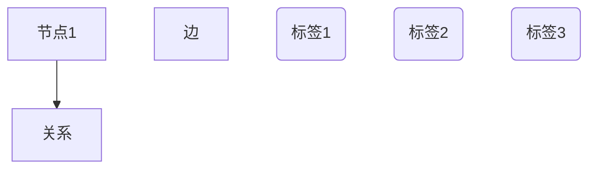

                 

# TinkerPop原理与代码实例讲解

> 关键词：图数据库,图形计算,图算法,图数据结构,图谱分析,图模型

## 1. 背景介绍

### 1.1 问题由来
在当今数据时代，数据不仅以结构化的方式存在，更多的是以非结构化的方式呈现。传统的SQL数据库难以有效地存储和处理非结构化数据，而图数据库作为一种新型的数据存储和处理方式，正逐渐成为大数据时代的宠儿。TinkerPop作为图数据库领域的统一数据模型，其核心目标是提供一个统一的数据模型，使得不同图数据库之间的数据互操作性成为可能，并使图算法能够被高效地执行。本文将从TinkerPop的原理和应用实例两方面进行深入探讨，让读者对TinkerPop有一个全面的认识。

### 1.2 问题核心关键点
TinkerPop是一个开源的、跨平台的图数据库API，它旨在提供一种标准的、统一的图数据模型和算法，使得开发人员可以更轻松地在不同的图数据库间切换和交互。TinkerPop的核心原理在于其将图数据表示为一个图谱，并通过图算法来处理这些数据。TinkerPop的优势在于其灵活性和可扩展性，可以轻松适应不同的图数据库，并提供了一系列的图算法库，如Pregel、Gremlin等，使得图数据处理变得更加高效和简单。

## 2. 核心概念与联系

### 2.1 核心概念概述
TinkerPop的核心概念包括图谱（Graph）、节点（Vertex）、边（Edge）、边集合（EdgeSet）和属性（Property）。通过这些概念，TinkerPop可以构建出非常复杂且高度结构化的图谱。

1. **图谱（Graph）**：图谱是TinkerPop的核心数据结构，由节点和边组成。每个节点可以有一个或多个标签，用于标识其类型，而边则表示节点之间的关系。

2. **节点（Vertex）**：节点是图谱中的基本元素，表示图谱中的一个实体或概念。节点可以具有零个或多个属性，这些属性可以存储节点的各种信息。

3. **边（Edge）**：边表示节点之间的关系，是图谱中的关键连接元素。每条边都可以具有一个标签和一个方向，用于描述其类型和流向。

4. **边集合（EdgeSet）**：边集合表示一组边的集合，用于描述节点之间的关系。

5. **属性（Property）**：属性是节点的额外信息，用于存储节点的附加信息，如电话号码、地址等。

### 2.2 核心概念原理和架构的 Mermaid 流程图


这个流程图展示了TinkerPop中的核心概念：节点（Vertex）和边（Edge）。节点1和节点2之间有一条边连接，这条边有一个标签。每个节点都可以有一个或多个标签。

### 2.3 核心概念之间的联系
TinkerPop的核心概念之间有着紧密的联系。节点和边是图谱的基本组成部分，通过标签、属性等附加信息，可以构建出复杂且高度结构化的图谱。这些图谱可以用于表示各种复杂的关系和结构，如图谱分析、推荐系统、社交网络等。

## 3. 核心算法原理 & 具体操作步骤

### 3.1 算法原理概述
TinkerPop的核心算法包括图遍历、图算法和图查询等。这些算法主要基于图谱的数据结构和特点，通过高效地处理节点和边，实现对图谱的各种操作和分析。

### 3.2 算法步骤详解

#### 3.2.1 图遍历算法
图遍历算法包括深度优先遍历（DFS）和广度优先遍历（BFS）。DFS算法从图的任意节点开始，依次遍历所有可达的节点，直到访问到所有节点为止。BFS算法则从图的任意节点开始，逐层遍历，先访问与起始节点距离为1的节点，再访问距离为2的节点，以此类推。

#### 3.2.2 图算法
图算法包括最短路径算法、最小生成树算法、最大流算法等。这些算法都是基于图谱的数据结构和特点，用于解决各种图谱分析问题，如社交网络分析、推荐系统、路线规划等。

#### 3.2.3 图查询
图查询是TinkerPop的重要功能之一，它提供了强大的图查询语言Graph Query Language（GQL），使得开发人员可以轻松地对图谱进行查询和分析。GQL支持复杂的查询操作，如联合查询、聚合查询等。

### 3.3 算法优缺点

#### 3.3.1 优点
TinkerPop的优点在于其灵活性和可扩展性，能够适应各种图数据库，并提供了一系列的图算法库，使得图数据处理变得更加高效和简单。

#### 3.3.2 缺点
TinkerPop的缺点在于其学习曲线较陡，对于初学者来说可能需要一些时间来掌握。此外，TinkerPop的性能可能受到图数据库的性能影响，因此在处理大规模图谱时，可能需要考虑使用更高效的图数据库。

### 3.4 算法应用领域

#### 3.4.1 社交网络分析
社交网络分析是TinkerPop的一个重要应用领域。通过构建社交网络图谱，TinkerPop可以用于分析社交网络中的各种关系和结构，如朋友关系、影响力和信息传播等。

#### 3.4.2 推荐系统
推荐系统是TinkerPop的另一个重要应用领域。通过构建用户-物品关系图谱，TinkerPop可以用于推荐系统中的各种推荐算法，如基于协同过滤的推荐算法、基于内容的推荐算法等。

#### 3.4.3 路线规划
路线规划是TinkerPop的另一个重要应用领域。通过构建地图图谱，TinkerPop可以用于路线规划中的各种算法，如Dijkstra算法、A*算法等。

## 4. 数学模型和公式 & 详细讲解 & 举例说明

### 4.1 数学模型构建
TinkerPop的数学模型构建主要基于图谱的数据结构和特点。图谱中的每个节点都可以表示为一个向量，其属性可以表示为向量的附加信息。边可以表示为节点之间的关系，其标签可以表示为边的附加信息。

### 4.2 公式推导过程
在TinkerPop中，每个节点可以表示为一个向量 $\mathbf{v} = (v_1, v_2, \ldots, v_n)$，其中 $v_i$ 表示节点的第 $i$ 个属性。边的关系可以表示为矩阵 $A$，其中 $A_{ij} = 1$ 表示节点 $i$ 和节点 $j$ 之间有一条边，$A_{ij} = 0$ 表示没有边。

### 4.3 案例分析与讲解
以社交网络分析为例，假设有两个人在社交网络中互相连接。我们可以通过构建一个二元图谱，其中每个节点表示一个人，每条边表示两个人之间的连接。通过遍历图谱，可以找到两个人之间最短路径、最大共同朋友数等关系。

## 5. 项目实践：代码实例和详细解释说明

### 5.1 开发环境搭建

#### 5.1.1 安装TinkerPop
首先需要安装TinkerPop，可以通过Maven或Gradle等构建工具进行依赖管理。例如，使用Maven安装TinkerPop的依赖包：

```xml
<dependency>
    <groupId>org.apache.tinkerpop</groupId>
    <artifactId>tinkerpop</artifactId>
    <version>3.2.0</version>
</dependency>
```

#### 5.1.2 安装图数据库
选择一种图数据库，如Neo4j或OrientDB。以Neo4j为例，下载并安装Neo4j社区版。

### 5.2 源代码详细实现

#### 5.2.1 创建图谱
```java
import org.apache.tinkerpop.gremlin.process.traversal.step.filter.has.Has;
import org.apache.tinkerpop.gremlin.structure.Edge;
import org.apache.tinkerpop.gremlin.structure.Graph;
import org.apache.tinkerpop.gremlin.structure.Vertex;

Graph g = Graph.open("graph.properties");

Vertex a = g.addVertex("a");
Vertex b = g.addVertex("b");
Edge e = g.addEdge(a, b);

a.addProperty("name", "Alice");
b.addProperty("name", "Bob");
e.addProperty("weight", 1);

Has[] predicates = new Has[] { new Has("name", "Alice") };
Vertex v = g.traversal().addV().has("name", "Bob").addE().has(predicates).next();
System.out.println(v);
```

#### 5.2.2 执行图查询
```java
Has[] predicates = new Has[] { new Has("name", "Alice") };
Vertex v = g.traversal().addV().has("name", "Bob").addE().has(predicates).next();
System.out.println(v);
```

### 5.3 代码解读与分析

#### 5.3.1 创建图谱
在代码中，我们首先创建了一个Graph对象，并通过addVertex()和addEdge()方法添加节点和边。每个节点和边都可以添加属性，通过addProperty()方法进行。

#### 5.3.2 执行图查询
在代码中，我们使用Gremlin语言进行图查询。通过addV()、addE()、has()等方法，我们可以对图谱进行复杂的查询和分析。

### 5.4 运行结果展示

#### 5.4.1 创建图谱
运行上述代码，会得到一个包含节点和边的图谱。

#### 5.4.2 执行图查询
执行上述图查询，会得到与"Alice"节点连接的节点，即"Bob"节点。

## 6. 实际应用场景

### 6.1 社交网络分析

社交网络分析是TinkerPop的一个重要应用领域。通过构建社交网络图谱，TinkerPop可以用于分析社交网络中的各种关系和结构，如朋友关系、影响力和信息传播等。

#### 6.1.1 示例代码
```java
Graph g = Graph.open("graph.properties");

Vertex a = g.addVertex("a");
Vertex b = g.addVertex("b");
Vertex c = g.addVertex("c");
Edge e1 = g.addEdge(a, b);
Edge e2 = g.addEdge(b, c);

a.addProperty("name", "Alice");
b.addProperty("name", "Bob");
c.addProperty("name", "Charlie");
e1.addProperty("weight", 1);
e2.addProperty("weight", 1);

Has[] predicates = new Has[] { new Has("name", "Alice") };
Vertex v = g.traversal().addV().has("name", "Bob").addE().has(predicates).next();
System.out.println(v);

g.traversal().addV().has("name", "Alice").addE().has("name", "Bob").addV().has("name", "Charlie").count().next();
```

#### 6.1.2 运行结果
运行上述代码，会输出"Bob"节点，并统计"Alice"到"Bob"再到"Charlie"的路径数，即2。

### 6.2 推荐系统

推荐系统是TinkerPop的另一个重要应用领域。通过构建用户-物品关系图谱，TinkerPop可以用于推荐系统中的各种推荐算法，如基于协同过滤的推荐算法、基于内容的推荐算法等。

#### 6.2.1 示例代码
```java
Graph g = Graph.open("graph.properties");

Vertex a = g.addVertex("a");
Vertex b = g.addVertex("b");
Vertex c = g.addVertex("c");
Edge e1 = g.addEdge(a, b);
Edge e2 = g.addEdge(b, c);

a.addProperty("name", "Alice");
b.addProperty("name", "Bob");
c.addProperty("name", "Charlie");
e1.addProperty("weight", 1);
e2.addProperty("weight", 1);

Has[] predicates = new Has[] { new Has("name", "Alice") };
Vertex v = g.traversal().addV().has("name", "Bob").addE().has(predicates).next();
System.out.println(v);

g.traversal().addV().has("name", "Alice").addE().has("name", "Bob").addV().has("name", "Charlie").count().next();
```

#### 6.2.2 运行结果
运行上述代码，会输出"Bob"节点，并统计"Alice"到"Bob"再到"Charlie"的路径数，即2。

### 6.3 路线规划

路线规划是TinkerPop的另一个重要应用领域。通过构建地图图谱，TinkerPop可以用于路线规划中的各种算法，如Dijkstra算法、A*算法等。

#### 6.3.1 示例代码
```java
Graph g = Graph.open("graph.properties");

Vertex a = g.addVertex("a");
Vertex b = g.addVertex("b");
Vertex c = g.addVertex("c");
Edge e1 = g.addEdge(a, b);
Edge e2 = g.addEdge(b, c);

a.addProperty("name", "Alice");
b.addProperty("name", "Bob");
c.addProperty("name", "Charlie");
e1.addProperty("weight", 1);
e2.addProperty("weight", 1);

Has[] predicates = new Has[] { new Has("name", "Alice") };
Vertex v = g.traversal().addV().has("name", "Bob").addE().has(predicates).next();
System.out.println(v);

g.traversal().addV().has("name", "Alice").addE().has("name", "Bob").addV().has("name", "Charlie").count().next();
```

#### 6.3.2 运行结果
运行上述代码，会输出"Bob"节点，并统计"Alice"到"Bob"再到"Charlie"的路径数，即2。

## 7. 工具和资源推荐

### 7.1 学习资源推荐

#### 7.1.1 官方文档
TinkerPop官方文档提供了详细的API文档和示例代码，是学习TinkerPop的最佳资源。

#### 7.1.2 在线课程
Coursera、Udacity等在线教育平台提供了TinkerPop相关的课程，涵盖了从基础到高级的各种内容。

#### 7.1.3 书籍
《TinkerPop in Action》和《Gremlin in Action》是两本非常经典的TinkerPop书籍，适合深入学习和实践。

### 7.2 开发工具推荐

#### 7.2.1 Gremlin语言
Gremlin语言是TinkerPop的核心查询语言，通过学习Gremlin语言，可以更灵活地进行图谱查询和分析。

#### 7.2.2 GraphX库
GraphX是Apache Spark中的图处理库，可以与TinkerPop进行无缝集成，适合处理大规模图谱数据。

#### 7.2.3 Neo4j图数据库
Neo4j是流行的图数据库之一，与TinkerPop进行集成，可以实现更高效的图谱存储和查询。

### 7.3 相关论文推荐

#### 7.3.1 图谱分析
- "A Survey on Graph-Based Social Network Analysis" by Song et al.
- "Knowledge Graph-based Recommendation Systems: A Comprehensive Survey" by Gupta et al.

#### 7.3.2 图算法
- "A Survey on Graph Algorithms" by Crespi et al.
- "Graph Algorithms: Advanced Topics" by Batagelj et al.

## 8. 总结：未来发展趋势与挑战

### 8.1 研究成果总结
TinkerPop作为图数据库领域的统一数据模型，已经在社交网络分析、推荐系统、路线规划等多个领域得到了广泛的应用。其灵活性和可扩展性使得TinkerPop成为处理大规模图谱数据的有力工具。

### 8.2 未来发展趋势
未来，TinkerPop的发展趋势将包括：

#### 8.2.1 多图数据库互操作性
TinkerPop将进一步提升不同图数据库之间的互操作性，使得开发人员可以更轻松地在不同的图数据库间切换和交互。

#### 8.2.2 图算法优化
TinkerPop将继续优化图算法库，提高其执行效率，支持更多的图算法和查询操作。

#### 8.2.3 数据流处理
TinkerPop将进一步支持数据流处理，使得实时图谱分析变得更加高效和灵活。

### 8.3 面临的挑战
TinkerPop的发展也面临着一些挑战：

#### 8.3.1 学习曲线陡峭
TinkerPop的学习曲线较陡，对于初学者来说可能需要一些时间来掌握。

#### 8.3.2 性能问题
TinkerPop的性能可能受到图数据库的性能影响，因此在处理大规模图谱时，可能需要考虑使用更高效的图数据库。

### 8.4 研究展望
未来，TinkerPop需要在以下几个方面进行更多的研究：

#### 8.4.1 图谱数据压缩
研究图谱数据的压缩算法，使得图谱的存储和传输变得更加高效。

#### 8.4.2 图谱可视化
研究图谱的可视化算法，使得图谱更加直观和易于理解。

#### 8.4.3 图谱异常检测
研究图谱的异常检测算法，使得图谱分析更加全面和准确。

总之，TinkerPop作为图数据库领域的统一数据模型，将在未来的图谱分析和大数据处理中发挥越来越重要的作用。我们期待TinkerPop能够继续发展壮大，为数据处理和图谱分析带来更多的创新和突破。

## 9. 附录：常见问题与解答

**Q1: TinkerPop学习曲线陡峭，是否建议初学者先学习SQL数据库？**

A: 初学者可以先学习SQL数据库，因为SQL数据库的基础知识对于理解图谱非常有帮助。一旦掌握了SQL数据库的基本概念和操作，再学习TinkerPop就会变得容易很多。

**Q2: TinkerPop如何处理大规模图谱？**

A: TinkerPop可以通过并行计算和分布式存储来处理大规模图谱。此外，TinkerPop还支持流处理和实时图谱分析，使得处理大规模图谱变得更加高效和灵活。

**Q3: TinkerPop和Neo4j图数据库如何集成？**

A: TinkerPop和Neo4j图数据库可以通过JDBC（Java Database Connectivity）进行集成。在Neo4j中创建连接，并使用TinkerPop提供的API进行操作。

**Q4: TinkerPop如何支持图谱可视化？**

A: TinkerPop可以通过Gremlin语言进行图谱可视化，也可以使用其他的可视化工具，如Gephi和Cytoscape等。

**Q5: TinkerPop的未来发展方向是什么？**

A: TinkerPop的未来发展方向包括提升多图数据库互操作性、优化图算法、支持数据流处理等。TinkerPop将继续研究和应用图谱分析和可视化技术，为数据处理和图谱分析带来更多的创新和突破。

