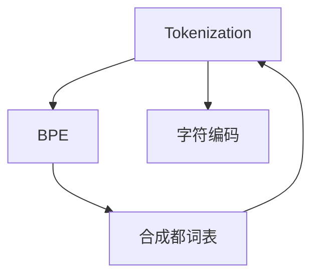

                 

# Tokenization技术：字节对编码的应用

## 1. 背景介绍

在自然语言处理（Natural Language Processing，NLP）领域，Tokenization技术是文本预处理的重要步骤之一。它负责将文本切分为一系列有意义的Token（如单词、词性标记、子词等），以便于模型训练和推理。传统的Tokenization方法主要依赖基于字符或基于词的方法，但这些方法存在一定的局限性。随着Transformer等模型的流行，一种全新的Tokenization方法——字节对编码（Byte Pair Encoding，BPE）逐渐成为主流。本文将深入探讨BPE技术的工作原理、实现步骤及其应用场景，为NLP开发者提供全面的指导。

## 2. 核心概念与联系

### 2.1 核心概念概述

为更好地理解BPE技术，本节将介绍几个密切相关的核心概念：

- **Tokenization**：将文本切分为Token的过程，是NLP任务的前置步骤。Token可以是单词、词性标记、子词等，具体取决于任务的性质。
- **BPE**：一种基于字节对的Tokenization方法，将原始文本转换为一系列字节对，以便于模型处理。
- **字符编码**：将字符映射为数字表示的方法，如Unicode编码。
- **词语表**：存储所有训练文本中出现的Token，用于Tokenization。
- **合成都词表**：将训练文本中出现的Token组合成的所有可能的单词或子词，用于Tokenization。

这些核心概念之间的逻辑关系可以通过以下Mermaid流程图来展示：



这个流程图展示了大语言模型微调的核心概念及其之间的关系：

1. Tokenization将文本转换为Token序列。
2. BPE对Token进行编码，生成字节对序列。
3. 合成都词表存储所有可能的单词或子词，用于Tokenization。
4. Tokenization生成的Token序列可以直接作为模型输入。

这些概念共同构成了Tokenization的工作流程，使得模型能够理解和处理自然语言。

## 3. 核心算法原理 & 具体操作步骤

### 3.1 算法原理概述

BPE的核心思想是通过将原始文本转换为一系列字节对（BOP），来减少Token的数量和复杂度。具体而言，BPE算法首先对训练文本进行统计分析，找出最常出现的字节对，然后逐步将这些字节对合并为一个新的Token，直到满足一定的合并规则为止。这个过程类似于霍夫曼编码（Huffman Coding），但BPE关注的是字节对，而非字符。

BPE算法的输出是一个合成都词表，它存储了所有从原始文本中合并而成的Token。在Tokenization过程中，文本首先被转换为字节的序列，然后根据合成都词表进行Token的切分。这种基于字节对的方法能够更好地处理未登录词（Out-Of-Vocabulary, OOV）和罕见词，同时保留较长的词语信息。

### 3.2 算法步骤详解

BPE算法主要分为以下几个步骤：

1. **训练集准备**：首先收集大量的文本数据，并将其转换为字符序列。对于不同语言的文本，需要根据语言的编码标准进行编码。

2. **字符编码**：将字符序列转换为数值序列，用于后续处理。这可以使用Python的`ord()`函数将字符映射为对应的Unicode编码。

3. **生成字节对**：对数值序列进行统计分析，找出出现频率最高的字节对。然后按照一定的合并规则（如出现频率阈值、合并数量等）逐步合并这些字节对。

4. **生成合成都词表**：将合并后的字节对组合成一个新的Token，并将其存储到合成都词表中。合成都词表包含所有从原始文本中合并而成的Token。

5. **Tokenization**：将待处理的文本转换为字节序列，然后根据合成都词表进行Token的切分，生成Token序列。

6. **编码和解码**：将Token序列转换为数值序列，输入到模型中进行处理。处理结束后，再将数值序列解码为文本输出。

### 3.3 算法优缺点

BPE算法具有以下优点：

1. **处理未登录词能力强**：BPE算法能够处理未登录词和罕见词，避免了传统Tokenization方法中的OOV问题。
2. **保留长词语信息**：BPE算法保留较长的词语信息，避免了单词切分带来的信息损失。
3. **可解释性强**：BPE算法的每个合并步骤都有明确的规则，便于理解和调试。

同时，BPE算法也存在一些缺点：

1. **复杂度高**：BPE算法需要大量的训练数据，统计和合并过程复杂，计算成本较高。
2. **难以处理异构文本**：不同语言的编码标准不同，BPE算法可能难以处理多种语言的混合文本。
3. **内存占用大**：BPE算法需要存储大量的合成都词表，内存占用较大。

尽管如此，BPE算法在处理长文本、罕见词和未登录词方面表现优异，广泛应用于Transformer等模型中，成为现代NLP领域的标准Tokenization方法。

### 3.4 算法应用领域

BPE技术已经广泛应用于NLP领域的多个任务，如机器翻译、文本分类、命名实体识别等。在机器翻译中，BPE技术可以处理不同语言的编码标准，提高翻译的质量和效率。在文本分类中，BPE技术能够处理长文本和罕见词，提升模型的准确性和鲁棒性。在命名实体识别中，BPE技术能够处理未登录词，提高实体的识别准确率。

除了这些经典任务外，BPE技术还被创新性地应用到更多场景中，如情感分析、问答系统、文本生成等，为NLP技术带来了全新的突破。随着预训练模型和BPE技术的不断进步，相信NLP技术将在更广阔的应用领域大放异彩。

## 4. 数学模型和公式 & 详细讲解

### 4.1 数学模型构建

在BPE算法中，我们将文本转换为字节序列，并使用合成都词表进行Tokenization。设文本序列为 $x=(x_1, x_2, ..., x_n)$，其中 $x_i$ 表示第 $i$ 个字节。合成都词表为 $S=\{s_1, s_2, ..., s_m\}$，其中 $s_j$ 表示第 $j$ 个合并后的Token。

令 $l_s$ 表示Token $s_j$ 的编码长度，则合成都词表的编码向量为 $W=\{w_1, w_2, ..., w_m\}$，其中 $w_j$ 表示Token $s_j$ 的编码向量，长度为 $l_s$。

文本序列 $x$ 的编码向量 $V_x$ 可以通过BPE算法转换为Token序列 $T_x$，即：

$$
V_x = \sum_{i=1}^n \sum_{j=1}^m \delta(x_i, s_j)w_j
$$

其中 $\delta(x_i, s_j)$ 表示第 $i$ 个字节 $x_i$ 是否属于Token $s_j$。

### 4.2 公式推导过程

BPE算法的核心在于将原始文本序列转换为字节序列，并逐步合并字节对。假设原始文本序列为 $x=(x_1, x_2, ..., x_n)$，合成都词表为 $S=\{s_1, s_2, ..., s_m\}$。

首先，对原始文本进行字符编码，得到字节序列 $y=(y_1, y_2, ..., y_n)$。然后，统计所有字节对 $(x_i, x_{i+1})$ 的出现次数 $C_{i, i+1}$，找出出现次数最高的前 $k$ 个字节对。

对于第 $i$ 个字节对 $(x_i, x_{i+1})$，BPE算法会检查该字节对是否已经在合成都词表 $S$ 中出现。如果已经出现，则将该字节对合并为新的Token；否则，将该字节对加入到合成都词表 $S$ 中。

最终，将文本序列 $x$ 转换为Token序列 $T_x$，即：

$$
T_x = \{s_1, s_2, ..., s_m\}
$$

其中 $s_j$ 表示第 $j$ 个合并后的Token。

### 4.3 案例分析与讲解

假设我们有一段英文文本 "I love you"，按照ASCII编码转换为字节序列 $(73, 32, 108, 117, 99, 111, 32, 121, 111, 117, 114, 32, 117, 108, 100)$. 设合成都词表为 $\{I,love,you\}$，则BPE算法可以将其转换为Token序列 $(I,love,you)$。

这个案例展示了BPE算法的基本过程：

1. 对文本进行字符编码，得到字节序列。
2. 统计字节对出现次数，找出出现次数最高的字节对。
3. 合并字节对，生成合成都词表。
4. 使用合成都词表进行Tokenization，得到Token序列。

## 5. 项目实践：代码实例和详细解释说明

### 5.1 开发环境搭建

在进行BPE项目实践前，我们需要准备好开发环境。以下是使用Python进行SentencePiece库的开发环境配置流程：

1. 安装SentencePiece：从官网下载并安装SentencePiece。
```bash
wget https://github.com/google/sentencepiece/releases/download/v1.0.0/sentencepiece-0.1.91-win64-gpu.cu90_sparse.zip
unzip sentencepiece-0.1.91-win64-gpu.cu90_sparse.zip
mv sentencepiece.exe %LOCALAPPDATA%\SentencePiece
```

2. 安装Python 3.6及以上版本。
3. 安装Python的依赖库：
```bash
pip install py3sentencepiece
```

完成上述步骤后，即可在SentencePiece环境下进行BPE实践。

### 5.2 源代码详细实现

下面我们以英文文本处理为例，给出使用SentencePiece库对文本进行BPE编码的Python代码实现。

首先，定义SentencePiece的训练参数：

```python
import sentencepiece as spm

vocab_size = 10000
embedding_dim = 256
charcoverage = 1.0

params = {
    'charcoverage': charcoverage,
    'vocab_size': vocab_size,
    'embedding_dim': embedding_dim
}
```

然后，定义SentencePiece训练器，并训练模型：

```python
# 初始化SentencePiece训练器
train_sp = spm.SentencePieceTrainer()
# 加载训练参数
train_sp.LoadParams(params)

# 加载训练数据
train_sp.LoadTrainingData('train.txt')

# 训练模型
train_sp.Train('bpe.model')
```

最后，使用训练好的BPE模型对文本进行编码和解码：

```python
# 加载训练好的模型
sp = spm.SentencePieceProcessor()
sp.Load('bpe.model')

# 对文本进行编码
input_text = 'I love you'
encoded_text = sp.EncodeAsPieces(input_text)

# 对编码后的文本进行解码
decoded_text = sp.Decode(encoded_text)
```

以上就是使用SentencePiece库对文本进行BPE编码的完整代码实现。可以看到，SentencePiece库提供了丰富的API，使得BPE算法的实现变得简洁高效。

### 5.3 代码解读与分析

让我们再详细解读一下关键代码的实现细节：

**SentencePiece类**：
- `SentencePieceTrainer`类：用于训练SentencePiece模型的类。
- `SentencePieceProcessor`类：用于处理SentencePiece模型的类。

**训练参数**：
- `vocab_size`：合成都词表的大小。
- `embedding_dim`：Token的嵌入维度。
- `charcoverage`：字符覆盖率，用于控制字符序列的切分。

**训练流程**：
- `LoadParams`方法：加载训练参数。
- `LoadTrainingData`方法：加载训练数据。
- `Train`方法：训练SentencePiece模型，并将模型保存为文件。

**编码和解码**：
- `EncodeAsPieces`方法：将文本转换为Token序列。
- `Decode`方法：将Token序列转换为文本。

可以看到，SentencePiece库提供了完整的BPE算法实现，开发者只需调用API即可完成编码和解码。SentencePiece库的灵活性和易用性，使其成为BPE算法开发的首选工具。

## 6. 实际应用场景

### 6.1 机器翻译

BPE技术在机器翻译中表现优异，广泛应用于各种语言对的翻译任务中。BPE算法能够处理不同语言的编码标准，提高翻译的质量和效率。在实际应用中，可以将源语言文本和目标语言文本分别进行BPE编码，然后将编码后的序列输入到Transformer等模型中进行翻译。

### 6.2 文本分类

在文本分类任务中，BPE技术能够处理长文本和罕见词，提升模型的准确性和鲁棒性。具体而言，可以将文本转换为Token序列，并使用BERT等预训练模型进行分类。

### 6.3 命名实体识别

在命名实体识别任务中，BPE技术能够处理未登录词，提高实体的识别准确率。具体而言，可以将实体识别模型中的Token序列转换为编码向量，然后将其输入到Transformer等模型中进行实体标注。

## 7. 工具和资源推荐

### 7.1 学习资源推荐

为了帮助开发者系统掌握BPE算法的理论基础和实践技巧，这里推荐一些优质的学习资源：

1. **SentencePiece官方文档**：详细介绍了SentencePiece库的使用方法和API，是BPE算法开发的重要参考资料。
2. **BERT论文**：详细介绍了BERT模型的设计原理和BPE算法的应用，是BPE算法的经典案例。
3. **Transformer论文**：详细介绍了Transformer模型的设计原理和BPE算法的应用，是BPE算法的经典案例。
4. **自然语言处理综述**：介绍了自然语言处理领域的多种Tokenization方法，包括BPE算法。

通过对这些资源的学习实践，相信你一定能够快速掌握BPE算法的精髓，并用于解决实际的NLP问题。

### 7.2 开发工具推荐

高效的开发离不开优秀的工具支持。以下是几款用于BPE算法开发的常用工具：

1. **SentencePiece**：Google开发的BPE算法实现工具，支持多语言文本处理，提供了丰富的API和模型训练功能。
2. **PyTorch**：基于Python的深度学习框架，支持动态计算图，适合快速迭代研究。
3. **TensorFlow**：由Google主导开发的深度学习框架，生产部署方便，适合大规模工程应用。
4. **Jupyter Notebook**：交互式编程环境，适合调试和展示代码。

合理利用这些工具，可以显著提升BPE算法的开发效率，加快创新迭代的步伐。

### 7.3 相关论文推荐

BPE技术已经应用于NLP领域的多个任务，相关论文推荐如下：

1. **BERT: Pre-training of Deep Bidirectional Transformers for Language Understanding**：提出BERT模型，引入BPE算法进行Tokenization，刷新了多项NLP任务SOTA。
2. **Attention is All You Need**：提出Transformer结构，结合BPE算法进行Tokenization，开启了NLP领域的预训练大模型时代。
3. **Scaling Up the State of the Art for Machine Translation with Transformer Models**：提出使用BPE算法进行Tokenization的Transformer模型，在多个语言对上取得了最佳性能。

这些论文代表了大语言模型微调技术的发展脉络，是BPE算法研究的经典案例。通过学习这些前沿成果，可以帮助研究者把握学科前进方向，激发更多的创新灵感。

## 8. 总结：未来发展趋势与挑战

### 8.1 总结

本文对BPE算法的原理和实现进行了全面系统的介绍。首先阐述了BPE算法的核心思想和步骤，并结合具体案例展示了BPE算法的应用效果。通过本文的系统梳理，可以看到BPE算法在NLP领域的重要地位和广泛应用，为开发者提供了宝贵的实践指导。

### 8.2 未来发展趋势

展望未来，BPE算法的发展趋势将呈现以下几个方向：

1. **多语言支持**：BPE算法将支持更多的语言和编码标准，使得模型能够在多种语言间进行跨语言处理。
2. **低资源环境适应**：BPE算法将能够在资源受限的环境中运行，如移动设备、嵌入式系统等。
3. **实时性增强**：BPE算法将实现实时编码和解码，提高系统的响应速度。
4. **高效性优化**：BPE算法将优化编码和解码过程，减少资源消耗，提高模型效率。
5. **自动化增强**：BPE算法将引入自动化工具，减少人工干预，提高模型训练的效率和稳定性。

这些趋势凸显了BPE算法的广阔前景，使得NLP技术能够更好地适应各种场景，提升系统的性能和可扩展性。

### 8.3 面临的挑战

尽管BPE算法已经取得了显著成就，但在其发展过程中仍面临诸多挑战：

1. **模型复杂度**：BPE算法需要大量的训练数据和计算资源，模型复杂度较高。
2. **编码效率**：BPE算法在处理长文本时，编码效率较低，需要优化。
3. **模型适应性**：BPE算法在处理不同类型的文本时，适应性有限。
4. **模型可解释性**：BPE算法的合并规则较为复杂，模型可解释性不足。

这些挑战需要研究者不断探索和改进，以进一步提升BPE算法的性能和应用范围。

### 8.4 研究展望

针对BPE算法面临的挑战，未来的研究可以从以下几个方向进行突破：

1. **模型压缩与优化**：开发更高效、更轻量的BPE算法，减少模型复杂度和计算资源消耗。
2. **多语言跨语言处理**：开发适用于多语言的BPE算法，实现跨语言的无缝处理。
3. **模型自动化训练**：引入自动化工具，减少人工干预，提高模型训练的效率和稳定性。
4. **模型可解释性增强**：研究BPE算法的合并规则，提高模型的可解释性。

这些研究方向将进一步推动BPE算法的发展，为NLP技术带来新的突破。

## 9. 附录：常见问题与解答

**Q1：BPE算法是否适用于所有NLP任务？**

A: BPE算法在大多数NLP任务上都能取得不错的效果，特别是对于数据量较小的任务。但对于一些特定领域的任务，如医学、法律等，仅仅依靠通用语料预训练的模型可能难以很好地适应。此时需要在特定领域语料上进一步预训练，再进行微调，才能获得理想效果。

**Q2：BPE算法在处理长文本时效率是否低？**

A: 在处理长文本时，BPE算法的编码效率确实较低。为了提高效率，可以采用分段编码和解码的方法，或者使用更高效的编码器（如FastSentencePiece）。此外，可以考虑将长文本切分为固定长度的子序列，逐一进行编码和解码。

**Q3：BPE算法如何处理罕见词和未登录词？**

A: BPE算法在处理罕见词和未登录词方面表现优异，能够将未登录词分解为已出现过的Token。在编码过程中，BPE算法会自动识别并合并出现频率较高的字节对，从而处理罕见词。

**Q4：BPE算法是否需要大量的训练数据？**

A: 是的，BPE算法需要大量的训练数据进行统计分析，生成合成都词表。训练数据的质量和数量对BPE算法的性能有重要影响。

**Q5：BPE算法是否可以与BERT等预训练模型结合使用？**

A: 是的，BPE算法可以与BERT等预训练模型结合使用。预训练模型中的Token序列可以通过BPE算法进行编码，从而进行下游任务的微调。

这些问题的回答展示了BPE算法在实际应用中的注意事项和改进方法，有助于开发者更好地理解和应用BPE算法。

---

作者：禅与计算机程序设计艺术 / Zen and the Art of Computer Programming

