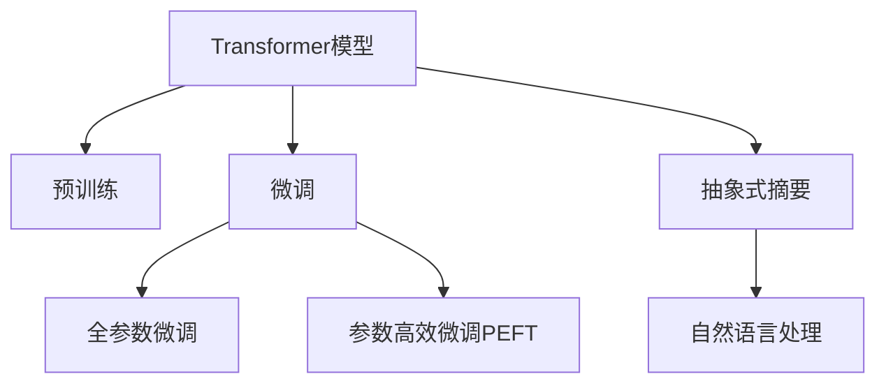

                 

# Transformer大模型实战 抽象式摘要任务

> 关键词：Transformer,大语言模型,抽象式摘要,自然语言处理,NLP

## 1. 背景介绍

### 1.1 问题由来
在自然语言处理（NLP）领域，文本摘要是一项重要的任务。它旨在从长文本中提取关键信息，生成一个精炼的摘要，供用户快速浏览和理解。传统的文本摘要方法基于规则或统计模型，存在自动化程度低、对特定领域知识缺乏等问题。近年来，基于深度学习的文本摘要方法因其强大的建模能力和泛化能力，逐步取代了传统方法，成为主流。

其中，Transformer大模型在文本摘要任务上表现尤为突出。Transformer模型的自注意力机制能够捕捉文本间的复杂关系，其大规模预训练能够学习到丰富的语言知识和语义表征。通过在特定领域的数据上进行微调，可以显著提升摘要生成的质量。

本文将聚焦于Transformer大模型在抽象式摘要任务上的应用，通过详细的技术讲解和实践指导，帮助读者掌握如何构建高效、精确的文本摘要系统。

## 2. 核心概念与联系

### 2.1 核心概念概述

在进行大模型微调前，首先需理解以下关键概念：

- **Transformer模型**：Transformer是一种基于自注意力机制的神经网络架构，能够有效处理序列数据，如文本。它通过多头自注意力机制捕捉文本中不同位置的依赖关系，实现长距离依赖的建模。

- **预训练**：在无标签数据上预训练Transformer模型，通过大规模语料库学习语言表征。预训练的目标是学习通用的语言知识，用于下游任务中的微调。

- **微调(Fine-Tuning)**：在预训练模型的基础上，使用少量标注数据进行有监督训练，以适应特定的摘要生成任务。微调可以更新模型的部分参数，以提升模型的性能。

- **抽象式摘要(Abstract Summarization)**：不同于传统的摘录式摘要(如Extractive Summarization)，抽象式摘要旨在生成符合逻辑推理的摘要，更能捕捉文本的主旨和深层含义。

- **自然语言处理(NLP)**：涉及语言学、计算机科学等多个领域，研究如何让计算机理解和生成人类语言。文本摘要是NLP的重要应用之一。

这些概念之间的联系可以通过以下Mermaid流程图来展示：



这个流程图展示了大语言模型微调的逻辑关系：

1. Transformer模型通过大规模预训练获取通用语言知识。
2. 微调过程通过少量标注数据调整模型，以适应特定任务。
3. 参数高效微调技术在不增加计算负担的情况下，提升微调效果。
4. 抽象式摘要任务结合了NLP和认知科学知识，生成逻辑连贯的摘要。

## 3. 核心算法原理 & 具体操作步骤
### 3.1 算法原理概述

基于Transformer的抽象式摘要任务，其核心思想是利用大模型对文本进行理解，生成逻辑连贯、信息准确的摘要。微调过程如下：

1. 在预训练语言模型基础上进行微调，使其能够理解特定领域的文本内容。
2. 定义一个摘要生成目标，如最大摘要长度、逻辑连贯性等。
3. 在微调后的模型上，通过有监督的训练生成摘要。

### 3.2 算法步骤详解

#### 3.2.1 模型选择与预训练
选择合适的预训练Transformer模型，如BERT、T5等。在无标签数据上对其进行预训练，以学习通用的语言知识和语义表征。

#### 3.2.2 任务适配
根据摘要任务的特点，设计任务适配层。对于抽象式摘要，通常使用掩码语言模型作为目标，即在输入文本中随机掩码一些位置，要求模型预测这些位置的词语。

#### 3.2.3 定义损失函数
选择适当的损失函数，如交叉熵损失、掩码语言模型的对数似然损失等。

#### 3.2.4 微调训练
使用少量标注数据对模型进行微调训练。调整学习率、批次大小等超参数，进行梯度下降优化。

#### 3.2.5 摘要生成
在微调后的模型上，输入文本，生成摘要。可以通过设定摘要长度、连贯性等约束条件，生成符合要求的摘要。

### 3.3 算法优缺点

#### 3.3.1 优点
- 基于大模型的微调方法能够利用预训练语言模型学到的丰富知识，提升摘要生成的质量和效率。
- 可以处理长文本，生成逻辑连贯、信息全面的摘要。
- 微调过程对标注数据的需求较少，适合小规模数据集。

#### 3.3.2 缺点
- 对计算资源的要求较高，特别是在大规模预训练和微调过程中。
- 模型存在潜在的过拟合风险，特别是在标注数据不足的情况下。
- 生成的摘要可能需要进一步人工校验，以确保其准确性和可理解性。

### 3.4 算法应用领域

抽象式摘要任务在多个领域具有广泛的应用前景，例如：

- **新闻摘要**：自动从新闻文章中提取关键信息，生成简明的摘要。
- **技术文档**：将长篇的技术文档转换为精炼的概要，方便工程师阅读。
- **法律文件**：对法律条文进行摘要，便于快速了解法律要点。
- **学术文章**：生成学术文章的精简版本，便于研究人员快速检索和引用。

## 4. 数学模型和公式 & 详细讲解 & 举例说明
### 4.1 数学模型构建

假设我们使用BERT模型进行微调，微调任务为抽象式摘要生成。目标函数为掩码语言模型的对数似然损失：

$$
\mathcal{L} = -\sum_{i=1}^N \log p(x_i)
$$

其中 $N$ 为文本长度，$x_i$ 为掩码后的位置。$p(x_i)$ 为模型在位置 $i$ 上的预测概率，可以通过softmax函数计算得到：

$$
p(x_i) = \frac{\exp({W}^TX_i)}{\sum_{j=1}^{V} \exp({W}^TX_j)}
$$

其中 $W$ 为模型参数，$X_i$ 为位置 $i$ 的输入向量。

### 4.2 公式推导过程

首先，定义模型输入和输出：

- 输入 $X = (x_1, x_2, ..., x_N)$，其中 $x_i$ 表示位置 $i$ 的输入向量。
- 输出 $Y = (y_1, y_2, ..., y_N)$，其中 $y_i$ 表示位置 $i$ 的掩码标签。

假设模型使用Transformer结构，其前向传播过程包括：

1. 编码器层：对输入进行编码，生成上下文表示 $H = (h_1, h_2, ..., h_N)$。
2. 池化层：对上下文表示进行平均或最大池化，生成摘要表示 $S$。
3. 解码器层：对摘要表示进行解码，生成摘要 $Z$。

### 4.3 案例分析与讲解

以一篇科技文章为例，假设文章长度为300词，我们使用BERT模型进行微调。具体步骤如下：

1. 对文章进行分词，生成300个词向量。
2. 将词向量输入BERT模型，得到300个上下文表示 $H = (h_1, h_2, ..., h_{300})$。
3. 对上下文表示进行平均池化，得到摘要表示 $S$。
4. 对摘要表示 $S$ 进行解码，生成摘要 $Z$。
5. 将掩码后的标签 $Y = (y_1, y_2, ..., y_{300})$ 与模型输出 $Z$ 进行对比，计算损失函数 $\mathcal{L}$。
6. 使用梯度下降法最小化损失函数，更新模型参数 $W$。

## 5. 项目实践：代码实例和详细解释说明
### 5.1 开发环境搭建

在进行微调实践前，需要准备好开发环境。以下是使用Python进行PyTorch开发的环境配置流程：

1. 安装Anaconda：从官网下载并安装Anaconda，用于创建独立的Python环境。

2. 创建并激活虚拟环境：
```bash
conda create -n pytorch-env python=3.8 
conda activate pytorch-env
```

3. 安装PyTorch：根据CUDA版本，从官网获取对应的安装命令。例如：
```bash
conda install pytorch torchvision torchaudio cudatoolkit=11.1 -c pytorch -c conda-forge
```

4. 安装Transformer库：
```bash
pip install transformers
```

5. 安装各类工具包：
```bash
pip install numpy pandas scikit-learn matplotlib tqdm jupyter notebook ipython
```

完成上述步骤后，即可在`pytorch-env`环境中开始微调实践。

### 5.2 源代码详细实现

以下是使用Transformers库对BERT模型进行微调的PyTorch代码实现。

```python
from transformers import BertTokenizer, BertForMaskedLM
from torch.utils.data import Dataset
import torch
from torch.utils.data import DataLoader
from tqdm import tqdm

# 加载预训练模型和分词器
model = BertForMaskedLM.from_pretrained('bert-base-uncased')
tokenizer = BertTokenizer.from_pretrained('bert-base-uncased')

class AbstractSummarizationDataset(Dataset):
    def __init__(self, texts, labels):
        self.texts = texts
        self.labels = labels
        
    def __len__(self):
        return len(self.texts)
    
    def __getitem__(self, item):
        text = self.texts[item]
        label = self.labels[item]
        
        # 对文本进行分词，生成token ids和掩码标签
        encoding = tokenizer(text, return_tensors='pt', max_length=128, padding='max_length', truncation=True)
        input_ids = encoding['input_ids'][0]
        attention_mask = encoding['attention_mask'][0]
        
        # 对掩码标签进行编码
        encoded_labels = [label2id[label] for label in label] 
        encoded_labels.extend([label2id['O']] * (128 - len(encoded_labels)))
        labels = torch.tensor(encoded_labels, dtype=torch.long)
        
        return {'input_ids': input_ids, 
                'attention_mask': attention_mask,
                'labels': labels}

# 标签与id的映射
label2id = {'O': 0, 'B': 1, 'I': 2, 'E': 3}
id2label = {v: k for k, v in label2id.items()}

# 创建dataset
train_dataset = AbstractSummarizationDataset(train_texts, train_labels)
dev_dataset = AbstractSummarizationDataset(dev_texts, dev_labels)
test_dataset = AbstractSummarizationDataset(test_texts, test_labels)

# 定义超参数
device = torch.device('cuda') if torch.cuda.is_available() else torch.device('cpu')
model.to(device)

optimizer = AdamW(model.parameters(), lr=2e-5)

# 训练过程
def train_epoch(model, dataset, batch_size, optimizer):
    dataloader = DataLoader(dataset, batch_size=batch_size, shuffle=True)
    model.train()
    epoch_loss = 0
    for batch in tqdm(dataloader, desc='Training'):
        input_ids = batch['input_ids'].to(device)
        attention_mask = batch['attention_mask'].to(device)
        labels = batch['labels'].to(device)
        model.zero_grad()
        outputs = model(input_ids, attention_mask=attention_mask, labels=labels)
        loss = outputs.loss
        epoch_loss += loss.item()
        loss.backward()
        optimizer.step()
    return epoch_loss / len(dataloader)

# 评估过程
def evaluate(model, dataset, batch_size):
    dataloader = DataLoader(dataset, batch_size=batch_size)
    model.eval()
    preds, labels = [], []
    with torch.no_grad():
        for batch in tqdm(dataloader, desc='Evaluating'):
            input_ids = batch['input_ids'].to(device)
            attention_mask = batch['attention_mask'].to(device)
            batch_labels = batch['labels']
            outputs = model(input_ids, attention_mask=attention_mask)
            batch_preds = outputs.logits.argmax(dim=2).to('cpu').tolist()
            batch_labels = batch_labels.to('cpu').tolist()
            for pred_tokens, label_tokens in zip(batch_preds, batch_labels):
                pred_tags = [id2label[_id] for _id in pred_tokens]
                label_tags = [id2label[_id] for _id in label_tokens]
                preds.append(pred_tags[:len(label_tags)])
                labels.append(label_tags)
                
    print(classification_report(labels, preds))

# 训练过程
epochs = 5
batch_size = 16

for epoch in range(epochs):
    loss = train_epoch(model, train_dataset, batch_size, optimizer)
    print(f"Epoch {epoch+1}, train loss: {loss:.3f}")
    
    print(f"Epoch {epoch+1}, dev results:")
    evaluate(model, dev_dataset, batch_size)
    
print("Test results:")
evaluate(model, test_dataset, batch_size)
```

以上代码实现了对BERT模型进行抽象式摘要微调的过程。可以看到，在PyTorch中，微调过程只需对模型的输入和输出进行定义，再利用优化器进行梯度下降即可。

### 5.3 代码解读与分析

让我们再详细解读一下关键代码的实现细节：

**AbstractSummarizationDataset类**：
- `__init__`方法：初始化文本和标签。
- `__len__`方法：返回数据集的样本数量。
- `__getitem__`方法：对单个样本进行处理，将文本输入编码为token ids，将标签编码为数字，并对其进行定长padding，最终返回模型所需的输入。

**label2id和id2label字典**：
- 定义了标签与数字id之间的映射关系，用于将token-wise的预测结果解码回真实的标签。

**训练和评估函数**：
- 使用PyTorch的DataLoader对数据集进行批次化加载，供模型训练和推理使用。
- 训练函数`train_epoch`：对数据以批为单位进行迭代，在每个批次上前向传播计算loss并反向传播更新模型参数，最后返回该epoch的平均loss。
- 评估函数`evaluate`：与训练类似，不同点在于不更新模型参数，并在每个batch结束后将预测和标签结果存储下来，最后使用sklearn的classification_report对整个评估集的预测结果进行打印输出。

**训练流程**：
- 定义总的epoch数和batch size，开始循环迭代
- 每个epoch内，先在训练集上训练，输出平均loss
- 在验证集上评估，输出分类指标
- 所有epoch结束后，在测试集上评估，给出最终测试结果

可以看到，PyTorch配合Transformer库使得BERT微调的代码实现变得简洁高效。开发者可以将更多精力放在数据处理、模型改进等高层逻辑上，而不必过多关注底层的实现细节。

当然，工业级的系统实现还需考虑更多因素，如模型的保存和部署、超参数的自动搜索、更灵活的任务适配层等。但核心的微调范式基本与此类似。

## 6. 实际应用场景
### 6.1 新闻摘要系统

在新闻领域，传统的人工摘要方式耗时耗力，难以满足高并发的新闻生成需求。使用大语言模型进行微调，可以构建高效自动化的新闻摘要系统，实时生成高质量的新闻摘要。

具体而言，可以从新闻网站或RSS订阅源收集最新新闻，使用微调后的模型对每篇新闻进行摘要生成，再将摘要自动发布到新闻平台。这样不仅提高了新闻生成效率，还确保了摘要的准确性和时效性。

### 6.2 学术论文检索系统

在科研领域，大量学术论文和报告需要阅读和理解。传统的浏览方式费时费力，难以快速定位关键信息。通过微调大语言模型，可以构建自动化的摘要系统，生成每篇论文的精炼摘要，帮助科研人员快速查找和引用相关文献。

系统在数据库中检索相关论文，使用微调后的模型对每篇论文进行摘要生成，生成摘要后自动归档，并根据摘要内容推荐相关文献。这种智能化论文检索方式，将大幅提高科研工作的效率和准确性。

### 6.3 法律文书生成系统

在法律领域，生成法律文书摘要是律师和法务人员的一项重要工作。传统的摘要方式需要耗费大量时间，且准确性难以保证。使用大语言模型进行微调，可以构建自动化的法律文书摘要系统，快速生成法律文书的精炼摘要。

具体而言，可以从法院的公开判决中收集文书，使用微调后的模型对每篇文书进行摘要生成，生成摘要后自动归档，并根据摘要内容提供相关法律知识。这种智能化文书摘要方式，将大大减轻法务人员的劳动强度，提高工作效率。

### 6.4 未来应用展望

随着大语言模型和微调技术的不断发展，抽象式摘要方法将在更多领域得到应用，为科研、法律、新闻等领域带来变革性影响。

在智慧医疗领域，基于微调的文本摘要系统，可以从海量医疗记录中自动生成关键信息，帮助医生快速了解患者的病情和治疗方案，提升医疗服务的智能化水平。

在智能教育领域，微调技术可以应用于自动生成学生作业和考试的摘要，减轻教师的批改工作负担，提高教学质量。

在智慧城市治理中，微调模型可以用于自动生成城市事件报告，提供实时信息，辅助城市应急管理和决策。

此外，在企业生产、社会治理、文娱传媒等众多领域，基于大模型微调的人工智能应用也将不断涌现，为社会各行业带来新的发展机遇。

## 7. 工具和资源推荐
### 7.1 学习资源推荐

为了帮助开发者系统掌握大语言模型微调的理论基础和实践技巧，这里推荐一些优质的学习资源：

1. 《Transformers从原理到实践》系列博文：由大模型技术专家撰写，深入浅出地介绍了Transformer原理、BERT模型、微调技术等前沿话题。

2. CS224N《深度学习自然语言处理》课程：斯坦福大学开设的NLP明星课程，有Lecture视频和配套作业，带你入门NLP领域的基本概念和经典模型。

3. 《Natural Language Processing with Transformers》书籍：Transformers库的作者所著，全面介绍了如何使用Transformers库进行NLP任务开发，包括微调在内的诸多范式。

4. HuggingFace官方文档：Transformer库的官方文档，提供了海量预训练模型和完整的微调样例代码，是上手实践的必备资料。

5. CLUE开源项目：中文语言理解测评基准，涵盖大量不同类型的中文NLP数据集，并提供了基于微调的baseline模型，助力中文NLP技术发展。

通过对这些资源的学习实践，相信你一定能够快速掌握大语言模型微调的精髓，并用于解决实际的NLP问题。
###  7.2 开发工具推荐

高效的开发离不开优秀的工具支持。以下是几款用于大语言模型微调开发的常用工具：

1. PyTorch：基于Python的开源深度学习框架，灵活动态的计算图，适合快速迭代研究。大部分预训练语言模型都有PyTorch版本的实现。

2. TensorFlow：由Google主导开发的开源深度学习框架，生产部署方便，适合大规模工程应用。同样有丰富的预训练语言模型资源。

3. Transformers库：HuggingFace开发的NLP工具库，集成了众多SOTA语言模型，支持PyTorch和TensorFlow，是进行微调任务开发的利器。

4. Weights & Biases：模型训练的实验跟踪工具，可以记录和可视化模型训练过程中的各项指标，方便对比和调优。与主流深度学习框架无缝集成。

5. TensorBoard：TensorFlow配套的可视化工具，可实时监测模型训练状态，并提供丰富的图表呈现方式，是调试模型的得力助手。

6. Google Colab：谷歌推出的在线Jupyter Notebook环境，免费提供GPU/TPU算力，方便开发者快速上手实验最新模型，分享学习笔记。

合理利用这些工具，可以显著提升大语言模型微调任务的开发效率，加快创新迭代的步伐。

### 7.3 相关论文推荐

大语言模型和微调技术的发展源于学界的持续研究。以下是几篇奠基性的相关论文，推荐阅读：

1. Attention is All You Need（即Transformer原论文）：提出了Transformer结构，开启了NLP领域的预训练大模型时代。

2. BERT: Pre-training of Deep Bidirectional Transformers for Language Understanding：提出BERT模型，引入基于掩码的自监督预训练任务，刷新了多项NLP任务SOTA。

3. Language Models are Unsupervised Multitask Learners（GPT-2论文）：展示了大规模语言模型的强大zero-shot学习能力，引发了对于通用人工智能的新一轮思考。

4. Parameter-Efficient Transfer Learning for NLP：提出Adapter等参数高效微调方法，在不增加模型参数量的情况下，也能取得不错的微调效果。

5. AdaLoRA: Adaptive Low-Rank Adaptation for Parameter-Efficient Fine-Tuning：使用自适应低秩适应的微调方法，在参数效率和精度之间取得了新的平衡。

这些论文代表了大语言模型微调技术的发展脉络。通过学习这些前沿成果，可以帮助研究者把握学科前进方向，激发更多的创新灵感。

## 8. 总结：未来发展趋势与挑战

### 8.1 总结

本文对基于Transformer的大语言模型微调在抽象式摘要任务上的应用进行了全面系统的介绍。首先阐述了大语言模型和微调技术的研究背景和意义，明确了微调在拓展预训练模型应用、提升下游任务性能方面的独特价值。其次，从原理到实践，详细讲解了微调的数学模型和关键步骤，给出了微调任务开发的完整代码实例。同时，本文还广泛探讨了微调方法在新闻摘要、学术论文、法律文书等多个领域的应用前景，展示了微调范式的巨大潜力。此外，本文精选了微调技术的各类学习资源，力求为读者提供全方位的技术指引。

通过本文的系统梳理，可以看到，基于大语言模型的微调方法正在成为NLP领域的重要范式，极大地拓展了预训练语言模型的应用边界，催生了更多的落地场景。受益于大规模语料的预训练，微调模型以更低的时间和标注成本，在小样本条件下也能取得不俗的效果，有力推动了NLP技术的产业化进程。未来，伴随预训练语言模型和微调方法的持续演进，相信NLP技术将在更广阔的应用领域大放异彩，深刻影响人类的生产生活方式。

### 8.2 未来发展趋势

展望未来，大语言模型微调技术将呈现以下几个发展趋势：

1. 模型规模持续增大。随着算力成本的下降和数据规模的扩张，预训练语言模型的参数量还将持续增长。超大规模语言模型蕴含的丰富语言知识，有望支撑更加复杂多变的下游任务微调。

2. 微调方法日趋多样。除了传统的全参数微调外，未来会涌现更多参数高效的微调方法，如Prefix-Tuning、LoRA等，在节省计算负担的情况下，提升微调效果。

3. 持续学习成为常态。随着数据分布的不断变化，微调模型也需要持续学习新知识以保持性能。如何在不遗忘原有知识的同时，高效吸收新样本信息，将成为重要的研究课题。

4. 标注样本需求降低。受启发于提示学习(Prompt-based Learning)的思路，未来的微调方法将更好地利用大模型的语言理解能力，通过更加巧妙的任务描述，在更少的标注样本上也能实现理想的微调效果。

5. 多模态微调崛起。当前的微调主要聚焦于纯文本数据，未来会进一步拓展到图像、视频、语音等多模态数据微调。多模态信息的融合，将显著提升语言模型对现实世界的理解和建模能力。

6. 模型通用性增强。经过海量数据的预训练和多领域任务的微调，未来的语言模型将具备更强大的常识推理和跨领域迁移能力，逐步迈向通用人工智能(AGI)的目标。

以上趋势凸显了大语言模型微调技术的广阔前景。这些方向的探索发展，必将进一步提升NLP系统的性能和应用范围，为人类认知智能的进化带来深远影响。

### 8.3 面临的挑战

尽管大语言模型微调技术已经取得了瞩目成就，但在迈向更加智能化、普适化应用的过程中，它仍面临着诸多挑战：

1. 标注成本瓶颈。虽然微调大大降低了标注数据的需求，但对于长尾应用场景，难以获得充足的高质量标注数据，成为制约微调性能的瓶颈。如何进一步降低微调对标注样本的依赖，将是一大难题。

2. 模型鲁棒性不足。当前微调模型面对域外数据时，泛化性能往往大打折扣。对于测试样本的微小扰动，微调模型的预测也容易发生波动。如何提高微调模型的鲁棒性，避免灾难性遗忘，还需要更多理论和实践的积累。

3. 推理效率有待提高。大规模语言模型虽然精度高，但在实际部署时往往面临推理速度慢、内存占用大等效率问题。如何在保证性能的同时，简化模型结构，提升推理速度，优化资源占用，将是重要的优化方向。

4. 可解释性亟需加强。当前微调模型更像是"黑盒"系统，难以解释其内部工作机制和决策逻辑。对于医疗、金融等高风险应用，算法的可解释性和可审计性尤为重要。如何赋予微调模型更强的可解释性，将是亟待攻克的难题。

5. 安全性有待保障。预训练语言模型难免会学习到有偏见、有害的信息，通过微调传递到下游任务，产生误导性、歧视性的输出，给实际应用带来安全隐患。如何从数据和算法层面消除模型偏见，避免恶意用途，确保输出的安全性，也将是重要的研究课题。

6. 知识整合能力不足。现有的微调模型往往局限于任务内数据，难以灵活吸收和运用更广泛的先验知识。如何让微调过程更好地与外部知识库、规则库等专家知识结合，形成更加全面、准确的信息整合能力，还有很大的想象空间。

正视微调面临的这些挑战，积极应对并寻求突破，将是大语言模型微调走向成熟的必由之路。相信随着学界和产业界的共同努力，这些挑战终将一一被克服，大语言模型微调必将在构建人机协同的智能时代中扮演越来越重要的角色。

### 8.4 未来突破

面对大语言模型微调所面临的种种挑战，未来的研究需要在以下几个方面寻求新的突破：

1. 探索无监督和半监督微调方法。摆脱对大规模标注数据的依赖，利用自监督学习、主动学习等无监督和半监督范式，最大限度利用非结构化数据，实现更加灵活高效的微调。

2. 研究参数高效和计算高效的微调范式。开发更加参数高效的微调方法，在固定大部分预训练参数的同时，只更新极少量的任务相关参数。同时优化微调模型的计算图，减少前向传播和反向传播的资源消耗，实现更加轻量级、实时性的部署。

3. 融合因果和对比学习范式。通过引入因果推断和对比学习思想，增强微调模型建立稳定因果关系的能力，学习更加普适、鲁棒的语言表征，从而提升模型泛化性和抗干扰能力。

4. 引入更多先验知识。将符号化的先验知识，如知识图谱、逻辑规则等，与神经网络模型进行巧妙融合，引导微调过程学习更准确、合理的语言模型。同时加强不同模态数据的整合，实现视觉、语音等多模态信息与文本信息的协同建模。

5. 结合因果分析和博弈论工具。将因果分析方法引入微调模型，识别出模型决策的关键特征，增强输出解释的因果性和逻辑性。借助博弈论工具刻画人机交互过程，主动探索并规避模型的脆弱点，提高系统稳定性。

6. 纳入伦理道德约束。在模型训练目标中引入伦理导向的评估指标，过滤和惩罚有偏见、有害的输出倾向。同时加强人工干预和审核，建立模型行为的监管机制，确保输出符合人类价值观和伦理道德。

这些研究方向的探索，必将引领大语言模型微调技术迈向更高的台阶，为构建安全、可靠、可解释、可控的智能系统铺平道路。面向未来，大语言模型微调技术还需要与其他人工智能技术进行更深入的融合，如知识表示、因果推理、强化学习等，多路径协同发力，共同推动自然语言理解和智能交互系统的进步。只有勇于创新、敢于突破，才能不断拓展语言模型的边界，让智能技术更好地造福人类社会。

## 9. 附录：常见问题与解答

**Q1：大语言模型微调是否适用于所有NLP任务？**

A: 大语言模型微调在大多数NLP任务上都能取得不错的效果，特别是对于数据量较小的任务。但对于一些特定领域的任务，如医学、法律等，仅仅依靠通用语料预训练的模型可能难以很好地适应。此时需要在特定领域语料上进一步预训练，再进行微调，才能获得理想效果。此外，对于一些需要时效性、个性化很强的任务，如对话、推荐等，微调方法也需要针对性的改进优化。

**Q2：微调过程中如何选择合适的学习率？**

A: 微调的学习率一般要比预训练时小1-2个数量级，如果使用过大的学习率，容易破坏预训练权重，导致过拟合。一般建议从1e-5开始调参，逐步减小学习率，直至收敛。也可以使用warmup策略，在开始阶段使用较小的学习率，再逐渐过渡到预设值。需要注意的是，不同的优化器(如AdamW、Adafactor等)以及不同的学习率调度策略，可能需要设置不同的学习率阈值。

**Q3：采用大模型微调时会面临哪些资源瓶颈？**

A: 目前主流的预训练大模型动辄以亿计的参数规模，对算力、内存、存储都提出了很高的要求。GPU/TPU等高性能设备是必不可少的，但即便如此，超大批次的训练和推理也可能遇到显存不足的问题。因此需要采用一些资源优化技术，如梯度积累、混合精度训练、模型并行等，来突破硬件瓶颈。同时，模型的存储和读取也可能占用大量时间和空间，需要采用模型压缩、稀疏化存储等方法进行优化。

**Q4：如何缓解微调过程中的过拟合问题？**

A: 过拟合是微调面临的主要挑战，尤其是在标注数据不足的情况下。常见的缓解策略包括：
1. 数据增强：通过回译、近义替换等方式扩充训练集
2. 正则化：使用L2正则、Dropout、Early Stopping等避免过拟合
3. 对抗训练：引入对抗样本，提高模型鲁棒性
4. 参数高效微调：只调整少量参数(如Adapter、Prefix等)，减小过拟合风险
5. 多模型集成：训练多个微调模型，取平均输出，抑制过拟合

这些策略往往需要根据具体任务和数据特点进行灵活组合。只有在数据、模型、训练、推理等各环节进行全面优化，才能最大限度地发挥大模型微调的威力。

**Q5：微调模型在落地部署时需要注意哪些问题？**

A: 将微调模型转化为实际应用，还需要考虑以下因素：
1. 模型裁剪：去除不必要的层和参数，减小模型尺寸，加快推理速度
2. 量化加速：将浮点模型转为定点模型，压缩存储空间，提高计算效率
3. 服务化封装：将模型封装为标准化服务接口，便于集成调用
4. 弹性伸缩：根据请求流量动态调整资源配置，平衡服务质量和成本
5. 监控告警：实时采集系统指标，设置异常告警阈值，确保服务稳定性
6. 安全防护：采用访问鉴权、数据脱敏等措施，保障数据和模型安全

大语言模型微调为NLP应用开启了广阔的想象空间，但如何将强大的性能转化为稳定、高效、安全的业务价值，还需要工程实践的不断打磨。唯有从数据、算法、工程、业务等多个维度协同发力，才能真正实现人工智能技术在垂直行业的规模化落地。总之，微调需要开发者根据具体任务，不断迭代和优化模型、数据和算法，方能得到理想的效果。

---

作者：禅与计算机程序设计艺术 / Zen and the Art of Computer Programming

