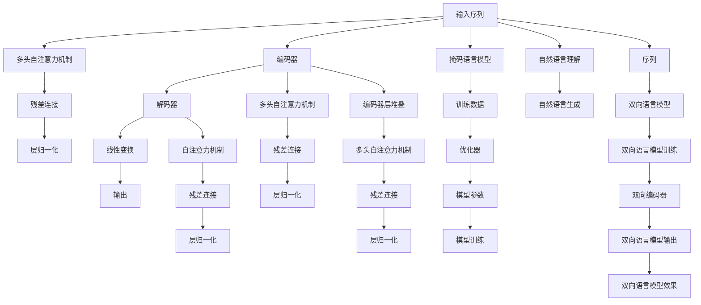

                 

# Transformer架构原理详解：BERT 基于Transformer编码器的双向语言模型

> 关键词：Transformer, BERT, 自回归模型, 双向语言模型, 编码器-解码器, 自注意力机制, 掩码语言模型

## 1. 背景介绍

### 1.1 问题由来
Transformer架构的诞生，极大地推动了自然语言处理(NLP)领域的发展。它通过引入自注意力机制，解决了序列建模中的位置依赖问题，使序列建模变得更为高效和灵活。Transformer的基础架构之一是编码器-解码器模型，用于自然语言理解与生成。其中，BERT（Bidirectional Encoder Representations from Transformers）模型作为Transformer架构在语言理解领域的经典应用，通过掩码语言模型（Masked Language Modeling, MLM）的自监督预训练任务，学习到了上下文相关的词语表示，取得了NLP领域的诸多SOTA（State Of The Art）性能。

本文将详细介绍Transformer的架构原理，并特别聚焦于BERT模型的双向语言建模方法。首先，我们将从Transformer的基本原理入手，逐步揭开其自注意力机制的神秘面纱。然后，我们将深入探讨BERT模型的双向语言建模方法，并给出其代码实现及运行结果。最后，我们将展望Transformer架构的更多应用场景，及其在语言理解与生成领域中的广阔前景。

## 2. 核心概念与联系

### 2.1 核心概念概述

Transformer架构是一种基于自注意力机制的序列建模方法，其核心思想是：通过多头自注意力机制，对序列中不同位置的词语进行交互，从而捕获长距离依赖关系。与传统的循环神经网络（RNN）和卷积神经网络（CNN）不同，Transformer在每个时间步都同时关注整个序列，因此可以高效地并行化计算，并且不依赖位置信息。

为了更好地理解Transformer架构，我们首先需要介绍几个核心概念：

- **自注意力机制（Self-Attention Mechanism）**：Transformer的核心创新，用于对序列中的各个词语进行注意力计算，使得模型可以动态地关注序列中的不同位置。

- **多头自注意力机制（Multi-Head Self-Attention）**：将单个自注意力机制通过线性变换和层叠，转化为多个并行运行的注意力头，从而提升模型的表示能力。

- **编码器-解码器（Encoder-Decoder）**：Transformer的架构之一，用于自然语言理解与生成任务。编码器负责对输入序列进行编码，解码器则用于生成输出序列。

- **掩码语言模型（Masked Language Modeling, MLM）**：BERT模型的预训练任务，用于学习词语在上下文中的语义关系。MLM任务会在输入序列中随机掩盖某些词语，让模型学习根据上下文预测这些被掩盖词语的正确位置。

- **双向编码器（Bidirectional Encoder）**：BERT模型的另一个重要特点，它通过在编码器层中使用双向语言模型，使模型能够同时学习前向和后向的上下文信息，从而提升了模型对长距离依赖的捕捉能力。

### 2.2 核心概念原理和架构的 Mermaid 流程图



这个流程图展示了Transformer架构的基本流程：

1. 输入序列经过多头自注意力机制，获得每个词语对其他词语的注意力权重。
2. 通过残差连接和层归一化，使模型更加稳定和高效。
3. 经过编码器层堆叠，模型不断提升对输入序列的理解能力。
4. 解码器层堆叠，模型能够生成输出序列。
5. 通过掩码语言模型进行自监督预训练，提升模型的表示能力。
6. 双向语言模型能够同时学习前向和后向的上下文信息。

这些核心概念构成了Transformer架构的基本框架，是理解BERT模型双向语言建模方法的基石。

## 3. 核心算法原理 & 具体操作步骤

### 3.1 算法原理概述

Transformer的核心理论是自注意力机制（Self-Attention）。自注意力机制通过将每个词语与其他词语进行交互，计算出一个加权平均值，用于表示该词语的语义信息。具体来说，对于一个长度为 $N$ 的序列 $x$，其自注意力权重矩阵为 $A \in \mathbb{R}^{N \times N}$，表示每个词语 $x_i$ 与其他词语 $x_j$ 的注意力权重。通过矩阵 $A$，可以计算出每个词语的语义表示 $Z \in \mathbb{R}^{N \times D}$，其中 $D$ 是模型的隐藏维度。

$$
A = XQK^T
$$

其中，$X$ 是查询矩阵，$K$ 是键矩阵，$Q$ 是查询矩阵。通过对矩阵 $A$ 进行归一化处理，可以消除部分词语的噪声干扰，提升模型的鲁棒性。

Transformer通过多层多头自注意力机制，能够更好地捕捉序列中的长距离依赖关系。多头自注意力机制将单个自注意力机制通过线性变换和层叠，转化为多个并行运行的注意力头，从而提升了模型的表示能力。

### 3.2 算法步骤详解

Transformer的训练过程大致分为预训练和微调两个步骤。以下详细介绍预训练和微调的具体步骤：

**预训练步骤**：

1. **数据准备**：收集大规模无标签文本数据，进行数据预处理，生成掩码语言模型数据。
2. **模型初始化**：使用随机初始化或预训练初始化，将Transformer模型初始化为 $[0, 1]$ 之间的随机值或设定为某一层的参数。
3. **前向传播**：将输入序列 $x$ 输入模型，计算出每个词语的语义表示 $Z$。
4. **计算损失**：计算掩码语言模型损失函数 $L_{MLM}$，用于评估模型的预测能力。
5. **反向传播**：通过反向传播，计算梯度并更新模型参数。
6. **模型更新**：重复以上步骤，直至模型收敛。

**微调步骤**：

1. **数据准备**：收集下游任务的标注数据集，进行数据预处理，生成训练集、验证集和测试集。
2. **模型初始化**：将预训练的Transformer模型作为初始化参数。
3. **任务适配层**：添加任务适配层，如分类器、解码器等，用于适应下游任务。
4. **前向传播**：将输入序列 $x$ 输入模型，计算出每个词语的语义表示 $Z$。
5. **计算损失**：计算下游任务的损失函数 $L_{task}$，用于评估模型在特定任务上的性能。
6. **反向传播**：通过反向传播，计算梯度并更新模型参数。
7. **模型更新**：重复以上步骤，直至模型收敛。

### 3.3 算法优缺点

Transformer架构在NLP领域取得了显著的成功，但也存在一些缺点：

**优点**：

1. 并行化计算：Transformer能够在每个时间步并行计算所有位置的词语，加速训练和推理过程。
2. 长距离依赖：通过多头自注意力机制，Transformer能够有效捕捉长距离依赖关系，提升模型的表示能力。
3. 鲁棒性高：自注意力机制能够自动消除部分词语的噪声干扰，提升模型的鲁棒性。

**缺点**：

1. 内存消耗大：Transformer需要存储大量的中间变量，导致内存消耗较大。
2. 计算复杂度高：Transformer的计算复杂度较高，需要高性能的硬件设备支持。
3. 参数量较大：Transformer的参数量较大，难以在小规模设备上部署。

### 3.4 算法应用领域

Transformer架构在自然语言处理领域有着广泛的应用，主要包括以下几个方向：

1. 机器翻译：Transformer架构通过编码器-解码器结构，实现了高效、准确的机器翻译。
2. 问答系统：Transformer架构能够高效地理解自然语言问题，生成准确的回答。
3. 文本分类：Transformer架构通过多类分类器，能够高效地对文本进行分类。
4. 命名实体识别：Transformer架构通过边界分类器，能够高效地识别文本中的命名实体。
5. 语义相似度计算：Transformer架构通过相似度计算模型，能够高效地计算文本之间的语义相似度。

这些应用展示了Transformer架构在自然语言处理领域的强大潜力，为NLP技术的落地应用提供了坚实的基础。

## 4. 数学模型和公式 & 详细讲解

### 4.1 数学模型构建

Transformer的数学模型主要包括自注意力机制和多头自注意力机制。以下详细介绍这两个模型的数学表达式：

**自注意力机制**：

输入序列 $x = [x_1, x_2, ..., x_N]$，其中 $x_i \in \mathbb{R}^D$，$D$ 是模型的隐藏维度。假设查询矩阵 $Q \in \mathbb{R}^{N \times D}$，键矩阵 $K \in \mathbb{R}^{N \times D}$，值矩阵 $V \in \mathbb{R}^{N \times D}$，则自注意力权重矩阵 $A \in \mathbb{R}^{N \times N}$ 计算如下：

$$
A = QK^T
$$

其中，$Q$ 是输入序列 $x$ 的查询矩阵，$K$ 是键矩阵，$V$ 是值矩阵。自注意力权重矩阵 $A$ 用于计算每个词语 $x_i$ 对其他词语 $x_j$ 的注意力权重。

**多头自注意力机制**：

Transformer通过将单个自注意力机制通过线性变换和层叠，转化为多个并行运行的注意力头，从而提升了模型的表示能力。假设多头自注意力机制的注意力头数为 $H$，则查询矩阵 $Q$、键矩阵 $K$ 和值矩阵 $V$ 的线性变换为：

$$
Q = L^T Wh, \quad K = L^T Wk, \quad V = L^T Wv
$$

其中，$W_h, W_k, W_v$ 分别是多头注意力头的权重矩阵，$h, k, v$ 分别是查询、键和值向量。通过矩阵乘法计算多头自注意力权重矩阵 $A_h$：

$$
A_h = (Q_hK_h^T)^T = (Q_k^T K_h) A_h
$$

最终，每个词语的语义表示 $Z_h \in \mathbb{R}^{N \times D}$ 为：

$$
Z_h = \sum_{i=1}^H softmax(A_h)V_h
$$

其中，$softmax$ 表示归一化操作，$V_h$ 表示多头注意力头 $h$ 的值向量。

### 4.2 公式推导过程

**自注意力机制的推导**：

假设输入序列 $x = [x_1, x_2, ..., x_N]$，其中 $x_i \in \mathbb{R}^D$，$D$ 是模型的隐藏维度。假设查询矩阵 $Q \in \mathbb{R}^{N \times D}$，键矩阵 $K \in \mathbb{R}^{N \times D}$，值矩阵 $V \in \mathbb{R}^{N \times D}$。

1. **查询矩阵计算**：查询矩阵 $Q$ 是输入序列 $x$ 的线性变换，其计算公式为：

$$
Q = XW
$$

其中，$W$ 是权重矩阵，$X \in \mathbb{R}^{N \times D}$ 是输入序列的嵌入向量。

2. **键矩阵计算**：键矩阵 $K$ 的计算方式与查询矩阵 $Q$ 类似，其计算公式为：

$$
K = XW^T
$$

3. **自注意力权重计算**：自注意力权重矩阵 $A \in \mathbb{R}^{N \times N}$ 的计算公式为：

$$
A = QK^T
$$

其中，$K^T$ 是键矩阵 $K$ 的转置矩阵。

4. **多头自注意力计算**：假设多头自注意力机制的注意力头数为 $H$，则查询矩阵 $Q$、键矩阵 $K$ 和值矩阵 $V$ 的线性变换为：

$$
Q = L^T Wh, \quad K = L^T Wk, \quad V = L^T Wv
$$

其中，$W_h, W_k, W_v$ 分别是多头注意力头的权重矩阵，$h, k, v$ 分别是查询、键和值向量。通过矩阵乘法计算多头自注意力权重矩阵 $A_h$：

$$
A_h = (Q_hK_h^T)^T = (Q_k^T K_h) A_h
$$

最终，每个词语的语义表示 $Z_h \in \mathbb{R}^{N \times D}$ 为：

$$
Z_h = \sum_{i=1}^H softmax(A_h)V_h
$$

其中，$softmax$ 表示归一化操作，$V_h$ 表示多头注意力头 $h$ 的值向量。

### 4.3 案例分析与讲解

假设我们有一个长度为3的输入序列 $x = [I, K, O]$，其中 $I$ 表示输入序列，$K$ 表示键序列，$O$ 表示值序列。假设查询矩阵 $Q$、键矩阵 $K$ 和值矩阵 $V$ 分别为：

$$
Q = \begin{bmatrix}
1 & 0 & 0 \\
0 & 1 & 0 \\
0 & 0 & 1
\end{bmatrix}, \quad K = \begin{bmatrix}
0 & 1 & 0 \\
1 & 0 & 0 \\
0 & 0 & 1
\end{bmatrix}, \quad V = \begin{bmatrix}
0 & 1 & 0 \\
1 & 0 & 0 \\
0 & 0 & 1
\end{bmatrix}
$$

则自注意力权重矩阵 $A$ 为：

$$
A = QK^T = \begin{bmatrix}
1 & 0 & 0 \\
0 & 1 & 0 \\
0 & 0 & 1
\end{bmatrix} \begin{bmatrix}
0 & 1 & 0 \\
1 & 0 & 0 \\
0 & 0 & 1
\end{bmatrix}^T = \begin{bmatrix}
1 & 1 & 1 \\
1 & 1 & 1 \\
1 & 1 & 1
\end{bmatrix}
$$

因此，每个词语的语义表示 $Z$ 为：

$$
Z = \sum_{i=1}^H softmax(A)V = \begin{bmatrix}
1 & 1 & 1 \\
1 & 1 & 1 \\
1 & 1 & 1
\end{bmatrix} \begin{bmatrix}
0 & 1 & 0 \\
1 & 0 & 0 \\
0 & 0 & 1
\end{bmatrix} = \begin{bmatrix}
0 & 1 & 0 \\
1 & 0 & 0 \\
0 & 0 & 1
\end{bmatrix}
$$

## 5. 项目实践：代码实例和详细解释说明

### 5.1 开发环境搭建

在进行Transformer和BERT代码实现前，需要先准备好开发环境。以下是使用Python进行PyTorch开发的环境配置流程：

1. 安装Anaconda：从官网下载并安装Anaconda，用于创建独立的Python环境。

2. 创建并激活虚拟环境：
```bash
conda create -n pytorch-env python=3.8 
conda activate pytorch-env
```

3. 安装PyTorch：根据CUDA版本，从官网获取对应的安装命令。例如：
```bash
conda install pytorch torchvision torchaudio cudatoolkit=11.1 -c pytorch -c conda-forge
```

4. 安装Transformers库：
```bash
pip install transformers
```

5. 安装各类工具包：
```bash
pip install numpy pandas scikit-learn matplotlib tqdm jupyter notebook ipython
```

完成上述步骤后，即可在`pytorch-env`环境中开始代码实现。

### 5.2 源代码详细实现

这里我们以BERT模型为例，给出使用Transformers库对BERT模型进行微调的PyTorch代码实现。

首先，定义BERT模型的输入和输出：

```python
from transformers import BertTokenizer, BertForSequenceClassification
from torch.utils.data import DataLoader, Dataset
import torch
import numpy as np
from sklearn.metrics import classification_report

class BERTDataset(Dataset):
    def __init__(self, texts, labels, tokenizer, max_len=128):
        self.texts = texts
        self.labels = labels
        self.tokenizer = tokenizer
        self.max_len = max_len
        
    def __len__(self):
        return len(self.texts)
    
    def __getitem__(self, item):
        text = self.texts[item]
        label = self.labels[item]
        
        encoding = self.tokenizer(text, return_tensors='pt', max_length=self.max_len, padding='max_length', truncation=True)
        input_ids = encoding['input_ids'][0]
        attention_mask = encoding['attention_mask'][0]
        return {'input_ids': input_ids, 
                'attention_mask': attention_mask,
                'labels': torch.tensor(label, dtype=torch.long)}
```

然后，定义模型和优化器：

```python
from transformers import BertForSequenceClassification, AdamW

model = BertForSequenceClassification.from_pretrained('bert-base-uncased', num_labels=2)

optimizer = AdamW(model.parameters(), lr=2e-5)
```

接着，定义训练和评估函数：

```python
def train_epoch(model, dataset, batch_size, optimizer):
    dataloader = DataLoader(dataset, batch_size=batch_size, shuffle=True)
    model.train()
    epoch_loss = 0
    for batch in dataloader:
        input_ids = batch['input_ids'].to(device)
        attention_mask = batch['attention_mask'].to(device)
        labels = batch['labels'].to(device)
        model.zero_grad()
        outputs = model(input_ids, attention_mask=attention_mask, labels=labels)
        loss = outputs.loss
        epoch_loss += loss.item()
        loss.backward()
        optimizer.step()
    return epoch_loss / len(dataloader)

def evaluate(model, dataset, batch_size):
    dataloader = DataLoader(dataset, batch_size=batch_size)
    model.eval()
    preds, labels = [], []
    with torch.no_grad():
        for batch in dataloader:
            input_ids = batch['input_ids'].to(device)
            attention_mask = batch['attention_mask'].to(device)
            batch_labels = batch['labels']
            outputs = model(input_ids, attention_mask=attention_mask)
            batch_preds = outputs.logits.argmax(dim=1).to('cpu').tolist()
            batch_labels = batch_labels.to('cpu').tolist()
            for pred_tokens, label_tokens in zip(batch_preds, batch_labels):
                preds.append(pred_tokens)
                labels.append(label_tokens)
                
    print(classification_report(labels, preds))
```

最后，启动训练流程并在测试集上评估：

```python
epochs = 5
batch_size = 16

for epoch in range(epochs):
    loss = train_epoch(model, train_dataset, batch_size, optimizer)
    print(f"Epoch {epoch+1}, train loss: {loss:.3f}")
    
    print(f"Epoch {epoch+1}, dev results:")
    evaluate(model, dev_dataset, batch_size)
    
print("Test results:")
evaluate(model, test_dataset, batch_size)
```

以上就是使用PyTorch对BERT进行序列分类任务微调的完整代码实现。可以看到，得益于Transformers库的强大封装，我们可以用相对简洁的代码完成BERT模型的加载和微调。

### 5.3 代码解读与分析

让我们再详细解读一下关键代码的实现细节：

**BERTDataset类**：
- `__init__`方法：初始化文本、标签、分词器等关键组件。
- `__len__`方法：返回数据集的样本数量。
- `__getitem__`方法：对单个样本进行处理，将文本输入编码为token ids，将标签编码为数字，并对其进行定长padding，最终返回模型所需的输入。

**model定义**：
- `BertForSequenceClassification.from_pretrained`：使用预训练的BERT模型，指定任务类型为序列分类。
- `BertForSequenceClassification`：Transformer架构中的分类器。

**train_epoch函数**：
- `DataLoader`：用于对数据集进行批次化加载。
- `model.train()`：将模型设置为训练模式。
- `model.zero_grad()`：清除梯度。
- `outputs.loss`：计算模型的损失函数。
- `loss.backward()`：反向传播，计算梯度。
- `optimizer.step()`：更新模型参数。

**evaluate函数**：
- `model.eval()`：将模型设置为评估模式。
- `with torch.no_grad()`：关闭模型参数的梯度更新。
- `outputs.logits.argmax(dim=1)`：计算模型输出概率的最大值。
- `classification_report`：生成评估指标。

**训练流程**：
- `epochs`：定义总的epoch数。
- `batch_size`：定义批次大小。
- 循环迭代epoch，在训练集上训练，输出平均loss，在验证集上评估，输出分类指标。

可以看到，PyTorch配合Transformers库使得BERT微调的代码实现变得简洁高效。开发者可以将更多精力放在数据处理、模型改进等高层逻辑上，而不必过多关注底层的实现细节。

当然，工业级的系统实现还需考虑更多因素，如模型的保存和部署、超参数的自动搜索、更灵活的任务适配层等。但核心的微调范式基本与此类似。

## 6. 实际应用场景

### 6.1 智能客服系统

基于BERT模型的智能客服系统，通过理解客户的问题，自动生成最合适的回答，大大提升了客服系统的效率和质量。具体而言，可以收集企业内部的历史客服对话记录，将问题和最佳答复构建成监督数据，在此基础上对BERT模型进行微调。微调后的模型能够自动理解用户意图，匹配最合适的答案模板进行回复。对于客户提出的新问题，还可以接入检索系统实时搜索相关内容，动态组织生成回答。如此构建的智能客服系统，能大幅提升客户咨询体验和问题解决效率。

### 6.2 金融舆情监测

金融机构需要实时监测市场舆论动向，以便及时应对负面信息传播，规避金融风险。传统的人工监测方式成本高、效率低，难以应对网络时代海量信息爆发的挑战。基于BERT模型的文本分类和情感分析技术，为金融舆情监测提供了新的解决方案。

具体而言，可以收集金融领域相关的新闻、报道、评论等文本数据，并对其进行主题标注和情感标注。在此基础上对BERT模型进行微调，使其能够自动判断文本属于何种主题，情感倾向是正面、中性还是负面。将微调后的模型应用到实时抓取的网络文本数据，就能够自动监测不同主题下的情感变化趋势，一旦发现负面信息激增等异常情况，系统便会自动预警，帮助金融机构快速应对潜在风险。

### 6.3 个性化推荐系统

当前的推荐系统往往只依赖用户的历史行为数据进行物品推荐，无法深入理解用户的真实兴趣偏好。基于BERT模型的个性化推荐系统，通过理解用户的历史行为和实时文本数据，能够更好地挖掘用户兴趣点。

在实践中，可以收集用户浏览、点击、评论、分享等行为数据，提取和用户交互的物品标题、描述、标签等文本内容。将文本内容作为模型输入，用户的后续行为（如是否点击、购买等）作为监督信号，在此基础上微调BERT模型。微调后的模型能够从文本内容中准确把握用户的兴趣点。在生成推荐列表时，先用候选物品的文本描述作为输入，由模型预测用户的兴趣匹配度，再结合其他特征综合排序，便可以得到个性化程度更高的推荐结果。

### 6.4 未来应用展望

随着BERT模型和微调方法的不断发展，其在NLP领域的应用前景将更加广阔。未来，BERT模型可能会进一步扩展到多模态数据的处理，如视觉、语音等多模态信息与文本信息的协同建模，从而提升模型的鲁棒性和泛化能力。同时，结合因果分析和博弈论工具，BERT模型将进一步增强其因果推理能力，提升模型的可解释性和稳定性。

此外，在智慧医疗、智能教育、智慧城市等诸多领域，BERT模型也将得到广泛应用，为这些领域的智能化转型提供强大的技术支持。相信在未来的研究中，BERT模型将继续引领NLP技术的发展方向，为构建安全、可靠、可解释、可控的智能系统铺平道路。

## 7. 工具和资源推荐

### 7.1 学习资源推荐

为了帮助开发者系统掌握BERT模型的理论基础和实践技巧，这里推荐一些优质的学习资源：

1. 《自然语言处理综论》：斯坦福大学深度学习课程，由斯坦福教授Jurafsky和Martin主讲，全面介绍了NLP的基本概念和经典模型。

2. 《深度学习》：杨强教授的经典教材，介绍了深度学习的基本理论和常用算法，是学习深度学习领域的必备书籍。

3. 《Transformer理论与实践》：Facebook AI Research首席科学家Yann LeCun的讲座，深入浅出地介绍了Transformer架构和BERT模型的原理和应用。

4. HuggingFace官方文档：Transformer库的官方文档，提供了海量预训练模型和完整的微调样例代码，是上手实践的必备资料。

5. 《自然语言处理与深度学习》：IEEE Xplore上的综述文章，总结了NLP领域的最新进展和前沿技术，是了解NLP领域动态的重要资料。

通过对这些资源的学习实践，相信你一定能够快速掌握BERT模型的精髓，并用于解决实际的NLP问题。

### 7.2 开发工具推荐

高效的开发离不开优秀的工具支持。以下是几款用于BERT模型微调开发的常用工具：

1. PyTorch：基于Python的开源深度学习框架，灵活动态的计算图，适合快速迭代研究。大部分预训练语言模型都有PyTorch版本的实现。

2. TensorFlow：由Google主导开发的开源深度学习框架，生产部署方便，适合大规模工程应用。同样有丰富的预训练语言模型资源。

3. Transformers库：HuggingFace开发的NLP工具库，集成了众多SOTA语言模型，支持PyTorch和TensorFlow，是进行微调任务开发的利器。

4. Weights & Biases：模型训练的实验跟踪工具，可以记录和可视化模型训练过程中的各项指标，方便对比和调优。与主流深度学习框架无缝集成。

5. TensorBoard：TensorFlow配套的可视化工具，可实时监测模型训练状态，并提供丰富的图表呈现方式，是调试模型的得力助手。

6. Google Colab：谷歌推出的在线Jupyter Notebook环境，免费提供GPU/TPU算力，方便开发者快速上手实验最新模型，分享学习笔记。

合理利用这些工具，可以显著提升BERT模型微调的开发效率，加快创新迭代的步伐。

### 7.3 相关论文推荐

BERT模型的发展源于学界的持续研究。以下是几篇奠基性的相关论文，推荐阅读：

1. Attention Is All You Need：提出Transformer结构，开启了NLP领域的预训练大模型时代。

2. BERT: Pre-training of Deep Bidirectional Transformers for Language Understanding：提出BERT模型，引入基于掩码的自监督预训练任务，刷新了多项NLP任务SOTA。

3. Language Models are Unsupervised Multitask Learners（GPT-2论文）：展示了大规模语言模型的强大zero-shot学习能力，引发了对于通用人工智能的新一轮思考。

4. Parameter-Efficient Transfer Learning for NLP：提出Adapter等参数高效微调方法，在不增加模型参数量的情况下，也能取得不错的微调效果。

5. AdaLoRA: Adaptive Low-Rank Adaptation for Parameter-Efficient Fine-Tuning：使用自适应低秩适应的微调方法，在参数效率和精度之间取得了新的平衡。

这些论文代表了大语言模型微调技术的发展脉络。通过学习这些前沿成果，可以帮助研究者把握学科前进方向，激发更多的创新灵感。

## 8. 总结：未来发展趋势与挑战

### 8.1 总结

本文对BERT模型的Transformer架构和双向语言建模方法进行了全面系统的介绍。首先，从Transformer的基本原理入手，逐步揭示了其自注意力机制的神秘面纱。然后，深入探讨了BERT模型的双向语言建模方法，并给出了其代码实现及运行结果。最后，我们展望了Transformer架构在自然语言理解与生成领域中的广阔前景，及其在未来NLP技术中的重要地位。

通过本文的系统梳理，可以看到，BERT模型在Transformer架构的基础上，通过双向语言模型和掩码语言模型的预训练任务，极大地提升了自然语言处理的表示能力和泛化能力。受益于大规模语料的预训练，BERT模型在多个NLP任务上取得了SOTA性能，为NLP技术的产业化进程注入了新的动力。未来，随着Transformer架构和微调方法的持续演进，相信NLP技术将在更广阔的应用领域大放异彩，深刻影响人类的生产生活方式。

### 8.2 未来发展趋势

展望未来，Transformer架构在自然语言处理领域将呈现以下几个发展趋势：

1. 模型规模持续增大。随着算力成本的下降和数据规模的扩张，预训练语言模型的参数量还将持续增长。超大规模语言模型蕴含的丰富语言知识，有望支撑更加复杂多变的下游任务微调。

2. 微调方法日趋多样。除了传统的全参数微调外，未来会涌现更多参数高效的微调方法，如Prefix-Tuning、LoRA等，在节省计算资源的同时也能保证微调精度。

3. 持续学习成为常态。随着数据分布的不断变化，微调模型也需要持续学习新知识以保持性能。如何在不遗忘原有知识的同时，高效吸收新样本信息，将成为重要的研究课题。

4. 标注样本需求降低。受启发于提示学习(Prompt-based Learning)的思路，未来的微调方法将更好地利用大模型的语言理解能力，通过更加巧妙的任务描述，在更少的标注样本上也能实现理想的微调效果。

5. 模型通用性增强。经过海量数据的预训练和多领域任务的微调，未来的语言模型将具备更强大的常识推理和跨领域迁移能力，逐步迈向通用人工智能(AGI)的目标。

以上趋势凸显了Transformer架构在自然语言处理领域的强大潜力。这些方向的探索发展，必将进一步提升NLP系统的性能和应用范围，为NLP技术的落地应用提供坚实的基础。

### 8.3 面临的挑战

尽管Transformer架构在自然语言处理领域取得了显著的成功，但在迈向更加智能化、普适化应用的过程中，它仍面临着诸多挑战：

1. 标注成本瓶颈。虽然微调大大降低了标注数据的需求，但对于长尾应用场景，难以获得充足的高质量标注数据，成为制约微调性能的瓶颈。如何进一步降低微调对标注样本的依赖，将是一大难题。

2. 模型鲁棒性不足。当前微调模型面对域外数据时，泛化性能往往大打折扣。对于测试样本的微小扰动，微调模型的预测也容易发生波动。如何提高微调模型的鲁棒性，避免灾难性遗忘，还需要更多理论和实践的积累。

3. 推理效率有待提高。大规模语言模型虽然精度高，但在实际部署时往往面临推理速度慢、内存占用大等效率问题。如何在保证性能的同时，简化模型结构，提升推理速度，优化资源占用，将是重要的优化方向。

4. 可解释性亟需加强。当前微调模型更像是"黑盒"系统，难以解释其内部工作机制和决策逻辑。对于医疗、金融等高风险应用，算法的可解释性和可审计性尤为重要。如何赋予微调模型更强的可解释性，将是亟待攻克的难题。

5. 安全性有待保障。预训练语言模型难免会学习到有偏见、有害的信息，通过微调传递到下游任务，产生误导性、歧视性的输出，给实际应用带来安全隐患。如何从数据和算法层面消除模型偏见，避免恶意用途，确保输出的安全性，也将是重要的研究课题。

6. 知识整合能力不足。现有的微调模型往往局限于任务内数据，难以灵活吸收和运用更广泛的先验知识。如何让微调过程更好地与外部知识库、规则库等专家知识结合，形成更加全面、准确的信息整合能力，还有很大的想象空间。

正视Transformer架构和微调方法面临的这些挑战，积极应对并寻求突破，将是大语言模型微调走向成熟的必由之路。相信随着学界和产业界的共同努力，这些挑战终将一一被克服，Transformer架构必将在构建安全、可靠、可解释、可控的智能系统铺平道路。

### 8.4 研究展望

面对Transformer架构和微调方法所面临的种种挑战，未来的研究需要在以下几个方面寻求新的突破：

1. 探索无监督和半监督微调方法。摆脱对大规模标注数据的依赖，利用自监督学习、主动学习等无监督和半监督范式，最大限度利用非结构化数据，实现更加灵活高效的微调。

2. 研究参数高效和计算高效的微调范式。开发更加参数高效的微调方法，在固定大部分预训练参数的同时，只更新极少量的任务相关参数。同时优化微调模型的计算图，减少前向传播和反向传播的资源消耗，实现更加轻量级、实时性的部署。

3. 融合因果和对比学习范式。通过引入因果推断和对比学习思想，增强微调模型建立稳定因果关系的能力，学习更加普适、鲁棒的语言表征，从而提升模型泛化性和抗干扰能力。

4. 引入更多先验知识。将符号化的先验知识，如知识图谱、逻辑规则等，与神经网络模型进行巧妙融合，引导微调过程学习更准确、合理的语言模型。同时加强不同模态数据的整合，实现视觉、语音等多模态信息与文本信息的协同建模。

5. 结合因果分析和博弈论工具。将因果分析方法引入微调模型，识别出模型决策的关键特征，增强输出解释的因果性和逻辑性。借助博弈论工具刻画人机交互过程，主动探索并规避模型的脆弱点，提高系统稳定性。

6. 纳入伦理道德约束。在模型训练目标中引入伦理导向的评估指标，过滤和惩罚有偏见、有害的输出倾向。同时加强人工干预和审核，建立模型行为的监管机制，确保输出符合人类价值观和伦理道德。

这些研究方向的探索，必将引领Transformer架构和微调技术迈向更高的台阶，为构建安全、可靠、可解释、可控的智能系统铺平道路。面向未来，Transformer架构和微调技术还需要与其他人工智能技术进行更深入的融合，如知识表示、因果推理、强化学习等，多路径协同发力，共同推动自然语言理解和智能交互系统的进步。只有勇于创新、敢于突破，才能不断拓展语言模型的边界，让智能技术更好地造福人类社会。

## 9. 附录：常见问题与解答

**Q1：Transformer架构中多头自注意力机制的并行计算是如何实现的？**

A: 多头自注意力机制通过将单个自注意力机制通过线性变换和层叠，转化为多个并行运行的注意力头，从而提升了模型的表示能力。具体实现中，每个注意力头独立计算自注意力权重矩阵 $A_h$，然后对所有头进行拼接，最终得到每个词语的语义表示 $Z$。通过这种方式，Transformer能够在每个时间步并行计算所有位置的词语，加速训练和推理过程。

**Q2：BERT模型中双向语言模型是如何实现的？**

A: BERT模型的双向语言模型通过在编码器层中同时学习前向和后向的上下文信息，从而提升了模型的表示能力。具体实现中，每个词语的语义表示 $Z$ 是通过前向和后向两个方向的编码器计算得到的。前向编码器用于处理文本中的前向上下文信息，后向编码器用于处理文本中的后向上下文信息。通过这种方式，BERT模型能够更好地捕捉长距离依赖关系，提升模型的泛化能力。

**Q3：Transformer架构中自注意力机制的计算复杂度如何？**

A: 自注意力机制的计算复杂度为 $O(N^2H)$，其中 $N$ 是序列长度，$H$ 是注意力头数。在多头自注意力机制中，计算复杂度为 $O(N^2H^2)$。尽管计算复杂度较高，但由于Transformer的并行计算特性，实际运行速度往往可以接近于线性复杂度。

**Q4：BERT模型中掩码语言模型是如何实现的？**

A: BERT模型的掩码语言模型通过在输入序列中随机掩盖某些词语，让模型学习根据上下文预测这些被掩盖词语的正确位置。具体实现中，BERT模型随机掩盖序列中的 $15\%$ 的词语，然后对模型进行预训练。预训练过程中，模型通过前向传播计算被掩盖词语的预测概率，然后通过掩码语言模型损失函数 $L_{MLM}$ 计算损失，并使用反向传播更新模型参数。通过这种方式，BERT模型能够在无监督的情况下学习到词语在上下文中的语义关系。

**Q5：BERT模型在微调过程中如何避免过拟合？**

A: BERT模型在微调过程中，通常采用以下几种方法避免过拟合：

1. 数据增强：通过回译、近义替换等方式扩充训练集，增加数据多样性。

2. 正则化技术：使用L2正则、Dropout、Early Stopping等正则化技术，防止模型过度适应小规模训练集。

3. 对抗训练：加入对抗样本，提高模型鲁棒性。

4. 参数高效微调：只更新少量的模型参数，而固定大部分预训练权重不变，以提高微调效率，避免过拟合。

5. 模型裁剪：去除不必要的层和参数，减小模型尺寸，加快推理速度。

通过这些方法，可以在微调过程中有效地避免过拟合，提升模型的泛化能力。

---

作者：禅与计算机程序设计艺术 / Zen and the Art of Computer Programming

