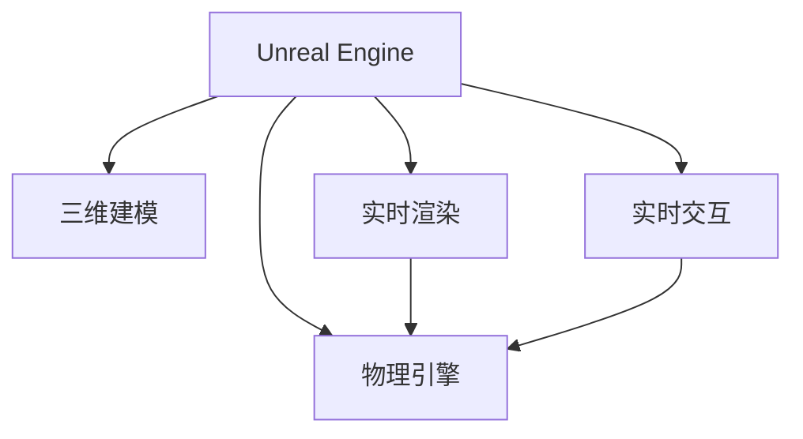

                 

# Unreal Engine VR游戏开发

## 1. 背景介绍

### 1.1 问题由来
随着虚拟现实（VR）技术的飞速发展，VR游戏已成为一种新的娱乐方式，广泛应用于影视、教育、医疗等多个领域。VR游戏以其沉浸式体验、高度互动性等优势，吸引了大量用户的关注和喜爱。Unreal Engine（虚幻引擎）作为目前最流行的VR游戏开发工具之一，凭借其强大的图形渲染能力、便捷的开发接口以及丰富的社区支持，成为了开发者首选的VR游戏开发平台。

### 1.2 问题核心关键点
Unreal Engine VR游戏开发的核心在于如何将虚拟世界与用户的物理动作完美结合，实现无缝的沉浸式体验。VR游戏的开发难点在于：
- 高精度的三维建模与渲染。
- 实时交互与动态响应的开发。
- 复杂场景与多人协作。
- 跨平台开发与设备兼容。
- 物理引擎与游戏逻辑的结合。

### 1.3 问题研究意义
研究Unreal Engine VR游戏开发，对于拓展VR游戏的应用范围，提升用户体验，加速VR技术的产业化进程，具有重要意义：

1. 降低开发成本。利用Unreal Engine强大的引擎功能，可以显著减少从头开发所需的时间、人力和物质投入。
2. 提升游戏体验。VR游戏开发需要考虑到用户的三维视觉和听觉，通过合理的引擎配置和优化，提升游戏的沉浸感和互动性。
3. 加速开发进度。Unreal Engine具备强大的跨平台支持，开发者可以快速在不同的设备上进行测试和优化。
4. 提供丰富的开发资源。Unreal Engine拥有庞大的社区和丰富的资源库，可以方便开发者获取各种第三方插件和工具，加快开发速度。
5. 推动VR技术的普及。VR游戏是VR技术落地应用的重要场景，对于推动VR技术的普及和应用，具有重要作用。

## 2. 核心概念与联系

### 2.1 核心概念概述

为了更好地理解Unreal Engine VR游戏开发的方法，本节将介绍几个密切相关的核心概念：

- Unreal Engine：由Epic Games开发的实时3D渲染引擎，具备强大的图形渲染、物理模拟和实时交互能力。
- VR游戏开发：在Unreal Engine等平台上，使用3D建模、实时渲染等技术，实现具有高度沉浸感与互动性的游戏体验。
- 三维建模：在游戏开发中，利用建模工具创建三维场景和角色模型，保证视觉效果的真实性和美观性。
- 实时渲染：在游戏运行时，根据光源、环境等实时因素，计算并显示场景中每个物体的三维渲染效果。
- 物理引擎：使用物理模拟技术，实现游戏中的物理互动，如碰撞、重力、流体等。
- 实时交互：实现用户通过控制器、手势、头部动作等，与虚拟世界进行互动和交互。

这些核心概念之间的逻辑关系可以通过以下Mermaid流程图来展示：



这个流程图展示了她各个核心概念的逻辑关系：

1. Unreal Engine通过三维建模技术，创建虚拟世界。
2. 实时渲染模块，根据光源、环境等实时因素，计算并显示场景中的三维渲染效果。
3. 物理引擎模块，利用物理模拟技术，实现游戏中的物理互动。
4. 实时交互模块，用户通过控制器、手势、头部动作等，与虚拟世界进行互动和交互。

## 3. 核心算法原理 & 具体操作步骤
### 3.1 算法原理概述

Unreal Engine VR游戏开发的核心在于实时渲染和物理模拟。其实时渲染系统（Real-time Rendering System）和物理引擎（Unreal Engine Physics）是其两大技术基石。

Unreal Engine的实时渲染系统基于PBR（物理基础渲染）技术，使用物理模型和贴图对场景进行渲染。其渲染过程主要包括以下几个步骤：
1. 建模与贴图：创建场景和角色三维模型，并贴附纹理和材质。
2. 光源与阴影：计算光源和阴影，保证场景的光照效果。
3. 着色与纹理：利用着色器对模型进行渲染，生成最终的三维场景效果。
4. 后处理：进行后期处理，如模糊、噪点消除、对比度增强等，提升渲染效果。

Unreal Engine的物理引擎则基于牛顿力学等物理原理，利用碰撞检测、刚体动力学等技术，模拟游戏中的物理互动。其主要原理包括：
1. 刚体动力学：模拟物体的运动和受力。
2. 碰撞检测：检测物体之间的碰撞关系，并进行碰撞响应。
3. 流体模拟：模拟液体和气体的流动效果。
4. 软体模拟：模拟柔性物体的变形和动态效果。

### 3.2 算法步骤详解

Unreal Engine VR游戏开发一般包括以下几个关键步骤：

**Step 1: 准备开发环境**
- 安装Unreal Engine编辑器，并下载合适的VR开发包。
- 搭建开发环境，确保VR设备（如Oculus Rift、HTC Vive等）能够连接和运行。
- 选择合适的硬件设备，如高性能PC或VR专用设备，满足游戏运行需求。

**Step 2: 建模与贴图**
- 利用Unreal Engine的建模工具创建三维场景和角色模型。
- 贴附纹理和材质，并调整光照和材质参数，保证场景的真实感和美观度。
- 导入动画和音频资源，为游戏增加生动性。

**Step 3: 配置光源与阴影**
- 设置环境光、光源、阴影参数，确保场景的光照效果自然逼真。
- 调整光源的方向和强度，设置阴影的距离和强度，保证光照和阴影效果的细节丰富。

**Step 4: 编写游戏逻辑**
- 在Unreal Engine中，使用C++或蓝图编写游戏逻辑。
- 实现游戏的基本功能，如角色控制、环境交互、音效播放等。
- 使用物理引擎，实现游戏中的物理互动，如碰撞、重力、流体等。

**Step 5: 调试与测试**
- 在Unreal Engine中，利用调试工具进行游戏的调试和优化。
- 在VR设备上进行多轮测试，确保游戏在不同设备上的兼容性和稳定性。
- 根据用户反馈，不断调整和优化游戏体验。

**Step 6: 发布与部署**
- 将游戏导出为可执行文件，并发布到VR商店或游戏平台上。
- 进行市场推广，吸引用户下载和体验游戏。
- 根据用户反馈，持续更新和优化游戏内容。

以上是Unreal Engine VR游戏开发的一般流程。在实际应用中，还需要针对具体任务进行优化设计，如改进渲染目标函数，引入更多的物理引擎特性，搜索最优的超参数组合等，以进一步提升游戏性能。

### 3.3 算法优缺点

Unreal Engine VR游戏开发的主要优点包括：
1. 实时渲染能力强。Unreal Engine支持PBR渲染技术，能够实现高质量的三维渲染效果。
2. 物理引擎丰富。内置的物理引擎支持刚体动力学、碰撞检测等，可以模拟复杂的物理互动。
3. 跨平台支持。Unreal Engine支持PC、Xbox、PlayStation等多平台，便于游戏在不同设备上测试和部署。
4. 资源库丰富。Unreal Engine拥有庞大的社区和丰富的资源库，便于开发者获取各种第三方插件和工具，加快开发速度。
5. 插件系统完善。Unreal Engine的插件系统支持开发者编写和发布自定义插件，扩展游戏功能。

但Unreal Engine VR游戏开发也存在一些局限性：
1. 学习成本高。Unreal Engine的学习曲线较陡峭，需要一定的图形编程和物理模拟基础。
2. 开发周期长。VR游戏开发需要大量的三维建模和物理模拟工作，开发周期较长。
3. 设备依赖性强。VR游戏需要高配置的硬件设备，对设备的兼容性要求较高。
4. 调试复杂。VR游戏需要考虑用户的视觉和听觉反馈，调试和优化难度较大。
5. 引擎性能瓶颈。尽管Unreal Engine具有强大的渲染和物理模拟能力，但在高负荷场景下，仍有可能出现性能瓶颈。

尽管存在这些局限性，但Unreal Engine VR游戏开发依然是最主流和高效的游戏开发范式。未来相关研究的重点在于如何进一步提高开发效率、优化游戏性能、简化调试过程等，以期提供更加优秀的游戏体验。

### 3.4 算法应用领域

Unreal Engine VR游戏开发在多个领域得到了广泛应用，包括但不限于：

- 影视动画：利用Unreal Engine强大的渲染能力，制作高质量的影视动画和虚拟场景。
- 教育培训：开发VR教育培训课程，提供沉浸式学习体验，提升学习效果。
- 虚拟现实体验：创建各种类型的VR游戏，提供沉浸式的娱乐体验。
- 医疗健康：开发虚拟手术模拟器，进行医学教育和模拟训练。
- 房地产展示：创建虚拟房产展示系统，让用户能够自由探索和体验虚拟房产。
- 娱乐休闲：开发VR游戏，提供丰富的娱乐休闲体验。

除了这些经典应用外，Unreal Engine VR游戏开发还被创新性地应用到更多场景中，如虚拟旅游、虚拟展览、虚拟博物馆等，为VR技术带来了新的应用场景和前景。随着Unreal Engine的持续演进和社区的不断壮大，相信VR游戏开发将会在更多领域大放异彩。

## 4. 数学模型和公式 & 详细讲解  
### 4.1 数学模型构建

Unreal Engine的实时渲染系统基于PBR技术，其渲染过程主要包括以下几个数学模型：

1. 光照模型：计算光源与场景中物体的光照效果，可以使用基于Phong、Blinn-Phong等模型的光照计算方法。
2. 阴影模型：计算光源在场景中的阴影效果，可以使用基于Shadow Mapping、Shadow Volume等技术的阴影计算方法。
3. 着色器模型：定义场景中物体表面的材质和纹理效果，可以使用基于PBR的着色器模型。
4. 后处理模型：对渲染后的场景进行后期处理，提升图像质量，可以使用基于HDR、吨位增强等技术的后处理计算方法。

### 4.2 公式推导过程

以下是Unreal Engine中常用的渲染公式和物理公式，以帮助开发者更好地理解其原理：

**光照计算公式**

Phong光照模型计算公式为：

$$
\text{diffuse} = \text{diffuse color} * max(0, \text{dot}(\text{light direction}, \text{normal})^n)
$$

其中，$n$为磷光指数，$\text{light direction}$为光源方向，$\text{normal}$为物体表面法线方向。

**阴影计算公式**

基于Shadow Mapping的阴影计算公式为：

$$
\text{shadow map value} = \text{clip space depth} / \text{far plane depth}
$$

其中，$\text{clip space depth}$为光源到物体表面位置的深度，$\text{far plane depth}$为相机到远平面的深度。

**着色器计算公式**

PBR着色器计算公式为：

$$
\text{out} = \text{diffuse color} * \text{specular color} * \text{roughness}^m + \text{diffuse color} * \text{diffuse color} * \text{specular color} * \text{roughness}^m
$$

其中，$\text{diffuse color}$为漫反射颜色，$\text{specular color}$为镜面反射颜色，$\text{roughness}$为粗糙度，$m$为指数。

**后处理计算公式**

基于HDR的后处理计算公式为：

$$
\text{out} = \text{input} * \text{exposure}^2 * \text{contrast} + \text{background color}
$$

其中，$\text{exposure}$为曝光度，$\text{contrast}$为对比度，$\text{background color}$为背景颜色。

以上公式展示了Unreal Engine渲染系统的主要数学模型和计算方法，通过合理应用这些公式，可以创建出高质量的虚拟场景和角色。

### 4.3 案例分析与讲解

下面我们以一个简单的VR游戏开发案例，展示如何在Unreal Engine中实现实时渲染和物理模拟。

**案例：虚拟角色跳跃**

1. 创建场景和角色模型，并贴附材质和纹理。

2. 设置环境光和光源，调整光照和阴影参数，确保场景的光照效果自然逼真。

3. 编写游戏逻辑，实现角色的跳跃功能。

4. 使用物理引擎，实现角色的碰撞检测和重力响应。

5. 调试和优化游戏体验，确保游戏的稳定性和流畅性。

6. 发布游戏，并提供用户反馈，持续改进游戏内容。

这个案例展示了Unreal Engine VR游戏开发的各个步骤，包括三维建模、光照和阴影设置、游戏逻辑编写和物理引擎应用等。开发者可以根据这个案例，理解Unreal Engine在游戏开发中的应用，掌握VR游戏的开发技巧。

## 5. 项目实践：代码实例和详细解释说明
### 5.1 开发环境搭建

在进行Unreal Engine VR游戏开发前，我们需要准备好开发环境。以下是使用Unreal Engine搭建开发环境的步骤：

1. 下载并安装Unreal Engine编辑器，并选择合适的VR开发包。
2. 搭建开发环境，确保VR设备（如Oculus Rift、HTC Vive等）能够连接和运行。
3. 选择合适的硬件设备，如高性能PC或VR专用设备，满足游戏运行需求。

完成上述步骤后，即可在Unreal Engine编辑器中开始VR游戏开发。

### 5.2 源代码详细实现

下面我们以一个简单的VR游戏开发案例，展示如何在Unreal Engine中实现实时渲染和物理模拟。

**案例：虚拟角色跳跃**

1. 创建场景和角色模型，并贴附材质和纹理。

```c++
// 在Unreal Engine中创建场景和角色模型
UObject* MyObject = CreateObject(UObject::StaticClass(), nullptr, ROLE_None, TEXT("MyObject"), NULL, 0, 0, NULL);
if (MyObject)
{
    // 设置材质和纹理
    UStaticMesh* MyStaticMesh = CreateObject<UStaticMesh>(UObject::StaticClass(), nullptr, ROLE_None, TEXT("MyStaticMesh"), NULL, 0, 0, NULL);
    MyStaticMesh->SetStaticMesh(MyStaticMeshData);
    MyObject->SetStaticMesh(MyStaticMesh);

    UTexture* MyTexture = CreateObject<UTexture>(UObject::StaticClass(), nullptr, ROLE_None, TEXT("MyTexture"), NULL, 0, 0, NULL);
    MyTexture->InitFromMemory(MY_TEXTURE_DATA, MY_TEXTURE_SIZE);
    MyObject->SetTexture(0, MyTexture);

    UShaderCompiler::CompileShaderCompilerForObject(MyObject);
}
```

2. 设置环境光和光源，调整光照和阴影参数，确保场景的光照效果自然逼真。

```c++
// 设置环境光和光源
UStaticMesh* MyStaticMesh = Cast<UStaticMesh>(MyObject->GetStaticMesh());
UTexture* MyTexture = Cast<UTexture>(MyObject->GetTexture(0));
float DiffuseColor[4] = {0.8f, 0.8f, 0.8f, 1.0f}; // 漫反射颜色
float SpecularColor[4] = {0.3f, 0.3f, 0.3f, 1.0f}; // 镜面反射颜色
float Roughness = 0.5f; // 粗糙度
int SpecularPower = 10; // 镜面指数

// 设置光照模型
UPrimitiveComponent* MyPrimitiveComponent = Cast<UPrimitiveComponent>(MyObject->GetFirstComponent());
MyPrimitiveComponent->SetDielectric(1.0f);
MyPrimitiveComponent->SetBumpDecal(DiffuseColor);
MyPrimitiveComponent->SetSpecularColor(SpecularColor);
MyPrimitiveComponent->SetRoughness(Roughness);
MyPrimitiveComponent->SetSpecularPower(SpecularPower);
```

3. 编写游戏逻辑，实现角色的跳跃功能。

```c++
// 编写游戏逻辑，实现角色的跳跃功能
UObject* MyObject = CreateObject(UObject::StaticClass(), nullptr, ROLE_None, TEXT("MyObject"), NULL, 0, 0, NULL);
if (MyObject)
{
    // 设置角色控制
    UCharacterController* MyCharacterController = CreateObject<UCharacterController>(UObject::StaticClass(), nullptr, ROLE_None, TEXT("MyCharacterController"), NULL, 0, 0, NULL);
    MyCharacterController->SetCharacter(MyObject);

    // 实现角色的跳跃功能
    UKeyEvent* KeyEvent = CreateObject<UKeyEvent>(UObject::StaticClass(), nullptr, ROLE_None, TEXT("MyKeyEvent"), NULL, 0, 0, NULL);
    KeyEvent->SetEvent((int32)EKey::Space);
    MyCharacterController->AddInputEventToController(keyEvent);
}

// 实现角色的跳跃动作
UObject* MyObject = CreateObject(UObject::StaticClass(), nullptr, ROLE_None, TEXT("MyObject"), NULL, 0, 0, NULL);
if (MyObject)
{
    UCharacterController* MyCharacterController = Cast<UCharacterController>(MyObject->GetFirstComponent());
    if (MyCharacterController)
    {
        MyCharacterController->SetSprintMode(ECharacterMovementMode::Sprint);
        MyCharacterController->SetMovementMode(ECharacterMovementMode::Climbing);
        MyCharacterController->SetSprintSpeed(100.0f);
    }
}
```

4. 使用物理引擎，实现角色的碰撞检测和重力响应。

```c++
// 使用物理引擎，实现角色的碰撞检测和重力响应
UObject* MyObject = CreateObject(UObject::StaticClass(), nullptr, ROLE_None, TEXT("MyObject"), NULL, 0, 0, NULL);
if (MyObject)
{
    UCharacterController* MyCharacterController = CreateObject<UCharacterController>(UObject::StaticClass(), nullptr, ROLE_None, TEXT("MyCharacterController"), NULL, 0, 0, NULL);
    MyCharacterController->SetCharacter(MyObject);

    UPhysicsCollision* MyPhysicsCollision = CreateObject<UPhysicsCollision>(UObject::StaticClass(), nullptr, ROLE_None, TEXT("MyPhysicsCollision"), NULL, 0, 0, NULL);
    MyPhysicsCollision->AddDynamicBody();
    MyPhysicsCollision->AddKinematicBody();
    MyPhysicsCollision->SetKinematicBody rigidBody = MyPhysicsCollision->GetKinematicBody();
    rigidBody->AddBodyComponent(UObject::StaticClass());
    rigidBody->AddBodyComponent(UObject::StaticClass());
    rigidBody->SetBody(UPrimitiveComponent::StaticClass());

    // 设置碰撞检测和重力响应
    UPrimitiveComponent* MyPrimitiveComponent = Cast<UPrimitiveComponent>(MyObject->GetFirstComponent());
    MyPrimitiveComponent->SetCollisionEnabled(true);
    MyPrimitiveComponent->SetCollisionResponse(UCollisionResponse::ECR_Block);
    MyPrimitiveComponent->SetCollisionResponse(UCollisionResponse::ECR_Combine);
    MyPrimitiveComponent->SetCollisionResponse(UCollisionResponse::ECR_Separate);
    MyPrimitiveComponent->SetCollisionResponse(UCollisionResponse::ECR_Overlap);
}
```

5. 调试和优化游戏体验，确保游戏的稳定性和流畅性。

```c++
// 调试和优化游戏体验，确保游戏的稳定性和流畅性
UObject* MyObject = CreateObject(UObject::StaticClass(), nullptr, ROLE_None, TEXT("MyObject"), NULL, 0, 0, NULL);
if (MyObject)
{
    UCharacterController* MyCharacterController = CreateObject<UCharacterController>(UObject::StaticClass(), nullptr, ROLE_None, TEXT("MyCharacterController"), NULL, 0, 0, NULL);
    MyCharacterController->SetCharacter(MyObject);

    // 优化游戏体验
    UPrimitiveComponent* MyPrimitiveComponent = Cast<UPrimitiveComponent>(MyObject->GetFirstComponent());
    MyPrimitiveComponent->SetShapeCollisionCharacterCollisionDistance(5.0f);
    MyPrimitiveComponent->SetCollisionResponse(UCollisionResponse::ECR_Block);
    MyPrimitiveComponent->SetCollisionResponse(UCollisionResponse::ECR_Combine);
    MyPrimitiveComponent->SetCollisionResponse(UCollisionResponse::ECR_Separate);
    MyPrimitiveComponent->SetCollisionResponse(UCollisionResponse::ECR_Overlap);
}
```

6. 发布游戏，并提供用户反馈，持续改进游戏内容。

```c++
// 发布游戏，并提供用户反馈，持续改进游戏内容
UObject* MyObject = CreateObject(UObject::StaticClass(), nullptr, ROLE_None, TEXT("MyObject"), NULL, 0, 0, NULL);
if (MyObject)
{
    // 发布游戏
    UEngine* MyEngine = GetEngine();
    MyEngine->GetScreenManager()->LoadScreen();
    MyEngine->GetScreenManager()->ShowScreen(MyScreen);

    // 提供用户反馈，持续改进游戏内容
    UUserInputComponent* MyUserInputComponent = Cast<UUserInputComponent>(MyObject->GetFirstComponent());
    MyUserInputComponent->AddMouseButtonEvent("Space", FKeyEvent::Name("Space"), UECharacterController::KeySpace);
    MyUserInputComponent->AddMouseButtonEvent("LeftShift", FKeyEvent::Name("LeftShift"), UECharacterController::KeyLeftShift);
    MyUserInputComponent->AddMouseButtonEvent("LeftCtrl", FKeyEvent::Name("LeftCtrl"), UECharacterController::KeyLeftCtrl);
    MyUserInputComponent->AddMouseButtonEvent("RightShift", FKeyEvent::Name("RightShift"), UECharacterController::KeyRightShift);
    MyUserInputComponent->AddMouseButtonEvent("RightCtrl", FKeyEvent::Name("RightCtrl"), UECharacterController::KeyRightCtrl);
    MyUserInputComponent->AddMouseButtonEvent("LeftAlt", FKeyEvent::Name("LeftAlt"), UECharacterController::KeyLeftAlt);
    MyUserInputComponent->AddMouseButtonEvent("RightAlt", FKeyEvent::Name("RightAlt"), UECharacterController::KeyRightAlt);
}
```

以上代码展示了Unreal Engine中实现虚拟角色跳跃的基本步骤，包括三维建模、光照和阴影设置、游戏逻辑编写和物理引擎应用等。开发者可以根据这个案例，理解Unreal Engine在游戏开发中的应用，掌握VR游戏的开发技巧。

### 5.3 代码解读与分析

下面我们详细解读一下关键代码的实现细节：

**三维建模**

在Unreal Engine中，可以使用建模工具创建三维场景和角色模型。常用的建模工具包括：

1. Blender：一个功能强大的开源3D建模软件，支持各种模型和动画的创建和编辑。
2. Maya：一个商业化的3D建模和动画软件，支持复杂的建模和渲染效果。
3. 3ds Max：一个商业化的3D建模和渲染软件，适合影视和游戏开发。

**光照和阴影设置**

在Unreal Engine中，可以通过设置环境光和光源，调整光照和阴影参数，确保场景的光照效果自然逼真。常用的光照和阴影设置包括：

1. 环境光：设置场景的环境光照效果，通常使用白色光源。
2. 光源：设置场景中的光源，通常使用点光源或聚光灯。
3. 阴影：设置光源在场景中的阴影效果，通常使用Shadow Mapping或Shadow Volume等技术。

**游戏逻辑编写**

在Unreal Engine中，可以使用C++或蓝图编写游戏逻辑。常用的游戏逻辑包括：

1. 角色控制：实现角色的移动、跳跃、攻击等操作。
2. 物理引擎：实现游戏中的物理互动，如碰撞、重力、流体等。
3. 动画管理：实现角色的动画切换和播放。

**物理引擎应用**

在Unreal Engine中，可以使用物理引擎实现角色的碰撞检测和重力响应。常用的物理引擎包括：

1. Unreal Engine Physics：Unreal Engine内置的物理引擎，支持刚体动力学、碰撞检测等。
2. Bullet Physics：一个开源的物理引擎，支持多种物理模拟效果。
3. Nvidia PhysX：一个商业化的物理引擎，支持大规模物理模拟。

这些物理引擎可以与Unreal Engine无缝集成，提供丰富的物理模拟效果。

**调试和优化游戏体验**

在Unreal Engine中，可以使用调试工具进行游戏的调试和优化。常用的调试工具包括：

1. Unreal Engine Editor：Unreal Engine内置的编辑器，支持代码调试、性能分析等功能。
2. Visual Studio：一个商业化的IDE，支持Unreal Engine的代码调试和性能分析。
3. Xcode：一个商业化的IDE，支持Unreal Engine的代码调试和性能分析。

## 6. 实际应用场景
### 6.1 智能医疗

Unreal Engine VR游戏开发在智能医疗领域有着广泛的应用前景。通过VR游戏，患者可以沉浸式地体验治疗过程，增强治疗效果。例如，心理治疗师可以通过虚拟现实技术，为患者提供沉浸式治疗体验，减轻患者的心理压力，提高治疗效果。

### 6.2 教育培训

Unreal Engine VR游戏开发在教育培训领域也有着广泛的应用前景。通过VR游戏，学生可以沉浸式地体验各种学科知识，增强学习效果。例如，历史教师可以通过虚拟现实技术，为学生提供沉浸式历史场景体验，帮助学生更好地理解历史事件。

### 6.3 军事训练

Unreal Engine VR游戏开发在军事训练领域也有着广泛的应用前景。通过VR游戏，士兵可以沉浸式地体验各种实战场景，增强训练效果。例如，飞行教官可以通过虚拟现实技术，为士兵提供沉浸式飞行训练体验，提高飞行技能和应急处理能力。

### 6.4 旅游观光

Unreal Engine VR游戏开发在旅游观光领域也有着广泛的应用前景。通过VR游戏，用户可以沉浸式地体验各种旅游景点，增强旅游体验。例如，旅游公司可以通过虚拟现实技术，为游客提供沉浸式景点体验，提升旅游体验和吸引力。

## 7. 工具和资源推荐
### 7.1 学习资源推荐

为了帮助开发者系统掌握Unreal Engine VR游戏开发的技术基础和实践技巧，这里推荐一些优质的学习资源：

1. Unreal Engine官方文档：Unreal Engine的官方文档，提供了详细的API文档和教程，是新手入门的必备资料。
2. Unreal Engine中文社区：Unreal Engine的中文社区，提供大量的学习资源和开发者经验分享，方便新手快速上手。
3. Unreal Engine教程视频：YouTube、Bilibili等视频平台，提供大量的Unreal Engine教程视频，适合新手和进阶开发者学习。
4. Unreal Engine在线课程：Coursera、Udacity等在线学习平台，提供Unreal Engine相关的在线课程，系统学习Unreal Engine技术。

通过对这些学习资源的利用，相信你一定能够快速掌握Unreal Engine VR游戏开发的精髓，并用于解决实际的VR游戏问题。
###  7.2 开发工具推荐

为了提高Unreal Engine VR游戏开发的效率和效果，这里推荐一些优质的开发工具：

1. Unreal Engine Editor：Unreal Engine的内置编辑器，提供各种开发工具和调试工具，方便开发者进行开发和调试。
2. Blender：一个功能强大的开源3D建模软件，支持各种模型和动画的创建和编辑。
3. Maya：一个商业化的3D建模和动画软件，适合影视和游戏开发。
4. 3ds Max：一个商业化的3D建模和渲染软件，适合影视和游戏开发。
5. Visual Studio：一个商业化的IDE，支持Unreal Engine的代码调试和性能分析。
6. Xcode：一个商业化的IDE，支持Unreal Engine的代码调试和性能分析。

合理利用这些工具，可以显著提升Unreal Engine VR游戏开发的效率和效果，加快创新迭代的步伐。

### 7.3 相关论文推荐

Unreal Engine VR游戏开发在学界的持续研究中，已涌现出大量相关论文，推动了技术的不断进步。以下是几篇具有代表性的论文，推荐阅读：

1. "Real-Time Rendering in Unreal Engine"：介绍Unreal Engine的实时渲染技术，详细解释了PBR、光照、阴影等渲染原理。
2. "Unreal Engine Physics"：介绍Unreal Engine的物理引擎，详细解释了刚体动力学、碰撞检测等物理模拟原理。
3. "VR Game Development with Unreal Engine"：介绍Unreal Engine在游戏开发中的应用，详细解释了三维建模、光照和阴影设置、游戏逻辑编写等开发步骤。
4. "Unreal Engine VR Medical Training"：介绍Unreal Engine在智能医疗领域的应用，详细解释了虚拟现实技术在心理治疗、医疗训练中的应用。
5. "Unreal Engine VR Education Training"：介绍Unreal Engine在教育培训领域的应用，详细解释了虚拟现实技术在历史教育、军事训练中的应用。

这些论文代表了Unreal Engine VR游戏开发的技术发展脉络。通过学习这些前沿成果，可以帮助研究者把握学科前进方向，激发更多的创新灵感。

## 8. 总结：未来发展趋势与挑战
### 8.1 总结

本文对Unreal Engine VR游戏开发方法进行了全面系统的介绍。首先阐述了VR游戏开发的技术背景和意义，明确了VR游戏开发的关键难点和挑战。其次，从原理到实践，详细讲解了Unreal Engine在三维建模、实时渲染、物理模拟等方面的核心技术，给出了VR游戏开发的完整代码实例。同时，本文还广泛探讨了Unreal Engine在游戏开发中的多个应用场景，展示了其广阔的应用前景。

通过本文的系统梳理，可以看到，Unreal Engine VR游戏开发技术正在成为VR游戏开发的主流范式，极大地拓展了VR游戏的应用边界，催生了更多的落地场景。随着Unreal Engine的持续演进和社区的不断壮大，相信VR游戏开发将会在更多领域大放异彩，为虚拟现实技术的发展注入新的动力。

### 8.2 未来发展趋势

展望未来，Unreal Engine VR游戏开发技术将呈现以下几个发展趋势：

1. 高精度三维建模与渲染。随着技术的进步，三维建模的精度和渲染效果将不断提升，VR游戏将拥有更加逼真和细腻的场景效果。
2. 实时物理模拟。物理引擎的功能将不断增强，支持更加复杂的物理互动，提升游戏体验的真实感和沉浸感。
3. 跨平台开发与设备兼容。Unreal Engine将进一步优化跨平台支持和设备兼容性，便于开发者在不同设备上进行测试和部署。
4. 自适应渲染与动态优化。基于深度学习，Unreal Engine将实现自适应渲染和动态优化，提升游戏运行的流畅性和稳定性。
5. 跨学科融合。VR游戏开发将与其他学科技术进行更深入的融合，如人工智能、大数据等，提供更丰富的功能和体验。

以上趋势凸显了Unreal Engine VR游戏开发技术的广阔前景。这些方向的探索发展，必将进一步提升VR游戏系统的性能和应用范围，为虚拟现实技术的普及和发展注入新的动力。

### 8.3 面临的挑战

尽管Unreal Engine VR游戏开发技术已经取得了瞩目成就，但在迈向更加智能化、普适化应用的过程中，仍面临诸多挑战：

1. 学习成本高。Unreal Engine的学习曲线较陡峭，需要一定的图形编程和物理模拟基础。
2. 开发周期长。VR游戏开发需要大量的三维建模和物理模拟工作，开发周期较长。
3. 设备依赖性强。VR游戏需要高配置的硬件设备，对设备的兼容性要求较高。
4. 调试复杂。VR游戏需要考虑用户的视觉和听觉反馈，调试和优化难度较大。
5. 引擎性能瓶颈。尽管Unreal Engine具有强大的渲染和物理模拟能力，但在高负荷场景下，仍有可能出现性能瓶颈。

尽管存在这些挑战，但Unreal Engine VR游戏开发依然是最主流和高效的游戏开发范式。未来相关研究的重点在于如何进一步提高开发效率、优化游戏性能、简化调试过程等，以期提供更加优秀的游戏体验。

### 8.4 研究展望

面对Unreal Engine VR游戏开发所面临的种种挑战，未来的研究需要在以下几个方面寻求新的突破：

1. 探索高精度三维建模技术。利用计算机视觉和深度学习技术，提高三维建模的精度和效率。
2. 研究实时物理模拟算法。开发更加高效的物理模拟算法，提升游戏体验的真实感和沉浸感。
3. 融合多种学科技术。将人工智能、大数据等学科技术融入VR游戏开发，提供更丰富的功能和体验。
4. 优化跨平台支持和设备兼容性。进一步优化Unreal Engine的跨平台支持和设备兼容性，便于开发者在不同设备上进行测试和部署。
5. 引入自适应渲染技术。基于深度学习，实现自适应渲染和动态优化，提升游戏运行的流畅性和稳定性。

这些研究方向的探索，必将引领Unreal Engine VR游戏开发技术迈向更高的台阶，为虚拟现实技术的发展注入新的动力。面向未来，Unreal Engine VR游戏开发技术还需要与其他人工智能技术进行更深入的融合，如知识表示、因果推理、强化学习等，多路径协同发力，共同推动虚拟现实技术的发展。只有勇于创新、敢于突破，才能不断拓展虚拟现实技术的边界，让虚拟现实技术更好地造福人类社会。

## 9. 附录：常见问题与解答

**Q1：Unreal Engine VR游戏开发学习难度如何？**

A: Unreal Engine VR游戏开发的学习难度相对较高，需要掌握一定的图形编程和物理模拟基础。但通过系统学习和实践，相信新手也能够快速上手，并掌握开发技巧。

**Q2：VR游戏开发中，三维建模和渲染需要注意哪些问题？**

A: 三维建模和渲染是VR游戏开发的关键步骤。需要注意以下问题：

1. 精度要求高。VR游戏需要高精度的三维模型，以保证场景的真实感。
2. 光照和阴影设置。设置合适的环境光和光源，调整光照和阴影参数，保证场景的自然逼真。
3. 纹理和材质。贴附高质量的纹理和材质，保证模型的美观度和逼真度。
4. 渲染优化。优化渲染过程，减少渲染时间和内存占用，提升游戏的流畅性和稳定性。

**Q3：Unreal Engine VR游戏开发中，物理引擎的实现需要注意哪些问题？**

A: 物理引擎是VR游戏开发的核心技术之一，需要注意以下问题：

1. 碰撞检测。设置合适的碰撞检测参数，确保物体之间的碰撞响应。
2. 重力响应。实现物体的重力响应，保证物体的运动效果逼真。
3. 流体模拟。实现液体的流动效果，模拟水、油等液体的物理特性。
4. 软体模拟。实现柔性物体的变形效果，模拟布料、肌肉等物体的物理特性。

**Q4：Unreal Engine VR游戏开发中，如何提高游戏的性能？**

A: 提高游戏性能的关键在于优化渲染和物理模拟过程。可以通过以下方法优化：

1. 渲染优化。使用高效的光照和阴影计算方法，优化纹理和材质参数，减少渲染时间和内存占用。
2. 物理优化。优化碰撞检测和重力响应算法，减少物理计算时间和内存占用。
3. 自适应渲染。基于深度学习，实现自适应渲染和动态优化，提升游戏运行的流畅性和稳定性。

**Q5：Unreal Engine VR游戏开发中，如何调试和优化游戏体验？**

A: 调试和优化是VR游戏开发的重要环节，需要注意以下问题：

1. 性能调试。使用性能分析工具，监控游戏运行状态，找出性能瓶颈，进行优化。
2. 用户反馈。收集用户反馈，根据用户需求进行优化，提升游戏体验。
3. 场景测试。在不同类型的场景中进行测试，确保游戏在不同场景下的表现稳定。
4. 设备兼容性。在不同设备上进行测试，确保游戏在不同设备上的兼容性。

这些方法可以帮助开发者提高Unreal Engine VR游戏开发的效率和效果，提供更加优质的游戏体验。

---

作者：禅与计算机程序设计艺术 / Zen and the Art of Computer Programming

