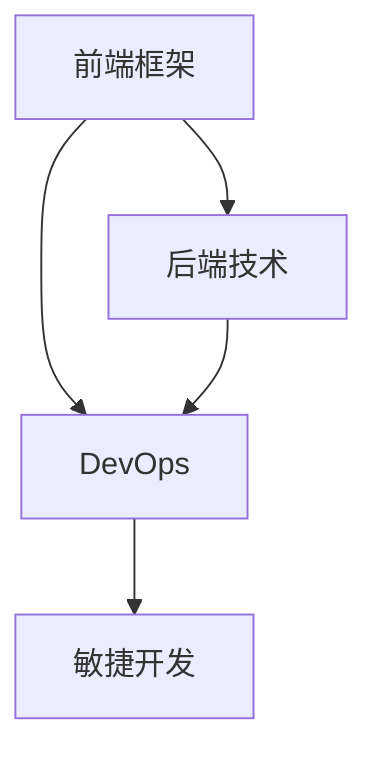

                 

# Web全栈开发：前端框架与后端技术融合

> 关键词：Web全栈开发,前端框架,后端技术,融合,DevOps,敏捷开发

## 1. 背景介绍

### 1.1 问题由来

随着互联网技术的快速发展和企业信息化需求的不断增长，Web全栈开发逐渐成为企业级应用开发的主流方向。传统的前端开发和后端开发分别负责不同的技术栈，如前端使用React、Vue、Angular等框架，后端则使用Node.js、Java、Python等语言。这种分离的模式虽然降低了开发门槛，但也导致了技术割裂、效率低下、维护成本高等问题。

如何实现前端和后端的无缝集成，提高开发效率和系统稳定性，成为当前Web开发领域的一个重要课题。本文将从技术角度出发，探讨Web全栈开发的关键技术和应用实践。

## 2. 核心概念与联系

### 2.1 核心概念概述

在讨论Web全栈开发时，需要理解几个核心概念：

- **Web全栈开发**：指前端开发和后端开发无缝集成，开发者需要掌握前后端技术，负责系统的完整构建和部署。
- **前端框架**：用于构建用户界面的Web前端技术栈，如React、Vue、Angular等。
- **后端技术**：用于构建Web服务器的后端技术栈，如Node.js、Java、Python等。
- **DevOps**：集成开发、持续交付和持续集成，使软件开发和运维流程高效协同。
- **敏捷开发**：基于迭代和反馈持续改进的开发模式，提升开发效率和产品质量。

这些概念之间的联系可以通过以下Mermaid流程图来展示：



该流程图展示了前端框架、后端技术、DevOps和敏捷开发之间的逻辑关系：

1. 前端框架和后端技术是Web全栈开发的基础。
2. DevOps工具链和最佳实践支持前后端技术的集成和部署。
3. 敏捷开发理念指导开发团队高效协作，提升开发效率。

理解这些核心概念及其之间的联系，有助于深入掌握Web全栈开发的技术框架和应用实践。

## 3. 核心算法原理 & 具体操作步骤

### 3.1 算法原理概述

Web全栈开发的核心在于将前端和后端技术融合到一个统一的平台，实现数据的实时交互和服务的无缝集成。这种融合主要依赖于客户端与服务器端的双向数据传输，以及前后端协同工作。

一般而言，Web全栈开发可以分为三个主要阶段：

1. **前端开发**：构建用户界面，处理用户交互，与后端服务器交互。
2. **后端开发**：构建Web服务器，处理业务逻辑，与数据库交互。
3. **DevOps集成**：实现自动化部署和持续集成，提高开发效率和系统稳定性。

### 3.2 算法步骤详解

以下是Web全栈开发的详细操作步骤：

**Step 1: 项目规划与需求分析**

- 确定项目目标和需求，评估技术栈选择。
- 进行用户研究，明确用户需求和行为模式。
- 制定详细的项目计划和时间表。

**Step 2: 技术栈选择**

- 选择合适的前端框架和后端技术。
- 考虑性能、安全性、可维护性等因素。
- 选择DevOps工具链，如CI/CD、容器化等。

**Step 3: 设计架构**

- 设计系统架构，明确前后端接口和数据流。
- 考虑分布式、微服务、DevOps等架构模式。
- 进行安全性和性能优化设计。

**Step 4: 实现与集成**

- 在前端框架中实现用户界面和交互逻辑。
- 在后端技术中实现业务逻辑和服务接口。
- 实现前后端接口的数据交互和状态管理。

**Step 5: 测试与部署**

- 进行单元测试、集成测试和功能测试。
- 使用DevOps工具链进行自动化部署和持续集成。
- 上线后进行性能测试和监控。

**Step 6: 持续迭代**

- 收集用户反馈，进行迭代改进。
- 持续优化前后端技术栈。
- 更新DevOps流程，提升开发效率和系统稳定性。

### 3.3 算法优缺点

**优点**：

1. **提升开发效率**：前后端技术无缝集成，减少沟通成本。
2. **提升系统稳定性**：统一开发流程和DevOps工具，减少错误和重复工作。
3. **提升用户体验**：实时数据交互和无缝服务集成，提升用户体验。

**缺点**：

1. **技术栈复杂**：需要掌握前后端技术，技术门槛较高。
2. **维护成本高**：系统复杂度高，维护成本也相应增加。
3. **团队协作难**：前后端集成需要高度协同，团队协作难度大。

### 3.4 算法应用领域

Web全栈开发在以下几个领域有着广泛的应用：

- **企业信息化**：构建企业级Web应用，提升信息化管理效率。
- **电商网站**：实现商品展示、订单管理、物流跟踪等功能。
- **在线教育**：提供视频课程、在线测验、互动讨论等功能。
- **社交网络**：实现用户注册、内容发布、互动评论等功能。
- **医疗健康**：提供在线问诊、电子病历、远程诊疗等功能。

这些应用场景展示了Web全栈开发在提升系统集成性和用户体验方面的优势，为企业级Web开发提供了新的思路和方向。

## 4. 数学模型和公式 & 详细讲解 & 举例说明

### 4.1 数学模型构建

Web全栈开发的数学模型主要围绕前端和后端的交互过程展开。以一个简单的Web应用为例，用户通过前端界面提交表单数据，后端服务器接收数据并进行处理，最终将处理结果返回给前端进行显示。

设用户输入的表单数据为 $X$，后端处理结果为 $Y$。则前端和后端的交互过程可以用以下公式表示：

$$
Y = f(X, \theta)
$$

其中 $f$ 为后端服务器处理函数，$\theta$ 为后端参数。

### 4.2 公式推导过程

以上公式表示了用户输入 $X$ 通过前端界面提交，后端服务器接收并处理，最终生成处理结果 $Y$ 的过程。

以一个简单的用户登录应用为例，用户输入用户名和密码，后端服务器进行身份验证，并返回登录状态。这个过程中，前端界面负责用户输入和显示登录状态，后端服务器负责用户身份验证和处理逻辑。

假设用户输入的用户名和密码分别为 $X_u$ 和 $X_p$，后端服务器对用户身份进行验证，生成处理结果 $Y_s$（成功或失败）。则公式可以表示为：

$$
Y_s = f(X_u, X_p, \theta)
$$

其中 $f$ 为身份验证函数，$\theta$ 为验证参数，如密码加密算法等。

### 4.3 案例分析与讲解

以下是一个简单的用户登录应用案例，展示了Web全栈开发的具体实现过程：

**前端实现**：

```html
<!DOCTYPE html>
<html>
<head>
    <meta charset="UTF-8">
    <title>User Login</title>
    <script src="https://cdn.jsdelivr.net/npm/axios/dist/axios.min.js"></script>
    <script>
        function login() {
            const username = document.getElementById('username').value;
            const password = document.getElementById('password').value;
            
            axios.post('/login', { username, password })
                .then(response => {
                    console.log(response.data);
                })
                .catch(error => {
                    console.error(error);
                });
        }
    </script>
</head>
<body>
    <form>
        <label for="username">Username:</label>
        <input type="text" id="username"><br>
        <label for="password">Password:</label>
        <input type="password" id="password"><br>
        <button type="button" onclick="login()">Login</button>
    </form>
</body>
</html>
```

**后端实现**：

```javascript
const express = require('express');
const app = express();
const axios = require('axios');

app.use(express.json());

app.post('/login', (req, res) => {
    const username = req.body.username;
    const password = req.body.password;
    
    // 身份验证逻辑
    const valid = validateUser(username, password);
    
    if (valid) {
        res.status(200).json({ success: true });
    } else {
        res.status(400).json({ success: false });
    }
});

async function validateUser(username, password) {
    // 调用API验证用户身份
    const response = await axios.post('/api/validate', { username, password });
    return response.data.success;
}

app.listen(3000, () => {
    console.log('Server listening on port 3000');
});
```

以上代码展示了前端和后端如何协同工作，处理用户登录请求。前端使用Axios库发送HTTP请求，后端使用Express框架处理请求并调用身份验证函数。这种前后端的协同工作方式，是Web全栈开发的核心。

## 5. 项目实践：代码实例和详细解释说明

### 5.1 开发环境搭建

为了实现Web全栈开发，需要搭建一个完整的开发环境。以下是搭建环境的详细步骤：

**Step 1: 安装Node.js和npm**

- 在Linux系统上，可以使用以下命令安装Node.js和npm：

```bash
curl -fsSL https://deb.nodesource.com/setup_14.x | sudo -E bash -
sudo apt-get install -y nodejs
```

**Step 2: 安装DevOps工具**

- 安装Git、Docker、Kubernetes等工具，确保DevOps流程的自动化。

**Step 3: 安装前端框架**

- 安装React、Vue等前端框架，确保前端功能的实现。

**Step 4: 安装后端技术**

- 安装Node.js、Java、Python等后端技术，确保后端服务的实现。

完成以上步骤后，即可开始Web全栈开发项目的实现。

### 5.2 源代码详细实现

以下是一个简单的电商网站项目的实现，展示了Web全栈开发的具体代码：

**前端实现**：

```html
<!DOCTYPE html>
<html>
<head>
    <meta charset="UTF-8">
    <title>Online Shopping</title>
    <script src="https://cdn.jsdelivr.net/npm/axios/dist/axios.min.js"></script>
    <script>
        function addToCart(item) {
            axios.post('/cart/add', { item })
                .then(response => {
                    console.log(response.data);
                })
                .catch(error => {
                    console.error(error);
                });
        }
    </script>
</head>
<body>
    <ul id="product-list">
        <li>
            <button onclick="addToCart({ name: 'Product A', price: 10 })">Add to Cart</button>
        </li>
        <li>
            <button onclick="addToCart({ name: 'Product B', price: 20 })">Add to Cart</button>
        </li>
    </ul>
</body>
</html>
```

**后端实现**：

```javascript
const express = require('express');
const app = express();
const axios = require('axios');

app.use(express.json());

app.post('/cart/add', (req, res) => {
    const item = req.body;
    
    // 处理添加商品逻辑
    const cart = getCart();
    cart.push(item);
    saveCart(cart);
    
    res.status(200).json({ success: true });
});

async function getCart() {
    // 获取当前用户购物车数据
    const response = await axios.get('/cart');
    return response.data.items;
}

async function saveCart(cart) {
    // 保存购物车数据到数据库
    const response = await axios.post('/cart/save', { cart });
}

app.listen(3000, () => {
    console.log('Server listening on port 3000');
});
```

以上代码展示了前端如何调用后端API，实现添加商品到购物车的功能。前端使用Axios库发送HTTP请求，后端使用Express框架处理请求并调用购物车逻辑。这种前后端的协同工作方式，是Web全栈开发的核心。

### 5.3 代码解读与分析

以下是对以上代码的详细解读和分析：

**前端实现**：

- 使用Axios库发送HTTP请求，调用后端API进行商品添加操作。
- 通过事件监听器，实现用户点击按钮时触发添加操作。

**后端实现**：

- 使用Express框架处理HTTP请求，调用购物车逻辑。
- 通过数据库操作，保存购物车数据。
- 返回成功响应，通知前端操作结果。

## 6. 实际应用场景

### 6.1 电商网站

电商网站是一个典型的Web全栈开发应用场景。电商网站的前端负责用户界面和交互逻辑，后端负责商品管理、订单处理、支付集成等功能。通过Web全栈开发，可以实现前后端无缝集成，提升用户体验和系统稳定性。

### 6.2 在线教育

在线教育平台的前端负责用户注册、课程浏览、在线测验等功能，后端负责用户管理、课程发布、在线互动等功能。通过Web全栈开发，可以实现实时数据交互和无缝服务集成，提升教育质量和用户体验。

### 6.3 社交网络

社交网络平台的前端负责用户登录、内容发布、互动评论等功能，后端负责用户管理、内容审核、消息推送等功能。通过Web全栈开发，可以实现前后端协同工作，提升平台的用户体验和运行效率。

### 6.4 医疗健康

医疗健康平台的前端负责用户注册、在线问诊、电子病历等功能，后端负责医生管理、电子病历存储、远程诊疗等功能。通过Web全栈开发，可以实现前后端无缝集成，提升医疗服务的效率和质量。

## 7. 工具和资源推荐

### 7.1 学习资源推荐

为了帮助开发者系统掌握Web全栈开发的技术，以下是一些优质的学习资源：

1. **《JavaScript高级程序设计》**：经典的前端开发入门书籍，涵盖JavaScript基础和高级应用。
2. **《Node.js设计模式》**：介绍Node.js平台的高级应用和设计模式，提升后端开发能力。
3. **《Web前端开发者手册》**：全面介绍前端开发技术和框架，包括React、Vue、Angular等。
4. **《Web后端开发实战》**：介绍Web后端开发技术和框架，包括Node.js、Java、Python等。
5. **《DevOps实战指南》**：介绍DevOps工具链和最佳实践，实现自动化部署和持续集成。

通过这些资源的学习实践，相信你一定能够快速掌握Web全栈开发的技术，并用于解决实际的开发问题。

### 7.2 开发工具推荐

高效的开发离不开优秀的工具支持。以下是几款用于Web全栈开发开发的常用工具：

1. **Visual Studio Code**：功能强大的代码编辑器，支持多种语言和框架。
2. **Git**：版本控制系统，支持多人协作开发和代码管理。
3. **Docker**：容器化技术，支持应用程序的打包和部署。
4. **Kubernetes**：容器编排工具，支持大规模应用程序的部署和管理。
5. **JIRA**：项目管理工具，支持需求跟踪和任务管理。

合理利用这些工具，可以显著提升Web全栈开发的效率和质量，加快创新迭代的步伐。

### 7.3 相关论文推荐

Web全栈开发领域的研究进展如下：

1. **Web全栈开发的挑战与解决**：介绍Web全栈开发的背景和挑战，并提出解决方案。
2. **Web全栈开发的架构模式**：介绍Web全栈开发的各种架构模式，如微服务、DevOps等。
3. **Web全栈开发的测试与优化**：介绍Web全栈开发的测试技术和优化方法。
4. **Web全栈开发的DevOps实践**：介绍DevOps工具链和最佳实践，提升开发效率和系统稳定性。

这些论文代表了大规模开发的前沿研究和最新进展，可以为你提供全面的技术指引。

## 8. 总结：未来发展趋势与挑战

### 8.1 研究成果总结

Web全栈开发作为当前Web开发的主流方向，已经取得了显著的技术进展和应用成效。以下是主要的研究成果：

1. **前后端无缝集成**：实现了前后端的无缝集成，提升了开发效率和系统稳定性。
2. **DevOps自动化**：实现了自动化部署和持续集成，提高了开发效率和系统可靠性。
3. **微服务架构**：引入了微服务架构，提升了系统的可扩展性和灵活性。
4. **敏捷开发模式**：采用了敏捷开发模式，提升了开发质量和用户反馈速度。

### 8.2 未来发展趋势

展望未来，Web全栈开发将继续向以下几个方向发展：

1. **微服务化**：引入微服务架构，提升系统的可扩展性和灵活性。
2. **DevOps自动化**：进一步完善DevOps自动化流程，提升开发效率和系统稳定性。
3. **容器化**：推广容器化技术，提升应用程序的部署和运行效率。
4. **区块链技术**：引入区块链技术，提升系统的安全性、透明性和可审计性。
5. **边缘计算**：引入边缘计算技术，提升系统的响应速度和数据隐私性。

### 8.3 面临的挑战

尽管Web全栈开发技术已经取得了显著进展，但仍面临一些挑战：

1. **技术栈复杂**：需要掌握前后端技术，技术门槛较高。
2. **系统复杂度高**：系统复杂度高，维护成本也相应增加。
3. **团队协作难**：前后端集成需要高度协同，团队协作难度大。
4. **用户体验不一致**：前后端技术栈不一致，导致用户体验不一致。
5. **安全性和性能问题**：系统的安全性和性能问题难以解决。

### 8.4 研究展望

为了应对这些挑战，未来的研究需要重点关注以下几个方向：

1. **前后端技术融合**：深入研究前后端技术的融合方法，提升系统的整体性能和用户体验。
2. **DevOps自动化**：进一步完善DevOps自动化流程，提升开发效率和系统稳定性。
3. **微服务架构**：引入微服务架构，提升系统的可扩展性和灵活性。
4. **区块链技术**：引入区块链技术，提升系统的安全性、透明性和可审计性。
5. **边缘计算**：引入边缘计算技术，提升系统的响应速度和数据隐私性。

通过持续的研究和实践，Web全栈开发技术必将在未来取得更大的突破，进一步提升Web开发的技术水平和应用价值。

## 9. 附录：常见问题与解答

**Q1：Web全栈开发是否适用于所有Web应用？**

A: Web全栈开发适用于大多数Web应用，特别是需要前后端协同工作的复杂应用。但对于一些简单应用，如静态网页、小型API等，可能不需要使用Web全栈开发。

**Q2：Web全栈开发需要掌握哪些技术栈？**

A: Web全栈开发需要掌握前端和后端的技术栈。前端需要掌握HTML、CSS、JavaScript、React、Vue等技术，后端需要掌握Node.js、Java、Python等技术。

**Q3：Web全栈开发的优势和劣势是什么？**

A: Web全栈开发的优势在于提高了开发效率和系统稳定性，提升了用户体验和系统性能。劣势在于需要掌握前后端技术，技术门槛较高，系统复杂度高，维护成本也相应增加。

**Q4：如何选择合适的Web全栈框架？**

A: 选择Web全栈框架需要考虑技术栈、性能、安全性、可维护性等因素。如React、Vue、Angular等前端框架，Node.js、Java、Python等后端技术，Docker、Kubernetes等DevOps工具。

**Q5：如何提升Web全栈开发的效率？**

A: 提升Web全栈开发的效率需要优化开发流程，如采用敏捷开发模式、引入DevOps自动化流程、使用容器化技术等。同时，合理利用DevOps工具和框架，提高开发效率和系统稳定性。

通过以上问题的回答，相信你能够更全面地理解Web全栈开发，并更好地应用于实际项目开发中。

---

作者：禅与计算机程序设计艺术 / Zen and the Art of Computer Programming

