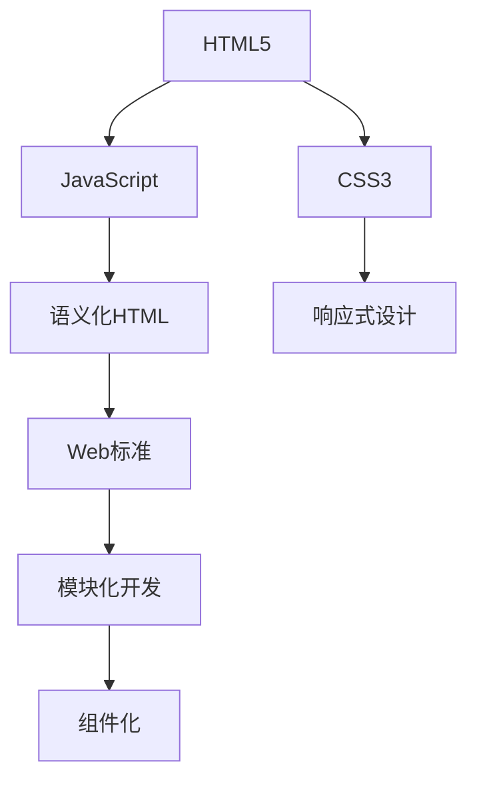

                 

# Web前端技术栈：HTML5、CSS3与JavaScript

## 1. 背景介绍

### 1.1 问题由来
随着Web技术的不断演进，前端技术栈经历了从HTML、CSS到JavaScript的飞速发展。当前，这一技术栈已经成为Web应用开发的基础。HTML5、CSS3和JavaScript这三者缺一不可，共同支撑了Web前端开发的高效性和丰富性。本文将对这三者的核心概念、原理与应用进行详细介绍，并结合实际案例，展示如何构建一个强大的Web前端技术栈。

## 2. 核心概念与联系

### 2.1 核心概念概述

为更好地理解HTML5、CSS3与JavaScript的有机结合，本节将介绍几个核心概念：

- **HTML5**：超文本标记语言的第5版，是Web前端的基础语言，用于定义文档结构和内容。
- **CSS3**：层叠样式表的第3版，用于页面布局、排版和样式设计，是HTML的视觉补充。
- **JavaScript**：一种脚本语言，用于创建交互式Web页面和动态内容，是Web前端的行为补充。
- **语义化HTML**：强调文档结构的语义性，使文档更容易被搜索引擎理解和处理。
- **响应式设计**：通过CSS3和JavaScript实现自适应页面布局，适应不同设备的显示效果。
- **Web标准**：包括HTML5、CSS3、JavaScript等标准，保证跨浏览器兼容性和可维护性。
- **模块化开发**：将复杂的Web前端项目拆分为可重用的模块，提高开发效率和维护性。
- **组件化**：通过组件化构建可复用、可扩展的前端组件，提升开发效率和用户体验。

这些核心概念之间的逻辑关系可以通过以下Mermaid流程图来展示：



这个流程图展示了几者之间的联系：

1. HTML5是基础，定义文档内容和结构。
2. CSS3和JavaScript在此基础上提供视觉和行为补充。
3. 语义化HTML、响应式设计、Web标准、模块化开发和组件化，都是基于HTML5、CSS3和JavaScript实现的高级开发技术。

## 3. 核心算法原理 & 具体操作步骤

### 3.1 算法原理概述

Web前端技术栈的核心算法原理主要包括HTML、CSS和JavaScript的基本工作机制。以下是对这三者的详细解析：

- **HTML**：通过标签描述文档的结构和内容，浏览器根据标签解析渲染页面。
- **CSS**：使用选择器和属性，对HTML元素进行样式和布局设置，实现页面的排版和视觉效果。
- **JavaScript**：通过DOM操作和事件驱动，实现页面交互和动态效果，提供丰富的Web应用功能。

### 3.2 算法步骤详解

#### 3.2.1 HTML的基本操作

HTML文档由标签和内容组成，基本操作包括：

1. 创建标签：通过标签定义文档结构和内容。
2. 添加属性：通过属性设置元素的特性和行为。
3. 添加子元素：通过嵌套标签定义文档层次结构。

#### 3.2.2 CSS的基本操作

CSS用于定义页面的样式和布局，基本操作包括：

1. 选择器：通过选择器定位HTML元素，如ID选择器、类选择器、标签选择器等。
2. 属性：通过属性设置元素的样式和布局，如颜色、大小、位置等。
3. 盒子模型：通过盒子模型定义元素的显示方式和布局，如display、position等。

#### 3.2.3 JavaScript的基本操作

JavaScript用于实现页面的交互和动态效果，基本操作包括：

1. DOM操作：通过JavaScript获取和操作HTML元素，实现页面元素的增删改查。
2. 事件处理：通过JavaScript监听和处理用户事件，实现页面交互和动态效果。
3. 函数和变量：通过JavaScript定义函数和变量，实现复杂的逻辑处理。

### 3.3 算法优缺点

#### 3.3.1 HTML的优点和缺点

- **优点**：
  - 语义化HTML使文档结构更加清晰，易于理解和维护。
  - 标准的HTML标签和属性可以保证跨浏览器兼容性。
  - 支持多媒体和表单，丰富了Web页面的内容和功能。

- **缺点**：
  - 对于复杂的布局和动态效果，需要配合CSS和JavaScript实现。
  - HTML标签和属性较多，初学者容易混淆。

#### 3.3.2 CSS的优点和缺点

- **优点**：
  - CSS提供了强大的样式和布局能力，使页面设计更加灵活和美观。
  - 通过选择器可以实现高度定制化的样式设置。
  - 支持响应式设计，适应不同设备的显示效果。

- **缺点**：
  - CSS代码量大，需要不断调试和优化。
  - 性能优化需要一定的技术和经验。

#### 3.3.3 JavaScript的优点和缺点

- **优点**：
  - JavaScript提供了强大的交互和动态效果，使页面更加生动和用户友好。
  - 支持事件驱动和异步编程，实现复杂的逻辑处理和数据交互。
  - 丰富的第三方库和框架，方便开发者实现复杂的Web应用。

- **缺点**：
  - JavaScript代码复杂度较高，容易出错。
  - 浏览器环境复杂，需要考虑兼容性和安全性问题。

### 3.4 算法应用领域

HTML5、CSS3和JavaScript的应用领域非常广泛，以下列举几个典型应用：

- **Web应用开发**：通过HTML、CSS和JavaScript实现动态、交互式的Web页面。
- **响应式设计**：通过CSS3和JavaScript实现自适应页面布局，适应不同设备的显示效果。
- **前端框架**：如React、Vue、Angular等，提供丰富的组件和工具，简化前端开发。
- **动画效果**：通过CSS3和JavaScript实现复杂的动画效果，提升用户体验。
- **游戏开发**：通过JavaScript实现游戏的逻辑和交互，结合WebGL实现高性能图形渲染。
- **物联网**：通过JavaScript实现设备间的通信和控制，实现智能家居和工业控制等应用。

## 4. 数学模型和公式 & 详细讲解 & 举例说明

### 4.1 数学模型构建

HTML、CSS和JavaScript的核心算法原理主要基于页面渲染、布局和交互等逻辑。以下将详细讲解HTML、CSS和JavaScript的数学模型构建。

#### 4.1.1 HTML的数学模型

HTML的数学模型主要涉及标签和内容的结构关系。通过树形结构表示HTML文档，每个节点代表一个HTML元素，包含属性和子元素。HTML的数学模型可以表示为：

$$
\text{HTML文档} = \lbrace \text{标签}_i \rbrace_{i=1}^n
$$

其中，每个标签元素包含以下信息：

- **属性**：通过属性描述元素的类型、内容和特性，如class、id、src等。
- **子元素**：通过嵌套标签定义文档层次结构，如div、p、img等。

#### 4.1.2 CSS的数学模型

CSS的数学模型主要涉及选择器和属性的匹配关系。通过规则集定义CSS样式，每个规则集包含选择器和属性，表示对特定元素的应用。CSS的数学模型可以表示为：

$$
\text{CSS样式} = \lbrace (\text{选择器}, \text{属性}) \rbrace_{i=1}^m
$$

其中，每个规则集包含以下信息：

- **选择器**：通过选择器定位HTML元素，如ID选择器、类选择器、标签选择器等。
- **属性**：通过属性设置元素的样式和布局，如颜色、大小、位置等。

#### 4.1.3 JavaScript的数学模型

JavaScript的数学模型主要涉及DOM操作和事件处理。通过DOM树和事件流表示JavaScript执行的逻辑，每个节点代表一个DOM元素，包含事件和处理函数。JavaScript的数学模型可以表示为：

$$
\text{JavaScript逻辑} = \lbrace (\text{DOM元素}, \text{事件}, \text{处理函数}) \rbrace_{i=1}^p
$$

其中，每个DOM元素包含以下信息：

- **事件**：通过事件监听器捕获用户交互行为，如click、scroll、resize等。
- **处理函数**：通过函数定义处理逻辑，实现复杂的逻辑处理和数据交互。

### 4.2 公式推导过程

#### 4.2.1 HTML的公式推导

HTML的公式推导主要涉及标签和内容的结构关系。通过树形结构表示HTML文档，每个节点代表一个HTML元素，包含属性和子元素。

假设HTML文档包含n个标签，每个标签包含m个属性和k个子元素，则HTML文档的数学模型可以表示为：

$$
\text{HTML文档} = \lbrace \text{标签}_i \rbrace_{i=1}^n
$$

每个标签元素包含以下信息：

- **属性**：通过属性描述元素的类型、内容和特性，如class、id、src等。
- **子元素**：通过嵌套标签定义文档层次结构，如div、p、img等。

#### 4.2.2 CSS的公式推导

CSS的公式推导主要涉及选择器和属性的匹配关系。通过规则集定义CSS样式，每个规则集包含选择器和属性，表示对特定元素的应用。

假设CSS样式包含m个规则集，每个规则集包含n个选择器和k个属性，则CSS样式的数学模型可以表示为：

$$
\text{CSS样式} = \lbrace (\text{选择器}, \text{属性}) \rbrace_{i=1}^m
$$

每个规则集包含以下信息：

- **选择器**：通过选择器定位HTML元素，如ID选择器、类选择器、标签选择器等。
- **属性**：通过属性设置元素的样式和布局，如颜色、大小、位置等。

#### 4.2.3 JavaScript的公式推导

JavaScript的公式推导主要涉及DOM操作和事件处理。通过DOM树和事件流表示JavaScript执行的逻辑，每个节点代表一个DOM元素，包含事件和处理函数。

假设JavaScript逻辑包含p个DOM元素，每个DOM元素包含n个事件和k个处理函数，则JavaScript逻辑的数学模型可以表示为：

$$
\text{JavaScript逻辑} = \lbrace (\text{DOM元素}, \text{事件}, \text{处理函数}) \rbrace_{i=1}^p
$$

每个DOM元素包含以下信息：

- **事件**：通过事件监听器捕获用户交互行为，如click、scroll、resize等。
- **处理函数**：通过函数定义处理逻辑，实现复杂的逻辑处理和数据交互。

### 4.3 案例分析与讲解

#### 4.3.1 HTML案例分析

以下是一个简单的HTML文档案例，分析其结构关系：

```html
<!DOCTYPE html>
<html>
<head>
  <meta charset="UTF-8">
  <title>HTML5案例</title>
</head>
<body>
  <header>
    <h1>欢迎来到HTML5案例</h1>
  </header>
  <main>
    <section>
      <h2>第一部分</h2>
      <p>这是一个HTML5案例。</p>
    </section>
    <section>
      <h2>第二部分</h2>
      <p>这个案例展示了HTML5的基本操作。</p>
    </section>
  </main>
  <footer>
    <p>版权所有 &copy; 2023</p>
  </footer>
</body>
</html>
```

这个HTML文档包含以下标签：

- `<!DOCTYPE html>`：声明文档类型为HTML5。
- `<html>`：包含整个文档的根元素。
- `<head>`：定义文档的元数据和资源引用。
- `<body>`：包含文档的可见内容。
- `<header>`：定义文档的页眉部分。
- `<h1>`：定义文档的标题。
- `<main>`：定义文档的主要内容区域。
- `<section>`：定义文档的章节部分。
- `<h2>`：定义章节的标题。
- `<p>`：定义段落文本。
- `<footer>`：定义文档的页脚部分。

#### 4.3.2 CSS案例分析

以下是一个简单的CSS样式案例，分析其选择器和属性的匹配关系：

```html
<!DOCTYPE html>
<html>
<head>
  <meta charset="UTF-8">
  <title>CSS3案例</title>
  <style>
    body {
      font-family: Arial, sans-serif;
      background-color: #f0f0f0;
    }
    header {
      background-color: #333;
      color: #fff;
      padding: 20px;
      text-align: center;
    }
    main {
      margin: 20px;
    }
    section {
      margin-bottom: 20px;
      padding: 20px;
      border: 1px solid #ccc;
    }
    h1 {
      font-size: 36px;
    }
    h2 {
      font-size: 24px;
    }
    footer {
      text-align: center;
      font-size: 14px;
      color: #999;
    }
  </style>
</head>
<body>
  <header>
    <h1>欢迎来到CSS3案例</h1>
  </header>
  <main>
    <section>
      <h2>第一部分</h2>
      <p>这是一个CSS3案例。</p>
    </section>
    <section>
      <h2>第二部分</h2>
      <p>这个案例展示了CSS3的基本操作。</p>
    </section>
  </main>
  <footer>
    <p>版权所有 &copy; 2023</p>
  </footer>
</body>
</html>
```

这个CSS样式包含以下选择器和属性：

- `body`：定义整个文档的样式。
- `header`：定义文档的页眉部分。
- `main`：定义文档的主要内容区域。
- `section`：定义文档的章节部分。
- `h1`：定义文档的标题。
- `h2`：定义章节的标题。
- `footer`：定义文档的页脚部分。

#### 4.3.3 JavaScript案例分析

以下是一个简单的JavaScript代码案例，分析其DOM操作和事件处理：

```html
<!DOCTYPE html>
<html>
<head>
  <meta charset="UTF-8">
  <title>JavaScript案例</title>
</head>
<body>
  <div id="counter">
    <p>点击按钮增加计数：0</p>
    <button id="increment">增加计数</button>
  </div>

  <script>
    let count = 0;
    const counter = document.getElementById('counter');
    const button = document.getElementById('increment');

    button.addEventListener('click', function() {
      count++;
      counter.querySelector('p').textContent = `点击按钮增加计数：${count}`;
    });
  </script>
</body>
</html>
```

这个JavaScript代码包含以下DOM元素和事件处理函数：

- `<div id="counter">`：定义一个包含计数器和按钮的容器。
- `<p>`：定义显示计数的文本。
- `<button>`：定义增加计数的按钮。
- `addEventListener`：通过事件监听器监听按钮的click事件，实现计数器的逻辑处理。

## 5. 项目实践：代码实例和详细解释说明

### 5.1 开发环境搭建

在进行Web前端开发前，我们需要准备好开发环境。以下是使用VSCode进行开发的环境配置流程：

1. 安装Node.js：从官网下载并安装Node.js，用于运行JavaScript代码。
2. 安装VSCode：从官网下载并安装VSCode，支持JavaScript的开发和调试。
3. 安装浏览器：安装Chrome或Firefox浏览器，用于测试前端页面。

完成上述步骤后，即可在VSCode中开始Web前端开发。

### 5.2 源代码详细实现

下面我们以一个简单的Web应用为例，展示如何使用HTML5、CSS3和JavaScript构建一个响应式页面。

首先，创建index.html文件，包含HTML结构：

```html
<!DOCTYPE html>
<html>
<head>
  <meta charset="UTF-8">
  <title>响应式页面</title>
  <link rel="stylesheet" href="style.css">
</head>
<body>
  <header>
    <h1>响应式页面</h1>
  </header>
  <main>
    <section>
      <h2>第一部分</h2>
      <p>这是一个响应式页面。</p>
    </section>
    <section>
      <h2>第二部分</h2>
      <p>这个页面展示了响应式设计的实现。</p>
    </section>
  </main>
  <footer>
    <p>版权所有 &copy; 2023</p>
  </footer>
</body>
</html>
```

然后，创建style.css文件，包含CSS样式：

```css
body {
  font-family: Arial, sans-serif;
  background-color: #f0f0f0;
  margin: 0;
}

header {
  background-color: #333;
  color: #fff;
  padding: 20px;
  text-align: center;
}

main {
  margin: 20px;
}

section {
  margin-bottom: 20px;
  padding: 20px;
  border: 1px solid #ccc;
}

h1 {
  font-size: 36px;
}

h2 {
  font-size: 24px;
}

footer {
  text-align: center;
  font-size: 14px;
  color: #999;
}

@media (max-width: 768px) {
  main {
    margin: 10px;
  }
  section {
    padding: 10px;
  }
}
```

最后，创建script.js文件，包含JavaScript代码：

```javascript
const button = document.getElementById('button');
const counter = document.getElementById('counter');
let count = 0;

button.addEventListener('click', function() {
  count++;
  counter.textContent = `计数：${count}`;
});
```

在index.html中引用style.css和script.js文件：

```html
<head>
  <meta charset="UTF-8">
  <title>响应式页面</title>
  <link rel="stylesheet" href="style.css">
</head>
<body>
  <header>
    <h1>响应式页面</h1>
  </header>
  <main>
    <section>
      <h2>第一部分</h2>
      <p>这是一个响应式页面。</p>
    </section>
    <section>
      <h2>第二部分</h2>
      <p>这个页面展示了响应式设计的实现。</p>
    </section>
  </main>
  <footer>
    <p>版权所有 &copy; 2023</p>
  </footer>
  <button id="button">增加计数</button>
  <div id="counter">计数：0</div>

  <script src="script.js"></script>
</body>
</html>
```

### 5.3 代码解读与分析

让我们再详细解读一下关键代码的实现细节：

**index.html文件**：
- 包含HTML文档的基本结构和内容。
- `<link>`标签引用CSS样式表，实现页面的样式和布局。
- `<script>`标签引用JavaScript文件，实现页面的行为逻辑。
- `<button>`和`<div>`元素用于实现计数器的交互。

**style.css文件**：
- 定义页面的默认样式，包括字体、背景、边距等。
- 通过选择器和属性实现布局和样式设置，如`header`、`main`、`section`、`h1`、`h2`、`footer`等。
- 使用`@media`规则实现响应式设计，适应不同设备的显示效果。

**script.js文件**：
- 通过`document.getElementById`方法获取DOM元素，实现计数器的DOM操作。
- 使用`addEventListener`方法监听按钮的click事件，实现计数器的逻辑处理。
- 通过`textContent`属性更新计数器的文本内容。

这个简单的Web应用展示了HTML5、CSS3和JavaScript的基本操作。通过这三种技术的有机结合，我们可以实现响应式设计的Web页面，提供更加灵活和美观的用户体验。

## 6. 实际应用场景

### 6.1 智能广告系统

智能广告系统需要根据用户的兴趣和行为，动态展示广告内容。通过Web前端技术栈，可以实现动态加载和渲染广告内容，提升广告效果。

具体而言，可以收集用户的历史行为数据，如浏览记录、搜索关键词等，通过机器学习算法，构建用户兴趣模型。在广告投放时，根据用户的兴趣模型，动态生成广告内容，并实时展示在用户的浏览器中。通过Web前端技术栈，可以实现广告内容的动态加载和渲染，提供更加个性化的广告体验。

### 6.2 在线教育平台

在线教育平台需要提供丰富的学习资源和互动功能，提升学习效果和用户体验。通过Web前端技术栈，可以实现互动式学习页面，增强学习趣味性。

具体而言，可以开发互动式课程页面，通过JavaScript实现互动效果，如视频播放、问答互动等。同时，使用HTML5的语义化标签和CSS3的样式布局，提升页面的可访问性和美观度。通过Web前端技术栈，可以实现高质量的在线教育平台，提供更加丰富的学习体验。

### 6.3 电子商务平台

电子商务平台需要提供商品展示、购物车和支付等功能，提升购物体验和交易效率。通过Web前端技术栈，可以实现高效的页面渲染和交互，提升用户购物体验。

具体而言，可以开发商品展示页面，通过JavaScript实现动态加载和渲染商品信息。使用HTML5的语义化标签和CSS3的样式布局，提升页面的可访问性和美观度。同时，使用Web前端技术栈实现购物车和支付功能，提升用户的购物体验和交易效率。通过Web前端技术栈，可以实现高效的电子商务平台，提供更加便捷和流畅的购物体验。

### 6.4 未来应用展望

随着Web前端技术栈的不断发展，未来的应用场景将更加广泛，带来更多创新和突破。以下是一些未来应用展望：

1. **增强现实**：通过Web前端技术栈，实现增强现实的应用场景，提供更加沉浸式的用户体验。
2. **虚拟现实**：通过Web前端技术栈，实现虚拟现实的应用场景，提供更加真实的沉浸式体验。
3. **物联网**：通过Web前端技术栈，实现物联网的应用场景，提供更加智能和交互的体验。
4. **人工智能**：通过Web前端技术栈，结合人工智能技术，实现更加智能和个性化的应用场景，提升用户体验。
5. **区块链**：通过Web前端技术栈，结合区块链技术，实现更加安全和可信的应用场景，提升用户的信任度。

## 7. 工具和资源推荐

### 7.1 学习资源推荐

为了帮助开发者系统掌握Web前端技术栈的理论基础和实践技巧，这里推荐一些优质的学习资源：

1. **《JavaScript高级程序设计》**：是一本经典JavaScript教程，涵盖了JavaScript的基础和高级知识。
2. **《HTML5权威指南》**：是一本全面介绍HTML5的指南，详细讲解了HTML5的各个部分。
3. **《CSS3权威指南》**：是一本全面介绍CSS3的指南，详细讲解了CSS3的各个部分。
4. **《Responsive Web Design with HTML5 and CSS3》**：是一本响应式设计的指南，详细讲解了响应式设计的实现方法。
5. **《Web开发基础》课程**：在Coursera上提供的Web开发基础课程，包括HTML5、CSS3和JavaScript的详细讲解。

通过对这些资源的学习实践，相信你一定能够快速掌握Web前端技术栈的理论基础和实践技巧，并用于解决实际的Web开发问题。

### 7.2 开发工具推荐

高效的开发离不开优秀的工具支持。以下是几款用于Web前端开发的工具：

1. **VSCode**：一款功能强大的代码编辑器，支持HTML5、CSS3和JavaScript的开发和调试。
2. **Chrome DevTools**：一款集成的开发工具，支持JavaScript的调试、性能分析和网络监控等。
3. **React**：一款流行的JavaScript库，用于构建交互式Web页面。
4. **Vue**：一款流行的JavaScript框架，用于构建动态Web应用。
5. **Angular**：一款流行的JavaScript框架，用于构建复杂的Web应用。
6. **Webpack**：一款现代化的模块打包工具，支持JavaScript、CSS和图片的打包和优化。

合理利用这些工具，可以显著提升Web前端开发效率，加快创新迭代的步伐。

### 7.3 相关论文推荐

Web前端技术栈的发展源于学界的持续研究。以下是几篇奠基性的相关论文，推荐阅读：

1. **《Web与移动应用程序的响应式网页设计》**：介绍了响应式设计的原理和实现方法。
2. **《Web前端开发框架：React、Vue和Angular的比较》**：比较了三种流行的前端开发框架的优缺点。
3. **《JavaScript语言的演变：从ECMAScript 5到ES6》**：详细讲解了JavaScript的演变历程和最新特性。
4. **《HTML5和CSS3的语义化设计》**：探讨了语义化设计的原理和实践方法。
5. **《Web前端技术栈的未来发展趋势》**：分析了Web前端技术栈的未来发展方向和趋势。

这些论文代表了大前端技术栈的发展脉络。通过学习这些前沿成果，可以帮助研究者把握学科前进方向，激发更多的创新灵感。

## 8. 总结：未来发展趋势与挑战

### 8.1 总结

本文对HTML5、CSS3与JavaScript的核心概念、原理与应用进行了详细介绍。通过系统的讲解和实例展示，展示了如何使用这三种技术构建一个强大的Web前端技术栈。HTML5、CSS3与JavaScript的有机结合，为Web前端开发提供了丰富的工具和框架，使Web应用开发更加高效、灵活和美观。

## 8.2 未来发展趋势

展望未来，Web前端技术栈将继续快速发展，带来更多创新和突破：

1. **前端框架的进化**：随着JavaScript的不断发展和演化，前端框架也在不断进步。新的框架和库将不断涌现，提供更加丰富的功能和工具。
2. **响应式设计的深入**：响应式设计的理念将继续深入人心，Web前端技术栈将更加注重适应不同设备的显示效果。
3. **全栈开发的普及**：随着Web前端技术栈的发展，越来越多的开发者将掌握前端、后端和数据库等多种技能，推动全栈开发趋势的普及。
4. **Web标准和语义化的推广**：Web前端技术栈将继续推广Web标准和语义化设计，提升Web应用的可访问性和可维护性。
5. **新技术的融合**：Web前端技术栈将继续与其他新技术融合，如人工智能、增强现实、虚拟现实等，推动Web应用的创新和突破。

## 8.3 面临的挑战

尽管Web前端技术栈已经取得了显著成就，但在迈向更加智能化、普适化应用的过程中，它仍面临诸多挑战：

1. **跨浏览器兼容性**：不同浏览器对HTML5和CSS3的支持程度不同，需要不断优化和兼容。
2. **性能优化**：JavaScript代码量大，容易影响页面性能。需要不断优化和压缩代码，提高页面加载速度和渲染效率。
3. **安全性问题**：Web前端技术栈容易受到跨站脚本攻击(XSS)等安全威胁。需要不断加强安全防护和代码审查。
4. **开发效率**：复杂的Web应用需要大量前端开发工作。需要不断提升开发效率和工具支持。
5. **文档和组件库的缺乏**：现有的文档和组件库较少，开发者需要不断学习和探索。

## 8.4 研究展望

面对Web前端技术栈所面临的挑战，未来的研究需要在以下几个方面寻求新的突破：

1. **跨浏览器兼容性**：开发更加兼容和稳定的Web应用，提高跨浏览器兼容性。
2. **性能优化**：优化JavaScript代码，提高页面性能和用户体验。
3. **安全性增强**：加强Web前端技术栈的安全防护，避免安全威胁。
4. **开发效率提升**：开发更加高效的前端框架和工具，提升开发效率。
5. **文档和组件库的丰富**：开发更多的文档和组件库，方便开发者学习和使用。

这些研究方向的探索，必将引领Web前端技术栈走向更加成熟和高效的发展阶段，为Web应用的开发和部署带来新的突破和创新。

## 9. 附录：常见问题与解答

**Q1：Web前端技术栈是否适用于所有Web应用？**

A: 是的，Web前端技术栈适用于大多数Web应用开发，包括静态页面、动态页面、Web应用和Web服务。HTML5、CSS3和JavaScript的有机结合，提供了丰富的功能和工具，使Web应用开发更加高效、灵活和美观。

**Q2：如何提高Web应用的性能？**

A: 提高Web应用性能的方法很多，以下是一些常见方法：

1. 使用CDN（内容分发网络）：减少页面加载时间，提高访问速度。
2. 使用HTTP缓存：减少重复请求，提高页面加载速度。
3. 压缩和合并代码：减小页面体积，提高加载速度。
4. 使用前端框架：如React、Vue、Angular等，提供高效的组件和工具，减少开发时间和代码量。
5. 使用异步加载：通过懒加载和预加载技术，提高页面渲染效率。
6. 使用Web Workers：通过多线程处理任务，提高页面性能。

**Q3：如何实现Web应用的响应式设计？**

A: 实现Web应用的响应式设计，需要以下步骤：

1. 使用CSS3的媒体查询：通过@media规则，根据设备宽度和屏幕大小，实现不同设备的样式适配。
2. 使用Flexbox和Grid布局：通过Flexbox和Grid布局，实现页面元素的自适应布局。
3. 使用响应式图片和视频：通过srcset属性和picture元素，实现不同设备的图片和视频适配。
4. 使用JavaScript的resize事件：通过resize事件，动态调整页面布局和样式。

**Q4：如何使用Web前端技术栈开发Web服务？**

A: 使用Web前端技术栈开发Web服务，可以采用以下方法：

1. 使用Node.js和Express框架：通过Node.js和Express框架，开发Web服务的后端逻辑。
2. 使用Socket.io或WebSockets：通过Socket.io或WebSockets，实现Web服务的实时通信。
3. 使用HTTPS和SSL证书：通过HTTPS和SSL证书，实现Web服务的安全通信。
4. 使用WebSockets的广播功能：通过WebSockets的广播功能，实现Web服务的实时推送。

**Q5：如何确保Web应用的安全性？**

A: 确保Web应用的安全性，需要以下措施：

1. 使用HTTPS和SSL证书：通过HTTPS和SSL证书，实现Web应用的安全通信。
2. 使用跨站脚本攻击(XSS)防护措施：通过输出编码和输入验证等措施，避免XSS攻击。
3. 使用跨站请求伪造攻击(CSRF)防护措施：通过CSRF令牌等措施，避免CSRF攻击。
4. 使用服务器端验证：通过服务器端验证，避免SQL注入和文件上传等安全威胁。

---

作者：禅与计算机程序设计艺术 / Zen and the Art of Computer Programming

