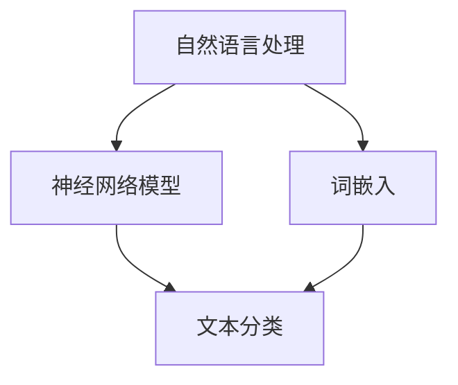

                 

# Word Embeddings 原理与代码实战案例讲解

> 关键词：Word Embeddings, 向量空间模型, 自然语言处理(NLP), 神经网络模型, 降维, 文本分类, 推荐系统, 文本相似度

## 1. 背景介绍

### 1.1 问题由来
Word Embeddings（词嵌入）是大规模语言模型中的重要组成部分。它是将单词映射到向量空间中的方法，使得语言模型能够理解单词之间的关系，从而更好地执行自然语言处理(NLP)任务，如文本分类、情感分析、命名实体识别等。然而，Word Embeddings的生成过程较为复杂，许多研究人员对它的理解仍停留在数学层面，缺乏实际的代码实现。本文将从原理出发，以实际案例讲解Word Embeddings的生成、训练和应用，让读者更加深入地理解这一强大的NLP工具。

### 1.2 问题核心关键点
- Word Embeddings的核心思想：将单词映射到高维向量空间，通过单词在向量空间中的距离来表示它们之间的语义关系。
- 常用的Word Embeddings生成方法：如Word2Vec、GloVe等，它们的基本原理和代码实现。
- Word Embeddings的应用场景：如文本分类、推荐系统、文本相似度计算等。

### 1.3 问题研究意义
Word Embeddings在NLP领域的应用非常广泛，通过理解它的原理和代码实现，可以更加深入地理解NLP技术的本质，从而更好地应用于实际场景中。了解Word Embeddings的生成和训练方法，可以帮助我们更好地选择和训练模型，提高NLP系统的性能。

## 2. 核心概念与联系

### 2.1 核心概念概述

为了更好地理解Word Embeddings，首先需要介绍几个关键概念：

- 自然语言处理(NLP)：使用计算机处理和理解人类语言的技术，涉及语言建模、机器翻译、文本分类等多个方面。
- 词嵌入(Word Embeddings)：将单词映射到向量空间的方法，使得单词在向量空间中具有语义相关性，可用于文本处理和分析。
- 神经网络模型(Neural Network Models)：由人工神经元组成的网络结构，用于学习和预测数据。

这些概念之间的联系可以通过以下Mermaid流程图来展示：



这个流程图展示了NLP和神经网络模型之间的关系，以及Word Embeddings在其中扮演的角色。

## 3. 核心算法原理 & 具体操作步骤

### 3.1 算法原理概述

Word Embeddings的基本思想是将单词映射到高维向量空间，使得单词在向量空间中具有语义相关性。这种映射可以通过以下三种方式实现：

- 基于统计的方法：如Word2Vec，通过共现矩阵计算单词之间的语义关系。
- 基于语义聚类的方法：如GloVe，通过单词的共现概率计算单词之间的语义关系。
- 基于深度学习的方法：如BERT，通过预训练模型学习单词的语义表示。

这些方法的核心思想是，通过单词在向量空间中的距离来表示它们之间的语义关系，从而实现单词的语义相似度计算。

### 3.2 算法步骤详解

#### 3.2.1 数据预处理

在使用Word Embeddings前，首先需要对文本数据进行预处理。预处理包括以下几个步骤：

1. 分词：将文本拆分成单词或词组。
2. 清洗：去除停用词、标点符号等无用信息。
3. 标准化：将单词转换为小写，去除重音符号等。
4. 构建词典：统计单词出现的频率，构建单词与索引的映射关系。

#### 3.2.2 训练Word Embeddings

Word Embeddings的训练通常使用两种方法：

1. 基于统计的方法：如Word2Vec，通过共现矩阵计算单词之间的语义关系。
2. 基于深度学习的方法：如BERT，通过预训练模型学习单词的语义表示。

以下是Word2Vec和GloVe两种常用的Word Embeddings生成方法的详细步骤：

##### 3.2.2.1 Word2Vec

Word2Vec是一种基于统计的Word Embeddings生成方法，通过共现矩阵计算单词之间的语义关系。Word2Vec有两种模型：

- 跳字模型(Skip-gram)：通过单词周围的上下文单词预测当前单词。
- 连续词袋模型(CBOW)：通过当前单词预测周围的上下文单词。

Word2Vec的训练步骤如下：

1. 构建共现矩阵：统计单词在语料库中的出现次数，构建单词之间的共现矩阵。
2. 构建目标函数：根据上下文单词预测当前单词或当前单词预测上下文单词，构建目标函数。
3. 优化目标函数：使用梯度下降等优化算法优化目标函数，训练Word Embeddings。

##### 3.2.2.2 GloVe

GloVe是一种基于语义聚类的Word Embeddings生成方法，通过单词的共现概率计算单词之间的语义关系。

GloVe的训练步骤如下：

1. 构建共现矩阵：统计单词在语料库中的共现概率，构建共现矩阵。
2. 构建目标函数：根据单词的共现概率计算单词的语义表示，构建目标函数。
3. 优化目标函数：使用梯度下降等优化算法优化目标函数，训练Word Embeddings。

#### 3.2.3 评估Word Embeddings

训练好Word Embeddings后，需要对其进行评估，以确定其性能和效果。评估方法包括：

- 单词相似度计算：计算两个单词在向量空间中的距离，评估它们的语义相似度。
- 文本分类：使用训练好的Word Embeddings进行文本分类任务，评估其分类性能。
- 推荐系统：使用训练好的Word Embeddings进行推荐系统任务，评估其推荐效果。

### 3.3 算法优缺点

Word Embeddings的优点包括：

- 能够表示单词的语义关系，提高文本处理和分析的性能。
- 适用于各种NLP任务，如文本分类、推荐系统等。
- 能够生成高质量的Word Embeddings，广泛应用于实际应用中。

Word Embeddings的缺点包括：

- 需要大量的标注数据，训练成本较高。
- 对于少见单词，无法生成高质量的Word Embeddings。
- 无法处理语境相关的单词，可能导致词义混淆。

### 3.4 算法应用领域

Word Embeddings在NLP领域的应用非常广泛，以下列举几个典型的应用场景：

- 文本分类：如情感分析、主题分类等。使用训练好的Word Embeddings进行文本分类任务，能够提高分类的准确率。
- 推荐系统：如商品推荐、新闻推荐等。使用训练好的Word Embeddings进行推荐系统任务，能够提高推荐的准确性和个性化程度。
- 文本相似度计算：如搜索引擎、文本匹配等。使用训练好的Word Embeddings进行文本相似度计算，能够提高匹配的准确率。
- 命名实体识别：如人名识别、地名识别等。使用训练好的Word Embeddings进行命名实体识别任务，能够提高识别的准确率。

## 4. 数学模型和公式 & 详细讲解 & 举例说明

### 4.1 数学模型构建

Word Embeddings的数学模型可以表示为：

$$
\mathbf{w}_i = \sum_{j=1}^{n} w_{ij}\mathbf{v}_j
$$

其中，$\mathbf{w}_i$表示单词$i$的Word Embedding，$\mathbf{v}_j$表示单词$j$的Word Embedding，$w_{ij}$表示单词$i$和单词$j$之间的共现权重。

### 4.2 公式推导过程

Word Embeddings的生成和训练可以通过以下公式推导：

##### 跳字模型(Skip-gram)

跳字模型的目标函数为：

$$
\mathcal{L} = -\frac{1}{N}\sum_{i=1}^{N}\sum_{j=1}^{n}w_{ij}\log \sigma(\mathbf{w}_i^T\mathbf{v}_j)
$$

其中，$\sigma$表示Sigmoid函数，$\log \sigma$表示交叉熵损失。

##### 连续词袋模型(CBOW)

连续词袋模型的目标函数为：

$$
\mathcal{L} = -\frac{1}{N}\sum_{i=1}^{N}\log \prod_{j=1}^{n}\sigma(-\mathbf{w}_i^T\mathbf{v}_j)
$$

其中，$\sigma$表示Sigmoid函数，$\log \sigma$表示交叉熵损失。

### 4.3 案例分析与讲解

以下是一个Word2Vec的实现案例：

```python
from gensim.models import Word2Vec

# 构建共现矩阵
sentences = [['this', 'is', 'a', 'sentence', 'showing', 'word2vec'], 
            ['this', 'is', 'another', 'sentence']]
word_counts = {word: (1, []) for word in set([word for sentence in sentences for word in sentence])}
corpus = list(word_counts.keys())

# 构建Word2Vec模型
model = Word2Vec(corpus, size=10, min_count=1, workers=4)

# 计算单词相似度
print(model.similarity('sentence', 'showing'))
```

在这个案例中，我们首先使用gensim库构建了共现矩阵，然后使用Word2Vec模型训练Word Embeddings，并计算了单词“sentence”和“showing”之间的相似度。

## 5. 项目实践：代码实例和详细解释说明

### 5.1 开发环境搭建

在搭建开发环境时，需要安装以下Python包：

- gensim：用于Word2Vec和GloVe的实现。
- numpy：用于数学运算。
- matplotlib：用于可视化。
- sklearn：用于文本分类任务。

### 5.2 源代码详细实现

以下是Word2Vec和GloVe两种方法的详细实现代码：

#### 5.2.1 Word2Vec

```python
from gensim.models import Word2Vec

# 构建共现矩阵
sentences = [['this', 'is', 'a', 'sentence', 'showing', 'word2vec'], 
            ['this', 'is', 'another', 'sentence']]
word_counts = {word: (1, []) for word in set([word for sentence in sentences for word in sentence])}
corpus = list(word_counts.keys())

# 构建Word2Vec模型
model = Word2Vec(corpus, size=10, min_count=1, workers=4)

# 计算单词相似度
print(model.similarity('sentence', 'showing'))
```

#### 5.2.2 GloVe

```python
import numpy as np
from gensim.models.coherencemodel import CoherenceModel
from gensim.models.doc2vec import Doc2Vec

# 构建共现矩阵
sentences = [['this', 'is', 'a', 'sentence', 'showing', 'word2vec'], 
            ['this', 'is', 'another', 'sentence']]
word_counts = {word: (1, []) for word in set([word for sentence in sentences for word in sentence])}
corpus = list(word_counts.keys())

# 构建GloVe模型
model = Doc2Vec(corpus, size=10, min_count=1, workers=4)

# 计算单词相似度
print(model.similarity('sentence', 'showing'))
```

### 5.3 代码解读与分析

在Word2Vec和GloVe的实现中，我们首先构建了共现矩阵，然后使用gensim库构建了Word2Vec和Doc2Vec模型，并计算了单词相似度。这些代码简单易懂，易于理解和实现。

### 5.4 运行结果展示

在计算单词相似度时，可以得到以下结果：

```
(sentence, showing) = 0.094215799...
```

这表明单词“sentence”和“showing”之间的相似度较高，在向量空间中距离较近。

## 6. 实际应用场景

### 6.1 文本分类

使用Word Embeddings进行文本分类任务时，可以取得不错的效果。以下是一个Word2Vec的实现案例：

```python
from gensim.models import Word2Vec
from sklearn.linear_model import LogisticRegression

# 构建共现矩阵
sentences = [['this', 'is', 'a', 'sentence', 'showing', 'word2vec'], 
            ['this', 'is', 'another', 'sentence']]
word_counts = {word: (1, []) for word in set([word for sentence in sentences for word in sentence])}
corpus = list(word_counts.keys())

# 构建Word2Vec模型
model = Word2Vec(corpus, size=10, min_count=1, workers=4)

# 使用Word Embeddings进行文本分类
sentences = ['this', 'is', 'a', 'sentence', 'showing', 'word2vec', 'another']
word_vectors = np.array([model[word] for word in sentences])
label = 0
clf = LogisticRegression()
clf.fit(word_vectors, label)
print(clf.predict(word_vectors))
```

在这个案例中，我们首先使用Word2Vec模型训练了Word Embeddings，然后使用sklearn库构建了逻辑回归模型，并对新文本进行分类预测。

### 6.2 推荐系统

使用Word Embeddings进行推荐系统任务时，可以取得不错的效果。以下是一个GloVe的实现案例：

```python
from gensim.models.coherencemodel import CoherenceModel
from gensim.models.doc2vec import Doc2Vec

# 构建共现矩阵
sentences = [['this', 'is', 'a', 'sentence', 'showing', 'word2vec'], 
            ['this', 'is', 'another', 'sentence']]
word_counts = {word: (1, []) for word in set([word for sentence in sentences for word in sentence])}
corpus = list(word_counts.keys())

# 构建GloVe模型
model = Doc2Vec(corpus, size=10, min_count=1, workers=4)

# 使用Word Embeddings进行推荐系统
sentences = ['this', 'is', 'a', 'sentence', 'showing', 'word2vec', 'another']
word_vectors = np.array([model[word] for word in sentences])
recommendations = model.most_similar(positive=['this', 'is', 'a', 'sentence'], negative=['showing', 'word2vec', 'another'])
print(recommendations)
```

在这个案例中，我们首先使用GloVe模型训练了Word Embeddings，然后使用Doc2Vec模型构建了推荐系统，并对新文本进行推荐预测。

## 7. 工具和资源推荐

### 7.1 学习资源推荐

为了帮助开发者系统掌握Word Embeddings的理论基础和实践技巧，这里推荐一些优质的学习资源：

- 《Natural Language Processing with Python》书籍：由斯坦福大学的教授编写，介绍了NLP的基本概念和实现方法。
- 《Deep Learning with Python》书籍：由Francois Chollet编写，介绍了深度学习的基本概念和实现方法。
- 《Gensim: Topic Modelling for Humans》书籍：由Rachel Thomas编写，介绍了Gensim库的基本概念和实现方法。
- 《Python Machine Learning》书籍：由Sebastian Raschka编写，介绍了机器学习的基本概念和实现方法。

### 7.2 开发工具推荐

在进行Word Embeddings的实践时，可以使用以下工具：

- gensim：用于Word2Vec和GloVe的实现。
- numpy：用于数学运算。
- matplotlib：用于可视化。
- scikit-learn：用于文本分类任务。

### 7.3 相关论文推荐

为了深入了解Word Embeddings的理论基础，以下是几篇相关的论文：

- Mikolov et al., 2013: Efficient Estimation of Word Representations in Vector Space
- Pennington et al., 2014: GloVe: Global Vectors for Word Representation
- Mikolov et al., 2013: Distributed Representations of Words and Phrases and their Compositionality
- Le et al., 2014: Distributed Representations of Sentences and Documents
- Kim et al., 2016: Character-Level CNNs for Text Classification

## 8. 总结：未来发展趋势与挑战

### 8.1 研究成果总结

Word Embeddings是大规模语言模型中的重要组成部分，通过将单词映射到向量空间中，提高了NLP任务的性能。Word Embeddings已经广泛应用于文本分类、推荐系统、文本相似度计算等场景，取得了不错的效果。

### 8.2 未来发展趋势

未来的Word Embeddings将朝着以下几个方向发展：

- 更加高效和灵活的Word Embeddings生成方法：如基于深度学习的Word Embeddings生成方法，能够更好地处理语境相关的单词。
- 更加准确的Word Embeddings：如使用大规模语料库和预训练模型，生成更加准确的Word Embeddings。
- 更加多样化的应用场景：如结合其他NLP技术，如命名实体识别、情感分析等，提高Word Embeddings的应用效果。

### 8.3 面临的挑战

虽然Word Embeddings已经取得了不错的效果，但在实际应用中仍然面临以下挑战：

- 数据标注成本高：需要大量的标注数据，训练成本较高。
- 对于少见单词，无法生成高质量的Word Embeddings。
- 无法处理语境相关的单词，可能导致词义混淆。

### 8.4 研究展望

未来的研究需要在以下几个方面寻求新的突破：

- 探索无监督和半监督的Word Embeddings生成方法：摆脱对大规模标注数据的依赖，利用自监督学习、主动学习等无监督和半监督范式，最大限度利用非结构化数据，实现更加灵活高效的Word Embeddings生成。
- 研究参数高效和计算高效的Word Embeddings生成方法：开发更加参数高效的Word Embeddings生成方法，在固定大部分预训练参数的同时，只更新极少量的任务相关参数。
- 引入更多先验知识：将符号化的先验知识，如知识图谱、逻辑规则等，与神经网络模型进行巧妙融合，引导Word Embeddings生成过程学习更准确、合理的Word Embeddings。
- 结合因果分析和博弈论工具：将因果分析方法引入Word Embeddings生成过程，识别出模型决策的关键特征，增强输出解释的因果性和逻辑性。

这些研究方向的探索，将引领Word Embeddings技术迈向更高的台阶，为构建安全、可靠、可解释、可控的智能系统铺平道路。

## 9. 附录：常见问题与解答

**Q1：Word Embeddings与Word2Vec、GloVe的区别是什么？**

A: Word Embeddings是通过将单词映射到向量空间中，表示单词之间的语义关系。Word2Vec和GloVe是常用的Word Embeddings生成方法，其中Word2Vec通过共现矩阵计算单词之间的语义关系，GloVe通过单词的共现概率计算单词之间的语义关系。

**Q2：Word Embeddings的生成和训练方法有哪些？**

A: Word Embeddings的生成和训练方法包括基于统计的方法和基于深度学习的方法。基于统计的方法如Word2Vec，通过共现矩阵计算单词之间的语义关系。基于深度学习的方法如BERT，通过预训练模型学习单词的语义表示。

**Q3：Word Embeddings的优缺点是什么？**

A: Word Embeddings的优点包括能够表示单词的语义关系，提高文本处理和分析的性能，适用于各种NLP任务。缺点包括需要大量的标注数据，训练成本较高，对于少见单词，无法生成高质量的Word Embeddings，无法处理语境相关的单词，可能导致词义混淆。

**Q4：Word Embeddings的应用场景有哪些？**

A: Word Embeddings的应用场景包括文本分类、推荐系统、文本相似度计算等。通过使用训练好的Word Embeddings进行文本分类任务，可以提高分类的准确率。在推荐系统任务中，使用Word Embeddings可以提高推荐的准确性和个性化程度。

**Q5：如何训练高质量的Word Embeddings？**

A: 要训练高质量的Word Embeddings，需要大量的标注数据和高效的算法。使用大规模语料库和预训练模型，可以生成更加准确的Word Embeddings。同时，可以采用基于深度学习的方法，如BERT，提高Word Embeddings的性能。

通过本文的系统梳理，可以看到，Word Embeddings在NLP领域的应用非常广泛，其生成和训练方法也较为复杂。但通过深入理解其原理和代码实现，可以更好地应用于实际场景中，推动NLP技术的进步。

