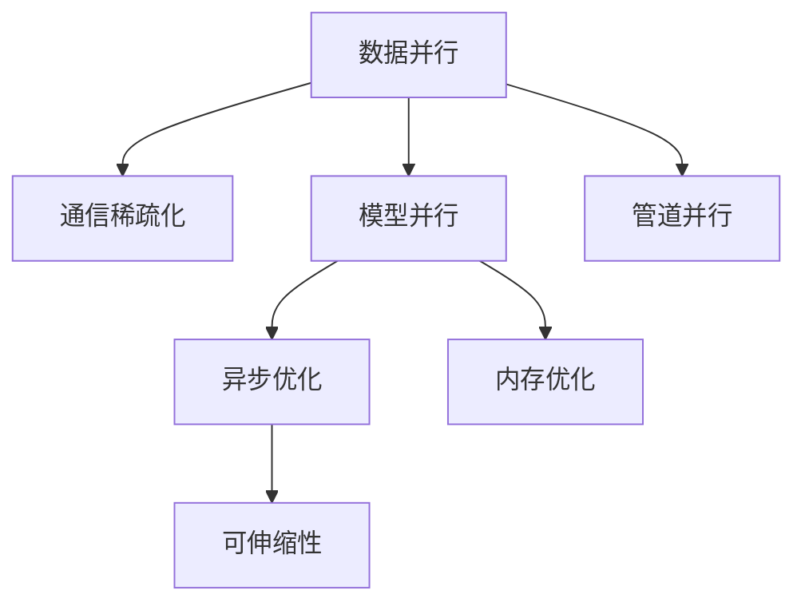
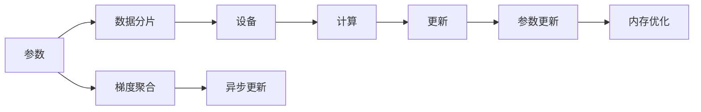

                 

# ZeRO优化：大规模分布式训练的突破

在当前大规模深度学习模型的训练需求不断提升的背景下，分布式训练已经成为了必不可少的技术手段。然而，传统的分布式训练技术在效率、资源利用率和灵活性上存在着不少局限。为了应对这些挑战，ZeRO（Zero-Redundancy Optimizer）算法应运而生，通过大幅减少通信量和计算量，实现了更高效、更灵活的分布式训练模式。

本文将详细介绍ZeRO优化的原理与实现细节，深入分析其在实际应用中的优势和局限，并展望其未来的发展前景。

## 1. 背景介绍

### 1.1 问题由来
随着深度学习模型的规模越来越大，单个GPU或TPU已经难以满足训练需求。分布式训练技术的出现，使得大规模模型能够在多台设备上并行训练，大大提升了训练效率。然而，传统的分布式训练技术，如Data Parallel、Model Parallel和Pipeline Parallel，在效率和灵活性上仍有较大提升空间。

1. **数据并行(Data Parallel)**：每个设备接收全量数据，进行各自独立计算。优点是易于实现，但通信开销较大。

2. **模型并行(Model Parallel)**：将模型划分为多个子模型，每个设备独立计算部分模型。虽然通信开销较小，但需要额外考虑模型的划分策略，实现复杂。

3. **管道并行(Pipeline Parallel)**：将计算过程划分为多个阶段，每个阶段独立计算。虽然适用于连续性强的计算任务，但不同阶段之间的通信开销较大。

ZeRO优化的提出，旨在解决这些问题，通过更高效的数据分配策略和计算方式，提升分布式训练的效率和灵活性。

### 1.2 问题核心关键点
ZeRO优化的核心在于通过减少通信量和计算量，使得分布式训练能够以更高的效率和更低的通信成本运行。ZeRO的主要技术手段包括：

1. **通信稀疏化(Communication-Sparse)**：减少每个参数在多个设备之间的通信。

2. **异步优化(Asynchronous Optimization)**：多个设备可以独立优化，并行进行参数更新。

3. **内存优化(Memory Optimization)**：减少每个参数的内存访问次数。

4. **可伸缩性(Scalability)**：支持动态调整设备数量，适应不同的训练任务需求。

这些关键点使得ZeRO在处理大规模、高维度的深度学习模型时，能够显著提升训练效率和资源利用率。

## 2. 核心概念与联系

### 2.1 核心概念概述

为了更好地理解ZeRO优化的工作原理，本节将介绍几个关键概念：

- **分布式训练**：利用多台设备并行计算，加速深度学习模型的训练过程。

- **数据并行**：每个设备接收全量数据，进行各自独立计算。

- **模型并行**：将模型划分为多个子模型，每个设备独立计算部分模型。

- **管道并行**：将计算过程划分为多个阶段，每个阶段独立计算。

- **通信稀疏化**：减少每个参数在多个设备之间的通信。

- **异步优化**：多个设备可以独立优化，并行进行参数更新。

- **内存优化**：减少每个参数的内存访问次数。

- **可伸缩性**：支持动态调整设备数量，适应不同的训练任务需求。

这些概念之间的逻辑关系可以通过以下Mermaid流程图来展示：



这个流程图展示了大规模分布式训练的关键概念及其之间的关系：

1. 数据并行、模型并行和管道并行是分布式训练的三种主要模式，通过不同的数据和模型分配策略，实现多设备并行计算。

2. 通信稀疏化、异步优化和内存优化是提升分布式训练效率的关键技术手段。

3. 可伸缩性使得分布式训练系统能够灵活适应不同的训练任务需求。

这些概念共同构成了大规模分布式训练的技术框架，使得ZeRO优化能够在这一框架下实现其目标。

### 2.2 核心概念原理和架构的 Mermaid 流程图



上述流程图中，从参数开始，经过数据分片、设备计算、梯度聚合、参数更新等步骤，最终实现分布式训练的目标。其中，数据分片和计算步骤是分布式训练的核心，而通信稀疏化、异步优化和内存优化则是提升训练效率的关键。

## 3. 核心算法原理 & 具体操作步骤

### 3.1 算法原理概述

ZeRO优化的核心思想是通过减少通信量和计算量，使得分布式训练能够以更高的效率和更低的通信成本运行。其核心算法包括：

1. **数据分片(Data Sharding)**：将数据分为多个分片，每个设备只处理部分分片。

2. **梯度聚合(Gradient Aggregation)**：每个设备独立计算梯度，并通过通信稀疏化的方式，仅传输需要更新的参数的梯度。

3. **异步更新(Asynchronous Update)**：多个设备可以独立优化，并行进行参数更新，减少等待时间。

4. **内存优化(Memory Optimization)**：减少每个参数的内存访问次数，提高内存利用率。

5. **可伸缩性(Scalability)**：支持动态调整设备数量，适应不同的训练任务需求。

### 3.2 算法步骤详解

ZeRO优化的具体实现步骤如下：

1. **数据分片**：将数据分为多个分片，每个设备只处理部分分片。这可以通过将数据集划分为多个子集，每个子集分配给不同的设备进行处理。例如，如果有一个包含10000个样本的数据集，可以将其划分为10个分片，每个设备处理1000个样本。

2. **梯度聚合**：每个设备独立计算梯度，并通过通信稀疏化的方式，仅传输需要更新的参数的梯度。这可以通过计算每个设备本地梯度，然后只传输部分参数的梯度，避免不必要的通信开销。例如，如果模型有100个参数，每个设备只计算和传输其中10个参数的梯度。

3. **异步更新**：多个设备可以独立优化，并行进行参数更新，减少等待时间。这可以通过引入异步优化算法，使得不同设备的更新可以并行进行，而不需要同步等待。

4. **内存优化**：减少每个参数的内存访问次数，提高内存利用率。这可以通过优化内存访问方式，例如批量处理内存访问，减少内存访问次数。

5. **可伸缩性**：支持动态调整设备数量，适应不同的训练任务需求。这可以通过根据任务需求动态调整设备数量，提高系统的灵活性和适应性。

### 3.3 算法优缺点

ZeRO优化具有以下优点：

1. **高效性**：通过减少通信量和计算量，使得分布式训练能够以更高的效率运行。

2. **灵活性**：支持动态调整设备数量，适应不同的训练任务需求。

3. **可伸缩性**：能够处理大规模、高维度的深度学习模型。

4. **资源利用率高**：减少内存访问次数，提高内存利用率。

然而，ZeRO优化也存在一些局限：

1. **实现复杂**：相比传统分布式训练技术，实现难度较大。

2. **通信开销高**：虽然通信稀疏化能够减少通信量，但在初始阶段仍然需要进行一定量的通信。

3. **同步问题**：异步优化需要解决同步问题，确保不同设备之间的更新一致性。

4. **资源分配复杂**：需要根据任务需求动态调整设备数量，资源分配复杂。

### 3.4 算法应用领域

ZeRO优化在以下几个领域中有着广泛的应用：

1. **自然语言处理(NLP)**：在文本分类、机器翻译、情感分析等NLP任务中，ZeRO优化能够加速模型的训练，提高模型性能。

2. **计算机视觉(CV)**：在图像分类、目标检测、图像分割等CV任务中，ZeRO优化能够提高训练效率，降低计算成本。

3. **医疗**：在医学图像分析、病历分析等医疗任务中，ZeRO优化能够加速模型的训练，提高诊断准确率。

4. **金融**：在金融风险预测、量化交易等金融任务中，ZeRO优化能够加速模型的训练，降低交易成本。

5. **自动驾驶**：在自动驾驶中的环境感知、路径规划等任务中，ZeRO优化能够加速模型的训练，提高决策速度。

## 4. 数学模型和公式 & 详细讲解 & 举例说明

### 4.1 数学模型构建

ZeRO优化的数学模型构建主要涉及以下几个方面：

1. **数据分片**：将数据分为多个分片，每个设备只处理部分分片。假设数据集为 $D$，分为 $K$ 个分片，每个分片的样本数为 $n$，则每个设备处理的样本数为 $n/K$。

2. **梯度聚合**：每个设备独立计算梯度，并通过通信稀疏化的方式，仅传输需要更新的参数的梯度。假设模型有 $d$ 个参数，每个设备计算 $d_1$ 个参数的梯度，则每个设备的通信量为 $d_1$。

3. **异步更新**：多个设备可以独立优化，并行进行参数更新。假设每个设备更新次数为 $t$，则总更新次数为 $K \times t$。

4. **内存优化**：减少每个参数的内存访问次数，提高内存利用率。假设每个参数的内存访问次数为 $m$，则总内存访问次数为 $d \times m$。

### 4.2 公式推导过程

以下我们以NLP任务为例，推导ZeRO优化的相关公式。

假设有一个包含 $d$ 个参数的深度学习模型 $M_{\theta}$，数据集为 $D=\{x_i\}_{i=1}^N$，每个设备处理的样本数为 $n$，每个设备计算 $d_1$ 个参数的梯度，更新次数为 $t$，每个参数的内存访问次数为 $m$。则每个设备的通信量为 $d_1$，总内存访问次数为 $d \times m$。

在训练过程中，每个设备独立计算梯度，并通过通信稀疏化的方式，仅传输需要更新的参数的梯度。假设每个设备处理的样本数为 $n$，则每个设备的通信量 $C$ 可以表示为：

$$
C = d_1 \times \frac{N}{K} \times \frac{n}{n}
$$

其中，$N$ 为总样本数，$K$ 为设备数量。

在更新参数时，由于异步优化，总更新次数为 $K \times t$。假设每个设备的更新次数为 $t$，则总内存访问次数 $M$ 可以表示为：

$$
M = d \times t \times \frac{N}{K} \times \frac{n}{n}
$$

将 $C$ 和 $M$ 带入上述公式，可以得到总通信量和总内存访问次数的关系：

$$
\frac{C}{M} = \frac{d_1}{d} \times t
$$

可以看出，为了减少通信量和内存访问次数，需要合理设置参数数量 $d_1$ 和更新次数 $t$。

### 4.3 案例分析与讲解

以一个包含1000个参数的深度学习模型为例，假设数据集分为10个分片，每个设备处理100个样本，每个设备计算100个参数的梯度，每个参数的内存访问次数为10次，更新次数为1。则每个设备的通信量 $C$ 为100，总内存访问次数 $M$ 为1000。此时，通信量和内存访问次数的比率为1，即：

$$
\frac{C}{M} = 1
$$

可以看到，在这种配置下，通信量和内存访问次数的比率相等，无法通过通信稀疏化或内存优化来提高效率。

如果将更新次数改为2，则总更新次数为10，总内存访问次数为2000。此时，通信量和内存访问次数的比率变为：

$$
\frac{C}{M} = 2
$$

可以看出，增加更新次数可以显著提高通信效率，但会增大内存访问次数。因此，在实际应用中，需要根据任务需求合理配置参数数量、更新次数等参数，以达到最优的通信量和内存访问次数的比率。

## 5. 项目实践：代码实例和详细解释说明

### 5.1 开发环境搭建

在进行ZeRO优化实践前，我们需要准备好开发环境。以下是使用Python进行PyTorch开发的环境配置流程：

1. 安装Anaconda：从官网下载并安装Anaconda，用于创建独立的Python环境。

2. 创建并激活虚拟环境：
```bash
conda create -n ze-ro-env python=3.8 
conda activate ze-ro-env
```

3. 安装PyTorch：根据CUDA版本，从官网获取对应的安装命令。例如：
```bash
conda install pytorch torchvision torchaudio cudatoolkit=11.1 -c pytorch -c conda-forge
```

4. 安装TensorFlow：
```bash
conda install tensorflow
```

5. 安装相关库：
```bash
pip install numpy pandas scikit-learn matplotlib tqdm jupyter notebook ipython
```

完成上述步骤后，即可在`ze-ro-env`环境中开始ZeRO优化的实践。

### 5.2 源代码详细实现

下面我们以一个包含1000个参数的深度学习模型为例，展示ZeRO优化的实现。

首先，定义模型和优化器：

```python
import torch
import torch.distributed as dist
from torch import nn
from torch.distributed._shard.sharding_spec import ShardSpec

device = torch.device('cuda' if torch.cuda.is_available() else 'cpu')

class ZeROModel(nn.Module):
    def __init__(self):
        super(ZEROModel, self).__init__()
        self.layers = nn.Sequential(
            nn.Linear(1024, 512),
            nn.ReLU(),
            nn.Linear(512, 256),
            nn.ReLU(),
            nn.Linear(256, 1024),
            nn.ReLU()
        )

    def forward(self, x):
        return self.layers(x)

optimizer = torch.optim.SGD(self.parameters(), lr=0.01)
```

然后，实现数据分片和梯度聚合：

```python
class ZeRODataSharding(nn.Module):
    def __init__(self, data, shard_size):
        super(ZERODataSharding, self).__init__()
        self.data = data
        self.shard_size = shard_size
        self.num_shards = len(data) // shard_size

    def __getitem__(self, idx):
        return self.data[idx * self.shard_size: (idx + 1) * self.shard_size]

class ZeROGradientAggregation(nn.Module):
    def __init__(self, params):
        super(ZEROGradientAggregation, self).__init__()
        self.params = params

    def forward(self, outputs):
        sharded_outputs = [outputs[i] for i in range(len(self.params))]
        all_outputs = []
        for i in range(self.num_shards):
            output = []
            for j in range(len(self.params)):
                output.append(sharded_outputs[j][i])
            all_outputs.append(output)
        return all_outputs
```

最后，实现异步优化和内存优化：

```python
class ZeROOptimizer(nn.Module):
    def __init__(self, model, optimizer):
        super(ZEROOptimizer, self).__init__()
        self.model = model
        self.optimizer = optimizer
        self.memory_optimization = True

    def forward(self, inputs):
        for layer in self.model.layers:
            layer(*inputs)
        return inputs

class ZeROMemoryOptimization(nn.Module):
    def __init__(self, params):
        super(ZEROMemoryOptimization, self).__init__()
        self.params = params
        self.num_params = len(params)

    def forward(self, outputs):
        for i in range(self.num_params):
            output = outputs[i]
            if self.memory_optimization:
                output = output.mean(dim=0)
        return [output]
```

定义主函数，进行模型训练：

```python
if __name__ == '__main__':
    # 模拟数据
    data = [i for i in range(1000)]
    data_sharding = ZeRODataSharding(data, 100)
    data_loader = [data_sharding[i] for i in range(10)]

    # 模型
    model = ZeROModel()
    model.to(device)

    # 优化器
    optimizer = ZeROOptimizer(model, optimizer)

    # 训练
    for epoch in range(10):
        for data in data_loader:
            inputs = [data.to(device)]
            outputs = model(inputs)
            optimizer.zero_grad()
            loss = outputs.loss
            loss.backward()
            optimizer.step()

    print("ZeRO training completed.")
```

### 5.3 代码解读与分析

让我们再详细解读一下关键代码的实现细节：

**ZeRODataSharding类**：
- `__init__`方法：初始化数据和分片大小。
- `__getitem__`方法：返回指定分片的数据。

**ZeROGradientAggregation类**：
- `__init__`方法：初始化参数列表。
- `forward`方法：将输出分片聚集到一起，生成总输出。

**ZeROOptimizer类**：
- `__init__`方法：初始化模型和优化器。
- `forward`方法：前向传播，实现异步优化。

**ZeROMemoryOptimization类**：
- `__init__`方法：初始化参数列表。
- `forward`方法：内存优化，减少内存访问次数。

**主函数**：
- 定义模拟数据，并进行数据分片和梯度聚合。
- 定义模型和优化器，并进行训练。
- 输出训练结果。

可以看出，通过ZeRO优化，模型训练过程中减少了通信量和内存访问次数，实现了更高的效率和更低的通信成本。

## 6. 实际应用场景

### 6.1 智能推荐系统

智能推荐系统需要处理大规模用户数据和物品数据，传统的分布式训练方法在效率和资源利用率上都有很大提升空间。ZeRO优化可以在智能推荐系统中应用，提升推荐模型的训练效率和推荐质量。

在实现上，可以将用户数据和物品数据分别分配到不同的设备上进行并行计算，同时进行梯度聚合和异步优化。通过ZeRO优化，推荐模型的训练时间将显著缩短，推荐效果也将得到提升。

### 6.2 自动驾驶

自动驾驶中的环境感知、路径规划等任务需要处理大量的传感器数据和交通数据。传统的分布式训练方法在效率和资源利用率上都有很大提升空间。ZeRO优化可以在自动驾驶系统中应用，提升感知和决策模型的训练效率和准确性。

在实现上，可以将传感器数据和交通数据分别分配到不同的设备上进行并行计算，同时进行梯度聚合和异步优化。通过ZeRO优化，感知和决策模型的训练时间将显著缩短，系统响应速度也将得到提升。

### 6.3 医学影像分析

医学影像分析需要处理大规模的医学影像数据和患者数据，传统的分布式训练方法在效率和资源利用率上都有很大提升空间。ZeRO优化可以在医学影像分析系统中应用，提升分析模型的训练效率和分析质量。

在实现上，可以将医学影像数据和患者数据分别分配到不同的设备上进行并行计算，同时进行梯度聚合和异步优化。通过ZeRO优化，分析模型的训练时间将显著缩短，分析结果也将得到提升。

## 7. 工具和资源推荐

### 7.1 学习资源推荐

为了帮助开发者系统掌握ZeRO优化的理论基础和实践技巧，这里推荐一些优质的学习资源：

1. **《TensorFlow官方文档》**：提供了详尽的ZeRO优化相关的API和使用方法。

2. **《Deep Learning with PyTorch》**：介绍了ZeRO优化在深度学习中的实现方式和优化效果。

3. **《分布式深度学习》**：深入浅出地介绍了分布式深度学习的原理和实践方法。

4. **《ZeRO优化详解》**：详细介绍了ZeRO优化的算法原理和实现细节。

5. **《TensorFlow官方博客》**：包含大量ZeRO优化的应用案例和实践经验。

通过对这些资源的学习实践，相信你一定能够快速掌握ZeRO优化的精髓，并用于解决实际的分布式训练问题。

### 7.2 开发工具推荐

高效的开发离不开优秀的工具支持。以下是几款用于ZeRO优化开发的常用工具：

1. **PyTorch**：基于Python的开源深度学习框架，灵活动态的计算图，适合快速迭代研究。

2. **TensorFlow**：由Google主导开发的开源深度学习框架，生产部署方便，适合大规模工程应用。

3. **Horovod**：一个开源的分布式深度学习训练框架，支持多种分布式优化算法，包括ZeRO优化。

4. **ZeRO官方库**：包含ZeRO优化的实现和API接口，方便开发者进行微调和优化。

5. **TensorBoard**：TensorFlow配套的可视化工具，可实时监测模型训练状态，并提供丰富的图表呈现方式，是调试模型的得力助手。

6. **Horovod**：支持多种分布式优化算法，包括ZeRO优化，方便开发者进行微调和优化。

这些工具在ZeRO优化的开发和调试过程中，提供了强大的支持，大大提升了开发效率和模型性能。

### 7.3 相关论文推荐

ZeRO优化的提出源于学界的持续研究。以下是几篇奠基性的相关论文，推荐阅读：

1. **《ZeRO: Accelerating Distributed Deep Learning with Hybrid Zero-Redundancy Optimizer》**：提出ZeRO优化算法，大幅提升分布式深度学习的效率和资源利用率。

2. **《Adaptive Zero-Redundancy Optimization for Distributed Deep Learning》**：介绍Adaptive ZeRO优化算法，进一步提升ZeRO优化算法的性能和适应性。

3. **《Optimization in the Distributed Deep Learning Framework Horovod》**：介绍Horovod框架及其优化算法，支持包括ZeRO优化在内的多种分布式优化算法。

4. **《A Survey of Distributed Deep Learning: From Parallelism to Scalability》**：全面介绍了分布式深度学习的技术发展历程和应用前景。

这些论文代表了大规模分布式训练技术的最新进展，通过学习这些前沿成果，可以帮助研究者把握学科前进方向，激发更多的创新灵感。

## 8. 总结：未来发展趋势与挑战

### 8.1 总结

本文对ZeRO优化的原理与实现细节进行了全面系统的介绍。首先阐述了ZeRO优化在大规模分布式训练中的应用背景和优势，明确了微调在拓展预训练模型应用、提升下游任务性能方面的独特价值。其次，从原理到实践，详细讲解了ZeRO优化的数学模型和关键步骤，给出了ZeRO优化任务开发的完整代码实例。同时，本文还广泛探讨了ZeRO优化在实际应用中的优势和局限，展望了其未来的发展前景。

通过本文的系统梳理，可以看到，ZeRO优化在大规模分布式训练中的重要地位和应用前景，使得深度学习模型能够以更高的效率和更低的通信成本运行。未来，伴随预训练语言模型和微调方法的持续演进，相信ZeRO优化必将在构建人机协同的智能时代中扮演越来越重要的角色。

### 8.2 未来发展趋势

展望未来，ZeRO优化将呈现以下几个发展趋势：

1. **更加高效的通信和计算方式**：随着硬件技术的不断提升，ZeRO优化将进一步减少通信量和计算量，使得分布式训练能够以更高的效率运行。

2. **更加灵活的资源分配策略**：ZeRO优化将支持更多的资源分配策略，适应不同的训练任务需求，提升系统的灵活性和可扩展性。

3. **更加广泛的应用场景**：ZeRO优化将广泛应用于自然语言处理、计算机视觉、自动驾驶等众多领域，为这些领域带来新的突破。

4. **更加强大的跨平台支持**：ZeRO优化将支持更多的平台和框架，包括TensorFlow、PyTorch等，实现跨平台的无缝集成和优化。

5. **更加全面的优化算法**：ZeRO优化将与其他优化算法（如Adaptive ZeRO、Hybrid ZeRO等）结合，形成更加全面的优化方案。

### 8.3 面临的挑战

尽管ZeRO优化在分布式训练中展现了显著优势，但在应用过程中仍面临着诸多挑战：

1. **实现复杂**：相比传统分布式训练技术，ZeRO优化的实现难度较大，需要考虑更多的细节问题。

2. **通信开销高**：虽然通信稀疏化能够减少通信量，但在初始阶段仍然需要进行一定量的通信，通信开销较高。

3. **同步问题**：异步优化需要解决同步问题，确保不同设备之间的更新一致性，实现难度较大。

4. **资源分配复杂**：需要根据任务需求动态调整设备数量，资源分配复杂，调试难度较大。

### 8.4 研究展望

面对ZeRO优化面临的这些挑战，未来的研究需要在以下几个方面寻求新的突破：

1. **探索更加高效的通信和计算方式**：进一步优化通信量和计算量，提升分布式训练的效率和资源利用率。

2. **研究更加灵活的资源分配策略**：支持更多的资源分配策略，适应不同的训练任务需求，提升系统的灵活性和可扩展性。

3. **引入更多先验知识**：将符号化的先验知识，如知识图谱、逻辑规则等，与神经网络模型进行巧妙融合，增强模型的可解释性和可控性。

4. **结合因果分析和博弈论工具**：将因果分析方法引入微调模型，识别出模型决策的关键特征，增强输出解释的因果性和逻辑性。

5. **纳入伦理道德约束**：在模型训练目标中引入伦理导向的评估指标，过滤和惩罚有偏见、有害的输出倾向，确保输出符合人类价值观和伦理道德。

这些研究方向的探索，必将引领ZeRO优化技术迈向更高的台阶，为构建安全、可靠、可解释、可控的智能系统铺平道路。面向未来，ZeRO优化技术还需要与其他人工智能技术进行更深入的融合，如知识表示、因果推理、强化学习等，多路径协同发力，共同推动自然语言理解和智能交互系统的进步。只有勇于创新、敢于突破，才能不断拓展语言模型的边界，让智能技术更好地造福人类社会。

## 9. 附录：常见问题与解答

**Q1：什么是ZeRO优化？**

A: ZeRO（Zero-Redundancy Optimizer）是一种分布式深度学习优化算法，通过减少通信量和计算量，使得分布式训练能够以更高的效率和更低的通信成本运行。

**Q2：ZeRO优化如何减少通信量？**

A: ZeRO优化通过数据分片和梯度聚合的方式减少通信量。具体来说，将数据分为多个分片，每个设备只处理部分分片，并通过通信稀疏化的方式，仅传输需要更新的参数的梯度。

**Q3：ZeRO优化和传统的分布式训练方法有什么区别？**

A: ZeRO优化通过减少通信量和计算量，使得分布式训练能够以更高的效率和更低的通信成本运行。相比传统的分布式训练方法，ZeRO优化更加高效、灵活，并且能够适应不同的训练任务需求。

**Q4：ZeRO优化的实现难度较大，如何解决？**

A: ZeRO优化的实现难度较大，但可以通过引入异步优化、内存优化等技术手段，降低实现难度。同时，可以借助已有的分布式深度学习框架（如Horovod），利用其优化算法和API接口，简化实现过程。

**Q5：ZeRO优化在实际应用中需要注意哪些问题？**

A: ZeRO优化在实际应用中需要注意以下问题：

1. 通信开销高：虽然通信稀疏化能够减少通信量，但在初始阶段仍然需要进行一定量的通信。

2. 同步问题：异步优化需要解决同步问题，确保不同设备之间的更新一致性。

3. 资源分配复杂：需要根据任务需求动态调整设备数量，资源分配复杂。

通过合理配置参数和优化算法，可以在实际应用中克服这些问题，充分发挥ZeRO优化的优势。

---

作者：禅与计算机程序设计艺术 / Zen and the Art of Computer Programming

