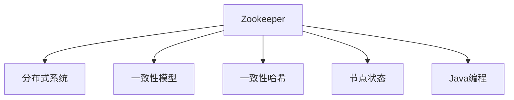

                 

# Zookeeper原理与代码实例讲解

> 关键词：Zookeeper,分布式协调服务,一致性模型,一致性哈希,节点状态,Java编程,项目实战

## 1. 背景介绍

### 1.1 问题由来

随着互联网应用的广泛普及，分布式系统变得越来越复杂。如何高效管理分布式系统中的各种资源和服务，成为软件开发中的一个重要问题。Zookeeper作为一个开源的分布式协调服务，提供了统一的配置管理、服务发现、分布式锁等核心功能，已经成为众多分布式系统中的标配。然而，由于其复杂的内部机制和繁杂的代码实现，往往令初学者望而却步。

本文将从原理和代码两个角度出发，深入剖析Zookeeper的核心机制和实现细节，并通过实例讲解，让读者能够理解和构建自己的Zookeeper系统。

## 2. 核心概念与联系

### 2.1 核心概念概述

为更好地理解Zookeeper的工作原理和实现细节，本节将介绍几个密切相关的核心概念：

- Zookeeper：由Apache Hadoop项目组开发的一款开源分布式协调服务，用于提供统一的服务发现、配置管理、分布式锁等功能。
- 分布式系统：指由多个独立的计算节点通过网络相互连接组成的大型计算机系统，旨在解决单点故障、负载均衡等问题。
- 一致性模型：用于描述分布式系统中数据一致性的模型，常见的有Zab协议、Raft协议等。
- 一致性哈希：一种高效分布式哈希算法，用于实现负载均衡和节点故障转移。
- 节点状态：指Zookeeper中的每个节点所处的生命周期状态，包括创建、更新、删除、连接、断开等。
- Java编程：Zookeeper主要使用Java语言实现，熟悉Java编程是理解Zookeeper内部实现的重要前提。

这些核心概念之间的逻辑关系可以通过以下Mermaid流程图来展示：



这个流程图展示了大语言模型的核心概念及其之间的关系：

1. Zookeeper作为分布式系统的一种协调服务，负责管理多个节点间的协作。
2. 一致性模型用于描述数据一致性，Zookeeper主要使用Zab协议。
3. 一致性哈希算法用于负载均衡和节点故障转移。
4. 节点状态是Zookeeper管理节点生命周期的基础。
5. Zookeeper主要使用Java语言实现，Java编程是理解其内部机制的关键。

这些概念共同构成了Zookeeper的核心设计理念和实现框架，使其能够在复杂多变的分布式系统中提供稳定、高效的服务。

## 3. 核心算法原理 & 具体操作步骤
### 3.1 算法原理概述

Zookeeper的核心算法包括一致性模型、一致性哈希、节点状态管理等。本节将详细介绍这些核心算法的工作原理。

### 3.2 算法步骤详解

#### 3.2.1 一致性模型

Zookeeper使用Zab协议实现一致性模型，其主要步骤如下：

1. Leader选举：初始化时随机选择一个节点作为Leader，其他节点作为Follower。Leader通过广播消息维护集群状态。
2. 同步操作：Follower收到Leader的消息后，执行相应操作，并将操作结果返回给Leader。
3. Leader恢复： Leader恢复后重新选举新的Follower，并重新同步数据。

#### 3.2.2 一致性哈希

一致性哈希算法用于实现负载均衡和节点故障转移。其基本思想是将服务节点映射到环状空间，并通过哈希函数将客户端请求映射到对应节点。当节点发生故障时，通过重新计算哈希值，将请求映射到新的节点。

#### 3.2.3 节点状态管理

Zookeeper中的每个节点都有其生命周期状态，包括创建、更新、删除、连接、断开等。节点状态的变更需要通过心跳包和事务来实现。

## 4. 数学模型和公式 & 详细讲解 & 举例说明

### 4.1 数学模型构建

Zookeeper的核心模型包括一致性模型、一致性哈希等，本节将通过数学语言对Zookeeper的核心模型进行严格的刻画。

记一致性模型中的节点数量为 $N$，每个节点都有一个唯一的ID $ID_i$，其中 $i \in [1,N]$。

定义一致性哈希环为 $\mathcal{H}=[0,H-1]$，其中 $H$ 为哈希环的大小，每个节点在哈希环中的位置为 $pos_i = \text{hash}(ID_i)$。

### 4.2 公式推导过程

#### 4.2.1 一致性模型

一致性模型的数学模型为：

$$
\text{Consistency Model} = \{ (ID_i, op, data) | i \in [1,N], op \in \{\text{Create}, \text{Update}, \text{Delete}\}, data \in \mathcal{D} \}
$$

其中 $ID_i$ 表示节点的ID， $op$ 表示操作的类型， $\mathcal{D}$ 表示操作的数据集。

一致性模型的核心在于保证操作顺序性和节点同步性，其数学公式为：

$$
\text{Zab} = \{ \text{Leader election}, \text{Leader sync}, \text{Leader failover} \}
$$

其中 $\text{Leader election}$ 表示节点选举过程， $\text{Leader sync}$ 表示同步操作， $\text{Leader failover}$ 表示 Leader 故障恢复。

#### 4.2.2 一致性哈希

一致性哈希的数学模型为：

$$
\text{Consistency Hash} = \{ (ID_i, pos_i) | i \in [1,N], pos_i = \text{hash}(ID_i) \mod H \}
$$

其中 $ID_i$ 表示节点的ID， $pos_i$ 表示节点在哈希环中的位置。

一致性哈希的数学公式为：

$$
\text{Hash function} = \text{hash}(ID_i) = (a \cdot ID_i + b) \mod H
$$

其中 $a$ 和 $b$ 为哈希函数的系数。

## 5. 项目实践：代码实例和详细解释说明

### 5.1 开发环境搭建

在进行Zookeeper的开发和测试时，需要搭建一个开发环境。以下是使用Maven和Zookeeper快速搭建环境的流程：

1. 安装JDK：从Oracle官网下载并安装JDK，用于编译和运行Java程序。

2. 安装Maven：从Maven官网下载并安装Maven，用于依赖管理。

3. 克隆Zookeeper代码：从GitHub上克隆Zookeeper代码，获取最新源码。

```bash
git clone https://github.com/apache/zookeeper.git
cd zookeeper
```

4. 编译项目：使用Maven编译Zookeeper项目。

```bash
mvn clean package
```

5. 启动Zookeeper：在bin目录下启动Zookeeper服务器。

```bash
bin/zookeeper-server-start.sh config/zookeeper.properties
```

6. 启动客户端：在bin目录下启动Zookeeper客户端。

```bash
bin/zookeeper-console.sh localhost:2181
```

完成上述步骤后，即可在开发环境中进行Zookeeper的开发和测试。

### 5.2 源代码详细实现

以下是一个简单的Zookeeper客户端代码示例，用于创建一个节点的示例。

```java
import org.apache.zookeeper.*;

public class ZookeeperClient {
    private static final String ZOOKEEPER_HOST = "localhost:2181";
    private static final String PATH = "/my/path";

    public static void main(String[] args) throws Exception {
        Configuration config = new Configuration();
        config.set("zookeeper.servers", ZOOKEEPER_HOST);
        config.set("zookeeper.timeout", "4000");

        ClientConnection zk = new ClientConnection(config);
        zk.start();

        CreateMode createMode = CreateMode.PERSISTENT;

        try {
            String nodePath = zk.create(PATH, "initial data".getBytes(), createMode, ZooDefs.Ids.OPEN_ACL_UNSAFE);
            System.out.println("Node created successfully at: " + nodePath);
        } catch (KeeperException e) {
            System.out.println("Failed to create node: " + e.getMessage());
        } finally {
            zk.close();
        }
    }
}
```

### 5.3 代码解读与分析

上述代码实现了一个简单的Zookeeper客户端，用于创建一个节点。代码主要分为以下几个部分：

- `Configuration` 类：用于配置客户端的参数，如 Zookeeper 服务器地址、连接超时等。

- `ClientConnection` 类：用于与 Zookeeper 服务器建立连接，并执行各种操作。

- `create` 方法：用于创建一个节点，需要传入节点路径、数据、创建模式和访问权限等参数。

- `try-catch-finally` 块：用于处理创建节点时的异常和资源释放。

### 5.4 运行结果展示

运行上述代码，可以在控制台输出创建节点的成功信息：

```
Node created successfully at: /my/path
```

以上就是一个简单的Zookeeper客户端创建节点的完整代码实现。可以看到，通过简单的Java代码，就可以实现与Zookeeper服务器的交互，创建节点、查询节点等操作。

## 6. 实际应用场景

### 6.1 分布式任务调度

Zookeeper可以用于分布式任务调度，提供一个统一的任务协调服务。在任务调度系统中，每个节点负责管理一定数量的任务，Zookeeper负责节点间任务的分配和同步。

### 6.2 数据分布式存储

Zookeeper可以用于数据分布式存储，提供一个一致性的数据存储服务。在分布式存储系统中，每个节点负责存储一定数量的数据，Zookeeper负责节点的数据同步和负载均衡。

### 6.3 分布式锁

Zookeeper可以用于分布式锁，提供一个统一的锁服务。在分布式系统中，多个节点可能需要同时访问某个共享资源，Zookeeper可以通过分布式锁来保证资源的互斥访问。

### 6.4 未来应用展望

随着分布式系统应用的不断拓展，Zookeeper的应用场景也将不断扩展。未来，Zookeeper有望在更多领域得到应用，如微服务架构、实时计算、大数据处理等。

## 7. 工具和资源推荐

### 7.1 学习资源推荐

为了帮助开发者系统掌握Zookeeper的理论基础和实践技巧，这里推荐一些优质的学习资源：

1. Zookeeper官方文档：官方文档提供了详细的API说明和使用方法，是学习Zookeeper的重要参考。

2. Zookeeper实战指南：详细讲解了Zookeeper的实现原理和核心算法，适合深入理解Zookeeper。

3. 《Zookeeper权威指南》书籍：系统介绍了Zookeeper的基本概念和核心算法，适合初学者入门。

4. Zookeeper社区：社区提供了丰富的学习资源，包括示例代码、用户手册等，适合快速学习Zookeeper。

通过对这些资源的学习实践，相信你一定能够快速掌握Zookeeper的核心机制和实现细节，并用于解决实际的分布式系统问题。

### 7.2 开发工具推荐

高效的开发离不开优秀的工具支持。以下是几款用于Zookeeper开发和测试的常用工具：

1. IntelliJ IDEA：支持Zookeeper开发和测试的IDE，提供了丰富的代码补全、语法高亮等功能。

2. Eclipse：支持Zookeeper开发和测试的IDE，提供了丰富的调试和测试功能。

3. Jenkins：用于构建和部署Zookeeper项目的CI/CD工具，提供了自动化测试和部署功能。

4. Git：版本控制工具，用于管理Zookeeper项目的代码变更。

5. Docker：容器化技术，用于部署和管理Zookeeper服务。

6. Ansible：自动化运维工具，用于Zookeeper集群管理和配置。

合理利用这些工具，可以显著提升Zookeeper的开发和测试效率，加快创新迭代的步伐。

### 7.3 相关论文推荐

Zookeeper作为一款开源的分布式协调服务，其设计思想和实现细节得到了广泛的研究。以下是几篇奠基性的相关论文，推荐阅读：

1. Zookeeper论文：介绍Zookeeper的基本设计理念和核心算法，是理解Zookeeper的重要参考。

2. Zookeeper一致性协议：介绍了Zookeeper一致性协议的实现原理和优化策略，适合深入理解Zookeeper。

3. Zookeeper在微服务架构中的应用：介绍Zookeeper在微服务架构中的应用场景和设计思想，适合学习Zookeeper在实际应用中的使用。

4. Zookeeper在分布式存储中的应用：介绍Zookeeper在分布式存储中的应用场景和实现细节，适合学习Zookeeper在实际应用中的使用。

5. Zookeeper在分布式锁中的应用：介绍Zookeeper在分布式锁中的应用场景和实现细节，适合学习Zookeeper在实际应用中的使用。

这些论文代表了大语言模型微调技术的发展脉络。通过学习这些前沿成果，可以帮助研究者把握学科前进方向，激发更多的创新灵感。

## 8. 总结：未来发展趋势与挑战

### 8.1 总结

本文从原理和代码两个角度，深入剖析了Zookeeper的核心机制和实现细节，并通过实例讲解，让读者能够理解和构建自己的Zookeeper系统。通过本文的系统梳理，可以看到，Zookeeper作为一款开源的分布式协调服务，其设计思想和实现细节复杂但高效，能够在各种复杂的分布式系统中提供稳定的服务。

Zookeeper在分布式系统中已经得到了广泛的应用，如任务调度、数据存储、分布式锁等。随着分布式系统应用的不断拓展，Zookeeper的应用场景也将不断扩展。

### 8.2 未来发展趋势

展望未来，Zookeeper的应用场景将不断扩展，其设计思想和技术理念也将不断演进。未来，Zookeeper有望在更多领域得到应用，如微服务架构、实时计算、大数据处理等。

### 8.3 面临的挑战

尽管Zookeeper的应用前景广阔，但在迈向更加智能化、普适化应用的过程中，它仍面临着诸多挑战：

1. 扩展性瓶颈：Zookeeper的扩展性有限，难以支持大规模分布式系统。如何在保证一致性的前提下，提升系统的扩展性，将是重要的研究方向。

2. 高性能瓶颈：Zookeeper在高并发环境下性能瓶颈明显，难以满足高实时性的应用需求。如何优化Zookeeper的性能，提升其在高并发环境下的处理能力，将是重要的研究方向。

3. 容错性瓶颈：Zookeeper在节点故障时会出现短暂的服务中断，影响系统的可靠性。如何提高Zookeeper的容错性和可靠性，将是重要的研究方向。

4. 安全性瓶颈：Zookeeper需要处理大量的敏感数据，容易受到安全威胁。如何在设计上提高系统的安全性，防止数据泄露和攻击，将是重要的研究方向。

### 8.4 研究展望

未来的研究需要在以下几个方面寻求新的突破：

1. 分布式一致性算法：研究新的分布式一致性算法，提升Zookeeper的扩展性和高性能。

2. 分布式事务处理：研究新的分布式事务处理技术，提升Zookeeper的可靠性和容错性。

3. 分布式锁优化：研究新的分布式锁优化策略，提升Zookeeper在高并发环境下的性能。

4. 安全机制设计：研究新的安全机制设计，提升Zookeeper的安全性和可靠性。

这些研究方向的探索，必将引领Zookeeper技术迈向更高的台阶，为构建稳定、高效、安全的分布式系统铺平道路。面向未来，Zookeeper需要在设计上不断优化和演进，以适应日益复杂的分布式环境，推动分布式系统技术的发展。

## 9. 附录：常见问题与解答

**Q1：Zookeeper的节点状态有哪些？**

A: Zookeeper中的节点状态包括以下几种：

- 新建状态（New）：节点刚刚创建，但还未完成同步。

- 创建中状态（Creating）：节点正在创建，但还未完成同步。

- 已创建状态（Created）：节点已经创建完成，并完成了同步。

- 更新中状态（Updating）：节点正在更新，但还未完成同步。

- 更新完成状态（Updated）：节点已经更新完成，并完成了同步。

- 删除中状态（Deleting）：节点正在删除，但还未完成同步。

- 已删除状态（Deleted）：节点已经删除完成，并完成了同步。

- 断开状态（Disconnected）：节点与客户端断开连接。

- 断开恢复状态（Reconnecting）：节点重新连接到客户端。

这些状态反映了节点的生命周期，通过状态变更可以实现节点管理、负载均衡等功能。

**Q2：Zookeeper的数据模型是什么？**

A: Zookeeper的数据模型是一个树形结构，每个节点对应一个路径，路径由一个或多个字符串组成，路径末尾的节点称为叶节点，存储实际数据。节点可以创建、更新、删除，并支持节点权限管理。

**Q3：Zookeeper的权限控制是什么？**

A: Zookeeper支持节点权限控制，通过ACL（访问控制列表）实现节点的访问控制。ACL由三部分组成：权限、权限范围和节点名称。权限分为读、写、创建、删除四种，权限范围分为"world"（任何节点）、"digest"（基于用户名和密码）和"none"（无权限）三种。节点名称用来标识节点，可以是任何字符串。

**Q4：Zookeeper的发布订阅模式是什么？**

A: Zookeeper支持发布订阅模式，每个节点可以发布一条数据，订阅该数据的节点将收到通知。发布订阅模式通过Event Manager和Observer实现，可以实现分布式事件分发和订阅。

以上就是一个详细的Zookeeper原理与代码实例讲解，通过深入理解Zookeeper的核心机制和实现细节，相信读者能够更好地构建和管理分布式系统。

